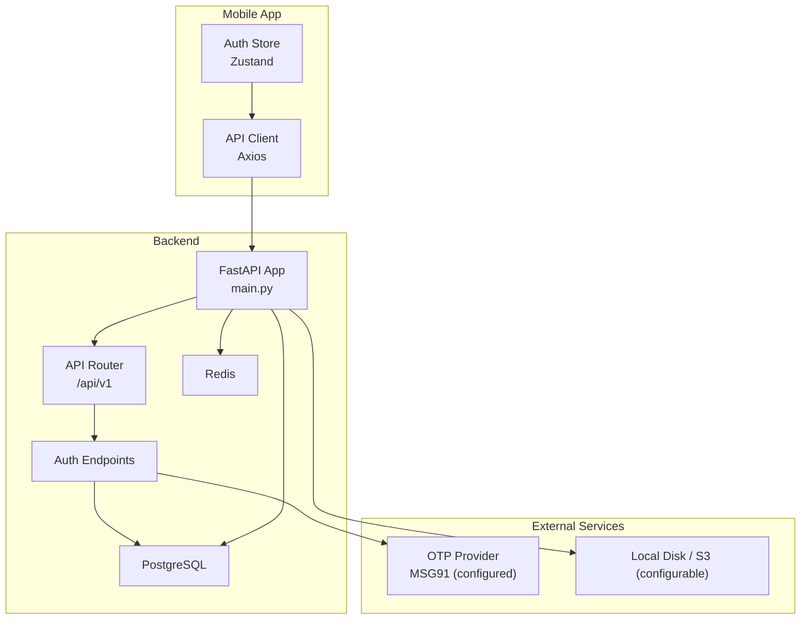
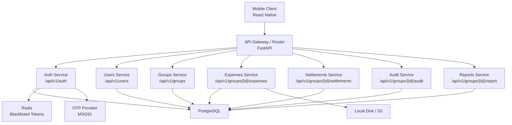
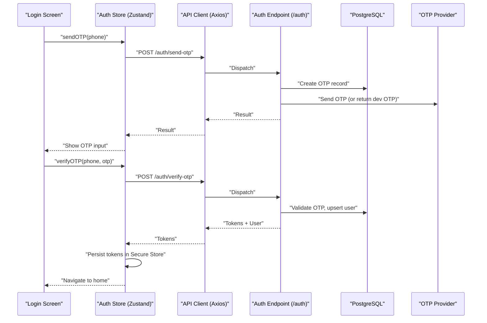
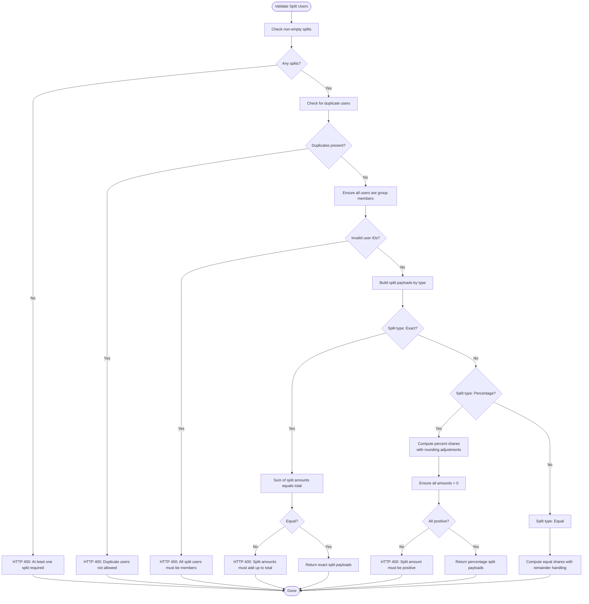
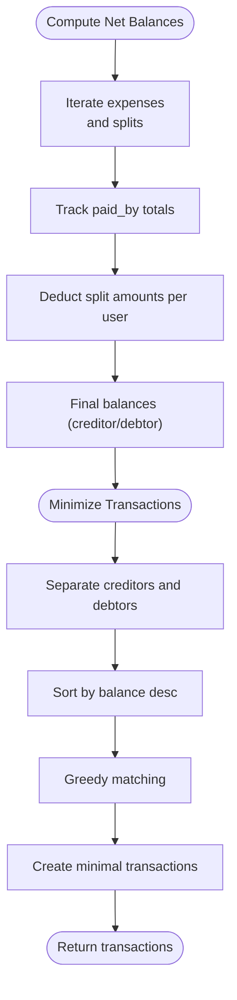
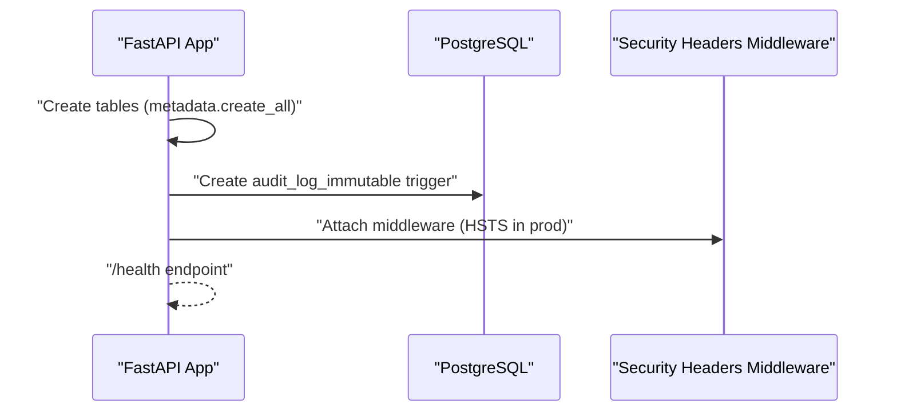
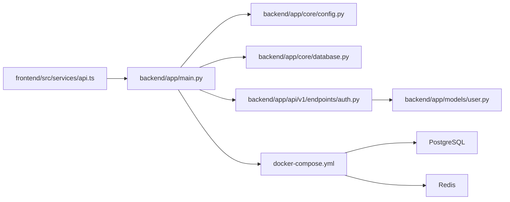

# Architecture Overview

<cite>
**Referenced Files in This Document**
- [README.md](file://README.md)
- [docker-compose.yml](file://docker-compose.yml)
- [backend/Dockerfile](file://backend/Dockerfile)
- [backend/app/main.py](file://backend/app/main.py)
- [backend/app/core/config.py](file://backend/app/core/config.py)
- [backend/app/core/database.py](file://backend/app/core/database.py)
- [backend/app/api/v1/__init__.py](file://backend/app/api/v1/__init__.py)
- [backend/app/api/v1/endpoints/auth.py](file://backend/app/api/v1/endpoints/auth.py)
- [backend/app/models/user.py](file://backend/app/models/user.py)
- [backend/app/services/expense_service.py](file://backend/app/services/expense_service.py)
- [backend/app/services/settlement_engine.py](file://backend/app/services/settlement_engine.py)
- [backend/requirements.txt](file://backend/requirements.txt)
- [frontend/package.json](file://frontend/package.json)
- [frontend/src/services/api.ts](file://frontend/src/services/api.ts)
- [frontend/src/store/authStore.ts](file://frontend/src/store/authStore.ts)
</cite>

## Table of Contents
1. [Introduction](#introduction)
2. [Project Structure](#project-structure)
3. [Core Components](#core-components)
4. [Architecture Overview](#architecture-overview)
5. [Detailed Component Analysis](#detailed-component-analysis)
6. [Dependency Analysis](#dependency-analysis)
7. [Performance Considerations](#performance-considerations)
8. [Troubleshooting Guide](#troubleshooting-guide)
9. [Conclusion](#conclusion)
10. [Appendices](#appendices)

## Introduction
SplitSure is a mobile-first shared-expense application designed for group expense tracking, optimized settlement suggestions, and immutable auditability. The system emphasizes:
- Mobile-first UX powered by React Native and Expo Router
- A secure, standards-aligned backend built with FastAPI
- PostgreSQL for reliable relational persistence
- Containerized deployment with Docker and orchestrated services

Key production flows include OTP-based authentication, group lifecycle management, expense creation with proof attachments, balance computation, settlement initiation and resolution, immutable audit logs, and optional paid-tier report exports.

## Project Structure
The repository is organized into three primary areas:
- backend: FastAPI application with async SQLAlchemy ORM, routing, services, and models
- frontend: React Native mobile app using Expo Router, React Query, and Zustand for state
- design_refs: Conceptual design artifacts (outside scope of current implementation)

**Diagram sources**
- [backend/app/main.py:16-56](file://backend/app/main.py#L16-L56)
- [backend/app/api/v1/__init__.py:1-12](file://backend/app/api/v1/__init__.py#L1-L12)
- [backend/app/api/v1/endpoints/auth.py:1-147](file://backend/app/api/v1/endpoints/auth.py#L1-L147)
- [backend/app/core/database.py:1-29](file://backend/app/core/database.py#L1-L29)
- [backend/app/core/config.py:1-71](file://backend/app/core/config.py#L1-L71)
- [frontend/src/services/api.ts:1-269](file://frontend/src/services/api.ts#L1-L269)
- [frontend/src/store/authStore.ts:1-116](file://frontend/src/store/authStore.ts#L1-L116)

**Section sources**
- [README.md:1-162](file://README.md#L1-L162)
- [docker-compose.yml:1-82](file://docker-compose.yml#L1-L82)
- [backend/Dockerfile:1-15](file://backend/Dockerfile#L1-L15)

## Core Components
- Mobile App (React Native + Expo)
  - Authentication flow via OTP with automatic token refresh
  - Centralized API client with interceptors for auth and retry
  - Persistent state using Zustand and secure storage via Expo Secure Store
- Backend API (FastAPI)
  - Modular endpoint routing under /api/v1
  - Async database sessions and security middleware
  - Built-in health checks and static file serving for local proofs
- Database (PostgreSQL)
  - Strongly-typed models for users, groups, expenses, splits, settlements, audit logs, and attachments
  - Append-only audit logs enforced by a database trigger
- Infrastructure
  - Docker Compose orchestrating Postgres, Redis, and the FastAPI service
  - Optional S3 integration for production file storage

**Section sources**
- [frontend/src/services/api.ts:1-269](file://frontend/src/services/api.ts#L1-L269)
- [frontend/src/store/authStore.ts:1-116](file://frontend/src/store/authStore.ts#L1-L116)
- [backend/app/main.py:16-96](file://backend/app/main.py#L16-L96)
- [backend/app/api/v1/__init__.py:1-12](file://backend/app/api/v1/__init__.py#L1-L12)
- [backend/app/models/user.py:1-234](file://backend/app/models/user.py#L1-L234)
- [backend/app/core/database.py:1-29](file://backend/app/core/database.py#L1-L29)
- [docker-compose.yml:1-82](file://docker-compose.yml#L1-L82)

## Architecture Overview
The system follows a clean separation of concerns:
- Mobile app handles UI, offline-friendly UX, and token lifecycle
- Backend enforces authentication, authorization, and business logic
- Database persists structured data with immutability guarantees for audit logs
- Optional external services (OTP provider) and storage (local/S3) are configurable

**Diagram sources**
- [backend/app/api/v1/__init__.py:1-12](file://backend/app/api/v1/__init__.py#L1-L12)
- [backend/app/api/v1/endpoints/auth.py:1-147](file://backend/app/api/v1/endpoints/auth.py#L1-L147)
- [backend/app/models/user.py:1-234](file://backend/app/models/user.py#L1-L234)
- [backend/app/core/database.py:1-29](file://backend/app/core/database.py#L1-L29)
- [backend/app/core/config.py:1-71](file://backend/app/core/config.py#L1-L71)
- [docker-compose.yml:1-82](file://docker-compose.yml#L1-L82)

## Detailed Component Analysis

### Mobile App Authentication Flow
The mobile app authenticates users via OTP, manages tokens securely, and refreshes them transparently when needed.

**Diagram sources**
- [frontend/src/store/authStore.ts:29-80](file://frontend/src/store/authStore.ts#L29-L80)
- [frontend/src/services/api.ts:142-169](file://frontend/src/services/api.ts#L142-L169)
- [backend/app/api/v1/endpoints/auth.py:58-116](file://backend/app/api/v1/endpoints/auth.py#L58-L116)
- [backend/app/models/user.py:51-88](file://backend/app/models/user.py#L51-L88)

**Section sources**
- [frontend/src/store/authStore.ts:1-116](file://frontend/src/store/authStore.ts#L1-L116)
- [frontend/src/services/api.ts:1-269](file://frontend/src/services/api.ts#L1-L269)
- [backend/app/api/v1/endpoints/auth.py:1-147](file://backend/app/api/v1/endpoints/auth.py#L1-L147)

### Expense Split Validation and Payload Construction
The backend validates split configurations and constructs payloads ensuring financial correctness.

**Diagram sources**
- [backend/app/services/expense_service.py:7-79](file://backend/app/services/expense_service.py#L7-L79)

**Section sources**
- [backend/app/services/expense_service.py:1-79](file://backend/app/services/expense_service.py#L1-L79)

### Settlement Engine: Balance Optimization
The settlement engine computes net balances and minimizes transactions using a greedy algorithm.

**Diagram sources**
- [backend/app/services/settlement_engine.py:23-98](file://backend/app/services/settlement_engine.py#L23-L98)

**Section sources**
- [backend/app/services/settlement_engine.py:1-106](file://backend/app/services/settlement_engine.py#L1-L106)

### Backend Startup and Security Middleware
On startup, the backend initializes database tables, sets up an immutable audit trigger, and applies security headers.

**Diagram sources**
- [backend/app/main.py:59-96](file://backend/app/main.py#L59-L96)

**Section sources**
- [backend/app/main.py:16-96](file://backend/app/main.py#L16-L96)

## Dependency Analysis
- Mobile app depends on:
  - API base URL configured via environment variable
  - Secure storage for tokens
  - Axios interceptors for auth and refresh
- Backend depends on:
  - PostgreSQL for persistence
  - Redis for blacklisted tokens
  - Optional external OTP provider and S3-compatible storage
- Container orchestration ties all services together with health checks and persistent volumes.

**Diagram sources**
- [frontend/src/services/api.ts:1-269](file://frontend/src/services/api.ts#L1-L269)
- [backend/app/main.py:1-96](file://backend/app/main.py#L1-L96)
- [backend/app/core/config.py:1-71](file://backend/app/core/config.py#L1-L71)
- [backend/app/core/database.py:1-29](file://backend/app/core/database.py#L1-L29)
- [backend/app/api/v1/endpoints/auth.py:1-147](file://backend/app/api/v1/endpoints/auth.py#L1-L147)
- [backend/app/models/user.py:1-234](file://backend/app/models/user.py#L1-L234)
- [docker-compose.yml:1-82](file://docker-compose.yml#L1-L82)

**Section sources**
- [frontend/package.json:1-62](file://frontend/package.json#L1-L62)
- [backend/requirements.txt:1-19](file://backend/requirements.txt#L1-L19)
- [docker-compose.yml:1-82](file://docker-compose.yml#L1-L82)

## Performance Considerations
- Asynchronous database access with connection pooling reduces latency and improves throughput.
- Integer-based currency representation avoids floating-point precision issues and simplifies calculations.
- Greedy settlement minimization reduces the number of transactions for reconciliation.
- Static file serving for local proofs reduces external dependencies during development; production should leverage S3 for scalability and durability.
- Redis-backed token blacklist enables immediate logout invalidation without relying on token expiration.

[No sources needed since this section provides general guidance]

## Troubleshooting Guide
Common operational issues and resolutions:
- Backend health and environment
  - Use the health endpoint to verify service status and storage mode.
  - Confirm environment variables for database, Redis, OTP, and storage are set appropriately.
- Authentication failures
  - Ensure tokens are present in secure storage and refreshed automatically on 401 responses.
  - On refresh failure, the client clears session state; re-authenticate.
- Database immutability
  - Audit logs are append-only; modifications or deletions are blocked by a database trigger.
- Development vs production
  - Development uses local storage and optional dev OTP; production requires S3 and a real OTP provider.

**Section sources**
- [backend/app/main.py:88-96](file://backend/app/main.py#L88-L96)
- [backend/app/core/config.py:1-71](file://backend/app/core/config.py#L1-L71)
- [frontend/src/services/api.ts:85-140](file://frontend/src/services/api.ts#L85-L140)
- [frontend/src/store/authStore.ts:113-116](file://frontend/src/store/authStore.ts#L113-L116)
- [backend/app/models/user.py:184-199](file://backend/app/models/user.py#L184-L199)

## Conclusion
SplitSure’s architecture cleanly separates the mobile UX from a robust backend API, backed by PostgreSQL and containerized infrastructure. The chosen technologies—FastAPI, React Native, and PostgreSQL—enable rapid iteration, strong typing, and maintainable business logic. Security is layered through JWT-based auth, token refresh, rate-limited OTP, and immutable audit logs. With Docker orchestration and optional S3 storage, the system is production-ready with clear extension points for monitoring, observability, and advanced integrations.

[No sources needed since this section summarizes without analyzing specific files]

## Appendices

### Technology Stack Integration Patterns
- Authentication
  - JWT access/refresh tokens with secure storage and automatic refresh
  - OTP verification with rate limiting and hashing
- Authorization
  - Route-level bearer token enforcement
  - Role-based group membership for resource access
- Data Persistence
  - Async SQLAlchemy ORM with typed models
  - Append-only audit logs via database triggers
- External Integrations
  - OTP provider (MSG91) for production-grade SMS
  - Local disk or S3 for proof attachments
- Frontend Integration
  - Axios interceptors for auth and retry
  - Zustand for centralized state and push token registration

**Section sources**
- [backend/app/api/v1/endpoints/auth.py:1-147](file://backend/app/api/v1/endpoints/auth.py#L1-L147)
- [backend/app/models/user.py:1-234](file://backend/app/models/user.py#L1-L234)
- [frontend/src/services/api.ts:1-269](file://frontend/src/services/api.ts#L1-L269)
- [frontend/src/store/authStore.ts:1-116](file://frontend/src/store/authStore.ts#L1-L116)
- [backend/app/core/config.py:1-71](file://backend/app/core/config.py#L1-L71)

### Deployment Topology and Infrastructure Requirements
- Containers
  - PostgreSQL: persistent relational database
  - Redis: token blacklist and caching
  - FastAPI: application server with hot reload in development
- Networking
  - Port exposure and CORS configuration for development origins
- Storage
  - Named volumes for database and uploaded files
- Environment Variables
  - Database URL, Redis URL, secret keys, OTP provider credentials, and storage settings

**Section sources**
- [docker-compose.yml:1-82](file://docker-compose.yml#L1-L82)
- [backend/Dockerfile:1-15](file://backend/Dockerfile#L1-L15)
- [backend/app/core/config.py:1-71](file://backend/app/core/config.py#L1-L71)
- [backend/app/main.py:48-56](file://backend/app/main.py#L48-L56)