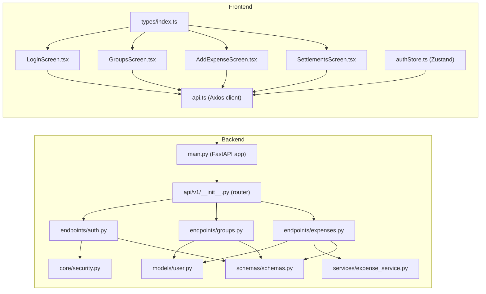
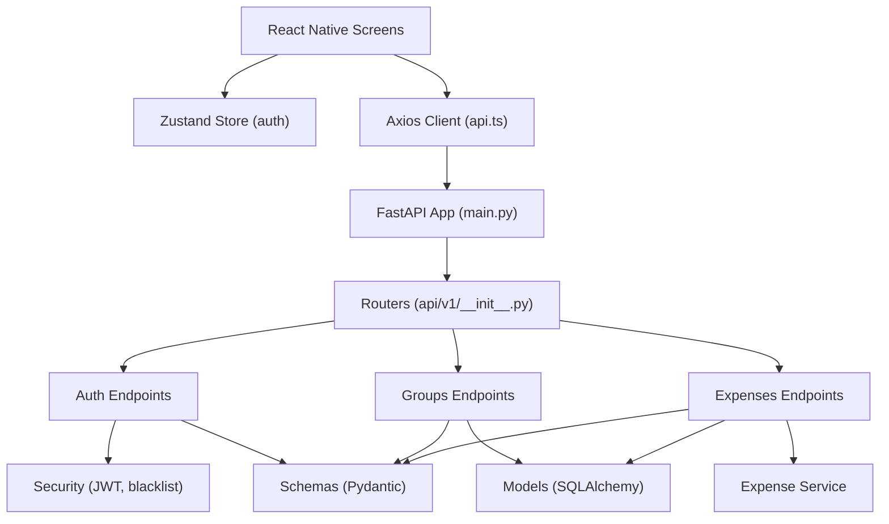
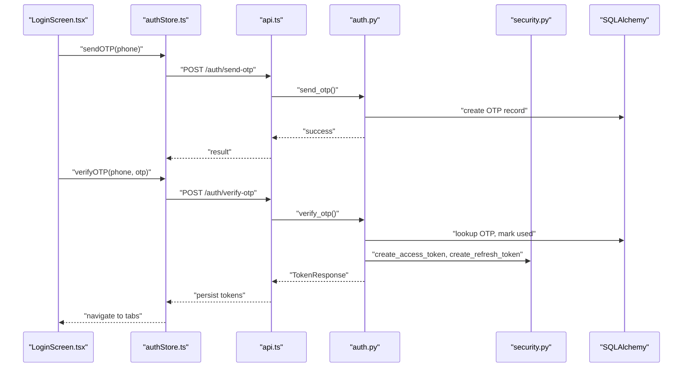
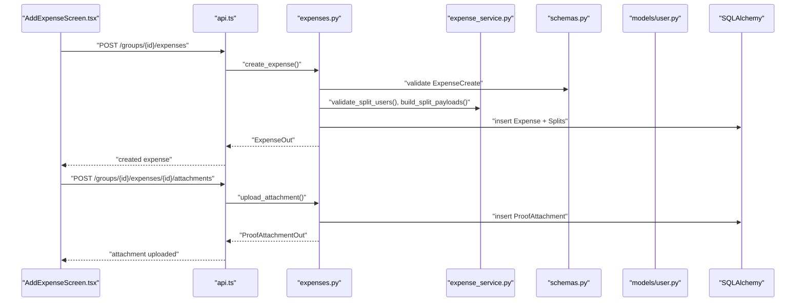
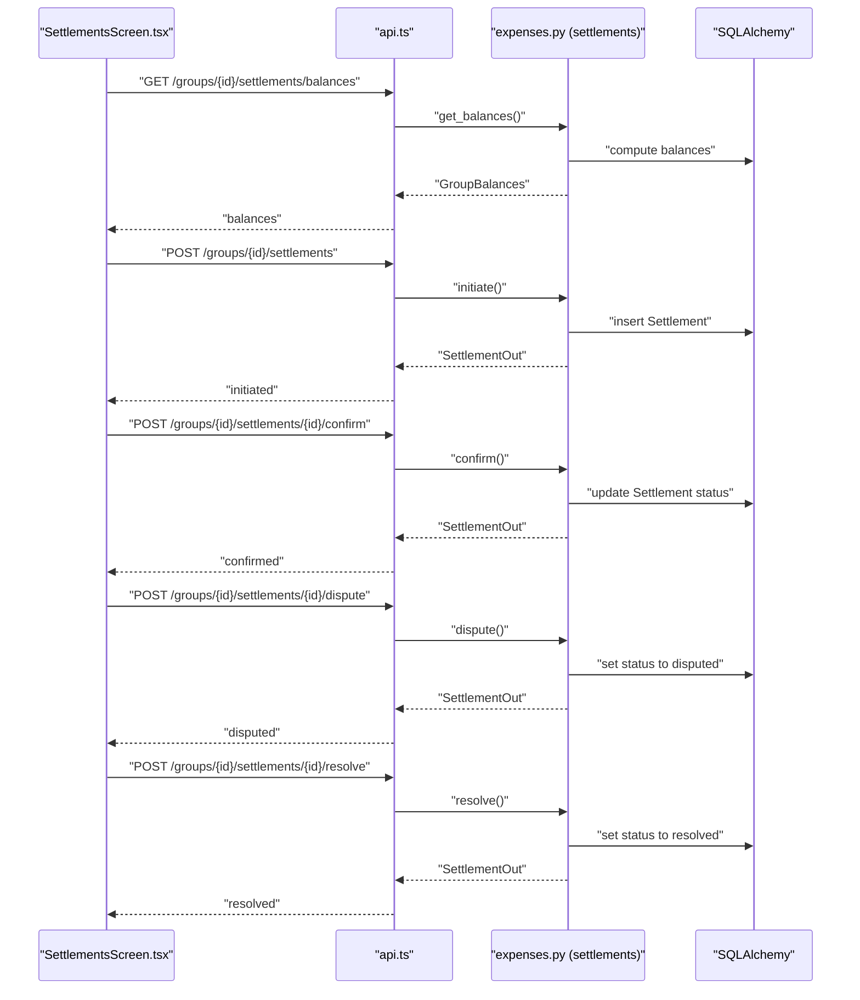
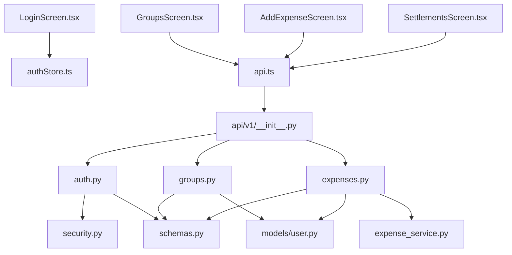
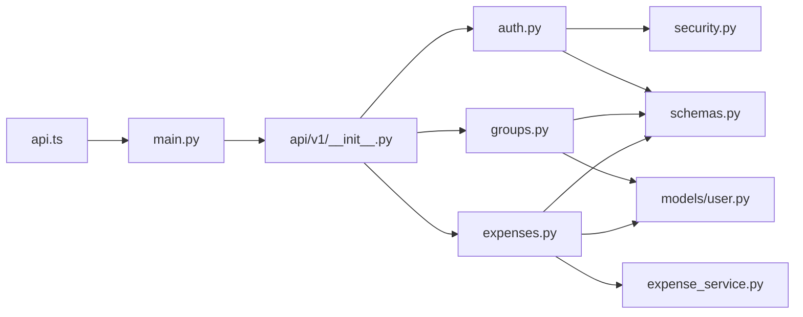

# Component Relationships

<cite>
**Referenced Files in This Document**
- [backend/app/main.py](file://backend/app/main.py)
- [backend/app/api/v1/__init__.py](file://backend/app/api/v1/__init__.py)
- [backend/app/api/v1/endpoints/auth.py](file://backend/app/api/v1/endpoints/auth.py)
- [backend/app/api/v1/endpoints/groups.py](file://backend/app/api/v1/endpoints/groups.py)
- [backend/app/api/v1/endpoints/expenses.py](file://backend/app/api/v1/endpoints/expenses.py)
- [backend/app/schemas/schemas.py](file://backend/app/schemas/schemas.py)
- [backend/app/models/user.py](file://backend/app/models/user.py)
- [backend/app/services/expense_service.py](file://backend/app/services/expense_service.py)
- [backend/app/core/security.py](file://backend/app/core/security.py)
- [frontend/src/services/api.ts](file://frontend/src/services/api.ts)
- [frontend/src/store/authStore.ts](file://frontend/src/store/authStore.ts)
- [frontend/src/screens/LoginScreen.tsx](file://frontend/src/screens/LoginScreen.tsx)
- [frontend/src/screens/GroupsScreen.tsx](file://frontend/src/screens/GroupsScreen.tsx)
- [frontend/src/screens/AddExpenseScreen.tsx](file://frontend/src/screens/AddExpenseScreen.tsx)
- [frontend/src/screens/SettlementsScreen.tsx](file://frontend/src/screens/SettlementsScreen.tsx)
- [frontend/src/types/index.ts](file://frontend/src/types/index.ts)
</cite>

## Table of Contents
1. [Introduction](#introduction)
2. [Project Structure](#project-structure)
3. [Core Components](#core-components)
4. [Architecture Overview](#architecture-overview)
5. [Detailed Component Analysis](#detailed-component-analysis)
6. [Dependency Analysis](#dependency-analysis)
7. [Performance Considerations](#performance-considerations)
8. [Troubleshooting Guide](#troubleshooting-guide)
9. [Conclusion](#conclusion)

## Introduction
This document explains the component relationships in the SplitSure system, focusing on how frontend React Native components interact with backend FastAPI services. It details the data flow from mobile UI components through API endpoints to business services and database operations, and documents the dependency relationships among authentication middleware, service layers, and data models. It also provides sequence diagrams for typical user workflows (authentication, expense creation, and settlement processing) and discusses decoupling strategies and communication patterns used in the system.

## Project Structure
The system comprises:
- Frontend (React Native): Screens, services, stores, and typed models.
- Backend (FastAPI): Routers, endpoints, schemas, models, services, and core utilities.

**Diagram sources**
- [backend/app/main.py:1-96](file://backend/app/main.py#L1-L96)
- [backend/app/api/v1/__init__.py:1-12](file://backend/app/api/v1/__init__.py#L1-L12)
- [backend/app/api/v1/endpoints/auth.py:1-147](file://backend/app/api/v1/endpoints/auth.py#L1-L147)
- [backend/app/api/v1/endpoints/groups.py:1-350](file://backend/app/api/v1/endpoints/groups.py#L1-L350)
- [backend/app/api/v1/endpoints/expenses.py:1-395](file://backend/app/api/v1/endpoints/expenses.py#L1-L395)
- [backend/app/schemas/schemas.py:1-432](file://backend/app/schemas/schemas.py#L1-L432)
- [backend/app/models/user.py:1-234](file://backend/app/models/user.py#L1-L234)
- [backend/app/services/expense_service.py:1-79](file://backend/app/services/expense_service.py#L1-L79)
- [backend/app/core/security.py:1-96](file://backend/app/core/security.py#L1-L96)
- [frontend/src/services/api.ts:1-271](file://frontend/src/services/api.ts#L1-L271)
- [frontend/src/store/authStore.ts:1-116](file://frontend/src/store/authStore.ts#L1-L116)
- [frontend/src/screens/LoginScreen.tsx:1-402](file://frontend/src/screens/LoginScreen.tsx#L1-L402)
- [frontend/src/screens/GroupsScreen.tsx:1-292](file://frontend/src/screens/GroupsScreen.tsx#L1-L292)
- [frontend/src/screens/AddExpenseScreen.tsx:1-421](file://frontend/src/screens/AddExpenseScreen.tsx#L1-L421)
- [frontend/src/screens/SettlementsScreen.tsx:1-589](file://frontend/src/screens/SettlementsScreen.tsx#L1-L589)
- [frontend/src/types/index.ts:1-175](file://frontend/src/types/index.ts#L1-L175)

**Section sources**
- [backend/app/main.py:1-96](file://backend/app/main.py#L1-L96)
- [backend/app/api/v1/__init__.py:1-12](file://backend/app/api/v1/__init__.py#L1-L12)
- [frontend/src/services/api.ts:1-271](file://frontend/src/services/api.ts#L1-L271)
- [frontend/src/store/authStore.ts:1-116](file://frontend/src/store/authStore.ts#L1-L116)
- [frontend/src/types/index.ts:1-175](file://frontend/src/types/index.ts#L1-L175)

## Core Components
- Frontend API client: Centralized Axios instance with interceptors for auth tokens, retries, and automatic refresh.
- Authentication store: Zustand store managing session lifecycle, token persistence, and user profile hydration.
- Screen components: UI-driven orchestration of queries, mutations, and navigation.
- Backend routers: Modular API routers for auth, groups, expenses, settlements, audit, and reports.
- Endpoints: Route handlers implementing business logic with schema validation and service integration.
- Services: Business logic utilities (e.g., split calculation, membership checks).
- Models/Schemas: Pydantic models and SQLAlchemy ORM entities defining data contracts and persistence.

Communication patterns:
- Prop drilling is minimized by centralized state (Zustand) and React Query for caching.
- API service integration is encapsulated in a single module for reuse across screens.
- Decoupling is achieved via typed contracts (schemas/models), HTTP APIs, and middleware.

**Section sources**
- [frontend/src/services/api.ts:1-271](file://frontend/src/services/api.ts#L1-L271)
- [frontend/src/store/authStore.ts:1-116](file://frontend/src/store/authStore.ts#L1-L116)
- [frontend/src/screens/LoginScreen.tsx:1-402](file://frontend/src/screens/LoginScreen.tsx#L1-L402)
- [frontend/src/screens/GroupsScreen.tsx:1-292](file://frontend/src/screens/GroupsScreen.tsx#L1-L292)
- [frontend/src/screens/AddExpenseScreen.tsx:1-421](file://frontend/src/screens/AddExpenseScreen.tsx#L1-L421)
- [frontend/src/screens/SettlementsScreen.tsx:1-589](file://frontend/src/screens/SettlementsScreen.tsx#L1-L589)
- [backend/app/api/v1/endpoints/auth.py:1-147](file://backend/app/api/v1/endpoints/auth.py#L1-L147)
- [backend/app/api/v1/endpoints/groups.py:1-350](file://backend/app/api/v1/endpoints/groups.py#L1-L350)
- [backend/app/api/v1/endpoints/expenses.py:1-395](file://backend/app/api/v1/endpoints/expenses.py#L1-L395)
- [backend/app/schemas/schemas.py:1-432](file://backend/app/schemas/schemas.py#L1-L432)
- [backend/app/models/user.py:1-234](file://backend/app/models/user.py#L1-L234)
- [backend/app/services/expense_service.py:1-79](file://backend/app/services/expense_service.py#L1-L79)
- [backend/app/core/security.py:1-96](file://backend/app/core/security.py#L1-L96)

## Architecture Overview
High-level interaction pattern:
- Frontend screens trigger actions via React Query and Zustand.
- API client sends HTTP requests to backend routers.
- Endpoints validate inputs using Pydantic schemas, enforce authorization, and delegate to services.
- Services operate on domain logic and models; database operations are performed via SQLAlchemy.
- Responses are serialized using Pydantic models and returned to the client.

**Diagram sources**
- [backend/app/main.py:1-96](file://backend/app/main.py#L1-L96)
- [backend/app/api/v1/__init__.py:1-12](file://backend/app/api/v1/__init__.py#L1-L12)
- [backend/app/api/v1/endpoints/auth.py:1-147](file://backend/app/api/v1/endpoints/auth.py#L1-L147)
- [backend/app/api/v1/endpoints/groups.py:1-350](file://backend/app/api/v1/endpoints/groups.py#L1-L350)
- [backend/app/api/v1/endpoints/expenses.py:1-395](file://backend/app/api/v1/endpoints/expenses.py#L1-L395)
- [backend/app/core/security.py:1-96](file://backend/app/core/security.py#L1-L96)
- [backend/app/models/user.py:1-234](file://backend/app/models/user.py#L1-L234)
- [backend/app/services/expense_service.py:1-79](file://backend/app/services/expense_service.py#L1-L79)
- [backend/app/schemas/schemas.py:1-432](file://backend/app/schemas/schemas.py#L1-L432)
- [frontend/src/services/api.ts:1-271](file://frontend/src/services/api.ts#L1-L271)
- [frontend/src/store/authStore.ts:1-116](file://frontend/src/store/authStore.ts#L1-L116)

## Detailed Component Analysis

### Authentication Flow: LoginScreen → Auth Endpoints → Security Middleware
This sequence shows how LoginScreen triggers OTP send/verify, how the API validates inputs, and how JWT tokens are issued and refreshed.

**Diagram sources**
- [frontend/src/screens/LoginScreen.tsx:1-402](file://frontend/src/screens/LoginScreen.tsx#L1-L402)
- [frontend/src/store/authStore.ts:1-116](file://frontend/src/store/authStore.ts#L1-L116)
- [frontend/src/services/api.ts:1-271](file://frontend/src/services/api.ts#L1-L271)
- [backend/app/api/v1/endpoints/auth.py:1-147](file://backend/app/api/v1/endpoints/auth.py#L1-L147)
- [backend/app/core/security.py:1-96](file://backend/app/core/security.py#L1-L96)

**Section sources**
- [frontend/src/screens/LoginScreen.tsx:1-402](file://frontend/src/screens/LoginScreen.tsx#L1-L402)
- [frontend/src/store/authStore.ts:1-116](file://frontend/src/store/authStore.ts#L1-L116)
- [frontend/src/services/api.ts:1-271](file://frontend/src/services/api.ts#L1-L271)
- [backend/app/api/v1/endpoints/auth.py:1-147](file://backend/app/api/v1/endpoints/auth.py#L1-L147)
- [backend/app/core/security.py:1-96](file://backend/app/core/security.py#L1-L96)

### Expense Creation Workflow: AddExpenseScreen → Expenses Endpoints → Services and Models
This sequence shows how AddExpenseScreen composes split payloads, uploads attachments, and integrates with backend services and models.

**Diagram sources**
- [frontend/src/screens/AddExpenseScreen.tsx:1-421](file://frontend/src/screens/AddExpenseScreen.tsx#L1-L421)
- [frontend/src/services/api.ts:1-271](file://frontend/src/services/api.ts#L1-L271)
- [backend/app/api/v1/endpoints/expenses.py:1-395](file://backend/app/api/v1/endpoints/expenses.py#L1-L395)
- [backend/app/services/expense_service.py:1-79](file://backend/app/services/expense_service.py#L1-L79)
- [backend/app/schemas/schemas.py:1-432](file://backend/app/schemas/schemas.py#L1-L432)
- [backend/app/models/user.py:1-234](file://backend/app/models/user.py#L1-L234)

**Section sources**
- [frontend/src/screens/AddExpenseScreen.tsx:1-421](file://frontend/src/screens/AddExpenseScreen.tsx#L1-L421)
- [frontend/src/services/api.ts:1-271](file://frontend/src/services/api.ts#L1-L271)
- [backend/app/api/v1/endpoints/expenses.py:1-395](file://backend/app/api/v1/endpoints/expenses.py#L1-L395)
- [backend/app/services/expense_service.py:1-79](file://backend/app/services/expense_service.py#L1-L79)
- [backend/app/schemas/schemas.py:1-432](file://backend/app/schemas/schemas.py#L1-L432)
- [backend/app/models/user.py:1-234](file://backend/app/models/user.py#L1-L234)

### Settlement Processing Workflow: SettlementsScreen → Settlements Endpoints
This sequence shows how SettlementsScreen initiates, confirms, disputes, and resolves settlements, and how balances are computed.

**Diagram sources**
- [frontend/src/screens/SettlementsScreen.tsx:1-589](file://frontend/src/screens/SettlementsScreen.tsx#L1-L589)
- [frontend/src/services/api.ts:1-271](file://frontend/src/services/api.ts#L1-L271)
- [backend/app/api/v1/endpoints/expenses.py:1-395](file://backend/app/api/v1/endpoints/expenses.py#L1-L395)

**Section sources**
- [frontend/src/screens/SettlementsScreen.tsx:1-589](file://frontend/src/screens/SettlementsScreen.tsx#L1-L589)
- [frontend/src/services/api.ts:1-271](file://frontend/src/services/api.ts#L1-L271)
- [backend/app/api/v1/endpoints/expenses.py:1-395](file://backend/app/api/v1/endpoints/expenses.py#L1-L395)

### Component Hierarchy and Interactions
- LoginScreen depends on authStore for OTP send/verify and navigates after successful login.
- GroupsScreen uses groupsAPI and React Query to list, create, and join groups.
- AddExpenseScreen composes split logic and uploads attachments via expensesAPI.
- SettlementsScreen orchestrates balance computation and settlement lifecycle via settlementsAPI.

**Diagram sources**
- [frontend/src/screens/LoginScreen.tsx:1-402](file://frontend/src/screens/LoginScreen.tsx#L1-L402)
- [frontend/src/screens/GroupsScreen.tsx:1-292](file://frontend/src/screens/GroupsScreen.tsx#L1-L292)
- [frontend/src/screens/AddExpenseScreen.tsx:1-421](file://frontend/src/screens/AddExpenseScreen.tsx#L1-L421)
- [frontend/src/screens/SettlementsScreen.tsx:1-589](file://frontend/src/screens/SettlementsScreen.tsx#L1-L589)
- [frontend/src/store/authStore.ts:1-116](file://frontend/src/store/authStore.ts#L1-L116)
- [frontend/src/services/api.ts:1-271](file://frontend/src/services/api.ts#L1-L271)
- [backend/app/api/v1/__init__.py:1-12](file://backend/app/api/v1/__init__.py#L1-L12)
- [backend/app/api/v1/endpoints/auth.py:1-147](file://backend/app/api/v1/endpoints/auth.py#L1-L147)
- [backend/app/api/v1/endpoints/groups.py:1-350](file://backend/app/api/v1/endpoints/groups.py#L1-L350)
- [backend/app/api/v1/endpoints/expenses.py:1-395](file://backend/app/api/v1/endpoints/expenses.py#L1-L395)
- [backend/app/services/expense_service.py:1-79](file://backend/app/services/expense_service.py#L1-L79)
- [backend/app/core/security.py:1-96](file://backend/app/core/security.py#L1-L96)
- [backend/app/models/user.py:1-234](file://backend/app/models/user.py#L1-L234)
- [backend/app/schemas/schemas.py:1-432](file://backend/app/schemas/schemas.py#L1-L432)

**Section sources**
- [frontend/src/screens/LoginScreen.tsx:1-402](file://frontend/src/screens/LoginScreen.tsx#L1-L402)
- [frontend/src/screens/GroupsScreen.tsx:1-292](file://frontend/src/screens/GroupsScreen.tsx#L1-L292)
- [frontend/src/screens/AddExpenseScreen.tsx:1-421](file://frontend/src/screens/AddExpenseScreen.tsx#L1-L421)
- [frontend/src/screens/SettlementsScreen.tsx:1-589](file://frontend/src/screens/SettlementsScreen.tsx#L1-L589)
- [frontend/src/store/authStore.ts:1-116](file://frontend/src/store/authStore.ts#L1-L116)
- [frontend/src/services/api.ts:1-271](file://frontend/src/services/api.ts#L1-L271)

## Dependency Analysis
- Frontend-to-backend coupling is mediated by HTTP APIs and typed contracts (schemas/models), enabling independent evolution.
- Backend routers depend on endpoints; endpoints depend on schemas for validation and services for business logic; services depend on models for persistence.
- Authentication middleware enforces token validity and blacklist checks centrally.

**Diagram sources**
- [frontend/src/services/api.ts:1-271](file://frontend/src/services/api.ts#L1-L271)
- [backend/app/main.py:1-96](file://backend/app/main.py#L1-L96)
- [backend/app/api/v1/__init__.py:1-12](file://backend/app/api/v1/__init__.py#L1-L12)
- [backend/app/api/v1/endpoints/auth.py:1-147](file://backend/app/api/v1/endpoints/auth.py#L1-L147)
- [backend/app/api/v1/endpoints/groups.py:1-350](file://backend/app/api/v1/endpoints/groups.py#L1-L350)
- [backend/app/api/v1/endpoints/expenses.py:1-395](file://backend/app/api/v1/endpoints/expenses.py#L1-L395)
- [backend/app/core/security.py:1-96](file://backend/app/core/security.py#L1-L96)
- [backend/app/services/expense_service.py:1-79](file://backend/app/services/expense_service.py#L1-L79)
- [backend/app/schemas/schemas.py:1-432](file://backend/app/schemas/schemas.py#L1-L432)
- [backend/app/models/user.py:1-234](file://backend/app/models/user.py#L1-L234)

**Section sources**
- [backend/app/main.py:1-96](file://backend/app/main.py#L1-L96)
- [backend/app/api/v1/__init__.py:1-12](file://backend/app/api/v1/__init__.py#L1-L12)
- [backend/app/api/v1/endpoints/auth.py:1-147](file://backend/app/api/v1/endpoints/auth.py#L1-L147)
- [backend/app/api/v1/endpoints/groups.py:1-350](file://backend/app/api/v1/endpoints/groups.py#L1-L350)
- [backend/app/api/v1/endpoints/expenses.py:1-395](file://backend/app/api/v1/endpoints/expenses.py#L1-L395)
- [backend/app/core/security.py:1-96](file://backend/app/core/security.py#L1-L96)
- [backend/app/services/expense_service.py:1-79](file://backend/app/services/expense_service.py#L1-L79)
- [backend/app/schemas/schemas.py:1-432](file://backend/app/schemas/schemas.py#L1-L432)
- [backend/app/models/user.py:1-234](file://backend/app/models/user.py#L1-L234)
- [frontend/src/services/api.ts:1-271](file://frontend/src/services/api.ts#L1-L271)

## Performance Considerations
- Frontend: React Query caching reduces redundant network calls; optimistic updates can improve perceived latency.
- Backend: Select-in-load patterns minimize N+1 queries; precomputed balances reduce repeated computations.
- Token refresh: Centralized interceptor avoids repeated manual refresh logic and handles transient network errors gracefully.
- File uploads: Backend generates presigned URLs for S3 to offload traffic from the API server.

## Troubleshooting Guide
Common issues and remedies:
- Authentication failures: The API client automatically refreshes tokens; if refresh fails, the auth store clears session state and redirects to login.
- Network errors: The API client retries transient errors after ensuring backend wake-up.
- Validation errors: Pydantic schemas enforce strict input validation; errors surface as user-friendly messages.
- Authorization errors: Endpoints check membership and roles; ensure the current user belongs to the target group.

**Section sources**
- [frontend/src/services/api.ts:1-271](file://frontend/src/services/api.ts#L1-L271)
- [frontend/src/store/authStore.ts:1-116](file://frontend/src/store/authStore.ts#L1-L116)
- [backend/app/api/v1/endpoints/expenses.py:1-395](file://backend/app/api/v1/endpoints/expenses.py#L1-L395)
- [backend/app/api/v1/endpoints/groups.py:1-350](file://backend/app/api/v1/endpoints/groups.py#L1-L350)
- [backend/app/schemas/schemas.py:1-432](file://backend/app/schemas/schemas.py#L1-L432)

## Conclusion
SplitSure’s frontend and backend components are loosely coupled through HTTP APIs and typed contracts. The frontend leverages a centralized API client and state store to manage authentication and data flows, while the backend enforces validation, authorization, and business logic via modular endpoints, services, and models. The documented sequences illustrate how LoginScreen, GroupsScreen, AddExpenseScreen, and SettlementsScreen integrate with backend services, and how decoupling strategies support maintainability and scalability.