# Data Flow Architecture

<cite>
**Referenced Files in This Document**
- [backend/app/main.py](file://backend/app/main.py)
- [backend/app/api/v1/__init__.py](file://backend/app/api/v1/__init__.py)
- [backend/app/api/v1/endpoints/expenses.py](file://backend/app/api/v1/endpoints/expenses.py)
- [backend/app/api/v1/endpoints/groups.py](file://backend/app/api/v1/endpoints/groups.py)
- [backend/app/api/v1/endpoints/settlements.py](file://backend/app/api/v1/endpoints/settlements.py)
- [backend/app/services/audit_service.py](file://backend/app/services/audit_service.py)
- [backend/app/services/expense_service.py](file://backend/app/services/expense_service.py)
- [backend/app/services/s3_service.py](file://backend/app/services/s3_service.py)
- [backend/app/models/user.py](file://backend/app/models/user.py)
- [backend/app/schemas/schemas.py](file://backend/app/schemas/schemas.py)
- [backend/app/core/security.py](file://backend/app/core/security.py)
- [backend/app/core/database.py](file://backend/app/core/database.py)
- [frontend/src/services/api.ts](file://frontend/src/services/api.ts)
- [frontend/src/screens/AddExpenseScreen.tsx](file://frontend/src/screens/AddExpenseScreen.tsx)
- [frontend/src/screens/SettlementsScreen.tsx](file://frontend/src/screens/SettlementsScreen.tsx)
</cite>

## Table of Contents
1. [Introduction](#introduction)
2. [Project Structure](#project-structure)
3. [Core Components](#core-components)
4. [Architecture Overview](#architecture-overview)
5. [Detailed Component Analysis](#detailed-component-analysis)
6. [Dependency Analysis](#dependency-analysis)
7. [Performance Considerations](#performance-considerations)
8. [Troubleshooting Guide](#troubleshooting-guide)
9. [Conclusion](#conclusion)

## Introduction
This document describes the end-to-end data flow architecture of SplitSure, covering how user actions in the React Native frontend trigger API requests, how FastAPI routes and endpoints process them, how business logic validates and transforms data, how PostgreSQL persists entities, and how immutable audit logs and file attachments are handled. It also explains error propagation, compliance logging, and concrete scenarios such as expense creation, settlement processing, and group management.

## Project Structure
SplitSure follows a layered backend architecture with:
- FastAPI application entrypoint and middleware
- API routers and endpoint handlers
- Service layer for business logic and integrations
- SQLAlchemy ORM models and async database sessions
- Pydantic schemas for validation and serialization
- React Native frontend with typed API clients and screen flows

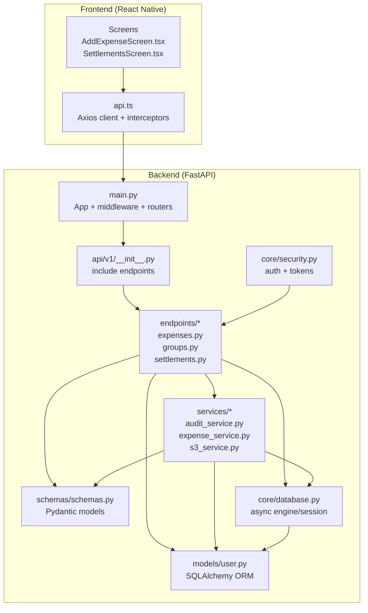

**Diagram sources**
- [backend/app/main.py:16-56](file://backend/app/main.py#L16-L56)
- [backend/app/api/v1/__init__.py:1-12](file://backend/app/api/v1/__init__.py#L1-L12)
- [backend/app/api/v1/endpoints/expenses.py:1-20](file://backend/app/api/v1/endpoints/expenses.py#L1-L20)
- [backend/app/api/v1/endpoints/groups.py:1-18](file://backend/app/api/v1/endpoints/groups.py#L1-L18)
- [backend/app/api/v1/endpoints/settlements.py:1-30](file://backend/app/api/v1/endpoints/settlements.py#L1-L30)
- [backend/app/services/audit_service.py:1-32](file://backend/app/services/audit_service.py#L1-L32)
- [backend/app/services/expense_service.py:1-79](file://backend/app/services/expense_service.py#L1-L79)
- [backend/app/services/s3_service.py:1-158](file://backend/app/services/s3_service.py#L1-L158)
- [backend/app/models/user.py:1-234](file://backend/app/models/user.py#L1-L234)
- [backend/app/schemas/schemas.py:1-432](file://backend/app/schemas/schemas.py#L1-L432)
- [backend/app/core/security.py:1-96](file://backend/app/core/security.py#L1-L96)
- [backend/app/core/database.py:1-29](file://backend/app/core/database.py#L1-L29)
- [frontend/src/services/api.ts:1-271](file://frontend/src/services/api.ts#L1-L271)
- [frontend/src/screens/AddExpenseScreen.tsx:1-421](file://frontend/src/screens/AddExpenseScreen.tsx#L1-L421)
- [frontend/src/screens/SettlementsScreen.tsx:1-589](file://frontend/src/screens/SettlementsScreen.tsx#L1-L589)

**Section sources**
- [backend/app/main.py:16-56](file://backend/app/main.py#L16-L56)
- [backend/app/api/v1/__init__.py:1-12](file://backend/app/api/v1/__init__.py#L1-L12)
- [frontend/src/services/api.ts:1-271](file://frontend/src/services/api.ts#L1-L271)

## Core Components
- Authentication and Authorization: JWT bearer tokens validated centrally; blacklisted token support; per-request current user injection.
- Request Validation: Pydantic models enforce field constraints and cross-field validations.
- Business Logic: Services encapsulate domain rules (split computation, settlement engine, storage abstraction).
- Persistence: SQLAlchemy async ORM with explicit commit/flush lifecycle.
- Compliance Logging: Immutable audit log entries with PostgreSQL trigger protection.
- File Attachments: Unified storage abstraction supporting local filesystem and S3 with pre-signed URLs.

**Section sources**
- [backend/app/core/security.py:72-96](file://backend/app/core/security.py#L72-L96)
- [backend/app/schemas/schemas.py:223-256](file://backend/app/schemas/schemas.py#L223-L256)
- [backend/app/services/audit_service.py:6-32](file://backend/app/services/audit_service.py#L6-L32)
- [backend/app/services/s3_service.py:105-158](file://backend/app/services/s3_service.py#L105-L158)
- [backend/app/core/database.py:23-29](file://backend/app/core/database.py#L23-L29)

## Architecture Overview
The request-response cycle flows from the React Native app through the API gateway (FastAPI), authentication middleware, endpoint handlers, service layer, and database. Audit events and file uploads integrate at appropriate stages.

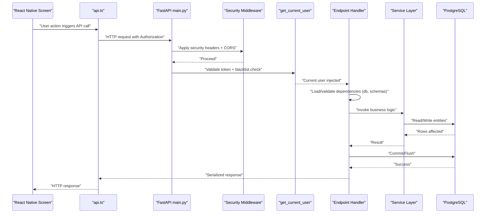

**Diagram sources**
- [backend/app/main.py:25-46](file://backend/app/main.py#L25-L46)
- [backend/app/core/security.py:72-96](file://backend/app/core/security.py#L72-L96)
- [backend/app/api/v1/endpoints/expenses.py:144-179](file://backend/app/api/v1/endpoints/expenses.py#L144-L179)
- [backend/app/core/database.py:23-29](file://backend/app/core/database.py#L23-L29)

## Detailed Component Analysis

### Authentication and Authorization Flow
- Token decoding and blacklist checks occur before endpoint execution.
- Access tokens must be present and not revoked; refresh flow is handled by the frontend interceptor.

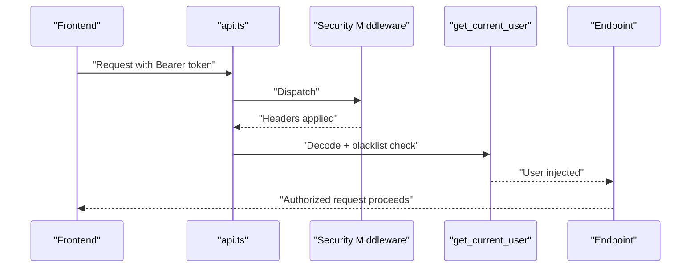

**Diagram sources**
- [backend/app/core/security.py:72-96](file://backend/app/core/security.py#L72-L96)
- [frontend/src/services/api.ts:76-140](file://frontend/src/services/api.ts#L76-L140)

**Section sources**
- [backend/app/core/security.py:72-96](file://backend/app/core/security.py#L72-L96)
- [frontend/src/services/api.ts:76-140](file://frontend/src/services/api.ts#L76-L140)

### Expense Creation Data Flow
End-to-end flow for creating an expense, computing splits, persisting entities, and attaching proof files.

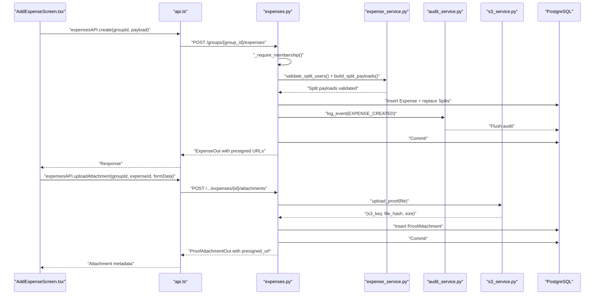

**Diagram sources**
- [frontend/src/screens/AddExpenseScreen.tsx:35-110](file://frontend/src/screens/AddExpenseScreen.tsx#L35-L110)
- [frontend/src/services/api.ts:204-243](file://frontend/src/services/api.ts#L204-L243)
- [backend/app/api/v1/endpoints/expenses.py:144-179](file://backend/app/api/v1/endpoints/expenses.py#L144-L179)
- [backend/app/services/expense_service.py:7-79](file://backend/app/services/expense_service.py#L7-L79)
- [backend/app/services/audit_service.py:6-32](file://backend/app/services/audit_service.py#L6-L32)
- [backend/app/services/s3_service.py:105-158](file://backend/app/services/s3_service.py#L105-L158)

**Section sources**
- [backend/app/api/v1/endpoints/expenses.py:144-179](file://backend/app/api/v1/endpoints/expenses.py#L144-L179)
- [backend/app/services/expense_service.py:7-79](file://backend/app/services/expense_service.py#L7-L79)
- [backend/app/services/s3_service.py:105-158](file://backend/app/services/s3_service.py#L105-L158)
- [backend/app/services/audit_service.py:6-32](file://backend/app/services/audit_service.py#L6-L32)
- [frontend/src/screens/AddExpenseScreen.tsx:35-110](file://frontend/src/screens/AddExpenseScreen.tsx#L35-L110)

### Settlement Processing Data Flow
End-to-end flow for computing balances, initiating, confirming, disputing, and resolving settlements.

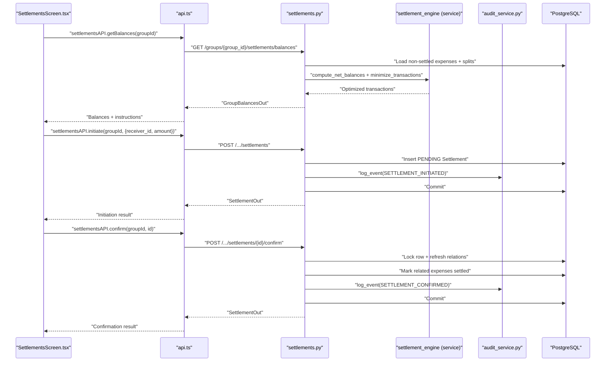

**Diagram sources**
- [frontend/src/screens/SettlementsScreen.tsx:48-95](file://frontend/src/screens/SettlementsScreen.tsx#L48-L95)
- [frontend/src/services/api.ts:245-258](file://frontend/src/services/api.ts#L245-L258)
- [backend/app/api/v1/endpoints/settlements.py:129-235](file://backend/app/api/v1/endpoints/settlements.py#L129-L235)
- [backend/app/services/audit_service.py:6-32](file://backend/app/services/audit_service.py#L6-L32)

**Section sources**
- [backend/app/api/v1/endpoints/settlements.py:129-235](file://backend/app/api/v1/endpoints/settlements.py#L129-L235)
- [backend/app/services/audit_service.py:6-32](file://backend/app/services/audit_service.py#L6-L32)
- [frontend/src/screens/SettlementsScreen.tsx:48-95](file://frontend/src/screens/SettlementsScreen.tsx#L48-L95)

### Group Management Data Flow
Creation, membership management, and invite link generation with audit logging.

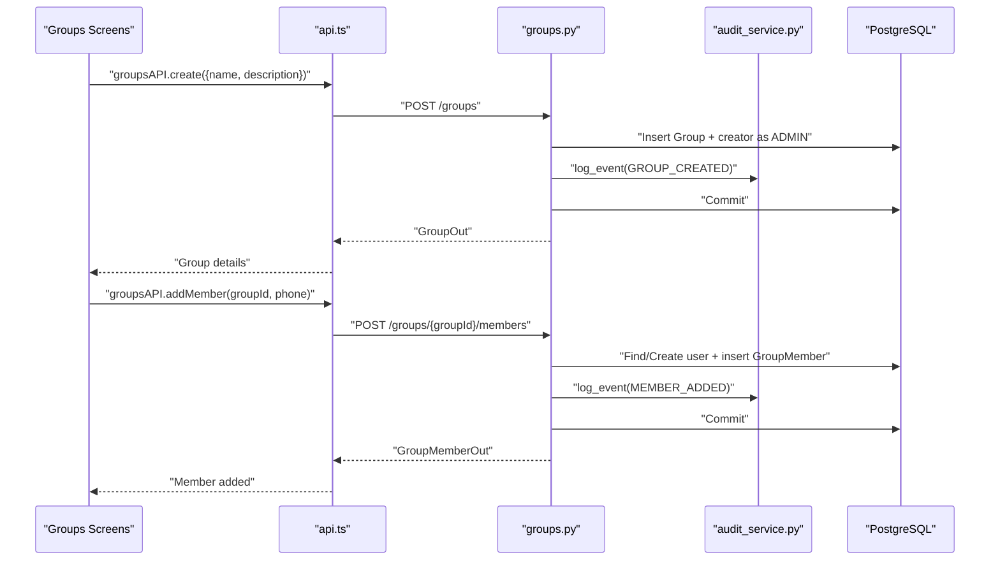

**Diagram sources**
- [backend/app/api/v1/endpoints/groups.py:59-84](file://backend/app/api/v1/endpoints/groups.py#L59-L84)
- [backend/app/api/v1/endpoints/groups.py:141-208](file://backend/app/api/v1/endpoints/groups.py#L141-L208)
- [backend/app/services/audit_service.py:6-32](file://backend/app/services/audit_service.py#L6-L32)

**Section sources**
- [backend/app/api/v1/endpoints/groups.py:59-84](file://backend/app/api/v1/endpoints/groups.py#L59-L84)
- [backend/app/api/v1/endpoints/groups.py:141-208](file://backend/app/api/v1/endpoints/groups.py#L141-L208)
- [backend/app/services/audit_service.py:6-32](file://backend/app/services/audit_service.py#L6-L32)

### Audit Trail Data Flow
Immutable audit logging ensures compliance and immutability:
- Audit events are appended with before/after snapshots and metadata.
- A PostgreSQL trigger prevents updates/deletes to the audit_logs table.

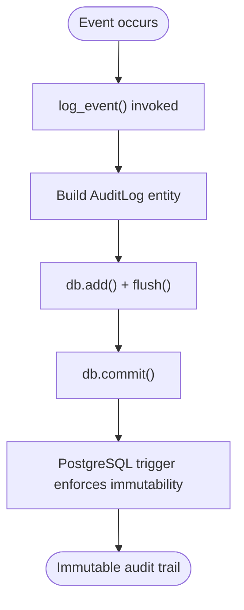

**Diagram sources**
- [backend/app/services/audit_service.py:6-32](file://backend/app/services/audit_service.py#L6-L32)
- [backend/app/main.py:72-85](file://backend/app/main.py#L72-L85)

**Section sources**
- [backend/app/services/audit_service.py:6-32](file://backend/app/services/audit_service.py#L6-L32)
- [backend/app/main.py:72-85](file://backend/app/main.py#L72-L85)

### File Upload Data Flow
Proof attachments are validated, hashed, stored, and retrievable via pre-signed URLs:
- Frontend sends multipart/form-data.
- Backend validates MIME type, size, and magic bytes.
- Storage abstraction supports local filesystem or S3.
- Retrieval uses pre-signed URLs in production.

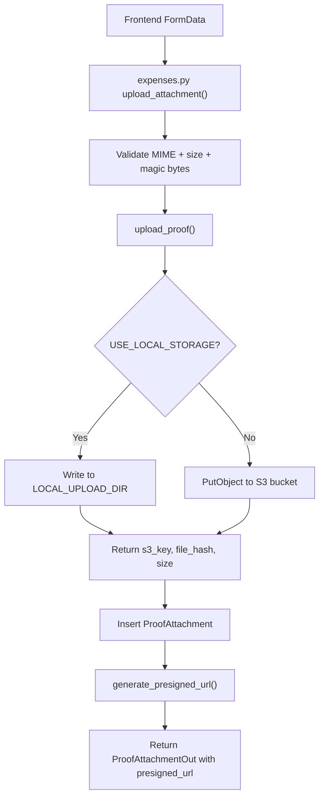

**Diagram sources**
- [backend/app/api/v1/endpoints/expenses.py:352-394](file://backend/app/api/v1/endpoints/expenses.py#L352-L394)
- [backend/app/services/s3_service.py:105-158](file://backend/app/services/s3_service.py#L105-L158)

**Section sources**
- [backend/app/api/v1/endpoints/expenses.py:352-394](file://backend/app/api/v1/endpoints/expenses.py#L352-L394)
- [backend/app/services/s3_service.py:105-158](file://backend/app/services/s3_service.py#L105-L158)

### Data Transformation Patterns
- Pydantic models validate and normalize inputs (e.g., phone, OTP, amounts in paise).
- Split computation converts raw inputs into normalized payloads based on split type.
- Outbound DTOs transform entities to response models with computed fields (e.g., presigned URLs).

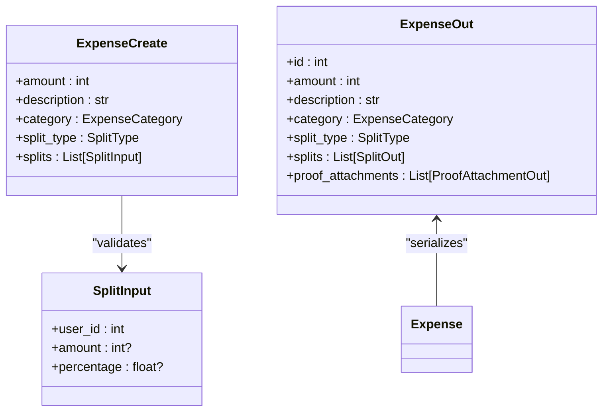

**Diagram sources**
- [backend/app/schemas/schemas.py:223-256](file://backend/app/schemas/schemas.py#L223-L256)
- [backend/app/schemas/schemas.py:217-221](file://backend/app/schemas/schemas.py#L217-L221)
- [backend/app/schemas/schemas.py:313-331](file://backend/app/schemas/schemas.py#L313-L331)

**Section sources**
- [backend/app/schemas/schemas.py:223-256](file://backend/app/schemas/schemas.py#L223-L256)
- [backend/app/schemas/schemas.py:313-331](file://backend/app/schemas/schemas.py#L313-L331)

### Error Propagation Through the Data Flow
- Validation errors originate in Pydantic validators and endpoint guards, raising HTTP exceptions.
- Business rule violations (e.g., split totals, membership checks, settlement constraints) raise HTTP exceptions.
- System failures (e.g., S3 upload errors) raise HTTP exceptions with contextual messages.
- Frontend interceptors handle 401 by refreshing tokens and retrying.

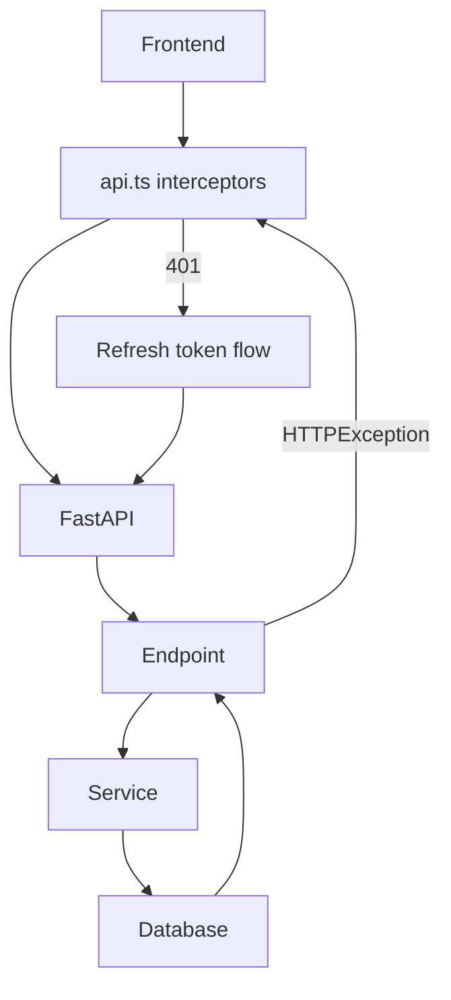

**Diagram sources**
- [frontend/src/services/api.ts:97-140](file://frontend/src/services/api.ts#L97-L140)
- [backend/app/api/v1/endpoints/expenses.py:120-123](file://backend/app/api/v1/endpoints/expenses.py#L120-L123)
- [backend/app/services/s3_service.py:86-88](file://backend/app/services/s3_service.py#L86-L88)

**Section sources**
- [frontend/src/services/api.ts:97-140](file://frontend/src/services/api.ts#L97-L140)
- [backend/app/api/v1/endpoints/expenses.py:120-123](file://backend/app/api/v1/endpoints/expenses.py#L120-L123)
- [backend/app/services/s3_service.py:86-88](file://backend/app/services/s3_service.py#L86-L88)

## Dependency Analysis
- Endpoints depend on:
  - Authentication middleware and current user injection
  - Database session provider
  - Pydantic schemas for validation
  - Service layer for business logic
  - Audit service for immutable logs
  - S3 service for file storage
- Services depend on:
  - SQLAlchemy async sessions
  - Pydantic models for data shaping
  - External integrations (S3 client)
- Models define relationships and constraints for persistence.
- Frontend depends on typed API clients and stores tokens securely.

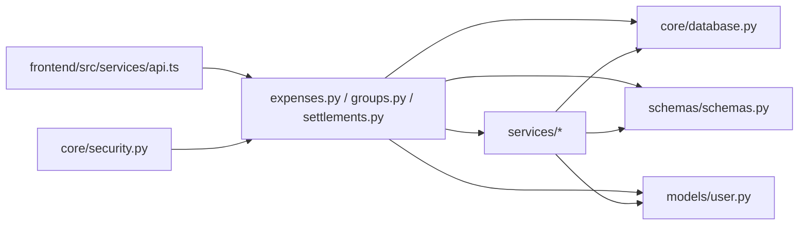

**Diagram sources**
- [frontend/src/services/api.ts:1-271](file://frontend/src/services/api.ts#L1-L271)
- [backend/app/api/v1/endpoints/expenses.py:1-20](file://backend/app/api/v1/endpoints/expenses.py#L1-L20)
- [backend/app/api/v1/endpoints/groups.py:1-18](file://backend/app/api/v1/endpoints/groups.py#L1-L18)
- [backend/app/api/v1/endpoints/settlements.py:1-30](file://backend/app/api/v1/endpoints/settlements.py#L1-L30)
- [backend/app/services/audit_service.py:1-32](file://backend/app/services/audit_service.py#L1-L32)
- [backend/app/services/expense_service.py:1-79](file://backend/app/services/expense_service.py#L1-L79)
- [backend/app/services/s3_service.py:1-158](file://backend/app/services/s3_service.py#L1-L158)
- [backend/app/core/database.py:1-29](file://backend/app/core/database.py#L1-L29)
- [backend/app/schemas/schemas.py:1-432](file://backend/app/schemas/schemas.py#L1-L432)
- [backend/app/models/user.py:1-234](file://backend/app/models/user.py#L1-L234)
- [backend/app/core/security.py:1-96](file://backend/app/core/security.py#L1-L96)

**Section sources**
- [backend/app/api/v1/endpoints/expenses.py:1-20](file://backend/app/api/v1/endpoints/expenses.py#L1-L20)
- [backend/app/api/v1/endpoints/groups.py:1-18](file://backend/app/api/v1/endpoints/groups.py#L1-L18)
- [backend/app/api/v1/endpoints/settlements.py:1-30](file://backend/app/api/v1/endpoints/settlements.py#L1-L30)
- [backend/app/core/database.py:1-29](file://backend/app/core/database.py#L1-L29)
- [backend/app/schemas/schemas.py:1-432](file://backend/app/schemas/schemas.py#L1-L432)
- [backend/app/models/user.py:1-234](file://backend/app/models/user.py#L1-L234)
- [backend/app/core/security.py:1-96](file://backend/app/core/security.py#L1-L96)
- [backend/app/services/audit_service.py:1-32](file://backend/app/services/audit_service.py#L1-L32)
- [backend/app/services/expense_service.py:1-79](file://backend/app/services/expense_service.py#L1-L79)
- [backend/app/services/s3_service.py:1-158](file://backend/app/services/s3_service.py#L1-L158)
- [frontend/src/services/api.ts:1-271](file://frontend/src/services/api.ts#L1-L271)

## Performance Considerations
- Asynchronous database sessions reduce blocking and improve throughput.
- Select-in-load strategies minimize N+1 queries for related entities.
- Pre-signed URLs avoid proxying large files through the application server.
- Token refresh is handled efficiently with request queuing to avoid redundant refreshes.

[No sources needed since this section provides general guidance]

## Troubleshooting Guide
Common issues and where they arise:
- Authentication failures: 401 responses due to expired or blacklisted tokens; handled by frontend interceptor with token refresh.
- Validation errors: Pydantic validators raise HTTP 422/400 for malformed payloads or constraint violations.
- Business rule violations: Endpoint guards and services raise HTTP 400/403 for invalid operations (e.g., editing settled expenses, invalid splits).
- Storage failures: S3 upload errors surface as HTTP 500 with error message; local storage writes fail gracefully.
- Audit immutability: PostgreSQL trigger prevents modification/deletion of audit logs.

**Section sources**
- [frontend/src/services/api.ts:97-140](file://frontend/src/services/api.ts#L97-L140)
- [backend/app/api/v1/endpoints/expenses.py:120-123](file://backend/app/api/v1/endpoints/expenses.py#L120-L123)
- [backend/app/services/s3_service.py:86-88](file://backend/app/services/s3_service.py#L86-L88)
- [backend/app/main.py:72-85](file://backend/app/main.py#L72-L85)

## Conclusion
SplitSure’s data flow is structured around strict validation, immutable auditing, and a clean separation of concerns between presentation, routing, services, and persistence. The architecture supports robust compliance logging, secure authentication, flexible file storage, and efficient settlement computation, enabling reliable and auditable financial collaboration.