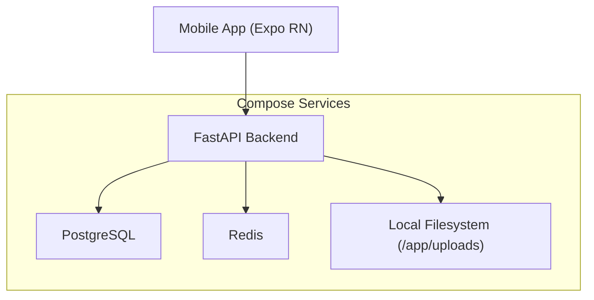
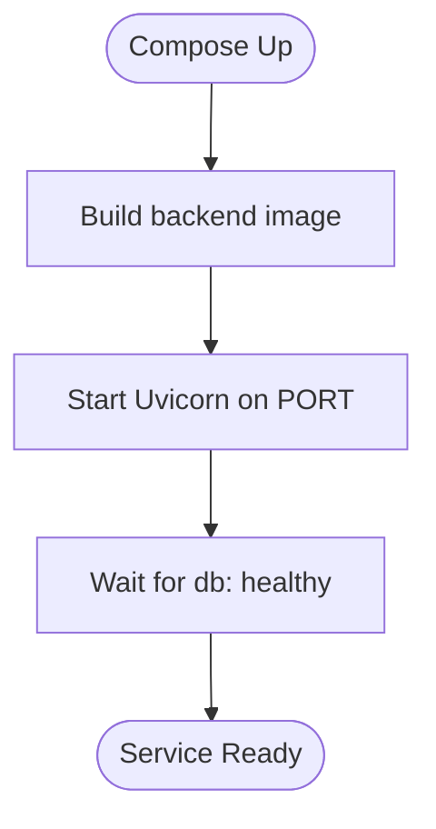
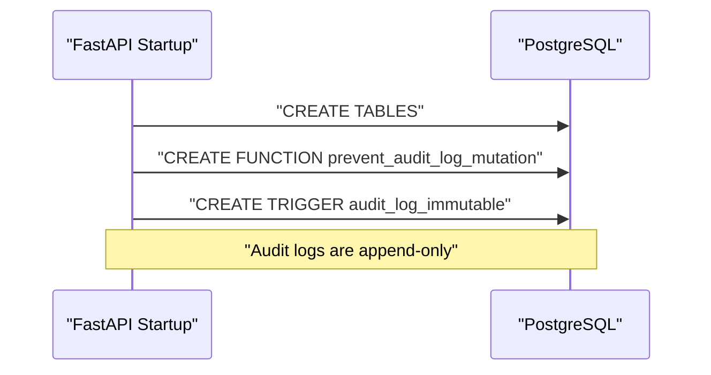
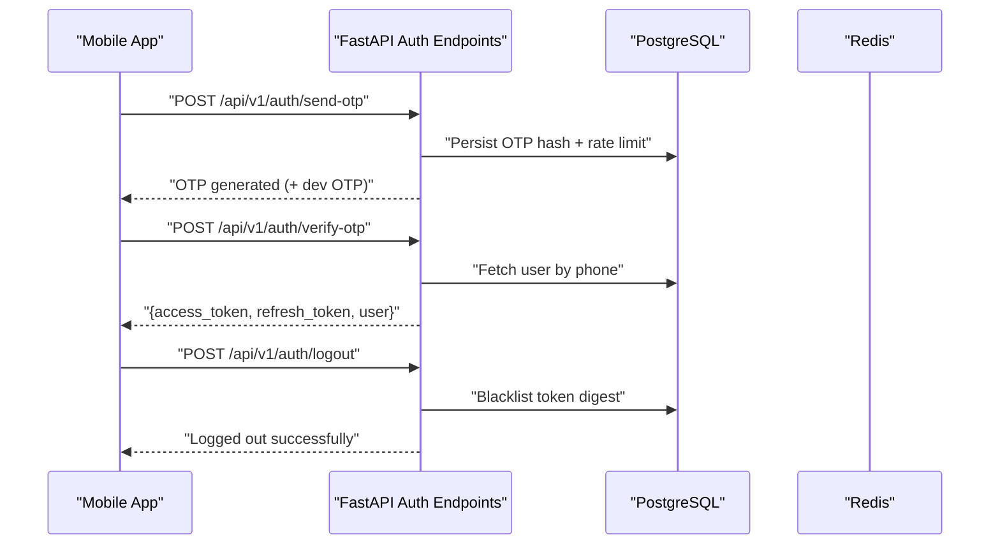
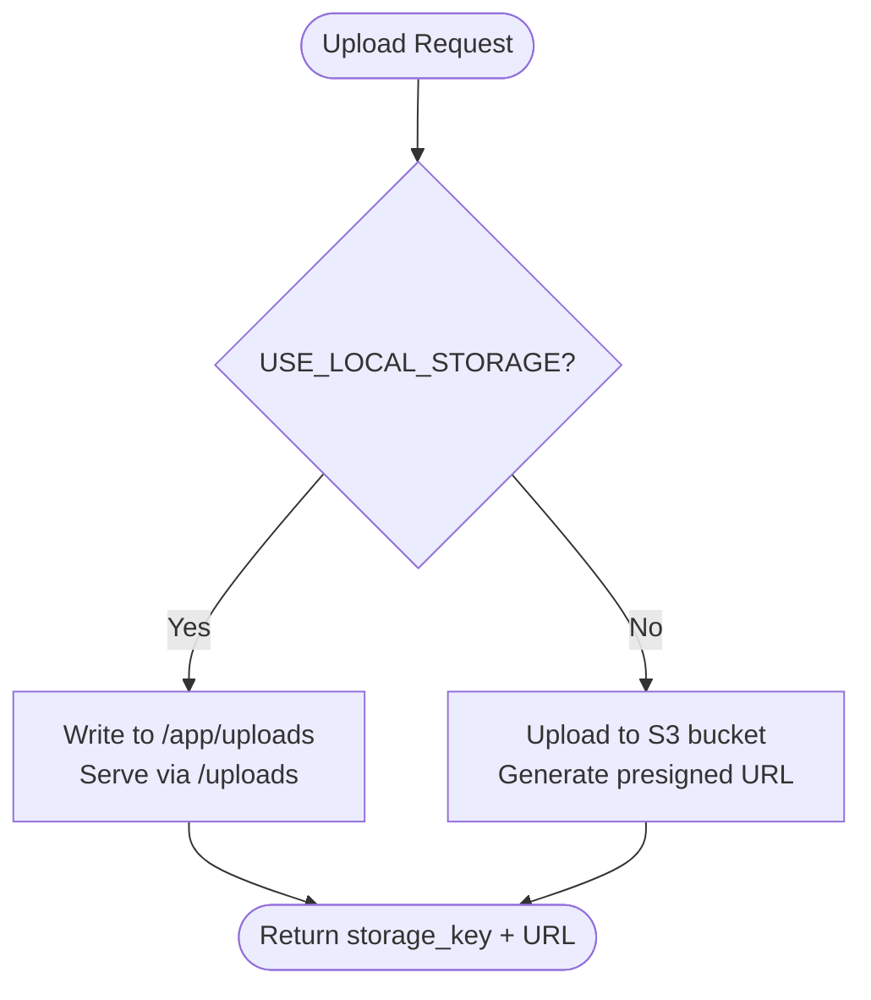
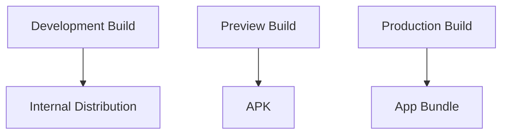
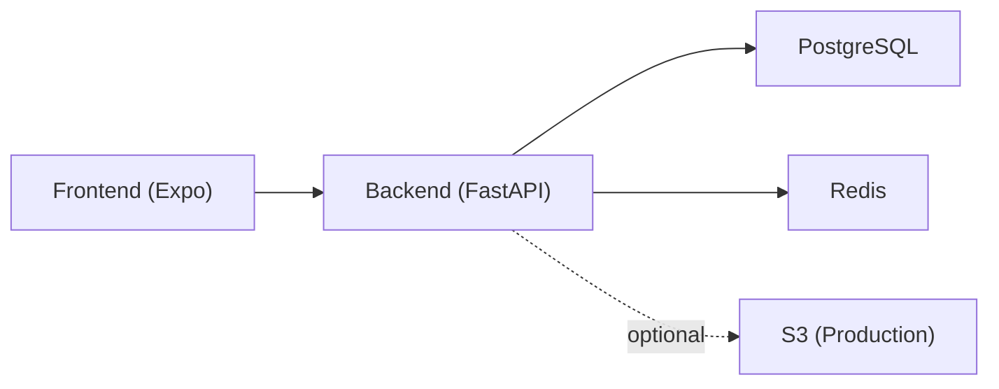

# Deployment Topology

<cite>
**Referenced Files in This Document**
- [docker-compose.yml](file://docker-compose.yml)
- [Dockerfile](file://backend/Dockerfile)
- [config.py](file://backend/app/core/config.py)
- [database.py](file://backend/app/core/database.py)
- [main.py](file://backend/app/main.py)
- [s3_service.py](file://backend/app/services/s3_service.py)
- [auth.py](file://backend/app/api/v1/endpoints/auth.py)
- [security.py](file://backend/app/core/security.py)
- [eas.json](file://frontend/eas.json)
- [package.json](file://frontend/package.json)
- [README.md](file://README.md)
</cite>

## Table of Contents
1. [Introduction](#introduction)
2. [Project Structure](#project-structure)
3. [Core Components](#core-components)
4. [Architecture Overview](#architecture-overview)
5. [Detailed Component Analysis](#detailed-component-analysis)
6. [Dependency Analysis](#dependency-analysis)
7. [Performance Considerations](#performance-considerations)
8. [Troubleshooting Guide](#troubleshooting-guide)
9. [Conclusion](#conclusion)
10. [Appendices](#appendices)

## Introduction
This document describes the SplitSure deployment topology and infrastructure architecture. It explains the containerized deployment strategy using Docker Compose for orchestrating the FastAPI backend, PostgreSQL database, Redis cache/token blacklist, and local file storage. It also documents the multi-environment approach for development, staging, and production, including configuration management, secrets handling, and environment-specific behavior. Finally, it covers the React Native mobile app deployment pipeline using EAS Build and how the backend, frontend, and database integrate in containerized environments.

## Project Structure
SplitSure is organized into three primary areas:
- Backend: FastAPI application with asynchronous SQLAlchemy ORM, JWT-based authentication, and optional S3-backed file storage.
- Frontend: React Native (Expo Router) application with EAS Build configuration for Android builds.
- Infrastructure: Docker Compose orchestration for local development with PostgreSQL, Redis, and the backend service.

```mermaid
graph TB
subgraph "Local Development Stack"
A["PostgreSQL<br/>postgres:16-alpine"]
B["Redis<br/>redis:7-alpine"]
C["FastAPI Backend<br/>Python 3.12 + Uvicorn"]
D["Local File Storage<br/>/app/uploads"]
end
subgraph "Mobile App"
E["React Native Frontend<br/>Expo Router"]
F["EAS Build<br/>Android APK/App Bundle"]
end
E --> |"HTTP API"| C
C --> |"Async SQL"<br/>A
C --> |"Caching/Blacklist"<br/>B
C --> |"Proofs"| D
```

**Diagram sources**
- [docker-compose.yml:1-82](file://docker-compose.yml#L1-L82)
- [main.py:1-96](file://backend/app/main.py#L1-L96)
- [config.py:1-71](file://backend/app/core/config.py#L1-L71)
- [s3_service.py:1-158](file://backend/app/services/s3_service.py#L1-L158)

**Section sources**
- [docker-compose.yml:1-82](file://docker-compose.yml#L1-L82)
- [README.md:24-70](file://README.md#L24-L70)

## Core Components
- PostgreSQL database: Persistent relational store for user profiles, groups, expenses, audit logs, and OTP records. Health-checked and mounted with a named volume for durability.
- Redis: Caching and token blacklist storage for logout invalidation across sessions.
- FastAPI backend: Asynchronous API server exposing authentication, user/group/expense/settlement endpoints, and optional local/static file serving for proofs.
- Local file storage: Disk-backed storage for uploaded proof images/PDFs during development; production switches to S3.
- React Native frontend: Mobile client built with Expo Router and EAS Build, configured for development and production builds.

**Section sources**
- [docker-compose.yml:3-18](file://docker-compose.yml#L3-L18)
- [docker-compose.yml:21-26](file://docker-compose.yml#L21-L26)
- [docker-compose.yml:29-77](file://docker-compose.yml#L29-L77)
- [config.py:16-28](file://backend/app/core/config.py#L16-L28)
- [s3_service.py:43-63](file://backend/app/services/s3_service.py#L43-L63)
- [eas.json:1-25](file://frontend/eas.json#L1-L25)

## Architecture Overview
The system follows a containerized microservice-like layout:
- The backend exposes REST endpoints and serves static files when local storage is enabled.
- The database persists all domain data and enforces audit immutability via triggers.
- Redis supports caching and token revocation.
- The frontend communicates with the backend over HTTP, using environment-specific base URLs.



**Diagram sources**
- [docker-compose.yml:1-82](file://docker-compose.yml#L1-L82)
- [main.py:48-54](file://backend/app/main.py#L48-L54)
- [config.py:16-28](file://backend/app/core/config.py#L16-L28)

## Detailed Component Analysis

### Backend Containerization and Orchestration
- Image and runtime: Python 3.12 slim image with gcc and libpq-dev installed; Uvicorn runs the ASGI app.
- Ports: Exposes 8000 internally; host port configurable via environment variable.
- Dependencies: Built on Docker Compose with health checks for PostgreSQL and startup dependencies for Redis.
- Hot reload: Source mounted for rapid iteration; uploads directory persisted via a named volume.



**Diagram sources**
- [Dockerfile:1-15](file://backend/Dockerfile#L1-L15)
- [docker-compose.yml:29-77](file://docker-compose.yml#L29-L77)

**Section sources**
- [Dockerfile:1-15](file://backend/Dockerfile#L1-L15)
- [docker-compose.yml:29-77](file://docker-compose.yml#L29-L77)

### Database Layer and Migrations
- Async SQLAlchemy engine configured with connection pooling.
- Startup routine creates tables and installs an append-only trigger on the audit log table.
- Alembic upgrades applied post-deploy to keep schema current.



**Diagram sources**
- [main.py:68-86](file://backend/app/main.py#L68-L86)
- [database.py:5-16](file://backend/app/core/database.py#L5-L16)

**Section sources**
- [database.py:1-29](file://backend/app/core/database.py#L1-L29)
- [main.py:68-86](file://backend/app/main.py#L68-L86)
- [README.md:34-38](file://README.md#L34-L38)

### Authentication and Security Middleware
- JWT-based access/refresh tokens with secure defaults.
- Security headers middleware adds HSTS only in production-like configurations.
- Token blacklist maintained in the database; logout invalidates tokens immediately.
- OTP generation uses cryptographically secure randomness; development mode returns OTP in response.



**Diagram sources**
- [auth.py:58-147](file://backend/app/api/v1/endpoints/auth.py#L58-L147)
- [security.py:17-96](file://backend/app/core/security.py#L17-L96)
- [main.py:25-34](file://backend/app/main.py#L25-L34)

**Section sources**
- [auth.py:1-147](file://backend/app/api/v1/endpoints/auth.py#L1-L147)
- [security.py:1-96](file://backend/app/core/security.py#L1-L96)
- [main.py:25-34](file://backend/app/main.py#L25-L34)

### File Storage Strategy (Local vs S3)
- Local storage: Backend serves uploaded files from a static route when enabled; files stored under a named volume for persistence.
- S3 storage: Production mode uploads to S3 with AES-256 encryption and presigned URLs for retrieval; retains files for audit compliance.



**Diagram sources**
- [s3_service.py:105-158](file://backend/app/services/s3_service.py#L105-L158)
- [main.py:48-54](file://backend/app/main.py#L48-L54)
- [config.py:16-28](file://backend/app/core/config.py#L16-L28)

**Section sources**
- [s3_service.py:1-158](file://backend/app/services/s3_service.py#L1-L158)
- [main.py:48-54](file://backend/app/main.py#L48-L54)
- [config.py:16-28](file://backend/app/core/config.py#L16-L28)

### Mobile App Deployment Pipeline (EAS Build)
- Development: Internal distribution with development client enabled.
- Preview: Internal distribution with APK build type.
- Production: Android App Bundle for release distribution.
- Scripts and dependencies are defined in the frontend package manifest.



**Diagram sources**
- [eas.json:5-21](file://frontend/eas.json#L5-L21)
- [package.json:1-62](file://frontend/package.json#L1-L62)

**Section sources**
- [eas.json:1-25](file://frontend/eas.json#L1-L25)
- [package.json:1-62](file://frontend/package.json#L1-L62)

## Dependency Analysis
- Backend depends on:
  - PostgreSQL for persistence.
  - Redis for caching and token blacklist.
  - Optional S3 SDK for production file storage.
- Frontend depends on the backend API base URL configured at runtime.
- Compose manages service dependencies and health checks to ensure readiness.



**Diagram sources**
- [docker-compose.yml:1-82](file://docker-compose.yml#L1-L82)
- [s3_service.py:66-73](file://backend/app/services/s3_service.py#L66-L73)

**Section sources**
- [docker-compose.yml:1-82](file://docker-compose.yml#L1-L82)
- [requirements.txt:17-19](file://backend/requirements.txt#L17-L19)

## Performance Considerations
- Connection pooling: The async engine uses a pool size and overflow suitable for moderate concurrency.
- Caching: Redis can cache frequent reads and invalidate selectively on writes.
- File I/O: Local storage is acceptable for development; S3 offloads I/O and improves scalability in production.
- Horizontal scaling: The backend is stateless aside from DB and Redis; scale replicas behind a load balancer and ensure shared Redis and a single Postgres primary (with read replicas if needed).

[No sources needed since this section provides general guidance]

## Troubleshooting Guide
Common operational issues and remedies:
- Database not ready: Ensure the database health check passes before the backend starts; verify credentials and port mapping.
- Missing uploads directory: Named volume ensures persistence; confirm mount path and permissions.
- CORS errors: Adjust allowed origins for development and production endpoints.
- OTP issues: Verify rate limits and disable development OTP mode in production.
- Token invalidation: Confirm blacklist entries and expiration cleanup.

**Section sources**
- [docker-compose.yml:14-18](file://docker-compose.yml#L14-L18)
- [docker-compose.yml:74-77](file://docker-compose.yml#L74-L77)
- [main.py:40-46](file://backend/app/main.py#L40-L46)
- [auth.py:24-34](file://backend/app/api/v1/endpoints/auth.py#L24-L34)
- [security.py:47-61](file://backend/app/core/security.py#L47-L61)

## Conclusion
SplitSure’s deployment topology centers on a containerized FastAPI backend, PostgreSQL, Redis, and local file storage for development. The architecture cleanly separates concerns, supports environment-specific configuration, and provides a clear migration path to S3 and production-grade security. The React Native frontend integrates seamlessly via HTTP APIs, with EAS Build enabling streamlined Android builds for development and production.

[No sources needed since this section summarizes without analyzing specific files]

## Appendices

### Multi-Environment Deployment Approach
- Development:
  - Local storage enabled, dev OTP enabled, relaxed CORS, and static file serving.
  - Example environment variables include database credentials, local upload directory, and base URL.
- Staging:
  - Enable S3, set production-like CORS, enforce HTTPS, and configure stronger secrets.
- Production:
  - Disable dev OTP, configure Twilio or another provider, switch to S3, enforce HSTS, and harden secrets management.

**Section sources**
- [config.py:16-44](file://backend/app/core/config.py#L16-L44)
- [main.py:32-34](file://backend/app/main.py#L32-L34)
- [README.md:144-153](file://README.md#L144-L153)

### Environment Variables and Secrets Management
- Backend settings are loaded from a .env file with strict parsing and validators.
- Sensitive keys include the secret key, database credentials, and optional S3/Twilio credentials.
- Recommended practices:
  - Store secrets externally (e.g., Docker secrets or CI/CD secret stores) and inject via Compose env files or CI.
  - Rotate SECRET_KEY regularly and enforce minimum length.
  - Use distinct keys per environment.

**Section sources**
- [config.py:67-71](file://backend/app/core/config.py#L67-L71)
- [docker-compose.yml:34-66](file://docker-compose.yml#L34-L66)
- [README.md:71-86](file://README.md#L71-L86)

### Monitoring and Logging Infrastructure (Production)
- Logging: Use structured logging in the backend and forward logs to a centralized collector (e.g., ELK or similar).
- Metrics: Expose Prometheus metrics endpoints and scrape with Prometheus.
- Health checks: Leverage existing /health endpoint and container health checks.
- Tracing: Add OpenTelemetry instrumentation for distributed tracing across services.

[No sources needed since this section provides general guidance]