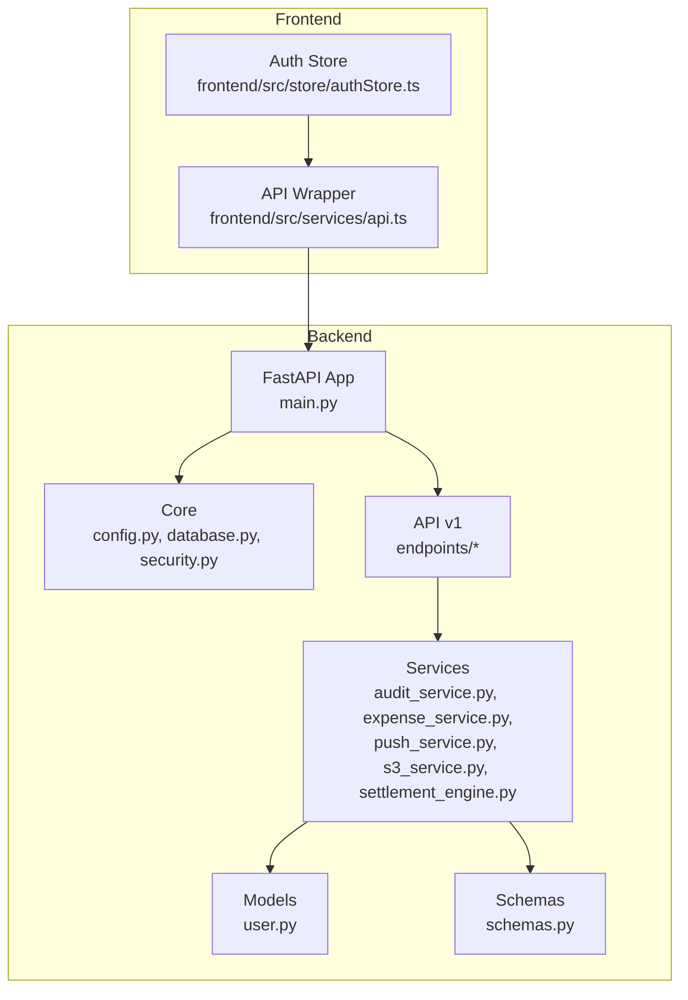
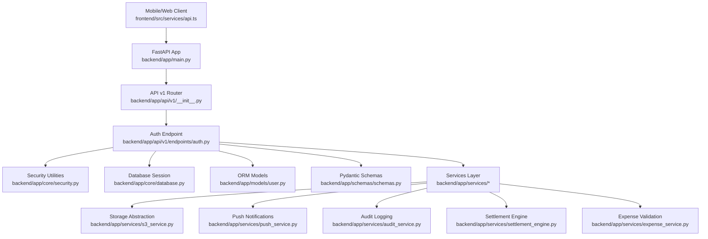
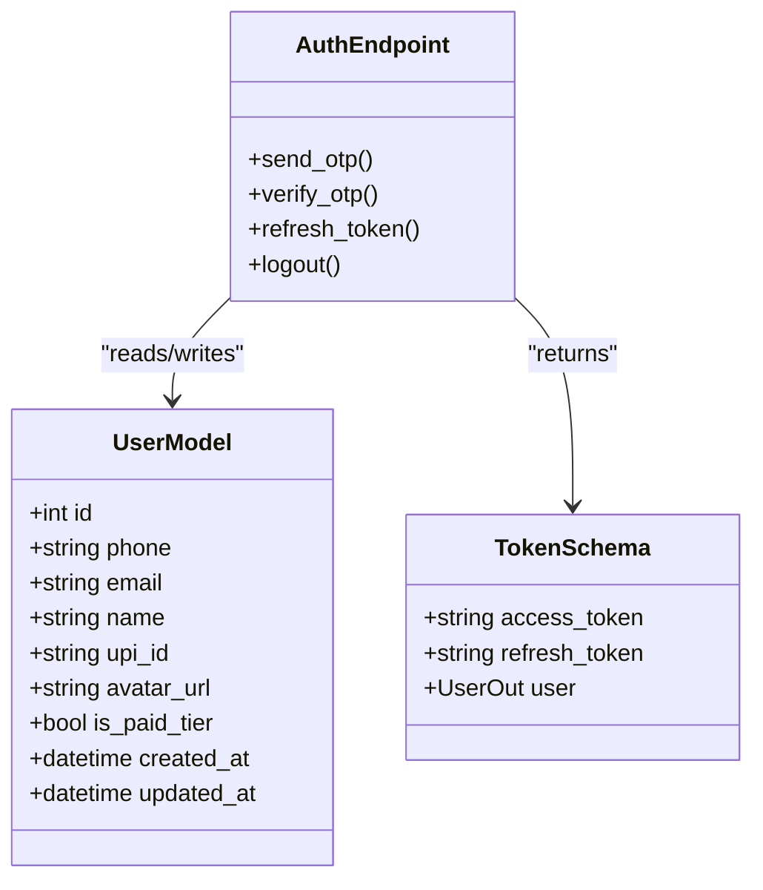
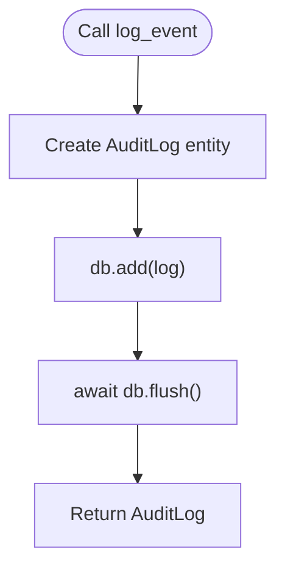
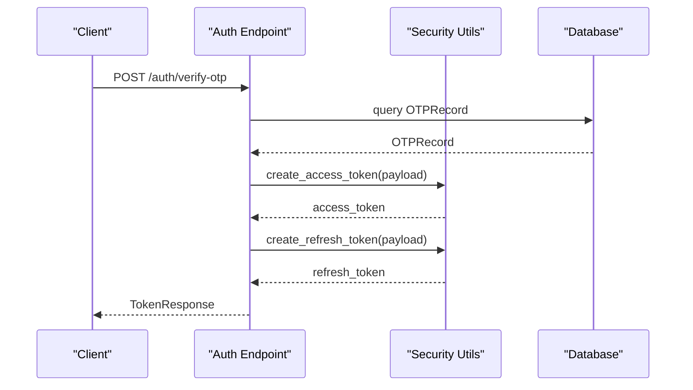
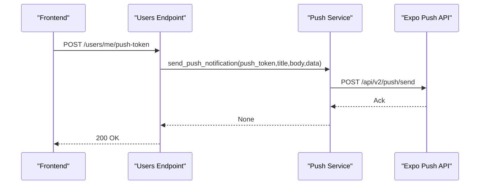
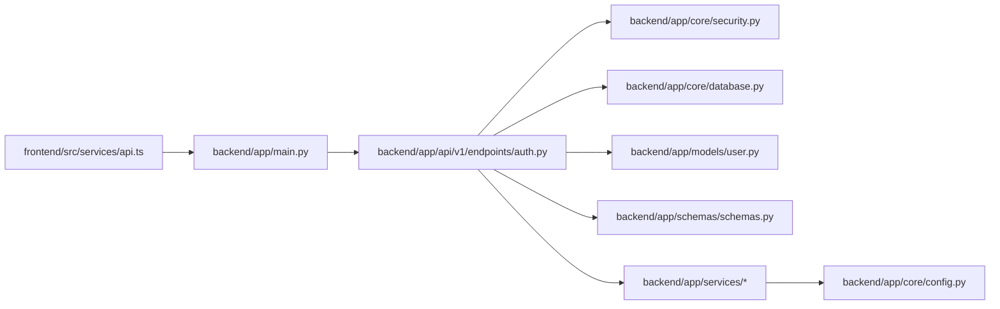

# System Design Patterns

<cite>
**Referenced Files in This Document**
- [backend/app/main.py](file://backend/app/main.py)
- [backend/app/core/config.py](file://backend/app/core/config.py)
- [backend/app/core/database.py](file://backend/app/core/database.py)
- [backend/app/core/security.py](file://backend/app/core/security.py)
- [backend/app/api/v1/__init__.py](file://backend/app/api/v1/__init__.py)
- [backend/app/api/v1/endpoints/auth.py](file://backend/app/api/v1/endpoints/auth.py)
- [backend/app/models/user.py](file://backend/app/models/user.py)
- [backend/app/schemas/schemas.py](file://backend/app/schemas/schemas.py)
- [backend/app/services/audit_service.py](file://backend/app/services/audit_service.py)
- [backend/app/services/expense_service.py](file://backend/app/services/expense_service.py)
- [backend/app/services/push_service.py](file://backend/app/services/push_service.py)
- [backend/app/services/settlement_engine.py](file://backend/app/services/settlement_engine.py)
- [backend/app/services/s3_service.py](file://backend/app/services/s3_service.py)
- [frontend/src/services/api.ts](file://frontend/src/services/api.ts)
- [frontend/src/store/authStore.ts](file://frontend/src/store/authStore.ts)
</cite>

## Table of Contents
1. [Introduction](#introduction)
2. [Project Structure](#project-structure)
3. [Core Components](#core-components)
4. [Architecture Overview](#architecture-overview)
5. [Detailed Component Analysis](#detailed-component-analysis)
6. [Dependency Analysis](#dependency-analysis)
7. [Performance Considerations](#performance-considerations)
8. [Troubleshooting Guide](#troubleshooting-guide)
9. [Conclusion](#conclusion)
10. [Appendices](#appendices)

## Introduction
This document explains the system design patterns implemented in SplitSure, focusing on layered architecture, MVC separation, repository/service abstractions, factory-like service composition, observer-style notifications, and microservice-oriented backend principles. It also highlights how the mobile-first frontend influences backend design and demonstrates concrete code locations where each pattern is implemented, including middleware usage, dependency injection, and service-layer abstractions.

## Project Structure
SplitSure is organized into:
- Backend (FastAPI): layered architecture with presentation (API routers), business logic (services), and data (models + database).
- Frontend (React Native): mobile-first client with API wrappers and state management.

**Diagram sources**
- [backend/app/main.py:1-96](file://backend/app/main.py#L1-L96)
- [backend/app/api/v1/__init__.py:1-12](file://backend/app/api/v1/__init__.py#L1-L12)
- [backend/app/services/audit_service.py:1-32](file://backend/app/services/audit_service.py#L1-L32)
- [backend/app/services/expense_service.py:1-79](file://backend/app/services/expense_service.py#L1-L79)
- [backend/app/services/push_service.py:1-43](file://backend/app/services/push_service.py#L1-L43)
- [backend/app/services/s3_service.py:1-158](file://backend/app/services/s3_service.py#L1-L158)
- [backend/app/models/user.py:1-234](file://backend/app/models/user.py#L1-L234)
- [backend/app/schemas/schemas.py:1-412](file://backend/app/schemas/schemas.py#L1-L412)
- [frontend/src/services/api.ts:1-269](file://frontend/src/services/api.ts#L1-L269)
- [frontend/src/store/authStore.ts:1-116](file://frontend/src/store/authStore.ts#L1-L116)

**Section sources**
- [backend/app/main.py:1-96](file://backend/app/main.py#L1-L96)
- [backend/app/api/v1/__init__.py:1-12](file://backend/app/api/v1/__init__.py#L1-L12)

## Core Components
- Presentation Layer (API): FastAPI routers and endpoints define the contract and orchestrate controller responsibilities.
- Business Logic Layer (Services): Pure functions and engines encapsulate domain logic (split computation, settlement optimization, storage switching).
- Data Layer (Models + Database): SQLAlchemy ORM models and async sessions abstract persistence.
- Frontend Layer (Mobile-first): Axios-based API wrapper and Zustand store manage auth and push token lifecycle.

Concrete examples:
- Middleware and routing: [backend/app/main.py:37-56](file://backend/app/main.py#L37-L56)
- Dependency injection for database sessions: [backend/app/core/database.py:23-29](file://backend/app/core/database.py#L23-L29)
- Authentication controller: [backend/app/api/v1/endpoints/auth.py:58-147](file://backend/app/api/v1/endpoints/auth.py#L58-L147)
- Token utilities and blacklisting: [backend/app/core/security.py:17-96](file://backend/app/core/security.py#L17-L96)
- Schema validation: [backend/app/schemas/schemas.py:10-45](file://backend/app/schemas/schemas.py#L10-L45)
- Storage abstraction (factory-like selection): [backend/app/services/s3_service.py:105-147](file://backend/app/services/s3_service.py#L105-L147)
- Push notifications (observer-style): [backend/app/services/push_service.py:14-43](file://backend/app/services/push_service.py#L14-L43)

**Section sources**
- [backend/app/main.py:37-56](file://backend/app/main.py#L37-L56)
- [backend/app/core/database.py:23-29](file://backend/app/core/database.py#L23-L29)
- [backend/app/api/v1/endpoints/auth.py:58-147](file://backend/app/api/v1/endpoints/auth.py#L58-L147)
- [backend/app/core/security.py:17-96](file://backend/app/core/security.py#L17-L96)
- [backend/app/schemas/schemas.py:10-45](file://backend/app/schemas/schemas.py#L10-L45)
- [backend/app/services/s3_service.py:105-147](file://backend/app/services/s3_service.py#L105-L147)
- [backend/app/services/push_service.py:14-43](file://backend/app/services/push_service.py#L14-L43)

## Architecture Overview
SplitSure follows a layered architecture with clear separation:
- Presentation: FastAPI routes and endpoints.
- Business: Services encapsulate domain logic and orchestration.
- Data: Models and async sessions with dependency-injected repositories.

**Diagram sources**
- [backend/app/main.py:1-96](file://backend/app/main.py#L1-L96)
- [backend/app/api/v1/__init__.py:1-12](file://backend/app/api/v1/__init__.py#L1-L12)
- [backend/app/api/v1/endpoints/auth.py:58-147](file://backend/app/api/v1/endpoints/auth.py#L58-L147)
- [backend/app/core/security.py:17-96](file://backend/app/core/security.py#L17-L96)
- [backend/app/core/database.py:1-29](file://backend/app/core/database.py#L1-L29)
- [backend/app/models/user.py:1-234](file://backend/app/models/user.py#L1-L234)
- [backend/app/schemas/schemas.py:1-412](file://backend/app/schemas/schemas.py#L1-L412)
- [backend/app/services/s3_service.py:1-158](file://backend/app/services/s3_service.py#L1-L158)
- [backend/app/services/push_service.py:1-43](file://backend/app/services/push_service.py#L1-L43)
- [backend/app/services/audit_service.py:1-32](file://backend/app/services/audit_service.py#L1-L32)
- [backend/app/services/settlement_engine.py:1-106](file://backend/app/services/settlement_engine.py#L1-L106)
- [backend/app/services/expense_service.py:1-79](file://backend/app/services/expense_service.py#L1-L79)

## Detailed Component Analysis

### Layered Architecture Pattern
- Presentation: Routers and endpoints expose HTTP APIs.
- Business: Services implement domain logic and coordinate models.
- Data: Models and async sessions encapsulate persistence.

Implementation evidence:
- Router composition: [backend/app/api/v1/__init__.py:4-11](file://backend/app/api/v1/__init__.py#L4-L11)
- Endpoint dependency injection: [backend/app/api/v1/endpoints/auth.py:8](file://backend/app/api/v1/endpoints/auth.py#L8)
- Session provider: [backend/app/core/database.py:23-29](file://backend/app/core/database.py#L23-L29)

**Section sources**
- [backend/app/api/v1/__init__.py:4-11](file://backend/app/api/v1/__init__.py#L4-L11)
- [backend/app/api/v1/endpoints/auth.py:8](file://backend/app/api/v1/endpoints/auth.py#L8)
- [backend/app/core/database.py:23-29](file://backend/app/core/database.py#L23-L29)

### MVC Pattern Implementation
- Model: SQLAlchemy ORM classes define data structures and relationships.
- View: Pydantic models and FastAPI responses represent validated outputs.
- Controller: Endpoints orchestrate request handling, validation, and service invocation.

Implementation evidence:
- Models: [backend/app/models/user.py:51-234](file://backend/app/models/user.py#L51-L234)
- Schemas (View): [backend/app/schemas/schemas.py:10-412](file://backend/app/schemas/schemas.py#L10-L412)
- Controller (endpoint): [backend/app/api/v1/endpoints/auth.py:58-147](file://backend/app/api/v1/endpoints/auth.py#L58-L147)

**Diagram sources**
- [backend/app/models/user.py:51-63](file://backend/app/models/user.py#L51-L63)
- [backend/app/api/v1/endpoints/auth.py:58-147](file://backend/app/api/v1/endpoints/auth.py#L58-L147)
- [backend/app/schemas/schemas.py:47-56](file://backend/app/schemas/schemas.py#L47-L56)

**Section sources**
- [backend/app/models/user.py:51-63](file://backend/app/models/user.py#L51-L63)
- [backend/app/api/v1/endpoints/auth.py:58-147](file://backend/app/api/v1/endpoints/auth.py#L58-L147)
- [backend/app/schemas/schemas.py:47-56](file://backend/app/schemas/schemas.py#L47-L56)

### Repository Pattern via Services
- Services abstract database operations behind pure functions and session usage.
- Example: audit logging service encapsulates write operations for immutable logs.

Implementation evidence:
- Service method: [backend/app/services/audit_service.py:6-32](file://backend/app/services/audit_service.py#L6-L32)
- Session dependency: [backend/app/api/v1/endpoints/auth.py:8](file://backend/app/api/v1/endpoints/auth.py#L8)

**Diagram sources**
- [backend/app/services/audit_service.py:6-32](file://backend/app/services/audit_service.py#L6-L32)

**Section sources**
- [backend/app/services/audit_service.py:6-32](file://backend/app/services/audit_service.py#L6-L32)
- [backend/app/api/v1/endpoints/auth.py:8](file://backend/app/api/v1/endpoints/auth.py#L8)

### Factory Pattern for Token Creation and Validation
- Token creation and refresh functions are centralized utilities.
- Validation and blacklisting are handled by dedicated functions.

Implementation evidence:
- Access/refresh token creation: [backend/app/core/security.py:17-31](file://backend/app/core/security.py#L17-L31)
- Token decoding and validation: [backend/app/core/security.py:33-41](file://backend/app/core/security.py#L33-L41)
- Blacklist management: [backend/app/core/security.py:47-69](file://backend/app/core/security.py#L47-L69)

**Diagram sources**
- [backend/app/api/v1/endpoints/auth.py:108-115](file://backend/app/api/v1/endpoints/auth.py#L108-L115)
- [backend/app/core/security.py:17-31](file://backend/app/core/security.py#L17-L31)

**Section sources**
- [backend/app/core/security.py:17-31](file://backend/app/core/security.py#L17-L31)
- [backend/app/core/security.py:33-41](file://backend/app/core/security.py#L33-L41)
- [backend/app/core/security.py:47-69](file://backend/app/core/security.py#L47-L69)
- [backend/app/api/v1/endpoints/auth.py:108-115](file://backend/app/api/v1/endpoints/auth.py#L108-L115)

### Observer Pattern in Real-Time Notifications
- Push notifications are sent asynchronously and non-blockingly.
- Frontend registers push tokens and receives notifications; backend logs events for audit.

Implementation evidence:
- Push service: [backend/app/services/push_service.py:14-43](file://backend/app/services/push_service.py#L14-L43)
- Frontend registration: [frontend/src/store/authStore.ts:87-110](file://frontend/src/store/authStore.ts#L87-L110)
- Audit logging: [backend/app/services/audit_service.py:6-32](file://backend/app/services/audit_service.py#L6-L32)

**Diagram sources**
- [frontend/src/store/authStore.ts:104-106](file://frontend/src/store/authStore.ts#L104-L106)
- [backend/app/services/push_service.py:14-43](file://backend/app/services/push_service.py#L14-L43)

**Section sources**
- [backend/app/services/push_service.py:14-43](file://backend/app/services/push_service.py#L14-L43)
- [frontend/src/store/authStore.ts:87-110](file://frontend/src/store/authStore.ts#L87-L110)
- [backend/app/services/audit_service.py:6-32](file://backend/app/services/audit_service.py#L6-L32)

### Microservice Pattern Principles in Backend
- Clear boundaries between concerns (auth, groups, expenses, settlements, audit, reports).
- Service-layer isolation enables independent scaling and deployment readiness.
- Configuration-driven behavior (e.g., storage mode) supports environment-specific adaptations.

Implementation evidence:
- Router composition of feature domains: [backend/app/api/v1/__init__.py:4-11](file://backend/app/api/v1/__init__.py#L4-L11)
- Storage abstraction switch: [backend/app/services/s3_service.py:105-147](file://backend/app/services/s3_service.py#L105-L147)
- Config-driven behavior: [backend/app/core/config.py:6-71](file://backend/app/core/config.py#L6-L71)

**Section sources**
- [backend/app/api/v1/__init__.py:4-11](file://backend/app/api/v1/__init__.py#L4-L11)
- [backend/app/services/s3_service.py:105-147](file://backend/app/services/s3_service.py#L105-L147)
- [backend/app/core/config.py:6-71](file://backend/app/core/config.py#L6-L71)

### Mobile-First Design Philosophy and Its Influence
- Frontend uses Axios interceptors for token injection and automatic refresh on 401.
- Android emulator network resolution is handled to reach the backend.
- Push token registration is integrated into the auth flow to enable real-time notifications.

Implementation evidence:
- Interceptors and retry logic: [frontend/src/services/api.ts:76-140](file://frontend/src/services/api.ts#L76-L140)
- Android network fix: [frontend/src/services/api.ts:29-36](file://frontend/src/services/api.ts#L29-L36)
- Push token registration post-login: [frontend/src/store/authStore.ts:45-47](file://frontend/src/store/authStore.ts#L45-L47)

**Section sources**
- [frontend/src/services/api.ts:76-140](file://frontend/src/services/api.ts#L76-L140)
- [frontend/src/services/api.ts:29-36](file://frontend/src/services/api.ts#L29-L36)
- [frontend/src/store/authStore.ts:45-47](file://frontend/src/store/authStore.ts#L45-L47)

## Dependency Analysis
- Controllers depend on services and security utilities.
- Services depend on models and configuration.
- Frontend depends on backend APIs and secure storage.

**Diagram sources**
- [frontend/src/services/api.ts:1-269](file://frontend/src/services/api.ts#L1-L269)
- [backend/app/main.py:1-96](file://backend/app/main.py#L1-L96)
- [backend/app/api/v1/endpoints/auth.py:1-147](file://backend/app/api/v1/endpoints/auth.py#L1-L147)
- [backend/app/core/security.py:1-96](file://backend/app/core/security.py#L1-L96)
- [backend/app/core/database.py:1-29](file://backend/app/core/database.py#L1-L29)
- [backend/app/models/user.py:1-234](file://backend/app/models/user.py#L1-L234)
- [backend/app/schemas/schemas.py:1-412](file://backend/app/schemas/schemas.py#L1-L412)
- [backend/app/core/config.py:1-71](file://backend/app/core/config.py#L1-L71)

**Section sources**
- [frontend/src/services/api.ts:1-269](file://frontend/src/services/api.ts#L1-L269)
- [backend/app/main.py:1-96](file://backend/app/main.py#L1-L96)
- [backend/app/api/v1/endpoints/auth.py:1-147](file://backend/app/api/v1/endpoints/auth.py#L1-L147)
- [backend/app/core/security.py:1-96](file://backend/app/core/security.py#L1-L96)
- [backend/app/core/database.py:1-29](file://backend/app/core/database.py#L1-L29)
- [backend/app/models/user.py:1-234](file://backend/app/models/user.py#L1-L234)
- [backend/app/schemas/schemas.py:1-412](file://backend/app/schemas/schemas.py#L1-L412)
- [backend/app/core/config.py:1-71](file://backend/app/core/config.py#L1-L71)

## Performance Considerations
- Asynchronous database sessions reduce blocking and improve throughput.
- Token-based authentication avoids frequent user lookups.
- Push notifications are fire-and-forget to avoid latency spikes.
- Storage abstraction switches between local and S3 based on configuration to optimize cost and latency.

[No sources needed since this section provides general guidance]

## Troubleshooting Guide
- Health endpoint: [backend/app/main.py:88-96](file://backend/app/main.py#L88-L96)
- Security warnings on startup: [backend/app/main.py:60-66](file://backend/app/main.py#L60-L66)
- Token validation failures: [backend/app/core/security.py:33-41](file://backend/app/core/security.py#L33-L41)
- Frontend auth failure handling: [frontend/src/services/api.ts:114-136](file://frontend/src/services/api.ts#L114-L136)

**Section sources**
- [backend/app/main.py:88-96](file://backend/app/main.py#L88-L96)
- [backend/app/main.py:60-66](file://backend/app/main.py#L60-L66)
- [backend/app/core/security.py:33-41](file://backend/app/core/security.py#L33-L41)
- [frontend/src/services/api.ts:114-136](file://frontend/src/services/api.ts#L114-L136)

## Conclusion
SplitSure’s backend applies layered architecture, MVC separation, repository/service abstractions, factory-like token utilities, observer-style push notifications, and microservice-oriented design principles. The mobile-first frontend integrates tightly with backend APIs, leveraging interceptors, secure storage, and push token registration to deliver a responsive, secure, and scalable experience.

[No sources needed since this section summarizes without analyzing specific files]

## Appendices
- Configuration surface: [backend/app/core/config.py:6-71](file://backend/app/core/config.py#L6-L71)
- Expense split validation: [backend/app/services/expense_service.py:7-79](file://backend/app/services/expense_service.py#L7-L79)
- Settlement optimization: [backend/app/services/settlement_engine.py:23-106](file://backend/app/services/settlement_engine.py#L23-L106)

**Section sources**
- [backend/app/core/config.py:6-71](file://backend/app/core/config.py#L6-L71)
- [backend/app/services/expense_service.py:7-79](file://backend/app/services/expense_service.py#L7-L79)
- [backend/app/services/settlement_engine.py:23-106](file://backend/app/services/settlement_engine.py#L23-L106)