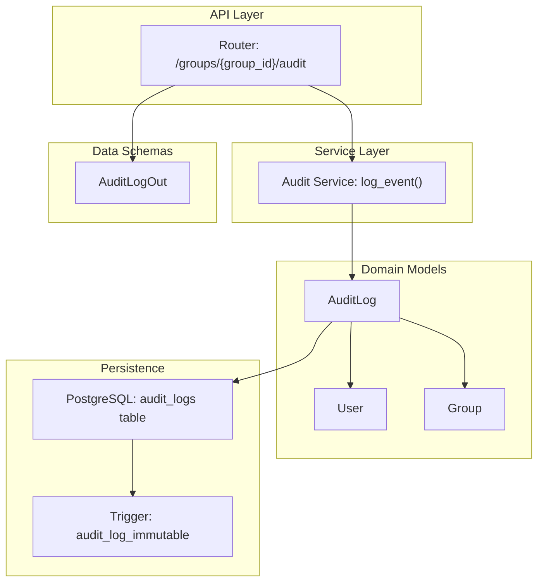
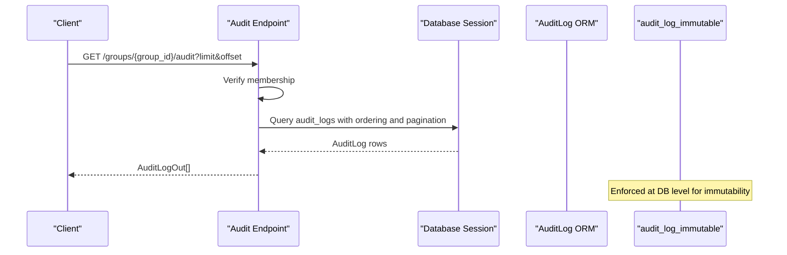
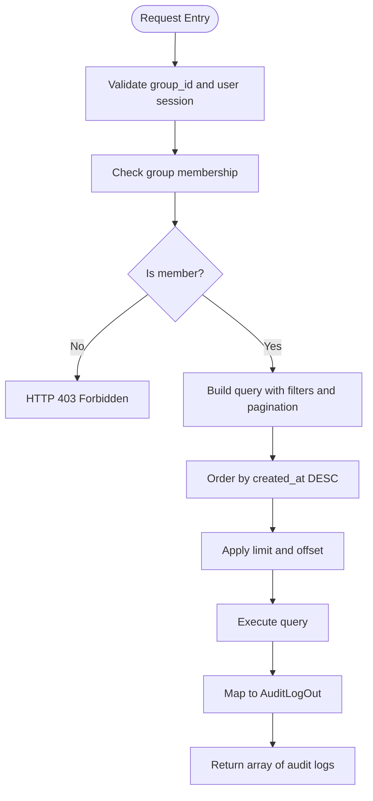
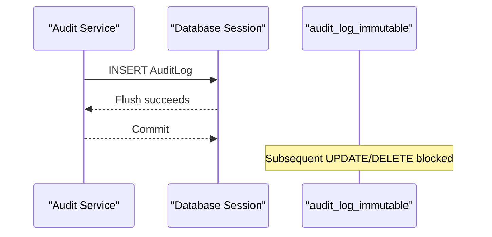
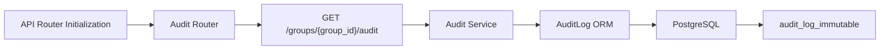

# Audit and Compliance

<cite>
**Referenced Files in This Document**
- [audit.py](file://backend/app/api/v1/endpoints/audit.py)
- [audit_service.py](file://backend/app/services/audit_service.py)
- [schemas.py](file://backend/app/schemas/schemas.py)
- [user.py](file://backend/app/models/user.py)
- [__init__.py](file://backend/app/api/v1/__init__.py)
- [config.py](file://backend/app/core/config.py)
- [001_initial.py](file://backend/alembic/versions/001_initial.py)
- [main.py](file://backend/app/main.py)
</cite>

## Table of Contents
1. [Introduction](#introduction)
2. [Project Structure](#project-structure)
3. [Core Components](#core-components)
4. [Architecture Overview](#architecture-overview)
5. [Detailed Component Analysis](#detailed-component-analysis)
6. [Dependency Analysis](#dependency-analysis)
7. [Performance Considerations](#performance-considerations)
8. [Troubleshooting Guide](#troubleshooting-guide)
9. [Conclusion](#conclusion)
10. [Appendices](#appendices)

## Introduction
This document provides comprehensive API documentation for audit and compliance endpoints. It covers:
- Audit log retrieval for groups with pagination and access control
- Immutable audit trail implementation via database triggers
- Event capture and log formatting aligned with compliance needs
- Activity timeline endpoints for user actions, system events, and group activities
- Compliance reporting endpoints for regulatory requirements and data retention
- Request/response schemas, filtering options, and data export formats
- Examples of audit log queries, compliance reporting workflows, and activity monitoring scenarios
- Data privacy considerations, retention policies, and legal compliance requirements
- Audit log integrity, tamper-evident storage, and access control mechanisms

## Project Structure
The audit and compliance functionality is implemented across the following layers:
- API endpoints: FastAPI router exposing group audit log retrieval
- Services: Audit logging service with immutable append semantics
- Models: SQLAlchemy ORM definitions for audit logs and related entities
- Schemas: Pydantic models for request/response serialization
- Alembic migrations: Database schema and immutable trigger definition
- Application initialization: Trigger enforcement during startup



**Diagram sources**
- [audit.py:10-39](file://backend/app/api/v1/endpoints/audit.py#L10-L39)
- [audit_service.py:6-31](file://backend/app/services/audit_service.py#L6-L31)
- [user.py:184-199](file://backend/app/models/user.py#L184-L199)
- [schemas.py:421-431](file://backend/app/schemas/schemas.py#L421-L431)
- [001_initial.py:155-172](file://backend/alembic/versions/001_initial.py#L155-L172)

**Section sources**
- [audit.py:10-39](file://backend/app/api/v1/endpoints/audit.py#L10-L39)
- [audit_service.py:6-31](file://backend/app/services/audit_service.py#L6-L31)
- [user.py:184-199](file://backend/app/models/user.py#L184-L199)
- [schemas.py:421-431](file://backend/app/schemas/schemas.py#L421-L431)
- [__init__.py:1-12](file://backend/app/api/v1/__init__.py#L1-L12)
- [001_initial.py:155-172](file://backend/alembic/versions/001_initial.py#L155-L172)

## Core Components
- Audit endpoint: GET /groups/{group_id}/audit
  - Purpose: Retrieve audit logs for a group with pagination
  - Access control: Requires membership verification
  - Response: Array of AuditLogOut entries ordered by creation time (newest first)
- Audit service: log_event(...)
  - Purpose: Append immutable audit log entries
  - Behavior: Prevents updates/deletes via database trigger
- Data models and enums:
  - AuditEventType: event taxonomy for expenses, settlements, disputes, and group membership
  - AuditLog: structured audit record with JSON fields for pre/post state and metadata
- Schemas:
  - AuditLogOut: serialized representation of audit records for clients

Key capabilities:
- Pagination via limit and offset parameters
- Membership-based access control enforced at API boundary
- Immutable audit trail via PostgreSQL trigger
- Structured event capture with before/after JSON snapshots and optional metadata

**Section sources**
- [audit.py:13-39](file://backend/app/api/v1/endpoints/audit.py#L13-L39)
- [audit_service.py:6-31](file://backend/app/services/audit_service.py#L6-L31)
- [user.py:37-49](file://backend/app/models/user.py#L37-L49)
- [user.py:184-199](file://backend/app/models/user.py#L184-L199)
- [schemas.py:421-431](file://backend/app/schemas/schemas.py#L421-L431)

## Architecture Overview
The audit system follows a layered architecture:
- API layer validates permissions and applies pagination
- Service layer persists immutable audit entries
- Database enforces immutability via a trigger
- Clients consume paginated audit timelines



**Diagram sources**
- [audit.py:13-39](file://backend/app/api/v1/endpoints/audit.py#L13-L39)
- [audit_service.py:6-31](file://backend/app/services/audit_service.py#L6-L31)
- [001_initial.py:155-172](file://backend/alembic/versions/001_initial.py#L155-L172)

## Detailed Component Analysis

### Audit Log Retrieval Endpoint
- Path: GET /groups/{group_id}/audit
- Authentication: Requires a valid session token
- Authorization: Validates membership in the target group
- Query parameters:
  - limit: integer, min 1, max 100, default 20
  - offset: integer, min 0, default 0
- Response: Array of AuditLogOut items, newest first
- Access control: Raises 403 if the current user is not a member of the group



**Diagram sources**
- [audit.py:13-39](file://backend/app/api/v1/endpoints/audit.py#L13-L39)

**Section sources**
- [audit.py:13-39](file://backend/app/api/v1/endpoints/audit.py#L13-L39)

### Immutable Audit Trail Implementation
- Database trigger: audit_log_immutable prevents UPDATE and DELETE operations on audit_logs
- Service method: log_event(...) creates a new AuditLog row and flushes it
- Immutability guarantees: Once persisted, audit entries cannot be altered or removed



**Diagram sources**
- [audit_service.py:6-31](file://backend/app/services/audit_service.py#L6-L31)
- [001_initial.py:155-172](file://backend/alembic/versions/001_initial.py#L155-L172)

**Section sources**
- [audit_service.py:6-31](file://backend/app/services/audit_service.py#L6-L31)
- [001_initial.py:155-172](file://backend/alembic/versions/001_initial.py#L155-L172)

### Activity Timeline Endpoints
- Current implementation: GET /groups/{group_id}/audit provides a chronological timeline of events for a group
- Filtering: No explicit filter parameters are supported in the current endpoint
- Pagination: Supported via limit and offset
- Timestamp-based queries: Not implemented; future enhancements could add date range filters

Note: The frontend includes an Activity screen and an Audit screen, indicating potential UI surfaces for viewing timelines and audit details.

**Section sources**
- [audit.py:13-39](file://backend/app/api/v1/endpoints/audit.py#L13-L39)
- [frontend/activity.tsx](file://frontend/app/(tabs)/activity.tsx)
- [frontend/audit.tsx](file://frontend/app/audit.tsx)

### Compliance Reporting Endpoints
- Current state: No dedicated compliance reporting endpoint exists under /groups/{group_id}/audit/report
- Recommended implementation:
  - Define a new endpoint to generate compliance reports (e.g., CSV/PDF exports)
  - Support filters: event types, date ranges, actors, entities
  - Enforce access control: require appropriate roles (e.g., admin)
  - Retention policy: align exports with organizational data retention
  - Integrity: sign or hash exported datasets for tamper evidence

Note: This section outlines recommended additions; no existing implementation is present in the referenced files.

### Request and Response Schemas
- Request
  - GET /groups/{group_id}/audit
    - Path parameters: group_id (integer)
    - Query parameters: limit (integer), offset (integer)
- Response
  - Array of AuditLogOut:
    - id (integer)
    - event_type (enum)
    - entity_id (optional integer)
    - actor (UserOut)
    - before_json (optional JSON)
    - after_json (optional JSON)
    - metadata_json (optional JSON)
    - created_at (timestamp)

```mermaid
classDiagram
class AuditLogOut {
+int id
+AuditEventType event_type
+int? entity_id
+UserOut actor
+dict? before_json
+dict? after_json
+dict? metadata_json
+datetime created_at
}
class UserOut {
+int id
+string phone
+string? name
+string? email
+string? upi_id
+string? avatar_url
+bool is_paid_tier
+datetime created_at
}
class AuditEventType {
<<enum>>
"expense_created"
"expense_edited"
"expense_deleted"
"settlement_initiated"
"settlement_confirmed"
"settlement_disputed"
"dispute_resolved"
"member_added"
"member_removed"
"group_created"
"group_updated"
}
AuditLogOut --> UserOut : "references"
AuditLogOut --> AuditEventType : "uses"
```

**Diagram sources**
- [schemas.py:421-431](file://backend/app/schemas/schemas.py#L421-L431)
- [user.py:37-49](file://backend/app/models/user.py#L37-L49)
- [user.py:102-112](file://backend/app/schemas/schemas.py#L102-L112)

**Section sources**
- [schemas.py:421-431](file://backend/app/schemas/schemas.py#L421-L431)
- [user.py:37-49](file://backend/app/models/user.py#L37-L49)
- [user.py:102-112](file://backend/app/schemas/schemas.py#L102-L112)

### Data Export Formats
- Current state: No export endpoint is implemented
- Recommended formats: CSV, JSON, PDF
- Fields to include: event_type, entity_id, actor attributes, timestamps, before/after snapshots, metadata
- Integrity measures: cryptographic hashing or digital signatures for exported datasets

Note: This section proposes future enhancements; no existing implementation is present in the referenced files.

## Dependency Analysis
- API router registration includes the audit router
- Audit endpoint depends on:
  - Current user extraction
  - Database session
  - Group membership verification
  - AuditLog ORM model
- Audit service depends on:
  - AuditLog ORM model
  - Database session
- Database trigger ensures immutability for audit_logs



**Diagram sources**
- [__init__.py:1-12](file://backend/app/api/v1/__init__.py#L1-L12)
- [audit.py:10-39](file://backend/app/api/v1/endpoints/audit.py#L10-L39)
- [audit_service.py:6-31](file://backend/app/services/audit_service.py#L6-L31)
- [user.py:184-199](file://backend/app/models/user.py#L184-L199)
- [001_initial.py:155-172](file://backend/alembic/versions/001_initial.py#L155-L172)

**Section sources**
- [__init__.py:1-12](file://backend/app/api/v1/__init__.py#L1-L12)
- [audit.py:10-39](file://backend/app/api/v1/endpoints/audit.py#L10-L39)
- [audit_service.py:6-31](file://backend/app/services/audit_service.py#L6-L31)
- [user.py:184-199](file://backend/app/models/user.py#L184-L199)
- [001_initial.py:155-172](file://backend/alembic/versions/001_initial.py#L155-L172)

## Performance Considerations
- Pagination: Use limit and offset to constrain result sets; enforce upper bounds to avoid heavy queries
- Indexing: AuditLog includes indices on group_id, entity_id, and created_at to support efficient querying
- Ordering: Default descending order by created_at minimizes client-side sorting overhead
- Immutability: Trigger-based immutability avoids application-level checks but relies on database constraints

[No sources needed since this section provides general guidance]

## Troubleshooting Guide
- 403 Forbidden when accessing audit logs:
  - Cause: Current user is not a member of the requested group
  - Resolution: Ensure the user belongs to the group or adjust access controls
- Empty results:
  - Cause: No audit logs for the group or pagination parameters exclude all records
  - Resolution: Adjust limit/offset or verify event capture
- Database errors on write operations:
  - Cause: Attempted UPDATE/DELETE on audit_logs
  - Resolution: Use read-only queries; immutability is enforced by the trigger

**Section sources**
- [audit.py:21-29](file://backend/app/api/v1/endpoints/audit.py#L21-L29)
- [001_initial.py:155-172](file://backend/alembic/versions/001_initial.py#L155-L172)

## Conclusion
The current implementation provides a secure, immutable audit log retrieval mechanism for groups with robust access control and pagination. The audit trail is enforced at the database level, ensuring integrity. Future enhancements should focus on:
- Adding compliance reporting endpoints with filtering and export capabilities
- Implementing timestamp-based queries and advanced filters
- Defining clear data retention and privacy policies
- Enhancing access control for sensitive audit data

[No sources needed since this section summarizes without analyzing specific files]

## Appendices

### API Definition: Audit Log Retrieval
- Method: GET
- Path: /groups/{group_id}/audit
- Path parameters:
  - group_id (integer): Target group identifier
- Query parameters:
  - limit (integer, optional): Number of records to return (min 1, max 100, default 20)
  - offset (integer, optional): Record offset (min 0, default 0)
- Responses:
  - 200 OK: Array of AuditLogOut
  - 403 Forbidden: Not a member of the group

**Section sources**
- [audit.py:13-39](file://backend/app/api/v1/endpoints/audit.py#L13-L39)

### Compliance Reporting Workflow (Proposed)
- Endpoint: POST /groups/{group_id}/audit/report
- Filters:
  - event_types: array of AuditEventType
  - start_time: ISO 8601 timestamp
  - end_time: ISO 8601 timestamp
  - actors: array of actor IDs
  - entities: array of entity IDs
- Output formats:
  - CSV: includes all fields from AuditLogOut plus derived columns
  - JSON: compact array of AuditLogOut
  - PDF: human-readable report with summary statistics
- Access control:
  - Require admin role or equivalent
- Retention:
  - Apply organization-wide retention policy before export
- Integrity:
  - Sign exported dataset or compute and attach a hash

Note: This section outlines recommended additions; no existing implementation is present in the referenced files.

### Data Privacy and Legal Compliance
- Data minimization: Only persist necessary fields in before_json/after_json/metadata_json
- Consent: Ensure users consent to audit logging per applicable regulations
- Right to erasure: Align with data retention policies; immutable logs complicate deletion
- Cross-border transfers: If exporting data, ensure lawful transfers per GDPR/other regulations
- Audit trail integrity: Use cryptographic hashes or digital signatures for tamper evidence

[No sources needed since this section provides general guidance]

### Audit Log Integrity and Tamper-Evident Storage
- Database-level immutability via trigger
- Optional application-level hashing of sensitive JSON payloads
- Signed exports for external sharing
- Secure storage of audit logs with access controls

**Section sources**
- [001_initial.py:155-172](file://backend/alembic/versions/001_initial.py#L155-L172)
- [audit_service.py:16-19](file://backend/app/services/audit_service.py#L16-L19)

### Access Control Mechanisms
- Membership verification at API boundary
- Role-based access for sensitive operations (recommended for future reporting endpoints)
- Token-based authentication and authorization middleware

**Section sources**
- [audit.py:21-29](file://backend/app/api/v1/endpoints/audit.py#L21-L29)
- [config.py:10-14](file://backend/app/core/config.py#L10-L14)