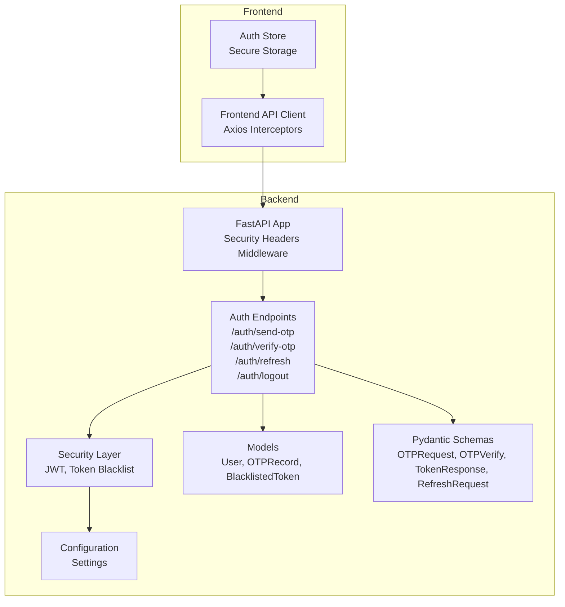
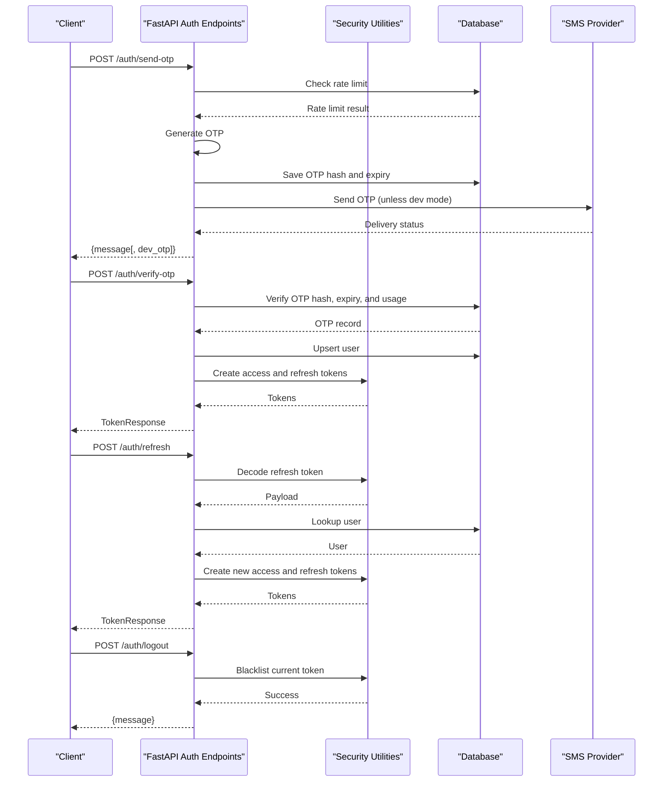
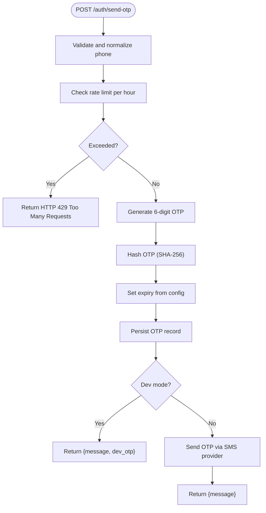
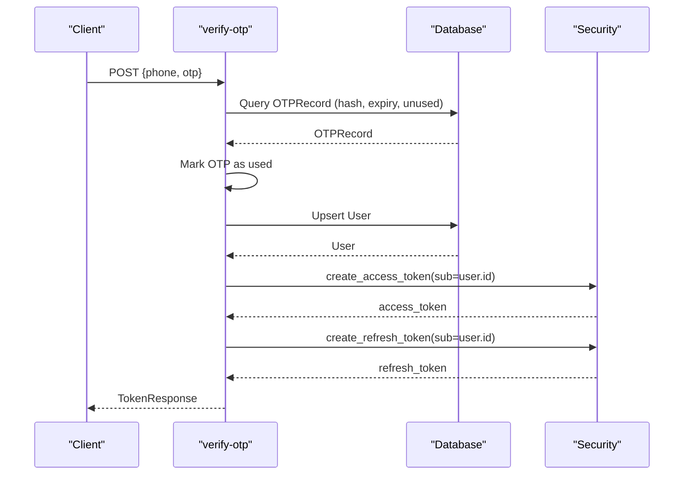
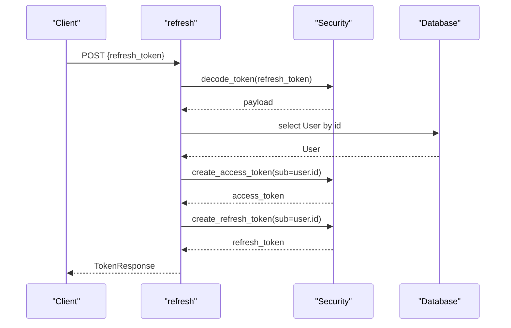
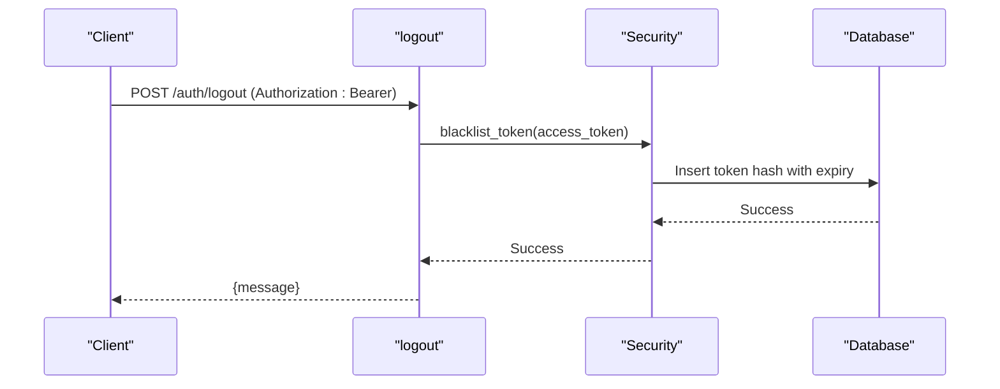
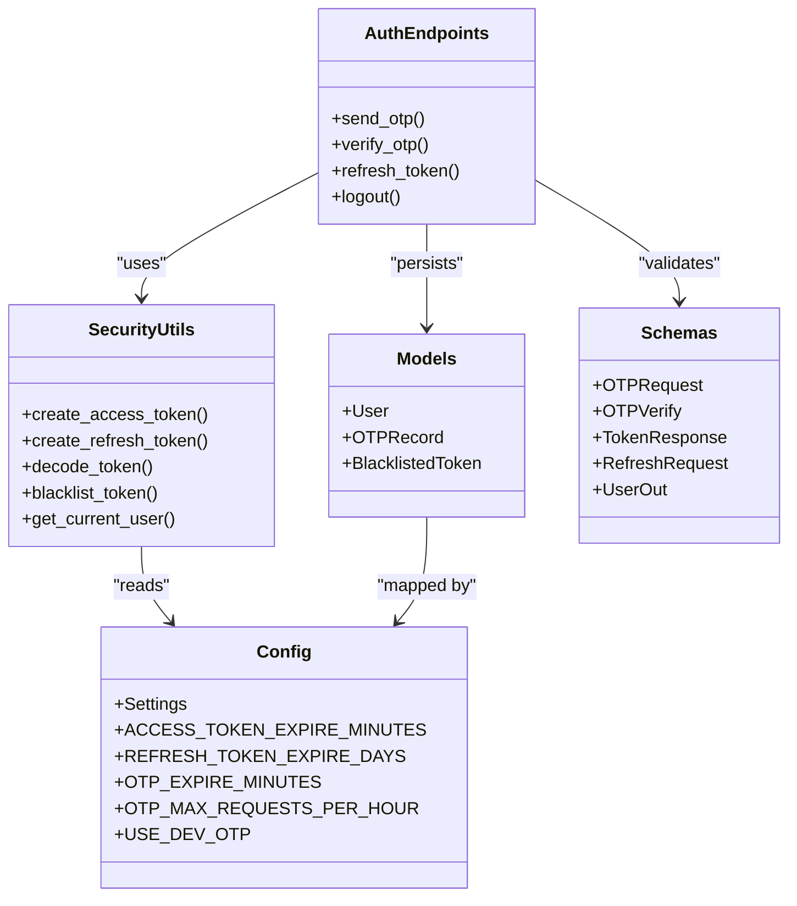

# Authentication System

<cite>
**Referenced Files in This Document**
- [auth.py](file://backend/app/api/v1/endpoints/auth.py)
- [schemas.py](file://backend/app/schemas/schemas.py)
- [security.py](file://backend/app/core/security.py)
- [user.py](file://backend/app/models/user.py)
- [config.py](file://backend/app/core/config.py)
- [main.py](file://backend/app/main.py)
- [api.ts](file://frontend/src/services/api.ts)
- [authStore.ts](file://frontend/src/store/authStore.ts)
</cite>

## Table of Contents
1. [Introduction](#introduction)
2. [Project Structure](#project-structure)
3. [Core Components](#core-components)
4. [Architecture Overview](#architecture-overview)
5. [Detailed Component Analysis](#detailed-component-analysis)
6. [Dependency Analysis](#dependency-analysis)
7. [Performance Considerations](#performance-considerations)
8. [Troubleshooting Guide](#troubleshooting-guide)
9. [Conclusion](#conclusion)

## Introduction
This document provides comprehensive API documentation for the authentication system endpoints. It covers OTP generation and verification, token refresh, logout, and token invalidation. The documentation includes request/response schemas, error codes, security headers, rate limiting policies, and practical examples of authentication flows, token handling, and session management. Security considerations such as OTP expiration, brute force protection, and token security best practices are addressed throughout.

## Project Structure
The authentication system is implemented in the backend Python application using FastAPI. The key components include:
- Authentication endpoints under `/api/v1/auth`
- Pydantic models for request/response validation
- JWT-based token generation and validation
- Rate limiting and OTP delivery mechanisms
- Frontend integration for token storage and automatic refresh

**Diagram sources**
- [main.py:16-56](file://backend/app/main.py#L16-L56)
- [auth.py:17-147](file://backend/app/api/v1/endpoints/auth.py#L17-L147)
- [security.py:14-96](file://backend/app/core/security.py#L14-L96)
- [user.py:51-88](file://backend/app/models/user.py#L51-L88)
- [schemas.py:10-56](file://backend/app/schemas/schemas.py#L10-L56)
- [config.py:6-71](file://backend/app/core/config.py#L6-L71)
- [api.ts:42-169](file://frontend/src/services/api.ts#L42-L169)
- [authStore.ts:29-111](file://frontend/src/store/authStore.ts#L29-L111)

**Section sources**
- [main.py:16-56](file://backend/app/main.py#L16-L56)
- [auth.py:17-147](file://backend/app/api/v1/endpoints/auth.py#L17-L147)
- [schemas.py:10-56](file://backend/app/schemas/schemas.py#L10-L56)
- [security.py:14-96](file://backend/app/core/security.py#L14-L96)
- [user.py:51-88](file://backend/app/models/user.py#L51-L88)
- [config.py:6-71](file://backend/app/core/config.py#L6-L71)
- [api.ts:42-169](file://frontend/src/services/api.ts#L42-L169)
- [authStore.ts:29-111](file://frontend/src/store/authStore.ts#L29-L111)

## Core Components
This section outlines the core components involved in the authentication system and their responsibilities.

- Authentication Endpoints: Implements OTP generation, verification, token refresh, and logout.
- Pydantic Schemas: Define request/response validation for phone number normalization, OTP format, and token response structure.
- Security Layer: Manages JWT creation, decoding, token blacklisting, and current user retrieval.
- Database Models: Represent users, OTP records, and blacklisted tokens.
- Configuration: Provides security keys, token expiration, OTP settings, and rate limiting parameters.
- Frontend Integration: Handles token storage, automatic refresh, and logout.

**Section sources**
- [auth.py:17-147](file://backend/app/api/v1/endpoints/auth.py#L17-L147)
- [schemas.py:10-56](file://backend/app/schemas/schemas.py#L10-L56)
- [security.py:14-96](file://backend/app/core/security.py#L14-L96)
- [user.py:51-88](file://backend/app/models/user.py#L51-L88)
- [config.py:6-71](file://backend/app/core/config.py#L6-L71)

## Architecture Overview
The authentication architecture follows a layered approach:
- Presentation Layer: FastAPI endpoints handle HTTP requests and responses.
- Validation Layer: Pydantic models validate and normalize input data.
- Business Logic Layer: Endpoints implement OTP generation, verification, token refresh, and logout.
- Security Layer: JWT utilities manage token lifecycle and blacklist enforcement.
- Persistence Layer: SQLAlchemy models represent data structures and relationships.
- Frontend Integration: Axios interceptors automatically attach tokens and refresh them on 401 errors.

**Diagram sources**
- [auth.py:58-147](file://backend/app/api/v1/endpoints/auth.py#L58-L147)
- [security.py:17-96](file://backend/app/core/security.py#L17-L96)
- [user.py:51-88](file://backend/app/models/user.py#L51-L88)
- [config.py:30-36](file://backend/app/core/config.py#L30-L36)

## Detailed Component Analysis

### OTP Generation Endpoint
The OTP generation endpoint handles phone number validation, rate limiting, OTP generation, hashing, persistence, and delivery.

- Endpoint: POST /auth/send-otp
- Request Schema: OTPRequest
  - phone: string (validated and normalized)
- Response: JSON object with message and optional dev_otp in dev mode
- Phone Number Validation:
  - Strips spaces and ensures leading plus sign
  - Prepends country code if missing
  - Validates length
- Rate Limiting:
  - Enforces maximum OTP requests per hour per phone number
  - Uses database count within the last hour
  - Returns HTTP 429 when exceeded
- OTP Generation and Delivery:
  - Generates a 6-digit OTP
  - Hashes OTP using SHA-256
  - Sets expiry based on configuration
  - Persists OTP record
  - Sends SMS via provider unless dev mode is enabled
  - In dev mode, returns OTP in response for testing

**Diagram sources**
- [auth.py:58-80](file://backend/app/api/v1/endpoints/auth.py#L58-L80)
- [schemas.py:10-22](file://backend/app/schemas/schemas.py#L10-L22)
- [config.py:30-36](file://backend/app/core/config.py#L30-L36)

**Section sources**
- [auth.py:58-80](file://backend/app/api/v1/endpoints/auth.py#L58-L80)
- [schemas.py:10-22](file://backend/app/schemas/schemas.py#L10-L22)
- [config.py:30-36](file://backend/app/core/config.py#L30-L36)

### OTP Verification Endpoint
The OTP verification endpoint validates the OTP against stored records, marks OTP as used, creates or retrieves a user, and issues access and refresh tokens.

- Endpoint: POST /auth/verify-otp
- Request Schema: OTPVerify
  - phone: string (validated and normalized)
  - otp: string (validated as 6 digits)
- Response Schema: TokenResponse
  - access_token: string
  - refresh_token: string
  - token_type: string ("bearer")
  - user: UserOut
- Processing Logic:
  - Validates OTP against hash, expiry, and usage flag
  - Marks OTP as used upon successful verification
  - Creates user if not exists
  - Issues JWT access and refresh tokens
  - Returns TokenResponse with user details

**Diagram sources**
- [auth.py:82-116](file://backend/app/api/v1/endpoints/auth.py#L82-L116)
- [schemas.py:24-56](file://backend/app/schemas/schemas.py#L24-L56)
- [security.py:17-31](file://backend/app/core/security.py#L17-L31)
- [user.py:51-63](file://backend/app/models/user.py#L51-L63)

**Section sources**
- [auth.py:82-116](file://backend/app/api/v1/endpoints/auth.py#L82-L116)
- [schemas.py:24-56](file://backend/app/schemas/schemas.py#L24-L56)
- [security.py:17-31](file://backend/app/core/security.py#L17-L31)
- [user.py:51-63](file://backend/app/models/user.py#L51-L63)

### Token Refresh Endpoint
The token refresh endpoint accepts a refresh token, validates it, and issues new access and refresh tokens.

- Endpoint: POST /auth/refresh
- Request Schema: RefreshRequest
  - refresh_token: string
- Response Schema: TokenResponse
  - access_token: string
  - refresh_token: string
  - token_type: string ("bearer")
  - user: UserOut
- Processing Logic:
  - Decodes refresh token and verifies type
  - Looks up user by sub claim
  - Issues new access and refresh tokens
  - Returns TokenResponse

**Diagram sources**
- [auth.py:118-137](file://backend/app/api/v1/endpoints/auth.py#L118-L137)
- [schemas.py:54-56](file://backend/app/schemas/schemas.py#L54-L56)
- [security.py:33-30](file://backend/app/core/security.py#L33-L30)
- [user.py:51-63](file://backend/app/models/user.py#L51-L63)

**Section sources**
- [auth.py:118-137](file://backend/app/api/v1/endpoints/auth.py#L118-L137)
- [schemas.py:54-56](file://backend/app/schemas/schemas.py#L54-L56)
- [security.py:33-30](file://backend/app/core/security.py#L33-L30)
- [user.py:51-63](file://backend/app/models/user.py#L51-L63)

### Logout and Token Invalidation
The logout endpoint invalidates the current access token by blacklisting it.

- Endpoint: POST /auth/logout
- Authentication: Requires Bearer token
- Processing Logic:
  - Validates current access token
  - Adds token hash to blacklisted tokens table
  - Returns success message

**Diagram sources**
- [auth.py:139-147](file://backend/app/api/v1/endpoints/auth.py#L139-L147)
- [security.py:47-69](file://backend/app/core/security.py#L47-L69)
- [user.py:81-88](file://backend/app/models/user.py#L81-L88)

**Section sources**
- [auth.py:139-147](file://backend/app/api/v1/endpoints/auth.py#L139-L147)
- [security.py:47-69](file://backend/app/core/security.py#L47-L69)
- [user.py:81-88](file://backend/app/models/user.py#L81-L88)

## Dependency Analysis
The authentication system exhibits clear separation of concerns with well-defined dependencies.

**Diagram sources**
- [auth.py:17-147](file://backend/app/api/v1/endpoints/auth.py#L17-L147)
- [security.py:14-96](file://backend/app/core/security.py#L14-L96)
- [user.py:51-88](file://backend/app/models/user.py#L51-L88)
- [schemas.py:10-56](file://backend/app/schemas/schemas.py#L10-L56)
- [config.py:6-71](file://backend/app/core/config.py#L6-L71)

**Section sources**
- [auth.py:17-147](file://backend/app/api/v1/endpoints/auth.py#L17-L147)
- [security.py:14-96](file://backend/app/core/security.py#L14-L96)
- [user.py:51-88](file://backend/app/models/user.py#L51-L88)
- [schemas.py:10-56](file://backend/app/schemas/schemas.py#L10-L56)
- [config.py:6-71](file://backend/app/core/config.py#L6-L71)

## Performance Considerations
- OTP Expiration: Short-lived OTPs reduce exposure windows. Configure OTP expiry minutes appropriately.
- Rate Limiting: Hourly request caps prevent abuse; tune based on expected traffic.
- Token Expiration: Access tokens have shorter expiry; refresh tokens have longer expiry. Balance security and UX.
- Database Indexes: Ensure indexed fields (phone, token hash, expiry) for efficient lookups.
- Asynchronous Operations: Use async database sessions and HTTP client for non-blocking operations.

## Troubleshooting Guide
Common issues and resolutions:

- Invalid or Expired OTP
  - Cause: OTP mismatch, expired, or already used
  - Resolution: Regenerate OTP and ensure device time is synchronized
  - Reference: [auth.py:94-95](file://backend/app/api/v1/endpoints/auth.py#L94-L95)

- Too Many OTP Requests
  - Cause: Rate limit exceeded per hour
  - Resolution: Wait for reset period or adjust configuration
  - Reference: [auth.py:32-33](file://backend/app/api/v1/endpoints/auth.py#L32-L33), [config.py:36](file://backend/app/core/config.py#L36)

- Invalid Token Type
  - Cause: Using access token for refresh endpoint or vice versa
  - Resolution: Use correct token type for respective endpoint
  - Reference: [auth.py:121](file://backend/app/api/v1/endpoints/auth.py#L121), [security.py:33-40](file://backend/app/core/security.py#L33-L40)

- User Not Found
  - Cause: User deleted or account disabled
  - Resolution: Re-authenticate or contact support
  - Reference: [auth.py:126](file://backend/app/api/v1/endpoints/auth.py#L126)

- Token Revoked
  - Cause: Logged out or blacklisted
  - Resolution: Re-authenticate to obtain new tokens
  - Reference: [security.py:79-80](file://backend/app/core/security.py#L79-L80)

- SMS Delivery Failures
  - Cause: Provider API issues or misconfiguration
  - Resolution: Check provider credentials and network connectivity
  - Reference: [auth.py:54-55](file://backend/app/api/v1/endpoints/auth.py#L54-L55)

**Section sources**
- [auth.py:32-33](file://backend/app/api/v1/endpoints/auth.py#L32-L33)
- [auth.py:94-95](file://backend/app/api/v1/endpoints/auth.py#L94-L95)
- [auth.py:121](file://backend/app/api/v1/endpoints/auth.py#L121)
- [auth.py:126](file://backend/app/api/v1/endpoints/auth.py#L126)
- [security.py:79-80](file://backend/app/core/security.py#L79-L80)
- [auth.py:54-55](file://backend/app/api/v1/endpoints/auth.py#L54-L55)

## Conclusion
The authentication system provides a robust, secure, and user-friendly mechanism for phone-based authentication. It enforces strong validation, rate limiting, and token security while offering seamless token refresh and logout capabilities. The frontend integration ensures secure token storage and automatic refresh, enhancing the overall user experience. Adhering to the documented schemas, policies, and security practices will help maintain a reliable and secure authentication flow.