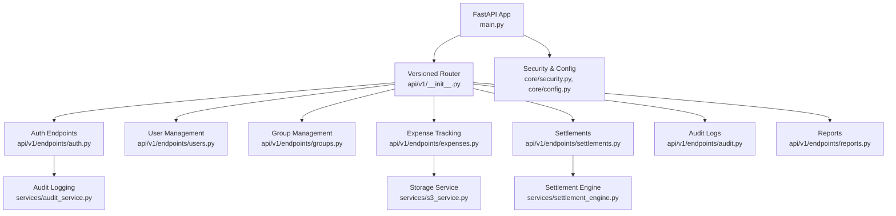
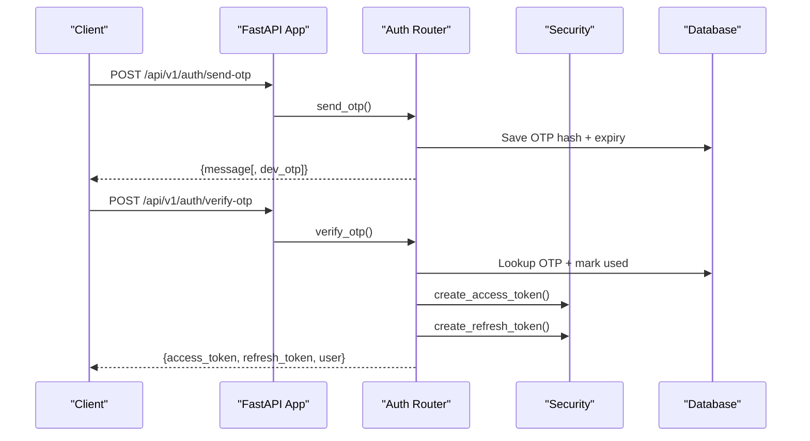
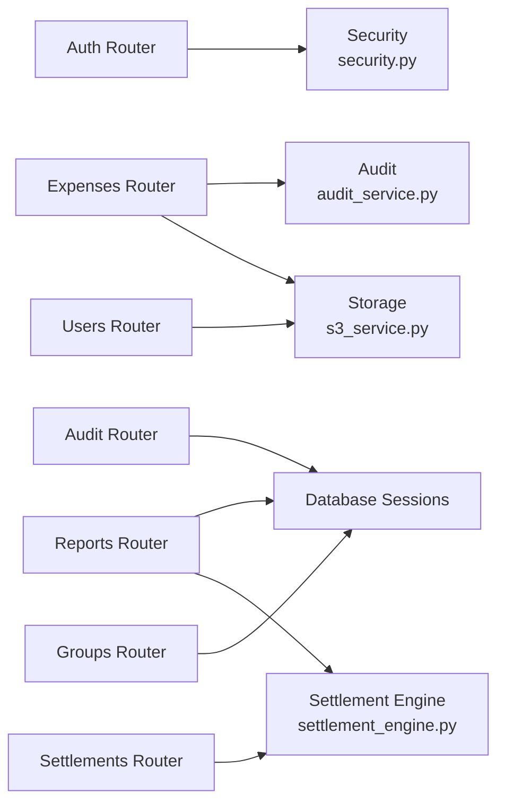
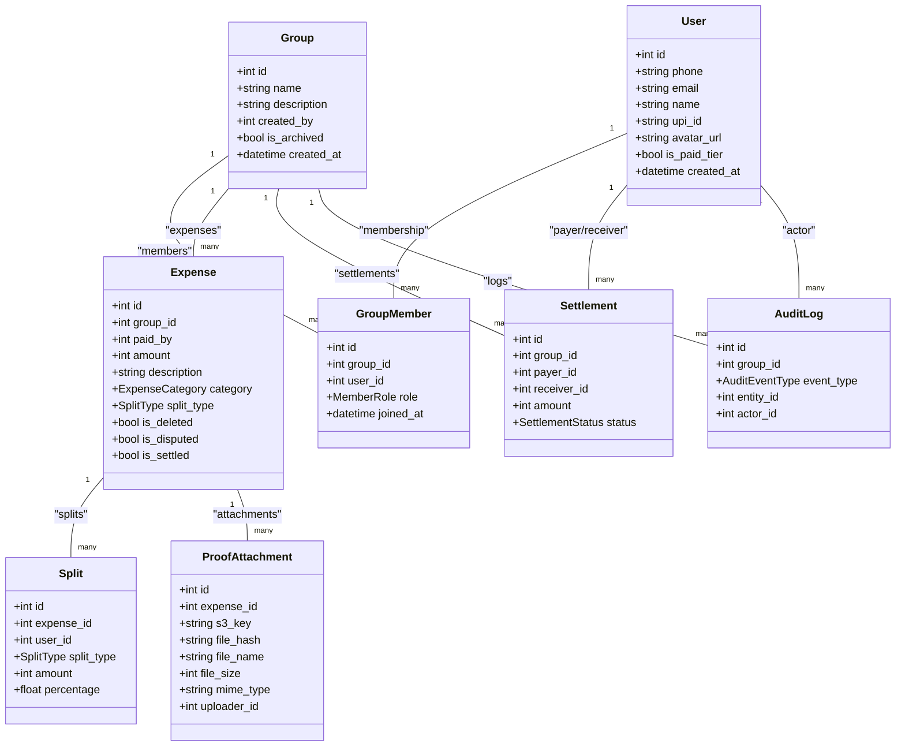

# Backend API Documentation

<cite>
**Referenced Files in This Document**
- [main.py](file://backend/app/main.py)
- [__init__.py](file://backend/app/api/v1/__init__.py)
- [auth.py](file://backend/app/api/v1/endpoints/auth.py)
- [users.py](file://backend/app/api/v1/endpoints/users.py)
- [groups.py](file://backend/app/api/v1/endpoints/groups.py)
- [expenses.py](file://backend/app/api/v1/endpoints/expenses.py)
- [settlements.py](file://backend/app/api/v1/endpoints/settlements.py)
- [audit.py](file://backend/app/api/v1/endpoints/audit.py)
- [reports.py](file://backend/app/api/v1/endpoints/reports.py)
- [schemas.py](file://backend/app/schemas/schemas.py)
- [user.py](file://backend/app/models/user.py)
- [config.py](file://backend/app/core/config.py)
- [security.py](file://backend/app/core/security.py)
- [settlement_engine.py](file://backend/app/services/settlement_engine.py)
- [audit_service.py](file://backend/app/services/audit_service.py)
- [s3_service.py](file://backend/app/services/s3_service.py)
</cite>

## Table of Contents
1. [Introduction](#introduction)
2. [Project Structure](#project-structure)
3. [Core Components](#core-components)
4. [Architecture Overview](#architecture-overview)
5. [Detailed Component Analysis](#detailed-component-analysis)
6. [Dependency Analysis](#dependency-analysis)
7. [Performance Considerations](#performance-considerations)
8. [Troubleshooting Guide](#troubleshooting-guide)
9. [Conclusion](#conclusion)
10. [Appendices](#appendices)

## Introduction
This document describes the SplitSure backend REST API built with FastAPI. It covers all HTTP endpoints grouped by functionality, authentication and authorization requirements, request/response schemas, error handling, security controls, rate limiting, and operational notes. The API follows a versioned prefix pattern (/api/v1) and exposes endpoints for authentication, user management, group lifecycle, expense tracking, settlement processing, audit logging, and report generation.

## Project Structure
The backend is organized around a modular FastAPI application with versioned routers and domain-focused endpoint modules. Core services handle security, storage, settlement computation, and auditing.

**Diagram sources**
- [main.py:16-56](file://backend/app/main.py#L16-L56)
- [__init__.py:1-12](file://backend/app/api/v1/__init__.py#L1-L12)
- [auth.py:1-147](file://backend/app/api/v1/endpoints/auth.py#L1-L147)
- [users.py:1-99](file://backend/app/api/v1/endpoints/users.py#L1-L99)
- [groups.py:1-309](file://backend/app/api/v1/endpoints/groups.py#L1-L309)
- [expenses.py:1-395](file://backend/app/api/v1/endpoints/expenses.py#L1-L395)
- [settlements.py:1-501](file://backend/app/api/v1/endpoints/settlements.py#L1-L501)
- [audit.py:1-40](file://backend/app/api/v1/endpoints/audit.py#L1-L40)
- [reports.py:1-282](file://backend/app/api/v1/endpoints/reports.py#L1-L282)
- [security.py:1-96](file://backend/app/core/security.py#L1-L96)
- [config.py:1-71](file://backend/app/core/config.py#L1-L71)
- [s3_service.py:1-158](file://backend/app/services/s3_service.py#L1-L158)
- [settlement_engine.py:1-106](file://backend/app/services/settlement_engine.py#L1-L106)
- [audit_service.py:1-32](file://backend/app/services/audit_service.py#L1-L32)

**Section sources**
- [main.py:16-56](file://backend/app/main.py#L16-L56)
- [__init__.py:1-12](file://backend/app/api/v1/__init__.py#L1-L12)

## Core Components
- Versioned API: All endpoints are mounted under /api/v1.
- Authentication: Bearer tokens with JWT access/refresh lifecycle and token blacklisting.
- Authorization: Role-based checks (ADMIN/MEMBER) for group operations.
- Storage: Local filesystem in development, AWS S3 in production; presigned URLs for secure access.
- Settlement Engine: Greedy algorithm to compute minimal transactions and UPI deep links.
- Audit Trail: Immutable audit logs with PostgreSQL trigger enforcement.

**Section sources**
- [main.py:56-96](file://backend/app/main.py#L56-L96)
- [security.py:1-96](file://backend/app/core/security.py#L1-L96)
- [config.py:1-71](file://backend/app/core/config.py#L1-L71)
- [s3_service.py:1-158](file://backend/app/services/s3_service.py#L1-L158)
- [settlement_engine.py:1-106](file://backend/app/services/settlement_engine.py#L1-L106)
- [audit_service.py:1-32](file://backend/app/services/audit_service.py#L1-L32)

## Architecture Overview
The API enforces authentication for protected routes, delegates business logic to services, persists data via SQLAlchemy ORM, and emits audit events for compliance.

**Diagram sources**
- [auth.py:58-116](file://backend/app/api/v1/endpoints/auth.py#L58-L116)
- [security.py:17-31](file://backend/app/core/security.py#L17-L31)
- [config.py:10-14](file://backend/app/core/config.py#L10-L14)

## Detailed Component Analysis

### Authentication Endpoints (/api/v1/auth)
- Purpose: Phone-based OTP login, JWT issuance, refresh, and logout.
- Rate Limiting: Max OTP requests per hour enforced per phone.
- Security: Optional dev-mode OTP return; production uses external SMS provider.

Endpoints
- POST /api/v1/auth/send-otp
  - Request: OTPRequest (phone)
  - Response: {message[, dev_otp], dev_note} (dev mode)
  - Errors: 429 Too Many Requests (rate limit)
- POST /api/v1/auth/verify-otp
  - Request: OTPVerify (phone, otp)
  - Response: TokenResponse (access_token, refresh_token, user)
  - Errors: 400 Invalid/expired OTP
- POST /api/v1/auth/refresh
  - Request: RefreshRequest (refresh_token)
  - Response: TokenResponse
  - Errors: 401 Invalid token type or user not found
- POST /api/v1/auth/logout
  - Request: Authorization Bearer token
  - Response: {message}
  - Behavior: Blacklists token

Validation and Limits
- Phone normalization (+91 prepended if missing spaces/digits).
- OTP length and digits validation.
- OTP expiry window and reuse prevention.
- Rate limit per phone per hour.

**Section sources**
- [auth.py:58-147](file://backend/app/api/v1/endpoints/auth.py#L58-L147)
- [schemas.py:10-45](file://backend/app/schemas/schemas.py#L10-L45)
- [config.py:30-36](file://backend/app/core/config.py#L30-L36)
- [security.py:47-96](file://backend/app/core/security.py#L47-L96)

### User Management Endpoints (/api/v1/users)
- Purpose: Self-service profile updates, avatar uploads, push token registration.

Endpoints
- GET /api/v1/users/me
  - Response: UserOut
- PATCH /api/v1/users/me
  - Request: UserUpdate (name, email, upi_id)
  - Response: UserOut
  - Errors: 409 Email conflict, 500 Database error
- POST /api/v1/users/me/avatar
  - Request: multipart/form-data (file)
  - Response: UserOut
  - Constraints: JPEG/PNG/WebP, <= 2MB; hash-based key; URL returned
- POST /api/v1/users/me/push-token
  - Request: {push_token}
  - Response: {status: ok}
  - Errors: 400 Missing push_token

Storage
- Local or S3 based on configuration; presigned URLs for avatar retrieval.

**Section sources**
- [users.py:16-99](file://backend/app/api/v1/endpoints/users.py#L16-L99)
- [schemas.py:60-112](file://backend/app/schemas/schemas.py#L60-L112)
- [s3_service.py:105-147](file://backend/app/services/s3_service.py#L105-L147)

### Group Management Endpoints (/api/v1/groups)
- Purpose: Create/update/archive/unarchive groups; manage members and invites.

Authorization
- Membership required for read; ADMIN required for write operations.

Endpoints
- POST /api/v1/groups
  - Request: GroupCreate (name, description)
  - Response: GroupOut (creator auto-added as ADMIN)
- GET /api/v1/groups
  - Query: include_archived (bool)
  - Response: List[GroupOut]
- GET /api/v1/groups/{group_id}
  - Response: GroupOut
- PATCH /api/v1/groups/{group_id}
  - Request: GroupUpdate (name, description)
  - Response: GroupOut
- POST /api/v1/groups/{group_id}/members
  - Request: AddMemberRequest (phone)
  - Response: GroupMemberOut
  - Errors: 400 Max members reached, 404 Not found (non-dev), 400 Already member
- DELETE /api/v1/groups/{group_id}/members/{user_id}
  - Errors: 400 Cannot remove self, 404 Member not found
- POST /api/v1/groups/{group_id}/invite
  - Response: InviteLinkOut (token, expires_at, use_count, max_uses)
- POST /api/v1/groups/join/{token}
  - Response: GroupMemberOut
  - Errors: 404 Invalid/expired/usage exceeded, 400 Already member
- DELETE /api/v1/groups/{group_id}
  - Archive group (ADMIN only)
- POST /api/v1/groups/{group_id}/unarchive
  - Response: GroupOut

**Section sources**
- [groups.py:58-309](file://backend/app/api/v1/endpoints/groups.py#L58-L309)
- [schemas.py:117-193](file://backend/app/schemas/schemas.py#L117-L193)
- [models.py:18-49](file://backend/app/models/user.py#L18-L49)
- [config.py:46-51](file://backend/app/core/config.py#L46-L51)

### Expense Tracking Endpoints (/api/v1/groups/{group_id}/expenses)
- Purpose: Full CRUD for expenses, disputes, and proof attachments.

Authorization
- Membership required for all operations.

Endpoints
- POST /api/v1/groups/{group_id}/expenses
  - Request: ExpenseCreate (amount paise, description, category, split_type, splits)
  - Response: ExpenseOut (with presigned URLs for proofs)
- GET /api/v1/groups/{group_id}/expenses
  - Query: category, search, limit, offset
  - Response: List[ExpenseOut]
- GET /api/v1/groups/{group_id}/expenses/{expense_id}
  - Response: ExpenseOut
- PATCH /api/v1/groups/{group_id}/expenses/{expense_id}
  - Request: ExpenseUpdate (amount, description, category, split_type, splits)
  - Errors: 400 Cannot edit settled/disputed
- DELETE /api/v1/groups/{group_id}/expenses/{expense_id}
  - Errors: 400 Cannot delete settled/disputed
- POST /api/v1/groups/{group_id}/expenses/{expense_id}/dispute
  - Request: DisputeRequest (note)
  - Response: ExpenseOut
- POST /api/v1/groups/{group_id}/expenses/{expense_id}/resolve-dispute
  - Only ADMIN; toggles dispute flag
- POST /api/v1/groups/{group_id}/expenses/{expense_id}/attachments
  - Request: multipart/form-data (file)
  - Response: ProofAttachmentOut (presigned URL)
  - Constraints: <= MAX_ATTACHMENTS_PER_EXPENSE, supported MIME types, size limits

Validation
- Split totals validated per split_type.
- Search length capped.
- Presigned URLs generated for secure access.

**Section sources**
- [expenses.py:143-395](file://backend/app/api/v1/endpoints/expenses.py#L143-L395)
- [schemas.py:197-322](file://backend/app/schemas/schemas.py#L197-L322)
- [models.py:12-49](file://backend/app/models/user.py#L12-L49)
- [config.py:46-49](file://backend/app/core/config.py#L46-L49)
- [s3_service.py:105-147](file://backend/app/services/s3_service.py#L105-L147)

### Settlement Processing Endpoints (/api/v1/groups/{group_id}/settlements)
- Purpose: Compute balances, initiate, confirm, dispute, and resolve settlements; notify via push.

Authorization
- Membership required; receiver confirms; ADMIN resolves disputes.

Endpoints
- GET /api/v1/groups/{group_id}/settlements/balances
  - Response: GroupBalancesOut (per-member summaries and optimized instructions)
- POST /api/v1/groups/{group_id}/settlements
  - Request: SettlementCreate (receiver_id, amount)
  - Response: SettlementOut
  - Errors: 400 Self-settlement, invalid receiver, mismatched amount, pending exists
- POST /api/v1/groups/{group_id}/settlements/{settlement_id}/confirm
  - Response: SettlementOut (status CONFIRMED)
  - Errors: 403 Not receiver, 400 Already finalized
- POST /api/v1/groups/{group_id}/settlements/{settlement_id}/dispute
  - Request: DisputeSettlementRequest (note)
  - Response: SettlementOut (status DISPUTED)
  - Errors: 403 Not receiver, 400 Not pending
- POST /api/v1/groups/{group_id}/settlements/{settlement_id}/resolve
  - Only ADMIN; toggles to CONFIRMED and marks related expenses settled
- GET /api/v1/groups/{group_id}/settlements
  - Response: List[SettlementOut]

Processing Details
- Balance computation excludes deleted/settled expenses and confirmed settlements.
- Transaction minimization uses greedy algorithm; UPI deep links generated when recipient has UPI ID.

**Section sources**
- [settlements.py:129-501](file://backend/app/api/v1/endpoints/settlements.py#L129-L501)
- [settlement_engine.py:23-106](file://backend/app/services/settlement_engine.py#L23-L106)
- [schemas.py:326-397](file://backend/app/schemas/schemas.py#L326-L397)
- [models.py:164-182](file://backend/app/models/user.py#L164-L182)

### Audit Logging Endpoints (/api/v1/groups/{group_id}/audit)
- Purpose: Retrieve audit logs for a group with pagination.

Endpoints
- GET /api/v1/groups/{group_id}/audit
  - Query: limit, offset
  - Response: List[AuditLogOut]
  - Errors: 403 Not a member

Immutable Logs
- PostgreSQL trigger prevents modification/deletion of audit_logs.

**Section sources**
- [audit.py:13-40](file://backend/app/api/v1/endpoints/audit.py#L13-L40)
- [audit_service.py:6-32](file://backend/app/services/audit_service.py#L6-L32)
- [main.py:68-85](file://backend/app/main.py#L68-L85)

### Report Generation Endpoints (/api/v1/groups/{group_id}/report)
- Purpose: Generate a PDF report for a group (Paid tier only).

Endpoints
- GET /api/v1/groups/{group_id}/report
  - Response: application/pdf (StreamingResponse)
  - Errors: 403 Not paid tier, 404 Group not found, 403 Not a member

Content
- Includes group info, members, expenses, balance summary, and optimized settlement instructions.

**Section sources**
- [reports.py:51-282](file://backend/app/api/v1/endpoints/reports.py#L51-L282)
- [schemas.py:342-347](file://backend/app/schemas/schemas.py#L342-L347)

## Dependency Analysis
The API relies on a layered architecture: routers depend on security and database sessions; endpoints delegate to services for storage, settlement computation, and audit logging.

**Diagram sources**
- [auth.py:1-147](file://backend/app/api/v1/endpoints/auth.py#L1-L147)
- [users.py:1-99](file://backend/app/api/v1/endpoints/users.py#L1-L99)
- [groups.py:1-309](file://backend/app/api/v1/endpoints/groups.py#L1-L309)
- [expenses.py:1-395](file://backend/app/api/v1/endpoints/expenses.py#L1-L395)
- [settlements.py:1-501](file://backend/app/api/v1/endpoints/settlements.py#L1-L501)
- [audit.py:1-40](file://backend/app/api/v1/endpoints/audit.py#L1-L40)
- [reports.py:1-282](file://backend/app/api/v1/endpoints/reports.py#L1-L282)
- [security.py:1-96](file://backend/app/core/security.py#L1-L96)
- [s3_service.py:1-158](file://backend/app/services/s3_service.py#L1-L158)
- [audit_service.py:1-32](file://backend/app/services/audit_service.py#L1-L32)
- [settlement_engine.py:1-106](file://backend/app/services/settlement_engine.py#L1-L106)

**Section sources**
- [__init__.py:1-12](file://backend/app/api/v1/__init__.py#L1-L12)

## Performance Considerations
- Pagination: Expense listing supports limit/offset with enforced bounds.
- Lazy loading: Select-in-load for related entities reduces N+1 queries.
- Settlement computation: Greedy algorithm runs in O(n log n) time; optimized for typical group sizes.
- Storage: Presigned URLs reduce server bandwidth; local vs S3 switch avoids unnecessary round-trips in dev.
- Audit immutability: Immutable audit_logs via database trigger prevents accidental writes.

[No sources needed since this section provides general guidance]

## Troubleshooting Guide
Common Issues and Resolutions
- Authentication failures
  - Expired or invalid tokens: 401 Unauthorized; use refresh endpoint.
  - Blacklisted tokens: 401 Token revoked; re-authenticate.
- Authorization failures
  - Not a group member: 403 Forbidden on protected endpoints.
  - Insufficient role (ADMIN): 403 on admin-only actions.
- Validation errors
  - OTP/phone/email/UPI validation: 422 Unprocessable Entity; check constraints.
  - Expense split totals: 422 Unprocessable Entity; ensure totals match split_type rules.
- Operational errors
  - Rate limit exceeded: 429 Too Many Requests; wait an hour.
  - File upload issues: Unsupported type, size exceeded, or MIME mismatch; adjust file or check allowed types.
  - Report access: Requires paid tier; upgrade or contact support.

Security Notes
- Access tokens are short-lived; refresh tokens are long-lived but revocable.
- Logout invalidates the access token immediately via blacklisting.
- Audit logs are append-only and immutable.

**Section sources**
- [security.py:47-96](file://backend/app/core/security.py#L47-L96)
- [auth.py:24-34](file://backend/app/api/v1/endpoints/auth.py#L24-L34)
- [expenses.py:220-291](file://backend/app/api/v1/endpoints/expenses.py#L220-L291)
- [users.py:50-82](file://backend/app/api/v1/endpoints/users.py#L50-L82)
- [reports.py:57-58](file://backend/app/api/v1/endpoints/reports.py#L57-L58)
- [main.py:68-85](file://backend/app/main.py#L68-L85)

## Conclusion
The SplitSure backend provides a robust, auditable, and secure REST API for managing shared expenses and settlements. It enforces strong authentication and authorization, validates inputs rigorously, and offers efficient settlement computation with optional UPI deep links. The modular design and explicit schemas facilitate client integration and future enhancements.

[No sources needed since this section summarizes without analyzing specific files]

## Appendices

### API Versioning and Compatibility
- Versioning: All endpoints are under /api/v1.
- Backward compatibility: No breaking changes are introduced in the current implementation; future updates will be versioned accordingly.

**Section sources**
- [main.py:56-56](file://backend/app/main.py#L56-L56)

### Client Implementation Guidelines
- Authentication flow
  - Call send-otp with normalized phone number.
  - On success, collect OTP from user or dev response and call verify-otp.
  - Store access_token and refresh_token; use access_token for protected calls.
  - On token expiration, call refresh with a valid refresh_token.
  - On logout, call logout to invalidate the access_token.
- Protected endpoints
  - Include Authorization: Bearer <access_token> header.
  - Handle 401 Unauthorized and 403 Forbidden gracefully.
- Uploads
  - Avatar: multipart/form-data with allowed image types and size limits.
  - Proof attachments: Same constraints; preserve presigned URLs for retrieval.
- Settlements
  - Use GET balances to compute expected amounts; POST to initiate; receiver confirms.
  - Admins resolve disputes; clients should listen for push notifications.

**Section sources**
- [auth.py:58-147](file://backend/app/api/v1/endpoints/auth.py#L58-L147)
- [users.py:50-99](file://backend/app/api/v1/endpoints/users.py#L50-L99)
- [expenses.py:352-395](file://backend/app/api/v1/endpoints/expenses.py#L352-L395)
- [settlements.py:238-309](file://backend/app/api/v1/endpoints/settlements.py#L238-L309)

### Data Models Overview

**Diagram sources**
- [user.py:51-234](file://backend/app/models/user.py#L51-L234)