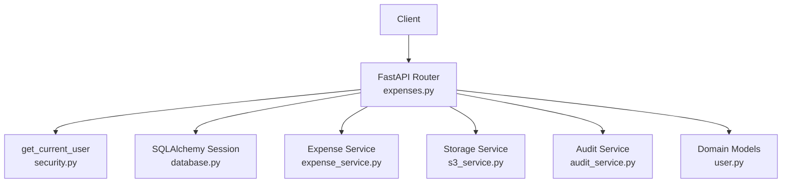
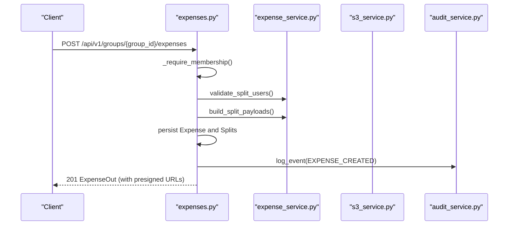
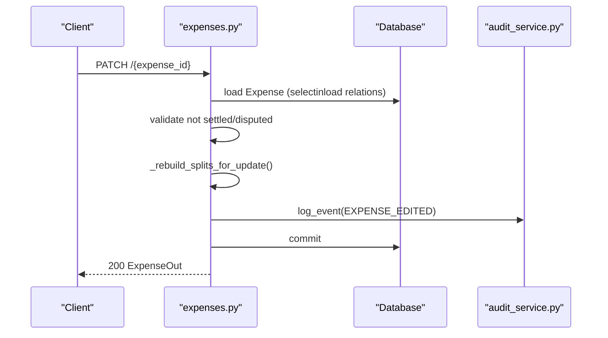
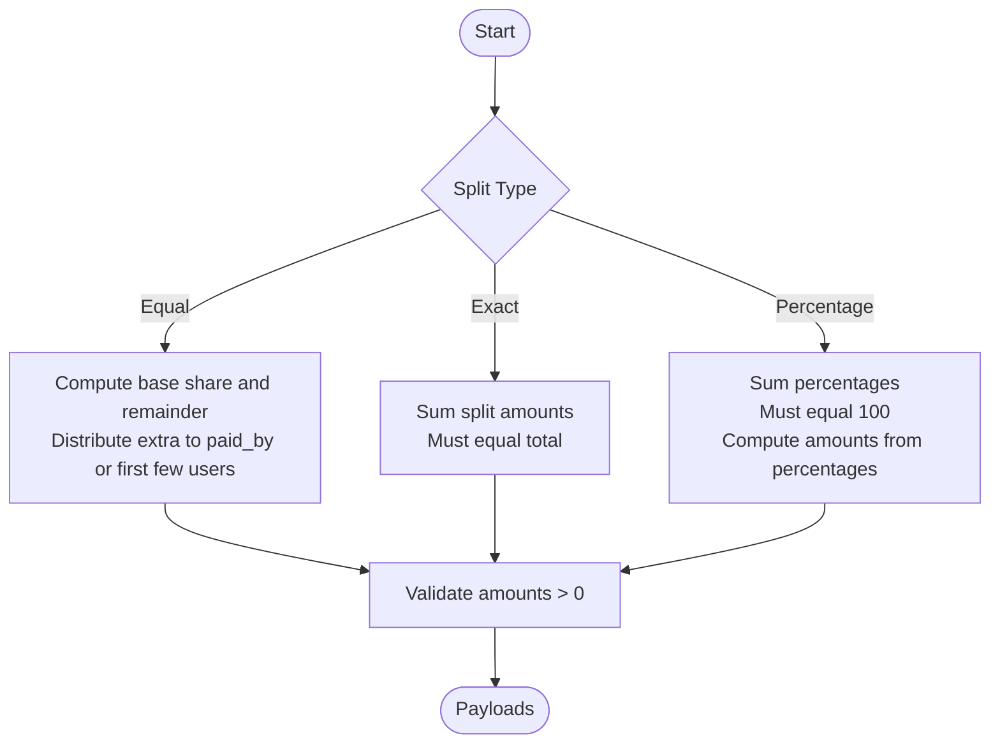
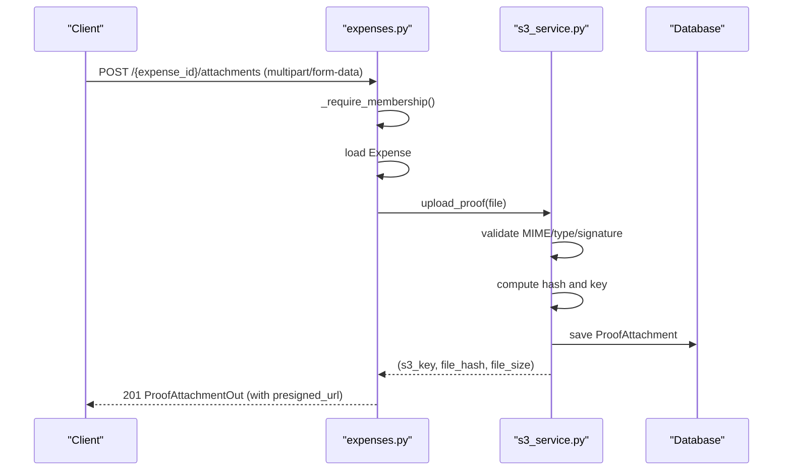
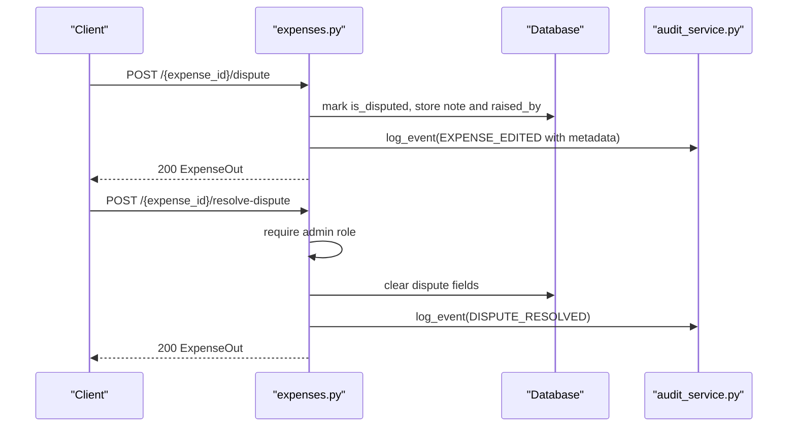
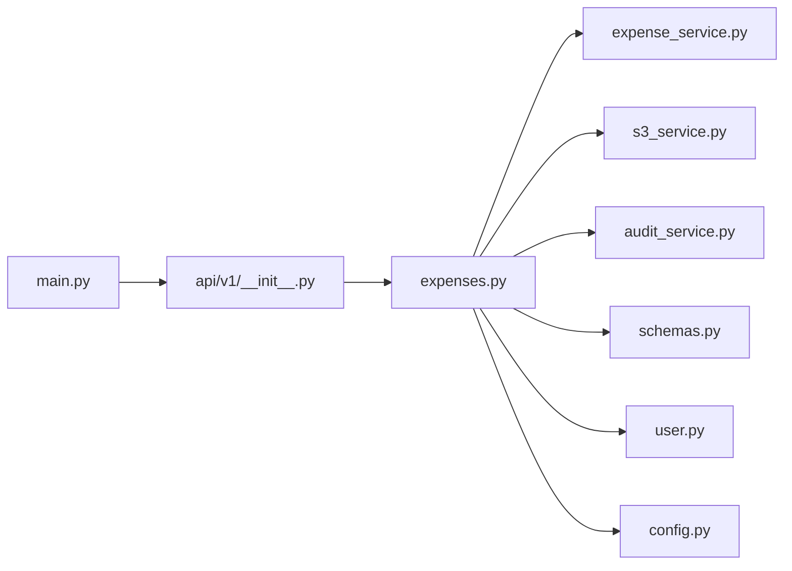

# Expense Tracking

<cite>
**Referenced Files in This Document**
- [expenses.py](file://backend/app/api/v1/endpoints/expenses.py)
- [expense_service.py](file://backend/app/services/expense_service.py)
- [schemas.py](file://backend/app/schemas/schemas.py)
- [user.py](file://backend/app/models/user.py)
- [s3_service.py](file://backend/app/services/s3_service.py)
- [audit_service.py](file://backend/app/services/audit_service.py)
- [config.py](file://backend/app/core/config.py)
- [main.py](file://backend/app/main.py)
- [__init__.py](file://backend/app/api/v1/__init__.py)
</cite>

## Table of Contents
1. [Introduction](#introduction)
2. [Project Structure](#project-structure)
3. [Core Components](#core-components)
4. [Architecture Overview](#architecture-overview)
5. [Detailed Component Analysis](#detailed-component-analysis)
6. [Dependency Analysis](#dependency-analysis)
7. [Performance Considerations](#performance-considerations)
8. [Troubleshooting Guide](#troubleshooting-guide)
9. [Conclusion](#conclusion)
10. [Appendices](#appendices)

## Introduction
This document provides comprehensive API documentation for expense tracking endpoints. It covers:
- Expense creation with split type selection (equal, exact, percentage), participant allocation, and proof attachment handling
- Expense retrieval, editing, and deletion
- Split calculation rules, validation logic, and amount distribution algorithms
- Proof attachment endpoints for photo uploads, file validation, and storage integration
- Request/response schemas, business rule enforcement, and error handling
- Examples of split scenarios, expense workflows, and proof management processes
- Expense dispute resolution, approval workflows, and audit trail integration

## Project Structure
The expense tracking feature is implemented in the backend API module with supporting services and schemas:
- API endpoints: `/api/v1/groups/{group_id}/expenses`
- Services: expense calculation, S3/local storage, audit logging
- Schemas: request/response models and validators
- Models: domain enums and ORM entities

**Diagram sources**
- [expenses.py:14-18](file://backend/app/api/v1/endpoints/expenses.py#L14-L18)
- [__init__.py:1-12](file://backend/app/api/v1/__init__.py#L1-L12)
- [main.py:56](file://backend/app/main.py#L56)

**Section sources**
- [expenses.py:14-18](file://backend/app/api/v1/endpoints/expenses.py#L14-L18)
- [__init__.py:1-12](file://backend/app/api/v1/__init__.py#L1-L12)
- [main.py:56](file://backend/app/main.py#L56)

## Core Components
- Expense endpoints: create, list, retrieve, update, delete, dispute, resolve dispute, and attach proof
- Expense calculation service: validates participants, checks split totals, and computes distributions
- Storage service: uploads and validates proof attachments, generates presigned URLs
- Audit service: logs immutable audit events for all mutations
- Schemas: typed request/response models with Pydantic validators

Key responsibilities:
- Enforce group membership and admin-only actions
- Validate split types and participant sets
- Compute split amounts deterministically
- Manage proof attachments with file type and size checks
- Log immutable audit trails for all operations

**Section sources**
- [expenses.py:143-395](file://backend/app/api/v1/endpoints/expenses.py#L143-L395)
- [expense_service.py:7-79](file://backend/app/services/expense_service.py#L7-L79)
- [s3_service.py:105-158](file://backend/app/services/s3_service.py#L105-L158)
- [audit_service.py:6-32](file://backend/app/services/audit_service.py#L6-L32)
- [schemas.py:217-342](file://backend/app/schemas/schemas.py#L217-L342)

## Architecture Overview
The expense feature follows a layered architecture:
- API layer: FastAPI endpoints handle routing, authentication, and response serialization
- Service layer: Business logic for split computation and storage operations
- Persistence layer: SQLAlchemy ORM models and database queries
- Audit layer: Immutable audit logs appended to the database

**Diagram sources**
- [expenses.py:143-179](file://backend/app/api/v1/endpoints/expenses.py#L143-L179)
- [expense_service.py:7-79](file://backend/app/services/expense_service.py#L7-L79)
- [audit_service.py:6-32](file://backend/app/services/audit_service.py#L6-L32)

## Detailed Component Analysis

### Expense Endpoints
Endpoints under `/api/v1/groups/{group_id}/expenses`:
- POST: Create an expense with splits and optional initial proof attachments
- GET: List expenses with filters and pagination
- GET: Retrieve a single expense with populated splits and proof attachments
- PATCH: Update expense fields and rebuild splits when needed
- DELETE: Soft-delete an expense (enforces not settled/disputed)
- POST: Raise a dispute (enforced not settled)
- POST: Resolve a dispute (admin-only)
- POST: Attach a proof to an expense

**Diagram sources**
- [expenses.py:230-264](file://backend/app/api/v1/endpoints/expenses.py#L230-L264)
- [audit_service.py:6-32](file://backend/app/services/audit_service.py#L6-L32)

**Section sources**
- [expenses.py:143-395](file://backend/app/api/v1/endpoints/expenses.py#L143-L395)

### Split Calculation and Validation
Split algorithms:
- Equal split: Distribute amount among participants with integer rounding favoring the paid-by user when applicable
- Exact split: Sum of split amounts must equal the total amount
- Percentage split: Percentages must sum to 100; amounts computed as percentages of the total

Validation rules:
- Participants must be unique and members of the group
- Exact split requires explicit split amounts
- Percentage split requires percentages that sum to 100
- Amounts must be positive integers

**Diagram sources**
- [expense_service.py:19-79](file://backend/app/services/expense_service.py#L19-L79)

**Section sources**
- [expense_service.py:7-79](file://backend/app/services/expense_service.py#L7-L79)
- [schemas.py:217-256](file://backend/app/schemas/schemas.py#L217-L256)

### Proof Attachment Endpoints
Upload endpoint:
- Validates MIME type, file size, and content signature
- Generates a unique S3 key and computes a server-side hash
- Persists metadata and returns a presigned URL for retrieval

Storage integration:
- Local storage mode writes to a configured directory and serves via static files
- Production mode uses AWS S3 with pre-signed URLs

**Diagram sources**
- [expenses.py:352-395](file://backend/app/api/v1/endpoints/expenses.py#L352-L395)
- [s3_service.py:105-158](file://backend/app/services/s3_service.py#L105-L158)

**Section sources**
- [expenses.py:352-395](file://backend/app/api/v1/endpoints/expenses.py#L352-L395)
- [s3_service.py:105-158](file://backend/app/services/s3_service.py#L105-L158)
- [config.py:16-51](file://backend/app/core/config.py#L16-L51)

### Audit Trail and Disputes
Audit trail:
- Logs immutable entries for create/edit/delete and dispute resolution
- PostgreSQL trigger prevents modification or deletion of audit logs

Disputes:
- Any member can raise a dispute (not settled)
- Admin-only can resolve a dispute
- Disputed expenses cannot be edited or deleted

**Diagram sources**
- [expenses.py:293-350](file://backend/app/api/v1/endpoints/expenses.py#L293-L350)
- [audit_service.py:6-32](file://backend/app/services/audit_service.py#L6-L32)

**Section sources**
- [expenses.py:293-350](file://backend/app/api/v1/endpoints/expenses.py#L293-L350)
- [audit_service.py:6-32](file://backend/app/services/audit_service.py#L6-L32)

## Dependency Analysis
- API endpoints depend on:
  - Authentication and membership checks
  - Expense service for split validation and computation
  - Storage service for proof uploads and URL generation
  - Audit service for immutable logs
  - Database session for persistence
- Schemas define request/response contracts and enforce validation
- Models define enums and relationships used across services

**Diagram sources**
- [expenses.py:14-18](file://backend/app/api/v1/endpoints/expenses.py#L14-L18)
- [__init__.py:1-12](file://backend/app/api/v1/__init__.py#L1-L12)
- [main.py:56](file://backend/app/main.py#L56)

**Section sources**
- [expenses.py:14-18](file://backend/app/api/v1/endpoints/expenses.py#L14-L18)
- [__init__.py:1-12](file://backend/app/api/v1/__init__.py#L1-L12)
- [main.py:56](file://backend/app/main.py#L56)

## Performance Considerations
- Select-in-load optimizations: Eagerly load related entities to reduce N+1 queries
- Pagination: List endpoints support limit and offset to control payload sizes
- Deterministic rounding: Equal split distributes remainders fairly and predictably
- Asynchronous operations: Database and storage operations are awaited to avoid blocking
- Audit immutability: Append-only audit logs prevent write amplification on mutations

[No sources needed since this section provides general guidance]

## Troubleshooting Guide
Common errors and resolutions:
- Not a group member: Access forbidden when operating outside group membership
- Search query too long: Truncated to 255 characters; otherwise rejected
- Exact split mismatch: Total split amounts must equal the expense amount
- Duplicate users in split: Split users must be unique
- Non-member participants: All split users must be members of the group
- Maximum attachments exceeded: Enforced by configuration limit
- Unsupported file type or size: Only JPEG/PNG/PDF under configured size
- File signature mismatch: Declared MIME type must match actual content
- Cannot edit settled/disputed expense: Updates blocked until resolved
- Admin-only dispute resolution: Only admins can resolve disputes

**Section sources**
- [expenses.py:23-32](file://backend/app/api/v1/endpoints/expenses.py#L23-L32)
- [expenses.py:209-212](file://backend/app/api/v1/endpoints/expenses.py#L209-L212)
- [expense_service.py:7-16](file://backend/app/services/expense_service.py#L7-L16)
- [s3_service.py:114-123](file://backend/app/services/s3_service.py#L114-L123)
- [expenses.py:241-244](file://backend/app/api/v1/endpoints/expenses.py#L241-L244)
- [expenses.py:335-336](file://backend/app/api/v1/endpoints/expenses.py#L335-L336)

## Conclusion
The expense tracking system provides robust APIs for creating, managing, and auditing expenses with flexible split types and secure proof management. The design enforces strong validation, deterministic calculations, and immutable audit logs, ensuring accountability and reliability across workflows.

[No sources needed since this section summarizes without analyzing specific files]

## Appendices

### API Definitions

- Base path: `/api/v1/groups/{group_id}/expenses`
- Authentication: Required (current user)
- Authorization: Group membership required; admin-only for dispute resolution

Endpoints summary:
- POST: Create expense
  - Path: `/api/v1/groups/{group_id}/expenses`
  - Request: ExpenseCreate
  - Response: ExpenseOut
  - Status: 201 Created
- GET: List expenses
  - Path: `/api/v1/groups/{group_id}/expenses`
  - Query: category, search, limit, offset
  - Response: List of ExpenseOut
- GET: Get expense
  - Path: `/api/v1/groups/{group_id}/expenses/{expense_id}`
  - Response: ExpenseOut
- PATCH: Update expense
  - Path: `/api/v1/groups/{group_id}/expenses/{expense_id}`
  - Request: ExpenseUpdate
  - Response: ExpenseOut
- DELETE: Delete expense
  - Path: `/api/v1/groups/{group_id}/expenses/{expense_id}`
  - Status: 204 No Content
- POST: Dispute expense
  - Path: `/api/v1/groups/{group_id}/expenses/{expense_id}/dispute`
  - Request: DisputeRequest
  - Response: ExpenseOut
- POST: Resolve dispute
  - Path: `/api/v1/groups/{group_id}/expenses/{expense_id}/resolve-dispute`
  - Response: ExpenseOut
- POST: Attach proof
  - Path: `/api/v1/groups/{group_id}/expenses/{expense_id}/attachments`
  - Request: multipart/form-data (file)
  - Response: ProofAttachmentOut

**Section sources**
- [expenses.py:143-395](file://backend/app/api/v1/endpoints/expenses.py#L143-L395)

### Request/Response Schemas

- ExpenseCreate
  - Fields: amount (paise), description, category, split_type, splits
  - Validators: amount > 0, description required, exact split total equals amount, percentage split sums to 100
- ExpenseUpdate
  - Fields: amount, description, category, split_type, splits
  - Validators: amount > 0, description required, splits required when changing split_type
- SplitInput
  - Fields: user_id, amount (paise for exact), percentage (for percentage)
- ExpenseOut
  - Fields: id, group_id, paid_by_user, amount, description, category, split_type, is_deleted, is_disputed, is_settled, dispute_note, splits, proof_attachments, created_at, updated_at
- DisputeRequest
  - Fields: note (min length 10)
- ProofAttachmentOut
  - Fields: id, file_name, file_size, mime_type, uploader, uploaded_at, presigned_url

**Section sources**
- [schemas.py:217-342](file://backend/app/schemas/schemas.py#L217-L342)

### Split Scenarios and Workflows

- Equal split
  - Example: 3 participants split 1000 paise; base share 333, remainder 1 distributed to paid_by or first eligible user
- Exact split
  - Example: 3 participants specify exact amounts that sum to 1000 paise
- Percentage split
  - Example: 3 participants with percentages summing to 100%; amounts computed as percentages of 1000 paise
- Expense creation workflow
  - Validate participants, compute splits, persist expense and splits, log audit event
- Proof management workflow
  - Validate file type and size, compute hash, upload to storage, persist metadata, return presigned URL

**Section sources**
- [expense_service.py:19-79](file://backend/app/services/expense_service.py#L19-L79)
- [expenses.py:143-179](file://backend/app/api/v1/endpoints/expenses.py#L143-L179)
- [s3_service.py:105-158](file://backend/app/services/s3_service.py#L105-L158)

### Storage and Environment Configuration
- Local storage mode
  - Files saved under LOCAL_UPLOAD_DIR, served via /uploads
- S3 mode
  - Pre-signed URLs generated for secure access
- Limits
  - MAX_ATTACHMENTS_PER_EXPENSE, MAX_FILE_SIZE_MB, allowed MIME types

**Section sources**
- [config.py:16-51](file://backend/app/core/config.py#L16-L51)
- [main.py:48-54](file://backend/app/main.py#L48-L54)