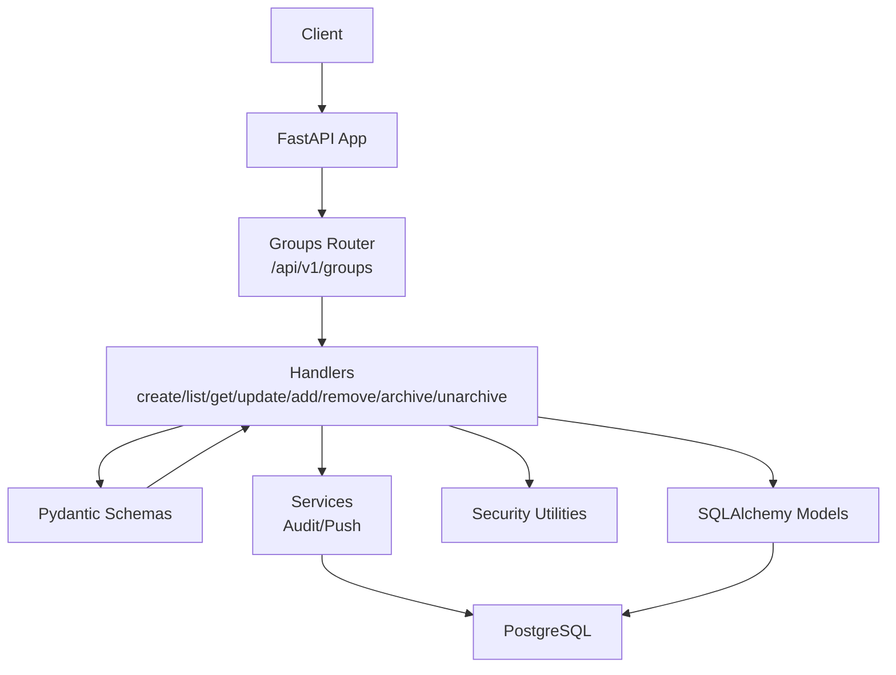
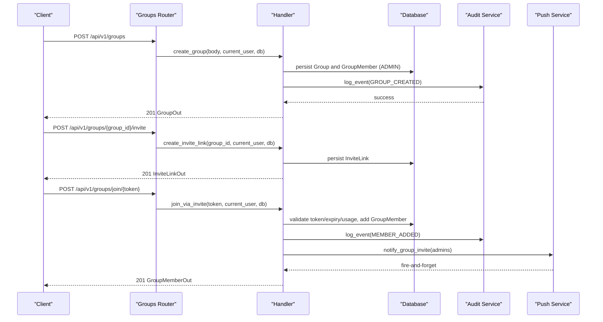
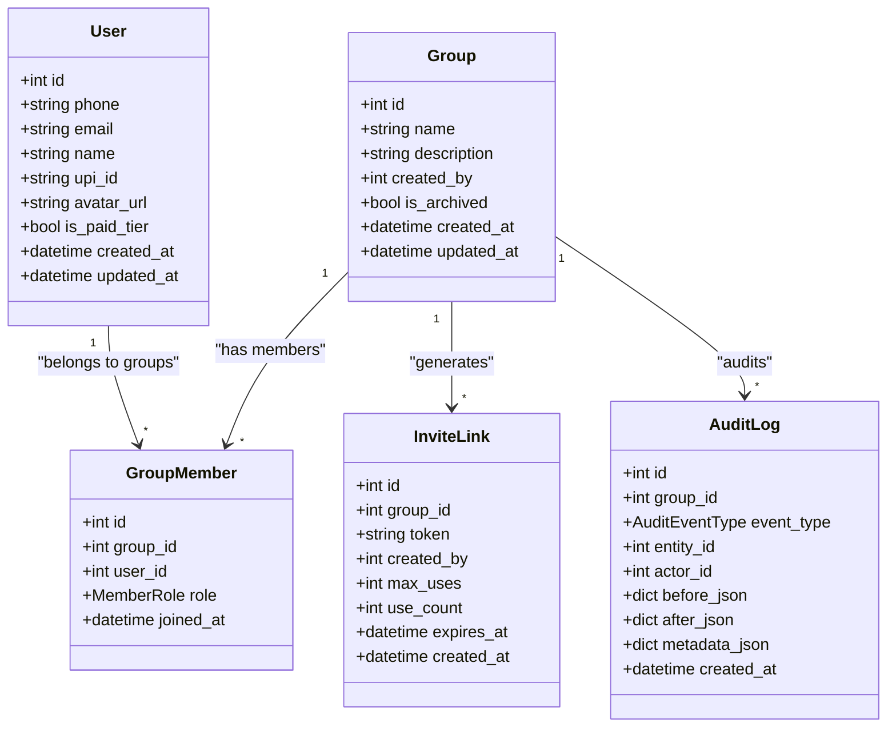

# Group Management

<cite>
**Referenced Files in This Document**
- [groups.py](file://backend/app/api/v1/endpoints/groups.py)
- [schemas.py](file://backend/app/schemas/schemas.py)
- [user.py](file://backend/app/models/user.py)
- [config.py](file://backend/app/core/config.py)
- [security.py](file://backend/app/core/security.py)
- [push_service.py](file://backend/app/services/push_service.py)
- [audit_service.py](file://backend/app/services/audit_service.py)
- [main.py](file://backend/app/main.py)
- [001_initial.py](file://backend/alembic/versions/001_initial.py)
- [002_add_push_token.py](file://backend/alembic/versions/002_add_push_token.py)
</cite>

## Table of Contents
1. [Introduction](#introduction)
2. [Project Structure](#project-structure)
3. [Core Components](#core-components)
4. [Architecture Overview](#architecture-overview)
5. [Detailed Component Analysis](#detailed-component-analysis)
6. [Dependency Analysis](#dependency-analysis)
7. [Performance Considerations](#performance-considerations)
8. [Troubleshooting Guide](#troubleshooting-guide)
9. [Conclusion](#conclusion)

## Introduction
This document provides comprehensive API documentation for group management operations in the SplitSure application. It covers group creation, invitations, member management, settings updates, archival/restoration, and the underlying authorization and data isolation mechanisms. The focus is on practical usage, request/response schemas, validation rules, and operational workflows.

## Project Structure
The group management API is implemented under the FastAPI application with the following key components:
- API endpoints: group creation, listing, retrieval, updates, member management, invitations, and archival
- Pydantic schemas for request/response validation
- SQLAlchemy models for persistence
- Security utilities for authentication and authorization
- Services for notifications and audit logging
- Alembic migrations defining the database schema

**Diagram sources**
- [main.py:56](file://backend/app/main.py#L56)
- [groups.py:18](file://backend/app/api/v1/endpoints/groups.py#L18)

**Section sources**
- [main.py:16-56](file://backend/app/main.py#L16-L56)
- [groups.py:18](file://backend/app/api/v1/endpoints/groups.py#L18)

## Core Components
- Authentication and Authorization
  - Access tokens are validated at the route boundary; membership checks enforce data isolation per group.
  - Administrative actions require ADMIN role membership.
- Group Lifecycle
  - Creation initializes a group and assigns the creator as ADMIN.
  - Listing filters groups by membership and supports archived inclusion.
  - Retrieval enforces membership.
  - Updates require ADMIN role and log changes via audit service.
  - Archival sets is_archived flag; restoration toggles it back.
- Member Management
  - Adding members requires ADMIN role and enforces group size limits.
  - Removing members requires ADMIN role and prevents self-removal.
  - Membership records track roles and join timestamps.
- Invitations
  - ADMIN generates invite links with expiration and usage limits.
  - Joining via invite validates token, expiry, and usage limits.
  - Notifications are sent via push service when applicable.

**Section sources**
- [security.py:72-96](file://backend/app/core/security.py#L72-L96)
- [groups.py:30-41](file://backend/app/api/v1/endpoints/groups.py#L30-L41)
- [groups.py:59-84](file://backend/app/api/v1/endpoints/groups.py#L59-L84)
- [groups.py:115-138](file://backend/app/api/v1/endpoints/groups.py#L115-L138)
- [groups.py:235-256](file://backend/app/api/v1/endpoints/groups.py#L235-L256)
- [groups.py:259-317](file://backend/app/api/v1/endpoints/groups.py#L259-L317)
- [groups.py:210-233](file://backend/app/api/v1/endpoints/groups.py#L210-L233)
- [groups.py:141-207](file://backend/app/api/v1/endpoints/groups.py#L141-L207)

## Architecture Overview
The group management API follows a layered architecture:
- Router layer defines endpoints and applies dependency injection for current user and database session.
- Handler layer enforces authorization, performs validations, and orchestrates persistence and notifications.
- Service layer encapsulates audit logging and push notifications.
- Model layer defines data structures and relationships.
- Schema layer validates request/response payloads.

**Diagram sources**
- [groups.py:59-84](file://backend/app/api/v1/endpoints/groups.py#L59-L84)
- [groups.py:235-256](file://backend/app/api/v1/endpoints/groups.py#L235-L256)
- [groups.py:259-317](file://backend/app/api/v1/endpoints/groups.py#L259-L317)
- [audit_service.py:6-31](file://backend/app/services/audit_service.py#L6-L31)
- [push_service.py:47-73](file://backend/app/services/push_service.py#L47-L73)

## Detailed Component Analysis

### Group Creation (/groups)
- Purpose: Create a new group and assign the creator as ADMIN.
- Authorization: Requires authenticated user.
- Request
  - Method: POST
  - Path: /api/v1/groups
  - Headers: Authorization: Bearer <access_token>
  - Body: GroupCreate { name, description? }
- Response
  - Status: 201 Created
  - Body: GroupOut { id, name, description?, created_by, is_archived, created_at, members: [] }
- Behavior
  - Validates name length (2–50 characters).
  - Creates Group record with created_by set to current user.
  - Adds current user as ADMIN in GroupMember.
  - Logs audit event GROUP_CREATED.
- Notes
  - Initial members list is empty until members are added.

**Section sources**
- [groups.py:59-84](file://backend/app/api/v1/endpoints/groups.py#L59-L84)
- [schemas.py:136-147](file://backend/app/schemas/schemas.py#L136-L147)
- [schemas.py:182-191](file://backend/app/schemas/schemas.py#L182-L191)
- [audit_service.py:6-31](file://backend/app/services/audit_service.py#L6-L31)

### Group Listing (/groups)
- Purpose: Retrieve groups the current user belongs to.
- Authorization: Requires authenticated user.
- Request
  - Method: GET
  - Path: /api/v1/groups?include_archived=bool
  - Headers: Authorization: Bearer <access_token>
- Response
  - Status: 200 OK
  - Body: Array of GroupOut
- Behavior
  - Filters groups by membership (GroupMember.user_id).
  - Optionally includes archived groups based on include_archived flag.
  - Eager loads members with user details.

**Section sources**
- [groups.py:87-102](file://backend/app/api/v1/endpoints/groups.py#L87-L102)

### Group Retrieval (/groups/{group_id})
- Purpose: Fetch a specific group if the current user is a member.
- Authorization: Requires authenticated user; membership enforced.
- Request
  - Method: GET
  - Path: /api/v1/groups/{group_id}
  - Headers: Authorization: Bearer <access_token>
- Response
  - Status: 200 OK
  - Body: GroupOut
- Behavior
  - Enforces membership via _require_membership.
  - Loads group with members and user details.

**Section sources**
- [groups.py:105-112](file://backend/app/api/v1/endpoints/groups.py#L105-L112)
- [groups.py:30-41](file://backend/app/api/v1/endpoints/groups.py#L30-L41)

### Group Update (/groups/{group_id})
- Purpose: Update group name/description.
- Authorization: Requires ADMIN role membership.
- Request
  - Method: PATCH
  - Path: /api/v1/groups/{group_id}
  - Headers: Authorization: Bearer <access_token>
  - Body: GroupUpdate { name?, description? }
- Response
  - Status: 200 OK
  - Body: GroupOut
- Behavior
  - Validates name length (2–50) when present.
  - Enforces ADMIN role via _require_admin.
  - Logs audit event GROUP_UPDATED with before/after snapshots.

**Section sources**
- [groups.py:115-138](file://backend/app/api/v1/endpoints/groups.py#L115-L138)
- [schemas.py:149-170](file://backend/app/schemas/schemas.py#L149-L170)
- [audit_service.py:6-31](file://backend/app/services/audit_service.py#L6-L31)

### Group Archival and Restoration (/groups/{group_id} and POST /groups/{group_id}/unarchive)
- Purpose: Archive a group (soft delete) and restore it.
- Authorization: Requires ADMIN role membership.
- Requests
  - Archive: DELETE /api/v1/groups/{group_id}
  - Restore: POST /api/v1/groups/{group_id}/unarchive
  - Headers: Authorization: Bearer <access_token>
- Responses
  - Archive: 204 No Content
  - Restore: 200 OK, GroupOut

**Section sources**
- [groups.py:320-349](file://backend/app/api/v1/endpoints/groups.py#L320-L349)

### Member Management (/groups/{group_id}/members)
- Add Member
  - Purpose: Add a user to a group as MEMBER.
  - Authorization: ADMIN required.
  - Request
    - Method: POST
    - Path: /api/v1/groups/{group_id}/members
    - Headers: Authorization: Bearer <access_token>
    - Body: AddMemberRequest { phone }
  - Response
    - Status: 201 Created
    - Body: GroupMemberOut { id, user, role, joined_at, is_registered }
  - Behavior
    - Validates phone format; ensures country code.
    - Limits group size via settings.MAX_GROUP_MEMBERS.
    - Creates user if not found and dev OTP mode is enabled; otherwise raises 404.
    - Prevents adding existing members.
    - Sends push notification to the added user.
    - Logs audit event MEMBER_ADDED.
  - Notes
    - is_registered indicates whether the user has a name set.

- Remove Member
  - Purpose: Remove a member from a group.
  - Authorization: ADMIN required; self-removal blocked.
  - Request
    - Method: DELETE
    - Path: /api/v1/groups/{group_id}/members/{user_id}
    - Headers: Authorization: Bearer <access_token>
  - Response
    - Status: 204 No Content
  - Behavior
    - Prevents removing the current user.
    - Logs audit event MEMBER_REMOVED.

**Section sources**
- [groups.py:141-207](file://backend/app/api/v1/endpoints/groups.py#L141-L207)
- [groups.py:210-233](file://backend/app/api/v1/endpoints/groups.py#L210-L233)
- [schemas.py:194-206](file://backend/app/schemas/schemas.py#L194-L206)
- [schemas.py:172-179](file://backend/app/schemas/schemas.py#L172-L179)
- [config.py:46-51](file://backend/app/core/config.py#L46-L51)
- [push_service.py:47-73](file://backend/app/services/push_service.py#L47-L73)
- [audit_service.py:6-31](file://backend/app/services/audit_service.py#L6-L31)

### Invitation Workflow (/groups/{group_id}/invite and /groups/join/{token})
- Generate Invite Link
  - Purpose: Create a shareable invite link for joining a group.
  - Authorization: ADMIN required.
  - Request
    - Method: POST
    - Path: /api/v1/groups/{group_id}/invite
    - Headers: Authorization: Bearer <access_token>
  - Response
    - Status: 201 Created
    - Body: InviteLinkOut { token, expires_at, use_count, max_uses }
  - Behavior
    - Generates secure token and sets expiry based on settings.INVITE_LINK_EXPIRE_HOURS.
    - Sets max_uses from settings.INVITE_LINK_MAX_USES.

- Join via Invite
  - Purpose: Join a group using a valid invite token.
  - Authorization: Requires authenticated user.
  - Request
    - Method: POST
    - Path: /api/v1/groups/join/{token}
    - Headers: Authorization: Bearer <access_token>
  - Response
    - Status: 201 Created
    - Body: GroupMemberOut
  - Behavior
    - Validates token existence, expiry, and usage limits.
    - Prevents re-joining if already a member.
    - Adds current user as MEMBER.
    - Notifies admins about the new member (fire-and-forget).
    - Logs audit event MEMBER_ADDED with metadata.

**Section sources**
- [groups.py:235-256](file://backend/app/api/v1/endpoints/groups.py#L235-L256)
- [groups.py:259-317](file://backend/app/api/v1/endpoints/groups.py#L259-L317)
- [schemas.py:208-213](file://backend/app/schemas/schemas.py#L208-L213)
- [config.py:50-51](file://backend/app/core/config.py#L50-L51)
- [push_service.py:47-73](file://backend/app/services/push_service.py#L47-L73)
- [audit_service.py:6-31](file://backend/app/services/audit_service.py#L6-L31)

### Request/Response Schemas and Validation Rules
- GroupCreate
  - name: string, 2–50 characters
  - description: optional string
- GroupUpdate
  - name: optional string, 2–50 characters if provided
  - description: optional string
- AddMemberRequest
  - phone: string, normalized to E.164 format (+country code)
- GroupOut
  - id: integer
  - name: string
  - description: optional string
  - created_by: integer
  - is_archived: boolean
  - created_at: datetime
  - members: array of GroupMemberOut
- GroupMemberOut
  - id: integer
  - user: UserOut
  - role: enum "admin" or "member"
  - joined_at: datetime
  - is_registered: boolean
- InviteLinkOut
  - token: string
  - expires_at: datetime
  - use_count: integer
  - max_uses: integer

**Section sources**
- [schemas.py:136-170](file://backend/app/schemas/schemas.py#L136-L170)
- [schemas.py:172-191](file://backend/app/schemas/schemas.py#L172-L191)
- [schemas.py:194-213](file://backend/app/schemas/schemas.py#L194-L213)

### Authorization and Data Isolation
- Authentication
  - Access tokens validated by get_current_user; rejects blacklisted or expired tokens.
- Authorization
  - Membership checks: _require_membership ensures the user belongs to the group.
  - Admin checks: _require_admin ensures the user has ADMIN role.
- Data Isolation
  - Handlers filter queries by membership to prevent cross-group access.
  - Group retrieval excludes archived groups by default.

**Section sources**
- [security.py:72-96](file://backend/app/core/security.py#L72-L96)
- [groups.py:30-41](file://backend/app/api/v1/endpoints/groups.py#L30-L41)
- [groups.py:44-56](file://backend/app/api/v1/endpoints/groups.py#L44-L56)

### Example Workflows

#### Group Creation Flow
- Steps
  - Authenticate and obtain access token.
  - Call POST /api/v1/groups with GroupCreate payload.
  - Receive 201 with GroupOut; creator is ADMIN.
- Validation
  - name must be 2–50 characters.
- Audit
  - GROUP_CREATED logged with before/after snapshots.

**Section sources**
- [groups.py:59-84](file://backend/app/api/v1/endpoints/groups.py#L59-L84)
- [schemas.py:136-147](file://backend/app/schemas/schemas.py#L136-L147)
- [audit_service.py:6-31](file://backend/app/services/audit_service.py#L6-L31)

#### Invitation Process
- Steps
  - ADMIN generates invite link via POST /api/v1/groups/{group_id}/invite.
  - Share token with invitee.
  - Invitee authenticates and calls POST /api/v1/groups/join/{token}.
  - Invitee becomes MEMBER; admins receive push notifications.
- Validation
  - Token must exist, not be expired, and under usage limits.
- Audit
  - MEMBER_ADDED logged for both creator and joiner.

**Section sources**
- [groups.py:235-256](file://backend/app/api/v1/endpoints/groups.py#L235-L256)
- [groups.py:259-317](file://backend/app/api/v1/endpoints/groups.py#L259-L317)
- [push_service.py:47-73](file://backend/app/services/push_service.py#L47-L73)
- [audit_service.py:6-31](file://backend/app/services/audit_service.py#L6-L31)

#### Member Management Scenario
- Steps
  - ADMIN adds a new member via POST /api/v1/groups/{group_id}/members.
  - If user does not exist and dev OTP mode is enabled, user is auto-created.
  - New member receives push notification.
  - ADMIN removes a member via DELETE /api/v1/groups/{group_id}/members/{user_id}.
- Validation
  - Phone must be valid E.164 format.
  - Group size cannot exceed settings.MAX_GROUP_MEMBERS.
  - Self-removal is prevented.
- Audit
  - MEMBER_ADDED and MEMBER_REMOVED logged.

**Section sources**
- [groups.py:141-207](file://backend/app/api/v1/endpoints/groups.py#L141-L207)
- [groups.py:210-233](file://backend/app/api/v1/endpoints/groups.py#L210-L233)
- [config.py:46-51](file://backend/app/core/config.py#L46-L51)
- [push_service.py:47-73](file://backend/app/services/push_service.py#L47-L73)
- [audit_service.py:6-31](file://backend/app/services/audit_service.py#L6-L31)

## Dependency Analysis
- Internal Dependencies
  - groups.py depends on security utilities for authentication, SQLAlchemy models for persistence, schemas for validation, and services for audit and push notifications.
- External Dependencies
  - PostgreSQL via SQLAlchemy ORM.
  - JWT library for token decoding.
  - httpx for push notifications.
- Database Schema
  - Groups, GroupMembers, Users, InviteLinks, AuditLogs are defined in Alembic migrations.

**Diagram sources**
- [user.py:90-122](file://backend/app/models/user.py#L90-L122)
- [user.py:124-162](file://backend/app/models/user.py#L124-L162)
- [user.py:220-234](file://backend/app/models/user.py#L220-L234)
- [user.py:184-199](file://backend/app/models/user.py#L184-L199)

**Section sources**
- [001_initial.py:45-154](file://backend/alembic/versions/001_initial.py#L45-L154)
- [002_add_push_token.py:17-18](file://backend/alembic/versions/002_add_push_token.py#L17-L18)

## Performance Considerations
- Asynchronous Operations
  - Database sessions and push notifications are asynchronous to avoid blocking requests.
- Query Optimization
  - selectinload is used to eager load group members and users to reduce N+1 queries.
- Rate Limiting and Limits
  - Group member cap enforced via settings.MAX_GROUP_MEMBERS.
  - Invite link usage and expiry limits prevent abuse.
- Audit Immutability
  - PostgreSQL trigger prevents modifications/deletions of audit logs, ensuring append-only performance characteristics.

[No sources needed since this section provides general guidance]

## Troubleshooting Guide
- Authentication Failures
  - 401 Unauthorized: Invalid or expired token, or token blacklisted.
  - Verify token type is access and not revoked.
- Authorization Failures
  - 403 Forbidden: Not a member or not ADMIN for admin-only endpoints.
  - Ensure membership and role checks pass.
- Business Rule Violations
  - 400 Bad Request: Exceeded member limit, invalid phone format, expired or used invite link, or attempting self-removal.
  - Validate request payloads and group state.
- Member Already Exists
  - 400 Bad Request: User is already a member when adding.
- Group Not Found
  - 404 Not Found: Group does not exist or is archived (unless explicitly included).
- Notification Delivery
  - Push notifications are fire-and-forget; failures are logged but do not block the request.

**Section sources**
- [security.py:72-96](file://backend/app/core/security.py#L72-L96)
- [groups.py:30-41](file://backend/app/api/v1/endpoints/groups.py#L30-L41)
- [groups.py:150-156](file://backend/app/api/v1/endpoints/groups.py#L150-L156)
- [groups.py:269-274](file://backend/app/api/v1/endpoints/groups.py#L269-L274)
- [groups.py:218-219](file://backend/app/api/v1/endpoints/groups.py#L218-L219)
- [groups.py:44-56](file://backend/app/api/v1/endpoints/groups.py#L44-L56)
- [push_service.py:47-73](file://backend/app/services/push_service.py#L47-L73)

## Conclusion
The group management API provides a robust, secure, and auditable foundation for managing shared expense groups. It enforces strict authorization boundaries, validates inputs, and offers clear workflows for creation, invitations, and member management. The design emphasizes data isolation, immutable audit trails, and extensibility for future enhancements.