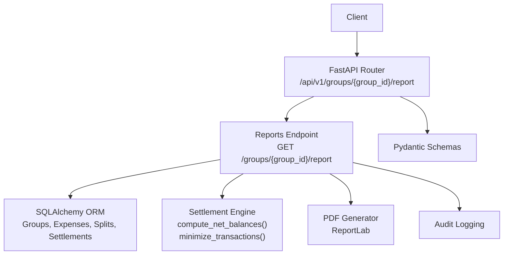
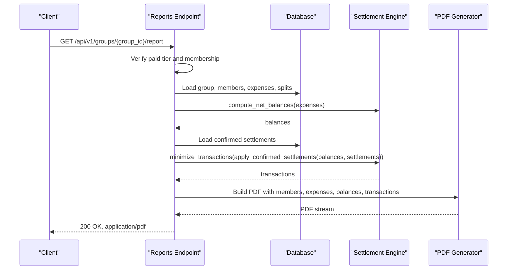
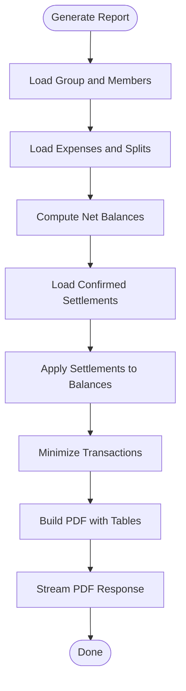
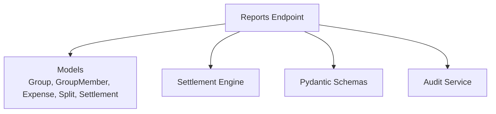

# Reports and Analytics

<cite>
**Referenced Files in This Document**
- [reports.py](file://backend/app/api/v1/endpoints/reports.py)
- [schemas.py](file://backend/app/schemas/schemas.py)
- [settlement_engine.py](file://backend/app/services/settlement_engine.py)
- [user.py](file://backend/app/models/user.py)
- [main.py](file://backend/app/main.py)
- [audit_service.py](file://backend/app/services/audit_service.py)
</cite>

## Table of Contents
1. [Introduction](#introduction)
2. [Project Structure](#project-structure)
3. [Core Components](#core-components)
4. [Architecture Overview](#architecture-overview)
5. [Detailed Component Analysis](#detailed-component-analysis)
6. [Dependency Analysis](#dependency-analysis)
7. [Performance Considerations](#performance-considerations)
8. [Troubleshooting Guide](#troubleshooting-guide)
9. [Conclusion](#conclusion)

## Introduction
This document provides comprehensive API documentation for reporting and analytics endpoints in the SplitSure backend. It focuses on:
- Financial reports for groups, including expense summaries, member contributions, and group spending patterns.
- Member analytics endpoints for individual spending history, contribution statistics, and debt analysis.
- Group performance metrics and trend analysis capabilities.
- Report generation options, filtering criteria, and data export formats.
- Request/response schemas, aggregation functions, and data visualization support.
- Examples of report queries, custom filtering, and data export workflows.
- Report scheduling, automated delivery, and access control for sensitive financial data.
- Performance optimization for large datasets and caching strategies for frequently accessed reports.

## Project Structure
The reporting functionality is implemented as a FastAPI router under the `/api/v1/groups/{group_id}/report` path. It integrates with:
- Database models for groups, expenses, splits, and settlements.
- A settlement engine for computing balances and optimizing transactions.
- Pydantic schemas for typed request/response models.
- Audit logging for immutable event tracking.

**Diagram sources**
- [reports.py:26](file://backend/app/api/v1/endpoints/reports.py#L26)
- [reports.py:51](file://backend/app/api/v1/endpoints/reports.py#L51)
- [settlement_engine.py:23](file://backend/app/services/settlement_engine.py#L23)
- [settlement_engine.py:40](file://backend/app/services/settlement_engine.py#L40)
- [schemas.py:356](file://backend/app/schemas/schemas.py#L356)
- [audit_service.py:6](file://backend/app/services/audit_service.py#L6)

**Section sources**
- [reports.py:26](file://backend/app/api/v1/endpoints/reports.py#L26)
- [main.py:56](file://backend/app/main.py#L56)

## Core Components
- Reports endpoint: Generates a settlement report PDF for a group, including members, expenses, balance summary, and optimized settlement instructions.
- Settlement engine: Computes net balances and minimizes transactions to reduce the number of transfers.
- Schemas: Defines typed models for balances, settlement instructions, and group balances output.
- Audit service: Provides immutable audit logging for events.

Key capabilities:
- Access control via membership checks and paid-tier requirement for PDF generation.
- Aggregation of expenses and splits into balance computations.
- Transaction optimization to produce minimal settlement instructions.
- PDF export with standardized formatting and branding.

**Section sources**
- [reports.py:51](file://backend/app/api/v1/endpoints/reports.py#L51)
- [reports.py:85](file://backend/app/api/v1/endpoints/reports.py#L85)
- [settlement_engine.py:23](file://backend/app/services/settlement_engine.py#L23)
- [settlement_engine.py:40](file://backend/app/services/settlement_engine.py#L40)
- [schemas.py:356](file://backend/app/schemas/schemas.py#L356)

## Architecture Overview
The reporting pipeline integrates FastAPI routing, database queries, computation services, and PDF rendering.

**Diagram sources**
- [reports.py:51](file://backend/app/api/v1/endpoints/reports.py#L51)
- [reports.py:85](file://backend/app/api/v1/endpoints/reports.py#L85)
- [settlement_engine.py:23](file://backend/app/services/settlement_engine.py#L23)
- [settlement_engine.py:40](file://backend/app/services/settlement_engine.py#L40)

## Detailed Component Analysis

### Financial Reports Endpoint
- Path: `/api/v1/groups/{group_id}/report`
- Method: GET
- Authentication: Requires a logged-in user.
- Authorization:
  - User must be a member of the target group.
  - PDF reports are restricted to paid-tier users.
- Behavior:
  - Loads group details and members.
  - Loads all non-deleted expenses with paid-by and split details.
  - Computes net balances per user.
  - Loads confirmed settlements and applies them to balances.
  - Minimizes transactions to produce optimized settlement instructions.
  - Builds a PDF report containing:
    - Group information.
    - Members table (name, phone, role, UPI ID).
    - Expenses table (date, description, category, paid-by, amount).
    - Balance summary table (member, net balance, status).
    - Optimized settlement instructions table (payer, receiver, amount).
  - Streams the PDF as an attachment.

Access control and membership verification:
- Membership check ensures only group members can generate reports.
- Paid-tier restriction prevents free users from accessing PDF exports.

Data aggregation:
- Net balances computed from expense totals and split allocations.
- Transactions minimized using a greedy algorithm to reduce transfer count.

PDF generation:
- Uses ReportLab to construct a branded A4 document with tables and styled sections.

Response:
- Content-Type: application/pdf
- Content-Disposition: attachment with a generated filename.

**Section sources**
- [reports.py:51](file://backend/app/api/v1/endpoints/reports.py#L51)
- [reports.py:41](file://backend/app/api/v1/endpoints/reports.py#L41)
- [reports.py:85](file://backend/app/api/v1/endpoints/reports.py#L85)
- [reports.py:281](file://backend/app/api/v1/endpoints/reports.py#L281)

#### PDF Report Sections

**Diagram sources**
- [reports.py:62](file://backend/app/api/v1/endpoints/reports.py#L62)
- [reports.py:85](file://backend/app/api/v1/endpoints/reports.py#L85)
- [settlement_engine.py:82](file://backend/app/services/settlement_engine.py#L82)
- [settlement_engine.py:40](file://backend/app/services/settlement_engine.py#L40)

### Member Analytics
Current implementation supports:
- Individual spending history via expense records linked to splits.
- Contribution statistics derived from net balances.
- Debt analysis via balance status (owed/owes/settled).

Planned enhancements (conceptual):
- Member-specific endpoints for:
  - Spending history filtered by date range and category.
  - Contribution statistics aggregated by category and time windows.
  - Debt analysis including outstanding amounts and due dates.
- Filtering criteria:
  - Date range, categories, settlement status, and member roles.
- Data export formats:
  - CSV for raw data extraction.
  - PDF for summarized statements.

[No sources needed since this section outlines conceptual enhancements not present in the current codebase]

### Group Performance Metrics and Trend Analysis
Current implementation supports:
- Total expenses and per-member balances.
- Optimized settlement instructions indicating transaction reduction potential.

Planned enhancements (conceptual):
- Monthly/quarterly trend charts for total spending and per-category breakdowns.
- Member participation metrics (number of expenses, average contribution).
- Settlement completion rate over time.

[No sources needed since this section outlines conceptual enhancements not present in the current codebase]

### Report Generation Options, Filtering, and Export Formats
Current implementation:
- Single report type: settlement report PDF.
- No query parameters or filters.
- No alternative export formats.

Proposed enhancements (conceptual):
- Query parameters for date range, categories, and member filters.
- Export formats: CSV, Excel, and PDF.
- Pagination for large datasets.

[No sources needed since this section outlines conceptual enhancements not present in the current codebase]

### Request and Response Schemas
Financial reports endpoint:
- Request:
  - Path parameters: group_id (integer).
  - Headers: Authorization (Bearer token).
- Response:
  - 200 OK with application/pdf body.
  - 403 Forbidden if not a group member or not on paid tier.
  - 404 Not Found if group does not exist.

Related schemas for balances and settlement instructions:
- BalanceSummary: user, net_balance, settlement_instructions.
- GroupBalancesOut: group_id, balances, total_expenses, optimized_settlements.
- SettlementInstruction: payer_id, payer_name, receiver_id, receiver_name, amount, receiver_upi_id, upi_deep_link.

**Section sources**
- [reports.py:51](file://backend/app/api/v1/endpoints/reports.py#L51)
- [schemas.py:356](file://backend/app/schemas/schemas.py#L356)
- [schemas.py:362](file://backend/app/schemas/schemas.py#L362)
- [schemas.py:346](file://backend/app/schemas/schemas.py#L346)

### Data Visualization Support
Current implementation:
- PDF tables for tabular reporting.

Proposed enhancements (conceptual):
- JSON endpoints returning aggregated metrics for dashboards.
- Chart-ready data series for trends and distributions.

[No sources needed since this section outlines conceptual enhancements not present in the current codebase]

### Examples of Report Queries, Custom Filtering, and Data Export Workflows
Example workflows (conceptual):
- Generate a settlement report for a specific group.
- Filter expenses by date range and category for trend analysis.
- Export member spending history as CSV for external analysis.

[No sources needed since this section outlines conceptual workflows not present in the current codebase]

### Report Scheduling, Automated Delivery, and Access Control
Conceptual recommendations:
- Scheduled report generation via cron/background jobs.
- Automated delivery via email/SMS with secure links.
- Role-based access control (admin vs. member visibility).
- Immutable audit logs for compliance.

[No sources needed since this section outlines conceptual recommendations not present in the current codebase]

## Dependency Analysis
The reports endpoint depends on:
- Database models for groups, members, expenses, splits, and settlements.
- Settlement engine for balance computation and transaction minimization.
- Pydantic schemas for typed outputs.
- Audit service for immutable logging.

**Diagram sources**
- [reports.py:20](file://backend/app/api/v1/endpoints/reports.py#L20)
- [settlement_engine.py:1](file://backend/app/services/settlement_engine.py#L1)
- [schemas.py:356](file://backend/app/schemas/schemas.py#L356)
- [audit_service.py:6](file://backend/app/services/audit_service.py#L6)

**Section sources**
- [reports.py:20](file://backend/app/api/v1/endpoints/reports.py#L20)
- [user.py:90](file://backend/app/models/user.py#L90)
- [user.py:124](file://backend/app/models/user.py#L124)
- [user.py:164](file://backend/app/models/user.py#L164)

## Performance Considerations
- Data loading:
  - Use eager loading to avoid N+1 queries for group members, expenses, and splits.
  - Filter out deleted expenses to reduce dataset size.
- Computation:
  - Net balance computation and transaction minimization are O(n) and O(n log n) respectively; suitable for typical group sizes.
- PDF generation:
  - Stream PDF to avoid loading entire document into memory.
- Caching:
  - Cache frequently accessed reports keyed by group_id and generation timestamp.
  - Invalidate cache on group changes (new expenses, settlements, or membership updates).
- Pagination:
  - Introduce pagination for large datasets in future analytics endpoints.

[No sources needed since this section provides general guidance]

## Troubleshooting Guide
Common issues and resolutions:
- 403 Forbidden:
  - Ensure the user is a member of the group and has a paid tier account.
- 404 Not Found:
  - Verify the group_id exists and is accessible.
- Large report generation delays:
  - Optimize database queries and consider caching strategies.
- PDF formatting anomalies:
  - Validate input data (descriptions, categories) and ensure consistent encoding.

**Section sources**
- [reports.py:57](file://backend/app/api/v1/endpoints/reports.py#L57)
- [reports.py:69](file://backend/app/api/v1/endpoints/reports.py#L69)

## Conclusion
The current reporting implementation provides a robust settlement report PDF with membership and tier checks, balance computation, and transaction optimization. Future enhancements should focus on member analytics endpoints, customizable filtering, multiple export formats, scheduling, automated delivery, and comprehensive access control. Performance and scalability improvements should include caching, pagination, and efficient data aggregation.