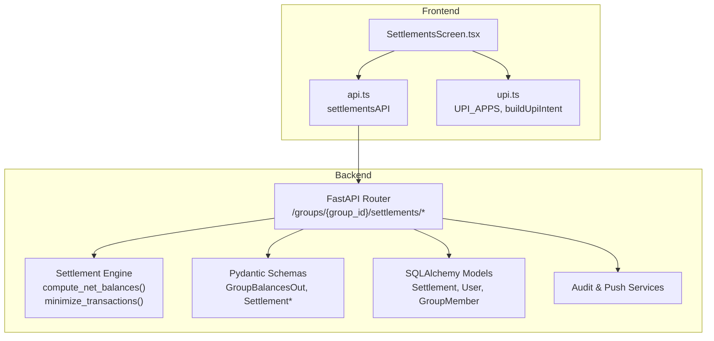
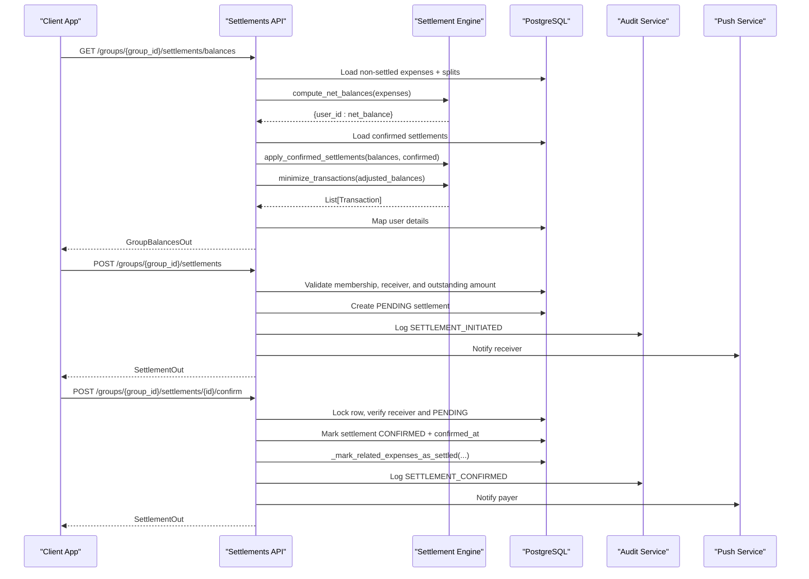
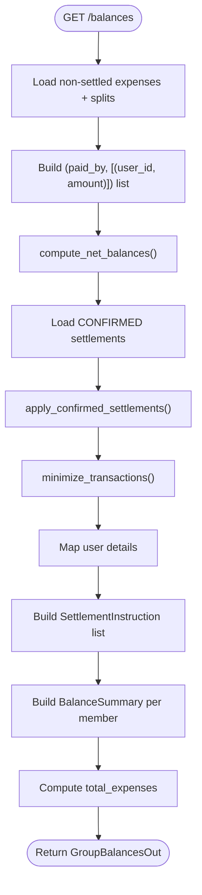
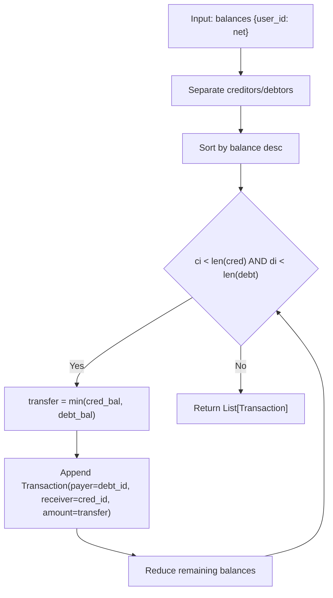
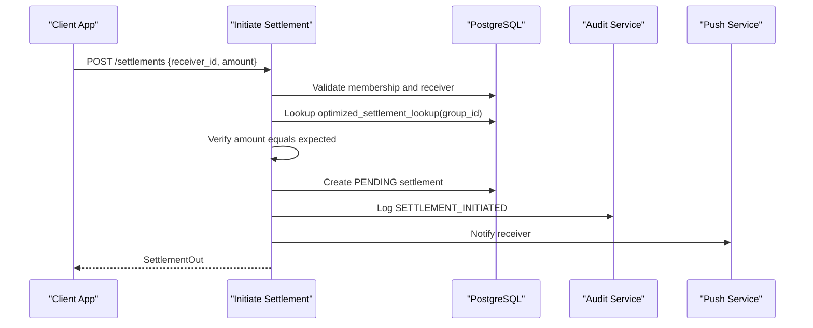
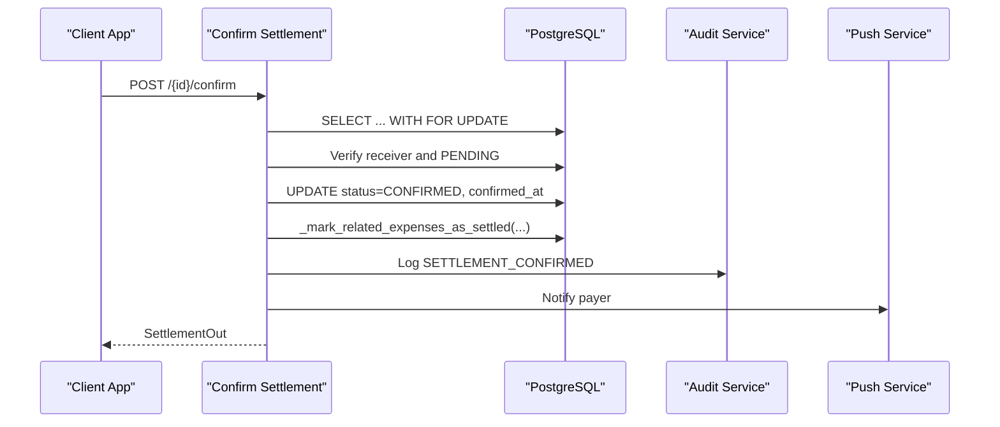
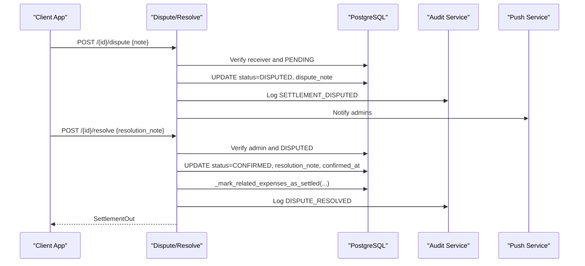
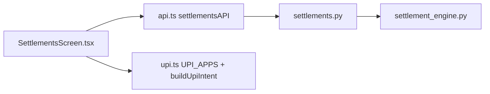
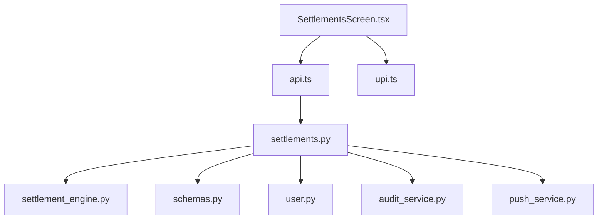

# Settlement Processing

<cite>
**Referenced Files in This Document**
- [settlements.py](file://backend/app/api/v1/endpoints/settlements.py)
- [settlement_engine.py](file://backend/app/services/settlement_engine.py)
- [schemas.py](file://backend/app/schemas/schemas.py)
- [user.py](file://backend/app/models/user.py)
- [api.ts](file://frontend/src/services/api.ts)
- [SettlementsScreen.tsx](file://frontend/src/screens/SettlementsScreen.tsx)
- [upi.ts](file://frontend/src/utils/upi.ts)
- [test_settlement_engine.py](file://backend/tests/test_settlement_engine.py)
- [README.md](file://README.md)
</cite>

## Table of Contents
1. [Introduction](#introduction)
2. [Project Structure](#project-structure)
3. [Core Components](#core-components)
4. [Architecture Overview](#architecture-overview)
5. [Detailed Component Analysis](#detailed-component-analysis)
6. [Dependency Analysis](#dependency-analysis)
7. [Performance Considerations](#performance-considerations)
8. [Troubleshooting Guide](#troubleshooting-guide)
9. [Conclusion](#conclusion)
10. [Appendices](#appendices)

## Introduction
This document provides comprehensive API documentation for settlement processing endpoints. It covers:
- Balance calculation endpoint returning per-member net balances and optimized settlement instructions
- Settlement suggestion generation using a greedy algorithm to minimize transactions
- Settlement initiation and confirmation workflows
- Settlement history and status tracking endpoints
- Mathematical foundations of the settlement algorithm, edge cases, and performance characteristics
- Examples of settlement scenarios, balance calculations, and transaction optimization
- Disputes, partial payments, reconciliation, and UPI provider compatibility

## Project Structure
Settlement processing spans backend endpoints, a dedicated settlement engine, Pydantic schemas, SQLAlchemy models, and a React Native frontend screen with UPI integration.

**Diagram sources**
- [settlements.py:130-235](file://backend/app/api/v1/endpoints/settlements.py#L130-L235)
- [settlement_engine.py:23-97](file://backend/app/services/settlement_engine.py#L23-L97)
- [schemas.py:344-394](file://backend/app/schemas/schemas.py#L344-L394)
- [user.py:164-182](file://backend/app/models/user.py#L164-L182)
- [api.ts:245-258](file://frontend/src/services/api.ts#L245-L258)
- [SettlementsScreen.tsx:38-375](file://frontend/src/screens/SettlementsScreen.tsx#L38-L375)
- [upi.ts:1-13](file://frontend/src/utils/upi.ts#L1-L13)

**Section sources**
- [README.md:114-127](file://README.md#L114-L127)

## Core Components
- Backend API router for settlement endpoints under /groups/{group_id}/settlements
- Settlement engine with balance computation and transaction minimization
- Pydantic models for request/response shapes
- SQLAlchemy models for persistence
- Frontend screen integrating with the API and UPI deep links

**Section sources**
- [settlements.py:30-308](file://backend/app/api/v1/endpoints/settlements.py#L30-L308)
- [settlement_engine.py:10-106](file://backend/app/services/settlement_engine.py#L10-L106)
- [schemas.py:344-394](file://backend/app/schemas/schemas.py#L344-L394)
- [user.py:164-182](file://backend/app/models/user.py#L164-L182)

## Architecture Overview
End-to-end settlement flow:
- Clients call the balances endpoint to compute net balances and receive optimized settlement instructions
- Clients initiate a settlement with the exact outstanding amount for a payer-receiver pair
- Receivers confirm the settlement; backend marks related expenses as settled and persists the settlement
- Disputes can be raised by receivers and resolved by admins
- Frontend displays optimized transfers, allows initiating confirmations, and integrates with UPI apps

**Diagram sources**
- [settlements.py:129-308](file://backend/app/api/v1/endpoints/settlements.py#L129-L308)
- [settlement_engine.py:23-97](file://backend/app/services/settlement_engine.py#L23-L97)
- [schemas.py:344-394](file://backend/app/schemas/schemas.py#L344-L394)
- [user.py:164-182](file://backend/app/models/user.py#L164-L182)

## Detailed Component Analysis

### Balance Calculation Endpoint
- Path: GET /groups/{group_id}/settlements/balances
- Purpose: Compute net balances per member and generate optimized settlement instructions
- Data flow:
  - Load non-deleted, non-settled expenses with splits
  - Build expense data tuples for the engine
  - Compute net balances
  - Load confirmed settlements and adjust balances
  - Minimize transactions to reduce the number of transfers
  - Map user details and build SettlementInstruction entries
  - Return GroupBalancesOut with per-member summaries and total expenses

**Diagram sources**
- [settlements.py:129-235](file://backend/app/api/v1/endpoints/settlements.py#L129-L235)
- [settlement_engine.py:23-97](file://backend/app/services/settlement_engine.py#L23-L97)

**Section sources**
- [settlements.py:129-235](file://backend/app/api/v1/endpoints/settlements.py#L129-L235)
- [settlement_engine.py:23-97](file://backend/app/services/settlement_engine.py#L23-L97)
- [schemas.py:344-367](file://backend/app/schemas/schemas.py#L344-L367)

### Settlement Suggestion Generation
- Greedy algorithm:
  - Separate creditors (positive balances) and debtors (negative balances)
  - Sort by absolute balance descending
  - Repeatedly transfer the minimum of creditor and debtor balances
  - Complexity: O(n log n) due to sorting; transaction count minimized
- Lookup map:
  - transaction_lookup aggregates transactions by payer-receiver pairs for quick validation during initiation

**Diagram sources**
- [settlement_engine.py:40-79](file://backend/app/services/settlement_engine.py#L40-L79)

**Section sources**
- [settlement_engine.py:40-79](file://backend/app/services/settlement_engine.py#L40-L79)
- [test_settlement_engine.py:30-35](file://backend/tests/test_settlement_engine.py#L30-L35)

### Settlement Initiation
- Path: POST /groups/{group_id}/settlements
- Validation:
  - Must be a group member
  - Receiver must be a member
  - Cannot settle with yourself
  - Amount must match the exact outstanding balance for the payer-receiver pair
  - No pending settlement already exists for the same pair
- Persistence:
  - Create PENDING settlement
  - Log audit event
  - Send push notification to receiver

**Diagram sources**
- [settlements.py:238-308](file://backend/app/api/v1/endpoints/settlements.py#L238-L308)

**Section sources**
- [settlements.py:238-308](file://backend/app/api/v1/endpoints/settlements.py#L238-L308)
- [schemas.py:369-379](file://backend/app/schemas/schemas.py#L369-L379)

### Settlement Confirmation Workflow
- Path: POST /groups/{group_id}/settlements/{id}/confirm
- Authorization:
  - Only the receiver can confirm
  - Settlement must be PENDING
- Processing:
  - Lock row for update
  - Mark CONFIRMED and set confirmed_at
  - Mark related expenses as settled (only those involving the exact payer-receiver pair and amount)
  - Log audit event
  - Notify payer

**Diagram sources**
- [settlements.py:311-371](file://backend/app/api/v1/endpoints/settlements.py#L311-L371)

**Section sources**
- [settlements.py:311-371](file://backend/app/api/v1/endpoints/settlements.py#L311-L371)

### Disputes and Resolution
- Dispute:
  - Receiver can dispute a PENDING settlement
  - Sets status to DISPUTED and stores note
  - Notifies admins (excluding the disputer)
- Resolution:
  - Admin can resolve a DISPUTED settlement
  - Sets status to CONFIRMED, sets confirmed_at, marks related expenses as settled
  - Stores resolution note

**Diagram sources**
- [settlements.py:374-483](file://backend/app/api/v1/endpoints/settlements.py#L374-L483)

**Section sources**
- [settlements.py:374-483](file://backend/app/api/v1/endpoints/settlements.py#L374-L483)
- [user.py:18-27](file://backend/app/models/user.py#L18-L27)

### Settlement History and Status Tracking
- Path: GET /groups/{group_id}/settlements
- Returns all settlements for the group ordered by creation time (newest first)
- Includes payer, receiver, amount, status, timestamps, and optional notes

**Section sources**
- [settlements.py:486-501](file://backend/app/api/v1/endpoints/settlements.py#L486-L501)
- [schemas.py:381-394](file://backend/app/schemas/schemas.py#L381-L394)

### Mathematical Foundations and Edge Cases
- Amounts are stored in paise (integers) to avoid floating-point errors
- Net balance sign convention:
  - Positive: user is owed
  - Negative: user owes
- Greedy minimization:
  - Always picks the largest creditor and debtor remaining until one is cleared
  - Produces minimal transaction count among feasible solutions
- Edge cases handled:
  - Self-settlement forbidden
  - Non-member receiver rejected
  - Pending settlement conflict prevented
  - Amount mismatch rejected
  - Only authorized actors can act on a settlement
  - Related expense marking ensures reconciliation of only the exact amount and participants

**Section sources**
- [settlement_engine.py:1-106](file://backend/app/services/settlement_engine.py#L1-L106)
- [settlements.py:238-308](file://backend/app/api/v1/endpoints/settlements.py#L238-L308)

### Frontend Integration and UPI Compatibility
- Frontend screen:
  - Fetches balances and settlements
  - Displays optimized transfers and net settlement
  - Allows initiating confirmations and managing disputes/resolutions
- UPI deep links:
  - Backend builds UPI deep links for receivers
  - Frontend offers UPI app shortcuts (GPay, PhonePe, Paytm) and falls back to standard UPI deep link if app scheme fails

**Diagram sources**
- [SettlementsScreen.tsx:38-375](file://frontend/src/screens/SettlementsScreen.tsx#L38-L375)
- [api.ts:245-258](file://frontend/src/services/api.ts#L245-L258)
- [upi.ts:1-13](file://frontend/src/utils/upi.ts#L1-L13)

**Section sources**
- [SettlementsScreen.tsx:38-375](file://frontend/src/screens/SettlementsScreen.tsx#L38-L375)
- [api.ts:245-258](file://frontend/src/services/api.ts#L245-L258)
- [upi.ts:1-13](file://frontend/src/utils/upi.ts#L1-L13)

## Dependency Analysis
- API depends on:
  - Settlement engine for balance computation and transaction minimization
  - SQLAlchemy models for persistence and relationships
  - Audit and push services for events and notifications
- Frontend depends on:
  - API service wrappers for settlement operations
  - UPI utilities for app-specific intents

**Diagram sources**
- [settlements.py:1-28](file://backend/app/api/v1/endpoints/settlements.py#L1-L28)
- [settlement_engine.py:1-106](file://backend/app/services/settlement_engine.py#L1-L106)
- [schemas.py:1-6](file://backend/app/schemas/schemas.py#L1-L6)
- [user.py:1-234](file://backend/app/models/user.py#L1-L234)
- [api.ts:245-258](file://frontend/src/services/api.ts#L245-L258)
- [SettlementsScreen.tsx:38-375](file://frontend/src/screens/SettlementsScreen.tsx#L38-L375)
- [upi.ts:1-13](file://frontend/src/utils/upi.ts#L1-L13)

**Section sources**
- [settlements.py:1-28](file://backend/app/api/v1/endpoints/settlements.py#L1-L28)
- [schemas.py:1-6](file://backend/app/schemas/schemas.py#L1-L6)
- [user.py:1-234](file://backend/app/models/user.py#L1-L234)
- [api.ts:245-258](file://frontend/src/services/api.ts#L245-L258)

## Performance Considerations
- Greedy algorithm:
  - Sorting dominates complexity O(n log n)
  - Transaction minimization reduces network effects and improves UX
- Database queries:
  - Single pass to load non-settled expenses with eager splits
  - Lookup of confirmed settlements and user mapping
- Concurrency:
  - Row-level locking during confirmation/dispute to prevent race conditions
- Integer arithmetic:
  - Paise storage avoids floating-point drift and simplifies comparisons

[No sources needed since this section provides general guidance]

## Troubleshooting Guide
Common issues and resolutions:
- “Not a member of this group”:
  - Ensure the current user belongs to the group before calling settlement endpoints
- “Receiver must be a member of this group”:
  - Validate receiver_id against group members
- “Cannot settle with yourself”:
  - Avoid initiating a settlement where payer_id equals receiver_id
- “No outstanding balance exists for this settlement”:
  - Call balances endpoint to discover the exact amount and payer-receiver pair
- “Settlement amount must match the outstanding balance”:
  - Use the exact amount returned by balances; partial payments are not supported
- “A pending settlement already exists for this receiver”:
  - Wait for the existing PENDING settlement to be confirmed or disputed
- “Only the receiver can confirm a settlement”:
  - Confirmations are restricted to the receiver
- “Only admins can resolve disputes”:
  - Only admins can resolve disputed settlements
- “Settlement is already {status}”:
  - Check current status and retry only when applicable

**Section sources**
- [settlements.py:33-42](file://backend/app/api/v1/endpoints/settlements.py#L33-L42)
- [settlements.py:238-308](file://backend/app/api/v1/endpoints/settlements.py#L238-L308)
- [settlements.py:311-371](file://backend/app/api/v1/endpoints/settlements.py#L311-L371)
- [settlements.py:374-483](file://backend/app/api/v1/endpoints/settlements.py#L374-L483)

## Conclusion
The settlement processing system provides a robust, mathematically sound mechanism to compute balances and minimize transactions. It enforces strict validation and concurrency controls, integrates with UPI providers, and maintains an immutable audit trail. The frontend offers a streamlined UX for initiating, confirming, disputing, and resolving settlements, with clear visibility into optimized transfers and reconciliation.

[No sources needed since this section summarizes without analyzing specific files]

## Appendices

### API Reference

- GET /groups/{group_id}/settlements/balances
  - Description: Returns per-member net balances and optimized settlement instructions
  - Response: GroupBalancesOut
  - Notes: Optimized settlements exclude already confirmed ones

- POST /groups/{group_id}/settlements
  - Description: Initiate a settlement for a specific payer-receiver pair
  - Request: SettlementCreate {receiver_id, amount}
  - Response: SettlementOut
  - Validation: Must match outstanding balance; receiver must be member; no pending exists

- POST /groups/{group_id}/settlements/{id}/confirm
  - Description: Confirm a settlement (receiver action)
  - Response: SettlementOut
  - Validation: Only receiver can confirm; must be PENDING

- POST /groups/{group_id}/settlements/{id}/dispute
  - Description: Dispute a settlement (receiver action)
  - Request: DisputeSettlementRequest {note}
  - Response: SettlementOut
  - Validation: Only receiver can dispute; must be PENDING

- POST /groups/{group_id}/settlements/{id}/resolve
  - Description: Resolve a dispute (admin action)
  - Request: ResolveDisputeRequest {resolution_note}
  - Response: SettlementOut
  - Validation: Only admin can resolve; must be DISPUTED

- GET /groups/{group_id}/settlements
  - Description: List all settlements for the group
  - Response: List[SettlementOut]

**Section sources**
- [settlements.py:129-501](file://backend/app/api/v1/endpoints/settlements.py#L129-L501)
- [schemas.py:344-394](file://backend/app/schemas/schemas.py#L344-L394)

### Example Scenarios

- Scenario 1: Balanced group with two users
  - Two expenses: A pays 1000 for both; B pays 1000 for both
  - Net balances: A owes 500, B is owed 500
  - Optimized settlement: One transaction A -> B for 500
  - Initiation: A initiates settlement for 500 to B
  - Confirmation: B confirms; related expenses marked settled

- Scenario 2: Three users with mixed debts
  - Net balances: A owes 1000, B is owed 600, C is owed 400
  - Optimized settlements: A -> B for 600, A -> C for 400
  - Initiation: A initiates two separate settlements for 600 and 400
  - Confirmation: B and C confirm independently

- Scenario 3: Partial payment attempt
  - Not supported; amount must match the exact outstanding balance
  - If user attempts partial payment, backend rejects with amount mismatch

- Scenario 4: Dispute resolution
  - Receiver disputes a settlement; admin reviews and resolves
  - Resolution confirms the settlement and reconciles related expenses

**Section sources**
- [settlement_engine.py:23-97](file://backend/app/services/settlement_engine.py#L23-L97)
- [settlements.py:238-308](file://backend/app/api/v1/endpoints/settlements.py#L238-L308)
- [settlements.py:374-483](file://backend/app/api/v1/endpoints/settlements.py#L374-L483)

### UPI Provider Compatibility
- Backend generates standard UPI deep links with amount, name, and note
- Frontend supports GPay, PhonePe, Paytm app schemes and falls back to standard UPI deep link if app scheme fails
- UPI apps are configured with icons, colors, and scheme identifiers

**Section sources**
- [settlement_engine.py:100-106](file://backend/app/services/settlement_engine.py#L100-L106)
- [upi.ts:1-13](file://frontend/src/utils/upi.ts#L1-L13)
- [SettlementsScreen.tsx:197-232](file://frontend/src/screens/SettlementsScreen.tsx#L197-L232)