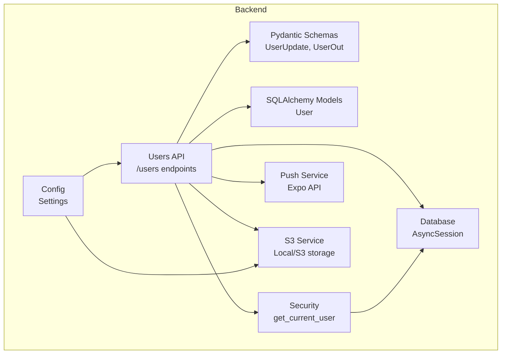
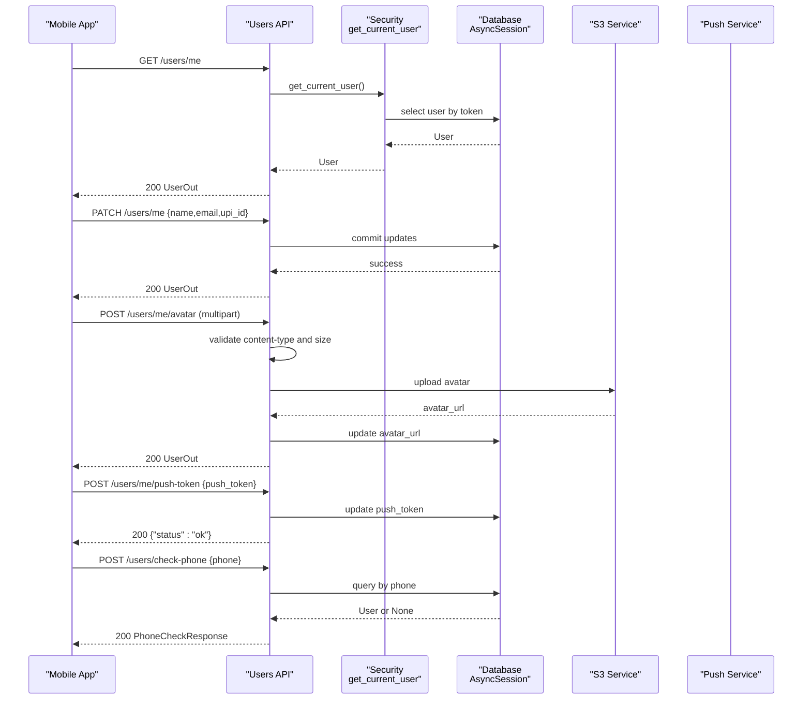
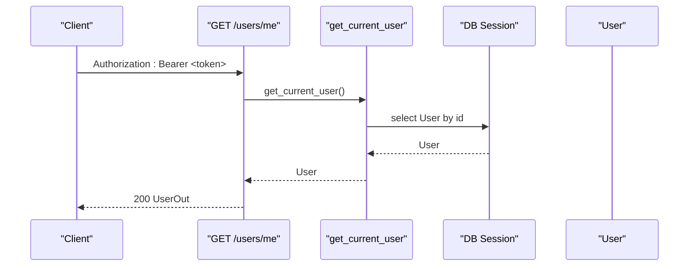
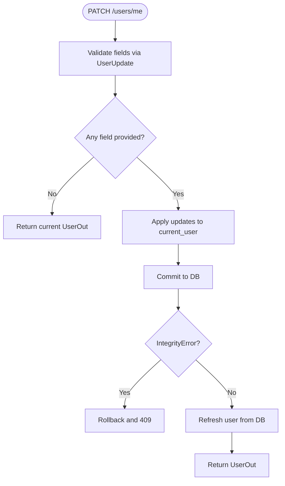
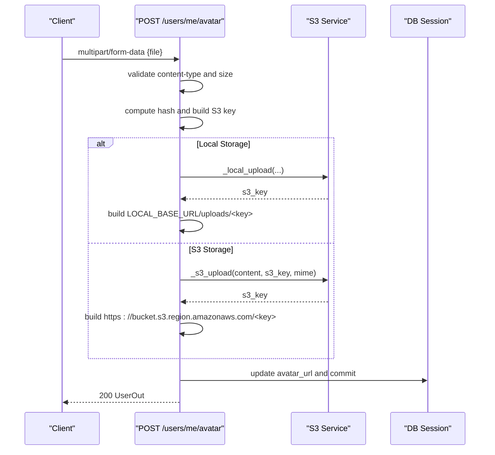
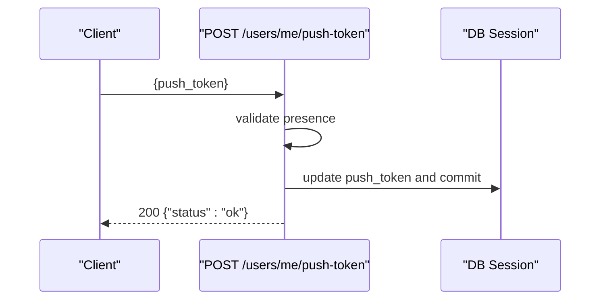
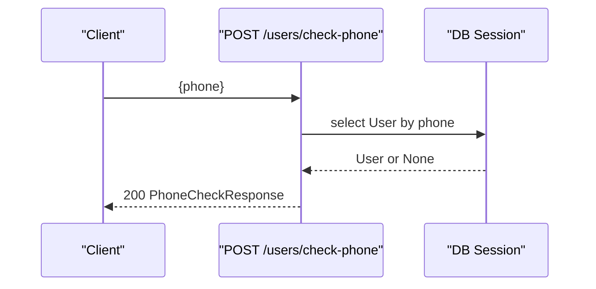
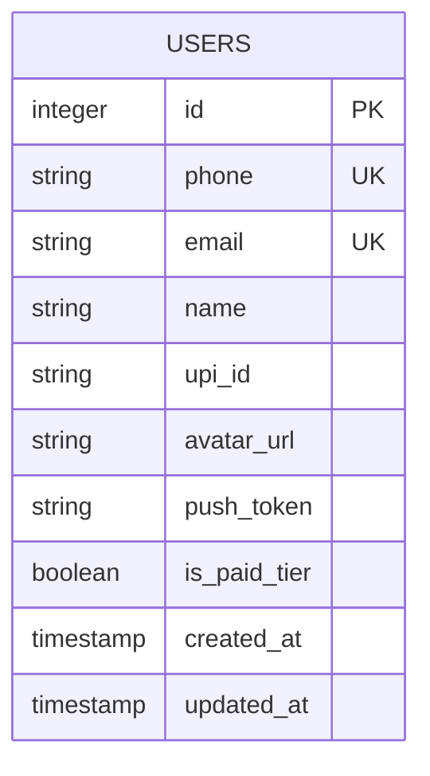
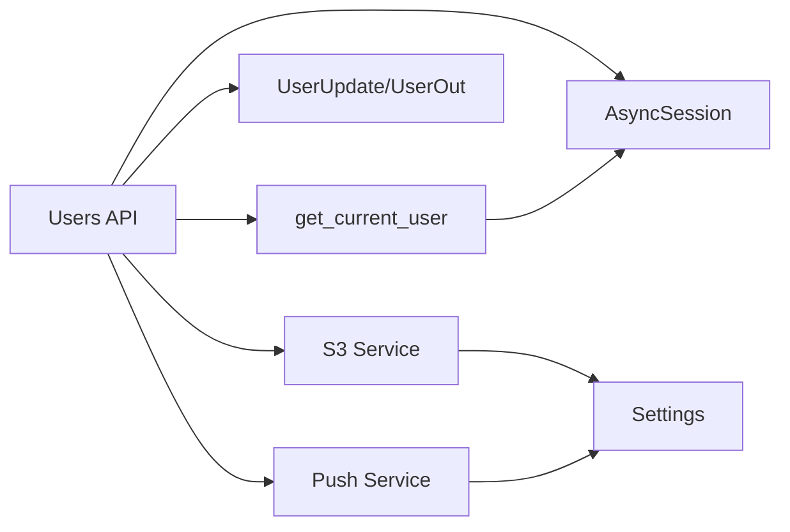

# User Management

<cite>
**Referenced Files in This Document**
- [users.py](file://backend/app/api/v1/endpoints/users.py)
- [user.py](file://backend/app/models/user.py)
- [schemas.py](file://backend/app/schemas/schemas.py)
- [push_service.py](file://backend/app/services/push_service.py)
- [s3_service.py](file://backend/app/services/s3_service.py)
- [config.py](file://backend/app/core/config.py)
- [security.py](file://backend/app/core/security.py)
- [database.py](file://backend/app/core/database.py)
- [main.py](file://backend/app/main.py)
- [001_initial.py](file://backend/alembic/versions/001_initial.py)
- [002_add_push_token.py](file://backend/alembic/versions/002_add_push_token.py)
- [ProfileScreen.tsx](file://frontend/src/screens/ProfileScreen.tsx)
- [api.ts](file://frontend/src/services/api.ts)
</cite>

## Table of Contents
1. [Introduction](#introduction)
2. [Project Structure](#project-structure)
3. [Core Components](#core-components)
4. [Architecture Overview](#architecture-overview)
5. [Detailed Component Analysis](#detailed-component-analysis)
6. [Dependency Analysis](#dependency-analysis)
7. [Performance Considerations](#performance-considerations)
8. [Troubleshooting Guide](#troubleshooting-guide)
9. [Conclusion](#conclusion)
10. [Appendices](#appendices)

## Introduction
This document provides comprehensive API documentation for user management endpoints in the SplitSure backend. It covers:
- Retrieving and updating the authenticated user’s profile
- Uploading and managing profile avatars
- Registering push notification tokens for mobile devices
- Validated request/response schemas and constraints
- Example workflows for profile updates, avatar management, and push notifications
- Privacy and data protection considerations
- Error handling for invalid inputs, permission issues, and duplicates

## Project Structure
The user management functionality is implemented in the backend FastAPI application under the v1 API namespace. The relevant components include:
- API endpoints for user operations
- Pydantic models for request/response validation
- SQLAlchemy ORM models for persistence
- Services for push notifications and file storage
- Security and configuration utilities

**Diagram sources**
- [users.py:17-115](file://backend/app/api/v1/endpoints/users.py#L17-L115)
- [schemas.py:60-132](file://backend/app/schemas/schemas.py#L60-L132)
- [user.py:51-63](file://backend/app/models/user.py#L51-L63)
- [security.py:72-96](file://backend/app/core/security.py#L72-L96)
- [config.py:6-71](file://backend/app/core/config.py#L6-L71)
- [push_service.py:17-74](file://backend/app/services/push_service.py#L17-L74)
- [s3_service.py:76-136](file://backend/app/services/s3_service.py#L76-L136)
- [database.py:23-28](file://backend/app/core/database.py#L23-L28)

**Section sources**
- [users.py:17-115](file://backend/app/api/v1/endpoints/users.py#L17-L115)
- [schemas.py:60-132](file://backend/app/schemas/schemas.py#L60-L132)
- [user.py:51-63](file://backend/app/models/user.py#L51-L63)
- [security.py:72-96](file://backend/app/core/security.py#L72-L96)
- [config.py:6-71](file://backend/app/core/config.py#L6-L71)
- [push_service.py:17-74](file://backend/app/services/push_service.py#L17-L74)
- [s3_service.py:76-136](file://backend/app/services/s3_service.py#L76-L136)
- [database.py:23-28](file://backend/app/core/database.py#L23-L28)

## Core Components
- Users API endpoints:
  - GET /users/me: Retrieve current user profile
  - PATCH /users/me: Update user profile fields
  - POST /users/me/avatar: Upload avatar image
  - POST /users/me/push-token: Register push token
  - POST /users/check-phone: Check phone registration
- Pydantic schemas:
  - UserUpdate: Fields allowed for updates
  - UserOut: Response model for user profile
  - PhoneCheckRequest/Response: Phone registration check
- SQLAlchemy model:
  - User: Database representation with constraints and indexes
- Services:
  - Push notification service via Expo
  - S3/local storage service for avatar uploads

**Section sources**
- [users.py:17-115](file://backend/app/api/v1/endpoints/users.py#L17-L115)
- [schemas.py:60-132](file://backend/app/schemas/schemas.py#L60-L132)
- [user.py:51-63](file://backend/app/models/user.py#L51-L63)
- [push_service.py:17-74](file://backend/app/services/push_service.py#L17-L74)
- [s3_service.py:76-136](file://backend/app/services/s3_service.py#L76-L136)

## Architecture Overview
The user management endpoints are protected by bearer token authentication and operate against an asynchronous PostgreSQL database. Avatars are stored either locally (development) or on AWS S3 (production), with URLs generated accordingly. Push notifications are sent via Expo’s API.

**Diagram sources**
- [users.py:17-115](file://backend/app/api/v1/endpoints/users.py#L17-L115)
- [security.py:72-96](file://backend/app/core/security.py#L72-L96)
- [database.py:23-28](file://backend/app/core/database.py#L23-L28)
- [s3_service.py:76-136](file://backend/app/services/s3_service.py#L76-L136)
- [push_service.py:17-74](file://backend/app/services/push_service.py#L17-L74)

## Detailed Component Analysis

### User Profile Retrieval: GET /users/me
- Purpose: Return the authenticated user’s profile.
- Authentication: Requires a valid access token.
- Response: UserOut model containing id, phone, name, email, upi_id, avatar_url, is_paid_tier, created_at.

**Diagram sources**
- [users.py:17-19](file://backend/app/api/v1/endpoints/users.py#L17-L19)
- [security.py:72-96](file://backend/app/core/security.py#L72-L96)
- [schemas.py:102-112](file://backend/app/schemas/schemas.py#L102-L112)

**Section sources**
- [users.py:17-19](file://backend/app/api/v1/endpoints/users.py#L17-L19)
- [schemas.py:102-112](file://backend/app/schemas/schemas.py#L102-L112)
- [security.py:72-96](file://backend/app/core/security.py#L72-L96)

### User Profile Update: PATCH /users/me
- Purpose: Update name, email, and/or UPI ID.
- Authentication: Requires a valid access token.
- Validation:
  - Name: Max 100 characters; stripped and normalized.
  - Email: Lowercased and validated as a basic email pattern; stripped and normalized.
  - UPI ID: Lowercased and validated against a UPI regex; stripped and normalized.
- Persistence: Updates only provided fields; commits transaction; handles integrity errors (e.g., duplicate email).
- Response: Updated UserOut.

**Diagram sources**
- [users.py:22-48](file://backend/app/api/v1/endpoints/users.py#L22-L48)
- [schemas.py:60-100](file://backend/app/schemas/schemas.py#L60-L100)

**Section sources**
- [users.py:22-48](file://backend/app/api/v1/endpoints/users.py#L22-L48)
- [schemas.py:60-100](file://backend/app/schemas/schemas.py#L60-L100)

### Avatar Upload: POST /users/me/avatar
- Purpose: Upload a profile avatar image.
- Authentication: Requires a valid access token.
- Constraints:
  - Content-Type must be image/jpeg, image/png, or image/webp.
  - File size must be under 2MB.
  - Filename extension derived from original filename or defaults to jpg.
- Storage:
  - Local mode: writes to LOCAL_UPLOAD_DIR and constructs LOCAL_BASE_URL/uploads/<key>.
  - S3 mode: uploads to S3 bucket with AES256 encryption and generates HTTPS URL.
- Response: Updated UserOut with avatar_url set.

**Diagram sources**
- [users.py:51-83](file://backend/app/api/v1/endpoints/users.py#L51-L83)
- [s3_service.py:76-136](file://backend/app/services/s3_service.py#L76-L136)
- [config.py:16-28](file://backend/app/core/config.py#L16-L28)

**Section sources**
- [users.py:51-83](file://backend/app/api/v1/endpoints/users.py#L51-L83)
- [s3_service.py:76-136](file://backend/app/services/s3_service.py#L76-L136)
- [config.py:16-28](file://backend/app/core/config.py#L16-L28)

### Push Notification Token Registration: POST /users/me/push-token
- Purpose: Register an Expo push token for the current user.
- Authentication: Requires a valid access token.
- Request body: push_token (required).
- Behavior: Stores the token on the user record; returns {"status":"ok"}.
- Notes: The push service validates token format and sends notifications via Expo API.

**Diagram sources**
- [users.py:86-99](file://backend/app/api/v1/endpoints/users.py#L86-L99)
- [push_service.py:17-46](file://backend/app/services/push_service.py#L17-L46)

**Section sources**
- [users.py:86-99](file://backend/app/api/v1/endpoints/users.py#L86-L99)
- [push_service.py:17-46](file://backend/app/services/push_service.py#L17-L46)

### Phone Registration Check: POST /users/check-phone
- Purpose: Determine if a phone number is registered and optionally return the associated user’s name.
- Authentication: Requires a valid access token.
- Request body: phone (validated to E.164 format).
- Response: registered (boolean), user_name (optional).

**Diagram sources**
- [users.py:102-115](file://backend/app/api/v1/endpoints/users.py#L102-L115)
- [schemas.py:115-132](file://backend/app/schemas/schemas.py#L115-L132)

**Section sources**
- [users.py:102-115](file://backend/app/api/v1/endpoints/users.py#L102-L115)
- [schemas.py:115-132](file://backend/app/schemas/schemas.py#L115-L132)

### Data Models and Constraints
- User model fields:
  - phone: unique, indexed, string up to 15 chars
  - email: unique, optional, string up to 255
  - name: optional, string up to 100
  - upi_id: optional, string up to 100
  - avatar_url: optional, string up to 500
  - push_token: optional, string up to 500
  - is_paid_tier: boolean default False
  - created_at/updated_at timestamps
- Indexes and uniqueness:
  - phone unique and indexed
  - email unique and indexed
  - group_members unique constraint on (group_id, user_id)

**Diagram sources**
- [user.py:51-63](file://backend/app/models/user.py#L51-L63)
- [001_initial.py:18-32](file://backend/alembic/versions/001_initial.py#L18-L32)
- [002_add_push_token.py:17-18](file://backend/alembic/versions/002_add_push_token.py#L17-L18)

**Section sources**
- [user.py:51-63](file://backend/app/models/user.py#L51-L63)
- [001_initial.py:18-32](file://backend/alembic/versions/001_initial.py#L18-L32)
- [002_add_push_token.py:17-18](file://backend/alembic/versions/002_add_push_token.py#L17-L18)

### Request/Response Schemas
- UserUpdate
  - name: Optional[str]
  - email: Optional[str]
  - upi_id: Optional[str]
  - Validators: strip and normalize; enforce length/email/UPI rules
- UserOut
  - id: int
  - phone: str
  - name: Optional[str]
  - email: Optional[str]
  - upi_id: Optional[str]
  - avatar_url: Optional[str]
  - is_paid_tier: bool
  - created_at: datetime
- PhoneCheckRequest
  - phone: str (validated to E.164)
- PhoneCheckResponse
  - registered: bool
  - user_name: Optional[str]

**Section sources**
- [schemas.py:60-100](file://backend/app/schemas/schemas.py#L60-L100)
- [schemas.py:102-112](file://backend/app/schemas/schemas.py#L102-L112)
- [schemas.py:115-132](file://backend/app/schemas/schemas.py#L115-L132)

### Frontend Integration Examples
- Profile screen mutations:
  - Update profile: calls usersAPI.updateMe with {name, email, upi_id}
  - Upload avatar: builds FormData with image asset and calls usersAPI.uploadAvatar
  - Register push token: calls usersAPI.registerPushToken with push_token
- API client:
  - Automatically attaches Authorization header
  - Handles 401 refresh flow and retries

**Section sources**
- [ProfileScreen.tsx:20-72](file://frontend/src/screens/ProfileScreen.tsx#L20-L72)
- [api.ts:171-184](file://frontend/src/services/api.ts#L171-L184)

## Dependency Analysis
- API endpoints depend on:
  - Security: get_current_user for authentication and authorization
  - Database: AsyncSession for transactions
  - Schemas: Pydantic models for validation
  - Services: S3 service for avatar storage; push service for notifications
- Models define constraints and relationships; Alembic migrations manage schema evolution.

**Diagram sources**
- [users.py:17-115](file://backend/app/api/v1/endpoints/users.py#L17-L115)
- [security.py:72-96](file://backend/app/core/security.py#L72-L96)
- [schemas.py:60-132](file://backend/app/schemas/schemas.py#L60-L132)
- [s3_service.py:76-136](file://backend/app/services/s3_service.py#L76-L136)
- [push_service.py:17-46](file://backend/app/services/push_service.py#L17-L46)
- [config.py:6-71](file://backend/app/core/config.py#L6-L71)

**Section sources**
- [users.py:17-115](file://backend/app/api/v1/endpoints/users.py#L17-L115)
- [security.py:72-96](file://backend/app/core/security.py#L72-L96)
- [schemas.py:60-132](file://backend/app/schemas/schemas.py#L60-L132)
- [s3_service.py:76-136](file://backend/app/services/s3_service.py#L76-L136)
- [push_service.py:17-46](file://backend/app/services/push_service.py#L17-L46)
- [config.py:6-71](file://backend/app/core/config.py#L6-L71)

## Performance Considerations
- Asynchronous database operations reduce blocking during avatar uploads and profile updates.
- Local vs S3 storage toggled via settings; S3 uploads are encrypted and use pre-signed URLs for downloads.
- Push notifications are fire-and-forget with timeouts to avoid blocking user requests.

[No sources needed since this section provides general guidance]

## Troubleshooting Guide
Common error scenarios and handling:
- Invalid or missing Authorization header:
  - 401 Unauthorized from get_current_user
- Expired or blacklisted token:
  - 401 Unauthorized; ensure token is refreshed and not revoked
- Duplicate email during update:
  - 409 Conflict; choose a unique email
- Database errors:
  - 500 Internal Server Error; logs include details
- Avatar upload errors:
  - 400 Bad Request for unsupported content-type or oversized files
  - 500 Internal Server Error for S3 failures
- Push token errors:
  - 400 Bad Request if push_token is missing
  - Silent failures in push service for invalid tokens or network issues

**Section sources**
- [security.py:72-96](file://backend/app/core/security.py#L72-L96)
- [users.py:37-45](file://backend/app/api/v1/endpoints/users.py#L37-L45)
- [users.py:58-64](file://backend/app/api/v1/endpoints/users.py#L58-L64)
- [users.py:93-95](file://backend/app/api/v1/endpoints/users.py#L93-L95)
- [push_service.py:27-45](file://backend/app/services/push_service.py#L27-L45)

## Conclusion
The user management module provides secure, validated endpoints for retrieving and updating profiles, uploading avatars, and registering push tokens. Robust validation, error handling, and configurable storage make it suitable for both development and production environments. The frontend integrates seamlessly with these endpoints to deliver a smooth user experience.

[No sources needed since this section summarizes without analyzing specific files]

## Appendices

### API Reference Summary

- GET /users/me
  - Description: Retrieve current user profile
  - Auth: Bearer token
  - Response: UserOut

- PATCH /users/me
  - Description: Update name, email, and/or UPI ID
  - Auth: Bearer token
  - Request: UserUpdate
  - Response: UserOut
  - Validation rules:
    - name: max 100 chars, stripped
    - email: valid email pattern, lowercased, stripped
    - upi_id: valid UPI pattern, lowercased, stripped

- POST /users/me/avatar
  - Description: Upload avatar image
  - Auth: Bearer token
  - Request: multipart/form-data with file
  - Constraints:
    - Content-Type: image/jpeg, image/png, image/webp
    - Size: ≤ 2MB
  - Response: UserOut with avatar_url

- POST /users/me/push-token
  - Description: Register push token
  - Auth: Bearer token
  - Request: { push_token }
  - Response: {"status":"ok"}

- POST /users/check-phone
  - Description: Check if phone is registered
  - Auth: Bearer token
  - Request: PhoneCheckRequest
  - Response: PhoneCheckResponse

**Section sources**
- [users.py:17-115](file://backend/app/api/v1/endpoints/users.py#L17-L115)
- [schemas.py:60-132](file://backend/app/schemas/schemas.py#L60-L132)

### Privacy and Data Protection Notes
- Tokens and sensitive fields are handled securely; tokens are validated and blacklisted upon logout.
- Avatar storage supports local or S3; S3 uploads use server-side encryption.
- Email and UPI ID updates are validated to prevent malformed data.
- Phone checks return minimal user data; ensure client-side privacy controls are respected.

**Section sources**
- [security.py:47-69](file://backend/app/core/security.py#L47-L69)
- [s3_service.py:79-87](file://backend/app/services/s3_service.py#L79-L87)
- [schemas.py:77-99](file://backend/app/schemas/schemas.py#L77-L99)