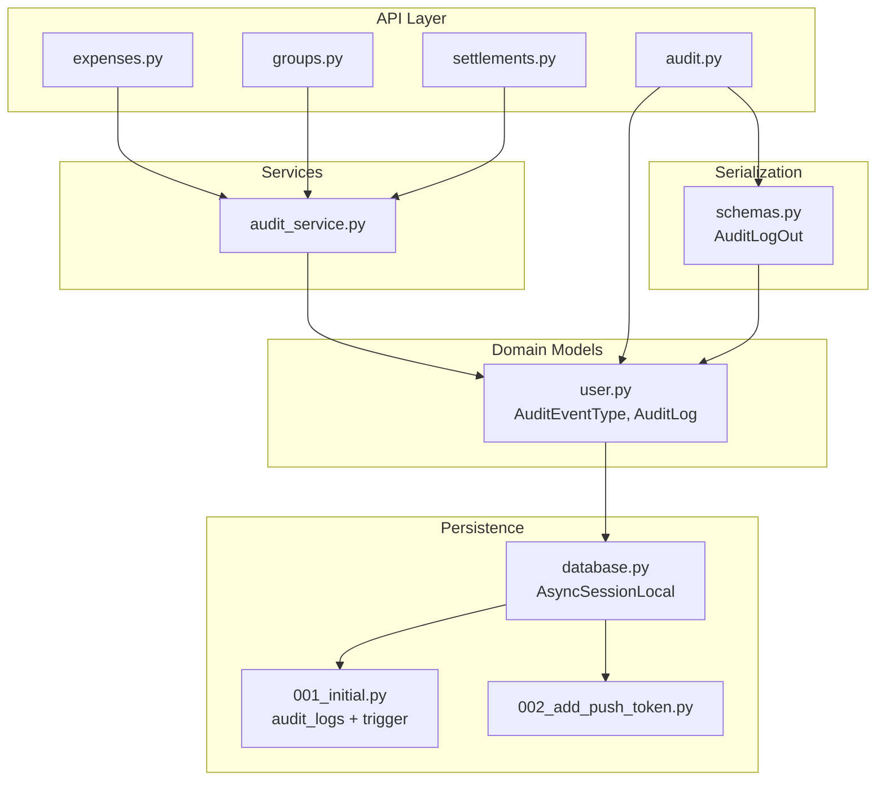
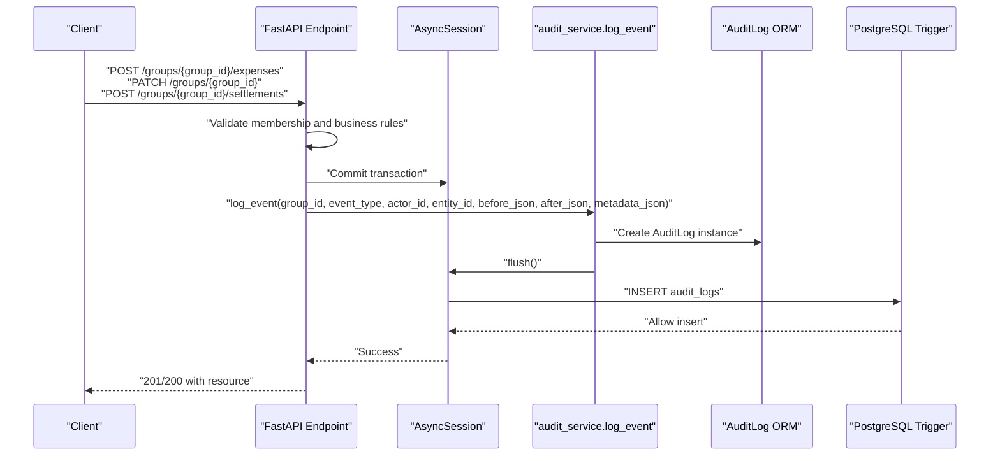
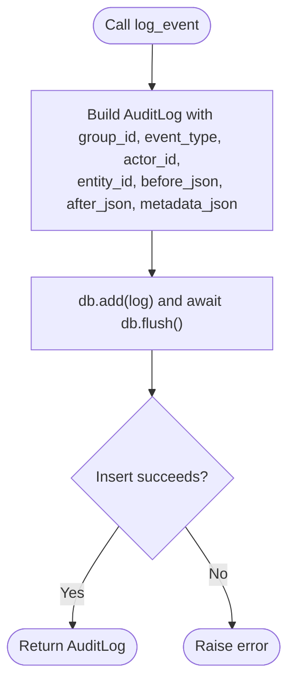
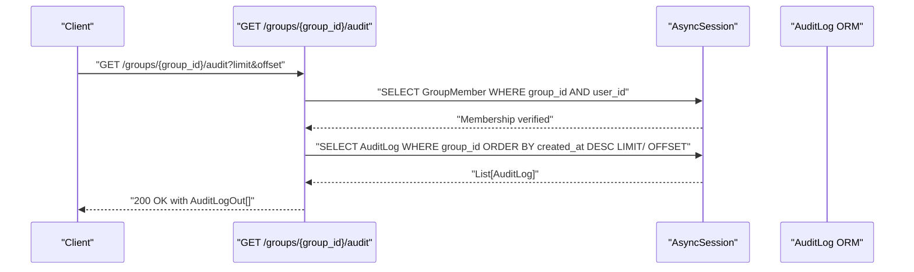
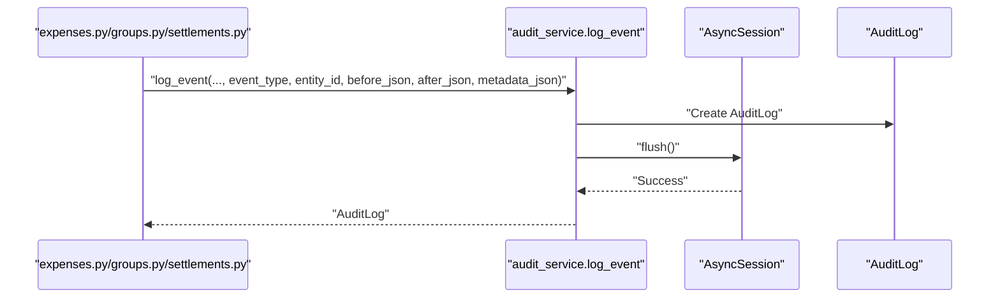
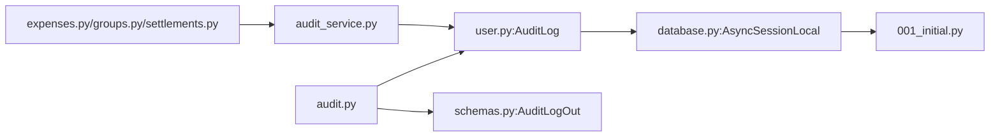

# Audit Trail and Compliance System

<cite>
**Referenced Files in This Document**
- [audit.py](file://backend/app/api/v1/endpoints/audit.py)
- [audit_service.py](file://backend/app/services/audit_service.py)
- [user.py](file://backend/app/models/user.py)
- [schemas.py](file://backend/app/schemas/schemas.py)
- [database.py](file://backend/app/core/database.py)
- [001_initial.py](file://backend/alembic/versions/001_initial.py)
- [002_add_push_token.py](file://backend/alembic/versions/002_add_push_token.py)
- [expenses.py](file://backend/app/api/v1/endpoints/expenses.py)
- [groups.py](file://backend/app/api/v1/endpoints/groups.py)
- [settlements.py](file://backend/app/api/v1/endpoints/settlements.py)
</cite>

## Table of Contents
1. [Introduction](#introduction)
2. [Project Structure](#project-structure)
3. [Core Components](#core-components)
4. [Architecture Overview](#architecture-overview)
5. [Detailed Component Analysis](#detailed-component-analysis)
6. [Dependency Analysis](#dependency-analysis)
7. [Performance Considerations](#performance-considerations)
8. [Troubleshooting Guide](#troubleshooting-guide)
9. [Conclusion](#conclusion)
10. [Appendices](#appendices)

## Introduction
This document describes the audit trail and compliance system for capturing, storing, and retrieving immutable audit logs. It explains the event lifecycle from trigger to storage, the supported event types, metadata collection, and timestamp management. It also documents log formatting standards, data serialization, immutability enforcement via database triggers, compliance reporting capabilities, activity timelines, querying and filtering, export readiness, security considerations, and integration with business processes. Finally, it covers performance impact, storage optimization, and retention policy implementation.

## Project Structure
The audit system spans API endpoints, services, models, schemas, database configuration, and Alembic migrations. Business operations in expenses, groups, and settlements integrate audit event logging through a central service.



**Diagram sources**
- [audit.py:1-40](file://backend/app/api/v1/endpoints/audit.py#L1-L40)
- [audit_service.py:1-32](file://backend/app/services/audit_service.py#L1-L32)
- [user.py:37-199](file://backend/app/models/user.py#L37-L199)
- [schemas.py:421-432](file://backend/app/schemas/schemas.py#L421-L432)
- [database.py:1-29](file://backend/app/core/database.py#L1-L29)
- [001_initial.py:113-170](file://backend/alembic/versions/001_initial.py#L113-L170)
- [002_add_push_token.py:17-22](file://backend/alembic/versions/002_add_push_token.py#L17-L22)
- [expenses.py:14-17](file://backend/app/api/v1/endpoints/expenses.py#L14-L17)
- [groups.py:15-15](file://backend/app/api/v1/endpoints/groups.py#L15-L15)
- [settlements.py:25-25](file://backend/app/api/v1/endpoints/settlements.py#L25-L25)

**Section sources**
- [audit.py:1-40](file://backend/app/api/v1/endpoints/audit.py#L1-L40)
- [audit_service.py:1-32](file://backend/app/services/audit_service.py#L1-L32)
- [user.py:37-199](file://backend/app/models/user.py#L37-L199)
- [schemas.py:421-432](file://backend/app/schemas/schemas.py#L421-L432)
- [database.py:1-29](file://backend/app/core/database.py#L1-L29)
- [001_initial.py:113-170](file://backend/alembic/versions/001_initial.py#L113-L170)
- [002_add_push_token.py:17-22](file://backend/alembic/versions/002_add_push_token.py#L17-L22)
- [expenses.py:14-17](file://backend/app/api/v1/endpoints/expenses.py#L14-L17)
- [groups.py:15-15](file://backend/app/api/v1/endpoints/groups.py#L15-L15)
- [settlements.py:25-25](file://backend/app/api/v1/endpoints/settlements.py#L25-L25)

## Core Components
- Audit event types: Defined as an enumeration covering expense lifecycle, settlement lifecycle, disputes, membership changes, and group lifecycle.
- Audit log model: Stores group_id, event_type, optional entity_id, actor_id, JSON payloads for before/after/metadata, and created_at timestamp.
- Audit service: Provides a single asynchronous log_event function to persist immutable audit entries.
- API endpoint: Exposes GET /groups/{group_id}/audit to fetch paginated audit logs with actor expansion.
- Serialization: Pydantic model AuditLogOut defines the response shape for audit log retrieval.
- Database and immutability: Alembic migration creates audit_logs and a PostgreSQL trigger to enforce append-only semantics.

Key responsibilities:
- Event capture: Business endpoints call log_event with appropriate event_type and JSON payloads.
- Storage: AuditLog ORM persists audit records with JSON fields and timestamps.
- Retrieval: API endpoint filters by group_id, orders by created_at descending, and supports pagination.
- Immutability: Database trigger prevents UPDATE/DELETE on audit_logs.

**Section sources**
- [user.py:37-49](file://backend/app/models/user.py#L37-L49)
- [user.py:184-199](file://backend/app/models/user.py#L184-L199)
- [audit_service.py:6-31](file://backend/app/services/audit_service.py#L6-L31)
- [audit.py:13-39](file://backend/app/api/v1/endpoints/audit.py#L13-L39)
- [schemas.py:421-432](file://backend/app/schemas/schemas.py#L421-L432)
- [001_initial.py:113-169](file://backend/alembic/versions/001_initial.py#L113-L169)

## Architecture Overview
The audit system integrates tightly with business operations. When a business action occurs, the endpoint validates access, performs the operation, and then logs an immutable audit event. Retrieval is exposed via a dedicated endpoint with membership checks and pagination.



**Diagram sources**
- [expenses.py:172-176](file://backend/app/api/v1/endpoints/expenses.py#L172-L176)
- [groups.py:77-81](file://backend/app/api/v1/endpoints/groups.py#L77-L81)
- [settlements.py:279-283](file://backend/app/api/v1/endpoints/settlements.py#L279-L283)
- [audit_service.py:20-31](file://backend/app/services/audit_service.py#L20-L31)
- [user.py:184-199](file://backend/app/models/user.py#L184-L199)
- [001_initial.py:157-169](file://backend/alembic/versions/001_initial.py#L157-L169)

## Detailed Component Analysis

### Audit Event Types and Lifecycle
Supported event types include expense lifecycle (created, edited, deleted), settlement lifecycle (initiated, confirmed, disputed), dispute resolution, membership changes (added, removed), and group lifecycle (created, updated). Events are logged immediately after successful business operations, capturing before_json, after_json, and optional metadata_json.

```mermaid
classDiagram
class AuditEventType {
<<enum>>
"expense_created"
"expense_edited"
"expense_deleted"
"settlement_initiated"
"settlement_confirmed"
"settlement_disputed"
"dispute_resolved"
"member_added"
"member_removed"
"group_created"
"group_updated"
}
class AuditLog {
+int id
+int group_id
+AuditEventType event_type
+int entity_id
+int actor_id
+dict before_json
+dict after_json
+dict metadata_json
+datetime created_at
}
class AuditLogOut {
+int id
+AuditEventType event_type
+int entity_id
+UserOut actor
+dict before_json
+dict after_json
+dict metadata_json
+datetime created_at
}
AuditLogOut --> AuditEventType : "uses"
AuditLog ..> AuditEventType : "stores"
```

**Diagram sources**
- [user.py:37-49](file://backend/app/models/user.py#L37-L49)
- [user.py:184-199](file://backend/app/models/user.py#L184-L199)
- [schemas.py:421-432](file://backend/app/schemas/schemas.py#L421-L432)

**Section sources**
- [user.py:37-49](file://backend/app/models/user.py#L37-L49)
- [audit_service.py:6-31](file://backend/app/services/audit_service.py#L6-L31)
- [expenses.py:172-176](file://backend/app/api/v1/endpoints/expenses.py#L172-L176)
- [groups.py:131-135](file://backend/app/api/v1/endpoints/groups.py#L131-L135)
- [settlements.py:279-283](file://backend/app/api/v1/endpoints/settlements.py#L279-L283)

### Audit Log Persistence and Immutability
The audit service constructs an AuditLog instance and flushes it to the database. The Alembic migration creates the audit_logs table and a PostgreSQL trigger that raises an exception on UPDATE or DELETE, enforcing append-only immutability.



**Diagram sources**
- [audit_service.py:20-31](file://backend/app/services/audit_service.py#L20-L31)
- [001_initial.py:157-169](file://backend/alembic/versions/001_initial.py#L157-L169)

**Section sources**
- [audit_service.py:6-31](file://backend/app/services/audit_service.py#L6-L31)
- [001_initial.py:157-169](file://backend/alembic/versions/001_initial.py#L157-L169)

### Audit Retrieval API and Access Control
The audit retrieval endpoint enforces membership checks, paginates results, orders by created_at descending, and expands the actor user. The response uses AuditLogOut for consistent serialization.



**Diagram sources**
- [audit.py:22-39](file://backend/app/api/v1/endpoints/audit.py#L22-L39)
- [schemas.py:421-432](file://backend/app/schemas/schemas.py#L421-L432)
- [user.py:184-199](file://backend/app/models/user.py#L184-L199)

**Section sources**
- [audit.py:13-39](file://backend/app/api/v1/endpoints/audit.py#L13-L39)
- [schemas.py:421-432](file://backend/app/schemas/schemas.py#L421-L432)

### Integration with Business Processes
Business endpoints integrate audit logging around CRUD operations:
- Expenses: After creation, update, or deletion, log appropriate event types with before/after JSON.
- Groups: After creation and updates, log group lifecycle events with before/after JSON.
- Settlements: On initiation, confirmation, dispute, and resolution, log settlement lifecycle events with metadata.



**Diagram sources**
- [expenses.py:172-176](file://backend/app/api/v1/endpoints/expenses.py#L172-L176)
- [groups.py:77-81](file://backend/app/api/v1/endpoints/groups.py#L77-L81)
- [settlements.py:279-283](file://backend/app/api/v1/endpoints/settlements.py#L279-L283)
- [audit_service.py:20-31](file://backend/app/services/audit_service.py#L20-L31)

**Section sources**
- [expenses.py:172-176](file://backend/app/api/v1/endpoints/expenses.py#L172-L176)
- [groups.py:131-135](file://backend/app/api/v1/endpoints/groups.py#L131-L135)
- [settlements.py:279-283](file://backend/app/api/v1/endpoints/settlements.py#L279-L283)

### Log Formatting Standards and Data Serialization
- Event payloads are serialized as JSON in before_json, after_json, and metadata_json fields.
- Timestamps are stored with timezone-aware DateTime and indexed for efficient queries.
- Responses use AuditLogOut to ensure consistent serialization and include actor expansion.

**Section sources**
- [user.py:184-199](file://backend/app/models/user.py#L184-L199)
- [schemas.py:421-432](file://backend/app/schemas/schemas.py#L421-L432)

### Compliance Reporting and Activity Timeline
- Activity timeline: Retrieve audit logs ordered by created_at descending to reconstruct timelines per group.
- Filtering: Membership verification ensures only authorized users can access group audit logs.
- Export readiness: JSON payloads enable downstream processing for compliance reporting and export.

**Section sources**
- [audit.py:31-39](file://backend/app/api/v1/endpoints/audit.py#L31-L39)

### Security Considerations
- Access control: Membership checks are enforced before retrieving audit logs.
- Tamper-evidence: PostgreSQL trigger prevents modification/deletion of audit_logs, ensuring append-only immutability.
- Data protection: AuditLogOut excludes sensitive fields; JSON payloads should avoid embedding secrets.

**Section sources**
- [audit.py:22-29](file://backend/app/api/v1/endpoints/audit.py#L22-L29)
- [001_initial.py:157-169](file://backend/alembic/versions/001_initial.py#L157-L169)

### Real-time Audit Event Generation
- Audit events are generated synchronously within the same transaction as business operations, ensuring causality and atomicity.
- Immediate flush guarantees the audit record is visible after commit.

**Section sources**
- [audit_service.py:29-31](file://backend/app/services/audit_service.py#L29-L31)

### Examples
- Expense created: Call log_event with EXPENSE_CREATED, entity_id as the expense id, and after_json containing the expense representation.
- Group updated: Call log_event with GROUP_UPDATED, entity_id as the group id, and before_json/after_json reflecting changes.
- Settlement initiated: Call log_event with SETTLEMENT_INITIATED, entity_id as the settlement id, and metadata_json with relevant details.

**Section sources**
- [expenses.py:172-176](file://backend/app/api/v1/endpoints/expenses.py#L172-L176)
- [groups.py:131-135](file://backend/app/api/v1/endpoints/groups.py#L131-L135)
- [settlements.py:279-283](file://backend/app/api/v1/endpoints/settlements.py#L279-L283)

## Dependency Analysis
The audit system exhibits low coupling and high cohesion:
- API endpoints depend on the audit service for logging.
- Audit service depends on the AuditLog model and AsyncSession.
- AuditLog depends on SQLAlchemy ORM and PostgreSQL JSON fields.
- Retrieval endpoint depends on AuditLog and User models for serialization.



**Diagram sources**
- [expenses.py:14-17](file://backend/app/api/v1/endpoints/expenses.py#L14-L17)
- [groups.py:15-15](file://backend/app/api/v1/endpoints/groups.py#L15-L15)
- [settlements.py:25-25](file://backend/app/api/v1/endpoints/settlements.py#L25-L25)
- [audit_service.py:1-32](file://backend/app/services/audit_service.py#L1-L32)
- [user.py:184-199](file://backend/app/models/user.py#L184-L199)
- [database.py:12-28](file://backend/app/core/database.py#L12-L28)
- [audit.py:13-39](file://backend/app/api/v1/endpoints/audit.py#L13-L39)
- [schemas.py:421-432](file://backend/app/schemas/schemas.py#L421-L432)
- [001_initial.py:113-169](file://backend/alembic/versions/001_initial.py#L113-L169)

**Section sources**
- [expenses.py:14-17](file://backend/app/api/v1/endpoints/expenses.py#L14-L17)
- [groups.py:15-15](file://backend/app/api/v1/endpoints/groups.py#L15-L15)
- [settlements.py:25-25](file://backend/app/api/v1/endpoints/settlements.py#L25-L25)
- [audit_service.py:1-32](file://backend/app/services/audit_service.py#L1-L32)
- [user.py:184-199](file://backend/app/models/user.py#L184-L199)
- [database.py:12-28](file://backend/app/core/database.py#L12-L28)
- [audit.py:13-39](file://backend/app/api/v1/endpoints/audit.py#L13-L39)
- [schemas.py:421-432](file://backend/app/schemas/schemas.py#L421-L432)
- [001_initial.py:113-169](file://backend/alembic/versions/001_initial.py#L113-L169)

## Performance Considerations
- Indexing: The audit_logs table includes indexes on group_id, entity_id, and created_at to optimize retrieval and grouping.
- Asynchronous sessions: Async database sessions reduce blocking during audit writes.
- JSON fields: Efficient for flexible payloads but consider payload sizes to avoid bloated rows.
- Pagination: The retrieval endpoint supports limit and offset to bound memory and network usage.
- Trigger overhead: The PostgreSQL trigger adds minimal overhead by raising an exception on UPDATE/DELETE.

Recommendations:
- Monitor audit volume and consider partitioning or archiving older logs.
- Use limit/offset effectively and avoid large offsets for deep pagination.
- Keep before/after payloads concise; avoid embedding large binary data.

**Section sources**
- [001_initial.py:126](file://backend/alembic/versions/001_initial.py#L126)
- [database.py:5-16](file://backend/app/core/database.py#L5-L16)
- [audit.py:16-17](file://backend/app/api/v1/endpoints/audit.py#L16-L17)

## Troubleshooting Guide
Common issues and resolutions:
- Attempted UPDATE/DELETE on audit_logs: Expect an exception due to the immutable trigger.
- Unauthorized access to audit logs: Membership verification raises HTTP 403 for non-members.
- Audit log not appearing: Ensure log_event is called within the same transaction as the business operation and that db.flush/commit succeeds.

**Section sources**
- [001_initial.py:157-169](file://backend/alembic/versions/001_initial.py#L157-L169)
- [audit.py:22-29](file://backend/app/api/v1/endpoints/audit.py#L22-L29)

## Conclusion
The audit trail and compliance system provides robust, immutable logging of critical business events. It integrates seamlessly with expenses, groups, and settlements, offering real-time, tamper-evident records with standardized JSON payloads and strict access controls. The PostgreSQL trigger ensures immutability, while indexing and pagination support efficient retrieval and scalability.

## Appendices

### Compliance Reporting Capabilities
- Timeline reconstruction: Use created_at ordering to rebuild chronological sequences.
- Filtering: Restrict by group_id and optionally entity_id for granular views.
- Export: Retrieve JSON payloads for external systems; consider adding CSV export endpoints if needed.

**Section sources**
- [audit.py:31-39](file://backend/app/api/v1/endpoints/audit.py#L31-L39)

### Retention Policy Implementation
- Suggested approach: Archive old audit_logs to cold storage or a separate schema/table and maintain hot table with a time-bound window (e.g., last 2 years).
- Deletion strategy: Enforce retention via scheduled jobs that move or truncate records older than policy-defined thresholds.

[No sources needed since this section provides general guidance]