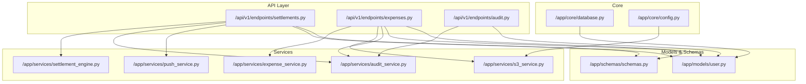
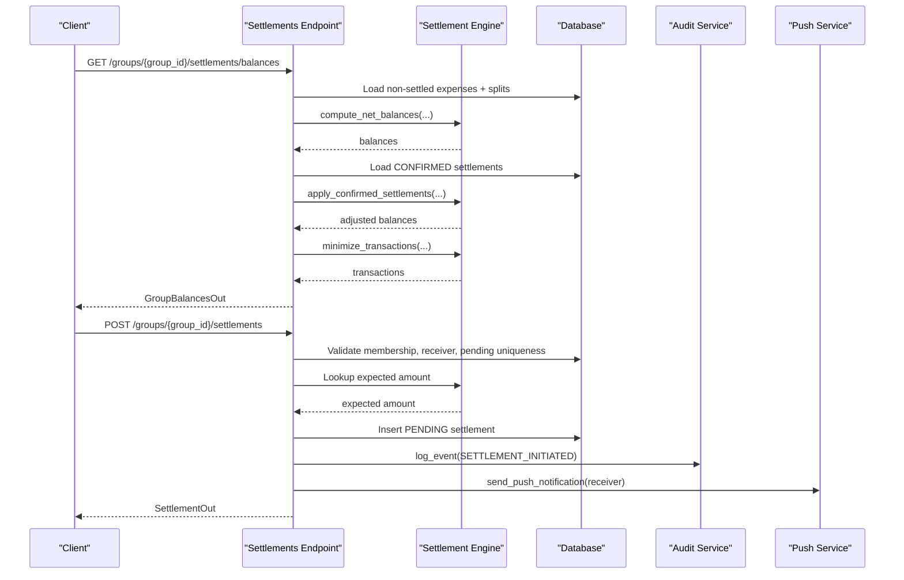
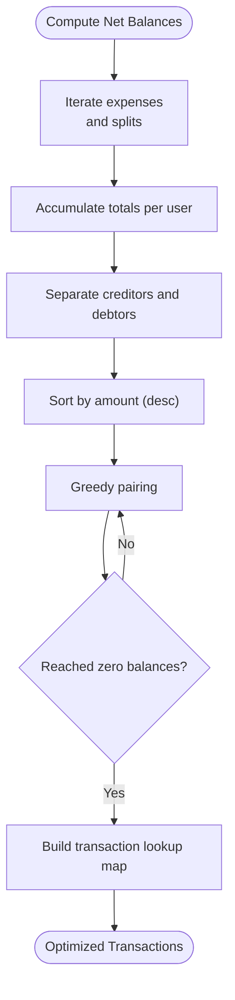
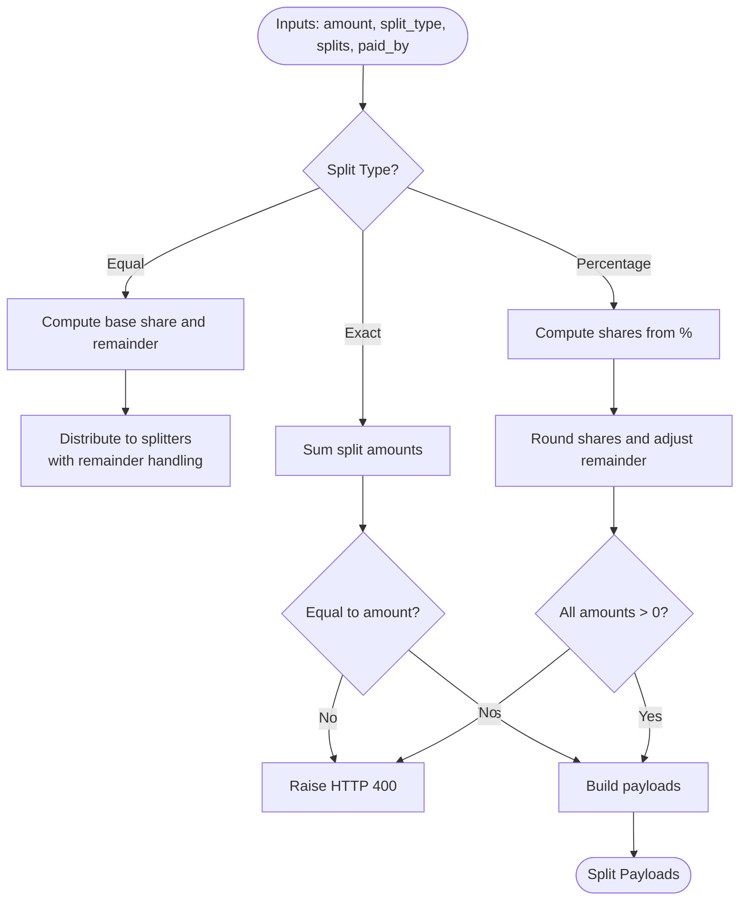
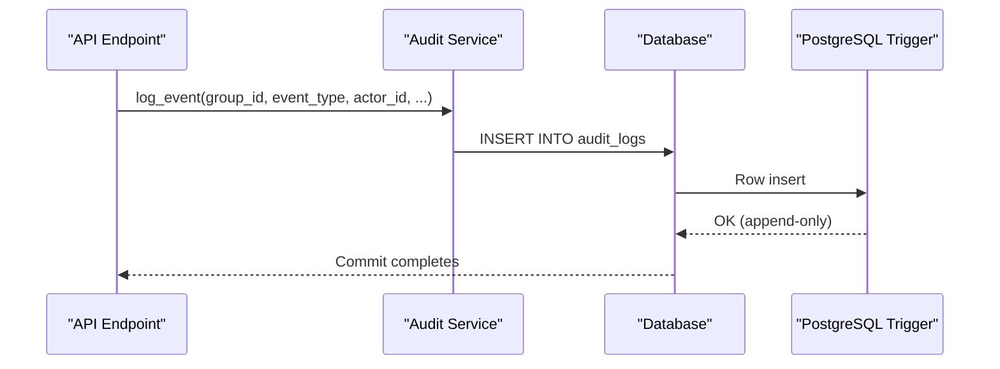
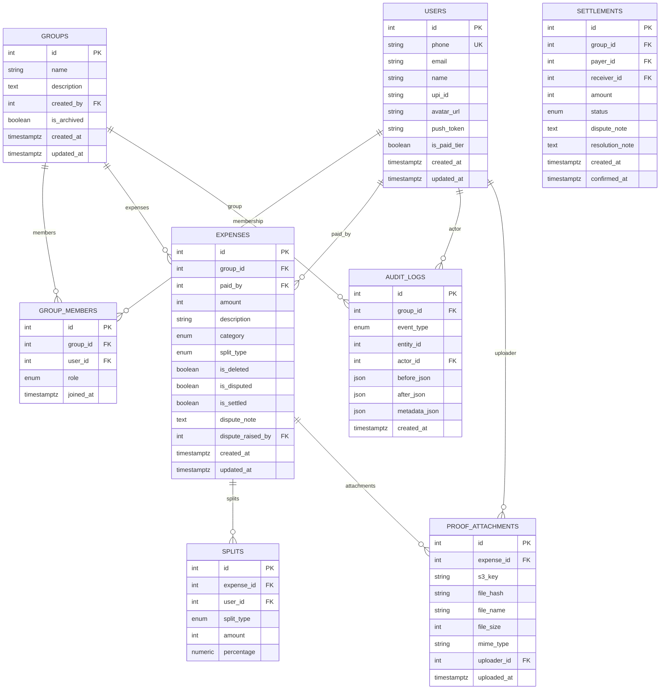
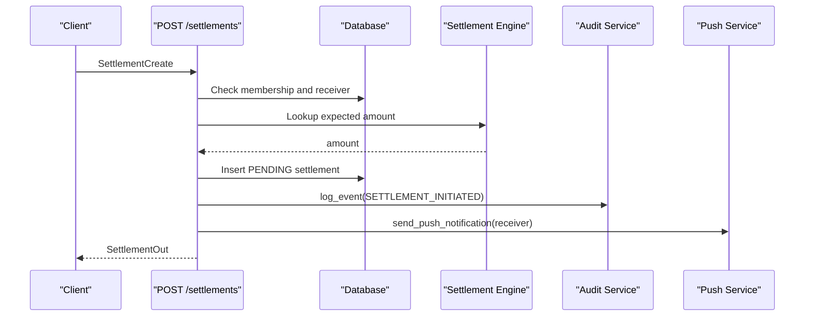
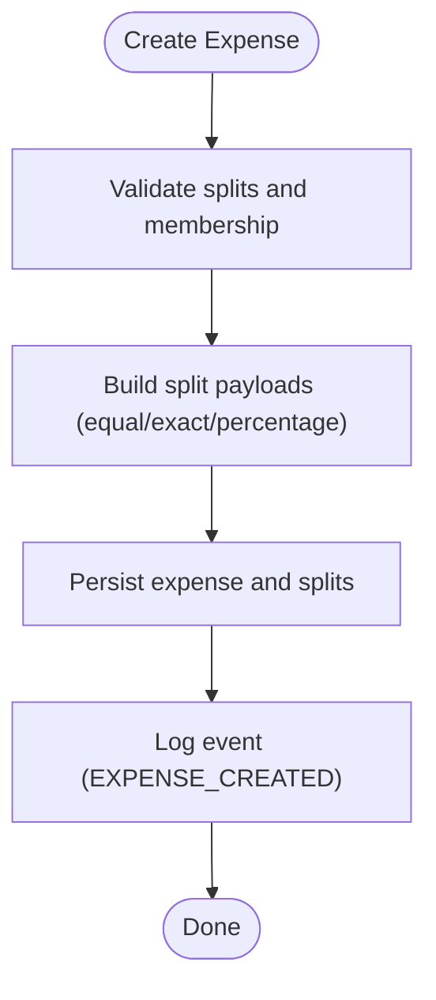

# Business Logic Implementation

<cite>
**Referenced Files in This Document**
- [settlement_engine.py](file://backend/app/services/settlement_engine.py)
- [settlements.py](file://backend/app/api/v1/endpoints/settlements.py)
- [expenses.py](file://backend/app/api/v1/endpoints/expenses.py)
- [audit_service.py](file://backend/app/services/audit_service.py)
- [audit.py](file://backend/app/api/v1/endpoints/audit.py)
- [push_service.py](file://backend/app/services/push_service.py)
- [s3_service.py](file://backend/app/services/s3_service.py)
- [user.py](file://backend/app/models/user.py)
- [schemas.py](file://backend/app/schemas/schemas.py)
- [database.py](file://backend/app/core/database.py)
- [config.py](file://backend/app/core/config.py)
- [001_initial.py](file://backend/alembic/versions/001_initial.py)
- [002_add_push_token.py](file://backend/alembic/versions/002_add_push_token.py)
- [test_settlement_engine.py](file://backend/tests/test_settlement_engine.py)
</cite>

## Table of Contents
1. [Introduction](#introduction)
2. [Project Structure](#project-structure)
3. [Core Components](#core-components)
4. [Architecture Overview](#architecture-overview)
5. [Detailed Component Analysis](#detailed-component-analysis)
6. [Dependency Analysis](#dependency-analysis)
7. [Performance Considerations](#performance-considerations)
8. [Troubleshooting Guide](#troubleshooting-guide)
9. [Conclusion](#conclusion)
10. [Appendices](#appendices)

## Introduction
This document explains the SplitSure business logic implementation with a focus on:
- Settlement optimization algorithm (greedy minimization of transactions)
- Split calculation engine (equal, exact, percentage)
- Audit trail system (event capture, immutability, compliance)
- Service layer (expenses, push notifications, S3/cloud storage)
- Performance, error handling, and business rule enforcement
- Algorithmic complexity, memory management, and scalability considerations

## Project Structure
The backend is organized around FastAPI endpoints, SQLAlchemy ORM models, Pydantic schemas, and modular services. The settlement engine resides in a dedicated service module, while endpoints orchestrate business workflows and delegate to services.

**Diagram sources**
- [settlements.py:1-501](file://backend/app/api/v1/endpoints/settlements.py#L1-L501)
- [expenses.py:1-395](file://backend/app/api/v1/endpoints/expenses.py#L1-L395)
- [audit.py:1-40](file://backend/app/api/v1/endpoints/audit.py#L1-L40)
- [settlement_engine.py:1-106](file://backend/app/services/settlement_engine.py#L1-L106)
- [user.py:1-234](file://backend/app/models/user.py#L1-L234)
- [schemas.py:1-412](file://backend/app/schemas/schemas.py#L1-L412)
- [database.py:1-29](file://backend/app/core/database.py#L1-L29)
- [config.py:1-71](file://backend/app/core/config.py#L1-L71)

**Section sources**
- [settlements.py:1-501](file://backend/app/api/v1/endpoints/settlements.py#L1-L501)
- [expenses.py:1-395](file://backend/app/api/v1/endpoints/expenses.py#L1-L395)
- [audit.py:1-40](file://backend/app/api/v1/endpoints/audit.py#L1-L40)
- [settlement_engine.py:1-106](file://backend/app/services/settlement_engine.py#L1-L106)
- [user.py:1-234](file://backend/app/models/user.py#L1-L234)
- [schemas.py:1-412](file://backend/app/schemas/schemas.py#L1-L412)
- [database.py:1-29](file://backend/app/core/database.py#L1-L29)
- [config.py:1-71](file://backend/app/core/config.py#L1-L71)

## Core Components
- Settlement Engine: Greedy balance optimization, net balance computation, transaction lookup, UPI deep link builder.
- Expense Service: Split validation and payload construction for equal, exact, and percentage splits.
- Audit Service: Immutable audit log creation with database-trigger enforced immutability.
- Push Service: Non-blocking Expo push notifications.
- S3 Service: Local filesystem and AWS S3 abstraction with upload, presigned URL generation, and soft deletion.

**Section sources**
- [settlement_engine.py:1-106](file://backend/app/services/settlement_engine.py#L1-L106)
- [expenses.py:1-395](file://backend/app/api/v1/endpoints/expenses.py#L1-L395)
- [audit_service.py:1-32](file://backend/app/services/audit_service.py#L1-L32)
- [push_service.py:1-43](file://backend/app/services/push_service.py#L1-L43)
- [s3_service.py:1-158](file://backend/app/services/s3_service.py#L1-L158)

## Architecture Overview
The system follows a layered architecture:
- API endpoints validate inputs, enforce membership and roles, and coordinate workflows.
- Services encapsulate domain logic (split calculation, settlement optimization, audit, notifications, storage).
- Models define the persistent entities; schemas define request/response contracts.
- Database and configuration modules provide infrastructure and environment-specific behavior.

**Diagram sources**
- [settlements.py:129-309](file://backend/app/api/v1/endpoints/settlements.py#L129-L309)
- [settlement_engine.py:23-97](file://backend/app/services/settlement_engine.py#L23-L97)
- [audit_service.py:6-31](file://backend/app/services/audit_service.py#L6-L31)
- [push_service.py:14-43](file://backend/app/services/push_service.py#L14-L43)

## Detailed Component Analysis

### Settlement Optimization Algorithm
The settlement engine computes net balances from grouped expenses and splits, then minimizes transactions using a greedy approach. Amounts are represented in paise (integer arithmetic) to avoid floating-point errors.

- Net balance computation: O(E + S) where E is expenses and S is splits.
- Greedy minimization: O(n log n) due to sorting creditors and debtors; iteration is O(n).
- Transaction lookup: O(T) to build a payer→receiver→amount map.
- UPI deep link builder: O(1) string composition.

Edge cases handled:
- Empty or partial participation in a settlement.
- Exact vs. approximate amounts due to rounding (via integer arithmetic).
- Confirmed settlements subtracted from balances before minimization.

**Diagram sources**
- [settlement_engine.py:23-97](file://backend/app/services/settlement_engine.py#L23-L97)

**Section sources**
- [settlement_engine.py:23-97](file://backend/app/services/settlement_engine.py#L23-L97)
- [settlements.py:52-81](file://backend/app/api/v1/endpoints/settlements.py#L52-L81)
- [test_settlement_engine.py:1-35](file://backend/tests/test_settlement_engine.py#L1-L35)

### Split Calculation Engine
The expense service validates and constructs split payloads according to split type:
- Equal split: Distributes amount among splitters with minimal remainder allocation to ensure integer totals.
- Exact split: Validates that split amounts sum to the expense amount.
- Percentage split: Computes shares from percentages, rounds to maintain integer totals, and ensures positivity.

Validation logic:
- Ensures at least one unique split user.
- Enforces that all split users are group members.
- Prevents negative or zero amounts in percentage splits.

**Diagram sources**
- [expenses.py:108-141](file://backend/app/api/v1/endpoints/expenses.py#L108-L141)
- [expense_service.py:7-79](file://backend/app/services/expense_service.py#L7-L79)
- [schemas.py:203-236](file://backend/app/schemas/schemas.py#L203-L236)

**Section sources**
- [expense_service.py:7-79](file://backend/app/services/expense_service.py#L7-L79)
- [expenses.py:108-141](file://backend/app/api/v1/endpoints/expenses.py#L108-L141)
- [schemas.py:203-236](file://backend/app/schemas/schemas.py#L203-L236)

### Audit Trail System
The audit service writes immutable logs to the database. A PostgreSQL trigger enforces append-only semantics, preventing updates and deletions to the audit_logs table. Events are logged for major lifecycle actions (expense create/edit/delete, settlement lifecycle, dispute resolution).

**Diagram sources**
- [audit_service.py:6-31](file://backend/app/services/audit_service.py#L6-L31)
- [001_initial.py:156-169](file://backend/alembic/versions/001_initial.py#L156-L169)

**Section sources**
- [audit_service.py:6-31](file://backend/app/services/audit_service.py#L6-L31)
- [audit.py:13-39](file://backend/app/api/v1/endpoints/audit.py#L13-L39)
- [001_initial.py:156-169](file://backend/alembic/versions/001_initial.py#L156-L169)

### Service Layer Implementations

#### Expense Service (CRUD + Validation)
- Validates split users and membership.
- Rebuilds splits on updates, enforcing split-type-specific rules.
- Prevents edits/deletes of settled/disputed expenses.

**Section sources**
- [expenses.py:23-291](file://backend/app/api/v1/endpoints/expenses.py#L23-L291)
- [user.py:124-147](file://backend/app/models/user.py#L124-L147)

#### Push Notification Service (Expo)
- Non-blocking, fire-and-forget with suppressed exceptions.
- Validates push tokens and sends structured payloads with timeouts.

**Section sources**
- [push_service.py:14-43](file://backend/app/services/push_service.py#L14-L43)
- [002_add_push_token.py:17-18](file://backend/alembic/versions/002_add_push_token.py#L17-L18)

#### S3 Service (Cloud Storage Abstraction)
- Supports local filesystem in dev and AWS S3 in prod.
- Validates MIME types via file signatures, enforces size limits, and computes hashes.
- Generates presigned URLs for secure access; soft-deletes locally, retains S3 files per audit policy.

**Section sources**
- [s3_service.py:1-158](file://backend/app/services/s3_service.py#L1-L158)
- [config.py:16-28](file://backend/app/core/config.py#L16-L28)

## Dependency Analysis
- Endpoints depend on services for business logic and on models/schemas for persistence and validation.
- Services depend on models for ORM mapping and on configuration for runtime behavior.
- Database and Alembic migrations define schema and immutability constraints.

```mermaid
graph LR
SE["settlement_engine.py"] --> M["models/user.py"]
SE --> SC["schemas/schemas.py"]
S["endpoints/settlements.py"] --> SE
S --> AS["services/audit_service.py"]
S --> PS["services/push_service.py"]
E["endpoints/expenses.py"] --> ES["services/expense_service.py"]
E --> SS["services/s3_service.py"]
E --> AS
A["endpoints/audit.py"] --> AS
DB["core/database.py"] --> M
CFG["core/config.py"] --> SS
```

**Diagram sources**
- [settlement_engine.py:1-106](file://backend/app/services/settlement_engine.py#L1-L106)
- [settlements.py:1-501](file://backend/app/api/v1/endpoints/settlements.py#L1-L501)
- [expenses.py:1-395](file://backend/app/api/v1/endpoints/expenses.py#L1-L395)
- [audit.py:1-40](file://backend/app/api/v1/endpoints/audit.py#L1-L40)
- [user.py:1-234](file://backend/app/models/user.py#L1-L234)
- [schemas.py:1-412](file://backend/app/schemas/schemas.py#L1-L412)
- [database.py:1-29](file://backend/app/core/database.py#L1-L29)
- [config.py:1-71](file://backend/app/core/config.py#L1-L71)

**Section sources**
- [settlement_engine.py:1-106](file://backend/app/services/settlement_engine.py#L1-L106)
- [settlements.py:1-501](file://backend/app/api/v1/endpoints/settlements.py#L1-L501)
- [expenses.py:1-395](file://backend/app/api/v1/endpoints/expenses.py#L1-L395)
- [audit.py:1-40](file://backend/app/api/v1/endpoints/audit.py#L1-L40)
- [user.py:1-234](file://backend/app/models/user.py#L1-L234)
- [schemas.py:1-412](file://backend/app/schemas/schemas.py#L1-L412)
- [database.py:1-29](file://backend/app/core/database.py#L1-L29)
- [config.py:1-71](file://backend/app/core/config.py#L1-L71)

## Performance Considerations
- Integer arithmetic (paise) avoids floating-point drift and simplifies comparisons.
- Greedy minimization sorts lists of unique users; typical group sizes keep overhead acceptable.
- SQLAlchemy selectinload reduces N+1 queries for related entities.
- Asynchronous database sessions improve concurrency.
- S3 presigned URLs reduce CDN latency and offload bandwidth.
- Local storage mode avoids network overhead during development.

[No sources needed since this section provides general guidance]

## Troubleshooting Guide
Common issues and resolutions:
- Settlement amount mismatch: Ensure the requested amount equals the expected outstanding balance derived from minimized transactions.
- Pending settlement conflicts: Only one pending settlement exists per payer-receiver pair.
- Membership checks: All endpoints verify group membership before processing.
- Disputes and admin-only actions: Dispute resolution requires admin role.
- Audit immutability: Attempting to modify or delete audit logs raises an exception enforced by a database trigger.
- Push notifications: Silent failures are logged; verify push tokens and network connectivity.
- S3 uploads: MIME signature mismatches and size limits cause validation errors; ensure correct content type and file size.

**Section sources**
- [settlements.py:244-308](file://backend/app/api/v1/endpoints/settlements.py#L244-L308)
- [audit.py:21-29](file://backend/app/api/v1/endpoints/audit.py#L21-L29)
- [001_initial.py:156-169](file://backend/alembic/versions/001_initial.py#L156-L169)
- [push_service.py:41-43](file://backend/app/services/push_service.py#L41-L43)
- [s3_service.py:114-124](file://backend/app/services/s3_service.py#L114-L124)

## Conclusion
SplitSure’s business logic is modular and robust:
- The settlement engine optimizes transactions efficiently using integer arithmetic and a greedy algorithm.
- The split calculation engine enforces strict validation for equal, exact, and percentage distributions.
- The audit trail system ensures compliance via database-trigger enforced immutability.
- The service layer cleanly separates concerns for expenses, notifications, and storage, with strong error handling and performance-conscious design.

[No sources needed since this section summarizes without analyzing specific files]

## Appendices

### Data Model Overview

**Diagram sources**
- [user.py:51-234](file://backend/app/models/user.py#L51-L234)
- [001_initial.py:17-154](file://backend/alembic/versions/001_initial.py#L17-L154)

### Example Workflows

#### Settlement Initiation

**Diagram sources**
- [settlements.py:238-308](file://backend/app/api/v1/endpoints/settlements.py#L238-L308)
- [settlement_engine.py:93-97](file://backend/app/services/settlement_engine.py#L93-L97)
- [audit_service.py:6-31](file://backend/app/services/audit_service.py#L6-L31)
- [push_service.py:14-43](file://backend/app/services/push_service.py#L14-L43)

#### Expense Creation with Split Types

**Diagram sources**
- [expenses.py:143-179](file://backend/app/api/v1/endpoints/expenses.py#L143-L179)
- [expense_service.py:19-79](file://backend/app/services/expense_service.py#L19-L79)
- [audit_service.py:6-31](file://backend/app/services/audit_service.py#L6-L31)