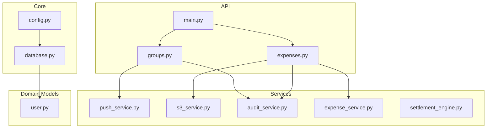
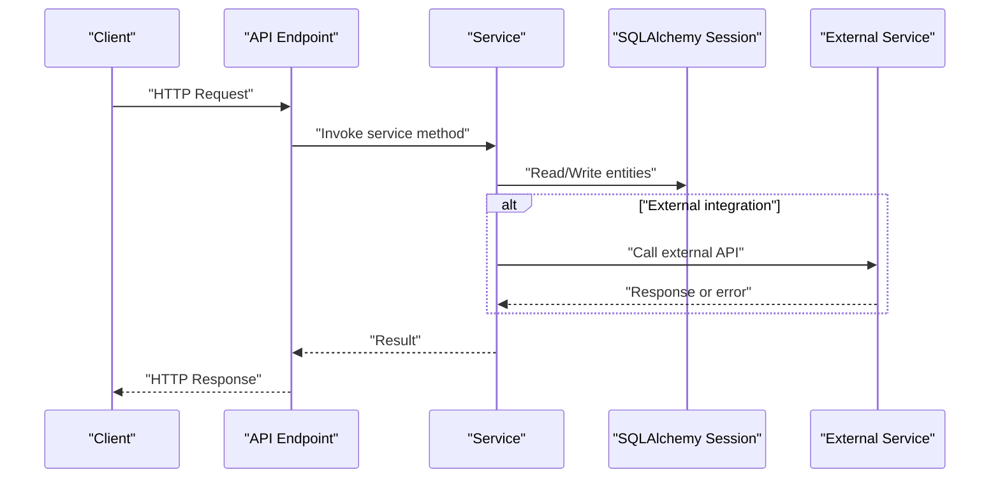
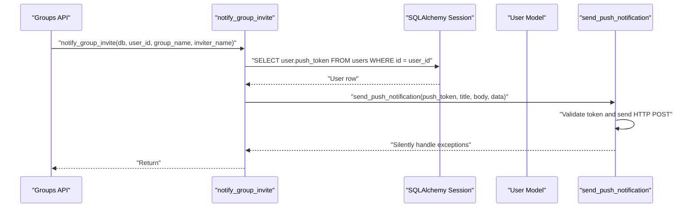
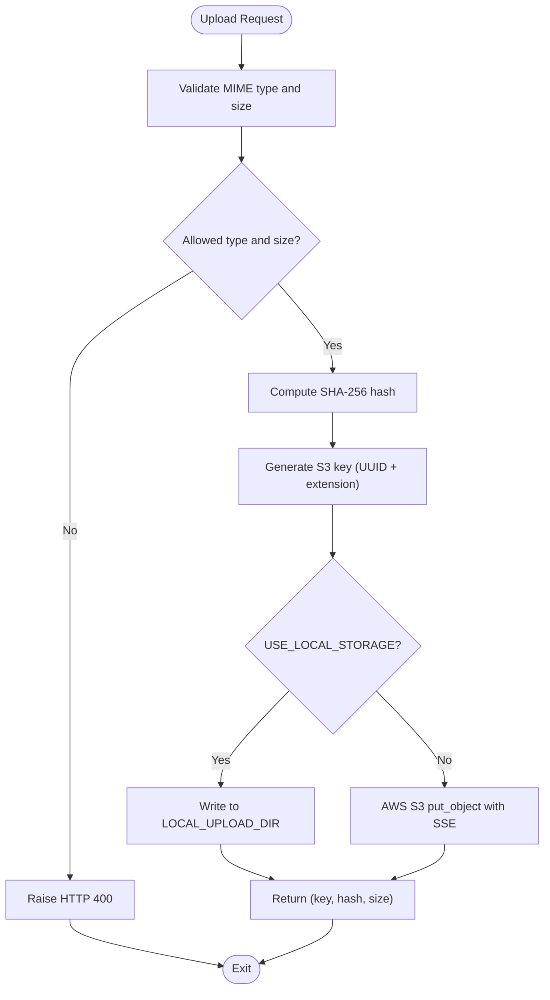
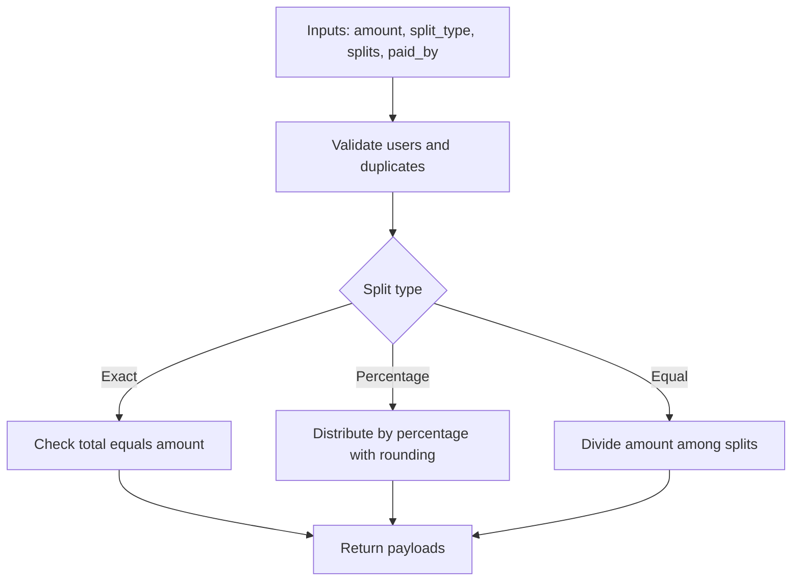
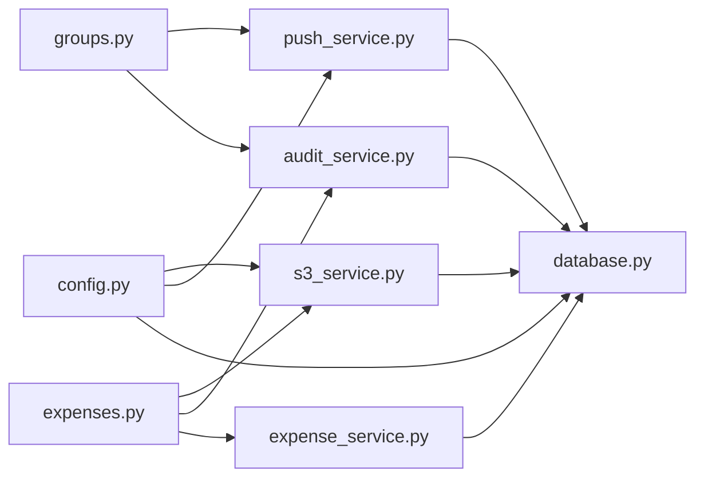

# Service Layer Architecture and Implementations

<cite>
**Referenced Files in This Document**
- [push_service.py](file://backend/app/services/push_service.py)
- [s3_service.py](file://backend/app/services/s3_service.py)
- [audit_service.py](file://backend/app/services/audit_service.py)
- [expense_service.py](file://backend/app/services/expense_service.py)
- [settlement_engine.py](file://backend/app/services/settlement_engine.py)
- [config.py](file://backend/app/core/config.py)
- [database.py](file://backend/app/core/database.py)
- [user.py](file://backend/app/models/user.py)
- [main.py](file://backend/app/main.py)
- [expenses.py](file://backend/app/api/v1/endpoints/expenses.py)
- [groups.py](file://backend/app/api/v1/endpoints/groups.py)
- [pytest.ini](file://backend/pytest.ini)
</cite>

## Table of Contents
1. [Introduction](#introduction)
2. [Project Structure](#project-structure)
3. [Core Components](#core-components)
4. [Architecture Overview](#architecture-overview)
5. [Detailed Component Analysis](#detailed-component-analysis)
6. [Dependency Analysis](#dependency-analysis)
7. [Performance Considerations](#performance-considerations)
8. [Troubleshooting Guide](#troubleshooting-guide)
9. [Conclusion](#conclusion)
10. [Appendices](#appendices)

## Introduction
This document explains the service layer architecture and implementations in the backend. It focuses on:
- Push notification service for Expo integration, including device token management, notification scheduling, and delivery confirmation behavior
- S3 service for cloud storage abstraction, including AWS SDK configuration, presigned URL generation, multipart uploads, and error handling
- Service layer patterns such as dependency injection, error propagation, and transaction management
- Service composition, inter-service communication, and asynchronous processing patterns
- Configuration management for external services, environment-specific settings, and fallback mechanisms
- Testing strategies for service layer components, including mocking external dependencies and integration testing approaches
- Performance monitoring, circuit breaker patterns, and resilience strategies
- Concrete examples of service initialization, method invocation, and error handling patterns from the actual codebase

## Project Structure
The backend is organized around a clean separation of concerns:
- Core configuration and database utilities live under app/core
- Domain services live under app/services
- API endpoints orchestrate services and persistence under app/api/v1/endpoints
- Models define domain entities and relationships under app/models
- Application bootstrap and middleware under app/main.py

**Diagram sources**
- [config.py:1-71](file://backend/app/core/config.py#L1-L71)
- [database.py:1-29](file://backend/app/core/database.py#L1-L29)
- [push_service.py:1-73](file://backend/app/services/push_service.py#L1-L73)
- [s3_service.py:1-158](file://backend/app/services/s3_service.py#L1-L158)
- [audit_service.py:1-32](file://backend/app/services/audit_service.py#L1-L32)
- [expense_service.py:1-79](file://backend/app/services/expense_service.py#L1-L79)
- [settlement_engine.py:1-106](file://backend/app/services/settlement_engine.py#L1-L106)
- [user.py:1-234](file://backend/app/models/user.py#L1-L234)
- [main.py:1-96](file://backend/app/main.py#L1-L96)
- [expenses.py:1-395](file://backend/app/api/v1/endpoints/expenses.py#L1-L395)
- [groups.py:1-350](file://backend/app/api/v1/endpoints/groups.py#L1-L350)

**Section sources**
- [main.py:1-96](file://backend/app/main.py#L1-L96)
- [config.py:1-71](file://backend/app/core/config.py#L1-L71)
- [database.py:1-29](file://backend/app/core/database.py#L1-L29)

## Core Components
- Push Notification Service: Non-blocking, fire-and-forget notifications via Expo with graceful error suppression
- S3 Storage Service: Unified abstraction over local filesystem and AWS S3 with presigned URL generation and strict validation
- Audit Service: Immutable audit logging with database-trigger enforcement
- Expense Service: Validation and payload construction for expense splits
- Settlement Engine: Greedy balance optimization and UPI deep link generation

**Section sources**
- [push_service.py:16-73](file://backend/app/services/push_service.py#L16-L73)
- [s3_service.py:105-158](file://backend/app/services/s3_service.py#L105-L158)
- [audit_service.py:6-32](file://backend/app/services/audit_service.py#L6-L32)
- [expense_service.py:7-79](file://backend/app/services/expense_service.py#L7-L79)
- [settlement_engine.py:10-106](file://backend/app/services/settlement_engine.py#L10-L106)

## Architecture Overview
The service layer follows a layered architecture:
- API endpoints depend on services for business logic
- Services depend on models and repositories (SQLAlchemy async sessions)
- Configuration and database utilities are injected via module-level singletons
- External integrations (Expo, AWS S3) are encapsulated behind service interfaces

[No sources needed since this diagram shows conceptual workflow, not actual code structure]

## Detailed Component Analysis

### Push Notification Service (Expo)
Responsibilities:
- Validate and sanitize push tokens
- Send push notifications via Expo API
- Fire-and-forget behavior with suppressed exceptions
- Compose notifications for group membership events

Key behaviors:
- Token validation checks token prefix and presence
- Uses an async HTTP client with a short timeout
- Exceptions are logged and suppressed to avoid blocking the main flow
- Notification composition for group invites retrieves user tokens from the database

**Diagram sources**
- [groups.py:197-200](file://backend/app/api/v1/endpoints/groups.py#L197-L200)
- [push_service.py:47-73](file://backend/app/services/push_service.py#L47-L73)
- [user.py:51-63](file://backend/app/models/user.py#L51-L63)

Implementation highlights:
- Token validation prevents malformed or missing tokens from being sent
- Asynchronous HTTP client ensures non-blocking behavior
- Logging captures failures without propagating them to clients

Operational notes:
- Delivery confirmation is not implemented; notifications are fire-and-forget
- No retry/backoff logic is present; failures are suppressed

**Section sources**
- [push_service.py:16-73](file://backend/app/services/push_service.py#L16-L73)
- [groups.py:197-200](file://backend/app/api/v1/endpoints/groups.py#L197-L200)
- [user.py:51-63](file://backend/app/models/user.py#L51-L63)

### S3 Storage Service (Cloud Storage Abstraction)
Responsibilities:
- Unified storage interface supporting local filesystem and AWS S3
- File type validation via magic bytes
- Presigned URL generation for secure, time-limited downloads
- Audit-friendly hard-delete policy (soft-delete by default)

Configuration:
- Switch via USE_LOCAL_STORAGE flag
- Local mode: writes to LOCAL_UPLOAD_DIR and serves via mounted static route
- Production mode: AWS S3 with AES256 encryption and presigned URLs

**Diagram sources**
- [s3_service.py:105-136](file://backend/app/services/s3_service.py#L105-L136)

Key behaviors:
- Strict MIME validation using file signatures
- Centralized configuration via settings
- Presigned URL generation for S3 mode with expiry
- Local static file serving when enabled

Operational notes:
- Hard delete is intentionally omitted for S3 to preserve audit trails
- Local mode serves files via a static route mounted at runtime

**Section sources**
- [s3_service.py:105-158](file://backend/app/services/s3_service.py#L105-L158)
- [main.py:48-56](file://backend/app/main.py#L48-L56)
- [config.py:16-29](file://backend/app/core/config.py#L16-L29)

### Audit Service
Responsibilities:
- Append-only audit logging with immutable records enforced by a PostgreSQL trigger
- Structured logging of events with before/after snapshots and metadata

Behavior:
- Adds a new audit log entry and flushes immediately
- Enforces immutability at the database level

**Section sources**
- [audit_service.py:6-32](file://backend/app/services/audit_service.py#L6-L32)
- [main.py:68-86](file://backend/app/main.py#L68-L86)

### Expense Service
Responsibilities:
- Validate split recipients against group membership
- Construct split payloads for different split types (exact, percentage, equal)
- Enforce amount consistency for exact splits and positivity for percentage splits

**Diagram sources**
- [expense_service.py:7-79](file://backend/app/services/expense_service.py#L7-L79)

**Section sources**
- [expense_service.py:7-79](file://backend/app/services/expense_service.py#L7-L79)

### Settlement Engine
Responsibilities:
- Compute net balances from expenses
- Minimize transactions using a greedy algorithm
- Build UPI deep links for settlement payments

Complexity:
- Net balance computation: O(N) over expenses
- Transaction minimization: O(n log n) due to sorting

**Section sources**
- [settlement_engine.py:23-97](file://backend/app/services/settlement_engine.py#L23-L97)

## Dependency Analysis
Service-layer dependencies and coupling:
- API endpoints depend on services for business logic
- Services depend on SQLAlchemy async sessions for persistence
- Services depend on configuration for external integrations
- External libraries are encapsulated (httpx for Expo, boto3 for S3)

**Diagram sources**
- [groups.py:16-20](file://backend/app/api/v1/endpoints/groups.py#L16-L20)
- [expenses.py:16-19](file://backend/app/api/v1/endpoints/expenses.py#L16-L19)
- [push_service.py:8-11](file://backend/app/services/push_service.py#L8-L11)
- [s3_service.py:18](file://backend/app/services/s3_service.py#L18)
- [config.py:1-71](file://backend/app/core/config.py#L1-L71)
- [database.py:1-29](file://backend/app/core/database.py#L1-L29)

**Section sources**
- [expenses.py:16-19](file://backend/app/api/v1/endpoints/expenses.py#L16-L19)
- [groups.py:16-20](file://backend/app/api/v1/endpoints/groups.py#L16-L20)

## Performance Considerations
- Asynchronous I/O: Services use async HTTP clients and SQLAlchemy sessions to avoid blocking
- Short timeouts: Expo client uses a short timeout to prevent slow external calls from impacting latency
- Minimal external calls: Push notifications are fire-and-forget; S3 operations are synchronous but lightweight
- Greedy optimization: Settlement engine minimizes transaction count with O(n log n) complexity
- Static file serving: Local storage mode serves files directly via static routes

[No sources needed since this section provides general guidance]

## Troubleshooting Guide
Common issues and resolutions:
- Push notifications not delivered:
  - Verify push_token format and presence in user records
  - Check logs for suppressed exceptions
  - Confirm Expo API availability and network connectivity
- S3 upload failures:
  - Validate AWS credentials and bucket permissions
  - Inspect HTTP 500 responses with error messages
  - Ensure USE_LOCAL_STORAGE is configured appropriately
- Audit log mutations:
  - Expect immutable records enforced by database triggers
  - Do not attempt to modify or delete audit logs
- Expense split validation:
  - Ensure split totals match for exact splits
  - Avoid duplicate users and non-member splits
  - Percentage splits must produce positive amounts after rounding

**Section sources**
- [push_service.py:26-44](file://backend/app/services/push_service.py#L26-L44)
- [s3_service.py:86-87](file://backend/app/services/s3_service.py#L86-L87)
- [audit_service.py:16-19](file://backend/app/services/audit_service.py#L16-L19)
- [expense_service.py:10-16](file://backend/app/services/expense_service.py#L10-L16)

## Conclusion
The service layer cleanly separates business logic from infrastructure concerns. It leverages configuration-driven abstractions for external services, maintains immutability for audit logs, and uses asynchronous patterns for responsiveness. While push notifications are fire-and-forget and S3 hard-deletes are not supported, the architecture supports future enhancements such as delivery confirmations, circuit breakers, and resilient retries.

[No sources needed since this section summarizes without analyzing specific files]

## Appendices

### Service Initialization and Method Invocation Examples
- Push notification invocation:
  - From API: [groups.py:197-200](file://backend/app/api/v1/endpoints/groups.py#L197-L200)
  - Service method: [push_service.py:47-73](file://backend/app/services/push_service.py#L47-L73)
- S3 upload invocation:
  - From API: [expenses.py:371](file://backend/app/api/v1/endpoints/expenses.py#L371)
  - Service method: [s3_service.py:105-136](file://backend/app/services/s3_service.py#L105-L136)
- Audit logging:
  - From API: [expenses.py:172-176](file://backend/app/api/v1/endpoints/expenses.py#L172-L176), [expenses.py:256-260](file://backend/app/api/v1/endpoints/expenses.py#L256-L260)
  - Service method: [audit_service.py:6-32](file://backend/app/services/audit_service.py#L6-L32)

**Section sources**
- [groups.py:197-200](file://backend/app/api/v1/endpoints/groups.py#L197-L200)
- [push_service.py:47-73](file://backend/app/services/push_service.py#L47-L73)
- [expenses.py:371](file://backend/app/api/v1/endpoints/expenses.py#L371)
- [s3_service.py:105-136](file://backend/app/services/s3_service.py#L105-L136)
- [audit_service.py:6-32](file://backend/app/services/audit_service.py#L6-L32)

### Configuration Management and Environment Settings
- Settings definition and validators: [config.py:6-71](file://backend/app/core/config.py#L6-L71)
- Database engine and session factory: [database.py:5-29](file://backend/app/core/database.py#L5-L29)
- Runtime storage mode and static file mount: [main.py:48-56](file://backend/app/main.py#L48-L56)

**Section sources**
- [config.py:6-71](file://backend/app/core/config.py#L6-L71)
- [database.py:5-29](file://backend/app/core/database.py#L5-L29)
- [main.py:48-56](file://backend/app/main.py#L48-L56)

### Testing Strategies
- Unit tests for services:
  - Expense service: [test_expense_service.py](file://backend/tests/test_expense_service.py)
  - Settlement engine: [test_settlement_engine.py](file://backend/tests/test_settlement_engine.py)
- Test runner configuration: [pytest.ini](file://backend/pytest.ini)
- Recommended approach:
  - Mock external dependencies (httpx for Expo, boto3 for S3) during unit tests
  - Use in-memory databases or isolated test databases for integration tests
  - Validate error propagation and boundary conditions (invalid tokens, unsupported MIME types)

**Section sources**
- [pytest.ini:1-50](file://backend/pytest.ini#L1-L50)

### Resilience and Monitoring
- Circuit breaker pattern: Not implemented; consider adding for external APIs (Expo, S3)
- Retry/backoff: Not implemented; consider exponential backoff with jitter for transient failures
- Health endpoint: [main.py:88-96](file://backend/app/main.py#L88-L96)
- Logging: Use structured logging for audit and error capture

**Section sources**
- [main.py:88-96](file://backend/app/main.py#L88-L96)