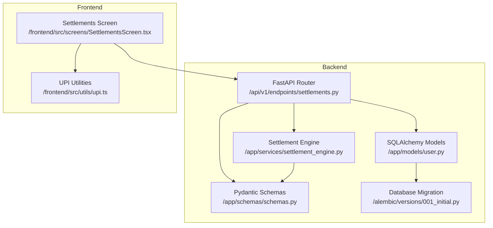
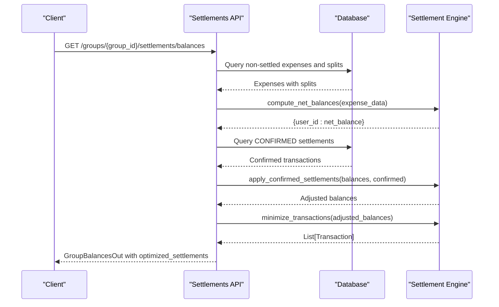
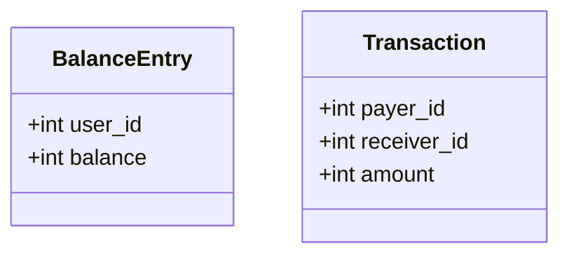
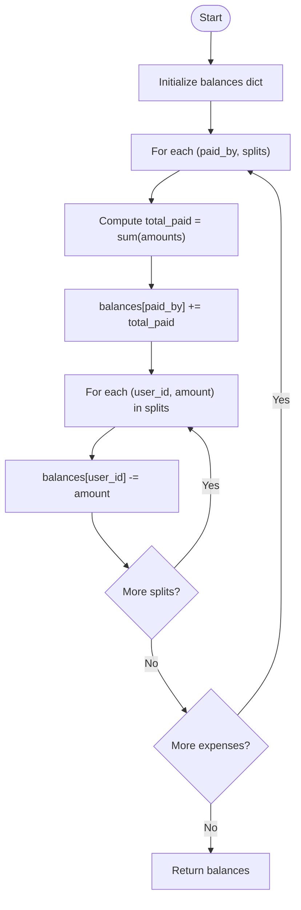
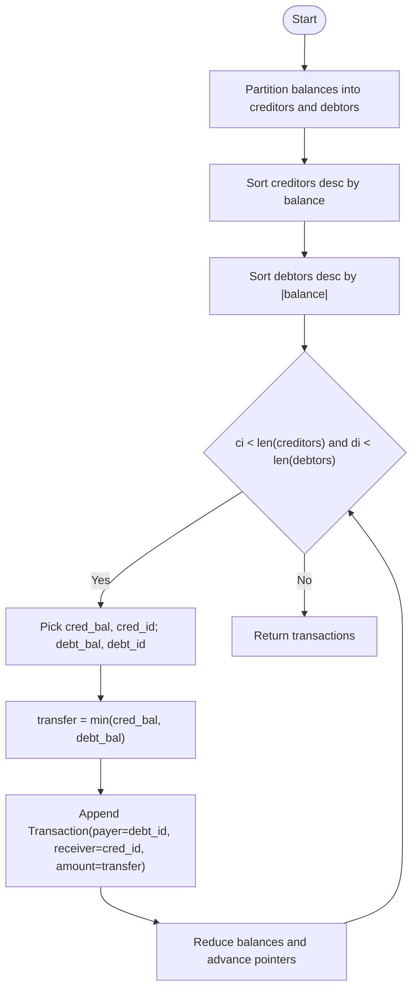
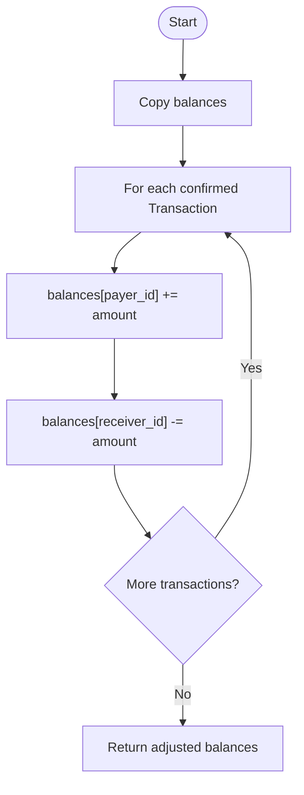
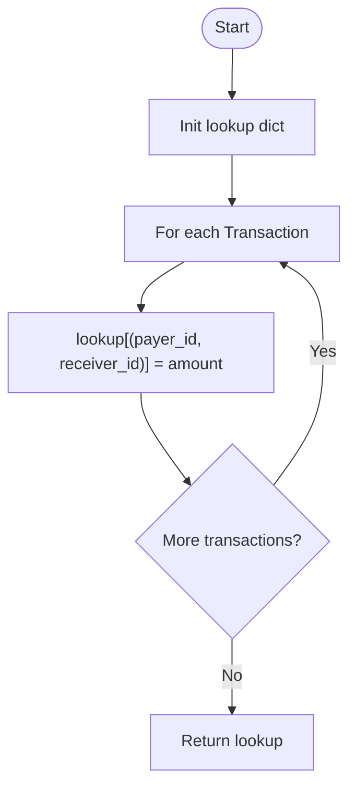
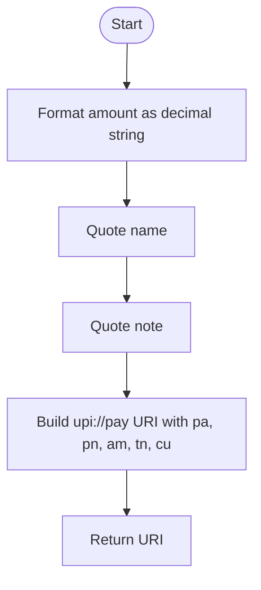
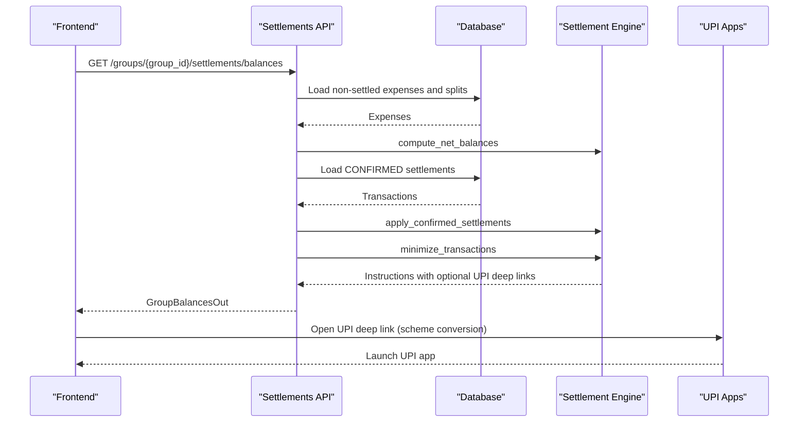
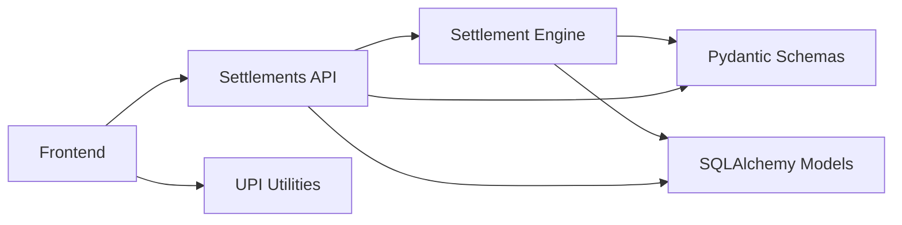

# Settlement Optimization Algorithm

<cite>
**Referenced Files in This Document**
- [settlement_engine.py](file://backend/app/services/settlement_engine.py)
- [settlements.py](file://backend/app/api/v1/endpoints/settlements.py)
- [schemas.py](file://backend/app/schemas/schemas.py)
- [user.py](file://backend/app/models/user.py)
- [001_initial.py](file://backend/alembic/versions/001_initial.py)
- [upi.ts](file://frontend/src/utils/upi.ts)
- [SettlementsScreen.tsx](file://frontend/src/screens/SettlementsScreen.tsx)
- [test_settlement_engine.py](file://backend/tests/test_settlement_engine.py)
</cite>

## Table of Contents
1. [Introduction](#introduction)
2. [Project Structure](#project-structure)
3. [Core Components](#core-components)
4. [Architecture Overview](#architecture-overview)
5. [Detailed Component Analysis](#detailed-component-analysis)
6. [Dependency Analysis](#dependency-analysis)
7. [Performance Considerations](#performance-considerations)
8. [Troubleshooting Guide](#troubleshooting-guide)
9. [Conclusion](#conclusion)
10. [Appendices](#appendices)

## Introduction
This document explains the SplitSure settlement optimization algorithm that minimizes the number of transactions among group members after shared expenses are recorded. It covers the greedy algorithm’s design, the mathematical foundations, and the proof of optimality. It documents the data models for balances and transactions, the pipeline for computing net balances, optimizing transactions, applying confirmed settlements, and generating UPI deep links for payment initiation. It also provides complexity analysis, performance considerations, edge case handling, and practical examples.

## Project Structure
The settlement optimization lives in the backend Python service layer and is exposed via FastAPI endpoints. The frontend renders settlement instructions and integrates UPI deep links.

**Diagram sources**
- [settlements.py:1-501](file://backend/app/api/v1/endpoints/settlements.py#L1-L501)
- [settlement_engine.py:1-106](file://backend/app/services/settlement_engine.py#L1-L106)
- [schemas.py:326-347](file://backend/app/schemas/schemas.py#L326-L347)
- [user.py:164-182](file://backend/app/models/user.py#L164-L182)
- [001_initial.py:98-111](file://backend/alembic/versions/001_initial.py#L98-L111)
- [SettlementsScreen.tsx:1-589](file://frontend/src/screens/SettlementsScreen.tsx#L1-L589)
- [upi.ts:1-13](file://frontend/src/utils/upi.ts#L1-L13)

**Section sources**
- [settlements.py:1-501](file://backend/app/api/v1/endpoints/settlements.py#L1-L501)
- [settlement_engine.py:1-106](file://backend/app/services/settlement_engine.py#L1-L106)
- [schemas.py:326-347](file://backend/app/schemas/schemas.py#L326-L347)
- [user.py:164-182](file://backend/app/models/user.py#L164-L182)
- [001_initial.py:98-111](file://backend/alembic/versions/001_initial.py#L98-L111)
- [SettlementsScreen.tsx:1-589](file://frontend/src/screens/SettlementsScreen.tsx#L1-L589)
- [upi.ts:1-13](file://frontend/src/utils/upi.ts#L1-L13)

## Core Components
- BalanceEntry: Represents a user’s net position (positive for creditor, negative for debtor).
- Transaction: Represents a payment from payer to receiver in paise.
- compute_net_balances: Aggregates all expenses to produce per-user net balances.
- minimize_transactions: Greedy algorithm to reduce transaction count.
- apply_confirmed_settlements: Adjusts balances after confirmed settlements.
- transaction_lookup: Builds a payer-receiver-to-amount mapping for quick lookups.
- build_upi_deep_link: Generates a UPI deep link for initiating payments.

**Section sources**
- [settlement_engine.py:10-21](file://backend/app/services/settlement_engine.py#L10-L21)
- [settlement_engine.py:23-37](file://backend/app/services/settlement_engine.py#L23-L37)
- [settlement_engine.py:40-79](file://backend/app/services/settlement_engine.py#L40-L79)
- [settlement_engine.py:82-90](file://backend/app/services/settlement_engine.py#L82-L90)
- [settlement_engine.py:93-97](file://backend/app/services/settlement_engine.py#L93-L97)
- [settlement_engine.py:100-106](file://backend/app/services/settlement_engine.py#L100-L106)

## Architecture Overview
The settlement pipeline:
- Load non-settled expenses and splits from the database.
- Compute net balances per user.
- Apply confirmed settlements to adjust outstanding balances.
- Minimize transactions greedily to reduce the number of transfers.
- Generate settlement instructions with optional UPI deep links.
- Expose endpoints to list balances, initiate, confirm, dispute, and resolve settlements.

**Diagram sources**
- [settlements.py:129-235](file://backend/app/api/v1/endpoints/settlements.py#L129-L235)
- [settlement_engine.py:23-37](file://backend/app/services/settlement_engine.py#L23-L37)
- [settlement_engine.py:82-90](file://backend/app/services/settlement_engine.py#L82-L90)
- [settlement_engine.py:40-79](file://backend/app/services/settlement_engine.py#L40-L79)

## Detailed Component Analysis

### Data Classes: BalanceEntry and Transaction
- BalanceEntry: Holds user_id and balance (in paise). Positive indicates the user is owed money; negative indicates the user owes money.
- Transaction: Holds payer_id, receiver_id, and amount (in paise).

**Diagram sources**
- [settlement_engine.py:10-21](file://backend/app/services/settlement_engine.py#L10-L21)

**Section sources**
- [settlement_engine.py:10-21](file://backend/app/services/settlement_engine.py#L10-L21)

### compute_net_balances
Purpose: Aggregate all expenses to compute each user’s net balance.
- Input: List of (paid_by, [(user_id, amount), ...]).
- Output: Dict[user_id, net_balance].
- Behavior: Adds total paid by the payer; subtracts each split amount for participants.

**Diagram sources**
- [settlement_engine.py:23-37](file://backend/app/services/settlement_engine.py#L23-L37)

**Section sources**
- [settlement_engine.py:23-37](file://backend/app/services/settlement_engine.py#L23-L37)
- [test_settlement_engine.py:10-19](file://backend/tests/test_settlement_engine.py#L10-L19)

### minimize_transactions
Purpose: Greedy algorithm to minimize transaction count.
- Input: Dict[user_id, net_balance].
- Output: List[Transaction].
- Algorithm:
  - Separate creditors (positive balances) and debtors (negative balances) into lists.
  - Sort both lists by absolute balance descending.
  - Iteratively transfer the minimum of current creditor and debtor balances, moving pointers when balances reach zero.
- Complexity: O(n log n) due to sorting; loop runs in O(n).

**Diagram sources**
- [settlement_engine.py:40-79](file://backend/app/services/settlement_engine.py#L40-L79)

**Section sources**
- [settlement_engine.py:40-79](file://backend/app/services/settlement_engine.py#L40-L79)
- [test_settlement_engine.py:30-35](file://backend/tests/test_settlement_engine.py#L30-L35)

### apply_confirmed_settlements
Purpose: Adjust balances after confirmed settlements have occurred.
- Input: Current balances and confirmed transactions.
- Output: New balances reflecting reductions in outstanding amounts.

**Diagram sources**
- [settlement_engine.py:82-90](file://backend/app/services/settlement_engine.py#L82-L90)

**Section sources**
- [settlement_engine.py:82-90](file://backend/app/services/settlement_engine.py#L82-L90)
- [test_settlement_engine.py:21-28](file://backend/tests/test_settlement_engine.py#L21-L28)

### transaction_lookup
Purpose: Build a mapping from (payer_id, receiver_id) to total amount for quick reconciliation and verification.

**Diagram sources**
- [settlement_engine.py:93-97](file://backend/app/services/settlement_engine.py#L93-L97)

**Section sources**
- [settlement_engine.py:93-97](file://backend/app/services/settlement_engine.py#L93-L97)
- [test_settlement_engine.py:30-35](file://backend/tests/test_settlement_engine.py#L30-L35)

### build_upi_deep_link
Purpose: Generate a UPI deep link for payment initiation.
- Input: UPI ID, name, amount (paise), note.
- Output: upi://pay URI with encoded parameters.

**Diagram sources**
- [settlement_engine.py:100-106](file://backend/app/services/settlement_engine.py#L100-L106)

**Section sources**
- [settlement_engine.py:100-106](file://backend/app/services/settlement_engine.py#L100-L106)

### API Integration and Frontend Flow
- Backend endpoint computes balances, applies confirmed settlements, minimizes transactions, and builds settlement instructions with optional UPI deep links.
- Frontend displays optimized settlement matrix, allows initiating settlements, confirming, disputing, and resolving, and opens UPI deep links via app schemes.

**Diagram sources**
- [settlements.py:129-235](file://backend/app/api/v1/endpoints/settlements.py#L129-L235)
- [SettlementsScreen.tsx:197-232](file://frontend/src/screens/SettlementsScreen.tsx#L197-L232)
- [upi.ts:7-12](file://frontend/src/utils/upi.ts#L7-L12)

**Section sources**
- [settlements.py:129-235](file://backend/app/api/v1/endpoints/settlements.py#L129-L235)
- [SettlementsScreen.tsx:197-232](file://frontend/src/screens/SettlementsScreen.tsx#L197-L232)
- [upi.ts:1-13](file://frontend/src/utils/upi.ts#L1-L13)

## Dependency Analysis
- Backend services depend on SQLAlchemy models for database entities and Pydantic schemas for request/response validation.
- The settlement engine depends on dataclasses for internal representation.
- Frontend depends on backend APIs and UPI utilities for payment initiation.

**Diagram sources**
- [settlement_engine.py:1-106](file://backend/app/services/settlement_engine.py#L1-L106)
- [schemas.py:326-347](file://backend/app/schemas/schemas.py#L326-L347)
- [user.py:164-182](file://backend/app/models/user.py#L164-L182)
- [settlements.py:1-501](file://backend/app/api/v1/endpoints/settlements.py#L1-L501)
- [upi.ts:1-13](file://frontend/src/utils/upi.ts#L1-L13)

**Section sources**
- [settlement_engine.py:1-106](file://backend/app/services/settlement_engine.py#L1-L106)
- [schemas.py:326-347](file://backend/app/schemas/schemas.py#L326-L347)
- [user.py:164-182](file://backend/app/models/user.py#L164-L182)
- [settlements.py:1-501](file://backend/app/api/v1/endpoints/settlements.py#L1-L501)
- [upi.ts:1-13](file://frontend/src/utils/upi.ts#L1-L13)

## Performance Considerations
- Time complexity:
  - compute_net_balances: O(E + U) where E is number of expenses and U is number of unique users participating in splits.
  - minimize_transactions: O(U log U) due to sorting; the while-loop processes at most U entries.
  - Overall: O(E + U log U).
- Space complexity:
  - Balances dictionary: O(U).
  - Creditors/debtors arrays: O(U).
  - Transactions list: O(U) in worst case.
- Memory management:
  - Uses integer arithmetic in paise to avoid floating-point errors and reduce precision overhead.
  - Copies balances before applying confirmed settlements to avoid mutating original state unintentionally.
- Scalability:
  - Sorting dominates runtime; for large groups, consider batch processing and caching of computed balances.
  - Database queries are optimized to load only non-settled and non-deleted records.

[No sources needed since this section provides general guidance]

## Troubleshooting Guide
- Amount mismatch during settlement initiation:
  - The backend validates that the requested amount equals the expected optimized amount for the payer-receiver pair.
- Pending settlement conflicts:
  - The backend prevents creating multiple pending settlements between the same pair.
- User membership checks:
  - Settlements require the current user to be a group member and the receiver to be a member.
- Dispute and resolution:
  - Only receivers can dispute; only admins can resolve disputes.
- UPI deep link availability:
  - UPI deep links are generated only if the receiver has a UPI ID configured.

**Section sources**
- [settlements.py:238-308](file://backend/app/api/v1/endpoints/settlements.py#L238-L308)
- [settlements.py:311-371](file://backend/app/api/v1/endpoints/settlements.py#L311-L371)
- [settlements.py:374-433](file://backend/app/api/v1/endpoints/settlements.py#L374-L433)
- [settlements.py:436-483](file://backend/app/api/v1/endpoints/settlements.py#L436-L483)

## Conclusion
The SplitSure settlement optimization algorithm uses a greedy approach to minimize transaction count by pairing largest creditors and debtors efficiently. It relies on integer arithmetic in paise for precise financial computations, robust database-backed state transitions, and UPI deep links for seamless payment initiation. The modular design separates concerns between data aggregation, optimization, persistence, and presentation, enabling maintainability and extensibility.

[No sources needed since this section summarizes without analyzing specific files]

## Appendices

### Mathematical Foundations and Proof of Optimality
- Foundation:
  - Each expense contributes to a net balance per user. The problem reduces to pairing positive and negative balances to zero them out with minimal transfers.
- Greedy choice property:
  - At each step, selecting the smallest absolute balance between the current creditor and debtor reduces the total number of future steps required.
- Optimal substructure:
  - After one transfer, the problem reduces to the same structure on the remaining balances.
- Proof outline:
  - By repeatedly transferring the minimum of current creditor and debtor balances, we ensure that either the creditor or debtor is fully cleared at each step. This guarantees that the number of non-zero balances decreases by at least one per iteration, minimizing total transfers. The sorting ensures we process the largest imbalances first, reducing the number of iterations.
- Complexity:
  - Sorting dominates at O(U log U); the while-loop is O(U). Total O(E + U log U).

[No sources needed since this section provides general guidance]

### Edge Cases and Handling
- No outstanding balances:
  - The minimized transaction list is empty; the API returns an empty optimized_settlements list.
- Self-settlement:
  - The backend rejects attempts to settle with oneself.
- Receiver not in group:
  - The backend rejects settlement requests where the receiver is not a group member.
- Pending settlement exists:
  - The backend rejects creating another pending settlement between the same pair.
- Disputes and resolutions:
  - Disputes can only be raised by receivers; resolutions require admin privileges.

**Section sources**
- [settlements.py:248-258](file://backend/app/api/v1/endpoints/settlements.py#L248-L258)
- [settlements.py:334-338](file://backend/app/api/v1/endpoints/settlements.py#L334-L338)
- [settlements.py:398-402](file://backend/app/api/v1/endpoints/settlements.py#L398-L402)
- [settlements.py:445-446](file://backend/app/api/v1/endpoints/settlements.py#L445-L446)

### Concrete Examples

- Example 1: Balance computation
  - Input: Two expenses with splits.
  - Expected: Net balances reflect total owed vs total paid per user.
  - Reference: [test_settlement_engine.py:10-19](file://backend/tests/test_settlement_engine.py#L10-L19)

- Example 2: Transaction optimization
  - Input: {user1: 1000, user2: -400, user3: -600}.
  - Expected: Two transactions: (user2 → user1, 400) and (user3 → user1, 600).
  - Reference: [test_settlement_engine.py:30-35](file://backend/tests/test_settlement_engine.py#L30-L35)

- Example 3: Applying confirmed settlements
  - Input: {user1: 1500, user2: -500, user3: -1000}, confirmed settlement (user3 → user1, 500).
  - Expected: {user1: 1000, user2: -500, user3: -500}.
  - Reference: [test_settlement_engine.py:21-28](file://backend/tests/test_settlement_engine.py#L21-L28)

- Example 4: UPI deep link generation
  - Input: UPI ID, name, amount in paise, note.
  - Output: upi://pay URI with encoded parameters.
  - Reference: [settlement_engine.py:100-106](file://backend/app/services/settlement_engine.py#L100-L106)

**Section sources**
- [test_settlement_engine.py:10-19](file://backend/tests/test_settlement_engine.py#L10-L19)
- [test_settlement_engine.py:21-28](file://backend/tests/test_settlement_engine.py#L21-L28)
- [test_settlement_engine.py:30-35](file://backend/tests/test_settlement_engine.py#L30-L35)
- [settlement_engine.py:100-106](file://backend/app/services/settlement_engine.py#L100-L106)

### Database Schema Notes
- Settlements table stores payer_id, receiver_id, amount (paise), and status.
- Users table includes upi_id for payment linkage.
- Expenses and splits define the basis for net balance computation.

**Section sources**
- [001_initial.py:98-111](file://backend/alembic/versions/001_initial.py#L98-L111)
- [user.py:51-63](file://backend/app/models/user.py#L51-L63)
- [user.py:164-182](file://backend/app/models/user.py#L164-L182)