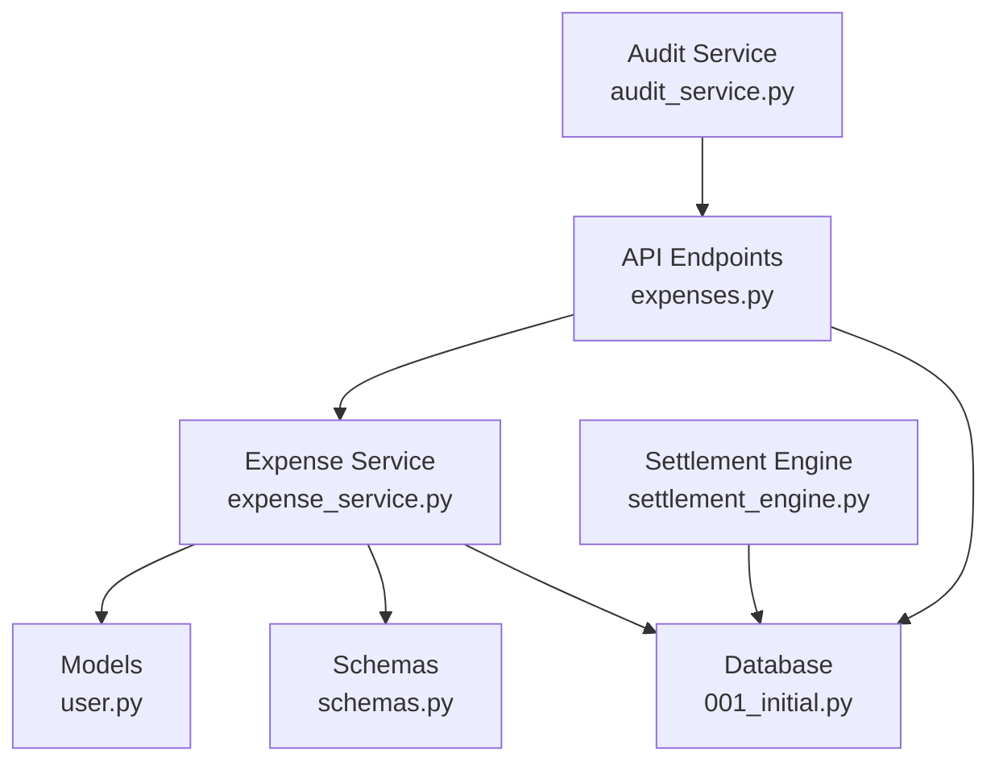
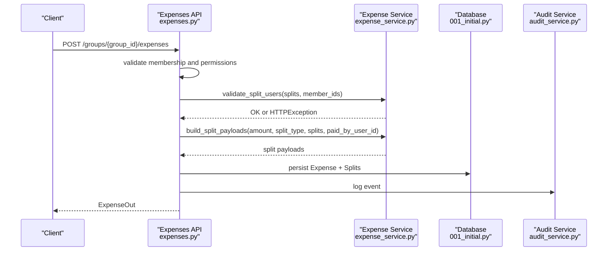
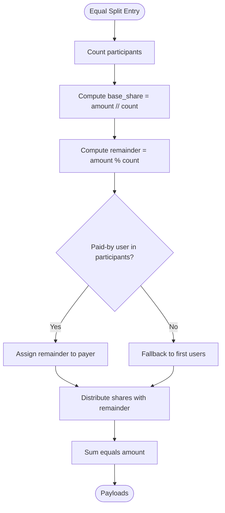
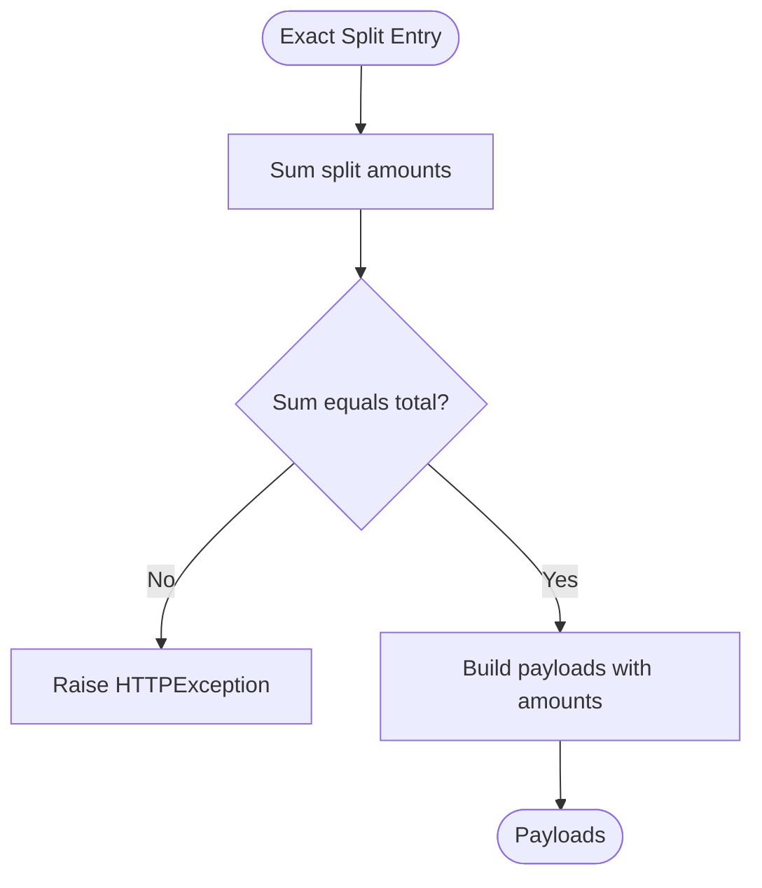
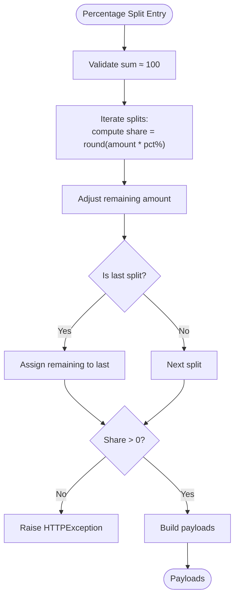
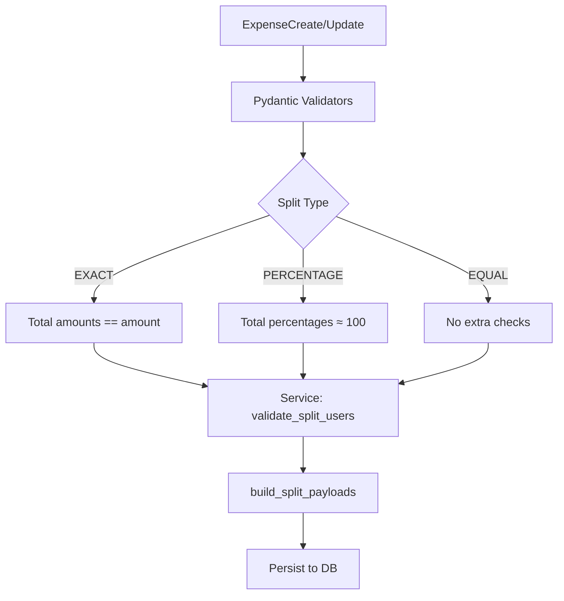
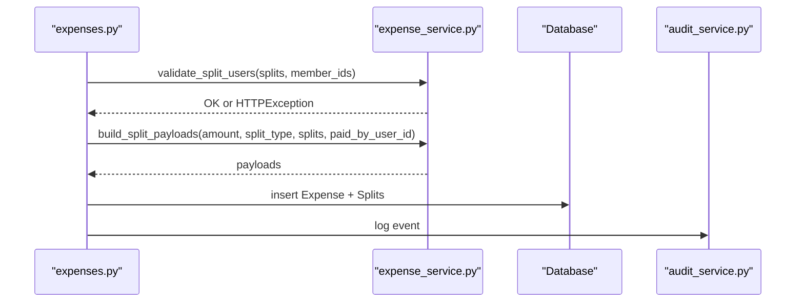
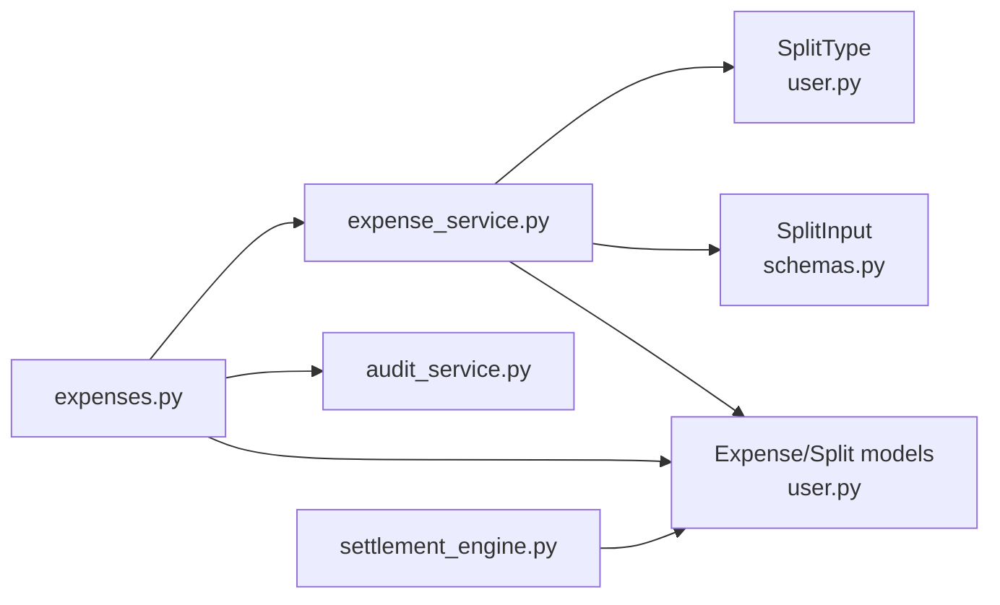

# Split Calculation Engine

<cite>
**Referenced Files in This Document**
- [expense_service.py](file://backend/app/services/expense_service.py)
- [settlement_engine.py](file://backend/app/services/settlement_engine.py)
- [user.py](file://backend/app/models/user.py)
- [schemas.py](file://backend/app/schemas/schemas.py)
- [expenses.py](file://backend/app/api/v1/endpoints/expenses.py)
- [001_initial.py](file://backend/alembic/versions/001_initial.py)
- [test_expense_service.py](file://backend/tests/test_expense_service.py)
- [test_settlement_engine.py](file://backend/tests/test_settlement_engine.py)
- [audit_service.py](file://backend/app/services/audit_service.py)
</cite>

## Table of Contents
1. [Introduction](#introduction)
2. [Project Structure](#project-structure)
3. [Core Components](#core-components)
4. [Architecture Overview](#architecture-overview)
5. [Detailed Component Analysis](#detailed-component-analysis)
6. [Dependency Analysis](#dependency-analysis)
7. [Performance Considerations](#performance-considerations)
8. [Troubleshooting Guide](#troubleshooting-guide)
9. [Conclusion](#conclusion)

## Introduction
This document describes the split calculation engine that powers shared expense distribution in the system. It covers:
- Equal split calculations with fair remainder distribution
- Exact amount distribution for precise individual allocations
- Percentage-based allocation for custom split ratios
- Validation logic ensuring mathematical accuracy and constraint enforcement
- Integration with the expense service for CRUD operations and split type processing
- Error handling for invalid inputs, division by zero scenarios, and rounding precision
- Performance optimization techniques for bulk split calculations
- Concrete examples from the codebase demonstrating each split type implementation, input validation, and calculation results
- Edge cases such as zero amounts, negative values, and floating-point precision handling

## Project Structure
The split calculation engine spans several modules:
- Services: expense_service.py performs split calculations and validation
- Models: user.py defines SplitType and data models for persistence
- Schemas: schemas.py validates inputs and enforces constraints
- API: expenses.py integrates split calculations into CRUD operations
- Tests: unit tests validate behavior for each split type and edge cases
- Settlement engine: settlement_engine.py computes net balances and optimizes settlements

**Diagram sources**
- [expenses.py:14-179](file://backend/app/api/v1/endpoints/expenses.py#L14-L179)
- [expense_service.py:7-79](file://backend/app/services/expense_service.py#L7-L79)
- [user.py:12-16](file://backend/app/models/user.py#L12-L16)
- [schemas.py:217-256](file://backend/app/schemas/schemas.py#L217-L256)
- [001_initial.py:68-96](file://backend/alembic/versions/001_initial.py#L68-L96)
- [settlement_engine.py:23-97](file://backend/app/services/settlement_engine.py#L23-L97)
- [audit_service.py:6-31](file://backend/app/services/audit_service.py#L6-L31)

**Section sources**
- [expenses.py:14-179](file://backend/app/api/v1/endpoints/expenses.py#L14-L179)
- [expense_service.py:7-79](file://backend/app/services/expense_service.py#L7-L79)
- [user.py:12-16](file://backend/app/models/user.py#L12-L16)
- [schemas.py:217-256](file://backend/app/schemas/schemas.py#L217-L256)
- [001_initial.py:68-96](file://backend/alembic/versions/001_initial.py#L68-L96)
- [settlement_engine.py:23-97](file://backend/app/services/settlement_engine.py#L23-L97)
- [audit_service.py:6-31](file://backend/app/services/audit_service.py#L6-L31)

## Core Components
- SplitType enumeration: equal, exact, percentage
- SplitInput schema: user_id plus either amount (paise) or percentage
- ExpenseCreate/ExpenseUpdate validators: enforce totals and percentages
- Expense service: validates users and builds split payloads for each split type
- API endpoints: integrate split calculations into create/update flows
- Settlement engine: computes net balances and minimizes transactions

Key responsibilities:
- Equal split: distribute amount evenly among participants, allocate remainders fairly
- Exact split: ensure split amounts sum to the total
- Percentage split: compute shares from percentages with rounding and remainder handling
- Validation: reject duplicates, invalid users, mismatched totals, and non-positive amounts

**Section sources**
- [user.py:12-16](file://backend/app/models/user.py#L12-L16)
- [schemas.py:217-256](file://backend/app/schemas/schemas.py#L217-L256)
- [expense_service.py:7-79](file://backend/app/services/expense_service.py#L7-L79)
- [expenses.py:144-179](file://backend/app/api/v1/endpoints/expenses.py#L144-L179)

## Architecture Overview
The split calculation pipeline integrates with the expense lifecycle:

**Diagram sources**
- [expenses.py:144-179](file://backend/app/api/v1/endpoints/expenses.py#L144-L179)
- [expense_service.py:7-79](file://backend/app/services/expense_service.py#L7-L79)
- [audit_service.py:6-31](file://backend/app/services/audit_service.py#L6-L31)
- [001_initial.py:68-96](file://backend/alembic/versions/001_initial.py#L68-L96)

## Detailed Component Analysis

### Split Types and Calculation Methodologies

#### Equal Split (Fair Distribution)
Equal split divides the total amount among participants as evenly as possible. The service:
- Computes base share and remainder
- Allocates extra units to a designated payer or to earlier participants when no payer is specified
- Ensures the sum equals the original amount

**Diagram sources**
- [expense_service.py:62-78](file://backend/app/services/expense_service.py#L62-L78)

**Section sources**
- [expense_service.py:62-78](file://backend/app/services/expense_service.py#L62-L78)
- [test_expense_service.py:19-38](file://backend/tests/test_expense_service.py#L19-L38)

#### Exact Amount Distribution
Exact split allows specifying precise amounts per participant. The service:
- Validates that split amounts sum to the total
- Returns payloads with user_id, split_type, amount, and percentage

**Diagram sources**
- [expense_service.py:25-37](file://backend/app/services/expense_service.py#L25-L37)

**Section sources**
- [expense_service.py:25-37](file://backend/app/services/expense_service.py#L25-L37)
- [schemas.py:245-255](file://backend/app/schemas/schemas.py#L245-L255)
- [test_expense_service.py:55-65](file://backend/tests/test_expense_service.py#L55-L65)

#### Percentage-Based Allocation
Percentage split computes shares from percentages with rounding and remainder handling:
- Validates that percentages sum to 100 (within tolerance)
- Computes each share as rounded percentage of the total
- Assigns remaining units to the last participant to preserve total

**Diagram sources**
- [expense_service.py:39-60](file://backend/app/services/expense_service.py#L39-L60)
- [schemas.py:245-255](file://backend/app/schemas/schemas.py#L245-L255)

**Section sources**
- [expense_service.py:39-60](file://backend/app/services/expense_service.py#L39-L60)
- [schemas.py:245-255](file://backend/app/schemas/schemas.py#L245-L255)
- [test_expense_service.py:41-52](file://backend/tests/test_expense_service.py#L41-L52)

### Validation Logic and Constraint Enforcement
Validation occurs at two layers:
- Schema-level validation (Pydantic) during create/update
- Service-level validation for user membership and split totals

**Diagram sources**
- [schemas.py:223-255](file://backend/app/schemas/schemas.py#L223-L255)
- [expense_service.py:7-16](file://backend/app/services/expense_service.py#L7-L16)
- [expenses.py:144-179](file://backend/app/api/v1/endpoints/expenses.py#L144-L179)

**Section sources**
- [schemas.py:223-255](file://backend/app/schemas/schemas.py#L223-L255)
- [expense_service.py:7-16](file://backend/app/services/expense_service.py#L7-L16)
- [expenses.py:144-179](file://backend/app/api/v1/endpoints/expenses.py#L144-L179)

### Integration with Expense Service and CRUD Operations
The API endpoints orchestrate split calculations:
- Create: validate membership, validate users, build payloads, persist, and log
- Update: rebuild splits when split_type or splits change, validate, and persist

**Diagram sources**
- [expenses.py:144-179](file://backend/app/api/v1/endpoints/expenses.py#L144-L179)
- [expense_service.py:7-79](file://backend/app/services/expense_service.py#L7-L79)
- [audit_service.py:6-31](file://backend/app/services/audit_service.py#L6-L31)

**Section sources**
- [expenses.py:144-179](file://backend/app/api/v1/endpoints/expenses.py#L144-L179)
- [expenses.py:230-263](file://backend/app/api/v1/endpoints/expenses.py#L230-L263)

### Error Handling and Edge Cases
Common error conditions and handling:
- Duplicate users in split: HTTP 400
- Non-member users: HTTP 400
- Exact split total mismatch: HTTP 400
- Percentage total not ≈ 100: HTTP 400
- Non-positive split amounts in percentage: HTTP 400
- Zero/negative amounts: rejected by schema validators
- Division by zero: prevented by nonzero participant count and nonzero percentages

Precision handling:
- Integer arithmetic in paise avoids floating-point errors
- Rounding performed before remainder assignment in percentage splits
- Remainder distributed to ensure exact totals

**Section sources**
- [expense_service.py:7-16](file://backend/app/services/expense_service.py#L7-L16)
- [expense_service.py:25-37](file://backend/app/services/expense_service.py#L25-L37)
- [expense_service.py:39-60](file://backend/app/services/expense_service.py#L39-L60)
- [schemas.py:230-255](file://backend/app/schemas/schemas.py#L230-L255)
- [test_expense_service.py:9-16](file://backend/tests/test_expense_service.py#L9-L16)
- [test_expense_service.py:55-65](file://backend/tests/test_expense_service.py#L55-L65)

### Performance Optimization Techniques
- Integer-only arithmetic: money stored in paise to avoid floating-point errors
- Minimal loops: single pass for equal split remainder distribution
- Early validation: rejects invalid inputs before heavy computation
- Batch replacement: replace all splits atomically during updates
- Efficient remainder handling: base share and remainder computed once

Bulk calculation tips:
- Pre-validate inputs to reduce retries
- Use integer math consistently
- Prefer equal split for uniform distributions to minimize rounding overhead

**Section sources**
- [settlement_engine.py:23-97](file://backend/app/services/settlement_engine.py#L23-L97)
- [expenses.py:42-57](file://backend/app/api/v1/endpoints/expenses.py#L42-L57)

## Dependency Analysis
The split calculation engine depends on:
- SplitType enumeration for dispatch logic
- Pydantic schemas for input validation
- SQLAlchemy models for persistence
- Audit logging for immutable records

**Diagram sources**
- [expense_service.py:3-4](file://backend/app/services/expense_service.py#L3-L4)
- [user.py:12-16](file://backend/app/models/user.py#L12-L16)
- [schemas.py:217-221](file://backend/app/schemas/schemas.py#L217-L221)
- [expenses.py:144-179](file://backend/app/api/v1/endpoints/expenses.py#L144-L179)
- [audit_service.py:6-31](file://backend/app/services/audit_service.py#L6-L31)
- [settlement_engine.py:23-97](file://backend/app/services/settlement_engine.py#L23-L97)

**Section sources**
- [expense_service.py:3-4](file://backend/app/services/expense_service.py#L3-L4)
- [user.py:12-16](file://backend/app/models/user.py#L12-L16)
- [schemas.py:217-221](file://backend/app/schemas/schemas.py#L217-L221)
- [expenses.py:144-179](file://backend/app/api/v1/endpoints/expenses.py#L144-L179)
- [audit_service.py:6-31](file://backend/app/services/audit_service.py#L6-L31)
- [settlement_engine.py:23-97](file://backend/app/services/settlement_engine.py#L23-L97)

## Performance Considerations
- Integer arithmetic: paise storage prevents floating-point drift and reduces CPU overhead
- Single-pass remainder distribution: O(n) with minimal branching
- Atomic batch replacement: reduces DB round-trips during updates
- Early validation: reduces wasted computation on invalid inputs
- Greedy settlement optimization: minimizes transaction count for reconciliation

[No sources needed since this section provides general guidance]

## Troubleshooting Guide
Common issues and resolutions:
- HTTP 400 on create/update: verify split totals and user membership
- Unexpected remainder distribution: confirm paid_by_user_id is a participant
- Percentage split not summing to 100: adjust percentages within tolerance
- Negative or zero amounts: ensure amount > 0 in ExpenseCreate/Update
- Division by zero: ensure at least one participant is specified

Validation references:
- Exact split total mismatch: [expense_service.py:27](file://backend/app/services/expense_service.py#L27)
- Percentage total tolerance: [schemas.py:253](file://backend/app/schemas/schemas.py#L253)
- Duplicate users: [expense_service.py:11](file://backend/app/services/expense_service.py#L11)
- Non-member users: [expense_service.py:14](file://backend/app/services/expense_service.py#L14)

**Section sources**
- [expense_service.py:7-16](file://backend/app/services/expense_service.py#L7-L16)
- [schemas.py:245-255](file://backend/app/schemas/schemas.py#L245-L255)

## Conclusion
The split calculation engine provides robust, mathematically sound distribution mechanisms for shared expenses:
- Equal split ensures fairness with minimal remainder
- Exact split enables precise allocations
- Percentage split supports flexible ratios with controlled rounding
- Comprehensive validation and error handling ensure data integrity
- Integration with the expense service and audit logging maintains a complete, immutable record