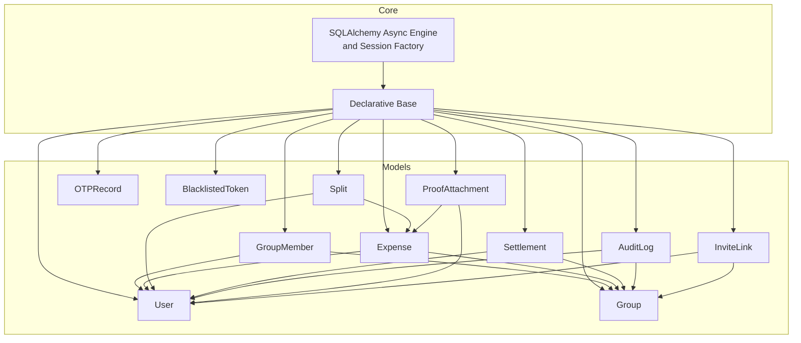
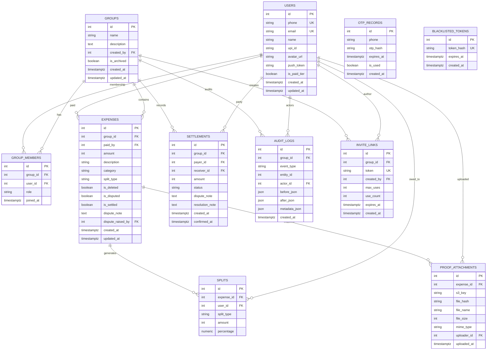
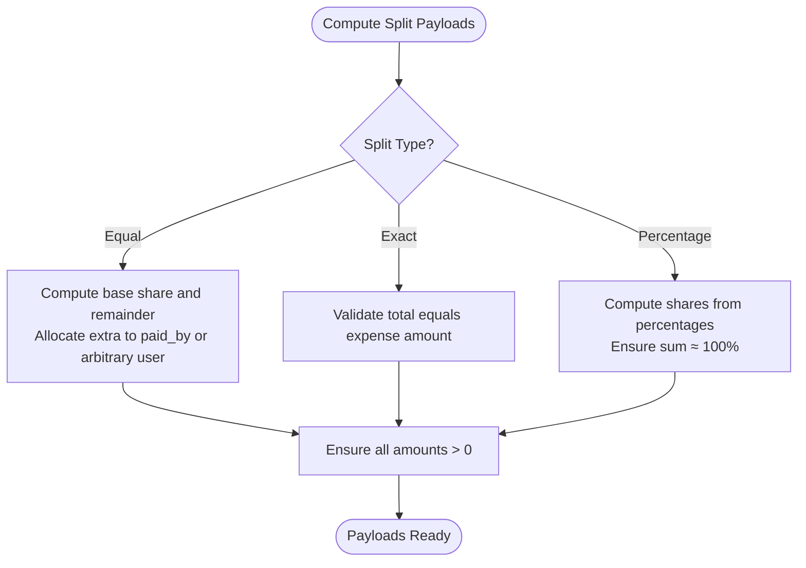
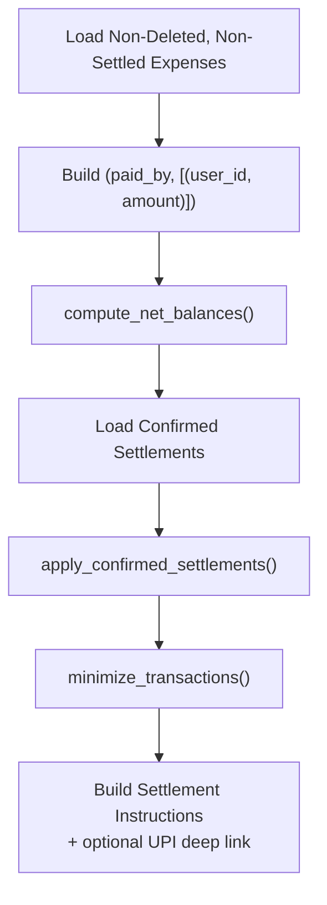
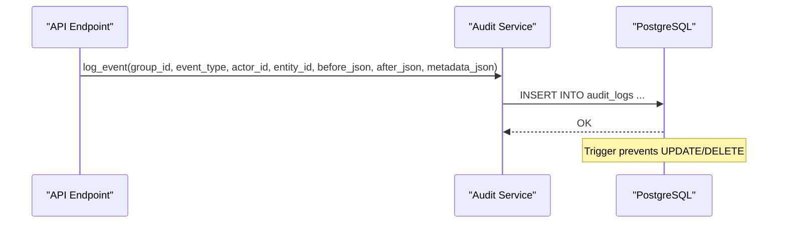
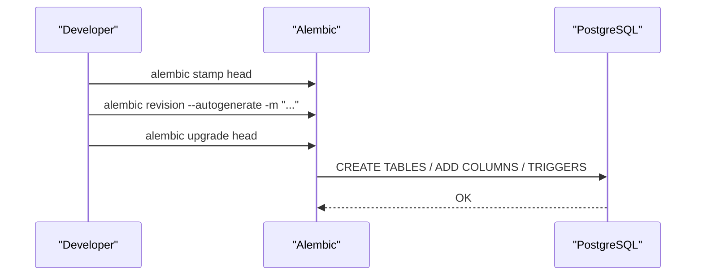
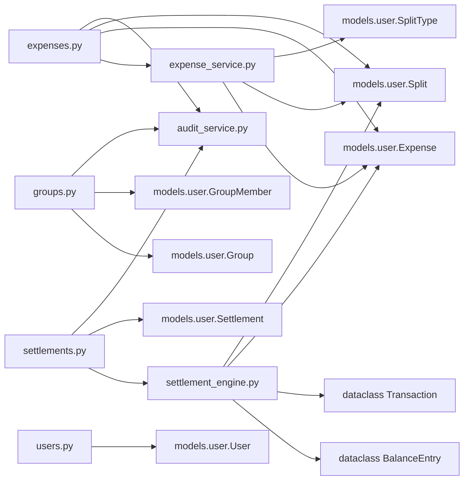

# Data Models and Database Design

<cite>
**Referenced Files in This Document**
- [database.py](file://backend/app/core/database.py)
- [001_initial.py](file://backend/alembic/versions/001_initial.py)
- [002_add_push_token.py](file://backend/alembic/versions/002_add_push_token.py)
- [user.py](file://backend/app/models/user.py)
- [schemas.py](file://backend/app/schemas/schemas.py)
- [settlement_engine.py](file://backend/app/services/settlement_engine.py)
- [audit_service.py](file://backend/app/services/audit_service.py)
- [expense_service.py](file://backend/app/services/expense_service.py)
- [users.py](file://backend/app/api/v1/endpoints/users.py)
- [groups.py](file://backend/app/api/v1/endpoints/groups.py)
- [expenses.py](file://backend/app/api/v1/endpoints/expenses.py)
- [settlements.py](file://backend/app/api/v1/endpoints/settlements.py)
- [audit.py](file://backend/app/api/v1/endpoints/audit.py)
</cite>

## Table of Contents
1. [Introduction](#introduction)
2. [Project Structure](#project-structure)
3. [Core Components](#core-components)
4. [Architecture Overview](#architecture-overview)
5. [Detailed Component Analysis](#detailed-component-analysis)
6. [Dependency Analysis](#dependency-analysis)
7. [Performance Considerations](#performance-considerations)
8. [Troubleshooting Guide](#troubleshooting-guide)
9. [Conclusion](#conclusion)
10. [Appendices](#appendices)

## Introduction
This document provides comprehensive data model documentation for the SplitSure database schema and entity relationships. It covers core entities (User, Group, Expense, Split, Settlement, AuditLog, and related supporting tables), their fields, data types, constraints, and relationships. It also explains the mathematical foundations of money representation using integer paise, split type calculations, and settlement optimization data structures. The document details validation rules, business rule enforcement, audit immutability, data access patterns, caching strategies, performance considerations, data lifecycle, migration paths via Alembic, and security/privacy controls.

## Project Structure
The data model is implemented using SQLAlchemy declarative models with Alembic migrations. The backend uses an asynchronous SQLAlchemy engine and FastAPI endpoints to enforce business rules and maintain data consistency.

**Diagram sources**
- [database.py:1-29](file://backend/app/core/database.py#L1-L29)
- [user.py:51-234](file://backend/app/models/user.py#L51-L234)

**Section sources**
- [database.py:1-29](file://backend/app/core/database.py#L1-L29)
- [user.py:51-234](file://backend/app/models/user.py#L51-L234)

## Core Components
This section defines the core entities, their fields, data types, constraints, and relationships.

- User
  - Fields: id (primary key), phone (unique, indexed), email (unique, indexed), name, upi_id, avatar_url, push_token, is_paid_tier, created_at, updated_at.
  - Constraints: phone and email are unique; phone is indexed; timestamps use timezone-aware DateTime.
  - Relationships: group_memberships, expenses_paid.
  - Notes: push_token column added in migration 002.

- Group
  - Fields: id (primary key), name, description, created_by (foreign key to User), is_archived, created_at, updated_at.
  - Constraints: created_by references User; is_archived defaults false.
  - Relationships: members, expenses, settlements, audit_logs, invite_links.

- GroupMember
  - Fields: id (primary key), group_id (foreign key to Group), user_id (foreign key to User), role (enum: admin/member), joined_at.
  - Constraints: unique constraint on (group_id, user_id); role defaults to member.
  - Relationships: group, user.

- Expense
  - Fields: id (primary key), group_id (foreign key to Group), paid_by (foreign key to User), amount (stored in paise), description, category (enum), split_type (enum), is_deleted, is_disputed, is_settled, dispute_note, dispute_raised_by (foreign key to User), created_at, updated_at.
  - Constraints: amount > 0; split_type enum; is_deleted/is_disputed/is_settled booleans; dispute_raised_by references User.
  - Relationships: group, paid_by_user, splits (cascade delete-orphan), proof_attachments.

- Split
  - Fields: id (primary key), expense_id (foreign key to Expense), user_id (foreign key to User), split_type (enum), amount (paise), percentage.
  - Constraints: amount in paise; percentage numeric with precision suitable for percent scale.
  - Relationships: expense, user.

- Settlement
  - Fields: id (primary key), group_id (foreign key to Group), payer_id (foreign key to User), receiver_id (foreign key to User), amount (paise), status (enum: pending/confirmed/disputed), dispute_note, resolution_note, created_at, confirmed_at.
  - Constraints: amount > 0; status defaults pending; payer and receiver must be distinct and members; unique (payer_id, receiver_id) per group per status pending.
  - Relationships: group, payer, receiver.

- AuditLog
  - Fields: id (primary key), group_id (foreign key to Group, indexed), event_type (enum), entity_id (indexed), actor_id (foreign key to User), before_json, after_json, metadata_json, created_at (indexed).
  - Constraints: immutable append-only via PostgreSQL trigger; indexes on group_id, entity_id, created_at.
  - Relationships: group, actor.

- OTPRecord
  - Fields: id (primary key), phone, otp_hash, expires_at, is_used, created_at.
  - Constraints: phone indexed; is_used defaults false.

- BlacklistedToken
  - Fields: id (primary key), token_hash (unique, indexed), expires_at (indexed), created_at.
  - Constraints: unique token_hash; expires_at indexed.

- ProofAttachment
  - Fields: id (primary key), expense_id (foreign key to Expense), s3_key, file_hash (SHA-256), file_name, file_size (bytes), mime_type, uploader_id (foreign key to User), uploaded_at.
  - Relationships: expense, uploader.

- InviteLink
  - Fields: id (primary key), group_id (foreign key to Group), token (unique, indexed), created_by (foreign key to User), max_uses (default 10), use_count, expires_at, created_at.
  - Relationships: group.

**Section sources**
- [user.py:51-234](file://backend/app/models/user.py#L51-L234)
- [001_initial.py:17-185](file://backend/alembic/versions/001_initial.py#L17-L185)
- [002_add_push_token.py:17-23](file://backend/alembic/versions/002_add_push_token.py#L17-L23)

## Architecture Overview
The data architecture centers around asynchronous SQLAlchemy ORM models with Alembic-managed migrations. Business logic is enforced in FastAPI endpoints and service modules. Audit logs are append-only via a PostgreSQL trigger. Money is represented consistently in integer paise across Expense and Split.

**Diagram sources**
- [user.py:51-234](file://backend/app/models/user.py#L51-L234)
- [001_initial.py:17-185](file://backend/alembic/versions/001_initial.py#L17-L185)

## Detailed Component Analysis

### Money Representation and Split Calculations
- Money is stored as integers representing paise (1 rupee = 100 paise) to avoid floating-point precision errors.
- Split types:
  - Equal: Amounts distributed with minimal rounding; remainder may be allocated to a designated user.
  - Exact: Explicit per-user amounts; total must equal the expense amount.
  - Percentage: Percent allocations computed from the total; must sum to 100% within a small epsilon.
- Validation ensures:
  - Amounts > 0.
  - Exact split totals match the expense amount.
  - Percentage totals are within tolerance of 100%.

**Diagram sources**
- [expense_service.py:19-79](file://backend/app/services/expense_service.py#L19-L79)
- [schemas.py:203-236](file://backend/app/schemas/schemas.py#L203-L236)

**Section sources**
- [expense_service.py:19-79](file://backend/app/services/expense_service.py#L19-L79)
- [schemas.py:203-236](file://backend/app/schemas/schemas.py#L203-L236)

### Settlement Optimization Engine
- Net balances are computed from paid amounts and split allocations.
- Confirmed settlements are subtracted from balances to reflect prior resolutions.
- Transactions are minimized greedily by pairing largest creditors and debtors.
- UPI deep links are generated for receivers with UPI IDs.

**Diagram sources**
- [settlements.py:52-82](file://backend/app/api/v1/endpoints/settlements.py#L52-L82)
- [settlement_engine.py:23-106](file://backend/app/services/settlement_engine.py#L23-L106)

**Section sources**
- [settlements.py:129-236](file://backend/app/api/v1/endpoints/settlements.py#L129-L236)
- [settlement_engine.py:23-106](file://backend/app/services/settlement_engine.py#L23-L106)

### Audit Trail Immutability
- A PostgreSQL trigger prevents UPDATE and DELETE on the audit_logs table, enforcing append-only immutability.
- Events are logged via a service method that writes immutable entries.

**Diagram sources**
- [audit_service.py:6-32](file://backend/app/services/audit_service.py#L6-L32)
- [001_initial.py:156-170](file://backend/alembic/versions/001_initial.py#L156-L170)

**Section sources**
- [audit_service.py:6-32](file://backend/app/services/audit_service.py#L6-L32)
- [001_initial.py:156-170](file://backend/alembic/versions/001_initial.py#L156-L170)

### Data Validation Rules and Business Enforcements
- Users:
  - Phone normalization (+91 prefix if missing spaces).
  - Email and UPI ID validation via regex.
- Groups:
  - Name length 2–50; admin-only updates; member addition constrained by max members.
- Expenses:
  - Description required; amount > 0; split validations per split type; cannot edit settled/disputed expenses; dispute flow requires admin to resolve.
- Settlements:
  - Must match computed outstanding balance; self-settlement forbidden; pending uniqueness per pair; confirmation/dispute requires proper roles and row-level locking.
- Attachments:
  - Max attachments per expense; file type and size checks; presigned URLs for retrieval.

**Section sources**
- [schemas.py:10-99](file://backend/app/schemas/schemas.py#L10-L99)
- [schemas.py:117-151](file://backend/app/schemas/schemas.py#L117-L151)
- [expenses.py:230-291](file://backend/app/api/v1/endpoints/expenses.py#L230-L291)
- [settlements.py:238-309](file://backend/app/api/v1/endpoints/settlements.py#L238-L309)
- [expenses.py:352-395](file://backend/app/api/v1/endpoints/expenses.py#L352-L395)

### Data Access Patterns and Caching Strategies
- Access patterns:
  - Select-in-load for related entities (e.g., selectinload for members, splits, attachments).
  - Membership checks via explicit joins; admin-role checks for sensitive operations.
  - Row-level locking with FOR UPDATE for settlement confirm/dispute.
- Caching:
  - No explicit caching layer observed in the backend; presigned URLs are generated on demand for attachments.
  - Recommendations:
    - Cache frequently accessed group membership sets and user profiles.
    - Cache balance computations per group with invalidation on settlement/expense changes.

**Section sources**
- [groups.py:43-56](file://backend/app/api/v1/endpoints/groups.py#L43-L56)
- [expenses.py:59-75](file://backend/app/api/v1/endpoints/expenses.py#L59-L75)
- [settlements.py:320-332](file://backend/app/api/v1/endpoints/settlements.py#L320-L332)

### Data Lifecycle: Creation, Updates, Archival, Deletion
- Creation:
  - Users: via onboarding flows; push_token added later.
  - Groups: creator auto-added as admin; audit event logged.
  - Expenses: validated splits applied; audit event logged.
  - Settlements: computed against outstanding balances; pending state until confirmation.
- Updates:
  - Expense updates require non-settled/non-disputed; split rebuild enforces validity.
  - Group updates require admin; member management controlled by role.
- Archival:
  - Groups support archival; queries filter archived out by default.
- Deletion:
  - Expenses soft-deleted (is_deleted flag); audit event logged.
  - Settlements do not support hard deletion; status transitions handled.

**Section sources**
- [users.py:21-47](file://backend/app/api/v1/endpoints/users.py#L21-L47)
- [groups.py:58-84](file://backend/app/api/v1/endpoints/groups.py#L58-L84)
- [expenses.py:143-180](file://backend/app/api/v1/endpoints/expenses.py#L143-L180)
- [expenses.py:266-291](file://backend/app/api/v1/endpoints/expenses.py#L266-L291)
- [settlements.py:238-309](file://backend/app/api/v1/endpoints/settlements.py#L238-L309)
- [groups.py:279-309](file://backend/app/api/v1/endpoints/groups.py#L279-L309)

### Data Migration Paths and Schema Evolution
- Initial schema includes users, groups, group_members, expenses, splits, settlements, audit_logs, proof_attachments, invite_links, and OTP/blacklisted token tables.
- Audit log immutability enforced via PostgreSQL trigger.
- Migration 002 adds push_token to users.

**Diagram sources**
- [001_initial.py:17-185](file://backend/alembic/versions/001_initial.py#L17-L185)
- [002_add_push_token.py:17-23](file://backend/alembic/versions/002_add_push_token.py#L17-L23)

**Section sources**
- [001_initial.py:17-185](file://backend/alembic/versions/001_initial.py#L17-L185)
- [002_add_push_token.py:17-23](file://backend/alembic/versions/002_add_push_token.py#L17-L23)

### Security, Privacy, and Access Control
- Access control:
  - Membership checks for all group-scoped operations.
  - Admin-only actions (update group, add/remove members, resolve disputes).
- Audit immutability:
  - PostgreSQL trigger prevents modification/deletion of audit_logs.
- Data privacy:
  - Minimal PII stored; phone normalized; UPI IDs optional; avatar URLs served via signed URLs.
- Token management:
  - Blacklisted tokens table supports token hash indexing and expiry.

**Section sources**
- [groups.py:29-40](file://backend/app/api/v1/endpoints/groups.py#L29-L40)
- [settlements.py:311-371](file://backend/app/api/v1/endpoints/settlements.py#L311-L371)
- [audit.py:13-40](file://backend/app/api/v1/endpoints/audit.py#L13-L40)
- [001_initial.py:156-170](file://backend/alembic/versions/001_initial.py#L156-L170)
- [user.py:81-88](file://backend/app/models/user.py#L81-L88)

## Dependency Analysis
The following diagram shows key dependencies among models and services involved in data operations.

**Diagram sources**
- [expense_service.py:1-79](file://backend/app/services/expense_service.py#L1-L79)
- [settlement_engine.py:1-106](file://backend/app/services/settlement_engine.py#L1-L106)
- [expenses.py:17-18](file://backend/app/api/v1/endpoints/expenses.py#L17-L18)
- [settlements.py:17-26](file://backend/app/api/v1/endpoints/settlements.py#L17-L26)
- [groups.py:10-15](file://backend/app/api/v1/endpoints/groups.py#L10-L15)
- [users.py:10-11](file://backend/app/api/v1/endpoints/users.py#L10-L11)

**Section sources**
- [expense_service.py:1-79](file://backend/app/services/expense_service.py#L1-L79)
- [settlement_engine.py:1-106](file://backend/app/services/settlement_engine.py#L1-L106)
- [expenses.py:17-18](file://backend/app/api/v1/endpoints/expenses.py#L17-L18)
- [settlements.py:17-26](file://backend/app/api/v1/endpoints/settlements.py#L17-L26)
- [groups.py:10-15](file://backend/app/api/v1/endpoints/groups.py#L10-L15)
- [users.py:10-11](file://backend/app/api/v1/endpoints/users.py#L10-L11)

## Performance Considerations
- Indexes:
  - Users: phone (unique), email (unique), push_token.
  - OTP records: phone.
  - Audit logs: composite (group_id, entity_id, created_at).
  - Invite links: token (unique).
- Asynchronous I/O:
  - Async SQLAlchemy engine and sessions reduce blocking during I/O-bound operations.
- Query optimization:
  - selectinload reduces N+1 queries for related entities.
  - Filtering by is_deleted and is_settled minimizes result sets.
- Cost model:
  - Greedy settlement minimization reduces transaction count; O(n log n) sorting dominates.

[No sources needed since this section provides general guidance]

## Troubleshooting Guide
- Integrity errors on user updates (e.g., duplicate email) are caught and surfaced as conflict errors.
- Membership errors occur when non-members attempt group operations.
- Settlement errors arise from mismatched expected amounts, pending conflicts, or insufficient privileges.
- Audit logs are append-only; attempts to mutate or delete will fail at the database level.

**Section sources**
- [users.py:36-47](file://backend/app/api/v1/endpoints/users.py#L36-L47)
- [groups.py:29-40](file://backend/app/api/v1/endpoints/groups.py#L29-L40)
- [settlements.py:253-269](file://backend/app/api/v1/endpoints/settlements.py#L253-L269)
- [001_initial.py:156-170](file://backend/alembic/versions/001_initial.py#L156-L170)

## Conclusion
SplitSure’s data model is designed around precise financial accounting (paise), robust validation, and immutable auditing. The schema supports efficient group-based operations, flexible split types, and optimized settlement computation. Migrations are managed via Alembic, and access control is enforced at the API layer with database-level immutability for audit logs.

[No sources needed since this section summarizes without analyzing specific files]

## Appendices

### Appendix A: Field Reference Summary
- Users: id, phone, email, name, upi_id, avatar_url, push_token, is_paid_tier, created_at, updated_at.
- Groups: id, name, description, created_by, is_archived, created_at, updated_at.
- GroupMembers: id, group_id, user_id, role, joined_at.
- Expenses: id, group_id, paid_by, amount (paise), description, category, split_type, is_deleted, is_disputed, is_settled, dispute_note, dispute_raised_by, created_at, updated_at.
- Splits: id, expense_id, user_id, split_type, amount (paise), percentage.
- Settlements: id, group_id, payer_id, receiver_id, amount (paise), status, dispute_note, resolution_note, created_at, confirmed_at.
- AuditLogs: id, group_id, event_type, entity_id, actor_id, before_json, after_json, metadata_json, created_at.
- OTPRecords: id, phone, otp_hash, expires_at, is_used, created_at.
- BlacklistedTokens: id, token_hash, expires_at, created_at.
- ProofAttachments: id, expense_id, s3_key, file_hash, file_name, file_size, mime_type, uploader_id, uploaded_at.
- InviteLinks: id, group_id, token, created_by, max_uses, use_count, expires_at, created_at.

**Section sources**
- [user.py:51-234](file://backend/app/models/user.py#L51-L234)
- [001_initial.py:17-185](file://backend/alembic/versions/001_initial.py#L17-L185)