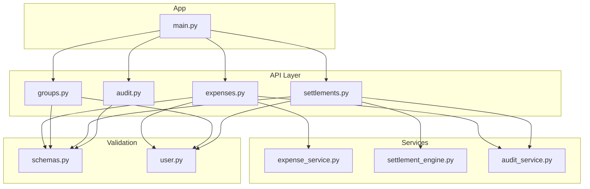
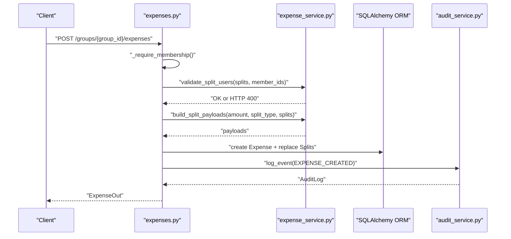
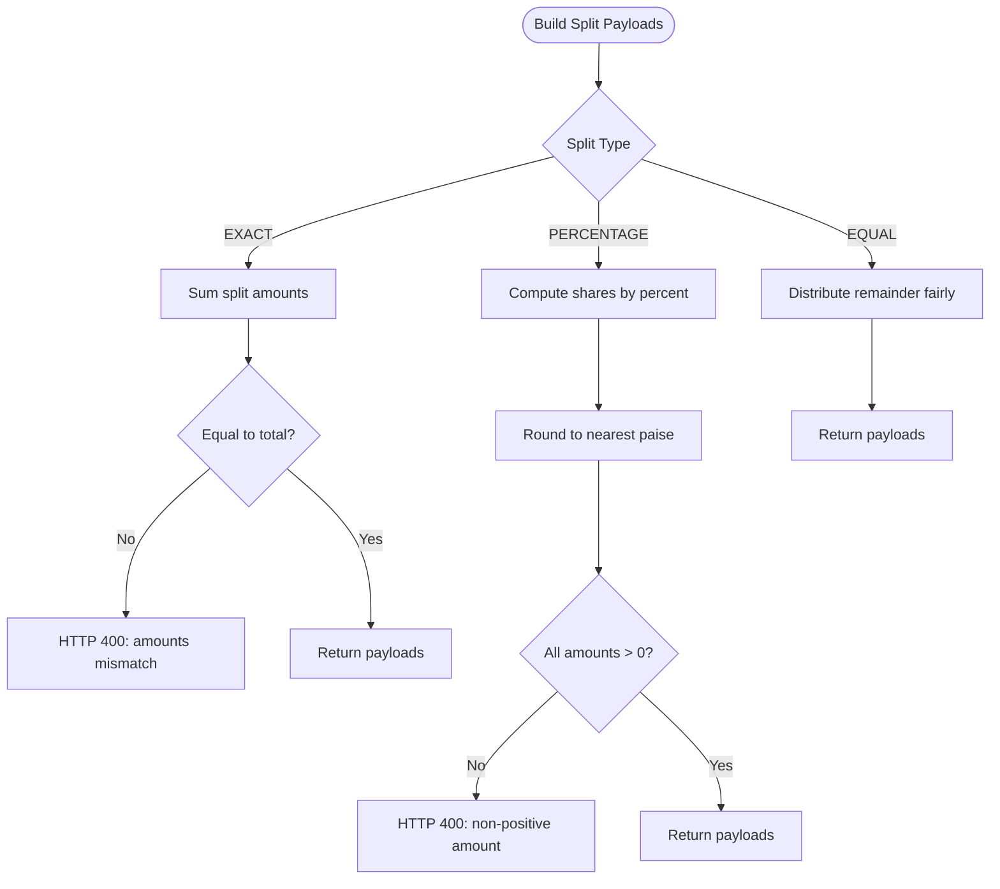
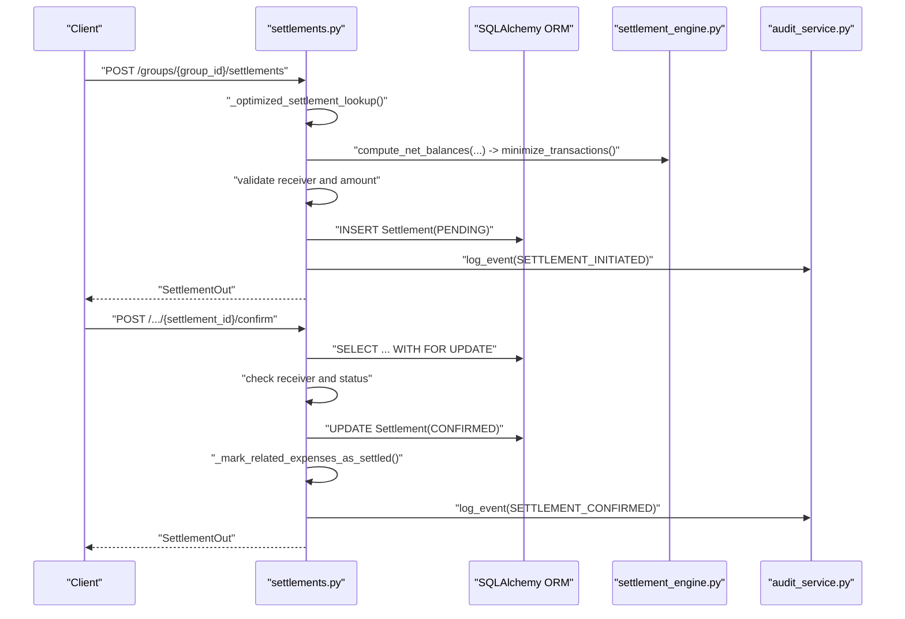
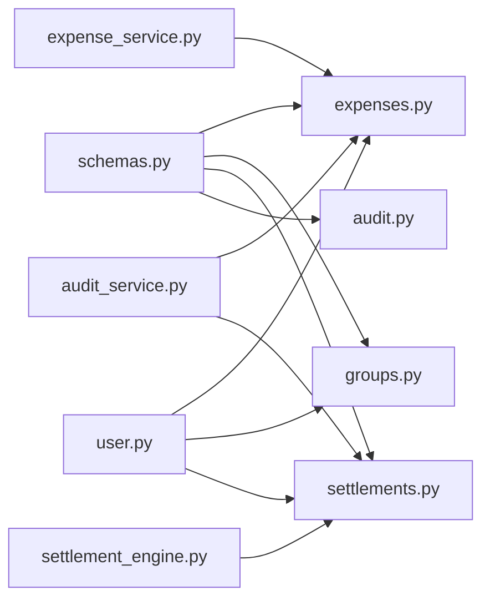

# Data Validation and Business Rules

<cite>
**Referenced Files in This Document**
- [main.py](file://backend/app/main.py)
- [schemas.py](file://backend/app/schemas/schemas.py)
- [user.py](file://backend/app/models/user.py)
- [expenses.py](file://backend/app/api/v1/endpoints/expenses.py)
- [groups.py](file://backend/app/api/v1/endpoints/groups.py)
- [settlements.py](file://backend/app/api/v1/endpoints/settlements.py)
- [audit.py](file://backend/app/api/v1/endpoints/audit.py)
- [expense_service.py](file://backend/app/services/expense_service.py)
- [settlement_engine.py](file://backend/app/services/settlement_engine.py)
- [audit_service.py](file://backend/app/services/audit_service.py)
</cite>

## Table of Contents
1. [Introduction](#introduction)
2. [Project Structure](#project-structure)
3. [Core Components](#core-components)
4. [Architecture Overview](#architecture-overview)
5. [Detailed Component Analysis](#detailed-component-analysis)
6. [Dependency Analysis](#dependency-analysis)
7. [Performance Considerations](#performance-considerations)
8. [Troubleshooting Guide](#troubleshooting-guide)
9. [Conclusion](#conclusion)

## Introduction
This document details SplitSure’s data validation rules and business logic enforcement across input validation, expense calculation rules, settlement workflows, group membership controls, financial precision handling, audit immutability, and concurrency safeguards. It synthesizes schema-level validators, service-layer checks, and endpoint-level enforcement to ensure correctness, consistency, and accountability.

## Project Structure
The backend is organized around:
- API routers under app/api/v1/endpoints for expenses, groups, settlements, audit, and related resources
- Pydantic schemas for request/response validation and model-level constraints
- SQLAlchemy models defining domain entities, enums, and database constraints
- Services implementing business logic for expense splitting, settlement computation, and audit logging
- Application startup hooks initializing database tables and enforcing audit immutability via triggers

**Diagram sources**
- [main.py:1-96](file://backend/app/main.py#L1-L96)
- [expenses.py:1-395](file://backend/app/api/v1/endpoints/expenses.py#L1-L395)
- [groups.py:1-350](file://backend/app/api/v1/endpoints/groups.py#L1-L350)
- [settlements.py:1-501](file://backend/app/api/v1/endpoints/settlements.py#L1-L501)
- [audit.py:1-40](file://backend/app/api/v1/endpoints/audit.py#L1-L40)
- [schemas.py:1-432](file://backend/app/schemas/schemas.py#L1-L432)
- [user.py:1-234](file://backend/app/models/user.py#L1-L234)
- [expense_service.py:1-79](file://backend/app/services/expense_service.py#L1-L79)
- [settlement_engine.py:1-106](file://backend/app/services/settlement_engine.py#L1-L106)
- [audit_service.py:1-32](file://backend/app/services/audit_service.py#L1-L32)

**Section sources**
- [main.py:1-96](file://backend/app/main.py#L1-L96)

## Core Components
- Input validation and normalization:
  - Phone numbers normalized to E.164-like format with country code and stripped spaces
  - Email and UPI ID validated with strict regular expressions
  - Descriptions and notes enforced with minimum length constraints
- Expense calculation rules:
  - Exact splits must sum to total amount
  - Percentage splits must sum to 100 (within small tolerance)
  - Equal splits distribute remainder fairly
- Settlement validation:
  - Pending settlement deduplication
  - Amount must match computed outstanding balance
  - Receiver must be a group member and not the payer
- Group membership and roles:
  - Admin-only operations for sensitive actions
  - Member count capped by configuration
- Financial precision:
  - All monetary values stored in integer paise to avoid floating-point errors
- Audit immutability:
  - PostgreSQL trigger prevents updates/deletes to audit logs
- Concurrency:
  - Row-level locking during settlement confirm/dispute/resolution

**Section sources**
- [schemas.py:10-127](file://backend/app/schemas/schemas.py#L10-L127)
- [schemas.py:217-256](file://backend/app/schemas/schemas.py#L217-L256)
- [schemas.py:333-417](file://backend/app/schemas/schemas.py#L333-L417)
- [expense_service.py:7-79](file://backend/app/services/expense_service.py#L7-L79)
- [settlements.py:238-309](file://backend/app/api/v1/endpoints/settlements.py#L238-L309)
- [settlements.py:311-433](file://backend/app/api/v1/endpoints/settlements.py#L311-L433)
- [settlements.py:436-483](file://backend/app/api/v1/endpoints/settlements.py#L436-L483)
- [groups.py:141-207](file://backend/app/api/v1/endpoints/groups.py#L141-L207)
- [user.py:124-182](file://backend/app/models/user.py#L124-L182)
- [main.py:68-86](file://backend/app/main.py#L68-L86)

## Architecture Overview
The system enforces validation at multiple layers:
- Schema-level validators catch malformed inputs early
- Endpoint handlers enforce membership, state transitions, and business constraints
- Services encapsulate splitting logic and settlement computations
- Database constraints and triggers protect data integrity and audit immutability

**Diagram sources**
- [expenses.py:143-179](file://backend/app/api/v1/endpoints/expenses.py#L143-L179)
- [expense_service.py:7-79](file://backend/app/services/expense_service.py#L7-L79)
- [audit_service.py:6-31](file://backend/app/services/audit_service.py#L6-L31)

## Detailed Component Analysis

### Input Validation Patterns
- Phone number normalization:
  - Strips spaces and ensures a leading plus sign; validates minimal length
  - Used across OTP requests, OTP verification, and group member addition
- Email uniqueness and format:
  - Email uniqueness enforced at DB level (unique constraint)
  - Email format validated with regex at schema level
- UPI ID format:
  - Strict regex pattern enforced at schema level
- Notes and descriptions:
  - Minimum lengths enforced for dispute and resolution notes
- Attachments:
  - Maximum per-expense enforced at endpoint level

**Section sources**
- [schemas.py:10-127](file://backend/app/schemas/schemas.py#L10-L127)
- [schemas.py:333-417](file://backend/app/schemas/schemas.py#L333-L417)
- [expenses.py:352-394](file://backend/app/api/v1/endpoints/expenses.py#L352-L394)
- [user.py:54-58](file://backend/app/models/user.py#L54-L58)

### Expense Calculation Rules
- Exact split validation:
  - Sum of split amounts equals total expense amount
  - Enforced at schema model validator and service builder
- Percentage split validation:
  - Sum of percentages approximately equals 100 (tolerance applied via rounding in service)
  - Ensures fairness and avoids drift
- Equal split distribution:
  - Base share derived from integer division
  - Remainder distributed to selected users to preserve totals

**Diagram sources**
- [schemas.py:245-255](file://backend/app/schemas/schemas.py#L245-L255)
- [expense_service.py:19-79](file://backend/app/services/expense_service.py#L19-L79)

**Section sources**
- [schemas.py:217-256](file://backend/app/schemas/schemas.py#L217-L256)
- [expense_service.py:7-79](file://backend/app/services/expense_service.py#L7-L79)

### Settlement Validation Rules
- Outstanding balance alignment:
  - Settlement amount must match computed net balance for the payer-receiver pair
- Duplicate prevention:
  - No pending settlement exists for the same payer-receiver pair
- Receiver eligibility:
  - Receiver must be a group member and not the current user
- Concurrency control:
  - Row-level locks during confirm/dispute/resolve to prevent race conditions
- Related expense marking:
  - When a settlement is confirmed, related expenses are marked as settled

**Diagram sources**
- [settlements.py:238-309](file://backend/app/api/v1/endpoints/settlements.py#L238-L309)
- [settlements.py:311-371](file://backend/app/api/v1/endpoints/settlements.py#L311-L371)
- [settlement_engine.py:23-98](file://backend/app/services/settlement_engine.py#L23-L98)
- [audit_service.py:6-31](file://backend/app/services/audit_service.py#L6-L31)

**Section sources**
- [settlements.py:238-309](file://backend/app/api/v1/endpoints/settlements.py#L238-L309)
- [settlements.py:311-371](file://backend/app/api/v1/endpoints/settlements.py#L311-L371)
- [settlement_engine.py:23-98](file://backend/app/services/settlement_engine.py#L23-L98)

### Group Membership Validation and Role-Based Controls
- Membership checks:
  - Non-members receive HTTP 403
- Admin-only operations:
  - Group updates, adding/removing members, inviting, archiving/unarchiving
- Member limits:
  - Enforced via configuration and checked before adding members
- Invite links:
  - Expiration, usage caps, and duplicate membership checks

**Section sources**
- [groups.py:30-41](file://backend/app/api/v1/endpoints/groups.py#L30-L41)
- [groups.py:141-207](file://backend/app/api/v1/endpoints/groups.py#L141-L207)
- [groups.py:235-317](file://backend/app/api/v1/endpoints/groups.py#L235-L317)

### Financial Precision Handling
- Monetary storage:
  - All amounts stored as integers in paise (smallest currency unit)
- Calculations:
  - Integer arithmetic used for splits and balances
  - UPI deep link amount constructed from paise with decimal formatting
- Consistency:
  - Database columns defined as integers or numeric with appropriate scale

**Section sources**
- [user.py:130-171](file://backend/app/models/user.py#L130-L171)
- [settlement_engine.py:100-106](file://backend/app/services/settlement_engine.py#L100-L106)
- [schemas.py:217-256](file://backend/app/schemas/schemas.py#L217-L256)

### Audit Event Logging and Immutability
- Append-only audit logs:
  - PostgreSQL trigger prevents updates/deletes
- Event coverage:
  - Expense lifecycle, settlement lifecycle, group and member changes, dispute resolution
- Immutable records:
  - Before/after snapshots captured for edits and deletions

**Section sources**
- [main.py:68-86](file://backend/app/main.py#L68-L86)
- [audit_service.py:6-31](file://backend/app/services/audit_service.py#L6-L31)
- [expenses.py:172-176](file://backend/app/api/v1/endpoints/expenses.py#L172-L176)
- [expenses.py:256-260](file://backend/app/api/v1/endpoints/expenses.py#L256-L260)
- [expenses.py:284-288](file://backend/app/api/v1/endpoints/expenses.py#L284-L288)
- [settlements.py:280-284](file://backend/app/api/v1/endpoints/settlements.py#L280-L284)
- [settlements.py:350-354](file://backend/app/api/v1/endpoints/settlements.py#L350-L354)
- [settlements.py:407-411](file://backend/app/api/v1/endpoints/settlements.py#L407-L411)
- [settlements.py:475-479](file://backend/app/api/v1/endpoints/settlements.py#L475-L479)
- [groups.py:77-81](file://backend/app/api/v1/endpoints/groups.py#L77-L81)
- [groups.py:131-135](file://backend/app/api/v1/endpoints/groups.py#L131-L135)
- [groups.py:182-186](file://backend/app/api/v1/endpoints/groups.py#L182-L186)
- [groups.py:227-231](file://backend/app/api/v1/endpoints/groups.py#L227-L231)

### Dispute Resolution Workflows
- Expense disputes:
  - Only non-settled expenses can be disputed; note minimum length enforced
- Settlement disputes:
  - Only receivers can dispute; must be pending; note minimum length enforced
- Admin resolution:
  - Only admins can resolve; on resolution, settlement reverts to confirmed and related expenses marked settled

**Section sources**
- [expenses.py:293-318](file://backend/app/api/v1/endpoints/expenses.py#L293-L318)
- [expenses.py:321-349](file://backend/app/api/v1/endpoints/expenses.py#L321-L349)
- [settlements.py:374-433](file://backend/app/api/v1/endpoints/settlements.py#L374-L433)
- [settlements.py:436-483](file://backend/app/api/v1/endpoints/settlements.py#L436-L483)

### Data Consistency, Isolation, and Concurrency
- Transaction boundaries:
  - Endpoints commit changes atomically after validation and service execution
- Row-level locking:
  - Settlement confirm/dispute/resolve queries use row-level locks to serialize conflicting operations
- Audit immutability:
  - Trigger-based protection against mutation of audit logs

**Section sources**
- [expenses.py:178](file://backend/app/api/v1/endpoints/expenses.py#L178)
- [expenses.py:262](file://backend/app/api/v1/endpoints/expenses.py#L262)
- [expenses.py:290](file://backend/app/api/v1/endpoints/expenses.py#L290)
- [settlements.py:320-348](file://backend/app/api/v1/endpoints/settlements.py#L320-L348)
- [settlements.py:384-413](file://backend/app/api/v1/endpoints/settlements.py#L384-L413)
- [settlements.py:448-482](file://backend/app/api/v1/endpoints/settlements.py#L448-L482)
- [main.py:80-85](file://backend/app/main.py#L80-L85)

## Dependency Analysis
Key dependencies and their roles:
- API endpoints depend on:
  - Schema validators for input normalization and constraints
  - Services for business logic (splitting, settlement computation)
  - Audit service for immutable logging
- Services depend on:
  - SQLAlchemy ORM for persistence
  - Enums and models for domain semantics
- Database constraints and triggers:
  - Enforce uniqueness, immutability, and referential integrity

**Diagram sources**
- [schemas.py:1-432](file://backend/app/schemas/schemas.py#L1-L432)
- [expenses.py:1-395](file://backend/app/api/v1/endpoints/expenses.py#L1-L395)
- [groups.py:1-350](file://backend/app/api/v1/endpoints/groups.py#L1-L350)
- [settlements.py:1-501](file://backend/app/api/v1/endpoints/settlements.py#L1-L501)
- [audit.py:1-40](file://backend/app/api/v1/endpoints/audit.py#L1-L40)
- [user.py:1-234](file://backend/app/models/user.py#L1-L234)
- [expense_service.py:1-79](file://backend/app/services/expense_service.py#L1-L79)
- [settlement_engine.py:1-106](file://backend/app/services/settlement_engine.py#L1-L106)
- [audit_service.py:1-32](file://backend/app/services/audit_service.py#L1-L32)

**Section sources**
- [schemas.py:1-432](file://backend/app/schemas/schemas.py#L1-L432)
- [user.py:1-234](file://backend/app/models/user.py#L1-L234)

## Performance Considerations
- Integer arithmetic for monetary values avoids floating-point errors and simplifies comparisons
- Greedy settlement minimization reduces transaction count with predictable complexity
- Select-in-load patterns reduce N+1 queries for related entities
- Asynchronous notifications are fire-and-forget to keep request paths fast

## Troubleshooting Guide
Common validation failures and their causes:
- Phone number validation errors:
  - Malformed or insufficient digits; ensure standardized international format
- Email uniqueness conflicts:
  - Another user already registered with the same email
- UPI ID format errors:
  - Invalid characters or missing domain part
- Expense split errors:
  - Exact split amounts not summing to total
  - Percentages not summing to 100 (account for rounding)
  - Equal splits distributing remainder incorrectly
- Settlement errors:
  - Amount mismatch with computed outstanding balance
  - Pending settlement already exists for the pair
  - Receiver not a group member or attempting self-settlement
- Dispute errors:
  - Disputes on settled or disputed expenses
  - Insufficient note length
  - Only receivers can dispute; only admins can resolve
- Group membership errors:
  - Non-member access attempts
  - Member cap exceeded when adding users
- Audit immutability:
  - Attempts to modify or delete audit logs will fail at database level

Debugging tips:
- Inspect audit logs for before/after snapshots to reconstruct state changes
- Verify database constraints and triggers are active
- Confirm concurrency control via row-level locks during settlement operations

**Section sources**
- [schemas.py:10-127](file://backend/app/schemas/schemas.py#L10-L127)
- [schemas.py:217-256](file://backend/app/schemas/schemas.py#L217-L256)
- [schemas.py:333-417](file://backend/app/schemas/schemas.py#L333-L417)
- [expenses.py:143-179](file://backend/app/api/v1/endpoints/expenses.py#L143-L179)
- [expenses.py:293-318](file://backend/app/api/v1/endpoints/expenses.py#L293-L318)
- [expenses.py:321-349](file://backend/app/api/v1/endpoints/expenses.py#L321-L349)
- [settlements.py:238-309](file://backend/app/api/v1/endpoints/settlements.py#L238-L309)
- [settlements.py:311-371](file://backend/app/api/v1/endpoints/settlements.py#L311-L371)
- [settlements.py:374-433](file://backend/app/api/v1/endpoints/settlements.py#L374-L433)
- [settlements.py:436-483](file://backend/app/api/v1/endpoints/settlements.py#L436-L483)
- [groups.py:141-207](file://backend/app/api/v1/endpoints/groups.py#L141-L207)
- [main.py:80-85](file://backend/app/main.py#L80-L85)

## Conclusion
SplitSure’s validation and business rules are enforced through a layered design combining schema validators, endpoint guards, service logic, and database constraints. Financial precision is maintained with integer paise representation, while settlement and audit systems ensure correctness, transparency, and immutability. Concurrency is handled via row-level locks to prevent race conditions during critical settlement operations.