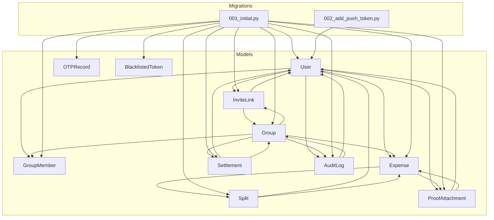
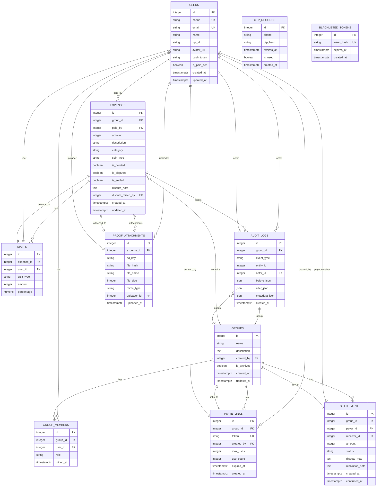
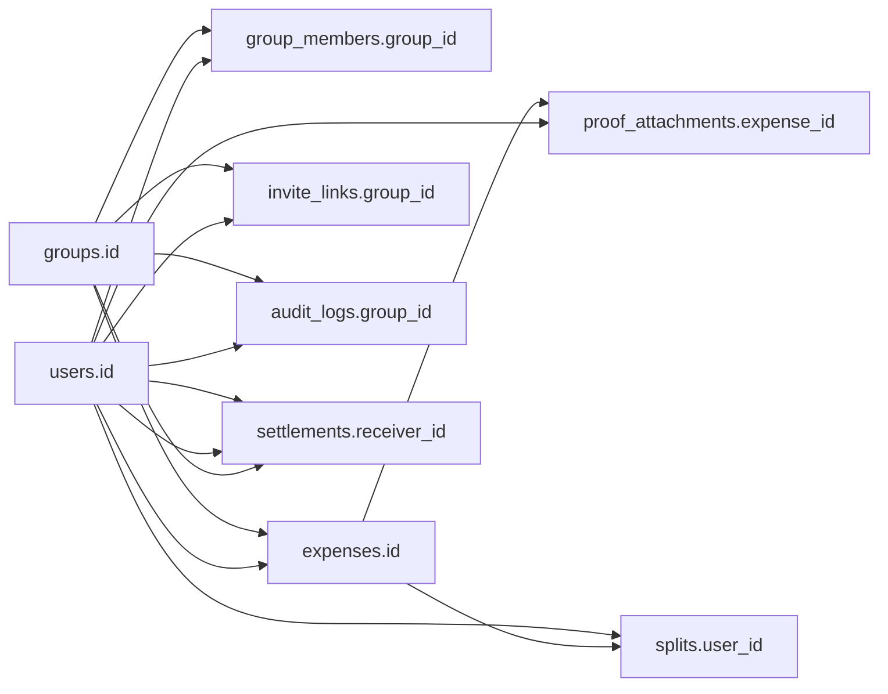

# Database Schema Specifications

<cite>
**Referenced Files in This Document**
- [user.py](file://backend/app/models/user.py)
- [001_initial.py](file://backend/alembic/versions/001_initial.py)
- [002_add_push_token.py](file://backend/alembic/versions/002_add_push_token.py)
- [database.py](file://backend/app/core/database.py)
- [schemas.py](file://backend/app/schemas/schemas.py)
- [audit_service.py](file://backend/app/services/audit_service.py)
- [expense_service.py](file://backend/app/services/expense_service.py)
- [settlement_engine.py](file://backend/app/services/settlement_engine.py)
</cite>

## Table of Contents
1. [Introduction](#introduction)
2. [Project Structure](#project-structure)
3. [Core Components](#core-components)
4. [Architecture Overview](#architecture-overview)
5. [Detailed Component Analysis](#detailed-component-analysis)
6. [Dependency Analysis](#dependency-analysis)
7. [Performance Considerations](#performance-considerations)
8. [Troubleshooting Guide](#troubleshooting-guide)
9. [Conclusion](#conclusion)

## Introduction
This document specifies the complete database schema for SplitSure, detailing all entities, their columns, data types, constraints, defaults, indexes, unique constraints, and foreign key relationships. It consolidates the SQLAlchemy ORM models and Alembic migrations to present a unified view of the relational schema, including immutable audit logging and specialized validations for amounts, percentages, and enumerations.

## Project Structure
The schema is defined primarily in the SQLAlchemy models and enforced by Alembic migrations. The models define Python classes mapped to database tables, while migrations create and alter tables and enforce immutability for audit logs.

**Diagram sources**
- [user.py:51-234](file://backend/app/models/user.py#L51-L234)
- [001_initial.py:17-170](file://backend/alembic/versions/001_initial.py#L17-L170)
- [002_add_push_token.py:17-22](file://backend/alembic/versions/002_add_push_token.py#L17-L22)

**Section sources**
- [user.py:1-234](file://backend/app/models/user.py#L1-L234)
- [001_initial.py:17-170](file://backend/alembic/versions/001_initial.py#L17-L170)
- [002_add_push_token.py:17-22](file://backend/alembic/versions/002_add_push_token.py#L17-L22)

## Core Components
This section documents each table with its fields, data types, constraints, defaults, and relationships. Indexes and unique constraints are highlighted where applicable.

- Users
  - Fields: id (primary key), phone (unique, indexed), email (unique, nullable), name (nullable), upi_id (nullable), avatar_url (nullable), push_token (nullable), is_paid_tier (default false), created_at (timezone-aware), updated_at (timezone-aware).
  - Unique constraints: phone, email.
  - Indexes: phone.
  - Relationships: group_memberships (GroupMember), expenses_paid (Expense).
  - Notes: push_token was added in migration 002.

- OTPRecord
  - Fields: id (primary key), phone (indexed), otp_hash, expires_at (timezone-aware), is_used (default false), created_at (timezone-aware).
  - Indexes: phone.

- BlacklistedToken
  - Fields: id (primary key), token_hash (unique, indexed), expires_at (timezone-aware, indexed), created_at (timezone-aware).
  - Unique constraints: token_hash.
  - Indexes: token_hash, expires_at.

- Group
  - Fields: id (primary key), name, description (nullable), created_by (foreign key to users.id), is_archived (default false), created_at (timezone-aware), updated_at (timezone-aware).
  - Relationships: members (GroupMember), expenses (Expense), settlements (Settlement), audit_logs (AuditLog), invite_links (InviteLink).

- GroupMember
  - Fields: id (primary key), group_id (foreign key to groups.id), user_id (foreign key to users.id), role (default member), joined_at (timezone-aware).
  - Unique constraints: (group_id, user_id).
  - Relationships: group (Group), user (User).

- Expense
  - Fields: id (primary key), group_id (foreign key to groups.id), paid_by (foreign key to users.id), amount (stored in paise), description, category (enumeration), split_type (enumeration), is_deleted (default false), is_disputed (default false), is_settled (default false), dispute_note (nullable), dispute_raised_by (foreign key to users.id), created_at (timezone-aware), updated_at (timezone-aware).
  - Relationships: group (Group), paid_by_user (User), splits (Split), proof_attachments (ProofAttachment).

- Split
  - Fields: id (primary key), expense_id (foreign key to expenses.id), user_id (foreign key to users.id), split_type (enumeration), amount (in paise), percentage (nullable).
  - Relationships: expense (Expense), user (User).

- Settlement
  - Fields: id (primary key), group_id (foreign key to groups.id), payer_id (foreign key to users.id), receiver_id (foreign key to users.id), amount (in paise), status (enumeration, default pending), dispute_note (nullable), resolution_note (nullable), created_at (timezone-aware), confirmed_at (nullable timezone-aware).
  - Relationships: group (Group), payer (User), receiver (User).

- AuditLog
  - Fields: id (primary key), group_id (foreign key to groups.id, indexed), event_type (enumeration), entity_id (nullable, indexed), actor_id (foreign key to users.id), before_json (nullable), after_json (nullable), metadata_json (nullable), created_at (timezone-aware, indexed).
  - Indexes: group_id, entity_id, created_at.
  - Immutable design: PostgreSQL trigger prevents updates/deletes.

- ProofAttachment
  - Fields: id (primary key), expense_id (foreign key to expenses.id), s3_key, file_hash (SHA-256), file_name, file_size (bytes), mime_type, uploader_id (foreign key to users.id), uploaded_at (timezone-aware).
  - Relationships: expense (Expense), uploader (User).

- InviteLink
  - Fields: id (primary key), group_id (foreign key to groups.id), token (unique, indexed), created_by (foreign key to users.id), max_uses (default 10), use_count (default 0), expires_at (timezone-aware), created_at (timezone-aware).
  - Unique constraints: token.
  - Indexes: token.

**Section sources**
- [user.py:51-234](file://backend/app/models/user.py#L51-L234)
- [001_initial.py:17-170](file://backend/alembic/versions/001_initial.py#L17-L170)
- [002_add_push_token.py:17-22](file://backend/alembic/versions/002_add_push_token.py#L17-L22)

## Architecture Overview
The schema enforces referential integrity through foreign keys and supports efficient querying via strategic indexes. Immutable audit logging ensures an append-only audit trail protected by a PostgreSQL trigger.

**Diagram sources**
- [user.py:51-234](file://backend/app/models/user.py#L51-L234)
- [001_initial.py:17-170](file://backend/alembic/versions/001_initial.py#L17-L170)

## Detailed Component Analysis

### Users Table
- Purpose: Stores user profiles and authentication-related identifiers.
- Columns:
  - id: integer, primary key, autoincrement.
  - phone: string(15), unique, indexed, not null.
  - email: string(255), unique, nullable.
  - name: string(100), nullable.
  - upi_id: string(100), nullable.
  - avatar_url: string(500), nullable.
  - push_token: string(500), nullable (added in migration 002).
  - is_paid_tier: boolean, default false.
  - created_at, updated_at: timestamptz, server defaults.
- Constraints: unique(phone), unique(email).
- Indexes: phone.
- Relationships: group_memberships (GroupMember), expenses_paid (Expense).
- Notes: push_token column added by migration 002.

**Section sources**
- [user.py:51-68](file://backend/app/models/user.py#L51-L68)
- [002_add_push_token.py:17-22](file://backend/alembic/versions/002_add_push_token.py#L17-L22)

### Group Table
- Purpose: Represents user groups for shared expense tracking.
- Columns:
  - id: integer, primary key.
  - name: string(50), not null.
  - description: text, nullable.
  - created_by: integer, foreign key to users.id, not null.
  - is_archived: boolean, default false.
  - created_at, updated_at: timestamptz, server defaults.
- Relationships: members (GroupMember), expenses (Expense), settlements (Settlement), audit_logs (AuditLog), invite_links (InviteLink).

**Section sources**
- [user.py:90-106](file://backend/app/models/user.py#L90-L106)

### GroupMember Table
- Purpose: Links users to groups with roles.
- Columns:
  - id: integer, primary key.
  - group_id: integer, foreign key to groups.id, not null.
  - user_id: integer, foreign key to users.id, not null.
  - role: enum (admin/member), default member.
  - joined_at: timestamptz, server default.
- Unique constraints: (group_id, user_id).
- Relationships: group (Group), user (User).

**Section sources**
- [user.py:109-122](file://backend/app/models/user.py#L109-L122)

### Expense Table
- Purpose: Records individual expenses within a group.
- Amount storage: integer representing paise (1 rupee = 100 paise).
- Columns:
  - id: integer, primary key.
  - group_id: integer, foreign key to groups.id, not null.
  - paid_by: integer, foreign key to users.id, not null.
  - amount: integer, not null.
  - description: string(255), not null.
  - category: enum (food, transport, accommodation, utilities, misc), default misc.
  - split_type: enum (equal, exact, percentage), not null.
  - is_deleted: boolean, default false.
  - is_disputed: boolean, default false.
  - is_settled: boolean, default false.
  - dispute_note: text, nullable.
  - dispute_raised_by: integer, foreign key to users.id, nullable.
  - created_at, updated_at: timestamptz, server defaults.
- Relationships: group (Group), paid_by_user (User), splits (Split), proof_attachments (ProofAttachment).

**Section sources**
- [user.py:124-147](file://backend/app/models/user.py#L124-L147)

### Split Table
- Purpose: Defines how an expense is split among users.
- Amount storage: integer representing paise.
- Columns:
  - id: integer, primary key.
  - expense_id: integer, foreign key to expenses.id, not null.
  - user_id: integer, foreign key to users.id, not null.
  - split_type: enum (equal, exact, percentage), not null.
  - amount: integer, not null.
  - percentage: numeric(5,2), nullable.
- Relationships: expense (Expense), user (User).

**Section sources**
- [user.py:149-162](file://backend/app/models/user.py#L149-L162)

### Settlement Table
- Purpose: Tracks settlement instructions and their status.
- Amount storage: integer representing paise.
- Columns:
  - id: integer, primary key.
  - group_id: integer, foreign key to groups.id, not null.
  - payer_id: integer, foreign key to users.id, not null.
  - receiver_id: integer, foreign key to users.id, not null.
  - amount: integer, not null.
  - status: enum (pending, confirmed, disputed), default pending.
  - dispute_note: text, nullable.
  - resolution_note: text, nullable.
  - created_at: timestamptz, server default.
  - confirmed_at: timestamptz, nullable.
- Relationships: group (Group), payer (User), receiver (User).

**Section sources**
- [user.py:164-182](file://backend/app/models/user.py#L164-L182)

### AuditLog Table
- Purpose: Immutable audit trail for group events.
- Columns:
  - id: integer, primary key.
  - group_id: integer, foreign key to groups.id, not null, indexed.
  - event_type: enum (expense_created, expense_edited, expense_deleted, settlement_initiated, settlement_confirmed, settlement_disputed, dispute_resolved, member_added, member_removed, group_created, group_updated), not null.
  - entity_id: integer, nullable, indexed.
  - actor_id: integer, foreign key to users.id, not null.
  - before_json, after_json, metadata_json: json/jsonb, nullable.
  - created_at: timestamptz, server default, indexed.
- Indexes: group_id, entity_id, created_at.
- Immutable design: PostgreSQL trigger prevents UPDATE/DELETE on audit_logs.

**Section sources**
- [user.py:184-199](file://backend/app/models/user.py#L184-L199)
- [001_initial.py:113-127](file://backend/alembic/versions/001_initial.py#L113-L127)
- [audit_service.py:6-31](file://backend/app/services/audit_service.py#L6-L31)

### ProofAttachment Table
- Purpose: Stores file metadata and S3 key for expense proofs.
- Columns:
  - id: integer, primary key.
  - expense_id: integer, foreign key to expenses.id, not null.
  - s3_key: string(500), not null.
  - file_hash: string(64), not null (SHA-256).
  - file_name: string(255), not null.
  - file_size: integer (bytes), not null.
  - mime_type: string(100), not null.
  - uploader_id: integer, foreign key to users.id, not null.
  - uploaded_at: timestamptz, server default.
- Relationships: expense (Expense), uploader (User).

**Section sources**
- [user.py:202-218](file://backend/app/models/user.py#L202-L218)

### InviteLink Table
- Purpose: Manages group invitation tokens with usage limits and expiration.
- Columns:
  - id: integer, primary key.
  - group_id: integer, foreign key to groups.id, not null.
  - token: string(64), unique, indexed, not null.
  - created_by: integer, foreign key to users.id, not null.
  - max_uses: integer, default 10.
  - use_count: integer, default 0.
  - expires_at: timestamptz, not null.
  - created_at: timestamptz, server default.
- Unique constraints: token.
- Indexes: token.
- Relationships: group (Group).

**Section sources**
- [user.py:220-234](file://backend/app/models/user.py#L220-L234)

### Additional Supporting Tables
- OTPRecord
  - Fields: id, phone (indexed), otp_hash, expires_at, is_used (default false), created_at.
  - Indexes: phone.

- BlacklistedToken
  - Fields: id, token_hash (unique, indexed), expires_at (indexed), created_at.
  - Unique constraints: token_hash.
  - Indexes: token_hash, expires_at.

**Section sources**
- [user.py:70-88](file://backend/app/models/user.py#L70-L88)

## Dependency Analysis
Foreign key relationships and indexes are defined in the models and enforced by migrations. The following diagram highlights key dependencies and constraints.

**Diagram sources**
- [user.py:51-234](file://backend/app/models/user.py#L51-L234)
- [001_initial.py:17-170](file://backend/alembic/versions/001_initial.py#L17-L170)

**Section sources**
- [user.py:51-234](file://backend/app/models/user.py#L51-L234)
- [001_initial.py:17-170](file://backend/alembic/versions/001_initial.py#L17-L170)

## Performance Considerations
- Indexes for hot queries:
  - users.phone: for phone-based lookups.
  - group_members(group_id, user_id): composite unique index for membership checks.
  - audit_logs(group_id, entity_id, created_at): composite index for efficient audit queries.
  - invite_links.token: for token-based joins.
  - otp_records.phone: for OTP lookups.
  - blacklisted_tokens(token_hash, expires_at): for token revocation checks.
- Immutable audit trail: The PostgreSQL trigger ensures write-once semantics, reducing contention and enabling append-only scans.
- Amount normalization: All monetary values are stored as integers in paise to avoid floating-point precision issues and simplify comparisons.

[No sources needed since this section provides general guidance]

## Troubleshooting Guide
- Audit Log Mutations:
  - Symptom: Attempted UPDATE/DELETE on audit_logs fails with an exception.
  - Cause: PostgreSQL trigger prevents modifications to audit_logs.
  - Resolution: Only INSERT operations are permitted; use the provided logging service to append entries.

- Duplicate Membership:
  - Symptom: Insertion into group_members fails with unique constraint violation.
  - Cause: (group_id, user_id) must be unique.
  - Resolution: Ensure users are not added twice to the same group.

- Expense Split Validation:
  - Symptom: Creating or updating an expense fails validation.
  - Cause: Exact split totals must equal the expense amount; percentage splits must sum to 100.
  - Resolution: Use the provided service functions to compute split payloads and validate inputs.

- Invite Link Expiration/Usage:
  - Symptom: Joining via invite link fails unexpectedly.
  - Cause: Token expired or max_uses exceeded.
  - Resolution: Verify expires_at and use_count against configured limits.

**Section sources**
- [001_initial.py:156-169](file://backend/alembic/versions/001_initial.py#L156-L169)
- [user.py:109-122](file://backend/app/models/user.py#L109-L122)
- [expense_service.py:7-79](file://backend/app/services/expense_service.py#L7-L79)
- [schemas.py:245-255](file://backend/app/schemas/schemas.py#L245-L255)

## Conclusion
The SplitSure database schema is designed around clear entity boundaries, strong referential integrity, and performance-oriented indexing. Monetary values are normalized to paise for precision, enumerations constrain categorical data, and immutable audit logging ensures a tamper-evident history. The schema supports efficient querying patterns and provides robust validation through both ORM models and database triggers.