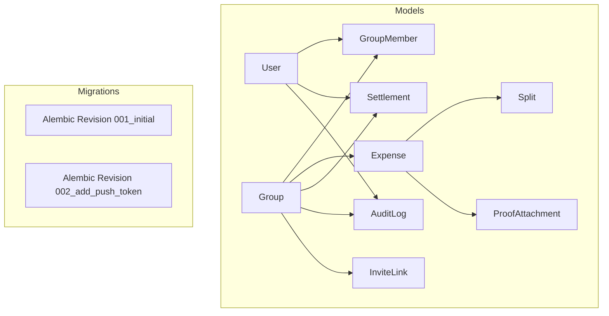
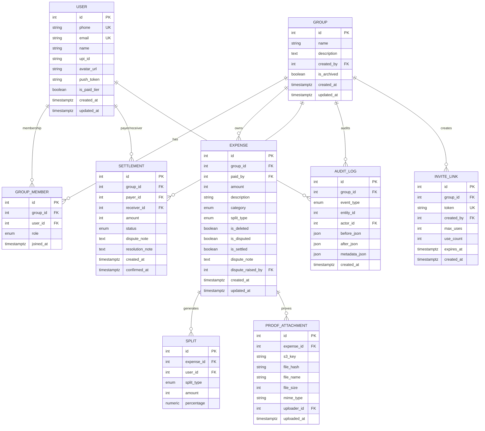
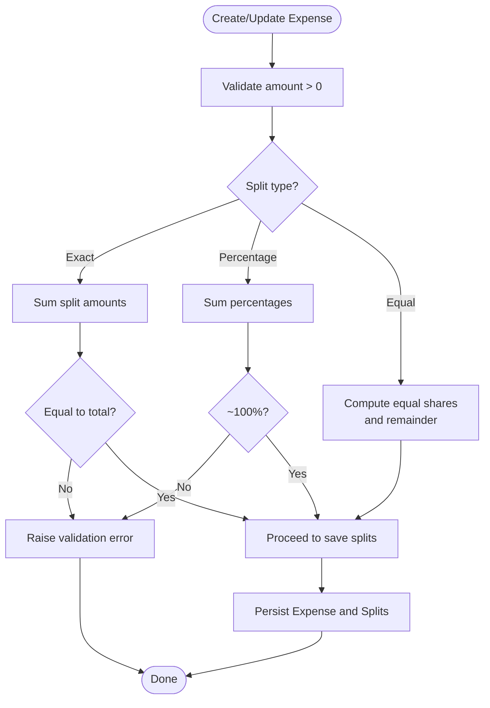
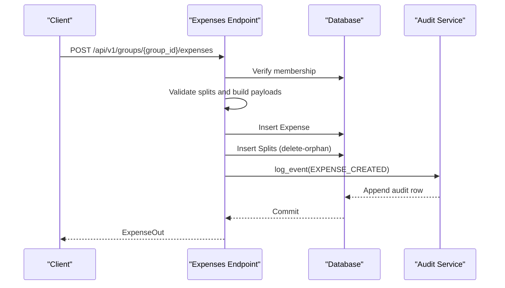
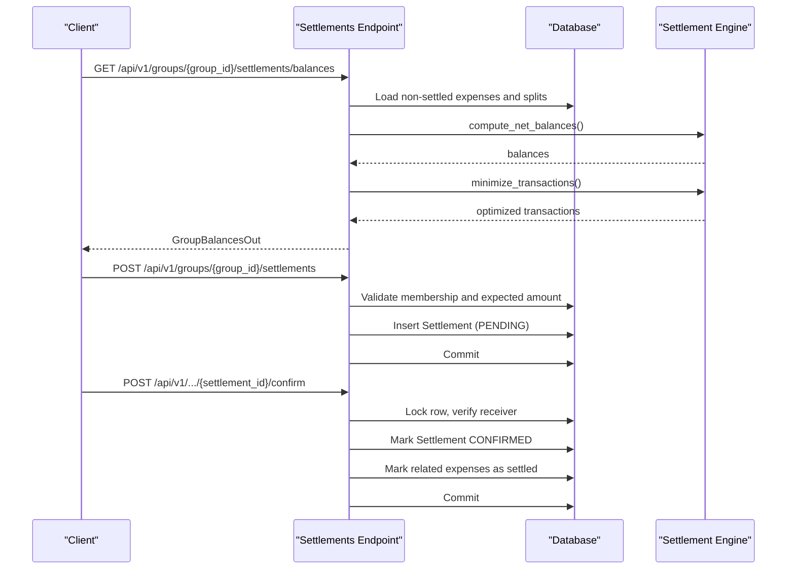
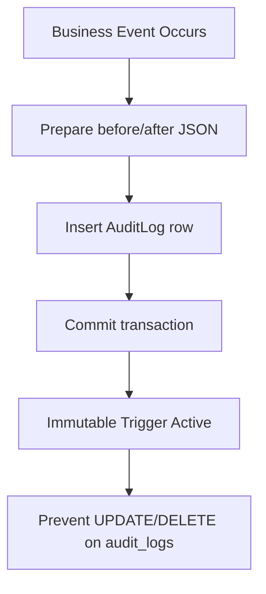
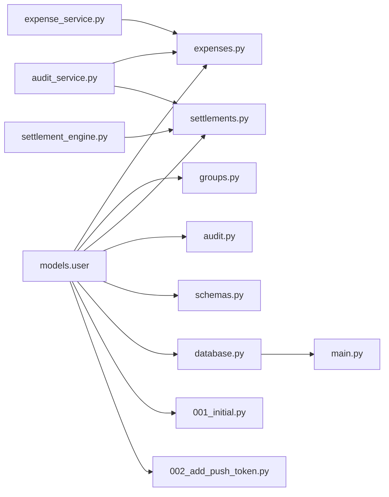

# Entity Relationship Diagram

<cite>
**Referenced Files in This Document**
- [user.py](file://backend/app/models/user.py)
- [001_initial.py](file://backend/alembic/versions/001_initial.py)
- [002_add_push_token.py](file://backend/alembic/versions/002_add_push_token.py)
- [expenses.py](file://backend/app/api/v1/endpoints/expenses.py)
- [groups.py](file://backend/app/api/v1/endpoints/groups.py)
- [settlements.py](file://backend/app/api/v1/endpoints/settlements.py)
- [audit.py](file://backend/app/api/v1/endpoints/audit.py)
- [schemas.py](file://backend/app/schemas/schemas.py)
- [expense_service.py](file://backend/app/services/expense_service.py)
- [settlement_engine.py](file://backend/app/services/settlement_engine.py)
- [audit_service.py](file://backend/app/services/audit_service.py)
- [database.py](file://backend/app/core/database.py)
- [main.py](file://backend/app/main.py)
</cite>

## Table of Contents
1. [Introduction](#introduction)
2. [Project Structure](#project-structure)
3. [Core Components](#core-components)
4. [Architecture Overview](#architecture-overview)
5. [Detailed Component Analysis](#detailed-component-analysis)
6. [Dependency Analysis](#dependency-analysis)
7. [Performance Considerations](#performance-considerations)
8. [Troubleshooting Guide](#troubleshooting-guide)
9. [Conclusion](#conclusion)

## Introduction
This document presents the complete entity relationship model for SplitSure’s database schema. It defines nine core entities, their attributes, primary keys, foreign keys, referential integrity constraints, and business-enforced invariants. It also explains many-to-many relationships (User–Group via GroupMember), one-to-many relationships (Group–Expense, Expense–Split, Group–Settlement), and the mathematical foundation of money representation using integer paise to avoid floating-point precision errors. Cascade behaviors, orphan removal policies, and data consistency mechanisms are documented alongside visual ER diagrams and sequence diagrams to illustrate real-world workflows.

## Project Structure
The database schema is defined in SQLAlchemy declarative models and enforced by Alembic migrations. The application registers models at startup and creates tables accordingly. API endpoints orchestrate business logic and enforce membership and permission checks, while services encapsulate domain-specific computations (e.g., split distribution, settlement optimization).

**Diagram sources**
- [user.py:51-234](file://backend/app/models/user.py#L51-L234)
- [001_initial.py:17-185](file://backend/alembic/versions/001_initial.py#L17-L185)
- [002_add_push_token.py:17-23](file://backend/alembic/versions/002_add_push_token.py#L17-L23)

**Section sources**
- [database.py:1-29](file://backend/app/core/database.py#L1-L29)
- [main.py:68-86](file://backend/app/main.py#L68-L86)

## Core Components
Below are the nine core entities with their primary keys and key attributes. Referential integrity constraints are derived from foreign keys and unique constraints.

- User
  - Primary key: id
  - Attributes: phone, email, name, upi_id, avatar_url, push_token, is_paid_tier, created_at, updated_at
  - Relationships: group_memberships (GroupMember), expenses_paid (Expense)

- Group
  - Primary key: id
  - Attributes: name, description, created_by (User.id), is_archived, created_at, updated_at
  - Relationships: members (GroupMember), expenses (Expense), settlements (Settlement), audit_logs (AuditLog), invite_links (InviteLink)

- GroupMember
  - Primary key: id
  - Attributes: group_id (Group.id), user_id (User.id), role, joined_at
  - Constraints: unique (group_id, user_id)
  - Relationships: group (Group), user (User)

- Expense
  - Primary key: id
  - Attributes: group_id (Group.id), paid_by (User.id), amount (paise), description, category, split_type, is_deleted, is_disputed, is_settled, dispute_note, dispute_raised_by (User.id), created_at, updated_at
  - Relationships: group (Group), paid_by_user (User), splits (Split), proof_attachments (ProofAttachment)
  - Cascade: splits (delete-orphan)

- Split
  - Primary key: id
  - Attributes: expense_id (Expense.id), user_id (User.id), split_type, amount (paise), percentage
  - Relationships: expense (Expense), user (User)

- Settlement
  - Primary key: id
  - Attributes: group_id (Group.id), payer_id (User.id), receiver_id (User.id), amount (paise), status, dispute_note, resolution_note, created_at, confirmed_at
  - Relationships: group (Group), payer (User), receiver (User)

- AuditLog
  - Primary key: id
  - Attributes: group_id (Group.id), event_type, entity_id, actor_id (User.id), before_json, after_json, metadata_json, created_at
  - Index: group_id, entity_id, created_at
  - Constraint: immutable append-only via PostgreSQL trigger

- ProofAttachment
  - Primary key: id
  - Attributes: expense_id (Expense.id), s3_key, file_hash, file_name, file_size, mime_type, uploader_id (User.id), uploaded_at
  - Relationships: expense (Expense), uploader (User)

- InviteLink
  - Primary key: id
  - Attributes: group_id (Group.id), token (unique), created_by (User.id), max_uses, use_count, expires_at, created_at
  - Relationships: group (Group)

**Section sources**
- [user.py:51-234](file://backend/app/models/user.py#L51-L234)
- [001_initial.py:17-185](file://backend/alembic/versions/001_initial.py#L17-L185)

## Architecture Overview
The ER model enforces business rules at the database and application layers:
- Money amounts are stored as integers in paise to prevent floating-point errors.
- Many-to-many membership is modeled via GroupMember with a unique constraint to prevent duplicates.
- Expense splits are tightly coupled to expenses with cascading delete-orphan semantics.
- Audit logs are append-only via a PostgreSQL trigger.
- Settlements are validated against computed balances and mark related expenses as settled upon confirmation.

**Diagram sources**
- [user.py:51-234](file://backend/app/models/user.py#L51-L234)
- [001_initial.py:17-185](file://backend/alembic/versions/001_initial.py#L17-L185)

## Detailed Component Analysis

### Money Representation and Business Rules
- Amounts are stored as integers representing paise (1 rupee = 100 paise).
- Validation ensures amounts are positive and split totals adhere to split_type rules:
  - Exact split: split amounts must sum to the expense total.
  - Percentage split: percentages must sum to 100 (within tolerance).
  - Equal split: base distribution with remainder allocation logic.
- Settlement amounts are validated against computed net balances and must match expected values.

**Diagram sources**
- [schemas.py:203-236](file://backend/app/schemas/schemas.py#L203-L236)
- [expense_service.py:19-79](file://backend/app/services/expense_service.py#L19-L79)

**Section sources**
- [schemas.py:203-236](file://backend/app/schemas/schemas.py#L203-L236)
- [expense_service.py:19-79](file://backend/app/services/expense_service.py#L19-L79)

### Expense Creation and Split Distribution
- Membership is verified before creating expenses.
- Split payloads are built according to split_type and validated against group membership.
- Splits are persisted with delete-orphan cascade on Expense deletion.

**Diagram sources**
- [expenses.py:143-179](file://backend/app/api/v1/endpoints/expenses.py#L143-L179)
- [audit_service.py:6-32](file://backend/app/services/audit_service.py#L6-L32)

**Section sources**
- [expenses.py:143-179](file://backend/app/api/v1/endpoints/expenses.py#L143-L179)
- [audit_service.py:6-32](file://backend/app/services/audit_service.py#L6-L32)

### Settlement Computation and Confirmation
- Balances are computed from non-settled, non-deleted expenses.
- Optimized transactions minimize the number of transfers.
- Settlement initiation validates expected amounts and uniqueness of pending settlements.
- Confirmation marks related expenses as settled and records audit events.

**Diagram sources**
- [settlements.py:129-235](file://backend/app/api/v1/endpoints/settlements.py#L129-L235)
- [settlements.py:238-309](file://backend/app/api/v1/endpoints/settlements.py#L238-L309)
- [settlements.py:311-371](file://backend/app/api/v1/endpoints/settlements.py#L311-L371)
- [settlement_engine.py:23-90](file://backend/app/services/settlement_engine.py#L23-L90)

**Section sources**
- [settlements.py:129-235](file://backend/app/api/v1/endpoints/settlements.py#L129-L235)
- [settlements.py:238-309](file://backend/app/api/v1/endpoints/settlements.py#L238-L309)
- [settlements.py:311-371](file://backend/app/api/v1/endpoints/settlements.py#L311-L371)
- [settlement_engine.py:23-90](file://backend/app/services/settlement_engine.py#L23-L90)

### Audit Trail and Immutability
- Audit logs capture lifecycle events for expenses, settlements, and group membership.
- A PostgreSQL trigger enforces append-only immutability for audit_logs.

**Diagram sources**
- [audit_service.py:6-32](file://backend/app/services/audit_service.py#L6-L32)
- [001_initial.py:156-169](file://backend/alembic/versions/001_initial.py#L156-L169)
- [main.py:72-85](file://backend/app/main.py#L72-L85)

**Section sources**
- [audit_service.py:6-32](file://backend/app/services/audit_service.py#L6-L32)
- [001_initial.py:156-169](file://backend/alembic/versions/001_initial.py#L156-L169)
- [main.py:72-85](file://backend/app/main.py#L72-L85)

## Dependency Analysis
- Model definitions in SQLAlchemy define relationships and constraints.
- Alembic revisions create and alter tables, including unique constraints and triggers.
- API endpoints depend on models and services to enforce business rules.
- Services encapsulate domain logic (split computation, settlement optimization).

**Diagram sources**
- [user.py:51-234](file://backend/app/models/user.py#L51-L234)
- [expenses.py:1-395](file://backend/app/api/v1/endpoints/expenses.py#L1-L395)
- [groups.py:1-309](file://backend/app/api/v1/endpoints/groups.py#L1-L309)
- [settlements.py:1-501](file://backend/app/api/v1/endpoints/settlements.py#L1-L501)
- [audit.py:1-40](file://backend/app/api/v1/endpoints/audit.py#L1-L40)
- [schemas.py:1-412](file://backend/app/schemas/schemas.py#L1-L412)
- [expense_service.py:1-79](file://backend/app/services/expense_service.py#L1-L79)
- [settlement_engine.py:1-106](file://backend/app/services/settlement_engine.py#L1-L106)
- [audit_service.py:1-32](file://backend/app/services/audit_service.py#L1-L32)
- [database.py:1-29](file://backend/app/core/database.py#L1-L29)
- [main.py:68-86](file://backend/app/main.py#L68-L86)
- [001_initial.py:17-185](file://backend/alembic/versions/001_initial.py#L17-L185)
- [002_add_push_token.py:17-23](file://backend/alembic/versions/002_add_push_token.py#L17-L23)

**Section sources**
- [user.py:51-234](file://backend/app/models/user.py#L51-L234)
- [expenses.py:1-395](file://backend/app/api/v1/endpoints/expenses.py#L1-L395)
- [groups.py:1-309](file://backend/app/api/v1/endpoints/groups.py#L1-L309)
- [settlements.py:1-501](file://backend/app/api/v1/endpoints/settlements.py#L1-L501)
- [audit.py:1-40](file://backend/app/api/v1/endpoints/audit.py#L1-L40)
- [schemas.py:1-412](file://backend/app/schemas/schemas.py#L1-L412)
- [expense_service.py:1-79](file://backend/app/services/expense_service.py#L1-L79)
- [settlement_engine.py:1-106](file://backend/app/services/settlement_engine.py#L1-L106)
- [audit_service.py:1-32](file://backend/app/services/audit_service.py#L1-L32)
- [database.py:1-29](file://backend/app/core/database.py#L1-L29)
- [main.py:68-86](file://backend/app/main.py#L68-L86)
- [001_initial.py:17-185](file://backend/alembic/versions/001_initial.py#L17-L185)
- [002_add_push_token.py:17-23](file://backend/alembic/versions/002_add_push_token.py#L17-L23)

## Performance Considerations
- Use selectinload to eagerly fetch related entities (e.g., paid_by_user, splits, proof_attachments) to reduce N+1 queries.
- Indexes on frequently filtered columns (e.g., audit_logs group_id, entity_id, created_at) improve query performance.
- Immutable audit_logs via trigger prevents accidental writes but requires append-only patterns.
- Integer paise storage avoids floating-point comparisons and rounding inconsistencies.

[No sources needed since this section provides general guidance]

## Troubleshooting Guide
Common issues and resolutions:
- Cannot edit/update/delete settled/disputed expenses: Enforced by API guards.
- Duplicate group memberships: Unique constraint on (group_id, user_id) prevents duplicates.
- Invalid split configurations: Validation in schemas and services rejects mismatched totals or percentages.
- Settlement amount mismatch: Must match computed net balance; otherwise, 400 error.
- Pending settlement conflict: Only one PENDING settlement per payer-receiver pair is allowed.
- Audit log mutation attempts: PostgreSQL trigger raises an exception for UPDATE/DELETE.

**Section sources**
- [expenses.py:241-291](file://backend/app/api/v1/endpoints/expenses.py#L241-L291)
- [schemas.py:225-235](file://backend/app/schemas/schemas.py#L225-L235)
- [settlements.py:253-268](file://backend/app/api/v1/endpoints/settlements.py#L253-L268)
- [001_initial.py:156-169](file://backend/alembic/versions/001_initial.py#L156-L169)

## Conclusion
SplitSure’s ER model cleanly separates concerns between users, groups, expenses, splits, settlements, audit logs, proof attachments, and invite links. Integer paise ensures precise financial calculations, while strict foreign keys, unique constraints, and application-level validations enforce referential integrity and business rules. Cascading deletes and delete-orphan semantics maintain consistency across related entities, and immutable audit logs provide a tamper-evident trail. The documented relationships, constraints, and workflows enable reliable scaling and maintenance of the expense-split domain.