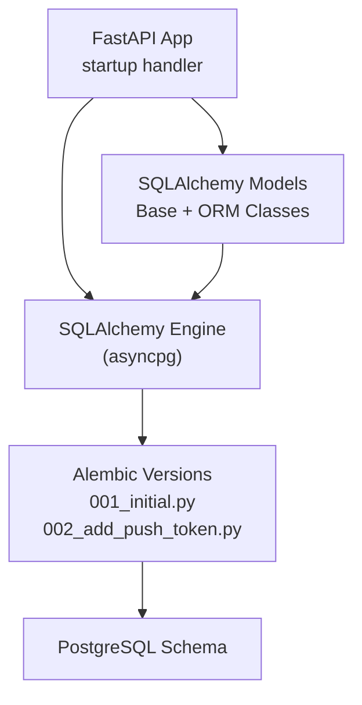
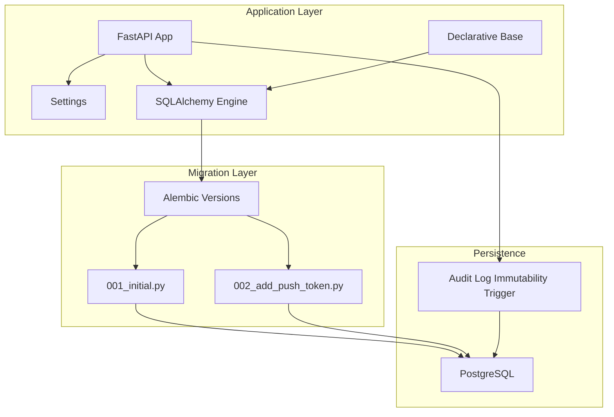
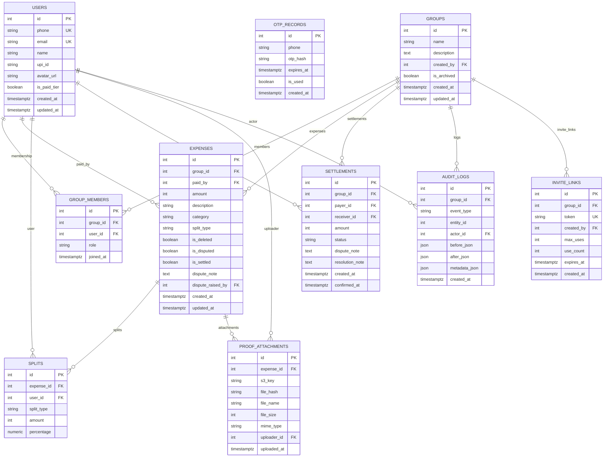
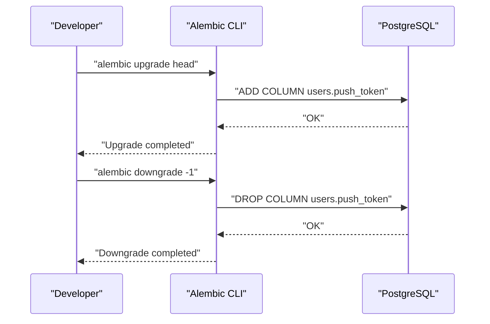
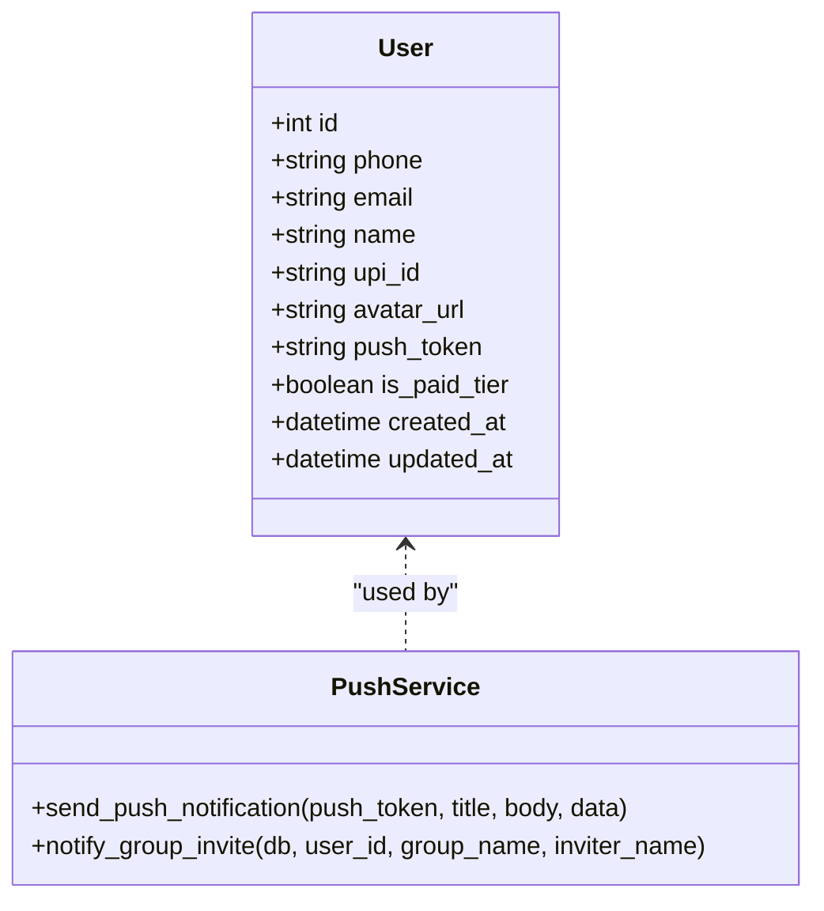
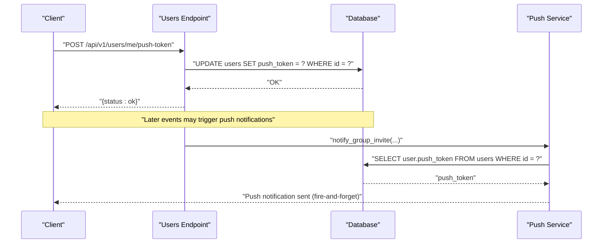
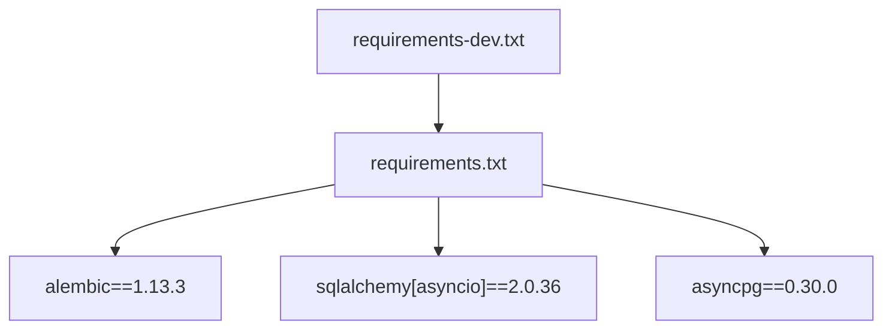

# Migration and Versioning Strategy

<cite>
**Referenced Files in This Document**
- [001_initial.py](file://backend/alembic/versions/001_initial.py)
- [002_add_push_token.py](file://backend/alembic/versions/002_add_push_token.py)
- [database.py](file://backend/app/core/database.py)
- [user.py](file://backend/app/models/user.py)
- [main.py](file://backend/app/main.py)
- [config.py](file://backend/app/core/config.py)
- [requirements.txt](file://backend/requirements.txt)
- [requirements-dev.txt](file://backend/requirements-dev.txt)
- [push_service.py](file://backend/app/services/push_service.py)
- [users.py](file://backend/app/api/v1/endpoints/users.py)
</cite>

## Table of Contents
1. [Introduction](#introduction)
2. [Project Structure](#project-structure)
3. [Core Components](#core-components)
4. [Architecture Overview](#architecture-overview)
5. [Detailed Component Analysis](#detailed-component-analysis)
6. [Dependency Analysis](#dependency-analysis)
7. [Performance Considerations](#performance-considerations)
8. [Troubleshooting Guide](#troubleshooting-guide)
9. [Conclusion](#conclusion)
10. [Appendices](#appendices)

## Introduction
This document explains SplitSure’s database migration and schema versioning strategy using Alembic. It covers the initial schema creation in migration 001_initial.py, the subsequent push token addition in 002_add_push_token.py, and how the application integrates Alembic with SQLAlchemy and FastAPI. It also documents configuration, environment setup, migration workflow, forward/backward execution, version tracking, and operational best practices for production deployments, including zero-downtime considerations, rollback procedures, and testing/validation strategies.

## Project Structure
SplitSure’s backend organizes Alembic migrations under backend/alembic/versions with two migrations:
- Initial schema creation: 001_initial.py
- Push token column addition: 002_add_push_token.py

The application defines asynchronous SQLAlchemy models and a shared Base class. The FastAPI startup routine ensures database tables are created and the audit log immutability trigger is installed.

**Diagram sources**
- [main.py:68-86](file://backend/app/main.py#L68-L86)
- [database.py:1-29](file://backend/app/core/database.py#L1-L29)
- [001_initial.py:17-185](file://backend/alembic/versions/001_initial.py#L17-L185)
- [002_add_push_token.py:17-23](file://backend/alembic/versions/002_add_push_token.py#L17-L23)

**Section sources**
- [main.py:68-86](file://backend/app/main.py#L68-L86)
- [database.py:1-29](file://backend/app/core/database.py#L1-L29)
- [001_initial.py:17-185](file://backend/alembic/versions/001_initial.py#L17-L185)
- [002_add_push_token.py:17-23](file://backend/alembic/versions/002_add_push_token.py#L17-L23)

## Core Components
- Alembic migrations:
  - 001_initial.py creates core tables, indexes, foreign keys, and the audit log immutability trigger.
  - 002_add_push_token.py adds the push_token column to the users table.
- SQLAlchemy configuration:
  - Asynchronous engine using asyncpg.
  - Shared declarative Base for ORM models.
- Application integration:
  - Startup routine creates tables and installs the audit trigger.
  - Models define domain entities and relationships.
- Dependencies:
  - Alembic and SQLAlchemy are declared in requirements.txt.

Key migration artifacts:
- Revision IDs and down_revision links establish the migration chain.
- Upgrade/downgrade functions encapsulate forward and backward changes.

**Section sources**
- [001_initial.py:3-14](file://backend/alembic/versions/001_initial.py#L3-L14)
- [002_add_push_token.py:3-14](file://backend/alembic/versions/002_add_push_token.py#L3-L14)
- [database.py:1-29](file://backend/app/core/database.py#L1-L29)
- [main.py:68-86](file://backend/app/main.py#L68-L86)

## Architecture Overview
The migration architecture combines:
- Alembic-managed schema versions stored under alembic/versions.
- SQLAlchemy ORM models that align with the database schema.
- FastAPI startup ensuring schema alignment and trigger installation.
- PostgreSQL as the target database.

**Diagram sources**
- [main.py:68-86](file://backend/app/main.py#L68-L86)
- [database.py:1-29](file://backend/app/core/database.py#L1-L29)
- [001_initial.py:17-185](file://backend/alembic/versions/001_initial.py#L17-L185)
- [002_add_push_token.py:17-23](file://backend/alembic/versions/002_add_push_token.py#L17-L23)

## Detailed Component Analysis

### Initial Schema Migration (001_initial.py)
This migration establishes the foundational schema:
- Users table with unique phone/email, optional profile fields, and timestamps.
- OTP records table for authentication lifecycle.
- Groups table with creator linkage and archival flag.
- Group members table with unique constraint on (group_id, user_id) and role defaults.
- Expenses table with amount stored in paise, category and split type enums, dispute/settlement flags, and foreign keys to users and groups.
- Splits table linking expenses to users with split type and amounts/percentages.
- Settlements table with status and dispute/resolution metadata.
- Audit logs table with JSON fields and indexes for efficient querying.
- Proof attachments table for expense proofs.
- Invite links table with token uniqueness and usage tracking.
- Audit log immutability trigger enforcing append-only semantics.

**Diagram sources**
- [001_initial.py:18-154](file://backend/alembic/versions/001_initial.py#L18-L154)
- [user.py:51-234](file://backend/app/models/user.py#L51-L234)

Forward and backward execution:
- Upgrade builds all tables, indexes, and the audit trigger.
- Downgrade drops tables in reverse order and removes the trigger.

**Section sources**
- [001_initial.py:17-185](file://backend/alembic/versions/001_initial.py#L17-L185)
- [user.py:51-234](file://backend/app/models/user.py#L51-L234)

### Push Token Addition Migration (002_add_push_token.py)
This migration adds a nullable push_token column to the users table and provides a downgrade to remove it.

**Diagram sources**
- [002_add_push_token.py:17-23](file://backend/alembic/versions/002_add_push_token.py#L17-L23)

**Section sources**
- [002_add_push_token.py:17-23](file://backend/alembic/versions/002_add_push_token.py#L17-L23)

### Alembic Configuration and Environment Setup
- Database connectivity is configured via DATABASE_URL in settings.
- The application uses an asynchronous SQLAlchemy engine with asyncpg.
- Alembic dependencies are declared in requirements.txt.
- The startup routine ensures tables are created and the audit trigger is installed.

Operational notes:
- DATABASE_URL controls the target database for migrations.
- The application registers models with SQLAlchemy metadata to align ORM and schema.

**Section sources**
- [config.py:8](file://backend/app/core/config.py#L8)
- [database.py:5-16](file://backend/app/core/database.py#L5-L16)
- [requirements.txt:5](file://backend/requirements.txt#L5)
- [main.py:68-86](file://backend/app/main.py#L68-L86)

### Migration Workflow
- Forward migration (apply changes): alembic upgrade head
- Backward migration (rollback one step): alembic downgrade -1
- Version tracking: Alembic maintains a version table; revision IDs and down_revision define the chain.
- Database state management: The startup routine ensures schema alignment and trigger presence.

Best practices:
- Always write idempotent upgrades and safe downgrades.
- Test migrations against a staging database mirroring production.
- Use atomic operations and avoid long-running transactions.

**Section sources**
- [001_initial.py:3-14](file://backend/alembic/versions/001_initial.py#L3-L14)
- [002_add_push_token.py:3-14](file://backend/alembic/versions/002_add_push_token.py#L3-L14)
- [main.py:68-86](file://backend/app/main.py#L68-L86)

### Data Model Alignment
The SQLAlchemy models mirror the schema created by 001_initial.py and extended by 002_add_push_token.py. The push_token column is present in the User model and used by the push notification service.

**Diagram sources**
- [user.py:51-68](file://backend/app/models/user.py#L51-L68)
- [push_service.py:16-73](file://backend/app/services/push_service.py#L16-L73)

**Section sources**
- [user.py:51-68](file://backend/app/models/user.py#L51-L68)
- [push_service.py:16-73](file://backend/app/services/push_service.py#L16-L73)

### API Integration for Push Tokens
The users endpoint supports registering a push token for the current user. The push service consumes this token to send notifications.

**Diagram sources**
- [users.py:86-99](file://backend/app/api/v1/endpoints/users.py#L86-L99)
- [push_service.py:47-73](file://backend/app/services/push_service.py#L47-L73)

**Section sources**
- [users.py:86-99](file://backend/app/api/v1/endpoints/users.py#L86-L99)
- [push_service.py:47-73](file://backend/app/services/push_service.py#L47-L73)

## Dependency Analysis
- Alembic 1.13.3 is declared in requirements.txt.
- SQLAlchemy 2.0.36 and asyncpg 0.30.0 support asynchronous operations.
- The application depends on these libraries for migrations and runtime database access.

**Diagram sources**
- [requirements.txt:5](file://backend/requirements.txt#L5)
- [requirements.txt:3](file://backend/requirements.txt#L3)
- [requirements.txt:4](file://backend/requirements.txt#L4)
- [requirements-dev.txt:1](file://backend/requirements-dev.txt#L1)

**Section sources**
- [requirements.txt:3-5](file://backend/requirements.txt#L3-L5)
- [requirements-dev.txt:1](file://backend/requirements-dev.txt#L1)

## Performance Considerations
- Use indexes strategically (e.g., phone, token, and composite indexes on audit logs) to optimize lookups.
- Keep migrations minimal and additive where possible to reduce downtime.
- Batch operations during upgrades when adding non-critical columns.
- Monitor long-running migrations and consider maintenance windows for large datasets.

## Troubleshooting Guide
Common issues and resolutions:
- Stuck migrations:
  - Verify Alembic version table and revision chain.
  - Use downgrade -1 to step back, fix the issue, then re-run upgrade.
- Schema inconsistencies:
  - Align models with migrations; ensure DATABASE_URL points to the correct database.
  - Recreate tables only in controlled environments (e.g., dev) using the startup routine.
- Audit log immutability errors:
  - The trigger prevents updates/deletes on audit_logs; design workflows to append-only writes.
- Rollback failures:
  - Confirm downgrade functions exist and are reversible; test downgrade in staging.

Validation steps:
- Run alembic current and heads to confirm version state.
- Execute alembic upgrade --dry-run to preview changes.
- Validate data integrity post-migration with targeted queries.

**Section sources**
- [001_initial.py:156-169](file://backend/alembic/versions/001_initial.py#L156-L169)
- [main.py:68-86](file://backend/app/main.py#L68-L86)

## Conclusion
SplitSure’s migration strategy leverages Alembic to manage schema evolution safely. The initial migration establishes a robust relational schema with auditability, while the second migration introduces a non-critical column for push notifications. The application integrates migrations with SQLAlchemy and FastAPI startup to maintain schema consistency. Following the recommended practices ensures reliable, testable, and production-safe database changes.

## Appendices

### Migration Naming Conventions
- Use sequential numeric prefixes (e.g., 001_initial, 002_add_push_token).
- Keep revision IDs short but descriptive.
- Ensure down_revision correctly references the previous migration.

### Branching and Conflict Resolution
- Feature branches should create independent migrations; avoid concurrent edits to the same table/column.
- Rebase or merge migrations carefully; resolve conflicts by adjusting SQL statements and ensuring idempotency.
- Use alembic merge to combine divergent histories when necessary.

### Production Deployment Strategies
- Perform migrations during scheduled maintenance windows.
- Use blue/green deployments to minimize downtime; run migrations before switching traffic.
- Back up the database before applying migrations in production.
- Monitor application logs and database triggers post-deployment.

### Testing Procedures
- Write unit tests validating schema changes and data transformations.
- Use a separate test database to run alembic upgrade/downgrade cycles.
- Validate referential integrity and indexes after migrations.