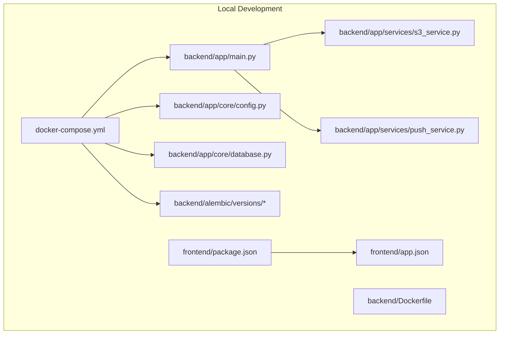
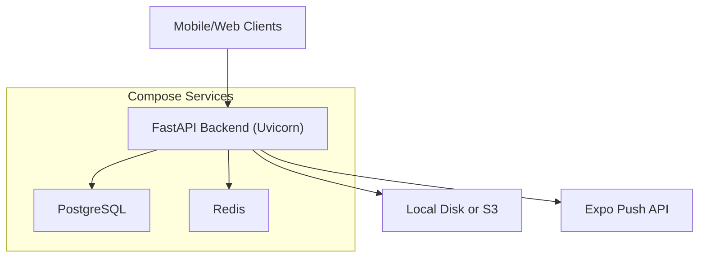
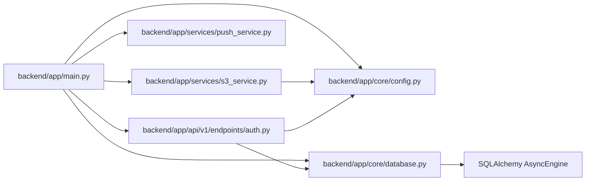

# Deployment and Operations

<cite>
**Referenced Files in This Document**
- [docker-compose.yml](file://docker-compose.yml)
- [Dockerfile](file://backend/Dockerfile)
- [main.py](file://backend/app/main.py)
- [config.py](file://backend/app/core/config.py)
- [database.py](file://backend/app/core/database.py)
- [requirements.txt](file://backend/requirements.txt)
- [README.md](file://README.md)
- [001_initial.py](file://backend/alembic/versions/001_initial.py)
- [002_add_push_token.py](file://backend/alembic/versions/002_add_push_token.py)
- [s3_service.py](file://backend/app/services/s3_service.py)
- [push_service.py](file://backend/app/services/push_service.py)
- [auth.py](file://backend/app/api/v1/endpoints/auth.py)
- [package.json](file://frontend/package.json)
- [app.json](file://frontend/app.json)
</cite>

## Table of Contents
1. [Introduction](#introduction)
2. [Project Structure](#project-structure)
3. [Core Components](#core-components)
4. [Architecture Overview](#architecture-overview)
5. [Detailed Component Analysis](#detailed-component-analysis)
6. [Dependency Analysis](#dependency-analysis)
7. [Performance Considerations](#performance-considerations)
8. [Troubleshooting Guide](#troubleshooting-guide)
9. [Conclusion](#conclusion)
10. [Appendices](#appendices)

## Introduction
This document provides comprehensive deployment and operations guidance for the SplitSure application. It covers development environment setup, production deployment, operational procedures, container orchestration, environment variable management, local debugging, production deployment with Alembic migrations, security hardening, monitoring, scaling, backups, CI/CD integration, troubleshooting, disaster recovery, and maintenance.

## Project Structure
SplitSure comprises:
- Backend: FastAPI application with asynchronous SQLAlchemy ORM, PostgreSQL, Redis, Alembic migrations, and optional S3 storage.
- Frontend: Expo Router-based React Native application.
- Orchestration: Docker Compose for local multi-service setup.

**Diagram sources**
- [docker-compose.yml:1-82](file://docker-compose.yml#L1-L82)
- [Dockerfile:1-15](file://backend/Dockerfile#L1-L15)
- [main.py:1-96](file://backend/app/main.py#L1-L96)
- [config.py:1-71](file://backend/app/core/config.py#L1-L71)
- [database.py:1-29](file://backend/app/core/database.py#L1-L29)
- [s3_service.py:1-158](file://backend/app/services/s3_service.py#L1-L158)
- [push_service.py:1-43](file://backend/app/services/push_service.py#L1-L43)
- [package.json:1-62](file://frontend/package.json#L1-L62)
- [app.json:1-32](file://frontend/app.json#L1-L32)

**Section sources**
- [docker-compose.yml:1-82](file://docker-compose.yml#L1-L82)
- [Dockerfile:1-15](file://backend/Dockerfile#L1-L15)
- [README.md:1-162](file://README.md#L1-L162)

## Core Components
- Containerized backend service with hot reload for development and Uvicorn in production.
- PostgreSQL for relational data and Redis for caching and token blacklist.
- Config-driven behavior switching between local storage and S3, dev OTP vs provider OTP, and CORS origins.
- Alembic-managed database migrations.
- Security headers middleware and append-only audit logs enforced by triggers.
- File upload service supporting local disk and S3 with MIME validation and hashing.
- Push notifications via Expo Push API.

**Section sources**
- [docker-compose.yml:28-77](file://docker-compose.yml#L28-L77)
- [main.py:16-96](file://backend/app/main.py#L16-L96)
- [config.py:6-71](file://backend/app/core/config.py#L6-L71)
- [database.py:5-29](file://backend/app/core/database.py#L5-L29)
- [requirements.txt:1-19](file://backend/requirements.txt#L1-L19)
- [s3_service.py:1-158](file://backend/app/services/s3_service.py#L1-L158)
- [push_service.py:1-43](file://backend/app/services/push_service.py#L1-L43)

## Architecture Overview
The system runs as three orchestrated containers: API, PostgreSQL, and Redis. The API exposes health checks, authentication, and group/expense/settlement endpoints. Storage is configurable between local disk and S3. Redis supports caching and token revocation.

**Diagram sources**
- [docker-compose.yml:1-82](file://docker-compose.yml#L1-L82)
- [main.py:16-96](file://backend/app/main.py#L16-L96)
- [s3_service.py:1-158](file://backend/app/services/s3_service.py#L1-L158)
- [push_service.py:1-43](file://backend/app/services/push_service.py#L1-L43)

## Detailed Component Analysis

### Backend Orchestration and Environment Variables
- Services: db, redis, api.
- Health checks: PostgreSQL healthcheck; API depends on db healthy and redis started.
- Environment variables include database URL, Redis URL, secret key, local storage toggles, S3 credentials, dev OTP toggle, Twilio variables, and CORS origins.
- Ports: PostgreSQL 5432, Redis 6379, API 8000 (mapped per environment).
- Volumes: Persist PostgreSQL data and uploaded files.

Operational implications:
- Use .env for secrets and overrides.
- For production, set SECRET_KEY to a strong value, disable dev OTP, configure S3, and enable HTTPS.
- Allow origins appropriate to your domains.

**Section sources**
- [docker-compose.yml:1-82](file://docker-compose.yml#L1-L82)
- [config.py:6-71](file://backend/app/core/config.py#L6-L71)
- [main.py:36-46](file://backend/app/main.py#L36-L46)

### Database and Migrations
- Engine configured with connection pooling and asyncpg.
- Startup creates tables and sets an append-only trigger on audit logs.
- Alembic revisions define initial schema and subsequent changes (e.g., adding push_token).

Production migration strategy:
- Run Alembic upgrade head during deployment.
- Keep migrations deterministic and reversible.

**Section sources**
- [database.py:5-29](file://backend/app/core/database.py#L5-L29)
- [main.py:68-86](file://backend/app/main.py#L68-L86)
- [001_initial.py:17-185](file://backend/alembic/versions/001_initial.py#L17-L185)
- [002_add_push_token.py:17-23](file://backend/alembic/versions/002_add_push_token.py#L17-L23)

### Storage Strategy: Local vs S3
- Local mode: mounted uploads directory served via /uploads/.
- S3 mode: uploads to bucket with presigned URLs for retrieval.
- File validation includes MIME signature checks and size limits.
- Audit policy retains files for compliance.

Operational guidance:
- For production, set USE_LOCAL_STORAGE=false and provide AWS credentials.
- Ensure bucket policies restrict access and enforce TLS.

**Section sources**
- [main.py:48-56](file://backend/app/main.py#L48-L56)
- [s3_service.py:1-158](file://backend/app/services/s3_service.py#L1-L158)
- [config.py:16-29](file://backend/app/core/config.py#L16-L29)

### Authentication and Security Headers
- Security headers middleware enforces HSTS only in production.
- OTP generation uses cryptographically secure randomness.
- Rate limiting prevents OTP abuse.
- Logout invalidates tokens via blacklist.

Security hardening:
- Enforce HTTPS and HSTS in production.
- Rotate SECRET_KEY regularly.
- Use provider OTP (Twilio/MSG91) and disable dev OTP.

**Section sources**
- [main.py:25-34](file://backend/app/main.py#L25-L34)
- [auth.py:24-34](file://backend/app/api/v1/endpoints/auth.py#L24-L34)
- [auth.py:58-80](file://backend/app/api/v1/endpoints/auth.py#L58-L80)
- [auth.py:139-147](file://backend/app/api/v1/endpoints/auth.py#L139-L147)

### Push Notifications
- Non-blocking, fire-and-forget via Expo Push API.
- Errors are logged but do not fail the main request.

**Section sources**
- [push_service.py:1-43](file://backend/app/services/push_service.py#L1-L43)

### Frontend Integration
- Expo Router app with platform-specific configurations.
- API base URL configured via environment variable.
- Android cleartext traffic enabled for development.

**Section sources**
- [package.json:1-62](file://frontend/package.json#L1-L62)
- [app.json:10-12](file://frontend/app.json#L10-L12)
- [README.md:53-57](file://README.md#L53-L57)

## Dependency Analysis

**Diagram sources**
- [main.py:1-96](file://backend/app/main.py#L1-L96)
- [config.py:1-71](file://backend/app/core/config.py#L1-L71)
- [database.py:1-29](file://backend/app/core/database.py#L1-L29)
- [s3_service.py:1-158](file://backend/app/services/s3_service.py#L1-L158)
- [push_service.py:1-43](file://backend/app/services/push_service.py#L1-L43)
- [auth.py:1-147](file://backend/app/api/v1/endpoints/auth.py#L1-L147)

**Section sources**
- [requirements.txt:1-19](file://backend/requirements.txt#L1-L19)
- [database.py:5-29](file://backend/app/core/database.py#L5-L29)
- [s3_service.py:66-73](file://backend/app/services/s3_service.py#L66-L73)

## Performance Considerations
- Connection pooling: tune pool_size and max_overflow for workload.
- Redis memory: cap memory and eviction policy for token blacklist and cache.
- File uploads: validate MIME and enforce size limits to reduce storage pressure.
- Caching: leverage Redis for session tokens and short-lived data.
- Database: keep migrations minimal and index appropriately.

[No sources needed since this section provides general guidance]

## Troubleshooting Guide
Common issues and resolutions:
- Database not ready: ensure db healthcheck passes before starting API.
- Missing S3 credentials: when USE_LOCAL_STORAGE=false, set AWS_* variables.
- Dev OTP mode: disable dev OTP and configure provider for production.
- CORS errors: adjust ALLOWED_ORIGINS to include your frontend domains.
- Upload failures: verify MIME type and size limits; check local disk permissions or S3 bucket policies.
- Push notifications: confirm Expo push token format and network connectivity.

**Section sources**
- [docker-compose.yml:14-18](file://docker-compose.yml#L14-L18)
- [docker-compose.yml:69-73](file://docker-compose.yml#L69-L73)
- [config.py:38-44](file://backend/app/core/config.py#L38-L44)
- [s3_service.py:114-123](file://backend/app/services/s3_service.py#L114-L123)
- [push_service.py:24-25](file://backend/app/services/push_service.py#L24-L25)

## Conclusion
SplitSure’s deployment model is container-first with clear separation of concerns. By following the environment variable strategy, enabling production-grade OTP and storage, running Alembic migrations, and applying security hardening, teams can operate a reliable, scalable system. Use Redis for caching and token revocation, and adopt CI/CD with automated testing and migrations for safe deployments.

[No sources needed since this section summarizes without analyzing specific files]

## Appendices

### A. Development Environment Setup
- Install prerequisites: Docker Desktop, Node.js, Python.
- Copy backend env template and start services.
- Apply migrations after bringing up the stack.
- Access API endpoints, health, and docs.

**Section sources**
- [README.md:24-45](file://README.md#L24-L45)
- [README.md:34-38](file://README.md#L34-L38)

### B. Production Deployment Checklist
- Set a strong SECRET_KEY.
- Disable dev OTP and configure provider (Twilio/MSG91).
- Switch to S3 by setting USE_LOCAL_STORAGE=false and providing AWS credentials.
- Enable HTTPS and HSTS.
- Run Alembic upgrade head during deployment.
- Add CI quality gates: TypeScript typecheck and backend tests.
- Add Redis-backed token revocation for logout invalidation.

**Section sources**
- [README.md:144-153](file://README.md#L144-L153)
- [config.py:30-36](file://backend/app/core/config.py#L30-L36)
- [config.py:23-28](file://backend/app/core/config.py#L23-L28)
- [main.py:32-33](file://backend/app/main.py#L32-L33)

### C. Operational Procedures
- Backup and recovery:
  - PostgreSQL: schedule logical backups and test restore procedures.
  - S3: ensure versioning and lifecycle policies; retain proofs per audit.
- Security updates:
  - Pin container images and rebuild; monitor base image vulnerabilities.
  - Rotate SECRET_KEY and invalidate sessions.
- Monitoring:
  - Expose metrics endpoints and integrate with your observability stack.
  - Monitor API latency, error rates, DB connections, and Redis memory.
- Capacity planning:
  - Scale API horizontally behind a load balancer.
  - Provision DB and Redis with adequate CPU/memory and disk IOPS.

[No sources needed since this section provides general guidance]

### D. Scaling Patterns
- Horizontal scaling:
  - Run multiple API replicas behind a reverse proxy or load balancer.
  - Use sticky sessions only if necessary; otherwise rely on stateless design.
- Load balancing:
  - Distribute traffic across API instances; ensure health checks target /health.
- Database optimization:
  - Use connection pooling; add indexes for frequent queries.
- Caching:
  - Store short-lived JWTs and session data in Redis; apply LRU eviction.

[No sources needed since this section provides general guidance]

### E. CI/CD Integration
- Build and test:
  - Build backend image, run pytest, and typecheck frontend.
- Deploy:
  - Tag releases, push images, and run Alembic upgrade head.
- Rollback:
  - Re-deploy previous image tag and roll back migration if needed.

[No sources needed since this section provides general guidance]

### F. Disaster Recovery and Business Continuity
- DR plan:
  - Maintain offsite PostgreSQL backups and S3 bucket replication.
  - Automate failover of API and DB endpoints.
- Maintenance:
  - Perform maintenance windows with blue/green or rolling deployments.
  - Validate health and migrations post-maintenance.

[No sources needed since this section provides general guidance]