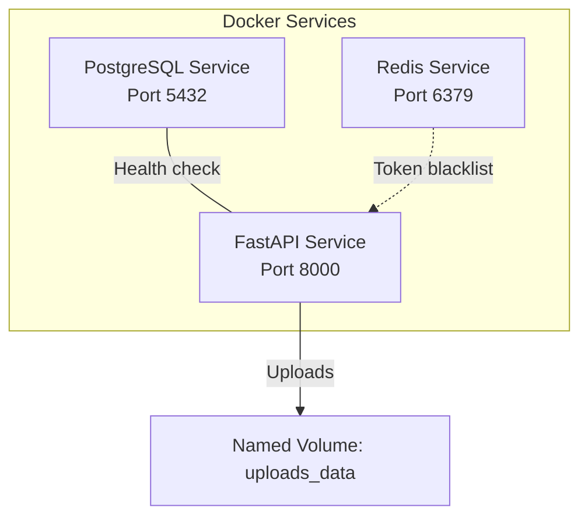

# Development Environment Setup

<cite>
**Referenced Files in This Document**
- [docker-compose.yml](file://docker-compose.yml)
- [Dockerfile](file://backend/Dockerfile)
- [requirements.txt](file://backend/requirements.txt)
- [requirements-dev.txt](file://backend/requirements-dev.txt)
- [config.py](file://backend/app/core/config.py)
- [database.py](file://backend/app/core/database.py)
- [main.py](file://backend/app/main.py)
- [auth.py](file://backend/app/api/v1/endpoints/auth.py)
- [security.py](file://backend/app/core/security.py)
- [pytest.ini](file://backend/pytest.ini)
- [README.md](file://README.md)
- [package.json](file://frontend/package.json)
</cite>

## Table of Contents
1. [Introduction](#introduction)
2. [Prerequisites and Initial Setup](#prerequisites-and-initial-setup)
3. [Docker Compose Orchestration](#docker-compose-orchestration)
4. [Environment Variables Configuration](#environment-variables-configuration)
5. [Local Development Workflow](#local-development-workflow)
6. [Dependency Management](#dependency-management)
7. [Development Server Configuration](#development-server-configuration)
8. [Database and Storage Setup](#database-and-storage-setup)
9. [OTP Provider Configuration](#otp-provider-configuration)
10. [CORS and Security Settings](#cors-and-security-settings)
11. [Local Testing Procedures](#local-testing-procedures)
12. [Debugging Strategies](#debugging-strategies)
13. [Common Issues and Troubleshooting](#common-issues-and-troubleshooting)
14. [Performance Optimization](#performance-optimization)
15. [Conclusion](#conclusion)

## Introduction
This document provides comprehensive development environment setup instructions for the SplitSure application. It covers Docker Compose multi-service orchestration with PostgreSQL, Redis, and the FastAPI backend, environment variable configuration, local development workflow, dependency management, and debugging strategies. The goal is to enable developers to quickly spin up a fully functional local development environment and iterate efficiently.

## Prerequisites and Initial Setup
- Install Docker Desktop for your operating system.
- Install Node.js 18+ for frontend development.
- Install Python 3.13+ for backend development.
- Clone the repository and navigate to the project root directory.

Initial setup steps:
- Copy the backend environment template to create `.env`:
  - Command: `copy backend\.env.example backend\.env`
- Bring up the services in detached mode:
  - Command: `docker compose up -d`
- Initialize the database schema:
  - Command: `docker compose exec api alembic upgrade head`

API endpoints:
- App API: `http://localhost:8000/api/v1`
- Health check: `http://localhost:8000/health`
- Swagger documentation: `http://localhost:8000/docs`

**Section sources**
- [README.md:24-70](file://README.md#L24-L70)

## Docker Compose Orchestration
The Docker Compose configuration orchestrates three primary services:
- PostgreSQL database (image: postgres:16-alpine) with persistent volume for data and health checks.
- Redis cache/token blacklist (image: redis:7-alpine) with memory limits.
- FastAPI backend (built from backend/Dockerfile) exposing port 8000 and depending on healthy database and started Redis.

Key orchestration details:
- Port mappings: db:5432, redis:6379, api:8000.
- Named volumes: postgres_data, uploads_data for persistence.
- Hot reload: backend volume mount from ./backend to /app.
- Startup command: uvicorn with reload enabled for development.

**Diagram sources**
- [docker-compose.yml:1-82](file://docker-compose.yml#L1-L82)

**Section sources**
- [docker-compose.yml:1-82](file://docker-compose.yml#L1-L82)

## Environment Variables Configuration
The backend reads configuration via Pydantic Settings from environment variables. The Docker Compose file defines defaults for:
- Database connection: DATABASE_URL pointing to the db service.
- Redis connection: REDIS_URL pointing to the redis service.
- Security: SECRET_KEY with a development default.
- Storage: USE_LOCAL_STORAGE=true, LOCAL_UPLOAD_DIR=/app/uploads, LOCAL_BASE_URL=http://10.0.2.2:8000.
- AWS S3: Credentials left empty when using local storage.
- OTP: USE_DEV_OTP=true for development; Twilio variables left empty.
- CORS: ALLOWED_ORIGINS configured for localhost and Android emulator.

The backend settings class defines defaults for:
- DATABASE_URL with localhost fallback.
- SECRET_KEY minimum length validation.
- USE_LOCAL_STORAGE, LOCAL_UPLOAD_DIR, LOCAL_BASE_URL.
- AWS S3 settings and presigned URL expiry.
- OTP provider settings (MSG91) and rate limiting.
- CORS origins and application limits.

Security and validation:
- SECRET_KEY must be at least 16 characters.
- OTP_EXPIRE_MINUTES constrained between 1 and 60.

**Section sources**
- [docker-compose.yml:34-66](file://docker-compose.yml#L34-L66)
- [config.py:6-71](file://backend/app/core/config.py#L6-L71)

## Local Development Workflow
Hot-reload and volume mounting:
- Source code hot-reload: ./backend mounted to /app in the api service.
- Uploads persistence: ./backend/uploads mapped to /app/uploads via named volume.

Port mapping:
- API service exposes port 8000; configurable via PORT environment variable.

Development server:
- Uvicorn runs with reload enabled for rapid iteration during development.

Frontend integration:
- Install frontend dependencies: `npm install`
- Configure EXPO_PUBLIC_API_URL to point to the local backend API.
- Start the frontend: `npx expo start`

**Section sources**
- [docker-compose.yml:74-77](file://docker-compose.yml#L74-L77)
- [README.md:46-63](file://README.md#L46-L63)
- [package.json:1-62](file://frontend/package.json#L1-L62)

## Dependency Management
Backend dependencies:
- Production requirements are defined in requirements.txt.
- Development requirements (pytest) are defined in requirements-dev.txt, which includes production requirements.

Frontend dependencies:
- Dependencies and scripts are defined in frontend/package.json.

Python virtual environment:
- The repository includes a Windows-specific invocation for pytest in the quality gates section.
- For general development, use the Dockerized environment or set up a local virtual environment as preferred.

**Section sources**
- [requirements.txt:1-19](file://backend/requirements.txt#L1-L19)
- [requirements-dev.txt:1-3](file://backend/requirements-dev.txt#L1-L3)
- [README.md:101-112](file://README.md#L101-L112)
- [package.json:1-62](file://frontend/package.json#L1-L62)

## Development Server Configuration
The backend Dockerfile:
- Uses Python 3.12 slim base image.
- Installs system dependencies (gcc, libpq-dev) for building Python packages.
- Copies requirements.txt and installs dependencies.
- Copies application code and exposes port 8000.
- Default CMD runs Uvicorn on port ${PORT:-8000}.

The main application:
- Creates a FastAPI app with security headers middleware and CORS configuration.
- Mounts static uploads directory when using local storage.
- Includes routers under /api/v1.
- On startup, creates database tables and sets up an immutable audit log trigger.
- Provides a health endpoint indicating storage mode and OTP mode.

**Section sources**
- [Dockerfile:1-15](file://backend/Dockerfile#L1-L15)
- [main.py:16-96](file://backend/app/main.py#L16-L96)

## Database and Storage Setup
Database configuration:
- Async SQLAlchemy engine configured with connection pooling.
- Default DATABASE_URL points to localhost; Docker Compose overrides it to use the db service.

Storage configuration:
- Local file storage is enabled by default for development.
- Uploaded proofs are served via static files when USE_LOCAL_STORAGE=true.
- LOCAL_UPLOAD_DIR and LOCAL_BASE_URL define the upload directory and public base URL.

Volume persistence:
- Named volume uploads_data persists uploaded files across container restarts.

**Section sources**
- [database.py:5-29](file://backend/app/core/database.py#L5-L29)
- [config.py:16-28](file://backend/app/core/config.py#L16-L28)
- [docker-compose.yml:46-49](file://docker-compose.yml#L46-L49)
- [main.py:48-55](file://backend/app/main.py#L48-L55)

## OTP Provider Configuration
Development OTP:
- USE_DEV_OTP=true enables development mode where OTPs are returned in API responses instead of being sent via SMS.
- Rate limiting prevents excessive OTP requests per hour.

Production OTP:
- To disable development mode, set USE_DEV_OTP=false and configure MSG91 credentials (AUTH_KEY and TEMPLATE_ID).
- Twilio variables are optional and can be left empty when USE_DEV_OTP=true.

Security considerations:
- The application logs a warning when running with dev OTP and a development secret key combination.

**Section sources**
- [docker-compose.yml:57-63](file://docker-compose.yml#L57-L63)
- [config.py:30-37](file://backend/app/core/config.py#L30-L37)
- [auth.py:58-79](file://backend/app/api/v1/endpoints/auth.py#L58-L79)
- [main.py:61-65](file://backend/app/main.py#L61-L65)

## CORS and Security Settings
CORS configuration:
- ALLOWED_ORIGINS includes localhost ports and Android emulator address for seamless frontend-backend communication.

Security headers:
- SecurityHeadersMiddleware adds security-related headers to responses.
- Strict-Transport-Security is included only when not using dev OTP mode.

Secret key validation:
- SECRET_KEY must meet a minimum length requirement enforced by the settings validator.

**Section sources**
- [config.py:38-44](file://backend/app/core/config.py#L38-L44)
- [main.py:25-34](file://backend/app/main.py#L25-L34)
- [config.py:60-65](file://backend/app/core/config.py#L60-L65)

## Local Testing Procedures
Backend testing:
- Install development dependencies: `pip install -r backend/requirements-dev.txt`
- Run tests using pytest from the backend directory.

Frontend type checking:
- Run TypeScript type checking in the frontend directory.

**Section sources**
- [requirements-dev.txt:1-3](file://backend/requirements-dev.txt#L1-L3)
- [README.md:92-112](file://README.md#L92-L112)

## Debugging Strategies
- Use the health endpoint to verify service status and configuration mode.
- Enable database echo in the engine configuration for SQL debugging (echo=True).
- Check logs from Docker Compose for detailed error information.
- For frontend debugging, use Expo DevTools and network inspection.

**Section sources**
- [main.py:88-95](file://backend/app/main.py#L88-L95)
- [database.py:9](file://backend/app/core/database.py#L9)

## Common Issues and Troubleshooting
- Port conflicts: Ensure ports 5432 (PostgreSQL), 6379 (Redis), and 8000 (API) are free or adjust mappings.
- Volume permissions: Named volumes may require permission adjustments on some systems.
- CORS errors: Verify ALLOWED_ORIGINS includes the frontend origin and port.
- Database connectivity: Confirm DATABASE_URL points to the db service and that the service is healthy.
- OTP issues: Ensure USE_DEV_OTP is set appropriately and rate limits are respected.

**Section sources**
- [docker-compose.yml:10-18](file://docker-compose.yml#L10-L18)
- [docker-compose.yml:69-73](file://docker-compose.yml#L69-L73)
- [config.py:38-44](file://backend/app/core/config.py#L38-L44)

## Performance Optimization
- Use Redis for caching and token blacklist to reduce database load.
- Adjust Redis memory policy and limits according to your workload.
- Tune database connection pooling parameters in the engine configuration.
- Keep uploads directory on SSD for faster file operations.
- Use development mode settings for local iteration; switch to production settings for performance testing.

**Section sources**
- [docker-compose.yml:26](file://docker-compose.yml#L26)
- [database.py:7-10](file://backend/app/core/database.py#L7-L10)

## Conclusion
With Docker Compose, environment variables, and the provided configuration, you can quickly set up a complete development environment for SplitSure. The orchestration ensures PostgreSQL and Redis are available, the backend serves static uploads locally, and the development workflow supports hot-reload and efficient iteration. Follow the troubleshooting tips and performance recommendations to maintain a smooth development experience.