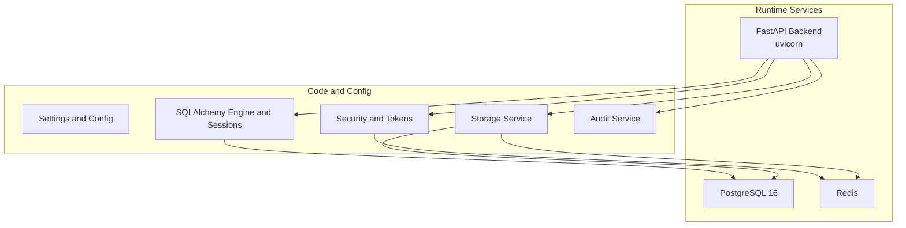
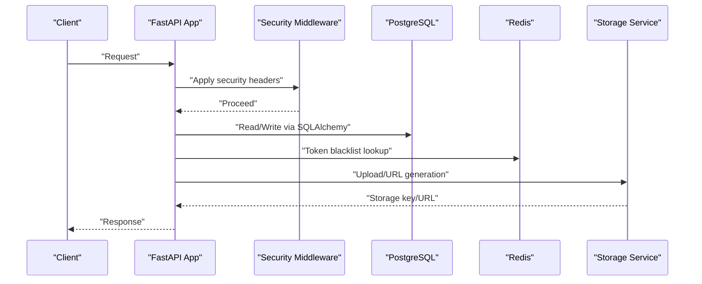
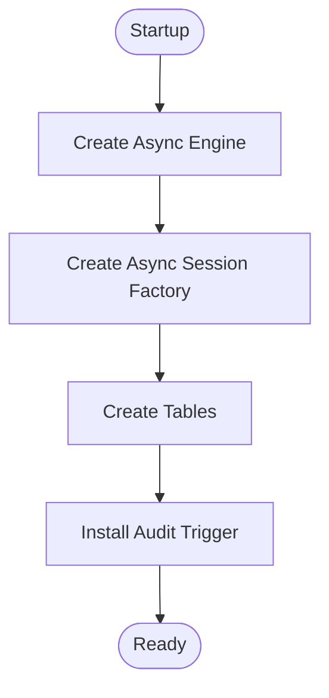
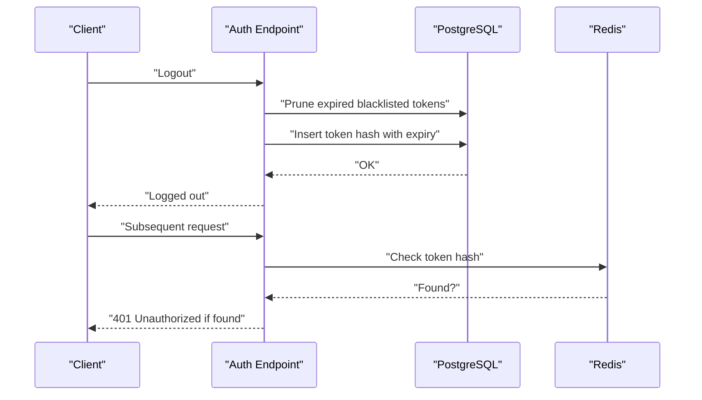
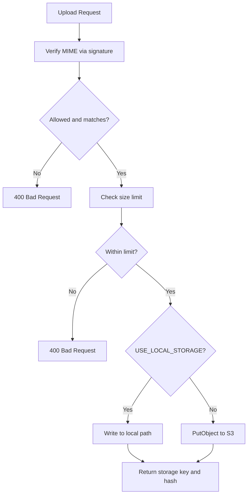
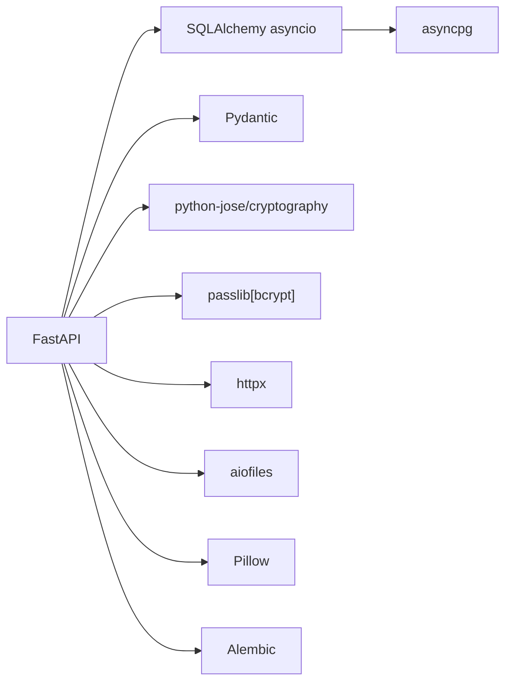

# Operational Maintenance

<cite>
**Referenced Files in This Document**
- [docker-compose.yml](file://docker-compose.yml)
- [Dockerfile](file://backend/Dockerfile)
- [requirements.txt](file://backend/requirements.txt)
- [config.py](file://backend/app/core/config.py)
- [database.py](file://backend/app/core/database.py)
- [main.py](file://backend/app/main.py)
- [security.py](file://backend/app/core/security.py)
- [s3_service.py](file://backend/app/services/s3_service.py)
- [audit_service.py](file://backend/app/services/audit_service.py)
- [auth.py](file://backend/app/api/v1/endpoints/auth.py)
- [expenses.py](file://backend/app/api/v1/endpoints/expenses.py)
- [user.py](file://backend/app/models/user.py)
- [001_initial.py](file://backend/alembic/versions/001_initial.py)
- [002_add_push_token.py](file://backend/alembic/versions/002_add_push_token.py)
</cite>

## Table of Contents
1. [Introduction](#introduction)
2. [Project Structure](#project-structure)
3. [Core Components](#core-components)
4. [Architecture Overview](#architecture-overview)
5. [Detailed Component Analysis](#detailed-component-analysis)
6. [Dependency Analysis](#dependency-dependencies)
7. [Performance Considerations](#performance-considerations)
8. [Backup and Recovery Procedures](#backup-and-recovery-procedures)
9. [Security Update Procedures](#security-update-procedures)
10. [Monitoring and Observability](#monitoring-and-observability)
11. [Capacity Planning](#capacity-planning)
12. [Routine Maintenance Tasks](#routine-maintenance-tasks)
13. [Disaster Recovery and Business Continuity](#disaster-recovery-and-business-continuity)
14. [Incident Response Protocols](#incident-response-protocols)
15. [Operational Troubleshooting](#operational-troubleshooting)
16. [Maintenance Schedules and Change Management](#maintenance-schedules-and-change-management)
17. [Operational Handover](#operational-handover)
18. [Conclusion](#conclusion)

## Introduction
This document provides comprehensive operational maintenance guidance for the SplitSure application. It covers ongoing operations, monitoring, backups, security updates, performance tuning, capacity planning, routine maintenance, disaster recovery, incident response, troubleshooting, and operational handover. The guidance is grounded in the repository’s configuration, runtime behavior, and operational components.

## Project Structure
SplitSure consists of:
- A FastAPI backend (Python) with asynchronous PostgreSQL connectivity and Redis caching.
- A local development stack orchestrated by Docker Compose, including PostgreSQL, Redis, and the backend service.
- Alembic migrations for database schema evolution.
- A storage abstraction supporting local filesystem and AWS S3.

**Diagram sources**
- [docker-compose.yml](file://docker-compose.yml)
- [config.py](file://backend/app/core/config.py)
- [database.py](file://backend/app/core/database.py)
- [security.py](file://backend/app/core/security.py)
- [s3_service.py](file://backend/app/services/s3_service.py)
- [audit_service.py](file://backend/app/services/audit_service.py)

**Section sources**
- [docker-compose.yml](file://docker-compose.yml)
- [Dockerfile](file://backend/Dockerfile)
- [requirements.txt](file://backend/requirements.txt)
- [config.py](file://backend/app/core/config.py)

## Core Components
- Configuration and environment variables define database, Redis, storage, OTP, CORS, and limits.
- Asynchronous SQLAlchemy engine and sessions manage database connections.
- Security middleware enforces headers; JWT tokens are validated and blacklisted.
- Storage service abstracts local filesystem and S3; uploads are verified and hashed.
- Audit service writes immutable audit logs protected by a PostgreSQL trigger.
- API endpoints implement authentication, expense management, and storage integration.

**Section sources**
- [config.py](file://backend/app/core/config.py)
- [database.py](file://backend/app/core/database.py)
- [security.py](file://backend/app/core/security.py)
- [s3_service.py](file://backend/app/services/s3_service.py)
- [audit_service.py](file://backend/app/services/audit_service.py)
- [auth.py](file://backend/app/api/v1/endpoints/auth.py)
- [expenses.py](file://backend/app/api/v1/endpoints/expenses.py)

## Architecture Overview
The backend exposes REST endpoints, authenticates via JWT, stores data in PostgreSQL, caches/blacklists tokens in Redis, and persists/references proof attachments via local storage or S3. Health checks and triggers enforce operational safeguards.

**Diagram sources**
- [main.py](file://backend/app/main.py)
- [security.py](file://backend/app/core/security.py)
- [database.py](file://backend/app/core/database.py)
- [s3_service.py](file://backend/app/services/s3_service.py)

## Detailed Component Analysis

### Configuration and Environment
- Database connection string, Redis URL, and secrets are configured via environment variables.
- Development defaults enable local storage and dev OTP mode.
- CORS origins and rate-limiting parameters are centrally defined.

**Section sources**
- [config.py](file://backend/app/core/config.py)
- [docker-compose.yml](file://docker-compose.yml)

### Database Connectivity and Session Management
- Asynchronous engine with tunable pool size and overflow.
- Session factory with expiration policy.
- Startup creates tables and installs an immutable audit-log trigger.

**Diagram sources**
- [database.py](file://backend/app/core/database.py)
- [main.py](file://backend/app/main.py)

**Section sources**
- [database.py](file://backend/app/core/database.py)
- [main.py](file://backend/app/main.py)
- [001_initial.py](file://backend/alembic/versions/001_initial.py)

### Security and Token Management
- JWT access and refresh tokens with configurable expiry.
- Token blacklist persisted in Redis; expired entries pruned on lookup.
- Middleware adds security headers; HSTS applied in production mode.

**Diagram sources**
- [security.py](file://backend/app/core/security.py)
- [auth.py](file://backend/app/api/v1/endpoints/auth.py)

**Section sources**
- [security.py](file://backend/app/core/security.py)
- [auth.py](file://backend/app/api/v1/endpoints/auth.py)
- [main.py](file://backend/app/main.py)

### Storage Service (Local vs S3)
- Local mode: files stored under a configured directory and served via static routes.
- S3 mode: uploads use server-side encryption; pre-signed URLs generated for retrieval.
- File type verification and size checks enforced before upload.

**Diagram sources**
- [s3_service.py](file://backend/app/services/s3_service.py)
- [expenses.py](file://backend/app/api/v1/endpoints/expenses.py)

**Section sources**
- [s3_service.py](file://backend/app/services/s3_service.py)
- [expenses.py](file://backend/app/api/v1/endpoints/expenses.py)
- [main.py](file://backend/app/main.py)

### Audit Logging
- Immutable audit logs enforced by a PostgreSQL trigger preventing UPDATE/DELETE.
- Events logged with actor, entity, and JSON payloads for compliance and traceability.

**Section sources**
- [audit_service.py](file://backend/app/services/audit_service.py)
- [001_initial.py](file://backend/alembic/versions/001_initial.py)
- [user.py](file://backend/app/models/user.py)

## Dependency Analysis
- Runtime dependencies include FastAPI, Uvicorn, SQLAlchemy asyncio, asyncpg, Alembic, Pydantic, cryptography, bcrypt, JWT, multipart parsing, reportlab, httpx, aiofiles, and Pillow.
- Optional boto3 is commented out; S3 integration requires uncommenting and configuring credentials.

**Diagram sources**
- [requirements.txt](file://backend/requirements.txt)

**Section sources**
- [requirements.txt](file://backend/requirements.txt)

## Performance Considerations
- Database pooling: tune pool_size and max_overflow for concurrent workload.
- Connection lifecycle: sessions expire on commit; ensure proper session usage to avoid leaks.
- Storage I/O: local mode writes to mounted volume; S3 mode relies on network throughput and latency.
- Redis memory: LRU eviction policy configured; monitor memory pressure.
- Logging: keep SQL echo disabled in production; use structured logs for observability.

[No sources needed since this section provides general guidance]

## Backup and Recovery Procedures

### PostgreSQL Database
- Data persistence: mounted volume for PostgreSQL data ensures persistence across container restarts.
- Recommended procedure:
  - Schedule periodic logical backups using pg_dump/pg_restore against the running service.
  - Validate backups by restoring to a staging environment.
  - Automate and monitor backup jobs; retain retention windows per policy.

**Section sources**
- [docker-compose.yml](file://docker-compose.yml)
- [001_initial.py](file://backend/alembic/versions/001_initial.py)

### Redis Cache
- Data persistence: Redis runs with limited memory and LRU eviction; no persistence file is mounted.
- Recommended procedure:
  - For audit/blacklist data, consider enabling Redis persistence or exporting/importing keys periodically.
  - Monitor memory usage and eviction policies; alert on high evictions.
  - If persistence is required, configure Redis to persist RDB/AOF and back up snapshots.

**Section sources**
- [docker-compose.yml](file://docker-compose.yml)

### Uploaded Files
- Local storage: mounted volume persists files across restarts.
- S3 storage: files are retained per audit policy; pre-signed URLs provide controlled access.
- Recommended procedure:
  - For local mode: back up the uploads volume regularly.
  - For S3 mode: maintain versioning and lifecycle policies; periodically audit bucket contents.
  - Retain hashes and metadata in the database to verify integrity during recovery.

**Section sources**
- [docker-compose.yml](file://docker-compose.yml)
- [s3_service.py](file://backend/app/services/s3_service.py)

## Security Update Procedures
- Dependency updates:
  - Pin major versions in requirements; update minor/patch versions regularly.
  - Run dependency scans and SCA tools; remediate vulnerabilities promptly.
- Vulnerability scanning:
  - Integrate SAST/DAST scans in CI/CD; scan images before deployment.
- Secret management:
  - Rotate SECRET_KEY and JWT algorithm settings; invalidate stale tokens.
  - Enforce HSTS in production; disable dev OTP and dev secret key in production.
- Network and runtime:
  - Restrict allowed origins; review CORS configuration.
  - Harden container runtime and network policies.

**Section sources**
- [requirements.txt](file://backend/requirements.txt)
- [config.py](file://backend/app/core/config.py)
- [main.py](file://backend/app/main.py)
- [security.py](file://backend/app/core/security.py)

## Monitoring and Observability
- Health endpoint: use the /health endpoint to validate service readiness and configuration mode.
- Database:
  - Track connection pool saturation and slow queries.
  - Monitor PostgreSQL metrics (connections, replication lag, WAL).
- Application:
  - Enable structured logging; export logs to centralized logging.
  - Instrument key endpoints and storage operations.
- Cache:
  - Track hit rates and memory usage for Redis.
- Storage:
  - Monitor disk usage for local uploads and S3 bucket metrics.

**Section sources**
- [main.py](file://backend/app/main.py)
- [database.py](file://backend/app/core/database.py)
- [s3_service.py](file://backend/app/services/s3_service.py)

## Capacity Planning
- Database optimization:
  - Index frequently queried columns (users.phone, audit_logs indices).
  - Normalize and partition large tables if growth demands.
- Storage management:
  - Estimate local storage needs based on file counts and sizes.
  - For S3, plan lifecycle policies and cost controls.
- Scaling strategies:
  - Scale vertically first; consider read replicas for reporting.
  - Horizontal scaling for API with load balancing and stateless design.
  - Offload heavy tasks to background workers if needed.

**Section sources**
- [001_initial.py](file://backend/alembic/versions/001_initial.py)
- [user.py](file://backend/app/models/user.py)

## Routine Maintenance Tasks
- Log rotation:
  - Configure log rotation for application logs; archive and prune old logs.
- Database cleanup:
  - Archive or purge old audit events per policy.
  - Clean expired OTP records and unused invites.
- Cache management:
  - Monitor and prune stale blacklist entries; ensure memory headroom.
- Certificate renewal:
  - Renew TLS certificates for domains serving the API and S3 pre-signed URLs.
- Configuration hygiene:
  - Review and rotate secrets; update allowed origins and limits.

**Section sources**
- [audit_service.py](file://backend/app/services/audit_service.py)
- [auth.py](file://backend/app/api/v1/endpoints/auth.py)
- [config.py](file://backend/app/core/config.py)

## Disaster Recovery and Business Continuity
- Recovery objectives:
  - Define RPO/RTO for database, cache, and file storage.
- Data recovery:
  - Restore PostgreSQL from backups; reapply migrations.
  - Recreate audit trigger and indexes post-restore.
- Cache restoration:
  - Rehydrate blacklist tokens from backups or reinitialize as needed.
- File recovery:
  - Restore uploads volume or re-upload from S3 if needed.
- Testing:
  - Conduct regular DR drills; validate restore and service startup.

**Section sources**
- [docker-compose.yml](file://docker-compose.yml)
- [001_initial.py](file://backend/alembic/versions/001_initial.py)

## Incident Response Protocols
- Authentication incidents:
  - Investigate token leakage; revoke affected sessions; rotate secrets.
- Storage incidents:
  - Validate file integrity using stored hashes; restore from backups if corrupted.
- Database incidents:
  - Check connection pool exhaustion; investigate slow queries and deadlocks.
- Cache incidents:
  - Monitor evictions and latency; scale or reconfigure memory policy.

**Section sources**
- [security.py](file://backend/app/core/security.py)
- [s3_service.py](file://backend/app/services/s3_service.py)
- [database.py](file://backend/app/core/database.py)

## Operational Troubleshooting
- Common issues:
  - Dev OTP and dev secret key warnings indicate non-production configuration.
  - CORS errors: verify allowed origins.
  - Storage failures: check local directory permissions or S3 credentials.
- Diagnostic steps:
  - Inspect /health endpoint for mode and storage configuration.
  - Review application logs for exceptions and warnings.
  - Validate database connectivity and migration status.
- Resolution strategies:
  - Adjust environment variables for production-grade settings.
  - Fix file permissions or S3 credentials; retry operations.
  - Scale resources or optimize queries based on metrics.

**Section sources**
- [main.py](file://backend/app/main.py)
- [config.py](file://backend/app/core/config.py)
- [s3_service.py](file://backend/app/services/s3_service.py)

## Maintenance Schedules and Change Management
- Scheduling:
  - Weekly dependency reviews and security scans.
  - Monthly capacity planning and backup validation.
- Change management:
  - Use migrations for schema changes; test in staging.
  - Approve and document environment variable changes.
  - Rollback procedures for failed deployments.

**Section sources**
- [001_initial.py](file://backend/alembic/versions/001_initial.py)
- [002_add_push_token.py](file://backend/alembic/versions/002_add_push_token.py)

## Operational Handover
- Documentation handover:
  - Provide environment variable reference, backup/restore playbooks, and runbooks.
- Access handover:
  - Rotate secrets; update access keys for S3 and OTP providers.
- Runbook handover:
  - Share monitoring dashboards, alerting rules, and escalation paths.

[No sources needed since this section provides general guidance]

## Conclusion
This guide consolidates operational practices for SplitSure, aligning repository configurations and runtime behavior with robust maintenance, security, monitoring, and resilience practices. Adopt the recommended procedures to sustain reliability and scalability in production environments.