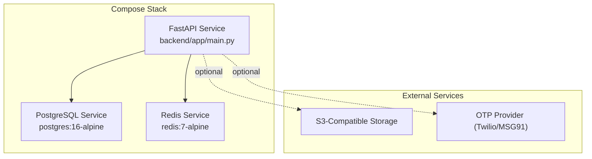
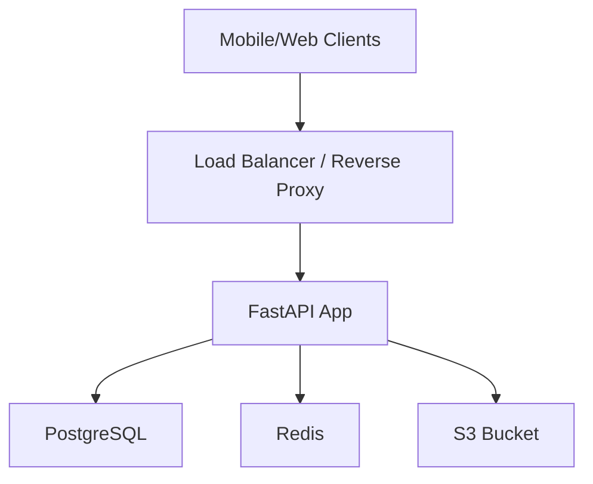
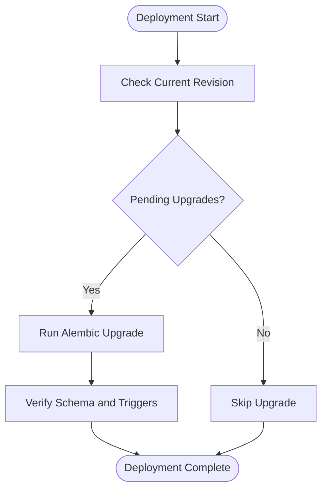
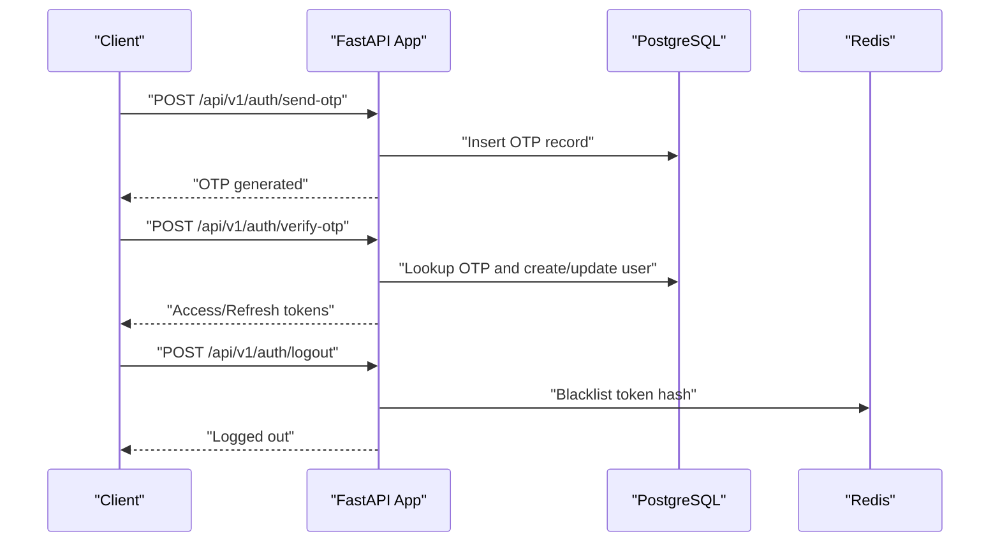
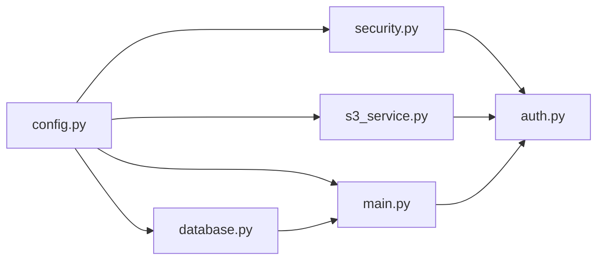

# Production Deployment

<cite>
**Referenced Files in This Document**
- [Dockerfile](file://backend/Dockerfile)
- [docker-compose.yml](file://docker-compose.yml)
- [config.py](file://backend/app/core/config.py)
- [database.py](file://backend/app/core/database.py)
- [main.py](file://backend/app/main.py)
- [security.py](file://backend/app/core/security.py)
- [s3_service.py](file://backend/app/services/s3_service.py)
- [requirements.txt](file://backend/requirements.txt)
- [001_initial.py](file://backend/alembic/versions/001_initial.py)
- [002_add_push_token.py](file://backend/alembic/versions/002_add_push_token.py)
- [auth.py](file://backend/app/api/v1/endpoints/auth.py)
- [user.py](file://backend/app/models/user.py)
- [README.md](file://README.md)
</cite>

## Table of Contents
1. [Introduction](#introduction)
2. [Project Structure](#project-structure)
3. [Core Components](#core-components)
4. [Architecture Overview](#architecture-overview)
5. [Detailed Component Analysis](#detailed-component-analysis)
6. [Dependency Analysis](#dependency-analysis)
7. [Performance Considerations](#performance-considerations)
8. [Troubleshooting Guide](#troubleshooting-guide)
9. [Conclusion](#conclusion)
10. [Appendices](#appendices)

## Introduction
This document provides production-grade deployment guidance for SplitSure. It covers container orchestration with Docker Compose, database migration strategy using Alembic, and security hardening. It also documents container configuration, environment variable management, production-ready settings, Redis usage for caching and token blacklisting, storage configuration for S3 or local storage, health checks, monitoring, and a deployment checklist. Scaling and performance optimization strategies are included for production environments.

## Project Structure
SplitSure consists of:
- A FastAPI backend with asynchronous SQLAlchemy ORM, JWT-based authentication, and Alembic migrations
- A PostgreSQL database and Redis cache
- A local Docker Compose stack suitable for development; production requires adjustments for secrets, HTTPS, and externalized services

**Diagram sources**
- [docker-compose.yml:1-82](file://docker-compose.yml#L1-L82)
- [main.py:16-56](file://backend/app/main.py#L16-L56)

**Section sources**
- [README.md:1-162](file://README.md#L1-L162)
- [docker-compose.yml:1-82](file://docker-compose.yml#L1-L82)

## Core Components
- Containerization: Multi-stage-like build using a slim base image, dependency installation, and runtime invocation via Uvicorn
- Configuration: Centralized settings via Pydantic settings with environment overrides
- Database: Asynchronous SQLAlchemy engine with connection pooling and table creation on startup
- Security: JWT tokens, token blacklisting with Redis, security headers middleware, and CORS configuration
- Storage: Local filesystem for development, S3 for production with presigned URL generation
- Migrations: Alembic revisions for initial schema and subsequent changes

**Section sources**
- [Dockerfile:1-15](file://backend/Dockerfile#L1-L15)
- [config.py:6-71](file://backend/app/core/config.py#L6-L71)
- [database.py:1-29](file://backend/app/core/database.py#L1-L29)
- [main.py:25-46](file://backend/app/main.py#L25-L46)
- [s3_service.py:1-158](file://backend/app/services/s3_service.py#L1-L158)
- [001_initial.py:17-185](file://backend/alembic/versions/001_initial.py#L17-L185)
- [002_add_push_token.py:17-23](file://backend/alembic/versions/002_add_push_token.py#L17-L23)

## Architecture Overview
The production architecture separates concerns across containers and managed services:
- API container runs the FastAPI app with Uvicorn
- PostgreSQL stores relational data
- Redis caches and persists blacklisted tokens
- S3 stores immutable proof attachments
- Optional OTP provider handles authentication

**Diagram sources**
- [docker-compose.yml:29-77](file://docker-compose.yml#L29-L77)
- [main.py:16-56](file://backend/app/main.py#L16-L56)

## Detailed Component Analysis

### Container Orchestration with Docker Compose (Production)
- Services: api, db, redis
- Networking: Compose networks isolate services; expose only necessary ports externally
- Health checks: PostgreSQL healthcheck configured; add readiness/liveness for API
- Volumes: Persist PostgreSQL data and uploaded files
- Environment variables: Externalize secrets and feature flags via Compose env files or secrets

Recommended production adjustments:
- Remove host port bindings for internal services
- Add restart policies and resource limits
- Introduce healthchecks and readiness probes
- Externalize secrets using Docker secrets or environment files
- Replace development commands with production Uvicorn settings

**Section sources**
- [docker-compose.yml:1-82](file://docker-compose.yml#L1-L82)
- [Dockerfile:13-15](file://backend/Dockerfile#L13-L15)

### Container Configuration and Runtime
- Base image: Python slim with system dependencies for compilation
- Dependencies: Installed from requirements.txt
- Ports: Exposed 8000; configurable via PORT environment variable
- Command: Uvicorn with host/port from environment

Multi-stage build recommendation:
- Build stage: Install build dependencies, compile wheels, clean cache
- Runtime stage: Copy installed dependencies and application code
- Final stage: Minimal base image, non-root user, readonly root filesystem

Environment variable management:
- Centralize in a dedicated .env file or secrets manager
- Use Compose env_file or external secrets
- Validate required variables at startup

**Section sources**
- [Dockerfile:1-15](file://backend/Dockerfile#L1-L15)
- [docker-compose.yml:34-67](file://docker-compose.yml#L34-L67)
- [config.py:67-71](file://backend/app/core/config.py#L67-L71)

### Database Migration Strategy with Alembic
- Initial schema: Users, OTP records, groups, expenses, splits, settlements, audit logs, proof attachments, invite links
- Immutability: Database trigger enforces append-only audit logs
- Subsequent change: Add push_token column to users

Migration lifecycle:
- Create: Generate new revision files for schema changes
- Execute: Run alembic upgrade head during deployment
- Rollback: Use alembic downgrade to previous revision if needed
- Verification: Confirm schema and trigger presence post-deploy

**Diagram sources**
- [001_initial.py:17-185](file://backend/alembic/versions/001_initial.py#L17-L185)
- [002_add_push_token.py:17-23](file://backend/alembic/versions/002_add_push_token.py#L17-L23)

**Section sources**
- [001_initial.py:17-185](file://backend/alembic/versions/001_initial.py#L17-L185)
- [002_add_push_token.py:17-23](file://backend/alembic/versions/002_add_push_token.py#L17-L23)
- [README.md:32-38](file://README.md#L32-L38)

### Security Hardening
- Secret key management: Enforce minimum length and rotate regularly; avoid development keys
- CORS configuration: Restrict origins to trusted domains
- SSL/TLS setup: Terminate TLS at reverse proxy/load balancer; enable HSTS in production
- Authentication security: JWT with short-lived access tokens and long-lived refresh tokens; logout invalidates tokens via Redis blacklisting

**Diagram sources**
- [auth.py:58-147](file://backend/app/api/v1/endpoints/auth.py#L58-L147)
- [security.py:47-96](file://backend/app/core/security.py#L47-L96)
- [user.py:81-87](file://backend/app/models/user.py#L81-L87)

**Section sources**
- [config.py:10-14](file://backend/app/core/config.py#L10-L14)
- [main.py:25-46](file://backend/app/main.py#L25-L46)
- [auth.py:58-147](file://backend/app/api/v1/endpoints/auth.py#L58-L147)
- [security.py:47-96](file://backend/app/core/security.py#L47-L96)

### Production Database Configuration
- Engine: Asynchronous PostgreSQL engine with connection pooling
- Pool sizing: Configurable via pool_size and max_overflow
- Startup: Create tables and enforce audit log immutability trigger

Recommendations:
- Tune pool_size and max_overflow based on expected concurrency
- Enable connection timeouts and retries
- Use read-replicas for read-heavy workloads if needed

**Section sources**
- [database.py:5-16](file://backend/app/core/database.py#L5-L16)
- [main.py:69-86](file://backend/app/main.py#L69-L86)

### Redis Setup for Caching and Token Blacklisting
- Purpose: Store blacklisted token hashes with expiration
- Memory policy: LRU eviction to manage memory growth
- Persistence: Consider enabling AOF/RDB for durability if needed

Recommendations:
- Use a separate Redis instance or cluster for production
- Enable authentication and TLS
- Monitor memory usage and evictions

**Section sources**
- [docker-compose.yml:20-27](file://docker-compose.yml#L20-L27)
- [security.py:47-69](file://backend/app/core/security.py#L47-L69)

### Storage Configuration: S3 vs Local
- Local storage: Development default; mounted volume for persistence
- S3 storage: Production default; presigned URLs for secure access
- File validation: MIME type verification and SHA-256 hashing

Recommendations:
- Use private S3 bucket with IAM roles or temporary credentials
- Enable server-side encryption and versioning
- Rotate credentials regularly

**Section sources**
- [s3_service.py:1-158](file://backend/app/services/s3_service.py#L1-L158)
- [config.py:16-28](file://backend/app/core/config.py#L16-L28)
- [docker-compose.yml:46-55](file://docker-compose.yml#L46-L55)

### Health Checks and Monitoring
- Health endpoint: Basic status, version, storage mode, OTP mode
- PostgreSQL healthcheck: Built-in Compose healthcheck
- Recommendations: Add API readiness probes, metrics endpoints, structured logs, and alerting

**Section sources**
- [main.py:88-95](file://backend/app/main.py#L88-L95)
- [docker-compose.yml:14-18](file://docker-compose.yml#L14-L18)

## Dependency Analysis
The backend components depend on configuration, database, and security modules. The API endpoints rely on authentication and storage services.

**Diagram sources**
- [config.py:6-71](file://backend/app/core/config.py#L6-L71)
- [database.py:1-29](file://backend/app/core/database.py#L1-L29)
- [security.py:1-96](file://backend/app/core/security.py#L1-L96)
- [s3_service.py:1-158](file://backend/app/services/s3_service.py#L1-L158)
- [auth.py:1-147](file://backend/app/api/v1/endpoints/auth.py#L1-L147)
- [main.py:1-96](file://backend/app/main.py#L1-L96)

**Section sources**
- [config.py:6-71](file://backend/app/core/config.py#L6-L71)
- [database.py:1-29](file://backend/app/core/database.py#L1-L29)
- [security.py:1-96](file://backend/app/core/security.py#L1-L96)
- [s3_service.py:1-158](file://backend/app/services/s3_service.py#L1-L158)
- [auth.py:1-147](file://backend/app/api/v1/endpoints/auth.py#L1-L147)
- [main.py:1-96](file://backend/app/main.py#L1-L96)

## Performance Considerations
- Database: Optimize pool sizes, connection timeouts, and consider read replicas
- Storage: Use S3 for scalable, durable object storage; enable compression and CDN
- Caching: Leverage Redis for session and token caching; monitor hit rates
- Load balancing: Distribute traffic across multiple API instances; enable sticky sessions if needed
- Observability: Add metrics, tracing, structured logs, and alerts

[No sources needed since this section provides general guidance]

## Troubleshooting Guide
Common production issues and resolutions:
- Invalid or expired tokens: Ensure SECRET_KEY consistency and token expiry alignment
- CORS errors: Align ALLOWED_ORIGINS with deployed frontends
- Storage failures: Verify S3 credentials, bucket permissions, and network connectivity
- Database connectivity: Check connection strings, firewall rules, and pool exhaustion
- Redis connectivity: Validate host/port, authentication, and memory limits

**Section sources**
- [config.py:38-44](file://backend/app/core/config.py#L38-L44)
- [s3_service.py:76-101](file://backend/app/services/s3_service.py#L76-L101)
- [security.py:33-41](file://backend/app/core/security.py#L33-L41)

## Conclusion
This guide outlines a production-ready deployment strategy for SplitSure, focusing on container orchestration, database migrations, and security hardening. By externalizing secrets, terminating TLS at the edge, enforcing strict CORS, and using managed services for storage and caching, you can achieve a robust, scalable platform.

[No sources needed since this section summarizes without analyzing specific files]

## Appendices

### Deployment Checklist
- Security configuration
  - Set a strong SECRET_KEY and rotate periodically
  - Disable development OTP mode and configure a production OTP provider
  - Restrict ALLOWED_ORIGINS to production domains
  - Terminate TLS at reverse proxy/load balancer; enable HSTS in production
- Infrastructure
  - Provision PostgreSQL and Redis instances
  - Configure S3 bucket with appropriate IAM policies and encryption
  - Set up health checks and monitoring
- Application
  - Run Alembic migrations during deployment
  - Validate environment variables and secrets
  - Scale horizontally and enable load balancing

**Section sources**
- [README.md:144-153](file://README.md#L144-L153)
- [docker-compose.yml:34-67](file://docker-compose.yml#L34-L67)
- [config.py:10-14](file://backend/app/core/config.py#L10-L14)

### Scaling and Load Balancing
- Horizontal scaling: Deploy multiple API instances behind a load balancer
- Session affinity: Not required for stateless JWT; enable only if needed for specific features
- Database scaling: Use read replicas for reporting queries; keep writes on primary
- Caching: Use Redis cluster for high availability and low latency

[No sources needed since this section provides general guidance]