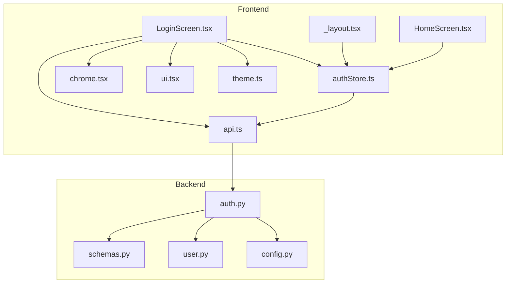
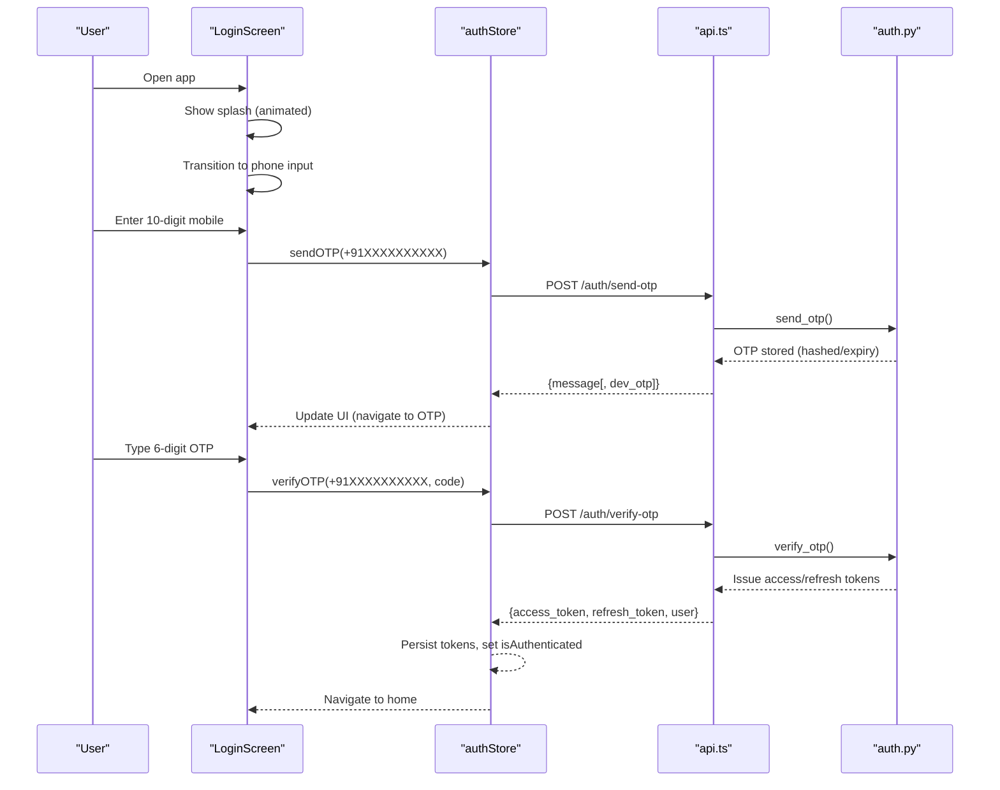
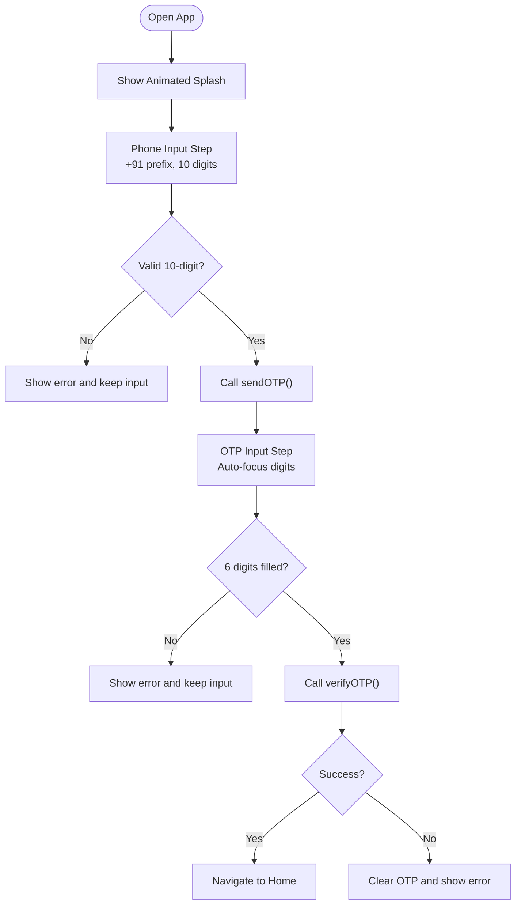
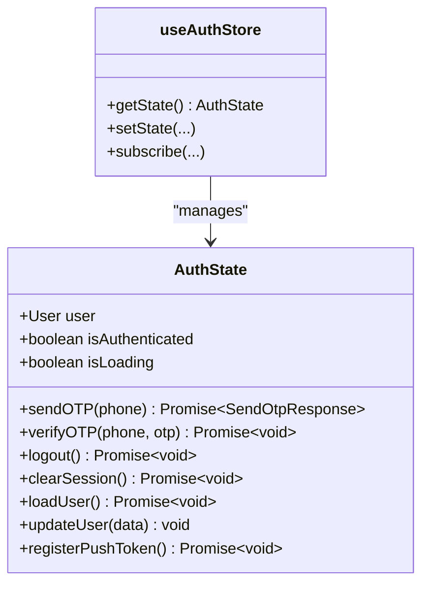
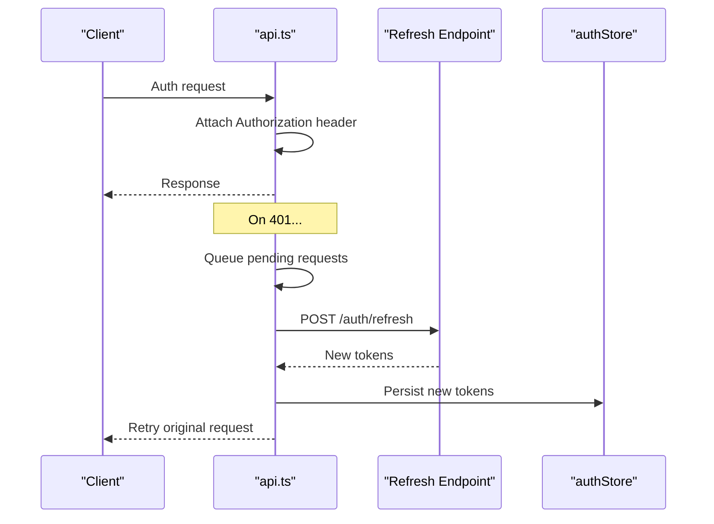
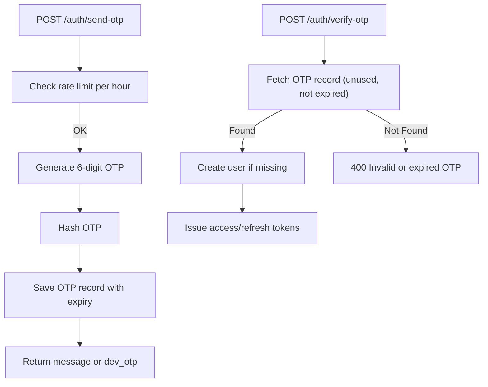
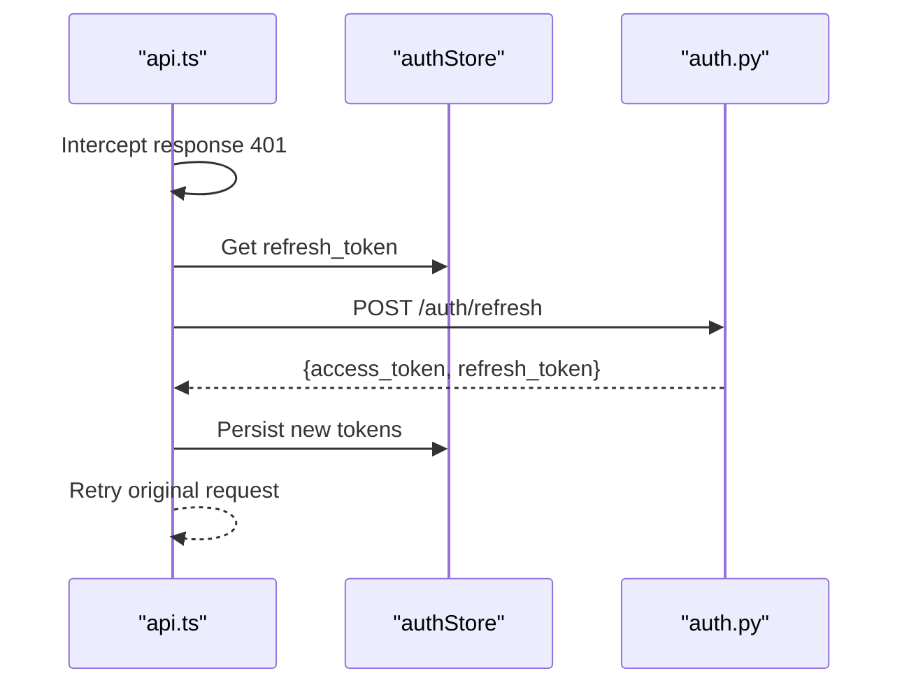
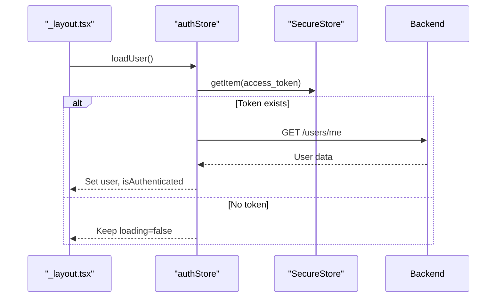
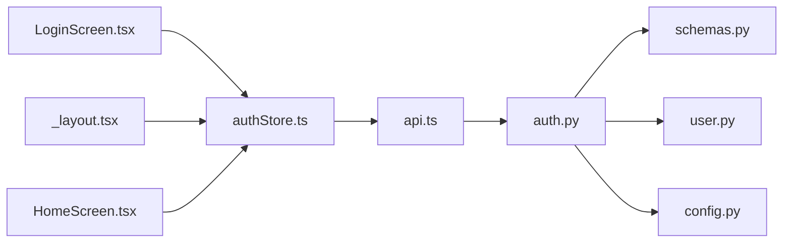

# Authentication Flow

<cite>
**Referenced Files in This Document**
- [LoginScreen.tsx](file://frontend/src/screens/LoginScreen.tsx)
- [authStore.ts](file://frontend/src/store/authStore.ts)
- [api.ts](file://frontend/src/services/api.ts)
- [auth.py](file://backend/app/api/v1/endpoints/auth.py)
- [schemas.py](file://backend/app/schemas/schemas.py)
- [_layout.tsx](file://frontend/app/_layout.tsx)
- [HomeScreen.tsx](file://frontend/src/screens/HomeScreen.tsx)
- [config.py](file://backend/app/core/config.py)
- [user.py](file://backend/app/models/user.py)
- [chrome.tsx](file://frontend/src/components/chrome.tsx)
- [ui.tsx](file://frontend/src/components/ui.tsx)
- [theme.ts](file://frontend/src/utils/theme.ts)
</cite>

## Table of Contents
1. [Introduction](#introduction)
2. [Project Structure](#project-structure)
3. [Core Components](#core-components)
4. [Architecture Overview](#architecture-overview)
5. [Detailed Component Analysis](#detailed-component-analysis)
6. [Dependency Analysis](#dependency-analysis)
7. [Performance Considerations](#performance-considerations)
8. [Troubleshooting Guide](#troubleshooting-guide)
9. [Conclusion](#conclusion)

## Introduction
This document explains the OTP-based authentication flow implemented in the application. It covers the three-step process: splash screen initialization, phone number input with Indian mobile number validation (+91 country code), and six-digit OTP verification with auto-focus navigation between OTP digits. It also documents state management using the Zustand store pattern, error handling strategies for network errors and invalid OTP, loading states during API calls, and session persistence. UI components, responsive design patterns, security considerations, rate limiting, token refresh mechanisms, and troubleshooting guidance are included.

## Project Structure
The authentication flow spans the frontend and backend:
- Frontend screens and stores manage UI steps, user input, and session state.
- Backend endpoints handle OTP generation, validation, rate limiting, and token issuance.
- Shared configuration defines OTP expiry, rate limits, and security settings.

**Diagram sources**
- [LoginScreen.tsx:1-402](file://frontend/src/screens/LoginScreen.tsx#L1-L402)
- [authStore.ts:1-116](file://frontend/src/store/authStore.ts#L1-L116)
- [api.ts:1-269](file://frontend/src/services/api.ts#L1-L269)
- [auth.py:1-147](file://backend/app/api/v1/endpoints/auth.py#L1-L147)
- [schemas.py:1-412](file://backend/app/schemas/schemas.py#L1-L412)
- [_layout.tsx:1-73](file://frontend/app/_layout.tsx#L1-L73)
- [HomeScreen.tsx:1-404](file://frontend/src/screens/HomeScreen.tsx#L1-L404)
- [config.py:1-71](file://backend/app/core/config.py#L1-L71)
- [user.py:1-234](file://backend/app/models/user.py#L1-L234)
- [chrome.tsx:1-224](file://frontend/src/components/chrome.tsx#L1-L224)
- [ui.tsx:1-359](file://frontend/src/components/ui.tsx#L1-L359)
- [theme.ts:1-121](file://frontend/src/utils/theme.ts#L1-L121)

**Section sources**
- [LoginScreen.tsx:1-402](file://frontend/src/screens/LoginScreen.tsx#L1-L402)
- [authStore.ts:1-116](file://frontend/src/store/authStore.ts#L1-L116)
- [api.ts:1-269](file://frontend/src/services/api.ts#L1-L269)
- [auth.py:1-147](file://backend/app/api/v1/endpoints/auth.py#L1-L147)
- [schemas.py:1-412](file://backend/app/schemas/schemas.py#L1-L412)
- [_layout.tsx:1-73](file://frontend/app/_layout.tsx#L1-L73)
- [HomeScreen.tsx:1-404](file://frontend/src/screens/HomeScreen.tsx#L1-L404)
- [config.py:1-71](file://backend/app/core/config.py#L1-L71)
- [user.py:1-234](file://backend/app/models/user.py#L1-L234)
- [chrome.tsx:1-224](file://frontend/src/components/chrome.tsx#L1-L224)
- [ui.tsx:1-359](file://frontend/src/components/ui.tsx#L1-L359)
- [theme.ts:1-121](file://frontend/src/utils/theme.ts#L1-L121)

## Core Components
- LoginScreen orchestrates the three-step authentication flow: splash → phone input → OTP verification.
- authStore manages authentication state, persists tokens securely, and handles token refresh.
- api.ts centralizes HTTP requests, attaches tokens, and implements automatic token refresh on 401.
- Backend auth endpoints implement OTP generation, validation, hashing, expiry, rate limiting, and JWT issuance.

Key responsibilities:
- Splash screen: animated initialization with gradient effects and progress indicator.
- Phone input: accepts only 10 digits, enforces +91 prefix, and validates input length.
- OTP input: six single-digit boxes with auto-focus navigation and submission on completion.
- State management: Zustand store tracks user, authentication status, and loading states.
- Session persistence: SecureStore saves access and refresh tokens; initial load restores session.
- Error handling: Network errors, invalid phone numbers, and OTP expiration are surfaced to users.
- Security: OTP hashing, expiry, rate limiting, and token refresh with blacklisting support.

**Section sources**
- [LoginScreen.tsx:26-186](file://frontend/src/screens/LoginScreen.tsx#L26-L186)
- [authStore.ts:29-116](file://frontend/src/store/authStore.ts#L29-L116)
- [api.ts:143-169](file://frontend/src/services/api.ts#L143-L169)
- [auth.py:58-147](file://backend/app/api/v1/endpoints/auth.py#L58-L147)

## Architecture Overview
The authentication flow integrates frontend UI, state management, and backend services with robust error handling and security controls.

**Diagram sources**
- [LoginScreen.tsx:26-186](file://frontend/src/screens/LoginScreen.tsx#L26-L186)
- [authStore.ts:29-47](file://frontend/src/store/authStore.ts#L29-L47)
- [api.ts:143-169](file://frontend/src/services/api.ts#L143-L169)
- [auth.py:58-116](file://backend/app/api/v1/endpoints/auth.py#L58-L116)

## Detailed Component Analysis

### LoginScreen: Three-Step Authentication UI
- Splash step: Animated gradient rings, logo, brand text, feature pills, and progress bar.
- Phone step: Input with +91 prefix, real-time validation, and error messaging.
- OTP step: Six single-digit inputs with auto-focus and submission on completion.

**Diagram sources**
- [LoginScreen.tsx:26-186](file://frontend/src/screens/LoginScreen.tsx#L26-L186)

**Section sources**
- [LoginScreen.tsx:26-186](file://frontend/src/screens/LoginScreen.tsx#L26-L186)
- [chrome.tsx:11-23](file://frontend/src/components/chrome.tsx#L11-L23)
- [ui.tsx:120-144](file://frontend/src/components/ui.tsx#L120-L144)
- [theme.ts:7-40](file://frontend/src/utils/theme.ts#L7-L40)

### authStore: Zustand State Management
- State: user, isAuthenticated, isLoading.
- Actions: sendOTP, verifyOTP, logout, clearSession, loadUser, updateUser, registerPushToken.
- Persistence: SecureStore for tokens; push token registration after login/load.
- Failure handling: Clears session on auth failure hook.

**Diagram sources**
- [authStore.ts:14-27](file://frontend/src/store/authStore.ts#L14-L27)
- [authStore.ts:29-116](file://frontend/src/store/authStore.ts#L29-L116)

**Section sources**
- [authStore.ts:29-116](file://frontend/src/store/authStore.ts#L29-L116)

### API Layer: Requests, Interceptors, and Token Refresh
- Request interceptor attaches Authorization header with access token.
- Response interceptor handles 401 by refreshing tokens via refresh endpoint.
- Retries transient network errors by waking backend healthcheck.
- Exposes authAPI.sendOTP, authAPI.verifyOTP, authAPI.refresh, authAPI.logout.

**Diagram sources**
- [api.ts:76-140](file://frontend/src/services/api.ts#L76-L140)
- [api.ts:143-169](file://frontend/src/services/api.ts#L143-L169)
- [auth.py:118-136](file://backend/app/api/v1/endpoints/auth.py#L118-L136)

**Section sources**
- [api.ts:76-140](file://frontend/src/services/api.ts#L76-L140)
- [api.ts:143-169](file://frontend/src/services/api.ts#L143-L169)

### Backend Authentication Endpoints
- /auth/send-otp: Rate limit per hour, generate random 6-digit OTP, hash it, store expiry, optionally return dev OTP.
- /auth/verify-otp: Validate OTP hash, expiry, and unused flag; mark used; issue JWT pair; create user if missing.
- /auth/refresh: Validate refresh token type and user existence; issue new tokens.
- Rate limiting: Enforced per phone per hour window.
- Security: OTP hashed, expiry enforced, refresh token validated.

**Diagram sources**
- [auth.py:58-116](file://backend/app/api/v1/endpoints/auth.py#L58-L116)
- [config.py:30-36](file://backend/app/core/config.py#L30-L36)
- [schemas.py:10-45](file://backend/app/schemas/schemas.py#L10-L45)
- [user.py:70-79](file://backend/app/models/user.py#L70-L79)

**Section sources**
- [auth.py:58-116](file://backend/app/api/v1/endpoints/auth.py#L58-L116)
- [config.py:30-36](file://backend/app/core/config.py#L30-L36)
- [schemas.py:10-45](file://backend/app/schemas/schemas.py#L10-L45)
- [user.py:70-79](file://backend/app/models/user.py#L70-L79)

### Token Refresh Mechanism
- On 401 Unauthorized, interceptor attempts refresh using stored refresh token.
- On success, updates Authorization header and retries queued requests.
- On failure, clears tokens and triggers auth failure handler.

**Diagram sources**
- [api.ts:85-140](file://frontend/src/services/api.ts#L85-L140)
- [auth.py:118-136](file://backend/app/api/v1/endpoints/auth.py#L118-L136)

**Section sources**
- [api.ts:85-140](file://frontend/src/services/api.ts#L85-L140)
- [auth.py:118-136](file://backend/app/api/v1/endpoints/auth.py#L118-L136)

### Session Persistence and Initial Load
- Root layout calls loadUser on startup to restore session from SecureStore.
- On success, sets user and isAuthenticated; on failure, clears session.

**Diagram sources**
- [_layout.tsx:29-34](file://frontend/app/_layout.tsx#L29-L34)
- [authStore.ts:62-80](file://frontend/src/store/authStore.ts#L62-L80)

**Section sources**
- [_layout.tsx:29-34](file://frontend/app/_layout.tsx#L29-L34)
- [authStore.ts:62-80](file://frontend/src/store/authStore.ts#L62-L80)

## Dependency Analysis
- Frontend depends on:
  - authStore for state and token persistence.
  - api.ts for HTTP requests and interceptors.
  - backend auth endpoints for OTP and token operations.
- Backend depends on:
  - Pydantic schemas for input validation.
  - SQLAlchemy models for OTP records and blacklisted tokens.
  - FastAPI router for endpoints.

**Diagram sources**
- [LoginScreen.tsx:1-402](file://frontend/src/screens/LoginScreen.tsx#L1-L402)
- [authStore.ts:1-116](file://frontend/src/store/authStore.ts#L1-L116)
- [api.ts:1-269](file://frontend/src/services/api.ts#L1-L269)
- [auth.py:1-147](file://backend/app/api/v1/endpoints/auth.py#L1-L147)
- [schemas.py:1-412](file://backend/app/schemas/schemas.py#L1-L412)
- [user.py:1-234](file://backend/app/models/user.py#L1-L234)
- [config.py:1-71](file://backend/app/core/config.py#L1-L71)
- [_layout.tsx:1-73](file://frontend/app/_layout.tsx#L1-L73)
- [HomeScreen.tsx:1-404](file://frontend/src/screens/HomeScreen.tsx#L1-L404)

**Section sources**
- [LoginScreen.tsx:1-402](file://frontend/src/screens/LoginScreen.tsx#L1-L402)
- [authStore.ts:1-116](file://frontend/src/store/authStore.ts#L1-L116)
- [api.ts:1-269](file://frontend/src/services/api.ts#L1-L269)
- [auth.py:1-147](file://backend/app/api/v1/endpoints/auth.py#L1-L147)
- [schemas.py:1-412](file://backend/app/schemas/schemas.py#L1-L412)
- [user.py:1-234](file://backend/app/models/user.py#L1-L234)
- [config.py:1-71](file://backend/app/core/config.py#L1-L71)
- [_layout.tsx:1-73](file://frontend/app/_layout.tsx#L1-L73)
- [HomeScreen.tsx:1-404](file://frontend/src/screens/HomeScreen.tsx#L1-L404)

## Performance Considerations
- Network resilience: Transient network errors trigger backend healthcheck and retry.
- Token caching: Access token attached automatically; refresh queue prevents redundant refreshes.
- UI responsiveness: Loading states and immediate feedback reduce perceived latency.
- Rate limiting: Backend throttles OTP requests to prevent abuse and maintain service stability.

[No sources needed since this section provides general guidance]

## Troubleshooting Guide
Common issues and resolutions:
- Network connectivity problems:
  - Symptom: “Server is waking up” or “Cannot reach the server.”
  - Resolution: Ensure device has internet; backend healthcheck is used to retry transient failures.
- Invalid phone numbers:
  - Symptom: “Enter a valid 10-digit mobile number.”
  - Resolution: Enter exactly 10 digits; the system prepends +91 automatically.
- OTP expiration or invalid:
  - Symptom: “Invalid OTP” error.
  - Resolution: Re-send OTP; ensure OTP is not older than configured expiry.
- Rate limit exceeded:
  - Symptom: “Too many OTP requests. Try again in an hour.”
  - Resolution: Wait for the hourly window to reset; avoid excessive resend attempts.
- Session restoration fails:
  - Symptom: Stays on login despite prior authentication.
  - Resolution: Clear cached tokens and log in again; ensure SecureStore is accessible.

**Section sources**
- [LoginScreen.tsx:13-24](file://frontend/src/screens/LoginScreen.tsx#L13-L24)
- [api.ts:55-74](file://frontend/src/services/api.ts#L55-L74)
- [auth.py:24-36](file://backend/app/api/v1/endpoints/auth.py#L24-L36)
- [auth.py:94-95](file://backend/app/api/v1/endpoints/auth.py#L94-L95)
- [config.py:30-36](file://backend/app/core/config.py#L30-L36)

## Conclusion
The authentication flow combines a polished frontend UI with a secure backend. The Zustand store centralizes state and persistence, while the API layer ensures resilient network communication and automatic token refresh. Backend safeguards include OTP hashing, expiry enforcement, and rate limiting. Together, these components deliver a robust, user-friendly, and secure login experience.