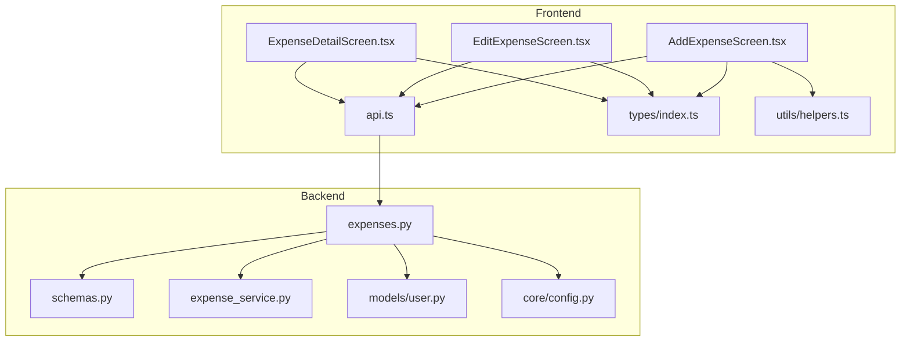
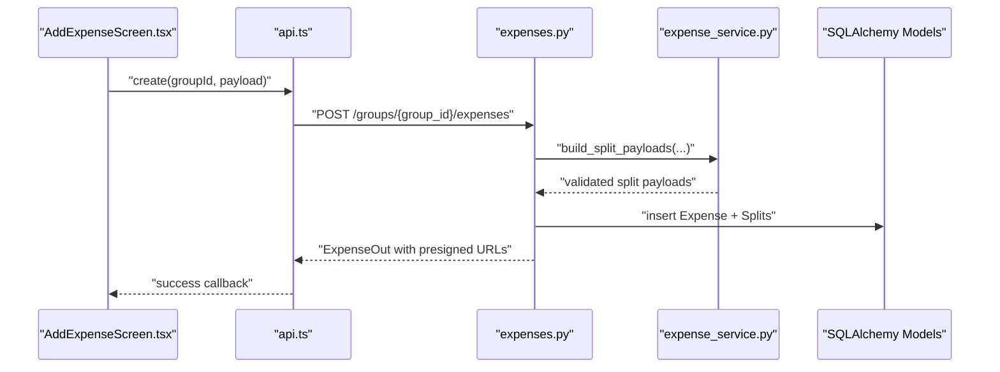
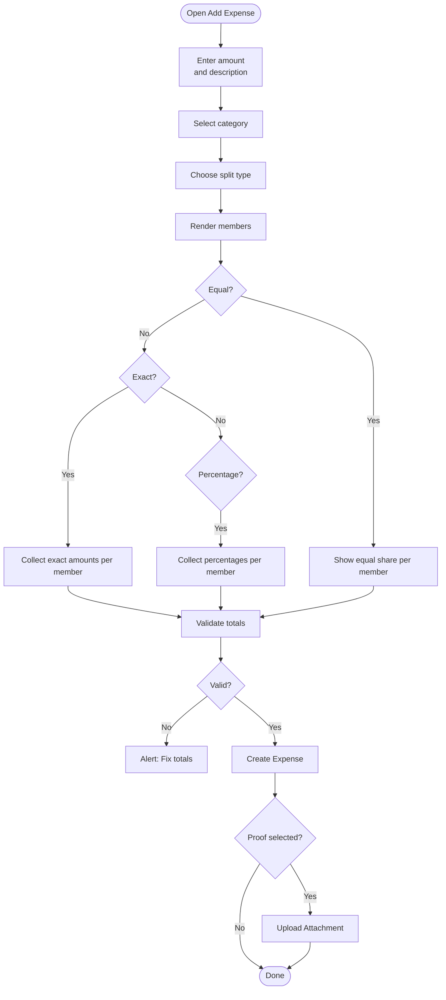
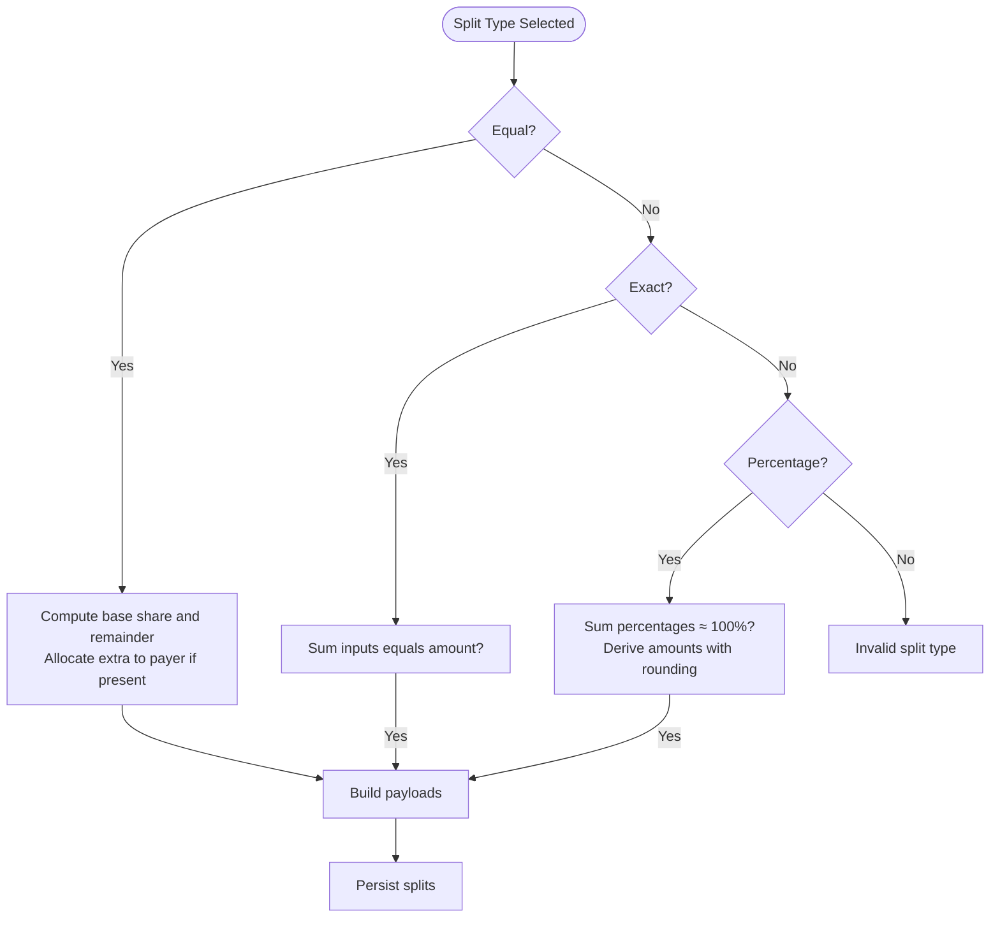
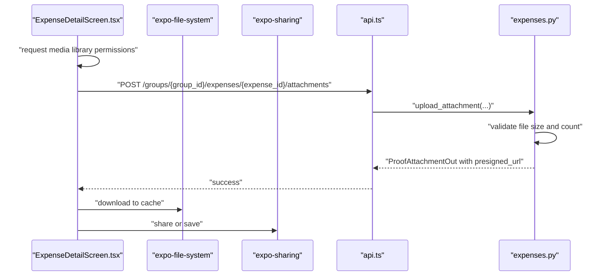
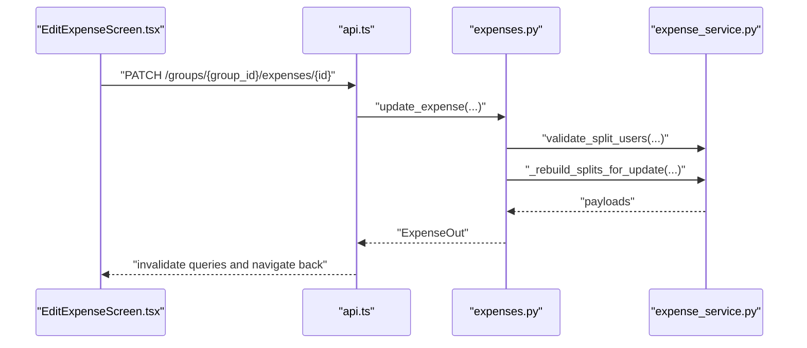
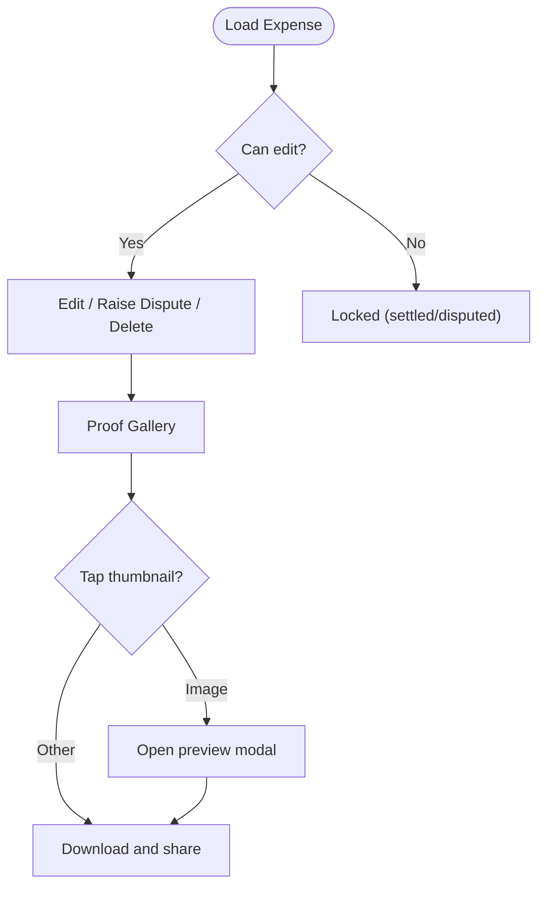
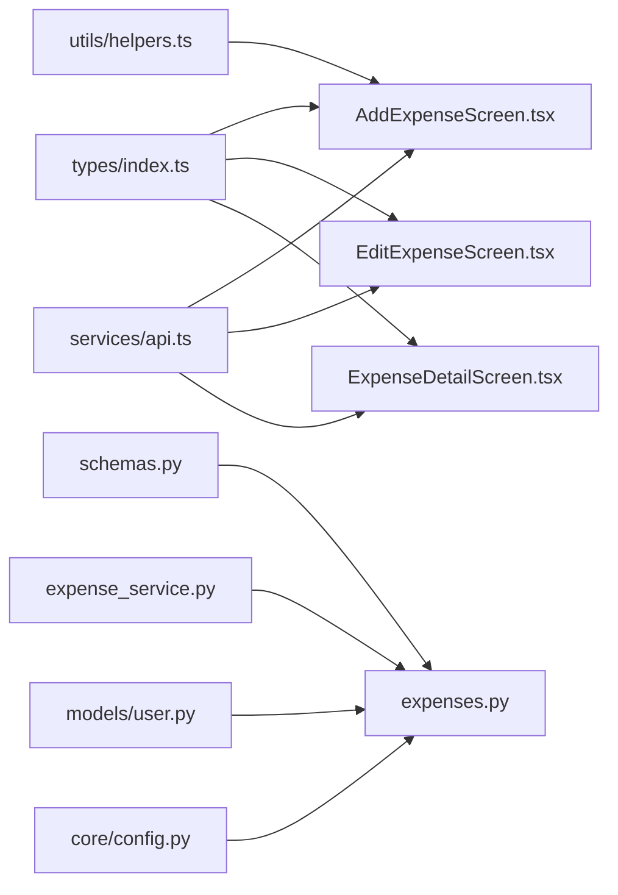

# Expense Management

<cite>
**Referenced Files in This Document**
- [AddExpenseScreen.tsx](file://frontend/src/screens/AddExpenseScreen.tsx)
- [EditExpenseScreen.tsx](file://frontend/src/screens/EditExpenseScreen.tsx)
- [ExpenseDetailScreen.tsx](file://frontend/src/screens/ExpenseDetailScreen.tsx)
- [api.ts](file://frontend/src/services/api.ts)
- [helpers.ts](file://frontend/src/utils/helpers.ts)
- [index.ts](file://frontend/src/types/index.ts)
- [expenses.py](file://backend/app/api/v1/endpoints/expenses.py)
- [schemas.py](file://backend/app/schemas/schemas.py)
- [expense_service.py](file://backend/app/services/expense_service.py)
- [user.py](file://backend/app/models/user.py)
- [config.py](file://backend/app/core/config.py)
</cite>

## Table of Contents
1. [Introduction](#introduction)
2. [Project Structure](#project-structure)
3. [Core Components](#core-components)
4. [Architecture Overview](#architecture-overview)
5. [Detailed Component Analysis](#detailed-component-analysis)
6. [Dependency Analysis](#dependency-analysis)
7. [Performance Considerations](#performance-considerations)
8. [Troubleshooting Guide](#troubleshooting-guide)
9. [Conclusion](#conclusion)

## Introduction
This document describes the expense management system covering the end-to-end lifecycle of creating, splitting, attaching proofs, editing, and viewing expenses. It explains the user interface flows for adding and editing expenses, the split distribution modes (equal, exact, percentage), photo attachment and upload handling, and the backend validation and persistence mechanisms. It also outlines validation rules, error handling, and operational considerations such as performance and conflict prevention.

## Project Structure
The expense management feature spans the frontend (React Native) and backend (FastAPI) layers:
- Frontend screens for adding, editing, and viewing expenses
- API service layer for network requests and authentication handling
- Backend endpoints for CRUD operations, dispute, and proof attachments
- Pydantic schemas and SQLAlchemy models for validation and persistence
- Business logic for split computation and user membership checks

**Diagram sources**
- [AddExpenseScreen.tsx:1-421](file://frontend/src/screens/AddExpenseScreen.tsx#L1-L421)
- [EditExpenseScreen.tsx:1-388](file://frontend/src/screens/EditExpenseScreen.tsx#L1-L388)
- [ExpenseDetailScreen.tsx:1-531](file://frontend/src/screens/ExpenseDetailScreen.tsx#L1-L531)
- [api.ts:1-271](file://frontend/src/services/api.ts#L1-L271)
- [index.ts:1-175](file://frontend/src/types/index.ts#L1-L175)
- [helpers.ts:1-50](file://frontend/src/utils/helpers.ts#L1-L50)
- [expenses.py:1-395](file://backend/app/api/v1/endpoints/expenses.py#L1-L395)
- [schemas.py:1-432](file://backend/app/schemas/schemas.py#L1-L432)
- [expense_service.py:1-79](file://backend/app/services/expense_service.py#L1-L79)
- [user.py:1-234](file://backend/app/models/user.py#L1-L234)
- [config.py:1-71](file://backend/app/core/config.py#L1-L71)

**Section sources**
- [AddExpenseScreen.tsx:1-421](file://frontend/src/screens/AddExpenseScreen.tsx#L1-L421)
- [EditExpenseScreen.tsx:1-388](file://frontend/src/screens/EditExpenseScreen.tsx#L1-L388)
- [ExpenseDetailScreen.tsx:1-531](file://frontend/src/screens/ExpenseDetailScreen.tsx#L1-L531)
- [api.ts:1-271](file://frontend/src/services/api.ts#L1-L271)
- [index.ts:1-175](file://frontend/src/types/index.ts#L1-L175)
- [helpers.ts:1-50](file://frontend/src/utils/helpers.ts#L1-L50)
- [expenses.py:1-395](file://backend/app/api/v1/endpoints/expenses.py#L1-L395)
- [schemas.py:1-432](file://backend/app/schemas/schemas.py#L1-L432)
- [expense_service.py:1-79](file://backend/app/services/expense_service.py#L1-L79)
- [user.py:1-234](file://backend/app/models/user.py#L1-L234)
- [config.py:1-71](file://backend/app/core/config.py#L1-L71)

## Core Components
- Expense creation screen with merchant/category selection, amount input with currency validation, split type selection, and photo attachment.
- Expense editing screen allowing amount, category, split type, and participant adjustments.
- Expense detail view with transaction history, participant breakdown, and proof gallery with preview and download.
- Backend endpoints for creating, updating, deleting, disputing, resolving, and uploading proofs.
- Validation rules enforced on the client and server for amounts, descriptions, split totals, and group membership.
- Error handling via standardized API error extraction and user alerts.

**Section sources**
- [AddExpenseScreen.tsx:14-110](file://frontend/src/screens/AddExpenseScreen.tsx#L14-L110)
- [EditExpenseScreen.tsx:13-124](file://frontend/src/screens/EditExpenseScreen.tsx#L13-L124)
- [ExpenseDetailScreen.tsx:18-122](file://frontend/src/screens/ExpenseDetailScreen.tsx#L18-L122)
- [expenses.py:143-291](file://backend/app/api/v1/endpoints/expenses.py#L143-L291)
- [schemas.py:223-288](file://backend/app/schemas/schemas.py#L223-L288)

## Architecture Overview
The system follows a layered architecture:
- Frontend screens orchestrate user interactions and state, invoking the API service for network operations.
- API service manages authentication tokens, retries, and request/response normalization.
- Backend FastAPI endpoints enforce membership, compute splits, persist data, and manage proof attachments.
- Pydantic schemas validate request/response payloads; SQLAlchemy models define persistence.

**Diagram sources**
- [AddExpenseScreen.tsx:35-110](file://frontend/src/screens/AddExpenseScreen.tsx#L35-L110)
- [api.ts:205-243](file://frontend/src/services/api.ts#L205-L243)
- [expenses.py:143-179](file://backend/app/api/v1/endpoints/expenses.py#L143-L179)
- [expense_service.py:19-79](file://backend/app/services/expense_service.py#L19-L79)
- [user.py:124-162](file://backend/app/models/user.py#L124-L162)

## Detailed Component Analysis

### Expense Creation Form
The creation form captures:
- Transaction value with decimal input and currency symbol display
- Floating description input
- Expense category chips with active selection feedback
- Split mode toggle (equal/exact/percentage)
- Participant rows with computed or editable values depending on split type
- Photo vault area for selecting an invoice proof

Validation and submission:
- Amount and description are required and validated before mutation.
- Split totals are validated:
  - Exact split: amounts must sum to the full expense.
  - Percentage split: percentages must sum to 100%.
- Proof attachment upload occurs after successful creation via a separate endpoint.

**Diagram sources**
- [AddExpenseScreen.tsx:19-110](file://frontend/src/screens/AddExpenseScreen.tsx#L19-L110)

**Section sources**
- [AddExpenseScreen.tsx:14-110](file://frontend/src/screens/AddExpenseScreen.tsx#L14-L110)
- [helpers.ts:27-33](file://frontend/src/utils/helpers.ts#L27-L33)
- [index.ts:42-43](file://frontend/src/types/index.ts#L42-L43)

### Split Type Selection and Real-Time Calculation
- Equal split: each member pays amount divided by count; remainder may be allocated to the payer if present among participants.
- Exact split: per-member amount inputs; total must equal the expense amount.
- Percentage split: per-member percentage inputs; total must equal 100%.

Backend computes split payloads ensuring:
- Exact split amounts sum to the expense amount.
- Percentage split amounts are derived from rounded shares with last participant receiving the remainder.
- Equal split distributes base share with remainder distributed fairly.

**Diagram sources**
- [expense_service.py:19-79](file://backend/app/services/expense_service.py#L19-L79)
- [schemas.py:245-255](file://backend/app/schemas/schemas.py#L245-L255)

**Section sources**
- [AddExpenseScreen.tsx:174-207](file://frontend/src/screens/AddExpenseScreen.tsx#L174-L207)
- [EditExpenseScreen.tsx:212-245](file://frontend/src/screens/EditExpenseScreen.tsx#L212-L245)
- [expense_service.py:19-79](file://backend/app/services/expense_service.py#L19-L79)
- [schemas.py:245-255](file://backend/app/schemas/schemas.py#L245-L255)

### Photo Attachment and Upload Handling
- Creation: user selects a file; the file is attached after the expense is created.
- Detail view: users can upload images from device gallery, with size checks and progress indication; uploaded files appear in the proof gallery with secure, time-limited access links.

**Diagram sources**
- [ExpenseDetailScreen.tsx:84-122](file://frontend/src/screens/ExpenseDetailScreen.tsx#L84-L122)
- [expenses.py:352-394](file://backend/app/api/v1/endpoints/expenses.py#L352-L394)
- [config.py:48-49](file://backend/app/core/config.py#L48-L49)

**Section sources**
- [AddExpenseScreen.tsx:85-98](file://frontend/src/screens/AddExpenseScreen.tsx#L85-L98)
- [ExpenseDetailScreen.tsx:84-122](file://frontend/src/screens/ExpenseDetailScreen.tsx#L84-L122)
- [expenses.py:352-394](file://backend/app/api/v1/endpoints/expenses.py#L352-L394)
- [config.py:48-49](file://backend/app/core/config.py#L48-L49)

### Expense Editing Workflow
- Loads existing expense and group members, pre-filling inputs.
- Enforces that settled or disputed expenses cannot be edited.
- Re-validates split totals on update; exact split requires exact amount match; percentage split requires 100%.
- Supports updating amount, description, category, split type, and per-member allocations.

**Diagram sources**
- [EditExpenseScreen.tsx:67-124](file://frontend/src/screens/EditExpenseScreen.tsx#L67-L124)
- [expenses.py:230-263](file://backend/app/api/v1/endpoints/expenses.py#L230-L263)
- [expense_service.py:7-17](file://backend/app/services/expense_service.py#L7-L17)

**Section sources**
- [EditExpenseScreen.tsx:13-124](file://frontend/src/screens/EditExpenseScreen.tsx#L13-L124)
- [expenses.py:230-263](file://backend/app/api/v1/endpoints/expenses.py#L230-L263)
- [expense_service.py:7-17](file://backend/app/services/expense_service.py#L7-L17)

### Expense Detail View
- Displays category badge, status badges (settled/disputed), amount, description, time, paid-by user, and split type.
- Highlights the user’s own share with percentage and amount.
- Shows split breakdown per participant.
- Proof gallery with thumbnails, uploader info, and timestamp; supports preview and download.
- Dispute flow: raises a dispute with a minimum-length note; admins can resolve disputes.

**Diagram sources**
- [ExpenseDetailScreen.tsx:18-122](file://frontend/src/screens/ExpenseDetailScreen.tsx#L18-L122)

**Section sources**
- [ExpenseDetailScreen.tsx:18-421](file://frontend/src/screens/ExpenseDetailScreen.tsx#L18-L421)

## Dependency Analysis
- Frontend screens depend on typed models and helper utilities for categories and formatting.
- API service encapsulates HTTP client configuration, authentication, and error handling.
- Backend endpoints depend on schemas for validation, services for split computation, and models for persistence.
- Configuration defines limits such as maximum attachments and file sizes.

**Diagram sources**
- [index.ts:1-175](file://frontend/src/types/index.ts#L1-L175)
- [helpers.ts:1-50](file://frontend/src/utils/helpers.ts#L1-L50)
- [api.ts:1-271](file://frontend/src/services/api.ts#L1-L271)
- [AddExpenseScreen.tsx:1-421](file://frontend/src/screens/AddExpenseScreen.tsx#L1-L421)
- [EditExpenseScreen.tsx:1-388](file://frontend/src/screens/EditExpenseScreen.tsx#L1-L388)
- [ExpenseDetailScreen.tsx:1-531](file://frontend/src/screens/ExpenseDetailScreen.tsx#L1-L531)
- [schemas.py:1-432](file://backend/app/schemas/schemas.py#L1-L432)
- [expenses.py:1-395](file://backend/app/api/v1/endpoints/expenses.py#L1-L395)
- [expense_service.py:1-79](file://backend/app/services/expense_service.py#L1-L79)
- [user.py:1-234](file://backend/app/models/user.py#L1-L234)
- [config.py:1-71](file://backend/app/core/config.py#L1-L71)

**Section sources**
- [index.ts:1-175](file://frontend/src/types/index.ts#L1-L175)
- [api.ts:1-271](file://frontend/src/services/api.ts#L1-L271)
- [schemas.py:1-432](file://backend/app/schemas/schemas.py#L1-L432)
- [expenses.py:1-395](file://backend/app/api/v1/endpoints/expenses.py#L1-L395)
- [expense_service.py:1-79](file://backend/app/services/expense_service.py#L1-L79)
- [user.py:1-234](file://backend/app/models/user.py#L1-L234)
- [config.py:1-71](file://backend/app/core/config.py#L1-L71)

## Performance Considerations
- Frontend
  - Use React Query to cache and invalidate queries efficiently; the screens already invalidate related queries on success.
  - Batch updates via queryClient to minimize re-renders.
- Backend
  - Use selectinload to eagerly load related entities (paid_by_user, splits.user, proof_attachments.uploader) to reduce N+1 queries.
  - Apply pagination and filtering (limit/offset, category, search) in list endpoints to cap result sets.
  - Enforce server-side limits for attachments and file sizes to prevent resource exhaustion.

**Section sources**
- [expenses.py:62-69](file://backend/app/api/v1/endpoints/expenses.py#L62-L69)
- [expenses.py:182-216](file://backend/app/api/v1/endpoints/expenses.py#L182-L216)
- [config.py:48-49](file://backend/app/core/config.py#L48-L49)

## Troubleshooting Guide
Common validation errors and their causes:
- Amount must be greater than zero and description is required.
- Exact split amounts must sum to the full expense amount.
- Percentage split percentages must sum to 100%.
- All split users must be members of the group and unique.
- Cannot edit/update/delete settled or disputed expenses.
- Maximum number of attachments per expense and file size limits apply.

Error handling:
- Frontend uses a standardized error extractor to surface meaningful messages.
- Backend returns descriptive HTTP exceptions with validation failures.

Resolution tips:
- Ensure totals are precise (use decimal inputs) and percentages sum to 100.
- Confirm group membership for all split participants.
- Verify file size and type constraints before upload.
- Use the audit trail to track changes and disputes.

**Section sources**
- [schemas.py:230-255](file://backend/app/schemas/schemas.py#L230-L255)
- [schemas.py:265-288](file://backend/app/schemas/schemas.py#L265-L288)
- [expense_service.py:7-17](file://backend/app/services/expense_service.py#L7-L17)
- [expenses.py:241-244](file://backend/app/api/v1/endpoints/expenses.py#L241-L244)
- [expenses.py:276-279](file://backend/app/api/v1/endpoints/expenses.py#L276-L279)
- [expenses.py:363-369](file://backend/app/api/v1/endpoints/expenses.py#L363-L369)
- [api.ts:6-14](file://frontend/src/services/api.ts#L6-L14)

## Conclusion
The expense management system provides a robust, validated workflow for capturing expenses, distributing costs across participants, and managing proof attachments. The frontend offers intuitive forms with real-time previews, while the backend enforces strict validation and maintains auditability. By adhering to the documented validation rules and leveraging the provided error handling, teams can reliably manage shared expenses with confidence.