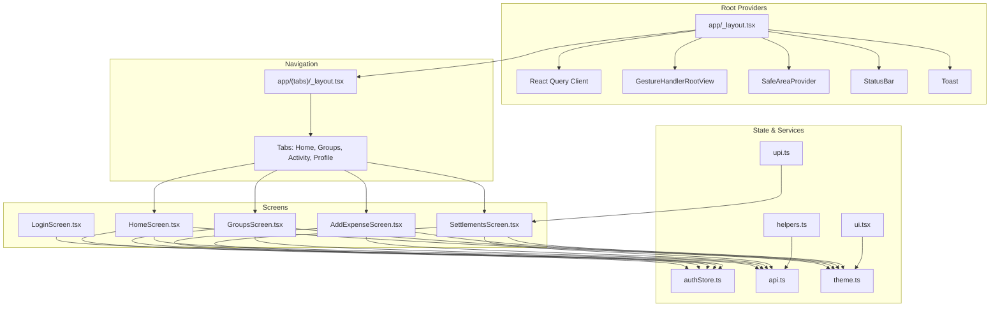
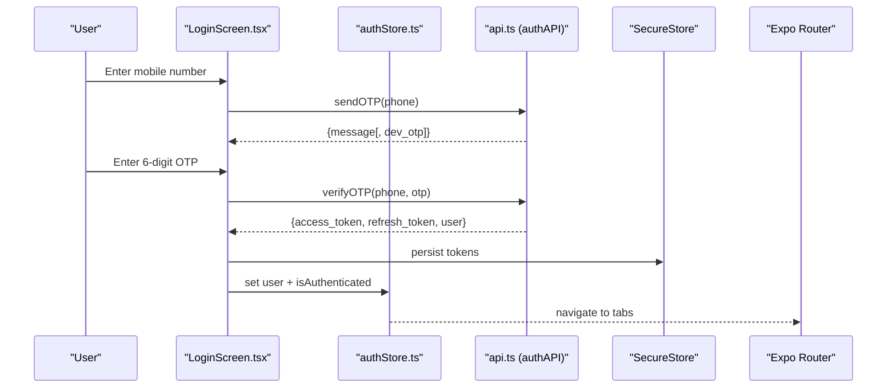
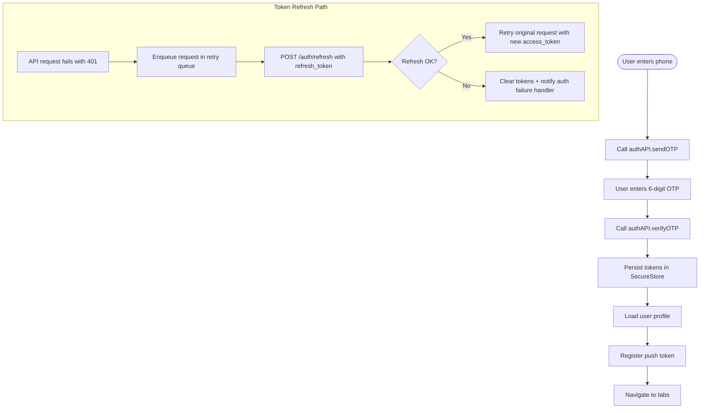
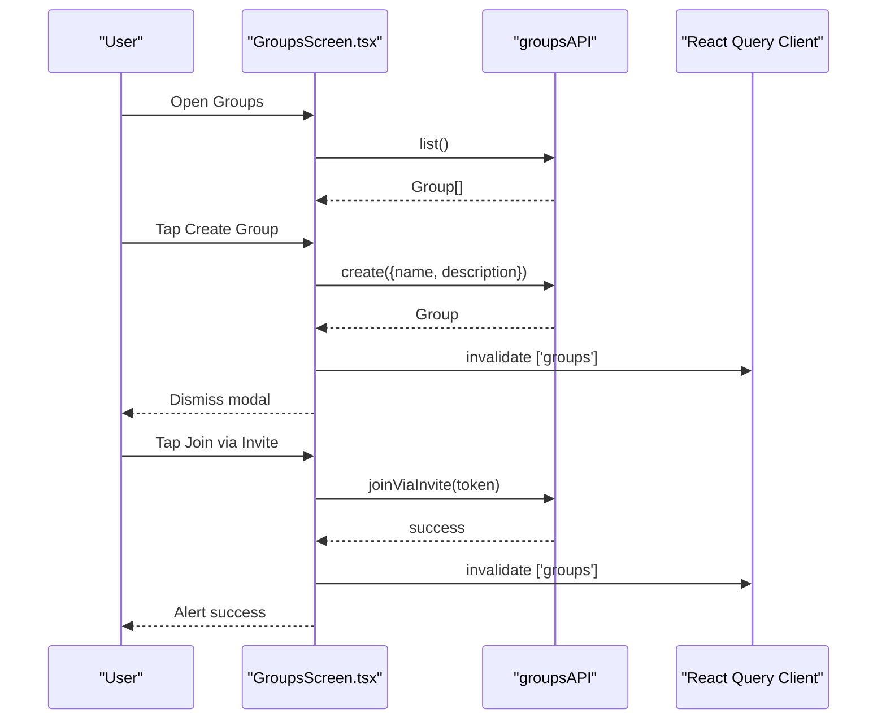
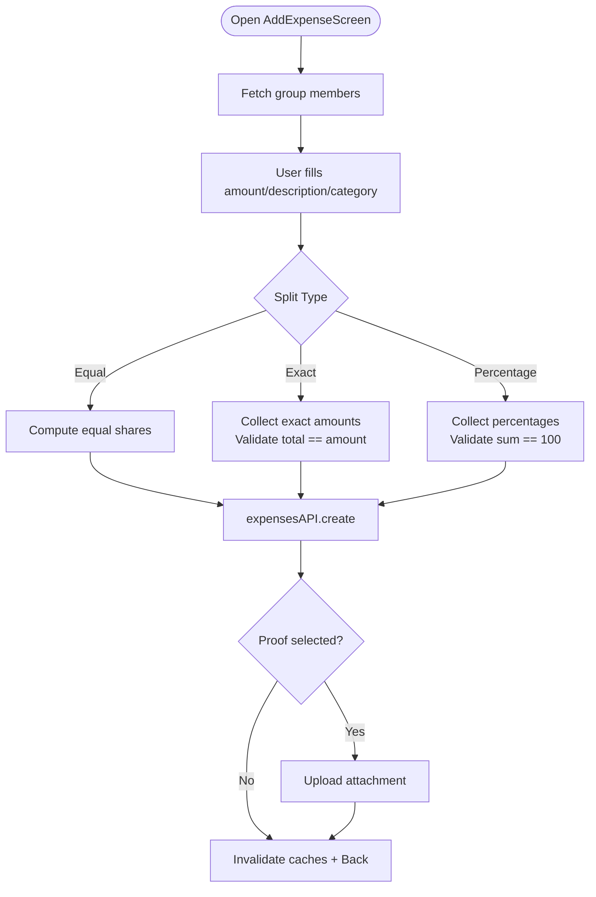
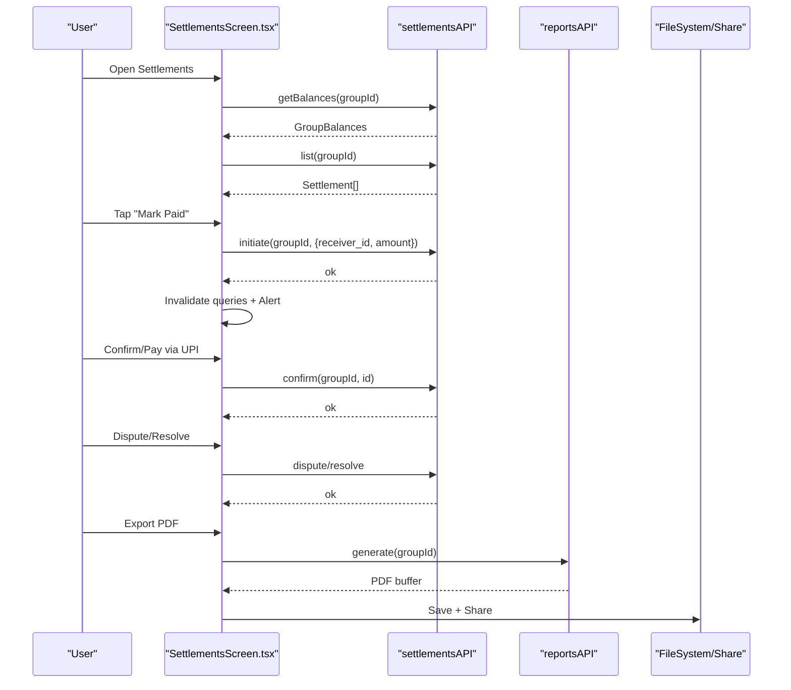
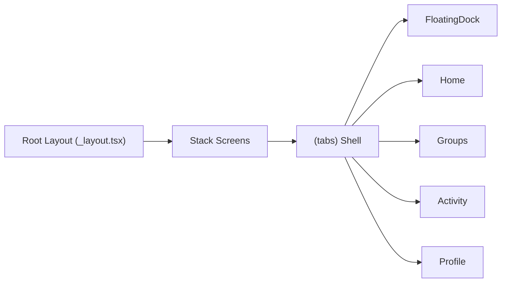
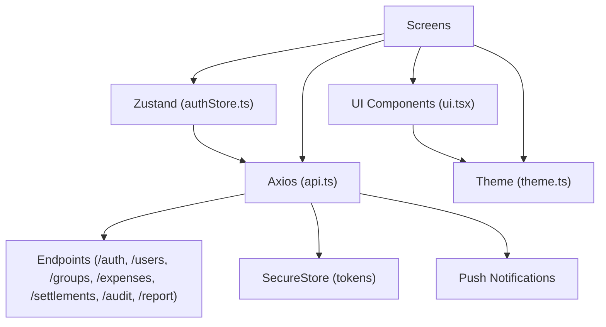
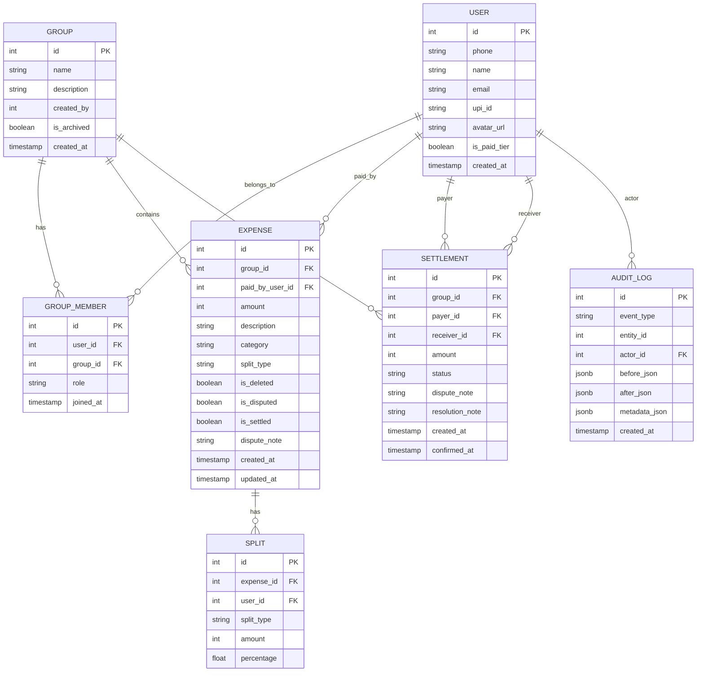

# Frontend Application Guide

<cite>
**Referenced Files in This Document**
- [README.md](file://README.md)
- [package.json](file://frontend/package.json)
- [app/_layout.tsx](file://frontend/app/_layout.tsx)
- [app/(tabs)/_layout.tsx](file://frontend/app/(tabs)/_layout.tsx)
- [src/store/authStore.ts](file://frontend/src/store/authStore.ts)
- [src/services/api.ts](file://frontend/src/services/api.ts)
- [src/utils/theme.ts](file://frontend/src/utils/theme.ts)
- [src/utils/helpers.ts](file://frontend/src/utils/helpers.ts)
- [src/utils/upi.ts](file://frontend/src/utils/upi.ts)
- [src/components/ui.tsx](file://frontend/src/components/ui.tsx)
- [src/screes/LoginScreen.tsx](file://frontend/src/screens/LoginScreen.tsx)
- [src/screens/HomeScreen.tsx](file://frontend/src/screens/HomeScreen.tsx)
- [src/screens/GroupsScreen.tsx](file://frontend/src/screens/GroupsScreen.tsx)
- [src/screens/AddExpenseScreen.tsx](file://frontend/src/screens/AddExpenseScreen.tsx)
- [src/screens/SettlementsScreen.tsx](file://frontend/src/screens/SettlementsScreen.tsx)
- [src/types/index.ts](file://frontend/src/types/index.ts)
</cite>

## Table of Contents
1. [Introduction](#introduction)
2. [Project Structure](#project-structure)
3. [Core Components](#core-components)
4. [Architecture Overview](#architecture-overview)
5. [Detailed Component Analysis](#detailed-component-analysis)
6. [Dependency Analysis](#dependency-analysis)
7. [Performance Considerations](#performance-considerations)
8. [Troubleshooting Guide](#troubleshooting-guide)
9. [Conclusion](#conclusion)
10. [Appendices](#appendices)

## Introduction
This guide documents the SplitSure React Native frontend with a focus on mobile-first UI patterns, navigation flows, authentication, state management, API integration, and UX design. It covers OTP-based login, session/token refresh handling, group interfaces, expense management, settlement flows, and mobile-specific considerations such as touch interactions, responsive design, offline resilience, and push notifications.

## Project Structure
The frontend is organized around:
- Root layout and providers for global state, caching, gestures, safe areas, and notifications
- Tabbed navigation for the main app shell
- Screen components for authentication, home, groups, expenses, and settlements
- Shared UI primitives and theming utilities
- State management with Zustand and API integration with Axios interceptors
- Type definitions for domain models

**Diagram sources**
- [app/_layout.tsx:1-73](file://frontend/app/_layout.tsx#L1-L73)
- [app/(tabs)/_layout.tsx:1-35](file://frontend/app/(tabs)/_layout.tsx#L1-L35)
- [src/store/authStore.ts:1-116](file://frontend/src/store/authStore.ts#L1-L116)
- [src/services/api.ts:1-269](file://frontend/src/services/api.ts#L1-L269)
- [src/utils/theme.ts:1-121](file://frontend/src/utils/theme.ts#L1-L121)
- [src/components/ui.tsx:1-359](file://frontend/src/components/ui.tsx#L1-L359)
- [src/utils/helpers.ts:1-50](file://frontend/src/utils/helpers.ts#L1-L50)
- [src/utils/upi.ts:1-13](file://frontend/src/utils/upi.ts#L1-L13)

**Section sources**
- [README.md:1-162](file://README.md#L1-L162)
- [package.json:1-62](file://frontend/package.json#L1-L62)
- [app/_layout.tsx:1-73](file://frontend/app/_layout.tsx#L1-L73)
- [app/(tabs)/_layout.tsx:1-35](file://frontend/app/(tabs)/_layout.tsx#L1-L35)

## Core Components
- Authentication store (Zustand): OTP send/verify, session lifecycle, push token registration, and centralized auth failure handling
- API client (Axios): request/response interceptors for token injection and automatic refresh, endpoint modules for auth/users/groups/expenses/settlements/audit/reports
- Theme and UI primitives: color palette, typography, spacing, radius, shadows, and reusable components (Button, Card, Input, Avatar)
- Types: strongly typed models for users, groups, expenses, settlements, and audit events
- Helpers: standardized error handling, amount formatting, categories, and React Query keys
- UPI utilities: supported apps and intent building for payment confirmation

**Section sources**
- [src/store/authStore.ts:1-116](file://frontend/src/store/authStore.ts#L1-L116)
- [src/services/api.ts:1-269](file://frontend/src/services/api.ts#L1-L269)
- [src/utils/theme.ts:1-121](file://frontend/src/utils/theme.ts#L1-L121)
- [src/components/ui.tsx:1-359](file://frontend/src/components/ui.tsx#L1-L359)
- [src/types/index.ts:1-153](file://frontend/src/types/index.ts#L1-L153)
- [src/utils/helpers.ts:1-50](file://frontend/src/utils/helpers.ts#L1-L50)
- [src/utils/upi.ts:1-13](file://frontend/src/utils/upi.ts#L1-L13)

## Architecture Overview
The app follows a layered architecture:
- Presentation layer: Expo Router-based navigation, tabbed shell, and screen components
- State layer: Zustand stores for authentication and derived UI state
- Data layer: React Query for caching and optimistic updates; Axios interceptors for auth and network resilience
- Domain layer: Strongly typed models and helpers for consistent UI and business logic
- Infrastructure: Secure storage for tokens, push notifications, and platform-specific integrations

**Diagram sources**
- [src/screens/LoginScreen.tsx:1-402](file://frontend/src/screens/LoginScreen.tsx#L1-L402)
- [src/store/authStore.ts:1-116](file://frontend/src/store/authStore.ts#L1-L116)
- [src/services/api.ts:142-169](file://frontend/src/services/api.ts#L142-L169)

**Section sources**
- [app/_layout.tsx:1-73](file://frontend/app/_layout.tsx#L1-L73)
- [app/(tabs)/_layout.tsx:1-35](file://frontend/app/(tabs)/_layout.tsx#L1-L35)
- [src/services/api.ts:76-140](file://frontend/src/services/api.ts#L76-L140)
- [src/store/authStore.ts:29-80](file://frontend/src/store/authStore.ts#L29-L80)

## Detailed Component Analysis

### Authentication Flow (OTP, Session, Token Refresh)
- OTP send/verify: Phone normalization, validation, and error messaging
- Session persistence: Access and refresh tokens stored securely; push token registered post-login
- Token refresh: Automatic retry queue on 401 with graceful failure handling and session cleanup
- Logout: Server-initiated logout and local session clearing

**Diagram sources**
- [src/screens/LoginScreen.tsx:43-81](file://frontend/src/screens/LoginScreen.tsx#L43-L81)
- [src/store/authStore.ts:34-60](file://frontend/src/store/authStore.ts#L34-L60)
- [src/services/api.ts:76-140](file://frontend/src/services/api.ts#L76-L140)

**Section sources**
- [src/screens/LoginScreen.tsx:13-24](file://frontend/src/screens/LoginScreen.tsx#L13-L24)
- [src/store/authStore.ts:34-111](file://frontend/src/store/authStore.ts#L34-L111)
- [src/services/api.ts:142-169](file://frontend/src/services/api.ts#L142-L169)

### Group Interfaces (Selection, Member Management, Settings)
- Group listing with pull-to-refresh and member avatars
- Create group modal with validation feedback
- Join group via invite token with error handling
- Group detail navigation and member badges

**Diagram sources**
- [src/screens/GroupsScreen.tsx:34-68](file://frontend/src/screens/GroupsScreen.tsx#L34-L68)
- [src/services/api.ts:184-200](file://frontend/src/services/api.ts#L184-L200)

**Section sources**
- [src/screens/GroupsScreen.tsx:22-175](file://frontend/src/screens/GroupsScreen.tsx#L22-L175)
- [src/services/api.ts:184-200](file://frontend/src/services/api.ts#L184-L200)

### Expense Management (Creation, Split Types, Photo Attachment)
- Amount input with decimal formatting and validation
- Category chips and split-type toggles (equal/exact/percentage)
- Dynamic per-member inputs with totals validation
- Proof attachment via document picker and deferred upload after creation
- Real-time computed splits and totals

**Diagram sources**
- [src/screens/AddExpenseScreen.tsx:14-110](file://frontend/src/screens/AddExpenseScreen.tsx#L14-L110)
- [src/services/api.ts:202-241](file://frontend/src/services/api.ts#L202-L241)

**Section sources**
- [src/screens/AddExpenseScreen.tsx:14-421](file://frontend/src/screens/AddExpenseScreen.tsx#L14-L421)
- [src/services/api.ts:202-241](file://frontend/src/services/api.ts#L202-L241)
- [src/utils/helpers.ts:27-33](file://frontend/src/utils/helpers.ts#L27-L33)

### Settlement Interface (Balance Display, Suggestions, Payment Confirmation, History)
- Optimized settlement suggestions and net settlement computation
- UPI deep link integration across supported apps
- Initiation, confirmation, dispute, and admin resolution flows
- PDF report generation and sharing
- Status-aware transaction cards with action buttons

**Diagram sources**
- [src/screens/SettlementsScreen.tsx:38-144](file://frontend/src/screens/SettlementsScreen.tsx#L38-L144)
- [src/services/api.ts:243-256](file://frontend/src/services/api.ts#L243-L256)
- [src/utils/upi.ts:1-13](file://frontend/src/utils/upi.ts#L1-L13)

**Section sources**
- [src/screens/SettlementsScreen.tsx:38-589](file://frontend/src/screens/SettlementsScreen.tsx#L38-L589)
- [src/services/api.ts:243-256](file://frontend/src/services/api.ts#L243-L256)
- [src/utils/upi.ts:1-13](file://frontend/src/utils/upi.ts#L1-L13)

### Navigation and UX Patterns
- Root stack with hidden header and global background color from theme
- Tabbed shell with floating dock; guarded route to login when not authenticated
- Touch-friendly buttons, cards with subtle press feedback, and gradient accents
- Responsive layouts using safe areas and consistent spacing/radius/shadows

**Diagram sources**
- [app/_layout.tsx:45-67](file://frontend/app/_layout.tsx#L45-L67)
- [app/(tabs)/_layout.tsx:17-33](file://frontend/app/(tabs)/_layout.tsx#L17-L33)

**Section sources**
- [app/_layout.tsx:1-73](file://frontend/app/_layout.tsx#L1-L73)
- [app/(tabs)/_layout.tsx:1-35](file://frontend/app/(tabs)/_layout.tsx#L1-L35)
- [src/components/ui.tsx:29-86](file://frontend/src/components/ui.tsx#L29-L86)

## Dependency Analysis
- State management: Zustand store encapsulates auth state and actions
- Data fetching: React Query manages caching, retries, and invalidations
- HTTP client: Axios with interceptors for auth and refresh
- UI primitives: Reusable components with theme-driven styles
- Platform integrations: Secure storage, notifications, document picker, filesystem, sharing

**Diagram sources**
- [src/store/authStore.ts:1-116](file://frontend/src/store/authStore.ts#L1-L116)
- [src/services/api.ts:1-269](file://frontend/src/services/api.ts#L1-L269)
- [src/components/ui.tsx:1-359](file://frontend/src/components/ui.tsx#L1-L359)
- [src/utils/theme.ts:1-121](file://frontend/src/utils/theme.ts#L1-L121)

**Section sources**
- [package.json:13-53](file://frontend/package.json#L13-L53)
- [src/store/authStore.ts:1-116](file://frontend/src/store/authStore.ts#L1-L116)
- [src/services/api.ts:1-269](file://frontend/src/services/api.ts#L1-L269)

## Performance Considerations
- Caching and stale times: React Query configured with a moderate stale time and retry policy
- Offline resilience: Network error detection and backend wake-up logic for transient failures
- Token refresh batching: Queue requests during refresh to avoid redundant calls
- Rendering optimizations: Memoized quick actions, minimal re-renders, and lazy image loading via Avatar
- Asset handling: Deferred proof uploads after expense creation to reduce initial payload size

[No sources needed since this section provides general guidance]

## Troubleshooting Guide
- OTP errors: Clear OTP input and show user-friendly messages; validate phone length and numeric input
- Auth failures: On 401, clear tokens and redirect to login; ensure auth failure handler triggers session cleanup
- Network issues: Detect transient errors and retry with healthcheck; show actionable messages
- Push notifications: Permission checks and non-fatal registration; gracefully degrade if denied
- Form validation: Enforce exact/percentage totals and presence of amount/description before submission

**Section sources**
- [src/screens/LoginScreen.tsx:13-24](file://frontend/src/screens/LoginScreen.tsx#L13-L24)
- [src/services/api.ts:55-74](file://frontend/src/services/api.ts#L55-L74)
- [src/services/api.ts:97-140](file://frontend/src/services/api.ts#L97-L140)
- [src/store/authStore.ts:87-110](file://frontend/src/store/authStore.ts#L87-L110)
- [src/screens/AddExpenseScreen.tsx:35-110](file://frontend/src/screens/AddExpenseScreen.tsx#L35-L110)

## Conclusion
SplitSure’s frontend is structured for reliability and clarity: a robust auth flow with secure token storage, resilient API interactions with automatic refresh, and a cohesive UI built on reusable primitives and a unified theme. The screens implement mobile-first patterns with thoughtful validations, responsive layouts, and practical integrations for payments and reporting.

[No sources needed since this section summarizes without analyzing specific files]

## Appendices

### Mobile-Specific Guidelines
- Touch interactions: Prefer larger hit targets, use pressable feedback, and avoid small tap zones
- Responsive design: Use safe areas, adaptive spacing, and scalable typography
- Offline capabilities: Detect connectivity, cache aggressively, and provide clear error messaging
- Push notifications: Request permissions early, register tokens after login, and handle non-fatal failures
- Accessibility: Provide meaningful accessibility labels, sufficient color contrast, and logical focus order

[No sources needed since this section provides general guidance]

### Component Composition and Styling
- Compose UI using Button, Card, Input, Avatar, and Badge from shared components
- Apply theme tokens for colors, typography, spacing, radius, and shadows
- Keep styles modular and reuse theme constants for consistency

**Section sources**
- [src/components/ui.tsx:19-202](file://frontend/src/components/ui.tsx#L19-L202)
- [src/utils/theme.ts:7-121](file://frontend/src/utils/theme.ts#L7-L121)

### Data Models Overview

**Diagram sources**
- [src/types/index.ts:1-153](file://frontend/src/types/index.ts#L1-L153)