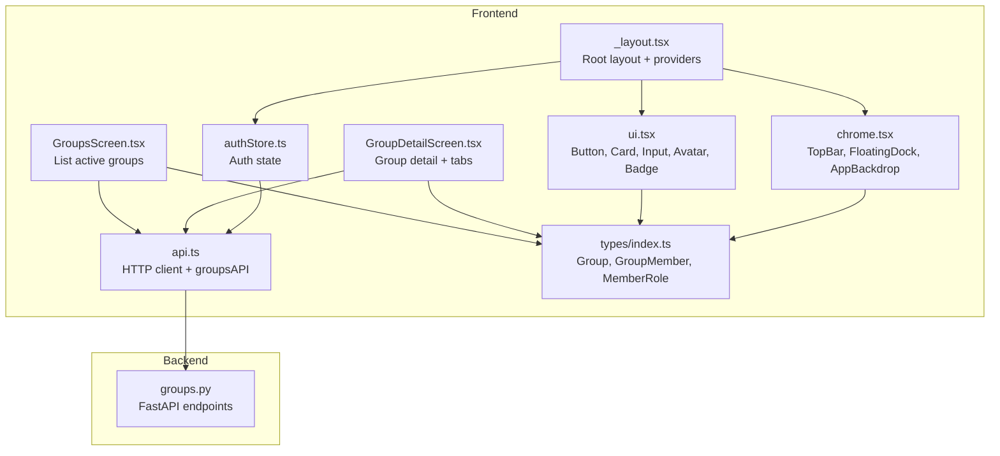
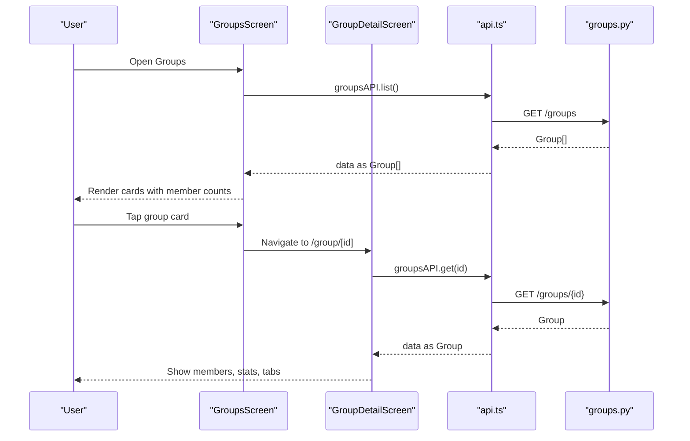
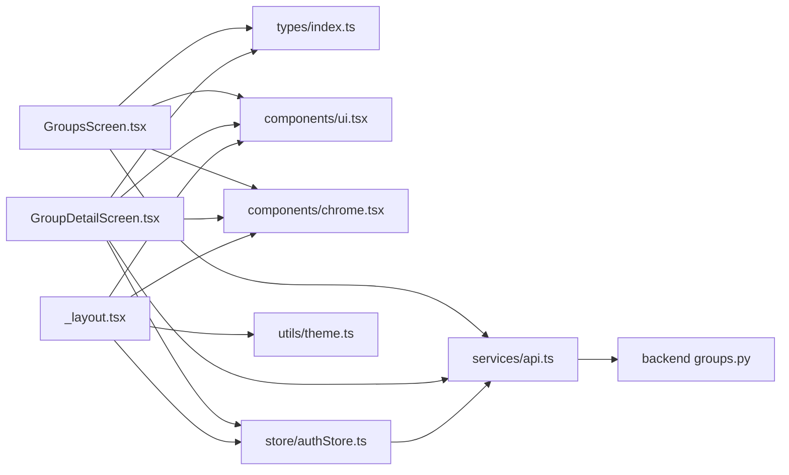

# Group Interface

<cite>
**Referenced Files in This Document**
- [README.md](file://README.md)
- [frontend/src/screens/GroupsScreen.tsx](file://frontend/src/screens/GroupsScreen.tsx)
- [frontend/src/screens/GroupDetailScreen.tsx](file://frontend/src/screens/GroupDetailScreen.tsx)
- [frontend/app/group/[id].tsx](file://frontend/app/group/[id].tsx)
- [frontend/src/services/api.ts](file://frontend/src/services/api.ts)
- [backend/app/api/v1/endpoints/groups.py](file://backend/app/api/v1/endpoints/groups.py)
- [frontend/src/types/index.ts](file://frontend/src/types/index.ts)
- [frontend/src/components/ui.tsx](file://frontend/src/components/ui.tsx)
- [frontend/src/components/chrome.tsx](file://frontend/src/components/chrome.tsx)
- [frontend/src/utils/theme.ts](file://frontend/src/utils/theme.ts)
- [frontend/app/(tabs)/groups.tsx](file://frontend/app/(tabs)/groups.tsx)
- [frontend/src/store/authStore.ts](file://frontend/src/store/authStore.ts)
- [frontend/app/_layout.tsx](file://frontend/app/_layout.tsx)
</cite>

## Table of Contents
1. [Introduction](#introduction)
2. [Project Structure](#project-structure)
3. [Core Components](#core-components)
4. [Architecture Overview](#architecture-overview)
5. [Detailed Component Analysis](#detailed-component-analysis)
6. [Dependency Analysis](#dependency-analysis)
7. [Performance Considerations](#performance-considerations)
8. [Troubleshooting Guide](#troubleshooting-guide)
9. [Conclusion](#conclusion)
10. [Appendices](#appendices)

## Introduction
This document describes the group management interface components of the application. It covers the group listing screen, group detail view, creation flow, settings and member management, UI patterns, navigation, data synchronization, and accessibility/responsiveness considerations. The goal is to provide a comprehensive guide for developers and stakeholders to understand how groups are presented, managed, and synchronized with backend services.

## Project Structure
The group interface spans the frontend screens and components, backed by typed models and a service layer that communicates with the backend API. The backend exposes group endpoints for listing, retrieving, creating, updating, archiving/unarchiving, adding/removing members, and invite creation/joining.

**Diagram sources**
- [frontend/src/screens/GroupsScreen.tsx:22-175](file://frontend/src/screens/GroupsScreen.tsx#L22-L175)
- [frontend/src/screens/GroupDetailScreen.tsx:23-426](file://frontend/src/screens/GroupDetailScreen.tsx#L23-L426)
- [frontend/src/components/ui.tsx:1-373](file://frontend/src/components/ui.tsx#L1-L373)
- [frontend/src/components/chrome.tsx:1-263](file://frontend/src/components/chrome.tsx#L1-L263)
- [frontend/src/services/api.ts:187-202](file://frontend/src/services/api.ts#L187-L202)
- [backend/app/api/v1/endpoints/groups.py:87-350](file://backend/app/api/v1/endpoints/groups.py#L87-L350)
- [frontend/src/types/index.ts:20-39](file://frontend/src/types/index.ts#L20-L39)
- [frontend/src/store/authStore.ts:29-116](file://frontend/src/store/authStore.ts#L29-L116)
- [frontend/app/_layout.tsx:22-84](file://frontend/app/_layout.tsx#L22-L84)

**Section sources**
- [README.md:1-162](file://README.md#L1-L162)
- [frontend/app/_layout.tsx:22-84](file://frontend/app/_layout.tsx#L22-L84)

## Core Components
- Group listing screen: Displays active groups with member counts, recent activity indicators, and search/filter capabilities.
- Group detail view: Presents member information, group statistics, administrative controls, and tabbed views for expenses, balances, and audit trail.
- Group creation flow: Name input validation, member invitation process, and role assignment.
- Group settings interface: Configuration changes, member management with role-based permissions, and group archival/restoration.
- UI patterns: Group avatars, member tagging badges, status indicators, and responsive layouts.
- Navigation: Between group listing and detail screens, and to related screens (expenses, settlements, audit).
- Data synchronization: React Query for caching and refetching, API interceptors for auth and refresh, and optimistic updates.
- Accessibility and responsiveness: Theming, safe areas, touch targets, and adaptive layouts.

**Section sources**
- [frontend/src/screens/GroupsScreen.tsx:22-175](file://frontend/src/screens/GroupsScreen.tsx#L22-L175)
- [frontend/src/screens/GroupDetailScreen.tsx:23-426](file://frontend/src/screens/GroupDetailScreen.tsx#L23-L426)
- [frontend/src/services/api.ts:187-202](file://frontend/src/services/api.ts#L187-L202)
- [backend/app/api/v1/endpoints/groups.py:87-350](file://backend/app/api/v1/endpoints/groups.py#L87-L350)
- [frontend/src/types/index.ts:20-39](file://frontend/src/types/index.ts#L20-L39)

## Architecture Overview
The group interface follows a layered architecture:
- UI Screens: Render group data, manage user interactions, and orchestrate actions.
- Services: Encapsulate HTTP requests and error handling.
- Backend: Exposes REST endpoints for group operations with role-based access control.
- Types: Define models for groups, members, roles, and related entities.
- State/Theme: Store authentication state and provide theme-aware UI primitives.

**Diagram sources**
- [frontend/src/screens/GroupsScreen.tsx:34-40](file://frontend/src/screens/GroupsScreen.tsx#L34-L40)
- [frontend/src/screens/GroupDetailScreen.tsx:46-52](file://frontend/src/screens/GroupDetailScreen.tsx#L46-L52)
- [frontend/src/services/api.ts:187-202](file://frontend/src/services/api.ts#L187-L202)
- [backend/app/api/v1/endpoints/groups.py:87-112](file://backend/app/api/v1/endpoints/groups.py#L87-L112)

## Detailed Component Analysis

### Group Listing Screen (GroupsScreen)
Responsibilities:
- Fetch and display active groups for the current user.
- Provide actions to create a new group or join via invite.
- Render group cards with avatars, member counts, and member badges.
- Support pull-to-refresh and loading states.

Key UI patterns:
- Group avatar disc with emoji-based placeholders.
- Member count chips and member tagging badges.
- Modal overlays for creation and joining flows.
- TopBar with user avatar and right action.

Data and state:
- Uses React Query to cache group lists and invalidate on mutations.
- Uses local state for form inputs and error messages during creation/join.

Navigation:
- Tapping a group navigates to the group detail screen.

Backend integration:
- groupsAPI.list() and groupsAPI.create().
- Error messages mapped via getApiErrorMessage.

Accessibility and responsiveness:
- Touch targets sized appropriately.
- Theme-aware colors and spacing.
- Safe area and blur-based backgrounds.

**Section sources**
- [frontend/src/screens/GroupsScreen.tsx:22-175](file://frontend/src/screens/GroupsScreen.tsx#L22-L175)
- [frontend/src/services/api.ts:6-14](file://frontend/src/services/api.ts#L6-L14)
- [frontend/src/components/ui.tsx:106-135](file://frontend/src/components/ui.tsx#L106-L135)
- [frontend/src/components/chrome.tsx:56-106](file://frontend/src/components/chrome.tsx#L56-L106)
- [frontend/src/utils/theme.ts:98-108](file://frontend/src/utils/theme.ts#L98-L108)

### Group Detail View (GroupDetailScreen)
Responsibilities:
- Display group members with avatars, roles, and net balances.
- Provide administrative controls (add member, share invite, edit group, archive).
- Tabbed interface for expenses, balances, and audit trail.
- Search and category filtering for expenses.
- Debounced search input and category chips.

UI patterns:
- Member strip with removable entries for admins.
- Status indicators for expenses (pending, proof, disputed).
- Category-based icons/colors for expenses.
- Floating action button to add expenses.
- Glass-like cards and badges for status.

Data and state:
- Uses React Query to fetch group, expenses, balances, and audit logs.
- Memoized member balances derived from settlement balances.
- Admin flag determined by membership role.

Backend integration:
- groupsAPI.get, update, add/remove member, create invite, archive/unarchive.
- expensesAPI.list with category/search filters.
- settlementsAPI.getBalances and auditAPI.list.

Navigation:
- From expenses to expense detail.
- From balances to settlements screen.
- From audit to audit screen.
- From group detail to add expense screen.

**Section sources**
- [frontend/src/screens/GroupDetailScreen.tsx:23-426](file://frontend/src/screens/GroupDetailScreen.tsx#L23-L426)
- [frontend/src/services/api.ts:187-202](file://frontend/src/services/api.ts#L187-L202)
- [frontend/src/types/index.ts:20-39](file://frontend/src/types/index.ts#L20-L39)

### Group Creation Flow
Flow:
- Open create modal from the top-right action in the group listing.
- Enter group name and optional description.
- Submit creates the group; on success, invalidate group list and reset form.
- On error, show mapped error message.

Validation and UX:
- Local error state for invalid inputs.
- Loading state during submission.
- Immediate feedback via alerts and modal dismissal.

Backend integration:
- groupsAPI.create(name, description).

**Section sources**
- [frontend/src/screens/GroupsScreen.tsx:42-54](file://frontend/src/screens/GroupsScreen.tsx#L42-L54)
- [frontend/src/services/api.ts:190-191](file://frontend/src/services/api.ts#L190-L191)
- [backend/app/api/v1/endpoints/groups.py:59-84](file://backend/app/api/v1/endpoints/groups.py#L59-L84)

### Group Settings and Member Management
Settings:
- Edit group name/description.
- Archive group (admin-only).
- Save triggers groupsAPI.update.

Member management:
- Add member by phone number (admin-only).
- Remove member (admin-only).
- Role-based permissions enforced by backend.

Invite flow:
- Admin creates invite link; share via system share.
- Join via invite token routes to groupsAPI.joinViaInvite.

Archival/restoration:
- Admin can archive or unarchive groups via dedicated endpoints.

**Section sources**
- [frontend/src/screens/GroupDetailScreen.tsx:99-132](file://frontend/src/screens/GroupDetailScreen.tsx#L99-L132)
- [frontend/src/services/api.ts:192-201](file://frontend/src/services/api.ts#L192-L201)
- [backend/app/api/v1/endpoints/groups.py:115-138](file://backend/app/api/v1/endpoints/groups.py#L115-L138)
- [backend/app/api/v1/endpoints/groups.py:141-207](file://backend/app/api/v1/endpoints/groups.py#L141-L207)
- [backend/app/api/v1/endpoints/groups.py:235-317](file://backend/app/api/v1/endpoints/groups.py#L235-L317)
- [backend/app/api/v1/endpoints/groups.py:320-349](file://backend/app/api/v1/endpoints/groups.py#L320-L349)

### UI Patterns and Components
- Avatars: Gradient initials with fallback sizing.
- Badges: Status and role badges with theme-aware colors.
- Cards: Glass blur with borders and shadows.
- Inputs: Labeled inputs with addons and error messaging.
- Tabs: Pill-style tab switcher with active state styling.
- Status indicators: Color-coded chips for expense states.

**Section sources**
- [frontend/src/components/ui.tsx:180-242](file://frontend/src/components/ui.tsx#L180-L242)
- [frontend/src/components/ui.tsx:106-135](file://frontend/src/components/ui.tsx#L106-L135)
- [frontend/src/components/ui.tsx:145-178](file://frontend/src/components/ui.tsx#L145-L178)
- [frontend/src/components/ui.tsx:222-242](file://frontend/src/components/ui.tsx#L222-L242)
- [frontend/src/screens/GroupDetailScreen.tsx:240-253](file://frontend/src/screens/GroupDetailScreen.tsx#L240-L253)

### Navigation Patterns
- Groups listing to detail: Using dynamic route /group/[id].
- Detail to related screens: Expenses, settlements, audit, add expense.
- Bottom dock navigation: Home, Groups, Activity, Profile.

**Section sources**
- [frontend/app/group/[id].tsx](file://frontend/app/group/[id].tsx#L1-L2)
- [frontend/app/(tabs)/groups.tsx](file://frontend/app/(tabs)/groups.tsx#L1-L2)
- [frontend/src/screens/GroupDetailScreen.tsx:289-356](file://frontend/src/screens/GroupDetailScreen.tsx#L289-L356)
- [frontend/src/components/chrome.tsx:108-162](file://frontend/src/components/chrome.tsx#L108-L162)
- [frontend/app/_layout.tsx:50-67](file://frontend/app/_layout.tsx#L50-L67)

### Data Synchronization and Offline Capability
- React Query caching and refetching:
  - Queries invalidated on successful mutations to keep UI in sync.
  - Stale time configured globally for efficient caching.
- Authentication and refresh:
  - Request interceptor attaches Bearer token.
  - Response interceptor handles 401 by refreshing tokens and retrying.
- Network resilience:
  - Health check endpoint used to ensure backend availability.
  - Transient network error detection and retry logic.

**Section sources**
- [frontend/src/services/api.ts:77-140](file://frontend/src/services/api.ts#L77-L140)
- [frontend/src/services/api.ts:60-74](file://frontend/src/services/api.ts#L60-L74)
- [frontend/app/_layout.tsx:22-27](file://frontend/app/_layout.tsx#L22-L27)

### Accessibility Considerations
- Semantic roles and labels:
  - Buttons use accessibilityLabel and accessibilityRole.
  - Icons include accessibility labels where applicable.
- Touch targets:
  - Minimum heights for buttons and interactive elements.
- Visual contrast:
  - Theme-aware colors for text, borders, and backgrounds.
- Focus and navigation:
  - Proper focus order and keyboard navigation support via standard RN components.

**Section sources**
- [frontend/src/components/ui.tsx:39-98](file://frontend/src/components/ui.tsx#L39-L98)
- [frontend/src/components/chrome.tsx:88-103](file://frontend/src/components/chrome.tsx#L88-L103)
- [frontend/src/utils/theme.ts:98-108](file://frontend/src/utils/theme.ts#L98-L108)

### Responsive Design Patterns
- Adaptive spacing and typography scales.
- Safe area insets respected in top bar and dock.
- Horizontal scrolling for member strips and category chips.
- Flexible card layouts with blur and borders.

**Section sources**
- [frontend/src/utils/theme.ts:98-108](file://frontend/src/utils/theme.ts#L98-L108)
- [frontend/src/components/chrome.tsx:115-162](file://frontend/src/components/chrome.tsx#L115-L162)
- [frontend/src/screens/GroupDetailScreen.tsx:196-229](file://frontend/src/screens/GroupDetailScreen.tsx#L196-L229)

## Dependency Analysis
Group interface components depend on:
- Typed models for groups and members.
- UI primitives for consistent rendering.
- API service for backend communication.
- Auth store for user context.
- Theme provider for visual consistency.

**Diagram sources**
- [frontend/src/screens/GroupsScreen.tsx:1-21](file://frontend/src/screens/GroupsScreen.tsx#L1-L21)
- [frontend/src/screens/GroupDetailScreen.tsx:1-12](file://frontend/src/screens/GroupDetailScreen.tsx#L1-L12)
- [frontend/src/services/api.ts:1-14](file://frontend/src/services/api.ts#L1-L14)
- [backend/app/api/v1/endpoints/groups.py:1-18](file://backend/app/api/v1/endpoints/groups.py#L1-L18)
- [frontend/src/types/index.ts:20-39](file://frontend/src/types/index.ts#L20-L39)
- [frontend/src/store/authStore.ts:1-7](file://frontend/src/store/authStore.ts#L1-L7)
- [frontend/src/utils/theme.ts:1-8](file://frontend/src/utils/theme.ts#L1-L8)
- [frontend/app/_layout.tsx:1-12](file://frontend/app/_layout.tsx#L1-L12)

**Section sources**
- [frontend/src/types/index.ts:20-39](file://frontend/src/types/index.ts#L20-L39)
- [frontend/src/components/ui.tsx:1-18](file://frontend/src/components/ui.tsx#L1-L18)
- [frontend/src/components/chrome.tsx:1-10](file://frontend/src/components/chrome.tsx#L1-L10)
- [frontend/src/services/api.ts:1-14](file://frontend/src/services/api.ts#L1-L14)
- [frontend/src/store/authStore.ts:1-7](file://frontend/src/store/authStore.ts#L1-L7)
- [frontend/app/_layout.tsx:1-12](file://frontend/app/_layout.tsx#L1-L12)

## Performance Considerations
- Efficient caching: React Query configured with a 30-second stale time to reduce redundant network calls.
- Optimistic updates: Mutations invalidate queries to reflect changes immediately.
- Debounced search: Expense search input debounced to minimize API calls.
- Minimal re-renders: useMemo for derived balances to prevent unnecessary recalculations.
- Network resilience: Health checks and transient error handling improve reliability.

[No sources needed since this section provides general guidance]

## Troubleshooting Guide
Common issues and resolutions:
- Authentication failures:
  - 401 responses trigger token refresh; failures clear session state.
- API errors:
  - Mapped via getApiErrorMessage to display user-friendly messages.
- Network connectivity:
  - Transient errors detected and retried after health check.
- Group operations:
  - Admin-only endpoints enforce role checks; errors surfaced to UI.

**Section sources**
- [frontend/src/services/api.ts:97-140](file://frontend/src/services/api.ts#L97-L140)
- [frontend/src/services/api.ts:6-14](file://frontend/src/services/api.ts#L6-L14)
- [backend/app/api/v1/endpoints/groups.py:37-41](file://backend/app/api/v1/endpoints/groups.py#L37-L41)

## Conclusion
The group management interface is built around a cohesive set of screens, services, and backend endpoints. It emphasizes role-based permissions, responsive UI patterns, robust data synchronization, and accessibility. The modular design allows for easy extension and maintenance while providing a consistent user experience across devices.

[No sources needed since this section summarizes without analyzing specific files]

## Appendices

### Backend Group Endpoints Reference
- List groups: GET /groups
- Get group: GET /groups/{id}
- Create group: POST /groups
- Update group: PATCH /groups/{id}
- Archive group: DELETE /groups/{id}
- Unarchive group: POST /groups/{id}/unarchive
- Add member: POST /groups/{groupId}/members
- Remove member: DELETE /groups/{groupId}/members/{userId}
- Create invite: POST /groups/{groupId}/invite
- Join via invite: POST /groups/join/{token}

**Section sources**
- [backend/app/api/v1/endpoints/groups.py:87-350](file://backend/app/api/v1/endpoints/groups.py#L87-L350)

### Frontend API Surface for Groups
- groupsAPI.list(params)
- groupsAPI.get(id)
- groupsAPI.create(data)
- groupsAPI.update(id, data)
- groupsAPI.archive(id)
- groupsAPI.unarchive(id)
- groupsAPI.addMember(groupId, phone)
- groupsAPI.removeMember(groupId, userId)
- groupsAPI.createInvite(groupId)
- groupsAPI.joinViaInvite(token)

**Section sources**
- [frontend/src/services/api.ts:187-202](file://frontend/src/services/api.ts#L187-L202)