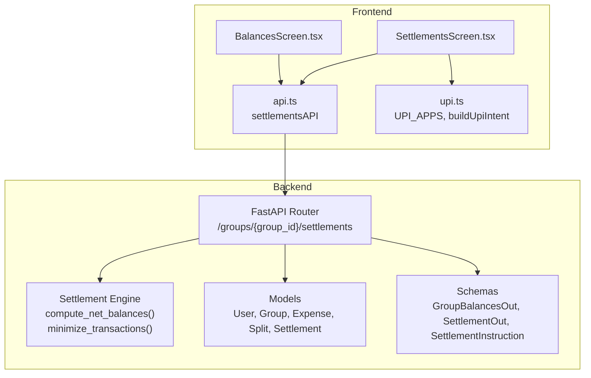
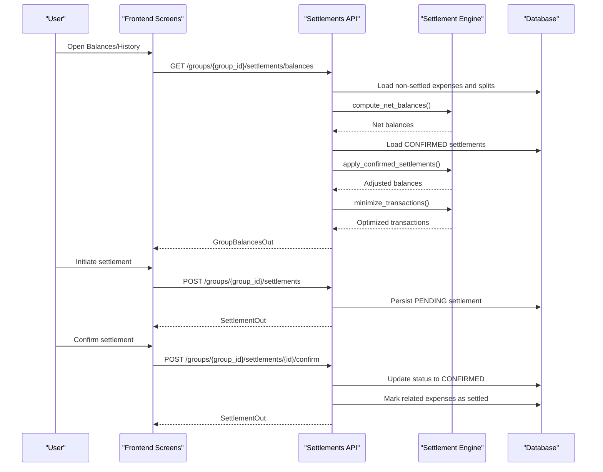
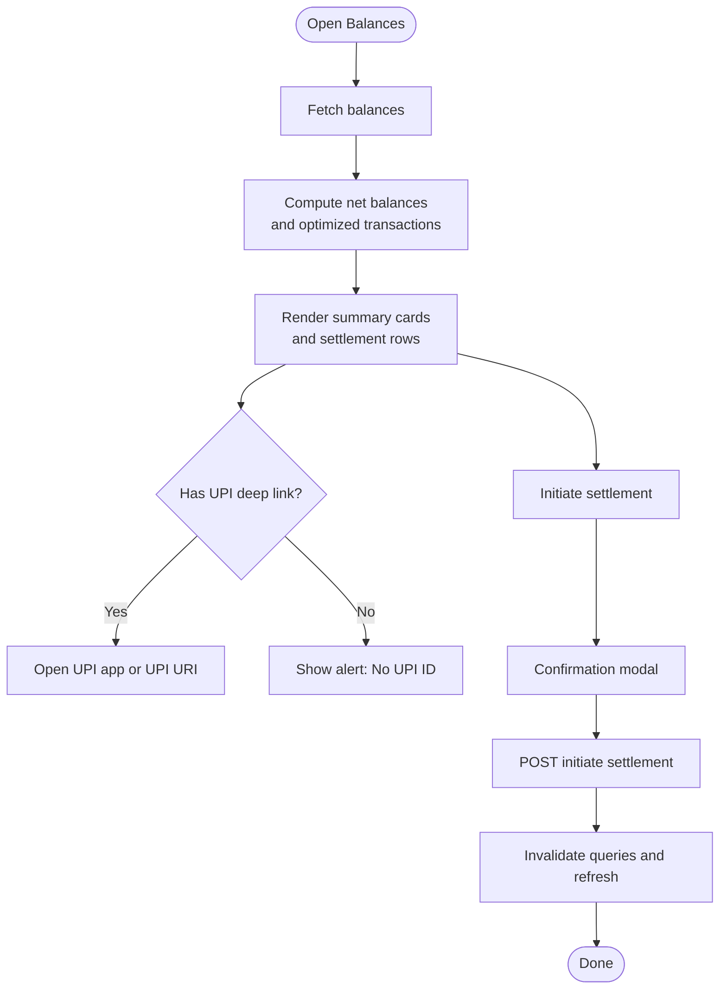
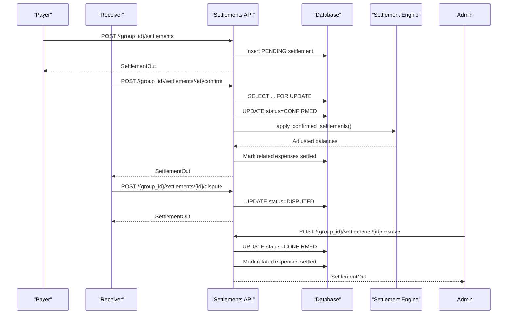
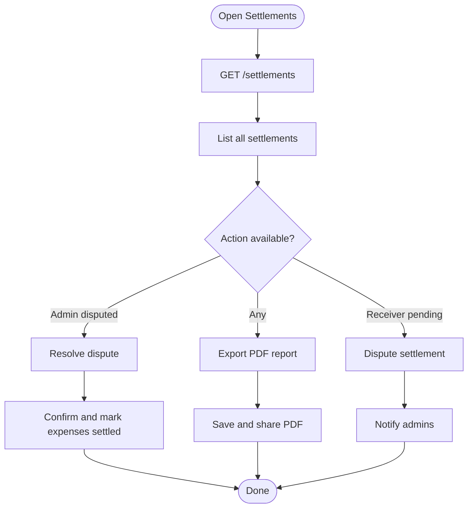
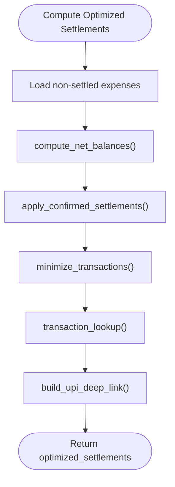
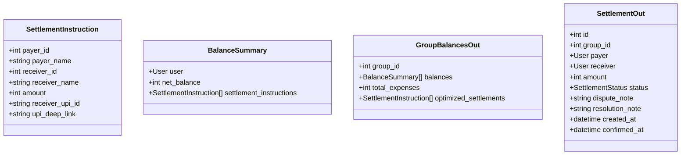
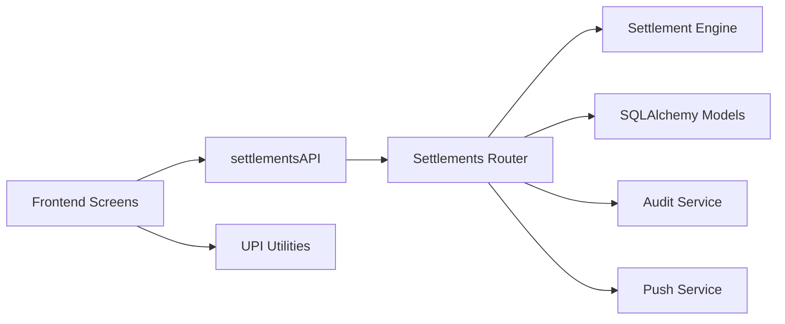

# Settlement Interface

<cite>
**Referenced Files in This Document**
- [settlements.py](file://backend/app/api/v1/endpoints/settlements.py)
- [settlement_engine.py](file://backend/app/services/settlement_engine.py)
- [schemas.py](file://backend/app/schemas/schemas.py)
- [user.py](file://backend/app/models/user.py)
- [BalancesScreen.tsx](file://frontend/src/screens/BalancesScreen.tsx)
- [SettlementsScreen.tsx](file://frontend/src/screens/SettlementsScreen.tsx)
- [api.ts](file://frontend/src/services/api.ts)
- [upi.ts](file://frontend/src/utils/upi.ts)
- [test_settlement_engine.py](file://backend/tests/test_settlement_engine.py)
</cite>

## Table of Contents
1. [Introduction](#introduction)
2. [Project Structure](#project-structure)
3. [Core Components](#core-components)
4. [Architecture Overview](#architecture-overview)
5. [Detailed Component Analysis](#detailed-component-analysis)
6. [Dependency Analysis](#dependency-analysis)
7. [Performance Considerations](#performance-considerations)
8. [Troubleshooting Guide](#troubleshooting-guide)
9. [Conclusion](#conclusion)
10. [Appendices](#appendices)

## Introduction
This document describes the settlement processing interface for the application. It covers:
- The balances screen that displays individual and group financial summaries, outstanding amounts, and optimized settlement suggestions computed by a greedy algorithm.
- The settlement execution flow: initiation, confirmation, payment method selection, and completion tracking.
- The settlement history view that lists past transactions, dispute resolution workflows, and reconciliation processes.
- The settlement optimization interface explaining how the greedy algorithm minimizes transaction count and maximizes efficiency.
- User guidance for understanding recommendations, handling partial payments, and managing disputes.
- Integration with payment providers, UPI payment processing, and settlement status tracking.
- Edge cases such as negative balances, currency considerations, and settlement scheduling.
- Troubleshooting guidance for settlement failures and reconciliation issues.

## Project Structure
The settlement interface spans backend and frontend components:
- Backend API endpoints under `/groups/{group_id}/settlements` expose balances computation, settlement lifecycle, and history retrieval.
- A settlement engine computes net balances and minimizes transactions using a greedy algorithm.
- Frontend screens present balances, settlement suggestions, and actions for initiating and confirming settlements.
- UPI deep links enable seamless payment via supported apps.

**Diagram sources**
- [settlements.py:1-501](file://backend/app/api/v1/endpoints/settlements.py#L1-501)
- [settlement_engine.py:1-106](file://backend/app/services/settlement_engine.py#L1-106)
- [user.py:164-182](file://backend/app/models/user.py#L164-182)
- [schemas.py:344-418](file://backend/app/schemas/schemas.py#L344-418)
- [BalancesScreen.tsx:1-317](file://frontend/src/screens/BalancesScreen.tsx#L1-317)
- [SettlementsScreen.tsx:1-589](file://frontend/src/screens/SettlementsScreen.tsx#L1-589)
- [api.ts:245-258](file://frontend/src/services/api.ts#L245-258)
- [upi.ts:1-13](file://frontend/src/utils/upi.ts#L1-13)

**Section sources**
- [settlements.py:1-501](file://backend/app/api/v1/endpoints/settlements.py#L1-501)
- [settlement_engine.py:1-106](file://backend/app/services/settlement_engine.py#L1-106)
- [schemas.py:344-418](file://backend/app/schemas/schemas.py#L344-418)
- [user.py:164-182](file://backend/app/models/user.py#L164-182)
- [BalancesScreen.tsx:1-317](file://frontend/src/screens/BalancesScreen.tsx#L1-317)
- [SettlementsScreen.tsx:1-589](file://frontend/src/screens/SettlementsScreen.tsx#L1-589)
- [api.ts:245-258](file://frontend/src/services/api.ts#L245-258)
- [upi.ts:1-13](file://frontend/src/utils/upi.ts#L1-13)

## Core Components
- Backend API router for settlements:
  - GET `/groups/{group_id}/settlements/balances`: Computes net balances, applies confirmed settlements, minimizes transactions, and returns per-member summaries and optimized settlement instructions.
  - POST `/groups/{group_id}/settlements`: Initiates a settlement with validation against expected amounts derived from the optimized matrix.
  - POST `/groups/{group_id}/settlements/{settlement_id}/confirm`: Confirms a settlement and marks related expenses as settled.
  - POST `/groups/{group_id}/settlements/{settlement_id}/dispute`: Allows the receiver to dispute a pending settlement.
  - POST `/groups/{group_id}/settlements/{settlement_id}/resolve`: Allows admins to resolve disputes.
  - GET `/groups/{group_id}/settlements`: Lists all settlements for a group.
- Settlement engine:
  - compute_net_balances: Aggregates per-user net balances from expense data.
  - minimize_transactions: Greedy algorithm to reduce transaction count.
  - apply_confirmed_settlements: Adjusts balances by applying previously confirmed settlements.
  - transaction_lookup: Builds a payer-receiver lookup map from minimized transactions.
  - build_upi_deep_link: Generates UPI payment URIs.
- Frontend screens:
  - BalancesScreen: Displays total spent, personal net balance, pending settlements, and per-member balances; supports initiating settlements and opening UPI apps.
  - SettlementsScreen: Shows optimized transfers, UPI quick actions, settlement history, and dispute/resolve controls for admins.
- API bindings and UPI utilities:
  - settlementsAPI: Typed client for settlement endpoints.
  - UPI utilities: Supported apps and intent building for UPI deep links.

**Section sources**
- [settlements.py:129-235](file://backend/app/api/v1/endpoints/settlements.py#L129-235)
- [settlements.py:238-309](file://backend/app/api/v1/endpoints/settlements.py#L238-309)
- [settlements.py:311-371](file://backend/app/api/v1/endpoints/settlements.py#L311-371)
- [settlements.py:374-433](file://backend/app/api/v1/endpoints/settlements.py#L374-433)
- [settlements.py:436-483](file://backend/app/api/v1/endpoints/settlements.py#L436-483)
- [settlements.py:486-501](file://backend/app/api/v1/endpoints/settlements.py#L486-501)
- [settlement_engine.py:23-106](file://backend/app/services/settlement_engine.py#L23-106)
- [BalancesScreen.tsx:89-265](file://frontend/src/screens/BalancesScreen.tsx#L89-265)
- [SettlementsScreen.tsx:38-375](file://frontend/src/screens/SettlementsScreen.tsx#L38-375)
- [api.ts:245-258](file://frontend/src/services/api.ts#L245-258)
- [upi.ts:1-13](file://frontend/src/utils/upi.ts#L1-13)

## Architecture Overview
The settlement architecture follows a clear separation of concerns:
- Frontend screens fetch balances and settlement history via typed APIs.
- Backend validates membership, computes balances, and enforces settlement state transitions.
- The settlement engine encapsulates the optimization logic and UPI deep-link generation.
- Notifications and audit logs track settlement events.

**Diagram sources**
- [settlements.py:129-235](file://backend/app/api/v1/endpoints/settlements.py#L129-235)
- [settlements.py:238-309](file://backend/app/api/v1/endpoints/settlements.py#L238-309)
- [settlements.py:311-371](file://backend/app/api/v1/endpoints/settlements.py#L311-371)
- [settlement_engine.py:23-106](file://backend/app/services/settlement_engine.py#L23-106)

## Detailed Component Analysis

### Balances Screen
The balances screen aggregates:
- Total expenses for the group.
- Per-member net balance (positive = owed to user, negative = user owes).
- Optimized settlement instructions for the current user and others.
- UPI deep links for receivers who have registered UPI IDs.

Key behaviors:
- Fetches balances via the typed API.
- Highlights the user’s own settlement instructions.
- Provides quick UPI app launchers when available.
- Supports initiating a settlement with a confirmation modal.

**Diagram sources**
- [BalancesScreen.tsx:89-265](file://frontend/src/screens/BalancesScreen.tsx#L89-265)
- [api.ts:245-258](file://frontend/src/services/api.ts#L245-258)
- [upi.ts:1-13](file://frontend/src/utils/upi.ts#L1-13)

**Section sources**
- [BalancesScreen.tsx:89-265](file://frontend/src/screens/BalancesScreen.tsx#L89-265)
- [api.ts:245-258](file://frontend/src/services/api.ts#L245-258)
- [upi.ts:1-13](file://frontend/src/utils/upi.ts#L1-13)

### Settlement Execution Flow
End-to-end settlement lifecycle:
- Initiation: The payer selects a suggested settlement and confirms. Backend validates receiver membership, ensures no pending settlement exists, and persists a PENDING record.
- Confirmation: The receiver confirms the payment. Backend locks the row, updates status to CONFIRMED, marks related expenses as settled, and notifies the payer.
- Dispute: The receiver can dispute a pending settlement; backend sets status to DISPUTED and notifies admins.
- Resolution: Admin resolves the dispute by confirming and marking related expenses as settled.

**Diagram sources**
- [settlements.py:238-309](file://backend/app/api/v1/endpoints/settlements.py#L238-309)
- [settlements.py:311-371](file://backend/app/api/v1/endpoints/settlements.py#L311-371)
- [settlements.py:374-433](file://backend/app/api/v1/endpoints/settlements.py#L374-433)
- [settlements.py:436-483](file://backend/app/api/v1/endpoints/settlements.py#L436-483)
- [settlement_engine.py:82-90](file://backend/app/services/settlement_engine.py#L82-90)

**Section sources**
- [settlements.py:238-309](file://backend/app/api/v1/endpoints/settlements.py#L238-309)
- [settlements.py:311-371](file://backend/app/api/v1/endpoints/settlements.py#L311-371)
- [settlements.py:374-433](file://backend/app/api/v1/endpoints/settlements.py#L374-433)
- [settlements.py:436-483](file://backend/app/api/v1/endpoints/settlements.py#L436-483)
- [settlement_engine.py:82-90](file://backend/app/services/settlement_engine.py#L82-90)

### Settlement History and Disputes
The history view:
- Lists all settlements in reverse chronological order.
- Shows status badges (pending/disputed/confirmed).
- Enables receiver to dispute and admin to resolve.
- Includes export of a proof report.

**Diagram sources**
- [SettlementsScreen.tsx:38-375](file://frontend/src/screens/SettlementsScreen.tsx#L38-375)
- [api.ts:245-258](file://frontend/src/services/api.ts#L245-258)

**Section sources**
- [SettlementsScreen.tsx:38-375](file://frontend/src/screens/SettlementsScreen.tsx#L38-375)
- [api.ts:245-258](file://frontend/src/services/api.ts#L245-258)

### Settlement Optimization Interface
The greedy algorithm:
- compute_net_balances: Builds a net balance map from expense data.
- minimize_transactions: Greedy pairing of creditors and debtors to minimize transaction count.
- apply_confirmed_settlements: Adjusts balances by subtracting confirmed settlements.
- transaction_lookup: Produces a payer-receiver → amount map for the optimized matrix.
- build_upi_deep_link: Generates standardized UPI payment URIs.

**Diagram sources**
- [settlements.py:52-81](file://backend/app/api/v1/endpoints/settlements.py#L52-81)
- [settlement_engine.py:23-106](file://backend/app/services/settlement_engine.py#L23-106)

**Section sources**
- [settlement_engine.py:23-106](file://backend/app/services/settlement_engine.py#L23-106)
- [settlements.py:52-81](file://backend/app/api/v1/endpoints/settlements.py#L52-81)
- [test_settlement_engine.py:1-35](file://backend/tests/test_settlement_engine.py#L1-35)

### Data Models and Types
Core models and schemas:
- SettlementInstruction: Payer/receiver pair, amount, optional UPI deep link.
- BalanceSummary: Per-member net balance and settlement instructions.
- GroupBalancesOut: Aggregated balances and optimized settlement list.
- SettlementOut: Full settlement record with status and timestamps.
- Enums: SettlementStatus, MemberRole, AuditEventType.

**Diagram sources**
- [schemas.py:344-418](file://backend/app/schemas/schemas.py#L344-418)
- [user.py:164-182](file://backend/app/models/user.py#L164-182)

**Section sources**
- [schemas.py:344-418](file://backend/app/schemas/schemas.py#L344-418)
- [user.py:164-182](file://backend/app/models/user.py#L164-182)

## Dependency Analysis
- Backend API depends on:
  - SQLAlchemy models for group membership, expenses, splits, and settlements.
  - Settlement engine for balance computation and transaction minimization.
  - Audit service for logging settlement events.
  - Push notifications for settlement updates.
- Frontend depends on:
  - Typed API client for settlement operations.
  - UPI utilities for app-specific intents.

**Diagram sources**
- [api.ts:245-258](file://frontend/src/services/api.ts#L245-258)
- [settlements.py:1-501](file://backend/app/api/v1/endpoints/settlements.py#L1-501)
- [settlement_engine.py:1-106](file://backend/app/services/settlement_engine.py#L1-106)
- [user.py:164-182](file://backend/app/models/user.py#L164-182)

**Section sources**
- [api.ts:245-258](file://frontend/src/services/api.ts#L245-258)
- [settlements.py:1-501](file://backend/app/api/v1/endpoints/settlements.py#L1-501)
- [settlement_engine.py:1-106](file://backend/app/services/settlement_engine.py#L1-106)
- [user.py:164-182](file://backend/app/models/user.py#L164-182)

## Performance Considerations
- Greedy minimization runs in O(n log n) due to sorting creditors and debtors.
- Database queries load non-settled expenses and splits, then confirmed settlements, ensuring minimal recomputation.
- Integer arithmetic in paise avoids floating-point errors and simplifies comparisons.
- Frontend caching via React Query reduces redundant network requests.

[No sources needed since this section provides general guidance]

## Troubleshooting Guide
Common issues and resolutions:
- Settlement initiation fails:
  - Ensure receiver is a group member and not the same user.
  - Verify the amount matches the expected outstanding balance from the optimized matrix.
  - Check for an existing pending settlement for the same payer/receiver pair.
- Confirmation fails:
  - Only the receiver can confirm; ensure the current user is the receiver.
  - Settlement must be pending; already confirmed/disputed settlements cannot be confirmed again.
- Dispute submission:
  - Only the receiver can dispute a pending settlement.
  - Ensure the dispute note meets length requirements.
- Resolution:
  - Only admins can resolve disputes; ensure the current user has admin role.
  - Resolved settlements are confirmed and related expenses are marked settled.
- UPI deep link issues:
  - If a receiver has no UPI ID, the deep link is absent; prompt the receiver to register a UPI ID.
  - If no compatible UPI app is installed, fallback to the UPI URI; otherwise show an appropriate alert.
- Reconciliation:
  - Use the settlement history to verify statuses and related expense IDs.
  - Admins can export a proof report for audit trails.

**Section sources**
- [settlements.py:238-309](file://backend/app/api/v1/endpoints/settlements.py#L238-309)
- [settlements.py:311-371](file://backend/app/api/v1/endpoints/settlements.py#L311-371)
- [settlements.py:374-433](file://backend/app/api/v1/endpoints/settlements.py#L374-433)
- [settlements.py:436-483](file://backend/app/api/v1/endpoints/settlements.py#L436-483)
- [BalancesScreen.tsx:22-41](file://frontend/src/screens/BalancesScreen.tsx#L22-41)
- [SettlementsScreen.tsx:200-222](file://frontend/src/screens/SettlementsScreen.tsx#L200-222)

## Conclusion
The settlement interface combines precise backend computation with a streamlined frontend experience. The greedy optimization minimizes transaction overhead, while robust state transitions and audit logging ensure transparency. UPI deep links integrate seamlessly with popular payment apps, and dispute workflows provide administrative oversight. Together, these components deliver a reliable, efficient, and user-friendly settlement system.

[No sources needed since this section summarizes without analyzing specific files]

## Appendices

### API Definitions
- GET `/groups/{group_id}/settlements/balances`
  - Response: GroupBalancesOut
- POST `/groups/{group_id}/settlements`
  - Request: SettlementCreate
  - Response: SettlementOut
- POST `/groups/{group_id}/settlements/{settlement_id}/confirm`
  - Response: SettlementOut
- POST `/groups/{group_id}/settlements/{settlement_id}/dispute`
  - Request: DisputeSettlementRequest
  - Response: SettlementOut
- POST `/groups/{group_id}/settlements/{settlement_id}/resolve`
  - Request: ResolveDisputeRequest
  - Response: SettlementOut
- GET `/groups/{group_id}/settlements`
  - Response: List of SettlementOut

**Section sources**
- [settlements.py:129-235](file://backend/app/api/v1/endpoints/settlements.py#L129-235)
- [settlements.py:238-309](file://backend/app/api/v1/endpoints/settlements.py#L238-309)
- [settlements.py:311-371](file://backend/app/api/v1/endpoints/settlements.py#L311-371)
- [settlements.py:374-433](file://backend/app/api/v1/endpoints/settlements.py#L374-433)
- [settlements.py:436-483](file://backend/app/api/v1/endpoints/settlements.py#L436-483)
- [settlements.py:486-501](file://backend/app/api/v1/endpoints/settlements.py#L486-501)
- [schemas.py:369-417](file://backend/app/schemas/schemas.py#L369-417)

### Edge Cases and Guidance
- Negative balances:
  - Represent amounts the user owes; displayed with appropriate color coding and labels.
- Currency conversions:
  - Amounts are stored in paise; conversion to rupees is handled in UI rendering.
- Partial payments:
  - Settlement amounts must match the optimized matrix; partial amounts are rejected.
- Settlement scheduling:
  - No explicit scheduling endpoint is exposed; future enhancements can introduce scheduled settlement creation.

**Section sources**
- [BalancesScreen.tsx:148-168](file://frontend/src/screens/BalancesScreen.tsx#L148-168)
- [SettlementsScreen.tsx:170-179](file://frontend/src/screens/SettlementsScreen.tsx#L170-179)
- [settlement_engine.py:100-106](file://backend/app/services/settlement_engine.py#L100-106)