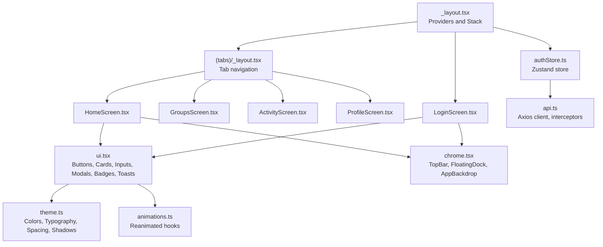
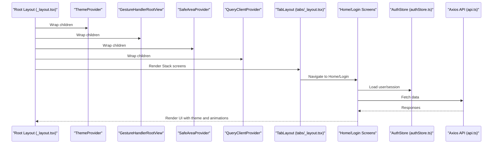
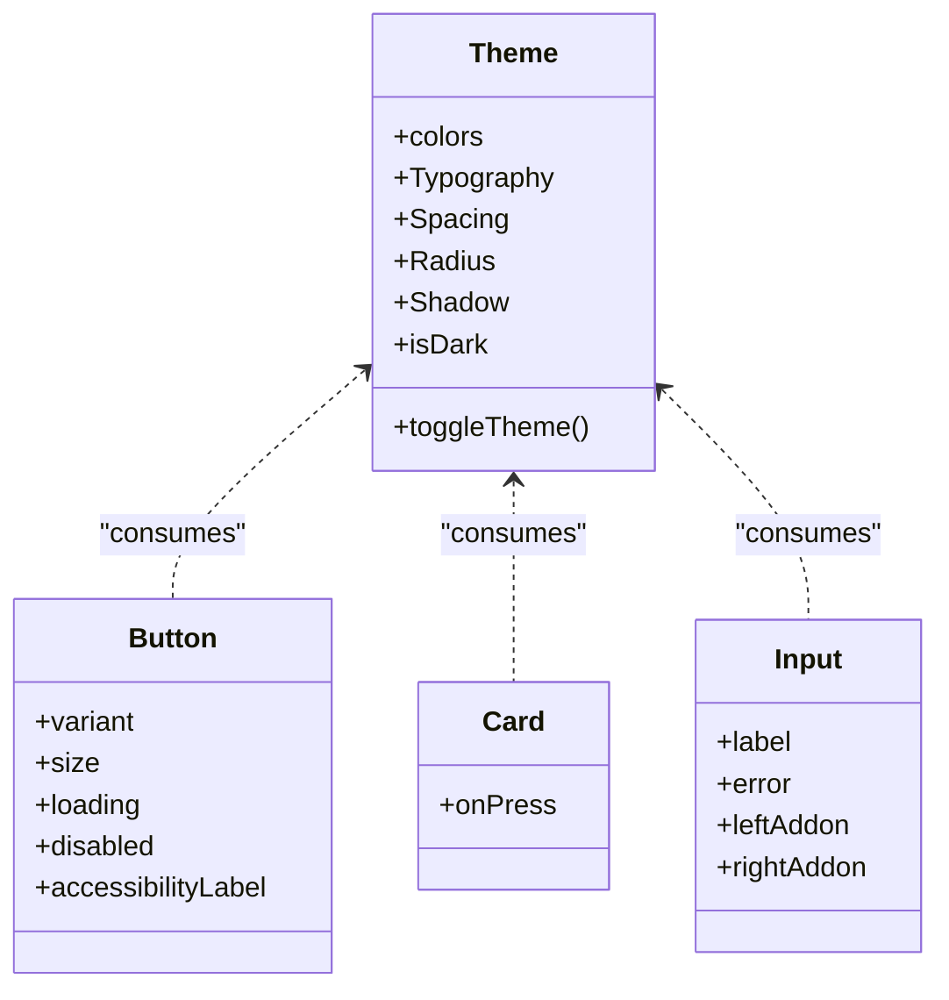
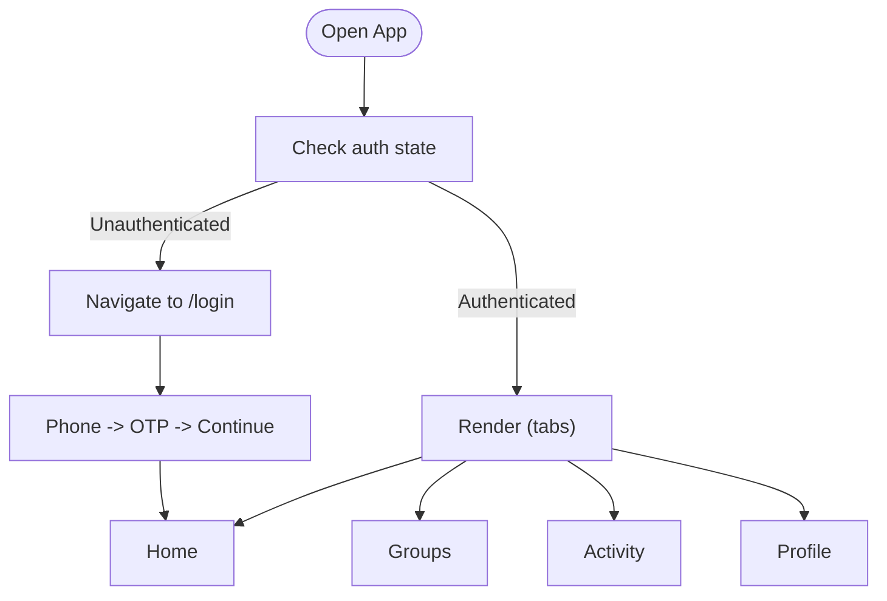
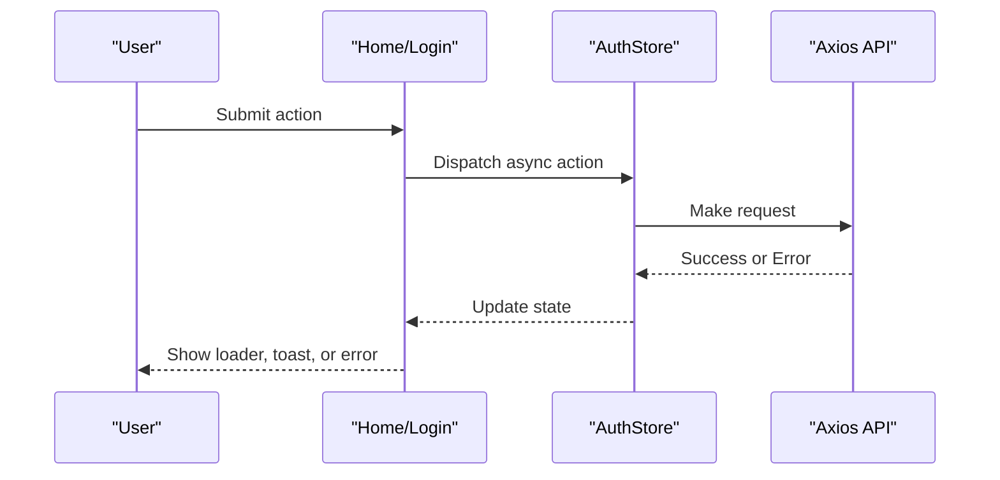
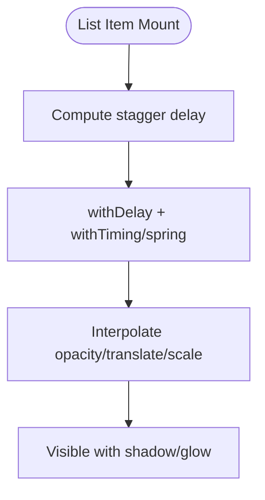
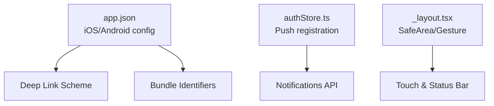
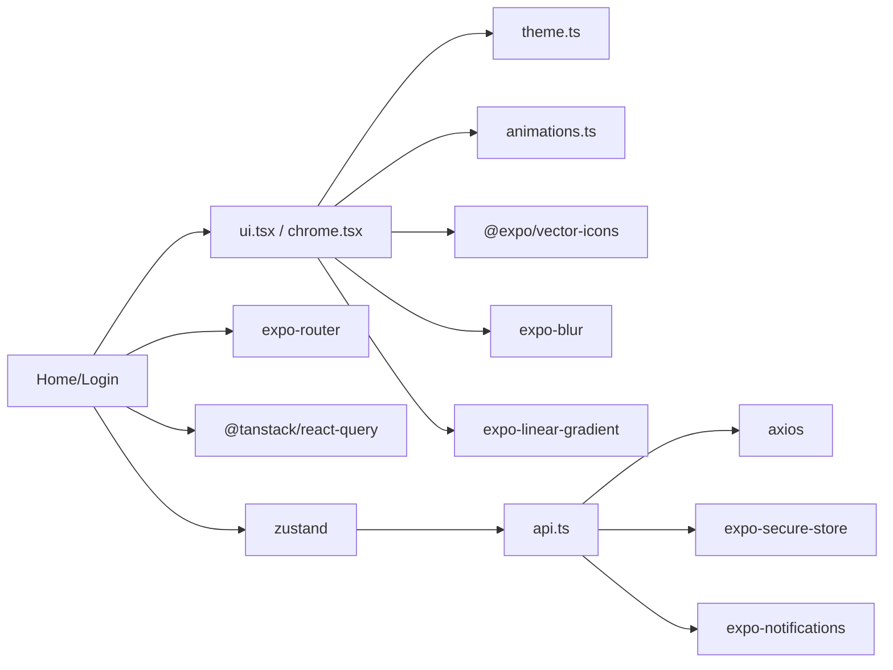

# User Experience Patterns

<cite>
**Referenced Files in This Document**
- [ui.tsx](file://frontend/src/components/ui.tsx)
- [chrome.tsx](file://frontend/src/components/chrome.tsx)
- [theme.ts](file://frontend/src/utils/theme.ts)
- [animations.ts](file://frontend/src/utils/animations.ts)
- [_layout.tsx](file://frontend/app/_layout.tsx)
- [(tabs)_layout.tsx](file://frontend/app/(tabs)/_layout.tsx)
- [HomeScreen.tsx](file://frontend/src/screens/HomeScreen.tsx)
- [LoginScreen.tsx](file://frontend/src/screens/LoginScreen.tsx)
- [helpers.ts](file://frontend/src/utils/helpers.ts)
- [api.ts](file://frontend/src/services/api.ts)
- [authStore.ts](file://frontend/src/store/authStore.ts)
- [types.ts](file://frontend/src/types/index.ts)
- [app.json](file://frontend/app.json)
- [package.json](file://frontend/package.json)
</cite>

## Table of Contents
1. [Introduction](#introduction)
2. [Project Structure](#project-structure)
3. [Core Components](#core-components)
4. [Architecture Overview](#architecture-overview)
5. [Detailed Component Analysis](#detailed-component-analysis)
6. [Dependency Analysis](#dependency-analysis)
7. [Performance Considerations](#performance-considerations)
8. [Troubleshooting Guide](#troubleshooting-guide)
9. [Conclusion](#conclusion)
10. [Appendices](#appendices)

## Introduction
This document describes the mobile-first user experience patterns and design system for the application. It covers the component library, theming system, navigation patterns, accessibility, loading and error handling, user feedback, performance optimizations, platform-specific considerations, and interaction guidelines. The focus is on React Native with Expo Router for navigation, Reanimated for animations, and a centralized theme and animation system.

## Project Structure
The frontend is organized around:
- Root layout and providers for theme, gestures, safe area, and global state
- Tab-based navigation with a floating dock
- Screens implementing core flows (Home, Login)
- A shared component library for UI primitives and chrome elements
- Utilities for theme, animations, helpers, and API integration
- Store for authentication state and push notifications

**Diagram sources**
- [_layout.tsx:1-85](file://frontend/app/_layout.tsx#L1-L85)
- [(tabs)_layout.tsx](file://frontend/app/(tabs)/_layout.tsx#L1-L35)
- [HomeScreen.tsx:1-404](file://frontend/src/screens/HomeScreen.tsx#L1-L404)
- [LoginScreen.tsx:1-402](file://frontend/src/screens/LoginScreen.tsx#L1-L402)
- [ui.tsx:1-689](file://frontend/src/components/ui.tsx#L1-L689)
- [chrome.tsx:1-316](file://frontend/src/components/chrome.tsx#L1-L316)
- [theme.ts](file://frontend/src/utils/theme.ts)
- [animations.ts:1-245](file://frontend/src/utils/animations.ts#L1-L245)
- [authStore.ts:1-116](file://frontend/src/store/authStore.ts#L1-L116)
- [api.ts:1-271](file://frontend/src/services/api.ts#L1-L271)

**Section sources**
- [_layout.tsx:1-85](file://frontend/app/_layout.tsx#L1-L85)
- [(tabs)_layout.tsx](file://frontend/app/(tabs)/_layout.tsx#L1-L35)

## Core Components
Reusable UI primitives and composite components are defined in the component library and chrome modules. They are designed to be theme-aware, accessible, and animated.

- Buttons
  - Variants: primary, ghost, secondary, danger
  - Sizes: sm, md, lg
  - States: loading, disabled
  - Accessibility: role and label props
  - Visuals: gradient for primary, borders and backgrounds for others; loading spinner inside
- Cards
  - Glass blur background with borders
  - Optional pressable wrapper for interactivity
- Inputs
  - Label, error messaging, addons on left/right
  - Placeholder and text colors adapt to theme
- Avatars
  - Initials with gradient background or image fallback
- Badges and Dividers
  - Status badges with icons and labels
  - Lightweight dividers for separators
- AnimatedCard
  - Entrance animation with staggered delays
- SkeletonLoader
  - Shimmer effect for placeholders
- ThemeToggle
  - Animated sun/moon toggle with haptics
- StatusBadge
  - Registration/status indicators with themed colors
- NotificationToast
  - Slide-in/out banners with auto-dismiss
- GlassModal
  - Backdrop blur with animated content scaling

These components consume a central theme and animation system to maintain consistency across light/dark modes and interactions.

**Section sources**
- [ui.tsx:25-104](file://frontend/src/components/ui.tsx#L25-L104)
- [ui.tsx:106-141](file://frontend/src/components/ui.tsx#L106-L141)
- [ui.tsx:143-184](file://frontend/src/components/ui.tsx#L143-L184)
- [ui.tsx:186-226](file://frontend/src/components/ui.tsx#L186-L226)
- [ui.tsx:228-253](file://frontend/src/components/ui.tsx#L228-L253)
- [ui.tsx:275-286](file://frontend/src/components/ui.tsx#L275-L286)
- [ui.tsx:288-308](file://frontend/src/components/ui.tsx#L288-L308)
- [ui.tsx:310-351](file://frontend/src/components/ui.tsx#L310-L351)
- [ui.tsx:353-376](file://frontend/src/components/ui.tsx#L353-L376)
- [ui.tsx:378-427](file://frontend/src/components/ui.tsx#L378-L427)
- [ui.tsx:429-479](file://frontend/src/components/ui.tsx#L429-L479)

## Architecture Overview
The app uses Expo Router for navigation, with a root layout that sets providers and global options. Authentication state is managed via a Zustand store, while network requests are handled by an Axios client with interceptors for auth and retries. Animations leverage Reanimated hooks for smooth micro-interactions.

**Diagram sources**
- [_layout.tsx:72-84](file://frontend/app/_layout.tsx#L72-L84)
- [(tabs)_layout.tsx](file://frontend/app/(tabs)/_layout.tsx#L7-L34)
- [HomeScreen.tsx:18-42](file://frontend/src/screens/HomeScreen.tsx#L18-L42)
- [LoginScreen.tsx:26-81](file://frontend/src/screens/LoginScreen.tsx#L26-L81)
- [authStore.ts:29-80](file://frontend/src/store/authStore.ts#L29-L80)
- [api.ts:42-140](file://frontend/src/services/api.ts#L42-L140)

## Detailed Component Analysis

### Theming System
The theme module defines color palettes, typography scales, spacing units, radius sizes, and shadows. Components consume the theme via a hook to adapt visuals to light/dark mode and surface hierarchy.

- Color scheme
  - Backgrounds, surfaces, text, borders, and accent colors
  - Danger, warning, success, primary, secondary, tertiary variants
- Typography
  - Scales for labels, body, headings, and small text
- Spacing
  - Consistent spacing units for paddings, margins, and gaps
- Radius and shadows
  - Corner radii and shadow presets for depth
- Theme mode
  - Automatic detection and toggle with animated transitions

**Diagram sources**
- [ui.tsx:45-46](file://frontend/src/components/ui.tsx#L45-L46)
- [ui.tsx:113-114](file://frontend/src/components/ui.tsx#L113-L114)
- [ui.tsx:160-161](file://frontend/src/components/ui.tsx#L160-L161)

**Section sources**
- [theme.ts](file://frontend/src/utils/theme.ts)

### Navigation Patterns
Navigation is powered by Expo Router with:
- Stack-based screens at the root
- Tab-based navigation with a custom floating dock
- Deep linking scheme configured in app.json
- Protected tabs redirecting to login when unauthenticated

**Diagram sources**
- [(tabs)_layout.tsx](file://frontend/app/(tabs)/_layout.tsx#L11-L15)
- [HomeScreen.tsx:18-28](file://frontend/src/screens/HomeScreen.tsx#L18-L28)
- [LoginScreen.tsx:26-81](file://frontend/src/screens/LoginScreen.tsx#L26-L81)

**Section sources**
- [_layout.tsx:47-69](file://frontend/app/_layout.tsx#L47-L69)
- [(tabs)_layout.tsx](file://frontend/app/(tabs)/_layout.tsx#L1-L35)
- [app.json:6-25](file://frontend/app.json#L6-L25)

### Accessibility
Accessibility features implemented across components:
- Buttons and icons use accessibility roles and labels
- TopBar and dock items expose accessible labels for navigation
- Text sizes and weights follow typographic scales
- Touch targets sized appropriately for interaction
- High contrast is supported via theme-aware colors

Recommendations:
- Prefer pressable areas with minimum 44dp touch targets
- Use semantic roles and concise labels for controls
- Ensure sufficient color contrast in both light and dark modes

**Section sources**
- [chrome.tsx:89-105](file://frontend/src/components/chrome.tsx#L89-L105)
- [ui.tsx:63-84](file://frontend/src/components/ui.tsx#L63-L84)

### Loading States, Error Handling, and Feedback
- Loading
  - Buttons show spinner during async operations
  - SkeletonLoader provides shimmer placeholders
  - ActivityIndicator for lists and grids
- Errors
  - Centralized API error extraction and user-friendly messages
  - Form-level error display for OTP and identity steps
  - Retry actions and fallback messaging
- Feedback
  - NotificationToast for contextual alerts
  - StatusBadge for registration and status indicators
  - Animated transitions for modals and cards

**Diagram sources**
- [HomeScreen.tsx:118-127](file://frontend/src/screens/HomeScreen.tsx#L118-L127)
- [LoginScreen.tsx:43-81](file://frontend/src/screens/LoginScreen.tsx#L43-L81)
- [helpers.ts:9-11](file://frontend/src/utils/helpers.ts#L9-L11)
- [api.ts:97-140](file://frontend/src/services/api.ts#L97-L140)

**Section sources**
- [HomeScreen.tsx:118-127](file://frontend/src/screens/HomeScreen.tsx#L118-L127)
- [LoginScreen.tsx:13-24](file://frontend/src/screens/LoginScreen.tsx#L13-L24)
- [helpers.ts:9-11](file://frontend/src/utils/helpers.ts#L9-L11)
- [ui.tsx:378-427](file://frontend/src/components/ui.tsx#L378-L427)

### Micro-interactions and Animations
Animations are built with Reanimated and include:
- Entrance animations for lists (fade-in-up with stagger)
- Scale-in for cards and modals
- Shimmer for skeleton loaders
- Pulse glow for glass surfaces
- Counters, press-scale, rotate toggles, slide-from-top toasts
- Animated theme toggle with spring physics

**Diagram sources**
- [animations.ts:31-54](file://frontend/src/utils/animations.ts#L31-L54)
- [animations.ts:108-136](file://frontend/src/utils/animations.ts#L108-L136)
- [ui.tsx:275-286](file://frontend/src/components/ui.tsx#L275-L286)

**Section sources**
- [animations.ts:1-245](file://frontend/src/utils/animations.ts#L1-L245)
- [ui.tsx:275-351](file://frontend/src/components/ui.tsx#L275-L351)

### Platform-Specific Considerations
- iOS and Android identifiers and bundle configuration
- Intent filters for universal links and deep linking
- Push notifications registration and permission handling
- Gesture handling and safe area contexts
- Status bar style adapts to theme

**Diagram sources**
- [app.json:10-29](file://frontend/app.json#L10-L29)
- [authStore.ts:87-110](file://frontend/src/store/authStore.ts#L87-L110)
- [_layout.tsx:49-49](file://frontend/app/_layout.tsx#L49-L49)

**Section sources**
- [app.json:1-32](file://frontend/app.json#L1-L32)
- [authStore.ts:1-116](file://frontend/src/store/authStore.ts#L1-L116)
- [_layout.tsx:1-85](file://frontend/app/_layout.tsx#L1-L85)

## Dependency Analysis
External libraries underpin the UX stack:
- Navigation: expo-router
- Gestures and screens: react-native-gesture-handler, react-native-screens
- Safety and status: react-native-safe-area-context, expo-status-bar
- Animations: react-native-reanimated
- UI: expo-blur, expo-linear-gradient, @expo/vector-icons
- State and networking: @tanstack/react-query, axios, expo-constants
- Store: zustand
- Notifications: expo-notifications

**Diagram sources**
- [package.json:13-53](file://frontend/package.json#L13-L53)
- [ui.tsx:1-24](file://frontend/src/components/ui.tsx#L1-L24)
- [chrome.tsx:1-11](file://frontend/src/components/chrome.tsx#L1-L11)
- [HomeScreen.tsx:1-11](file://frontend/src/screens/HomeScreen.tsx#L1-L11)
- [LoginScreen.tsx:1-9](file://frontend/src/screens/LoginScreen.tsx#L1-L9)
- [api.ts:1-50](file://frontend/src/services/api.ts#L1-L50)
- [authStore.ts:1-6](file://frontend/src/store/authStore.ts#L1-L6)

**Section sources**
- [package.json:1-62](file://frontend/package.json#L1-L62)

## Performance Considerations
- Smooth scrolling
  - ScrollView with vertical indicators disabled on home feed
  - Horizontal scrolling for quick actions
- Lazy loading and placeholders
  - SkeletonLoader for list items
  - Staggered entrance animations to avoid jank
- Efficient state updates
  - React Query with staleTime and retries
  - Memoized quick actions to prevent re-renders
- Animations
  - Reanimated for hardware-accelerated transitions
  - Spring configs tuned for natural motion
- Network reliability
  - Health checks and transient error handling
  - Interceptors for auth and refresh flows

**Section sources**
- [HomeScreen.tsx:60-188](file://frontend/src/screens/HomeScreen.tsx#L60-L188)
- [HomeScreen.tsx:190-209](file://frontend/src/screens/HomeScreen.tsx#L190-L209)
- [animations.ts:17-18](file://frontend/src/utils/animations.ts#L17-L18)
- [api.ts:55-74](file://frontend/src/services/api.ts#L55-L74)
- [api.ts:97-140](file://frontend/src/services/api.ts#L97-L140)

## Troubleshooting Guide
Common issues and resolutions:
- Authentication failures
  - 401 responses trigger token refresh; failures clear session and redirect to login
- Network errors
  - Transient errors retry after ensuring backend is awake
  - User-friendly messages extracted from API responses
- OTP verification
  - Validation ensures 10-digit phone and 6-digit OTP
  - Auto-focus for OTP digits and immediate submission when complete
- Push notifications
  - Permissions requested and token registered after login
  - Non-fatal failures are handled gracefully

**Section sources**
- [api.ts:97-140](file://frontend/src/services/api.ts#L97-L140)
- [api.ts:142-169](file://frontend/src/services/api.ts#L142-L169)
- [helpers.ts:9-11](file://frontend/src/utils/helpers.ts#L9-L11)
- [LoginScreen.tsx:43-81](file://frontend/src/screens/LoginScreen.tsx#L43-L81)
- [authStore.ts:87-110](file://frontend/src/store/authStore.ts#L87-L110)

## Conclusion
The design system emphasizes a cohesive, theme-aware, and animated experience across screens. Navigation is streamlined with tab-based flows and a floating dock, while robust error handling and feedback mechanisms ensure resilience. Performance is addressed through Reanimated animations, skeleton placeholders, and efficient state management. Platform-specific integrations for deep linking and push notifications are integrated cleanly into the architecture.

## Appendices

### Component Reference Index
- Buttons: variants, sizes, states, accessibility
- Cards: glass blur, borders, optional pressable
- Inputs: labels, errors, addons
- Avatars: initials and images
- Badges: status and informational
- AnimatedCard: entrance animations
- SkeletonLoader: shimmer placeholders
- ThemeToggle: animated theme switch
- StatusBadge: registration/status indicators
- NotificationToast: slide-in banners
- GlassModal: backdrop blur and animated content

**Section sources**
- [ui.tsx:25-479](file://frontend/src/components/ui.tsx#L25-L479)

### Navigation Reference Index
- Root Stack: login, group/expense routes, balances, settlements, audit, join token
- Tab layout: home, groups, activity, profile with floating dock
- Deep linking scheme configured in app.json

**Section sources**
- [_layout.tsx:47-69](file://frontend/app/_layout.tsx#L47-L69)
- [(tabs)_layout.tsx](file://frontend/app/(tabs)/_layout.tsx#L17-L33)
- [app.json:6-25](file://frontend/app.json#L6-L25)