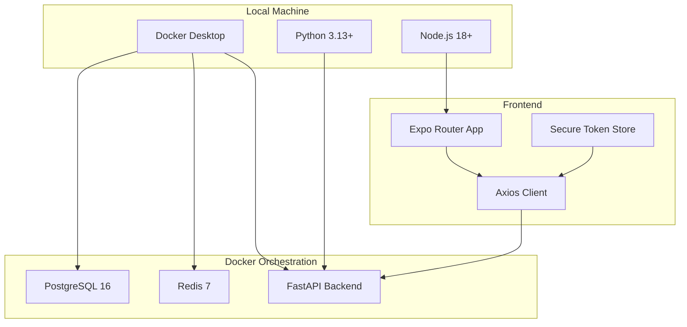
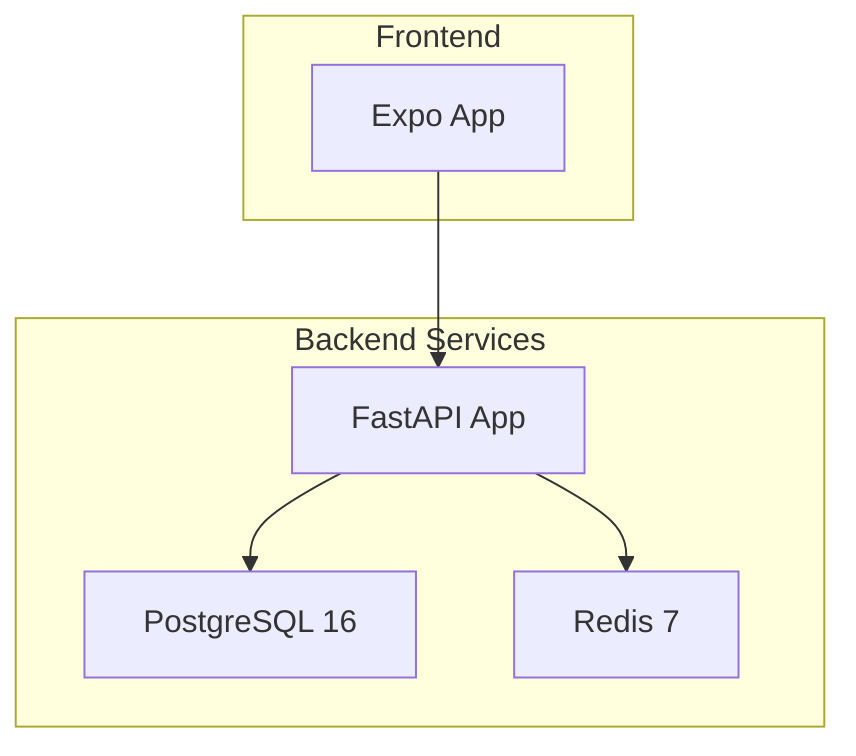
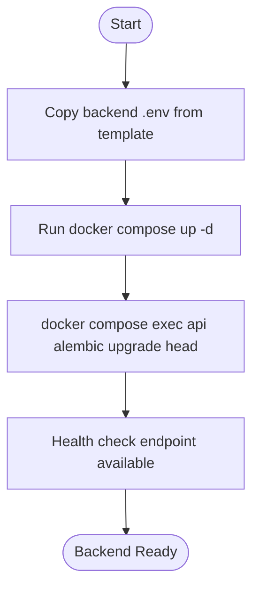
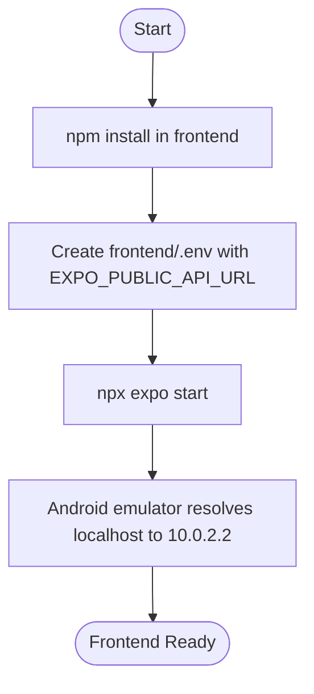
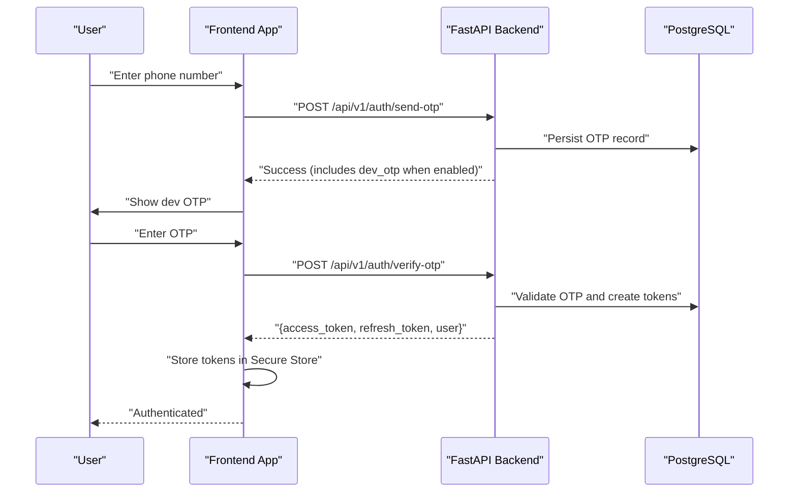
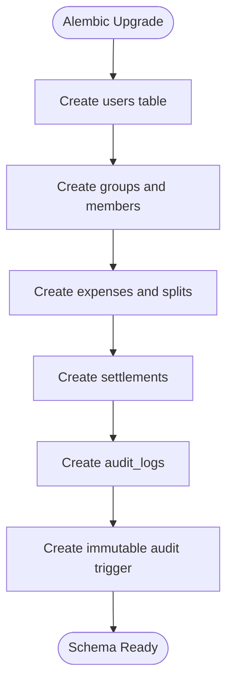
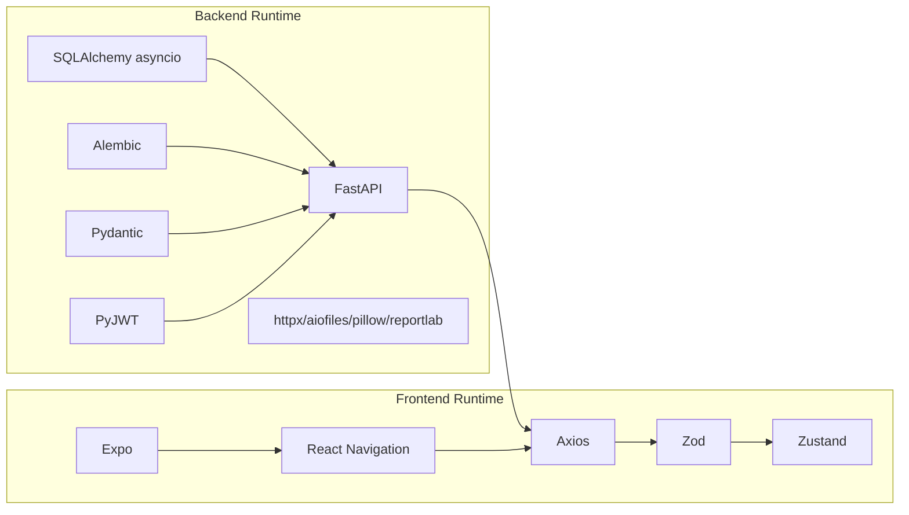

# Getting Started

<cite>
**Referenced Files in This Document**
- [README.md](file://README.md)
- [docker-compose.yml](file://docker-compose.yml)
- [backend/Dockerfile](file://backend/Dockerfile)
- [backend/app/main.py](file://backend/app/main.py)
- [backend/app/core/config.py](file://backend/app/core/config.py)
- [backend/requirements.txt](file://backend/requirements.txt)
- [backend/requirements-dev.txt](file://backend/requirements-dev.txt)
- [backend/alembic/versions/001_initial.py](file://backend/alembic/versions/001_initial.py)
- [frontend/package.json](file://frontend/package.json)
- [frontend/app.json](file://frontend/app.json)
- [frontend/src/services/api.ts](file://frontend/src/services/api.ts)
- [frontend/src/store/authStore.ts](file://frontend/src/store/authStore.ts)
</cite>

## Table of Contents
1. [Introduction](#introduction)
2. [Project Structure](#project-structure)
3. [Core Components](#core-components)
4. [Architecture Overview](#architecture-overview)
5. [Detailed Component Analysis](#detailed-component-analysis)
6. [Dependency Analysis](#dependency-analysis)
7. [Performance Considerations](#performance-considerations)
8. [Troubleshooting Guide](#troubleshooting-guide)
9. [Conclusion](#conclusion)
10. [Appendices](#appendices)

## Introduction
This guide helps you set up and run SplitSure locally on your machine. It covers prerequisites, backend and frontend setup, environment configuration, Docker Compose orchestration, database migration, and initial testing. It also includes troubleshooting tips, platform-specific notes for Android emulators, and development versus production configuration differences with security considerations.

## Project Structure
SplitSure is organized into two primary parts:
- Backend: FastAPI application with asynchronous SQLAlchemy, Alembic migrations, and PostgreSQL via Docker Compose.
- Frontend: Expo Router-based React Native app with TypeScript, Axios for API calls, and secure token storage.

**Diagram sources**
- [docker-compose.yml:1-82](file://docker-compose.yml#L1-L82)
- [backend/Dockerfile:1-15](file://backend/Dockerfile#L1-L15)
- [backend/app/main.py:1-96](file://backend/app/main.py#L1-L96)
- [frontend/src/services/api.ts:1-269](file://frontend/src/services/api.ts#L1-L269)

**Section sources**
- [README.md:24-70](file://README.md#L24-L70)
- [docker-compose.yml:1-82](file://docker-compose.yml#L1-L82)

## Core Components
- Backend stack: FastAPI, SQLAlchemy[asyncio], Alembic, PostgreSQL, Redis, JWT-based auth, and local file storage by default.
- Frontend stack: Expo Router, React Native, Axios, Zod validation, Zustand store, and Expo Secure Store for tokens.
- Orchestration: docker-compose defines services for Postgres, Redis, and the FastAPI app, plus mounted volumes for persistent uploads.

Key setup steps:
- Copy backend environment template to .env and run Docker Compose to start services.
- Apply Alembic migrations to initialize the database schema.
- Install frontend dependencies and configure EXPO_PUBLIC_API_URL.
- Start the frontend and verify connectivity via health checks.

**Section sources**
- [README.md:24-70](file://README.md#L24-L70)
- [backend/app/core/config.py:1-71](file://backend/app/core/config.py#L1-L71)
- [backend/app/main.py:1-96](file://backend/app/main.py#L1-L96)
- [frontend/package.json:1-62](file://frontend/package.json#L1-L62)

## Architecture Overview
The local architecture runs three containers orchestrated by Docker Compose:
- PostgreSQL: stores users, groups, expenses, audit logs, and related entities.
- Redis: caches and token blacklisting.
- FastAPI: exposes the API, serves static uploads in development, and enforces security headers.

**Diagram sources**
- [docker-compose.yml:1-82](file://docker-compose.yml#L1-L82)
- [backend/app/main.py:1-96](file://backend/app/main.py#L1-L96)

**Section sources**
- [docker-compose.yml:1-82](file://docker-compose.yml#L1-L82)
- [backend/app/main.py:1-96](file://backend/app/main.py#L1-L96)

## Detailed Component Analysis

### Backend Setup (FastAPI + PostgreSQL + Redis)
- Prerequisites
  - Docker Desktop installed and running.
  - Python 3.13+ recommended for local development.
- Environment configuration
  - Copy the backend environment template to .env and review variables such as DATABASE_URL, SECRET_KEY, ALLOWED_ORIGINS, USE_LOCAL_STORAGE, LOCAL_UPLOAD_DIR, LOCAL_BASE_URL, USE_DEV_OTP, and optional AWS/S3 variables.
- Docker Compose orchestration
  - Build and start services: db, redis, api.
  - Exposed ports: PostgreSQL 5432, Redis 6379, API 8000.
  - Named volumes persist Postgres data and uploaded proofs.
- Database migration
  - Alembic upgrades to the latest revision to create tables and triggers, including an immutable audit log protection.

**Diagram sources**
- [README.md:32-45](file://README.md#L32-L45)
- [docker-compose.yml:1-82](file://docker-compose.yml#L1-L82)
- [backend/alembic/versions/001_initial.py:1-185](file://backend/alembic/versions/001_initial.py#L1-L185)

**Section sources**
- [README.md:24-70](file://README.md#L24-L70)
- [docker-compose.yml:1-82](file://docker-compose.yml#L1-L82)
- [backend/app/core/config.py:1-71](file://backend/app/core/config.py#L1-L71)
- [backend/app/main.py:68-96](file://backend/app/main.py#L68-L96)
- [backend/alembic/versions/001_initial.py:1-185](file://backend/alembic/versions/001_initial.py#L1-L185)

### Frontend Setup (Expo + React Native)
- Prerequisites
  - Node.js 18+ installed.
- Install dependencies
  - Run npm install in the frontend directory.
- Configure environment
  - Create frontend/.env with EXPO_PUBLIC_API_URL pointing to the local backend API base URL.
- Start the app
  - Use npx expo start to launch the Metro bundler and device/emulator.
- Android-specific behavior
  - The frontend client automatically rewrites localhost/127.0.0.1 to 10.0.2.2 inside Android emulators.

**Diagram sources**
- [README.md:46-70](file://README.md#L46-L70)
- [frontend/src/services/api.ts:25-40](file://frontend/src/services/api.ts#L25-L40)
- [frontend/package.json:1-62](file://frontend/package.json#L1-L62)

**Section sources**
- [README.md:46-70](file://README.md#L46-L70)
- [frontend/src/services/api.ts:25-40](file://frontend/src/services/api.ts#L25-L40)
- [frontend/app.json:1-32](file://frontend/app.json#L1-L32)
- [frontend/package.json:1-62](file://frontend/package.json#L1-L62)

### Authentication Flow (Development OTP Mode)
This sequence illustrates how the frontend authenticates with the backend during development using dev OTP mode.

**Diagram sources**
- [frontend/src/services/api.ts:143-169](file://frontend/src/services/api.ts#L143-L169)
- [frontend/src/store/authStore.ts:29-80](file://frontend/src/store/authStore.ts#L29-L80)
- [backend/app/main.py:88-96](file://backend/app/main.py#L88-L96)

**Section sources**
- [frontend/src/services/api.ts:143-169](file://frontend/src/services/api.ts#L143-L169)
- [frontend/src/store/authStore.ts:29-80](file://frontend/src/store/authStore.ts#L29-L80)
- [backend/app/main.py:88-96](file://backend/app/main.py#L88-L96)

### Database Schema Initialization
The Alembic revision initializes the schema and sets up an immutable audit log trigger to prevent modifications or deletions.

**Diagram sources**
- [backend/alembic/versions/001_initial.py:17-170](file://backend/alembic/versions/001_initial.py#L17-L170)

**Section sources**
- [backend/alembic/versions/001_initial.py:1-185](file://backend/alembic/versions/001_initial.py#L1-L185)

## Dependency Analysis
- Backend runtime dependencies include FastAPI, Uvicorn, SQLAlchemy asyncio, asyncpg, Alembic, Pydantic, PyJWT, passlib, httpx, aiofiles, pillow, and reportlab.
- Frontend dependencies include Expo, React Navigation, Axios, React Query, Zod, and Zustand.
- Dockerfile pins Python 3.12 slim and installs gcc and libpq-dev for building psycopg2-compatible wheels.

**Diagram sources**
- [backend/requirements.txt:1-19](file://backend/requirements.txt#L1-L19)
- [frontend/package.json:13-54](file://frontend/package.json#L13-L54)
- [backend/Dockerfile:1-15](file://backend/Dockerfile#L1-L15)

**Section sources**
- [backend/requirements.txt:1-19](file://backend/requirements.txt#L1-L19)
- [frontend/package.json:13-54](file://frontend/package.json#L13-L54)
- [backend/Dockerfile:1-15](file://backend/Dockerfile#L1-L15)

## Performance Considerations
- Use the provided Docker Compose memory limits for Redis to avoid excessive resource usage.
- Keep uploads local during development to reduce external dependencies; switch to S3 in production for scalability.
- Use async database drivers and keep API endpoints minimal to reduce latency.
- Leverage static file serving for development uploads to avoid extra network hops.

[No sources needed since this section provides general guidance]

## Troubleshooting Guide
Common setup issues and resolutions:
- Backend health check fails
  - Ensure PostgreSQL and Redis are healthy and reachable.
  - Verify DATABASE_URL and SECRET_KEY in backend .env.
  - Confirm port 8000 is free and not blocked by firewall.
- Alembic upgrade errors
  - Re-run the migration command after confirming database connectivity.
  - Check that the database user/password match the compose configuration.
- Frontend cannot connect to backend
  - On Android emulators, ensure EXPO_PUBLIC_API_URL resolves to 10.0.2.2.
  - Confirm ALLOWED_ORIGINS includes the frontend origin and 10.0.2.2.
- OTP not received
  - Development mode returns OTP in the API response; verify USE_DEV_OTP is enabled.
  - Check that the phone number format matches backend expectations.
- File uploads fail
  - Ensure LOCAL_UPLOAD_DIR exists and is writable.
  - Confirm static uploads mount is configured in the backend.

**Section sources**
- [README.md:65-70](file://README.md#L65-L70)
- [docker-compose.yml:34-67](file://docker-compose.yml#L34-L67)
- [backend/app/core/config.py:38-44](file://backend/app/core/config.py#L38-L44)
- [frontend/src/services/api.ts:25-40](file://frontend/src/services/api.ts#L25-L40)
- [backend/app/main.py:48-55](file://backend/app/main.py#L48-L55)

## Conclusion
You now have a complete local environment for SplitSure with a running backend, initialized database, and a frontend connected to the API. Proceed to explore routes, create test users, and validate authentication and expense flows using the health check and API documentation endpoints.

[No sources needed since this section summarizes without analyzing specific files]

## Appendices

### A. Step-by-Step Setup Checklist
- Backend
  - Copy backend .env from the template.
  - Start services with Docker Compose.
  - Run Alembic upgrade to initialize schema.
- Frontend
  - Install dependencies.
  - Create frontend/.env with EXPO_PUBLIC_API_URL.
  - Start the app with npx expo start.
- Verification
  - Health check: GET http://localhost:8000/health
  - Swagger: http://localhost:8000/docs
  - Android emulator: ensure localhost resolves to 10.0.2.2

**Section sources**
- [README.md:24-70](file://README.md#L24-L70)
- [docker-compose.yml:1-82](file://docker-compose.yml#L1-L82)
- [backend/alembic/versions/001_initial.py:1-185](file://backend/alembic/versions/001_initial.py#L1-L185)

### B. Development vs Production Configuration Differences
- Security keys
  - Set a strong SECRET_KEY in production; disable dev OTP mode.
- OTP provider
  - Use a real provider (Twilio or similar) instead of dev OTP mode.
- Storage
  - Use S3 for production; local storage is for development only.
- Transport
  - Serve the API behind HTTPS in production.
- CORS and origins
  - Restrict ALLOWED_ORIGINS to trusted domains.
- Migrations
  - Run Alembic migrations as part of deployment.

**Section sources**
- [README.md:144-154](file://README.md#L144-L154)
- [backend/app/core/config.py:10-14](file://backend/app/core/config.py#L10-L14)
- [backend/app/main.py:32-34](file://backend/app/main.py#L32-L34)

### C. Security Considerations for Local Development
- Development defaults include dev OTP mode and a development secret key; never use these in production.
- Audit logs are protected by a database trigger to prevent tampering.
- Tokens are stored securely on-device; ensure proper session cleanup on auth failures.
- Avoid exposing local ports publicly; restrict to localhost.

**Section sources**
- [README.md:135-143](file://README.md#L135-L143)
- [backend/app/main.py:59-66](file://backend/app/main.py#L59-L66)
- [frontend/src/store/authStore.ts:113-116](file://frontend/src/store/authStore.ts#L113-L116)