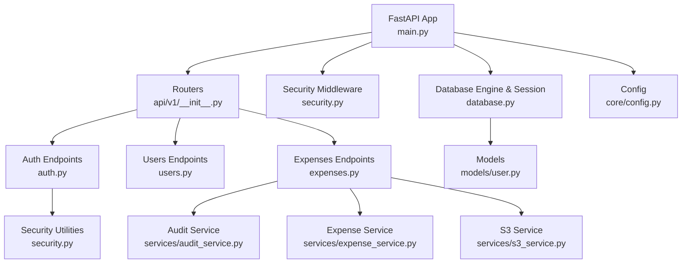
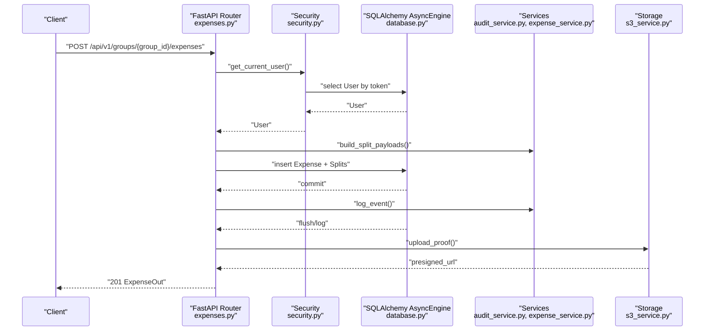
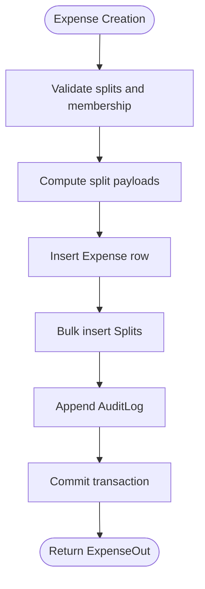
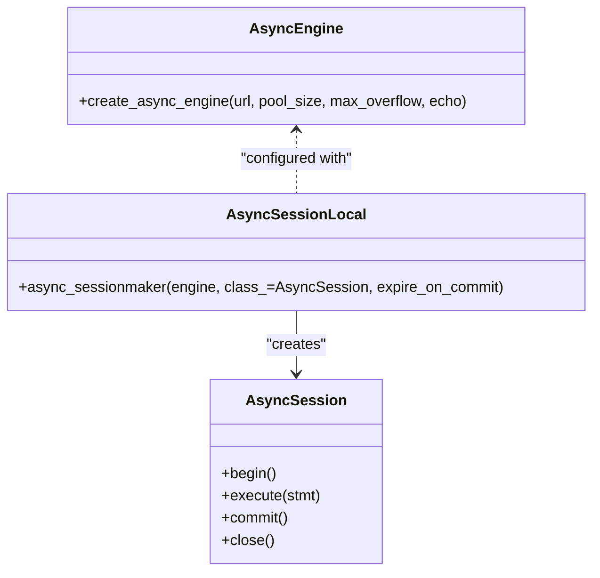
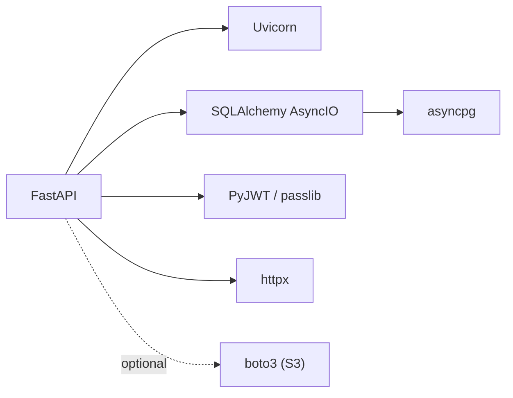

# Backend Performance Optimization

<cite>
**Referenced Files in This Document**
- [main.py](file://backend/app/main.py)
- [database.py](file://backend/app/core/database.py)
- [config.py](file://backend/app/core/config.py)
- [security.py](file://backend/app/core/security.py)
- [auth.py](file://backend/app/api/v1/endpoints/auth.py)
- [expenses.py](file://backend/app/api/v1/endpoints/expenses.py)
- [users.py](file://backend/app/api/v1/endpoints/users.py)
- [user.py](file://backend/app/models/user.py)
- [audit_service.py](file://backend/app/services/audit_service.py)
- [expense_service.py](file://backend/app/services/expense_service.py)
- [s3_service.py](file://backend/app/services/s3_service.py)
- [requirements.txt](file://backend/requirements.txt)
</cite>

## Table of Contents
1. [Introduction](#introduction)
2. [Project Structure](#project-structure)
3. [Core Components](#core-components)
4. [Architecture Overview](#architecture-overview)
5. [Detailed Component Analysis](#detailed-component-analysis)
6. [Dependency Analysis](#dependency-analysis)
7. [Performance Considerations](#performance-considerations)
8. [Troubleshooting Guide](#troubleshooting-guide)
9. [Conclusion](#conclusion)
10. [Appendices](#appendices)

## Introduction
This document provides a comprehensive guide to backend performance optimization for the SplitSure FastAPI application. It focuses on database query optimization, connection pooling, indexing, caching strategies, asynchronous processing, resource management, monitoring, load testing, and endpoint tuning. The goal is to reduce latency, improve throughput, and maintain reliability under high load conditions.

## Project Structure
The backend follows a layered architecture:
- Application entrypoint initializes FastAPI, middleware, routers, and database triggers.
- Core modules handle configuration, database engine/session creation, and security utilities.
- API v1 endpoints implement business logic for auth, users, groups, expenses, settlements, audit, and reports.
- Services encapsulate domain logic for splitting, auditing, and storage.
- Models define SQLAlchemy ORM entities and relationships.

**Diagram sources**
- [main.py:1-96](file://backend/app/main.py#L1-L96)
- [__init__.py:1-12](file://backend/app/api/v1/__init__.py#L1-L12)
- [auth.py:1-147](file://backend/app/api/v1/endpoints/auth.py#L1-L147)
- [users.py:1-115](file://backend/app/api/v1/endpoints/users.py#L1-L115)
- [expenses.py:1-395](file://backend/app/api/v1/endpoints/expenses.py#L1-L395)
- [security.py:1-96](file://backend/app/core/security.py#L1-L96)
- [database.py:1-29](file://backend/app/core/database.py#L1-L29)
- [user.py:1-234](file://backend/app/models/user.py#L1-L234)
- [audit_service.py:1-32](file://backend/app/services/audit_service.py#L1-L32)
- [expense_service.py:1-79](file://backend/app/services/expense_service.py#L1-L79)
- [s3_service.py:1-158](file://backend/app/services/s3_service.py#L1-L158)
- [config.py:1-71](file://backend/app/core/config.py#L1-L71)

**Section sources**
- [main.py:1-96](file://backend/app/main.py#L1-L96)
- [__init__.py:1-12](file://backend/app/api/v1/__init__.py#L1-L12)

## Core Components
- Asynchronous database engine and session factory configured with connection pooling parameters.
- Centralized settings for database URL, security keys, storage mode, and rate limits.
- JWT-based authentication with token blacklisting and revocation checks.
- Endpoint handlers for OTP generation/verification, user management, and expense CRUD with selective eager loading.
- Domain services for split calculation, audit logging, and storage abstraction.

**Section sources**
- [database.py:1-29](file://backend/app/core/database.py#L1-L29)
- [config.py:1-71](file://backend/app/core/config.py#L1-L71)
- [security.py:1-96](file://backend/app/core/security.py#L1-L96)
- [auth.py:1-147](file://backend/app/api/v1/endpoints/auth.py#L1-L147)
- [expenses.py:1-395](file://backend/app/api/v1/endpoints/expenses.py#L1-L395)
- [users.py:1-115](file://backend/app/api/v1/endpoints/users.py#L1-L115)
- [audit_service.py:1-32](file://backend/app/services/audit_service.py#L1-L32)
- [expense_service.py:1-79](file://backend/app/services/expense_service.py#L1-L79)
- [s3_service.py:1-158](file://backend/app/services/s3_service.py#L1-L158)

## Architecture Overview
The runtime flow integrates FastAPI, SQLAlchemy AsyncIO, and external services:
- Requests enter via FastAPI routes, validated by security middleware and dependency injection for sessions.
- Business logic is handled by service modules and models.
- Storage operations leverage local filesystem or S3 depending on configuration.
- Audit logs are appended immutably via a PostgreSQL trigger.

**Diagram sources**
- [expenses.py:143-179](file://backend/app/api/v1/endpoints/expenses.py#L143-L179)
- [security.py:72-95](file://backend/app/core/security.py#L72-L95)
- [database.py:5-29](file://backend/app/core/database.py#L5-L29)
- [audit_service.py:6-31](file://backend/app/services/audit_service.py#L6-L31)
- [s3_service.py:105-147](file://backend/app/services/s3_service.py#L105-L147)

## Detailed Component Analysis

### Database Query Optimization
- Efficient query patterns:
  - Use filtered queries with indexed columns (e.g., user phone, OTP lookup).
  - Prefer scalar-first retrieval for existence checks and single-row lookups.
  - Apply pagination with limit/offset for list endpoints.
- Bulk operations:
  - Batch inserts for splits during expense creation.
  - Avoid N+1 selects by using selectinload for related entities.
- Query execution plans:
  - Ensure indexes exist on frequently filtered columns (e.g., users.phone, otp_records.phone, blacklisted_tokens.token_hash, audit_logs.group_id, audit_logs.entity_id, audit_logs.created_at).
  - Use EXPLAIN/ANALYZE to validate index usage and avoid sequential scans on large tables.

**Diagram sources**
- [expenses.py:143-179](file://backend/app/api/v1/endpoints/expenses.py#L143-L179)
- [expense_service.py:19-79](file://backend/app/services/expense_service.py#L19-L79)
- [audit_service.py:6-31](file://backend/app/services/audit_service.py#L6-L31)

**Section sources**
- [expenses.py:182-216](file://backend/app/api/v1/endpoints/expenses.py#L182-L216)
- [expenses.py:59-74](file://backend/app/api/v1/endpoints/expenses.py#L59-L74)
- [user.py:124-147](file://backend/app/models/user.py#L124-L147)
- [user.py:149-162](file://backend/app/models/user.py#L149-L162)
- [user.py:184-199](file://backend/app/models/user.py#L184-L199)

### Connection Pooling Strategies with SQLAlchemy
- Current configuration:
  - Engine pool_size and max_overflow define concurrency limits.
  - AsyncSessionLocal manages sessions with expire_on_commit disabled.
- Recommendations:
  - Tune pool_size and max_overflow based on CPU cores and DB capacity.
  - Enable echo only for diagnostics; keep off in production.
  - Use heartbeat/timeout settings to detect stale connections.
  - Monitor pool usage metrics and adjust dynamically if needed.

**Diagram sources**
- [database.py:5-29](file://backend/app/core/database.py#L5-L29)

**Section sources**
- [database.py:1-29](file://backend/app/core/database.py#L1-L29)
- [config.py](file://backend/app/core/config.py#L8)

### Database Indexing Optimization
- Indexed columns present in models:
  - users.phone, users.email, users.id
  - otp_records.phone, blacklisted_tokens.token_hash, blacklisted_tokens.expires_at
  - audit_logs.group_id, audit_logs.entity_id, audit_logs.created_at
- Additional recommendations:
  - Add composite indexes for frequent filters (e.g., expenses.group_id + is_deleted + created_at).
  - Consider partial indexes for immutable audit_logs to optimize read-heavy workloads.
  - Regularly review slow query logs and add missing indexes.

**Section sources**
- [user.py:54-63](file://backend/app/models/user.py#L54-L63)
- [user.py:74-78](file://backend/app/models/user.py#L74-L78)
- [user.py](file://backend/app/models/user.pyL85)
- [user.py:188-195](file://backend/app/models/user.py#L188-L195)

### Query Caching Mechanisms
- Suggested approach:
  - Cache read-mostly data (e.g., user profiles, group memberships) using an in-memory cache with TTL.
  - Invalidate cache on write operations (e.g., user updates, group membership changes).
  - Use cache-aside pattern for expensive reads; avoid caching sensitive data without encryption.
- Implementation note:
  - Introduce a caching layer (e.g., Redis) for token blacklisting and session data to reduce repeated DB hits.

**Section sources**
- [security.py:63-69](file://backend/app/core/security.py#L63-L69)
- [users.py:17-48](file://backend/app/api/v1/endpoints/users.py#L17-L48)

### Asynchronous Processing Patterns
- FastAPI async/await:
  - All endpoints are async; database operations use AsyncSession.
- Background tasks:
  - Offload non-critical tasks (e.g., analytics, notifications) to background workers or queues.
- Concurrent request handling:
  - Scale Uvicorn workers; ensure DB pool sizing supports concurrency.
  - Avoid blocking operations in request handlers; delegate heavy work to background tasks.

**Section sources**
- [main.py:1-96](file://backend/app/main.py#L1-L96)
- [auth.py:39-56](file://backend/app/api/v1/endpoints/auth.py#L39-L56)
- [s3_service.py:76-88](file://backend/app/services/s3_service.py#L76-L88)

### Caching Strategies and Token Blacklisting
- Redis integration (recommended):
  - Store token hashes in Redis with expiration aligned to JWT exp to support blacklisting.
  - Use atomic operations to add tokens to blacklist and remove expired entries.
- Cache invalidation:
  - Invalidate user session caches on logout and profile updates.
  - Periodic cleanup of expired blacklist entries.
- Cache warming:
  - Warm hot-path caches (e.g., recent audit events) during low-load periods.

**Section sources**
- [security.py:47-70](file://backend/app/core/security.py#L47-L70)
- [config.py:10-14](file://backend/app/core/config.py#L10-L14)

### Resource Management
- Memory optimization:
  - Stream file uploads and avoid loading large payloads into memory unnecessarily.
  - Use async file operations and limit batch sizes for bulk writes.
- Garbage collection:
  - Keep default GC settings; monitor memory growth under load.
- CPU utilization:
  - Profile CPU-bound tasks; offload to background workers.
  - Use async I/O for DB and external API calls.

**Section sources**
- [s3_service.py:117-136](file://backend/app/services/s3_service.py#L117-L136)
- [expenses.py:352-394](file://backend/app/api/v1/endpoints/expenses.py#L352-L394)

### Performance Monitoring
- Metrics collection:
  - Track request latency, error rates, and throughput per endpoint.
  - Expose metrics via Prometheus or similar.
- Database profiling:
  - Enable slow query logs and analyze query patterns.
- Response time tracking:
  - Instrument middleware to capture per-request timings.

**Section sources**
- [main.py:88-95](file://backend/app/main.py#L88-L95)

### Load Testing and Bottleneck Identification
- Methodologies:
  - Use tools to simulate concurrent users and transactions.
  - Gradually increase load to identify saturation points.
- Bottleneck identification:
  - Correlate DB lock waits, connection pool exhaustion, and external API latencies.
- Performance regression testing:
  - Automate baseline measurements and alert on regressions.

[No sources needed since this section provides general guidance]

### Guidelines for Optimizing API Endpoints
- Reduce latency:
  - Minimize round-trips; combine queries where possible.
  - Use selective eager loading to avoid over-fetching.
- Improve throughput:
  - Batch writes and reads; tune DB pool and worker counts.
  - Offload non-critical tasks to background jobs.
- Endpoint-specific tips:
  - Auth: Cache decoded user identity for short-lived requests; rely on blacklist cache for revocation checks.
  - Expenses: Paginate lists; avoid unnecessary joins; precompute split payloads.
  - Users: Validate uniqueness early; stream avatar uploads.

**Section sources**
- [auth.py:58-115](file://backend/app/api/v1/endpoints/auth.py#L58-L115)
- [expenses.py:182-216](file://backend/app/api/v1/endpoints/expenses.py#L182-L216)
- [users.py:51-83](file://backend/app/api/v1/endpoints/users.py#L51-L83)

## Dependency Analysis
External dependencies impacting performance:
- FastAPI and Uvicorn for async web server.
- SQLAlchemy 2.x AsyncIO for ORM and async database connectivity.
- asyncpg for PostgreSQL driver.
- PyJWT and passlib for security.
- httpx for outbound OTP requests.
- Optional boto3 for S3 (only when USE_LOCAL_STORAGE=false).

**Diagram sources**
- [requirements.txt:1-19](file://backend/requirements.txt#L1-L19)

**Section sources**
- [requirements.txt:1-19](file://backend/requirements.txt#L1-L19)

## Performance Considerations
- Database:
  - Ensure adequate indexes; monitor query plans; avoid N+1 queries.
  - Use connection pooling tuned to workload; enable timeouts.
- Network:
  - Minimize external calls; cache results; use async clients.
- Storage:
  - Prefer streaming uploads; choose appropriate storage mode (local vs S3).
- Security:
  - Token blacklisting requires fast lookups; consider Redis-backed cache.
- Observability:
  - Instrument endpoints; collect metrics; set up alerts.

[No sources needed since this section provides general guidance]

## Troubleshooting Guide
- Common issues and mitigations:
  - 429 Too Many Requests during OTP: Verify rate-limit logic and database index on phone.
  - 401 Unauthorized due to blacklist: Confirm blacklist cleanup and cache correctness.
  - Slow expense listing: Ensure pagination and selective eager loading are applied.
  - Upload failures: Validate file type and size checks; confirm storage mode configuration.

**Section sources**
- [auth.py:24-34](file://backend/app/api/v1/endpoints/auth.py#L24-L34)
- [auth.py:62-79](file://backend/app/api/v1/endpoints/auth.py#L62-L79)
- [security.py:63-69](file://backend/app/core/security.py#L63-L69)
- [expenses.py:182-216](file://backend/app/api/v1/endpoints/expenses.py#L182-L216)
- [s3_service.py:114-123](file://backend/app/services/s3_service.py#L114-L123)

## Conclusion
By applying targeted database optimization, robust connection pooling, strategic indexing, and effective caching—combined with asynchronous processing and comprehensive monitoring—you can significantly improve SplitSure’s backend performance. Focus on endpoint-level improvements, background task offloading, and continuous load testing to sustain high throughput under real-world conditions.

## Appendices

### Appendix A: Endpoint-Level Optimization Checklist
- Use pagination and limit offsets.
- Apply selective eager loading; avoid N+1.
- Cache read-heavy resources; invalidate on writes.
- Stream uploads; validate early.
- Offload non-critical tasks to background workers.

[No sources needed since this section provides general guidance]