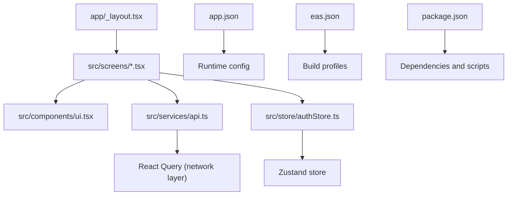
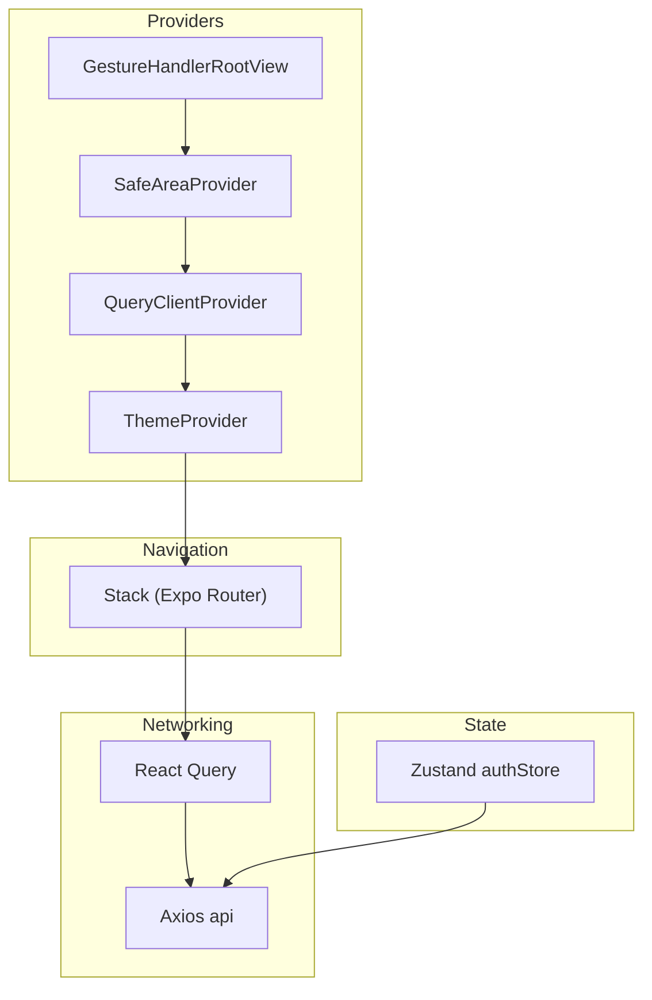
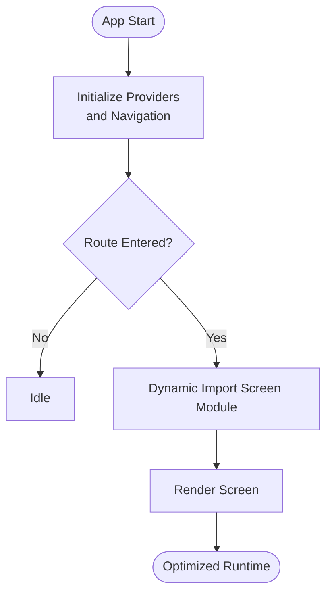
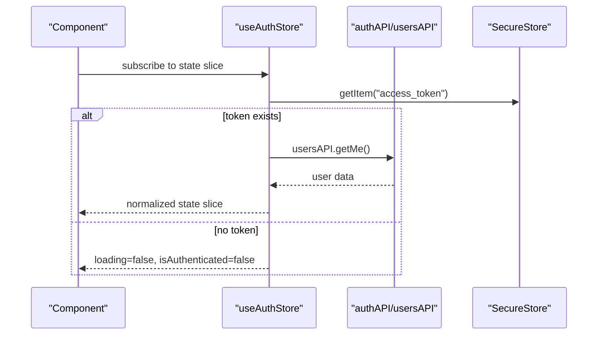
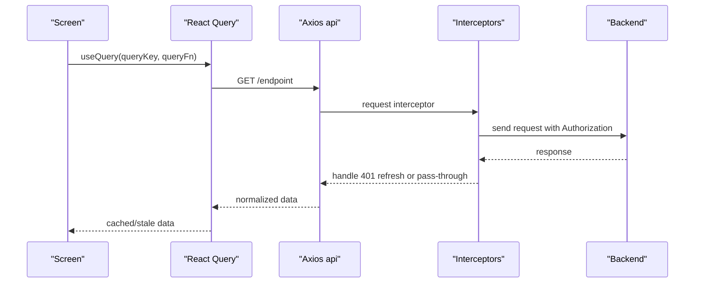
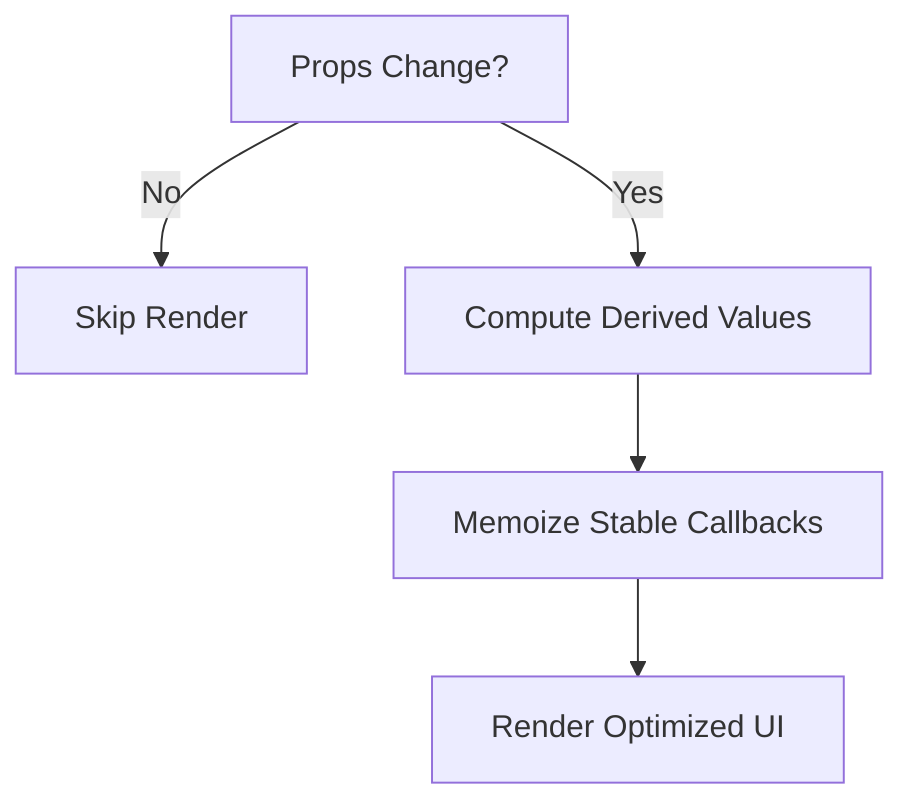
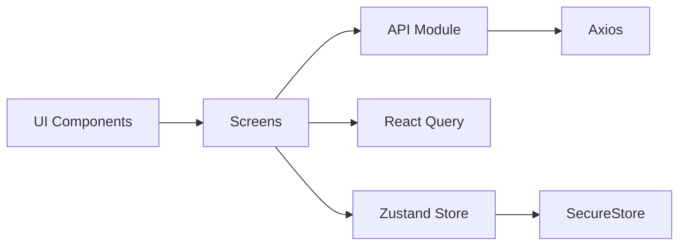

# Frontend Performance Optimization

<cite>
**Referenced Files in This Document**
- [package.json](file://frontend/package.json)
- [app/_layout.tsx](file://frontend/app/_layout.tsx)
- [src/services/api.ts](file://frontend/src/services/api.ts)
- [src/store/authStore.ts](file://frontend/src/store/authStore.ts)
- [src/utils/helpers.ts](file://frontend/src/utils/helpers.ts)
- [src/utils/theme.ts](file://frontend/src/utils/theme.ts)
- [src/components/ui.tsx](file://frontend/src/components/ui.tsx)
- [src/screens/HomeScreen.tsx](file://frontend/src/screens/HomeScreen.tsx)
- [src/screens/GroupsScreen.tsx](file://frontend/src/screens/GroupsScreen.tsx)
- [src/screens/ActivityScreen.tsx](file://frontend/src/screens/ActivityScreen.tsx)
- [app.json](file://frontend/app.json)
- [eas.json](file://frontend/eas.json)
</cite>

## Table of Contents
1. [Introduction](#introduction)
2. [Project Structure](#project-structure)
3. [Core Components](#core-components)
4. [Architecture Overview](#architecture-overview)
5. [Detailed Component Analysis](#detailed-component-analysis)
6. [Dependency Analysis](#dependency-analysis)
7. [Performance Considerations](#performance-considerations)
8. [Troubleshooting Guide](#troubleshooting-guide)
9. [Conclusion](#conclusion)
10. [Appendices](#appendices)

## Introduction
This document provides a comprehensive guide to frontend performance optimization for the SplitSure React Native application. It focuses on bundle optimization, lazy loading, state management efficiency, network request optimization, component performance, memory management, monitoring, and critical rendering improvements. The guidance is grounded in the actual codebase and build configuration present in the repository.

## Project Structure
The frontend is organized around:
- Application shell and navigation: app/_layout.tsx
- Screens: src/screens/*.tsx
- Shared UI components: src/components/ui.tsx
- Services and API client: src/services/api.ts
- State management: src/store/authStore.ts
- Utilities and theme: src/utils/*
- Build and runtime configuration: app.json, eas.json, package.json

**Diagram sources**
- [app/_layout.tsx:1-85](file://frontend/app/_layout.tsx#L1-L85)
- [src/screens/HomeScreen.tsx:1-404](file://frontend/src/screens/HomeScreen.tsx#L1-L404)
- [src/components/ui.tsx:1-689](file://frontend/src/components/ui.tsx#L1-L689)
- [src/services/api.ts:1-271](file://frontend/src/services/api.ts#L1-L271)
- [src/store/authStore.ts:1-116](file://frontend/src/store/authStore.ts#L1-L116)
- [app.json:1-32](file://frontend/app.json#L1-L32)
- [eas.json:1-25](file://frontend/eas.json#L1-L25)
- [package.json:1-62](file://frontend/package.json#L1-L62)

**Section sources**
- [app/_layout.tsx:1-85](file://frontend/app/_layout.tsx#L1-L85)
- [package.json:1-62](file://frontend/package.json#L1-L62)
- [app.json:1-32](file://frontend/app.json#L1-L32)
- [eas.json:1-25](file://frontend/eas.json#L1-L25)

## Core Components
- Navigation and providers: Root layout initializes React Query, gesture/safe area providers, theme provider, and global notifications.
- Network layer: Axios client with interceptors for auth, retries, and health checks; API module exports typed endpoints.
- State management: Zustand store for auth state with secure storage and push token registration.
- UI primitives: Reusable components with animations and themed visuals.
- Screens: Home, Groups, and Activity screens leverage React Query for data fetching and memoized UI components.

**Section sources**
- [app/_layout.tsx:1-85](file://frontend/app/_layout.tsx#L1-L85)
- [src/services/api.ts:1-271](file://frontend/src/services/api.ts#L1-L271)
- [src/store/authStore.ts:1-116](file://frontend/src/store/authStore.ts#L1-L116)
- [src/components/ui.tsx:1-689](file://frontend/src/components/ui.tsx#L1-L689)
- [src/screens/HomeScreen.tsx:1-404](file://frontend/src/screens/HomeScreen.tsx#L1-L404)
- [src/screens/GroupsScreen.tsx:1-292](file://frontend/src/screens/GroupsScreen.tsx#L1-L292)
- [src/screens/ActivityScreen.tsx:1-141](file://frontend/src/screens/ActivityScreen.tsx#L1-L141)

## Architecture Overview
The runtime architecture centers on:
- Provider stack: Gesture handler, safe area, React Query, theme provider, and toast.
- Navigation: Expo Router managed Stack with route-level screens.
- Data fetching: React Query with centralized defaults and per-query keys.
- State: Zustand store for auth lifecycle and session persistence.
- Networking: Axios with request/response interceptors, token refresh, and transient error handling.

**Diagram sources**
- [app/_layout.tsx:72-84](file://frontend/app/_layout.tsx#L72-L84)
- [src/services/api.ts:42-140](file://frontend/src/services/api.ts#L42-L140)
- [src/store/authStore.ts:29-111](file://frontend/src/store/authStore.ts#L29-L111)

## Detailed Component Analysis

### Bundle Optimization and Lazy Loading
- Dynamic imports and route-level lazy loading: Use Expo Router dynamic routes to defer loading of heavy screens until navigation occurs. This reduces initial bundle size and improves startup time.
- Asset optimization: Prefer vector assets and SVGs for icons and illustrations. Minimize image sizes and use appropriate formats; leverage platform-specific assets where beneficial.
- Tree shaking and modularization: Keep shared utilities and components in dedicated modules to improve dead-code elimination. Avoid importing unused libraries or large optional modules.
- Metro bundler tuning: Configure Metro for production builds and enable minification. Use EAS build profiles to optimize APK/AAB outputs.

**Section sources**
- [app/_layout.tsx:50-66](file://frontend/app/_layout.tsx#L50-L66)
- [eas.json:5-20](file://frontend/eas.json#L5-L20)
- [package.json:13-53](file://frontend/package.json#L13-L53)

### State Management Efficiency with Zustand
- Store optimization: Keep the auth store focused and granular. Persist tokens via secure storage and avoid storing large transient objects in the store.
- Selector memoization: Use narrow selectors to prevent unnecessary re-renders. Access only required slices of state in components.
- Normalization patterns: Normalize API responses into flat structures keyed by IDs to reduce duplication and simplify updates.

**Diagram sources**
- [src/store/authStore.ts:62-80](file://frontend/src/store/authStore.ts#L62-L80)
- [src/services/api.ts:172-184](file://frontend/src/services/api.ts#L172-L184)

**Section sources**
- [src/store/authStore.ts:14-27](file://frontend/src/store/authStore.ts#L14-L27)
- [src/store/authStore.ts:29-111](file://frontend/src/store/authStore.ts#L29-L111)
- [src/utils/helpers.ts:39-49](file://frontend/src/utils/helpers.ts#L39-L49)

### Network Request Optimization
- Request batching: Coalesce related requests where feasible. For example, batch balance calculations per group to minimize round-trips.
- Caching strategies: Use React Query’s cache with sensible stale times. Leverage query keys to invalidate and refetch efficiently.
- Retry mechanisms: Centralize retry logic in interceptors and React Query defaults. Distinguish transient vs permanent failures.
- Connection pooling: Reuse a single Axios instance; configure timeouts and keep-alive appropriately for mobile environments.

**Diagram sources**
- [src/screens/HomeScreen.tsx:22-42](file://frontend/src/screens/HomeScreen.tsx#L22-L42)
- [src/services/api.ts:77-140](file://frontend/src/services/api.ts#L77-L140)
- [app/_layout.tsx:22-27](file://frontend/app/_layout.tsx#L22-L27)

**Section sources**
- [src/services/api.ts:42-140](file://frontend/src/services/api.ts#L42-L140)
- [src/utils/helpers.ts:39-49](file://frontend/src/utils/helpers.ts#L39-L49)
- [app/_layout.tsx:22-27](file://frontend/app/_layout.tsx#L22-L27)

### React Component Performance Optimization
- Memoization: Use React.memo for static or low-churn components (e.g., quick action buttons) to avoid re-renders.
- Virtualization: For long lists, prefer FlatList or similar virtualized lists. The current screens use ScrollView; consider replacing with virtualized lists for large datasets.
- Render optimization: Keep render-heavy computations outside render cycles; compute derived values once per query or via selectors.
- Avoid unnecessary re-renders: Pass stable callbacks and objects; derive props from normalized state.

**Section sources**
- [src/screens/HomeScreen.tsx:190-209](file://frontend/src/screens/HomeScreen.tsx#L190-L209)
- [src/components/ui.tsx:35-104](file://frontend/src/components/ui.tsx#L35-L104)

### Memory Management
- Garbage collection optimization: Avoid retaining closures or large arrays across navigations. Clear timers and subscriptions in effects.
- Memory leak detection: Monitor long-lived subscriptions (e.g., notifications) and ensure cleanup on unmount.
- Efficient data structures: Use primitive keys and small objects; avoid deep cloning of large payloads.

**Section sources**
- [app/_layout.tsx:34-45](file://frontend/app/_layout.tsx#L34-L45)
- [src/store/authStore.ts:49-60](file://frontend/src/store/authStore.ts#L49-L60)

### Performance Monitoring
- React DevTools Profiler: Use profiling to identify expensive renders and long tasks during navigation and data fetches.
- Network performance tracking: Observe request durations and retry counts via React Query Devtools and network logs.
- User experience metrics: Track First Contentful Paint (FCP), Largest Contentful Paint (LCP), and interaction latencies for key routes.

**Section sources**
- [app/_layout.tsx:22-27](file://frontend/app/_layout.tsx#L22-L27)

## Dependency Analysis
- External libraries: Zustand for lightweight state, React Query for caching and refetching, Axios for HTTP, Expo ecosystem for platform integrations.
- Coupling: Screens depend on React Query and API modules; Zustand is decoupled via service calls. UI components are reusable and theme-driven.

**Diagram sources**
- [src/components/ui.tsx:1-689](file://frontend/src/components/ui.tsx#L1-L689)
- [src/screens/HomeScreen.tsx:1-404](file://frontend/src/screens/HomeScreen.tsx#L1-L404)
- [src/services/api.ts:1-271](file://frontend/src/services/api.ts#L1-L271)
- [src/store/authStore.ts:1-116](file://frontend/src/store/authStore.ts#L1-L116)

**Section sources**
- [package.json:13-53](file://frontend/package.json#L13-L53)

## Performance Considerations
- Critical rendering paths:
  - Preload essential assets and fonts.
  - Defer non-critical UI until data is ready.
  - Use skeleton loaders for placeholders.
- Bundle size reduction:
  - Enable tree shaking and modularize code.
  - Remove unused dependencies.
  - Use platform-specific assets judiciously.
- Startup time:
  - Lazy-load heavy screens.
  - Minimize synchronous work in root layout.
  - Optimize EAS build profiles for production.

[No sources needed since this section provides general guidance]

## Troubleshooting Guide
- Authentication refresh loops: Inspect interceptor queue handling and ensure unique retry flags to prevent infinite loops.
- Transient network errors: Verify transient error detection and health-check fallback logic.
- Query invalidation: Confirm React Query keys match entity boundaries to avoid stale data or excessive refetches.

**Section sources**
- [src/services/api.ts:55-74](file://frontend/src/services/api.ts#L55-L74)
- [src/services/api.ts:89-140](file://frontend/src/services/api.ts#L89-L140)
- [src/utils/helpers.ts:39-49](file://frontend/src/utils/helpers.ts#L39-L49)

## Conclusion
By applying dynamic imports, optimizing network caching and retries, leveraging memoization and virtualization, and refining state normalization, SplitSure can achieve significant performance gains. Combine these strategies with robust monitoring and iterative profiling to sustain high performance across devices and network conditions.

[No sources needed since this section summarizes without analyzing specific files]

## Appendices
- Build configuration highlights:
  - Android uses cleartext traffic and development client for internal distribution.
  - Production builds target Android App Bundle.

**Section sources**
- [app.json:10-25](file://frontend/app.json#L10-L25)
- [eas.json:5-20](file://frontend/eas.json#L5-L20)