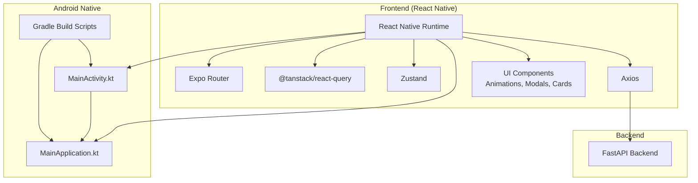
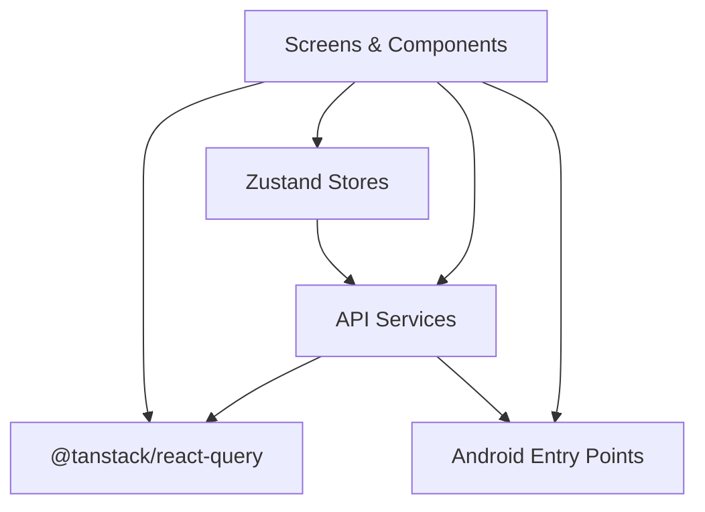
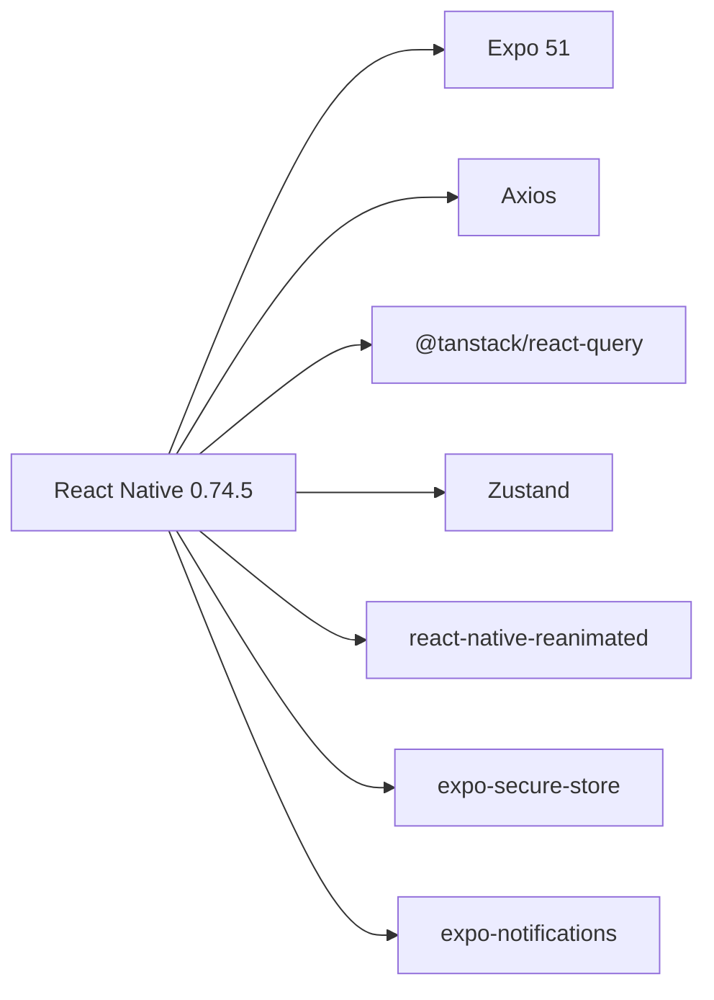

# Mobile Performance Optimization

<cite>
**Referenced Files in This Document**
- [README.md](file://README.md)
- [package.json](file://frontend/package.json)
- [app.json](file://frontend/app.json)
- [eas.json](file://frontend/eas.json)
- [build.gradle](file://frontend/android/build.gradle)
- [app/build.gradle](file://frontend/android/app/build.gradle)
- [MainActivity.kt](file://frontend/android/app/src/main/java/com/splitsure/app/MainActivity.kt)
- [MainApplication.kt](file://frontend/android/app/src/main/java/com/splitsure/app/MainApplication.kt)
- [api.ts](file://frontend/src/services/api.ts)
- [authStore.ts](file://frontend/src/store/authStore.ts)
- [helpers.ts](file://frontend/src/utils/helpers.ts)
- [HomeScreen.tsx](file://frontend/src/screens/HomeScreen.tsx)
- [GroupsScreen.tsx](file://frontend/src/screens/GroupsScreen.tsx)
- [ui.tsx](file://frontend/src/components/ui.tsx)
</cite>

## Table of Contents
1. [Introduction](#introduction)
2. [Project Structure](#project-structure)
3. [Core Components](#core-components)
4. [Architecture Overview](#architecture-overview)
5. [Detailed Component Analysis](#detailed-component-analysis)
6. [Dependency Analysis](#dependency-analysis)
7. [Performance Considerations](#performance-considerations)
8. [Troubleshooting Guide](#troubleshooting-guide)
9. [Conclusion](#conclusion)
10. [Appendices](#appendices)

## Introduction
This document provides comprehensive mobile performance optimization guidance for the SplitSure React Native application on Android. It focuses on memory management, battery optimization, network efficiency, UI responsiveness, background processing, platform-specific optimizations, monitoring, and build-time improvements. The recommendations are grounded in the current codebase and aligned with modern React Native and Android best practices.

## Project Structure
SplitSure is a React Native application built with Expo Router, using TypeScript, React Query for data fetching, Zustand for state management, and native Android modules. The Android app integrates with React Native via Gradle and Kotlin entry points, while the frontend leverages modern libraries for animations, notifications, and UI.

**Diagram sources**
- [MainActivity.kt:13-41](file://frontend/android/app/src/main/java/com/splitsure/app/MainActivity.kt#L13-L41)
- [MainApplication.kt:18-49](file://frontend/android/app/src/main/java/com/splitsure/app/MainApplication.kt#L18-L49)
- [build.gradle:1-42](file://frontend/android/build.gradle#L1-L42)
- [app/build.gradle:1-219](file://frontend/android/app/build.gradle#L1-L219)
- [api.ts:42-46](file://frontend/src/services/api.ts#L42-L46)

**Section sources**
- [README.md:1-162](file://README.md#L1-L162)
- [package.json:1-62](file://frontend/package.json#L1-L62)
- [app.json:1-32](file://frontend/app.json#L1-L32)
- [eas.json:1-25](file://frontend/eas.json#L1-L25)

## Core Components
- Network layer: Centralized Axios client with interceptors for auth, retries, and timeouts.
- Authentication store: Zustand store managing tokens, session lifecycle, and push token registration.
- UI components: Reanimated-based animations, glassmorphism cards, and skeleton loaders for perceived performance.
- Screens: Home and Groups screens using React Query for data fetching and optimistic UI updates.
- Android integration: MainActivity and MainApplication configure the ReactActivity delegate and lifecycle hooks.

**Section sources**
- [api.ts:42-140](file://frontend/src/services/api.ts#L42-L140)
- [authStore.ts:29-111](file://frontend/src/store/authStore.ts#L29-L111)
- [HomeScreen.tsx:18-188](file://frontend/src/screens/HomeScreen.tsx#L18-L188)
- [GroupsScreen.tsx:22-174](file://frontend/src/screens/GroupsScreen.tsx#L22-L174)
- [ui.tsx:35-479](file://frontend/src/components/ui.tsx#L35-L479)
- [MainActivity.kt:13-41](file://frontend/android/app/src/main/java/com/splitsure/app/MainActivity.kt#L13-L41)
- [MainApplication.kt:18-49](file://frontend/android/app/src/main/java/com/splitsure/app/MainApplication.kt#L18-L49)

## Architecture Overview
The app follows a layered architecture:
- Presentation layer: Screens and components using React Navigation and Expo Router.
- Domain layer: Services encapsulate API calls and business logic.
- State layer: Zustand stores manage global state and side effects.
- Data layer: React Query handles caching, refetching, and invalidation.
- Native layer: Android entry points integrate with React Native runtime.

**Diagram sources**
- [HomeScreen.tsx:18-188](file://frontend/src/screens/HomeScreen.tsx#L18-L188)
- [authStore.ts:29-111](file://frontend/src/store/authStore.ts#L29-L111)
- [api.ts:42-271](file://frontend/src/services/api.ts#L42-L271)
- [GroupsScreen.tsx:22-174](file://frontend/src/screens/GroupsScreen.tsx#L22-L174)

## Detailed Component Analysis

### Network Layer and Memory Management
- Centralized Axios client with timeouts and request/response interceptors.
- Token refresh queue prevents redundant refresh calls and avoids race conditions.
- Android-specific base URL normalization for emulator connectivity.
- Transient network error detection enables retry logic.

Optimization opportunities:
- Implement connection reuse via a singleton HTTP client and keep-alive headers where supported.
- Use object pooling for frequently allocated objects (e.g., form data builders) to reduce GC pressure.
- Avoid retaining large payloads in memory; stream or chunk uploads/downloads when possible.
- Prefer ArrayBuffer or streaming APIs for large responses to minimize peak memory usage.

**Section sources**
- [api.ts:42-140](file://frontend/src/services/api.ts#L42-L140)
- [api.ts:143-169](file://frontend/src/services/api.ts#L143-L169)
- [api.ts:205-243](file://frontend/src/services/api.ts#L205-L243)

### Authentication Store and Session Lifecycle
- Secure token storage using Expo Secure Store.
- Automatic auth failure handling triggers session cleanup.
- Push token registration deferred with a small delay to avoid blocking initial render.

Optimization opportunities:
- Debounce push token registration to batch requests.
- Clear sensitive data promptly on logout and on auth failure.
- Avoid storing derived data in the store; compute on demand to reduce memory footprint.

**Section sources**
- [authStore.ts:29-111](file://frontend/src/store/authStore.ts#L29-L111)

### UI Responsiveness and Animations
- Reanimated-based components for smooth animations and gestures.
- Skeleton loaders and shimmer placeholders improve perceived performance.
- Memoized quick action buttons prevent unnecessary re-renders.

Optimization opportunities:
- Use FlatList with windowSize and removeClippedSubviews for long lists.
- Prefer native animations (Reanimated v2) and avoid layout thrashing.
- Limit heavy gradients and blur intensities on low-end devices.

**Section sources**
- [ui.tsx:276-286](file://frontend/src/components/ui.tsx#L276-L286)
- [ui.tsx:289-308](file://frontend/src/components/ui.tsx#L289-L308)
- [HomeScreen.tsx:190-209](file://frontend/src/screens/HomeScreen.tsx#L190-L209)

### Data Fetching and Caching with React Query
- Efficient cache keys and query invalidation patterns.
- Parallel queries for balances and grouped requests where appropriate.

Optimization opportunities:
- Enable background refetching selectively.
- Use queryClient.setQueryDefaults to centralize defaults.
- Implement optimistic updates to reduce perceived latency.

**Section sources**
- [HomeScreen.tsx:22-42](file://frontend/src/screens/HomeScreen.tsx#L22-L42)
- [helpers.ts:39-49](file://frontend/src/utils/helpers.ts#L39-L49)

### Android Integration and Lifecycle
- MainActivity sets theme and delegates to DefaultReactActivityDelegate.
- MainApplication initializes SoLoader and registers lifecycle dispatchers.

Optimization opportunities:
- Enable Hermes for improved JS performance on Android.
- Configure ProGuard/R8 minimization and resource shrinking for release builds.
- Use Android App Bundle for optimized delivery.

**Section sources**
- [MainActivity.kt:13-41](file://frontend/android/app/src/main/java/com/splitsure/app/MainActivity.kt#L13-L41)
- [MainApplication.kt:18-49](file://frontend/android/app/src/main/java/com/splitsure/app/MainApplication.kt#L18-L49)
- [app/build.gradle:130-142](file://frontend/android/app/build.gradle#L130-L142)

## Dependency Analysis
Key dependencies impacting performance:
- React Native and Expo ecosystem for cross-platform UI and native modules.
- Axios for HTTP with interceptors.
- React Query for caching and data synchronization.
- Zustand for lightweight state management.
- Reanimated and Expo modules for animations and UI.

**Diagram sources**
- [package.json:13-54](file://frontend/package.json#L13-L54)

**Section sources**
- [package.json:13-54](file://frontend/package.json#L13-L54)

## Performance Considerations

### Memory Management
- Efficient memory allocation
  - Use object pooling for repeated allocations (e.g., FormData builders).
  - Avoid closures capturing large objects in event handlers.
- Object pooling
  - Reuse arrays and buffers where possible; clear references promptly.
- Memory leak prevention
  - Remove listeners and timers on screen focus/unfocus.
  - Cancel subscriptions in useEffect cleanup.
  - Avoid retaining refs to large DOM-like structures.

### Battery Optimization
- Background processing limits
  - Defer non-critical tasks; use WorkManager or Task Queue for periodic work.
- Wake locks management
  - Avoid holding wake locks; use minimal durations for critical operations.
- Power-efficient networking
  - Batch requests and use exponential backoff.
  - Prefer gzip/br compression on the server and enable compression in Axios.

### Network Efficiency
- Connection reuse
  - Keep-alive and persistent connections via backend configuration.
- Compression strategies
  - Enable gzip/br on backend; configure Axios to accept compressed responses.
- Offline caching
  - Use React Query cache effectively; invalidate on mutations.
- Bandwidth optimization
  - Paginate lists; lazy load images; compress media before upload.

### UI Responsiveness
- Smooth scrolling
  - Use FlatList with fixed item heights when possible; virtualize offscreen items.
- Animation optimization
  - Prefer Reanimated; avoid layout thrashing; minimize shadow and blur on low-end devices.
- Frame rate maintenance
  - Reduce component nesting; memoize expensive computations.

### Background Processing
- Background sync
  - Schedule periodic sync using platform-specific schedulers.
- Push notification handling
  - Register push token after login; handle foreground/background delivery efficiently.
- Task scheduling
  - Use WorkManager for Android; schedule tasks during idle periods.

### Platform-Specific Optimizations (Android)
- Android-specific memory management
  - Enable Hermes JIT for improved JS performance.
  - Use ProGuard/R8 and resource shrinking for release builds.
- Java/Kotlin integration performance
  - Minimize JNI calls; pass primitives instead of large objects.
- Native module optimization
  - Avoid blocking the UI thread; use background threads for heavy work.

### Performance Monitoring
- React Native Performance Monitor
  - Track FPS, slow frames, and memory usage.
- Android Profiler integration
  - Use CPU/memory profiling to identify hotspots.
- Real-user monitoring
  - Integrate RUM SDKs to monitor real-world performance.

### Optimizing App Startup Time
- Reduce bundle size
  - Enable tree-shaking; split code into chunks.
- Optimize Gradle build
  - Use Gradle Build Cache; parallel builds.
- Lazy-load modules
  - Defer non-critical initialization until needed.

### Reducing APK Size
- Android App Bundle
  - Prefer App Bundle over APK for optimized delivery.
- Resource shrinking
  - Enable shrinkResources and minifyEnabled in release builds.
- Asset optimization
  - Compress images; remove unused resources.

[No sources needed since this section provides general guidance]

## Troubleshooting Guide
Common issues and remedies:
- Authentication failures
  - Ensure refresh queue resolves pending requests; clear tokens on failure.
- Network timeouts and retries
  - Detect transient errors and retry with backoff; surface user-friendly messages.
- UI freezes during fetch
  - Use React Query suspense or optimistic updates; avoid blocking UI thread.
- Push notifications not registering
  - Verify permissions and token registration flow; handle non-fatal failures gracefully.

**Section sources**
- [api.ts:85-140](file://frontend/src/services/api.ts#L85-L140)
- [authStore.ts:87-111](file://frontend/src/store/authStore.ts#L87-L111)
- [helpers.ts:9-11](file://frontend/src/utils/helpers.ts#L9-L11)

## Conclusion
By implementing connection reuse, compression, efficient caching, and targeted UI optimizations, SplitSure can achieve smoother performance across diverse Android devices. Leveraging React Query, Reanimated, and Android’s performance tooling will help maintain responsiveness and battery life. Adopting platform-specific optimizations and continuous monitoring ensures long-term performance sustainability.

[No sources needed since this section summarizes without analyzing specific files]

## Appendices

### Android Build Configuration Highlights
- Compile and target SDK versions configured for modern Android.
- Hermes enabled via Gradle properties; JSC optional.
- ProGuard and resource shrinking enabled for release builds.

**Section sources**
- [build.gradle:4-12](file://frontend/android/build.gradle#L4-L12)
- [app/build.gradle:108-149](file://frontend/android/app/build.gradle#L108-L149)

### Expo and EAS Configuration
- Expo Router plugin enabled.
- EAS build profiles for development, preview, and production using App Bundle for production.

**Section sources**
- [app.json:9-26](file://frontend/app.json#L9-L26)
- [eas.json:5-20](file://frontend/eas.json#L5-L20)