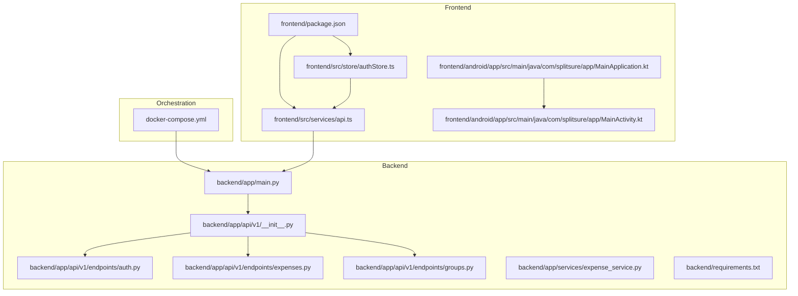
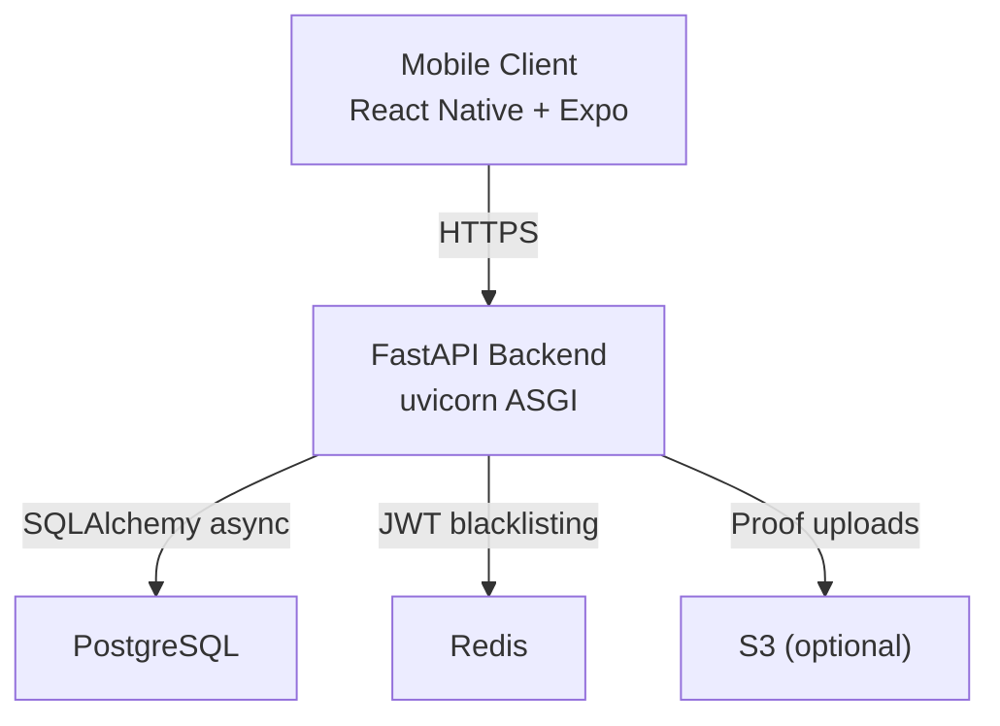
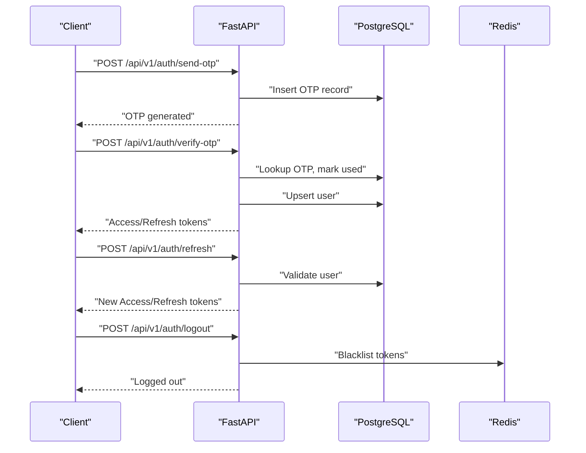
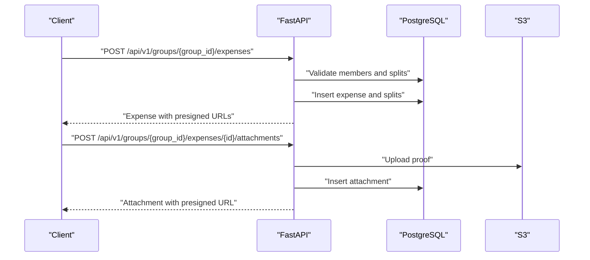
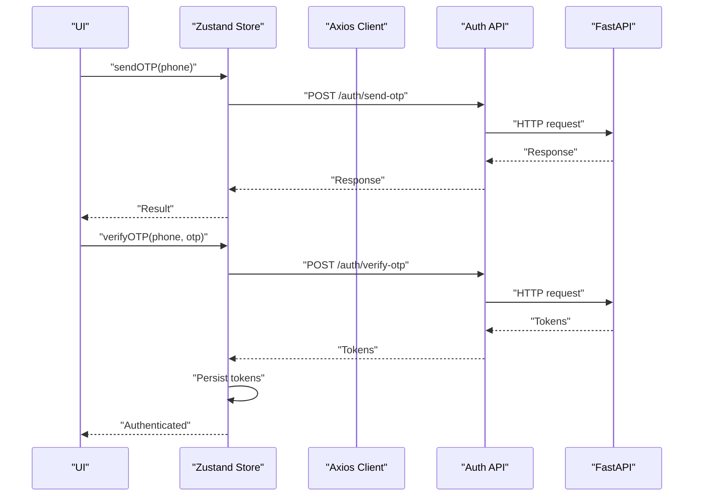
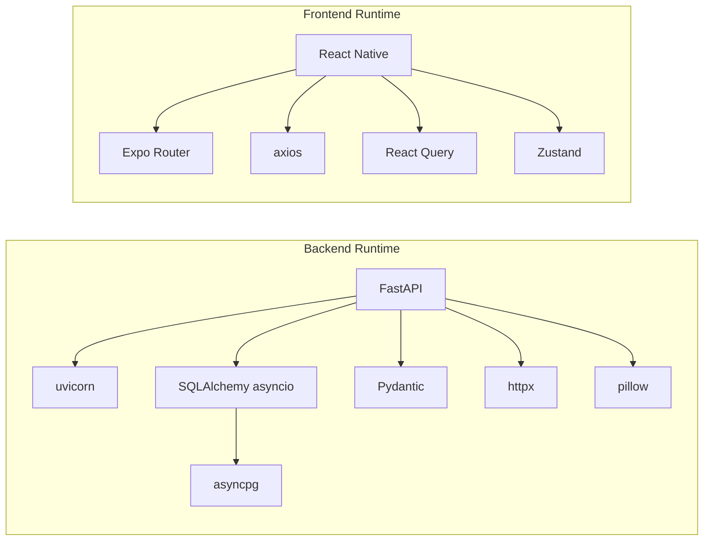

# Performance Monitoring and Profiling

<cite>
**Referenced Files in This Document**
- [README.md](file://README.md)
- [docker-compose.yml](file://docker-compose.yml)
- [backend/app/main.py](file://backend/app/main.py)
- [backend/requirements.txt](file://backend/requirements.txt)
- [backend/app/api/v1/__init__.py](file://backend/app/api/v1/__init__.py)
- [backend/app/api/v1/endpoints/auth.py](file://backend/app/api/v1/endpoints/auth.py)
- [backend/app/api/v1/endpoints/expenses.py](file://backend/app/api/v1/endpoints/expenses.py)
- [backend/app/api/v1/endpoints/groups.py](file://backend/app/api/v1/endpoints/groups.py)
- [backend/app/services/expense_service.py](file://backend/app/services/expense_service.py)
- [frontend/package.json](file://frontend/package.json)
- [frontend/src/services/api.ts](file://frontend/src/services/api.ts)
- [frontend/src/store/authStore.ts](file://frontend/src/store/authStore.ts)
- [frontend/android/app/src/main/java/com/splitsure/app/MainActivity.kt](file://frontend/android/app/src/main/java/com/splitsure/app/MainActivity.kt)
- [frontend/android/app/src/main/java/com/splitsure/app/MainApplication.kt](file://frontend/android/app/src/main/java/com/splitsure/app/MainApplication.kt)
</cite>

## Table of Contents
1. [Introduction](#introduction)
2. [Project Structure](#project-structure)
3. [Core Components](#core-components)
4. [Architecture Overview](#architecture-overview)
5. [Detailed Component Analysis](#detailed-component-analysis)
6. [Dependency Analysis](#dependency-analysis)
7. [Performance Considerations](#performance-considerations)
8. [Troubleshooting Guide](#troubleshooting-guide)
9. [Conclusion](#conclusion)
10. [Appendices](#appendices)

## Introduction
This document provides a comprehensive guide to performance monitoring and profiling for the SplitSure application ecosystem. It covers metrics collection strategies, profiling tool integrations, bottleneck identification techniques, performance regression testing, monitoring infrastructure, real-user monitoring, and operational best practices for backend, frontend, and mobile components.

SplitSure is a mobile-first shared-expense system built with:
- Backend: FastAPI + SQLAlchemy + PostgreSQL
- Frontend: Expo Router + React Native + React Query + Zustand
- Mobile: Android (React Native) with Kotlin entry points

The ecosystem supports OTP authentication, group-ledger management, proof attachments, optimized settlements, and immutable audit history. Performance monitoring should focus on endpoint latency, database queries, network reliability, and mobile rendering performance.

**Section sources**
- [README.md:1-162](file://README.md#L1-L162)

## Project Structure
The repository is organized into three primary layers:
- backend: FastAPI application with API routers, services, models, and core configuration
- frontend: React Native application with TypeScript, Expo Router, and native Android entry points
- docker-compose: Orchestration for PostgreSQL, Redis, and the FastAPI service

**Diagram sources**
- [backend/app/main.py:1-96](file://backend/app/main.py#L1-L96)
- [backend/app/api/v1/__init__.py:1-12](file://backend/app/api/v1/__init__.py#L1-L12)
- [backend/app/api/v1/endpoints/auth.py:1-147](file://backend/app/api/v1/endpoints/auth.py#L1-L147)
- [backend/app/api/v1/endpoints/expenses.py:1-395](file://backend/app/api/v1/endpoints/expenses.py#L1-L395)
- [backend/app/api/v1/endpoints/groups.py:1-350](file://backend/app/api/v1/endpoints/groups.py#L1-L350)
- [backend/app/services/expense_service.py:1-79](file://backend/app/services/expense_service.py#L1-L79)
- [frontend/package.json:1-62](file://frontend/package.json#L1-L62)
- [frontend/src/services/api.ts:1-271](file://frontend/src/services/api.ts#L1-L271)
- [frontend/src/store/authStore.ts:1-116](file://frontend/src/store/authStore.ts#L1-L116)
- [frontend/android/app/src/main/java/com/splitsure/app/MainActivity.kt:1-62](file://frontend/android/app/src/main/java/com/splitsure/app/MainActivity.kt#L1-L62)
- [frontend/android/app/src/main/java/com/splitsure/app/MainApplication.kt:1-56](file://frontend/android/app/src/main/java/com/splitsure/app/MainApplication.kt#L1-L56)
- [docker-compose.yml:1-82](file://docker-compose.yml#L1-L82)

**Section sources**
- [README.md:1-162](file://README.md#L1-L162)
- [docker-compose.yml:1-82](file://docker-compose.yml#L1-L82)

## Core Components
This section outlines the core components relevant to performance monitoring and profiling.

- Backend HTTP server and middleware stack
  - Security headers middleware and CORS configuration
  - Health endpoint for readiness/liveness checks
  - Static file serving for local uploads
- API routers and endpoints
  - Authentication endpoints (OTP send/verify, refresh, logout)
  - Group lifecycle endpoints (create, invite, join, manage members)
  - Expense lifecycle endpoints (CRUD, disputes, attachments)
  - Settlements, audit, and reporting endpoints
- Services and utilities
  - Expense split calculation and validation
- Frontend networking and state
  - Axios-based API client with interceptors for auth and retry
  - Zustand store for authentication state and push notifications
- Android application entry points
  - Main activity and application delegates

Key performance touchpoints:
- Network latency and timeouts for API calls
- Database query patterns and eager-loading strategies
- File upload/download throughput and presigned URL generation
- Mobile rendering and navigation performance

**Section sources**
- [backend/app/main.py:1-96](file://backend/app/main.py#L1-L96)
- [backend/app/api/v1/__init__.py:1-12](file://backend/app/api/v1/__init__.py#L1-L12)
- [backend/app/api/v1/endpoints/auth.py:1-147](file://backend/app/api/v1/endpoints/auth.py#L1-L147)
- [backend/app/api/v1/endpoints/expenses.py:1-395](file://backend/app/api/v1/endpoints/expenses.py#L1-L395)
- [backend/app/api/v1/endpoints/groups.py:1-350](file://backend/app/api/v1/endpoints/groups.py#L1-L350)
- [backend/app/services/expense_service.py:1-79](file://backend/app/services/expense_service.py#L1-L79)
- [frontend/src/services/api.ts:1-271](file://frontend/src/services/api.ts#L1-L271)
- [frontend/src/store/authStore.ts:1-116](file://frontend/src/store/authStore.ts#L1-L116)
- [frontend/android/app/src/main/java/com/splitsure/app/MainActivity.kt:1-62](file://frontend/android/app/src/main/java/com/splitsure/app/MainActivity.kt#L1-L62)
- [frontend/android/app/src/main/java/com/splitsure/app/MainApplication.kt:1-56](file://frontend/android/app/src/main/java/com/splitsure/app/MainApplication.kt#L1-L56)

## Architecture Overview
The SplitSure architecture comprises:
- Client-side: React Native mobile app with Expo Router and state management
- Backend: FastAPI REST API with asynchronous SQLAlchemy ORM
- Data plane: PostgreSQL for relational data and optional S3 for proof attachments
- Caching and token revocation: Redis for short-lived tokens and blacklisting

**Diagram sources**
- [backend/app/main.py:1-96](file://backend/app/main.py#L1-L96)
- [backend/requirements.txt:1-19](file://backend/requirements.txt#L1-L19)
- [docker-compose.yml:1-82](file://docker-compose.yml#L1-L82)

## Detailed Component Analysis

### Backend HTTP Server and Middleware
- Security headers middleware adds HSTS in production, and other hardening headers
- CORS configured for development origins
- Health endpoint returns runtime metadata
- Static file serving for local uploads

Performance implications:
- Security headers overhead is negligible
- CORS configuration affects preflight costs
- Health endpoint should remain lightweight

**Section sources**
- [backend/app/main.py:25-96](file://backend/app/main.py#L25-L96)

### Authentication Endpoints
Endpoints:
- Send OTP with rate limiting and hashing
- Verify OTP and issue JWT pair
- Refresh token and logout with blacklist

Profiling and monitoring:
- Rate-limiting logic impacts burst handling
- OTP hashing and database writes
- Token refresh path requires Redis availability

**Diagram sources**
- [backend/app/api/v1/endpoints/auth.py:58-147](file://backend/app/api/v1/endpoints/auth.py#L58-L147)

**Section sources**
- [backend/app/api/v1/endpoints/auth.py:24-147](file://backend/app/api/v1/endpoints/auth.py#L24-L147)

### Expenses Endpoints
Endpoints:
- Create, list, get, update, delete expenses
- Disputes and resolution
- Attachment upload with presigned URL generation

Performance considerations:
- Eager-loading joins for related entities
- Split validation and recalculation
- Presigned URL generation for S3 attachments

**Diagram sources**
- [backend/app/api/v1/endpoints/expenses.py:143-395](file://backend/app/api/v1/endpoints/expenses.py#L143-L395)

**Section sources**
- [backend/app/api/v1/endpoints/expenses.py:1-395](file://backend/app/api/v1/endpoints/expenses.py#L1-L395)
- [backend/app/services/expense_service.py:19-79](file://backend/app/services/expense_service.py#L19-L79)

### Groups Endpoints
Endpoints:
- Create, list, get, update groups
- Manage members (add/remove), invite links, join via token
- Archive/unarchive groups

Performance considerations:
- Membership checks and role validations
- Invite link generation and usage limits
- Notification fire-and-forget tasks

**Section sources**
- [backend/app/api/v1/endpoints/groups.py:1-350](file://backend/app/api/v1/endpoints/groups.py#L1-L350)

### Frontend Networking and State
- Axios client with base URL normalization and Android emulator host rewrite
- Request interceptor attaches Authorization header
- Response interceptor handles 401 refresh flow with queueing
- Healthcheck ensures backend availability before auth calls
- Store manages tokens and user state

**Diagram sources**
- [frontend/src/store/authStore.ts:34-47](file://frontend/src/store/authStore.ts#L34-L47)
- [frontend/src/services/api.ts:143-169](file://frontend/src/services/api.ts#L143-L169)

**Section sources**
- [frontend/src/services/api.ts:1-271](file://frontend/src/services/api.ts#L1-L271)
- [frontend/src/store/authStore.ts:1-116](file://frontend/src/store/authStore.ts#L1-L116)

### Android Application Entry Points
- MainApplication initializes React Native host and dispatcher
- MainActivity sets theme and delegates to ReactActivityDelegate

Performance considerations:
- New Architecture flags and Hermes enablement
- Back button behavior aligned with Android S

**Section sources**
- [frontend/android/app/src/main/java/com/splitsure/app/MainApplication.kt:18-56](file://frontend/android/app/src/main/java/com/splitsure/app/MainApplication.kt#L18-L56)
- [frontend/android/app/src/main/java/com/splitsure/app/MainActivity.kt:13-62](file://frontend/android/app/src/main/java/com/splitsure/app/MainActivity.kt#L13-L62)

## Dependency Analysis
Runtime dependencies impacting performance:
- Backend: FastAPI, uvicorn, SQLAlchemy asyncio, asyncpg, Pydantic, httpx, reportlab, pillow
- Frontend: React Native, Expo Router, React Query, Zustand, axios

**Diagram sources**
- [backend/requirements.txt:1-19](file://backend/requirements.txt#L1-L19)
- [frontend/package.json:13-53](file://frontend/package.json#L13-L53)

**Section sources**
- [backend/requirements.txt:1-19](file://backend/requirements.txt#L1-L19)
- [frontend/package.json:13-53](file://frontend/package.json#L13-L53)

## Performance Considerations
Guidelines for performance monitoring and optimization across components:

- Backend
  - Instrument endpoints with timing and error counters
  - Monitor database query durations and counts; use eager-loading to reduce N+1 queries
  - Track external HTTP calls (e.g., SMS provider) and S3 operations
  - Enforce rate limits and monitor 429 responses
  - Use Redis for token blacklisting and caching where appropriate

- Frontend
  - Measure network request latency and retry behavior
  - Observe UI hydration and navigation transitions
  - Track authentication refresh success/failure rates
  - Monitor file upload progress and presigned URL generation

- Mobile
  - Profile render performance and layout passes
  - Monitor startup time and memory usage
  - Track network calls made during cold start

[No sources needed since this section provides general guidance]

## Troubleshooting Guide
Common performance issues and diagnostic approaches:

- Slow authentication flows
  - Verify OTP send/verify latency and rate-limiting thresholds
  - Inspect database insert/update patterns and indexes
  - Confirm Redis availability for token blacklisting

- Expensive expense operations
  - Review split validation and recalculation logic
  - Ensure proper eager-loading of related entities
  - Monitor S3 upload and presigned URL generation

- Frontend responsiveness
  - Check request interceptor timing and retry queues
  - Validate base URL normalization for Android emulator
  - Confirm healthcheck reliability before auth calls

- Mobile startup and navigation
  - Investigate New Architecture and Hermes configurations
  - Review application delegate initialization order

**Section sources**
- [backend/app/api/v1/endpoints/auth.py:24-147](file://backend/app/api/v1/endpoints/auth.py#L24-L147)
- [backend/app/api/v1/endpoints/expenses.py:194-216](file://backend/app/api/v1/endpoints/expenses.py#L194-L216)
- [frontend/src/services/api.ts:21-46](file://frontend/src/services/api.ts#L21-L46)
- [frontend/src/services/api.ts:60-74](file://frontend/src/services/api.ts#L60-L74)
- [frontend/android/app/src/main/java/com/splitsure/app/MainApplication.kt:41-49](file://frontend/android/app/src/main/java/com/splitsure/app/MainApplication.kt#L41-L49)

## Conclusion
Establishing robust performance monitoring and profiling in SplitSure requires coordinated efforts across backend, frontend, and mobile components. By instrumenting endpoints, optimizing database queries, monitoring network reliability, and leveraging platform-specific profilers, teams can identify bottlenecks early and maintain consistent user experience. Integrating monitoring infrastructure and real-user metrics will further strengthen the ability to detect regressions and enforce performance budgets.

[No sources needed since this section summarizes without analyzing specific files]

## Appendices

### Metrics Collection Strategies
- Custom metrics
  - Endpoint latency histograms and error counters
  - Database query duration and count metrics
  - External service call latency and error rates
  - File upload/download throughput and failures
- System-level monitoring
  - CPU, memory, and disk I/O for backend and mobile devices
  - Network throughput and packet loss
- Application performance indicators
  - Session duration and retention
  - Feature adoption and funnel conversion
  - Crash and ANR rates on mobile

[No sources needed since this section provides general guidance]

### Profiling Tools Integration
- Python cProfile for backend
  - Use cProfile to analyze CPU-intensive endpoints and services
  - Focus on authentication flows, expense split calculations, and report generation
- React DevTools Profiler for frontend
  - Identify expensive renders and re-renders in authentication and group/expense screens
- Android Studio Profiler for mobile
  - Monitor CPU, heap, and energy usage during key flows (login, expense creation, settlement)

[No sources needed since this section provides general guidance]

### Bottleneck Identification Techniques
- Performance bottleneck analysis
  - Correlate endpoint latencies with database query plans and external service calls
- Slow endpoint detection
  - Alert on P95/P99 latency breaches per endpoint
- Resource consumption tracking
  - Track memory growth and GC pressure during heavy operations

[No sources needed since this section provides general guidance]

### Performance Regression Testing
- Automated performance testing
  - Load test key flows (auth, expense CRUD, settlement)
  - Integrate with CI to compare metrics against baselines
- Baseline establishment
  - Define acceptable latency and resource thresholds per endpoint
- Continuous performance monitoring
  - Monitor trends and alert on regressions

[No sources needed since this section provides general guidance]

### Monitoring Infrastructure
- Prometheus integration
  - Expose metrics endpoints for backend and integrate with Prometheus scraping
- Grafana dashboards
  - Visualize endpoint latency, error rates, database metrics, and mobile KPIs
- Log aggregation
  - Centralize backend and mobile logs for correlation and debugging
- Alerting systems
  - Configure alerts for latency, error rates, and resource thresholds

[No sources needed since this section provides general guidance]

### Real-User Monitoring
- User experience metrics
  - Track First Contentful Paint, Largest Contentful Paint, and session quality metrics
- Performance tracking in production
  - Capture anonymized telemetry from mobile clients and browser environments
- User-centric performance indicators
  - Measure time-to-interactive and feature completion rates

[No sources needed since this section provides general guidance]

### CI/CD Pipeline Guidance
- Setting up performance baselines
  - Establish baselines on feature branches and PRs
- Establishing performance budgets
  - Define budget ceilings for latency, memory, and battery impact
- Implementing performance testing in CI/CD
  - Run synthetic loads and regression checks as gated steps

[No sources needed since this section provides general guidance]