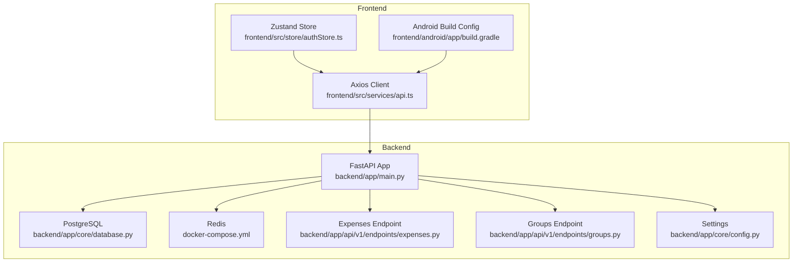
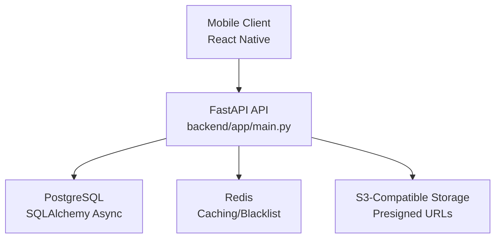
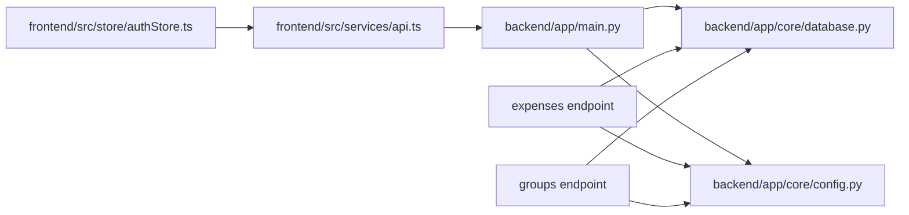

# Performance Optimization

<cite>
**Referenced Files in This Document**
- [backend/app/main.py](file://backend/app/main.py)
- [backend/app/core/database.py](file://backend/app/core/database.py)
- [backend/app/core/config.py](file://backend/app/core/config.py)
- [backend/app/api/v1/endpoints/expenses.py](file://backend/app/api/v1/endpoints/expenses.py)
- [backend/app/api/v1/endpoints/groups.py](file://backend/app/api/v1/endpoints/groups.py)
- [backend/app/services/expense_service.py](file://backend/app/services/expense_service.py)
- [backend/app/services/settlement_engine.py](file://backend/app/services/settlement_engine.py)
- [backend/Dockerfile](file://backend/Dockerfile)
- [docker-compose.yml](file://docker-compose.yml)
- [backend/requirements.txt](file://backend/requirements.txt)
- [frontend/src/services/api.ts](file://frontend/src/services/api.ts)
- [frontend/src/store/authStore.ts](file://frontend/src/store/authStore.ts)
- [frontend/android/app/build.gradle](file://frontend/android/app/build.gradle)
</cite>

## Table of Contents
1. [Introduction](#introduction)
2. [Project Structure](#project-structure)
3. [Core Components](#core-components)
4. [Architecture Overview](#architecture-overview)
5. [Detailed Component Analysis](#detailed-component-analysis)
6. [Dependency Analysis](#dependency-analysis)
7. [Performance Considerations](#performance-considerations)
8. [Troubleshooting Guide](#troubleshooting-guide)
9. [Conclusion](#conclusion)
10. [Appendices](#appendices)

## Introduction
This document provides a comprehensive performance optimization guide for the SplitSure application across backend, frontend, and mobile platforms. It focuses on database query optimization, indexing strategies, connection pooling, caching strategies with Redis, asynchronous processing patterns, resource management, bundle optimization, lazy loading, state management efficiency, network request optimization, React component performance, mobile memory and battery optimization, UI responsiveness, background processing, performance monitoring, scalability, load testing, capacity planning, and validation techniques.

## Project Structure
SplitSure follows a clear separation of concerns:
- Backend: FastAPI application with asynchronous SQLAlchemy ORM, PostgreSQL, and Redis for caching/token revocation.
- Frontend: Expo Router + React Native with Zustand for state management and Axios for HTTP requests.
- Mobile: Android Gradle configuration for release builds, minification, and resource shrinking.

**Diagram sources**
- [backend/app/main.py:1-96](file://backend/app/main.py#L1-L96)
- [backend/app/core/database.py:1-29](file://backend/app/core/database.py#L1-L29)
- [backend/app/core/config.py:1-71](file://backend/app/core/config.py#L1-L71)
- [backend/app/api/v1/endpoints/expenses.py:1-395](file://backend/app/api/v1/endpoints/expenses.py#L1-L395)
- [backend/app/api/v1/endpoints/groups.py:1-309](file://backend/app/api/v1/endpoints/groups.py#L1-L309)
- [frontend/src/services/api.ts:1-269](file://frontend/src/services/api.ts#L1-L269)
- [frontend/src/store/authStore.ts:1-116](file://frontend/src/store/authStore.ts#L1-L116)
- [frontend/android/app/build.gradle:1-219](file://frontend/android/app/build.gradle#L1-L219)
- [docker-compose.yml:1-82](file://docker-compose.yml#L1-L82)

**Section sources**
- [README.md:1-162](file://README.md#L1-L162)
- [backend/app/main.py:1-96](file://backend/app/main.py#L1-L96)
- [backend/app/core/database.py:1-29](file://backend/app/core/database.py#L1-L29)
- [backend/app/core/config.py:1-71](file://backend/app/core/config.py#L1-L71)
- [backend/app/api/v1/endpoints/expenses.py:1-395](file://backend/app/api/v1/endpoints/expenses.py#L1-L395)
- [backend/app/api/v1/endpoints/groups.py:1-309](file://backend/app/api/v1/endpoints/groups.py#L1-L309)
- [frontend/src/services/api.ts:1-269](file://frontend/src/services/api.ts#L1-L269)
- [frontend/src/store/authStore.ts:1-116](file://frontend/src/store/authStore.ts#L1-L116)
- [frontend/android/app/build.gradle:1-219](file://frontend/android/app/build.gradle#L1-L219)
- [docker-compose.yml:1-82](file://docker-compose.yml#L1-L82)

## Core Components
- Backend HTTP server and middleware stack with security headers and CORS.
- Asynchronous database engine with configurable connection pooling.
- API endpoints for expenses and groups with eager-loading strategies.
- Business logic services for split validation and settlement computation.
- Frontend HTTP client with interceptors for auth and retry logic.
- Zustand store for efficient state management with minimal re-renders.
- Android build configuration enabling minification and resource shrinking.

Key performance-relevant areas:
- Database engine configuration and session lifecycle.
- Endpoint queries with selectinload options and pagination parameters.
- Business logic for split computation and settlement minimization.
- Frontend request/response interceptors and token refresh handling.
- Android release build flags for minification and resource shrinking.

**Section sources**
- [backend/app/main.py:16-56](file://backend/app/main.py#L16-L56)
- [backend/app/core/database.py:5-29](file://backend/app/core/database.py#L5-L29)
- [backend/app/api/v1/endpoints/expenses.py:182-216](file://backend/app/api/v1/endpoints/expenses.py#L182-L216)
- [backend/app/api/v1/endpoints/expenses.py:229-263](file://backend/app/api/v1/endpoints/expenses.py#L229-L263)
- [backend/app/services/expense_service.py:7-79](file://backend/app/services/expense_service.py#L7-L79)
- [backend/app/services/settlement_engine.py:23-97](file://backend/app/services/settlement_engine.py#L23-L97)
- [frontend/src/services/api.ts:76-140](file://frontend/src/services/api.ts#L76-L140)
- [frontend/src/store/authStore.ts:29-111](file://frontend/src/store/authStore.ts#L29-L111)
- [frontend/android/app/build.gradle:130-142](file://frontend/android/app/build.gradle#L130-L142)

## Architecture Overview
The system comprises:
- FastAPI application exposing REST endpoints.
- PostgreSQL for persistence with Alembic migrations.
- Redis for caching and token blacklist (revocation).
- Frontend mobile app communicating via Axios with interceptors.
- Android release builds configured for performance.

**Diagram sources**
- [backend/app/main.py:1-96](file://backend/app/main.py#L1-L96)
- [backend/app/core/database.py:1-29](file://backend/app/core/database.py#L1-L29)
- [docker-compose.yml:20-27](file://docker-compose.yml#L20-L27)
- [backend/app/api/v1/endpoints/expenses.py:98-105](file://backend/app/api/v1/endpoints/expenses.py#L98-L105)

## Detailed Component Analysis

### Backend Database and Connection Pooling
- Asynchronous engine configured with pool_size and max_overflow.
- Session factory with expire_on_commit disabled to reduce overhead.
- Startup routine creates tables and an append-only audit trigger.

Optimization opportunities:
- Tune pool_size and max_overflow based on concurrent workload.
- Add connection timeouts and health checks.
- Monitor slow queries and add appropriate indexes.

**Section sources**
- [backend/app/core/database.py:5-29](file://backend/app/core/database.py#L5-L29)
- [backend/app/main.py:68-86](file://backend/app/main.py#L68-L86)

### Backend API Endpoints: Expenses and Groups
- Expenses endpoint:
  - Uses selectinload to eagerly fetch related entities.
  - Supports pagination via limit/offset with validation.
  - Uploads proof attachments and generates presigned URLs.
- Groups endpoint:
  - Enforces membership/admin checks.
  - Manages invites with expiration and usage limits.

Performance considerations:
- Prefer indexed columns in WHERE clauses (e.g., group_id, user_id).
- Limit returned fields and paginate large lists.
- Avoid N+1 queries by leveraging selectinload.

**Section sources**
- [backend/app/api/v1/endpoints/expenses.py:182-216](file://backend/app/api/v1/endpoints/expenses.py#L182-L216)
- [backend/app/api/v1/endpoints/expenses.py:59-74](file://backend/app/api/v1/endpoints/expenses.py#L59-L74)
- [backend/app/api/v1/endpoints/expenses.py:352-394](file://backend/app/api/v1/endpoints/expenses.py#L352-L394)
- [backend/app/api/v1/endpoints/groups.py:20-55](file://backend/app/api/v1/endpoints/groups.py#L20-L55)
- [backend/app/api/v1/endpoints/groups.py:214-235](file://backend/app/api/v1/endpoints/groups.py#L214-L235)

### Business Logic Services
- Split validation ensures non-duplicate users and membership checks.
- Split payload builder computes amounts per split type.
- Settlement engine:
  - Computes net balances.
  - Greedy algorithm minimizes transactions with O(n log n) sorting.

Performance considerations:
- Validate inputs early to fail fast.
- Use integer arithmetic to avoid floating-point errors.
- Keep balance computations localized and cacheable.

**Section sources**
- [backend/app/services/expense_service.py:7-79](file://backend/app/services/expense_service.py#L7-L79)
- [backend/app/services/settlement_engine.py:23-97](file://backend/app/services/settlement_engine.py#L23-L97)

### Frontend HTTP Client and State Management
- Axios client with base URL resolution and timeouts.
- Request interceptor attaches Authorization header.
- Response interceptor handles 401 with token refresh queue.
- Auth store manages tokens, user profile, and push notifications.

Performance considerations:
- Centralize error handling and retry logic.
- Debounce or batch push token registration.
- Avoid unnecessary re-renders by structuring Zustand slices.

**Section sources**
- [frontend/src/services/api.ts:42-140](file://frontend/src/services/api.ts#L42-L140)
- [frontend/src/store/authStore.ts:29-111](file://frontend/src/store/authStore.ts#L29-L111)

### Android Build Configuration
- Enables minifyEnabled and shrinkResources for release builds.
- Applies ProGuard rules and PNG crunching.
- Uses Hermes for bytecode optimization.

Performance considerations:
- Fine-tune minification flags and keep essential classes.
- Monitor APK size and runtime performance trade-offs.

**Section sources**
- [frontend/android/app/build.gradle:130-142](file://frontend/android/app/build.gradle#L130-L142)

## Dependency Analysis

**Diagram sources**
- [backend/app/main.py:1-96](file://backend/app/main.py#L1-L96)
- [backend/app/core/database.py:1-29](file://backend/app/core/database.py#L1-L29)
- [backend/app/core/config.py:1-71](file://backend/app/core/config.py#L1-L71)
- [backend/app/api/v1/endpoints/expenses.py:1-395](file://backend/app/api/v1/endpoints/expenses.py#L1-L395)
- [backend/app/api/v1/endpoints/groups.py:1-309](file://backend/app/api/v1/endpoints/groups.py#L1-L309)
- [frontend/src/services/api.ts:1-269](file://frontend/src/services/api.ts#L1-L269)
- [frontend/src/store/authStore.ts:1-116](file://frontend/src/store/authStore.ts#L1-L116)

**Section sources**
- [backend/app/main.py:1-96](file://backend/app/main.py#L1-L96)
- [backend/app/core/database.py:1-29](file://backend/app/core/database.py#L1-L29)
- [backend/app/core/config.py:1-71](file://backend/app/core/config.py#L1-L71)
- [backend/app/api/v1/endpoints/expenses.py:1-395](file://backend/app/api/v1/endpoints/expenses.py#L1-L395)
- [backend/app/api/v1/endpoints/groups.py:1-309](file://backend/app/api/v1/endpoints/groups.py#L1-L309)
- [frontend/src/services/api.ts:1-269](file://frontend/src/services/api.ts#L1-L269)
- [frontend/src/store/authStore.ts:1-116](file://frontend/src/store/authStore.ts#L1-L116)

## Performance Considerations

### Backend Performance Optimization
- Database query optimization
  - Use LIMIT/OFFSET for paginated lists.
  - Add indexes on frequently filtered columns (e.g., group_id, user_id, created_at).
  - Avoid SELECT *; choose only required columns.
- Indexing strategies
  - Primary keys are implicit; add composite indexes for frequent JOINs and filters.
  - Consider partial indexes for archived records and immutable audit logs.
- Connection pooling
  - Adjust pool_size and max_overflow according to CPU cores and expected concurrency.
  - Enable idle timeout and recycle connections periodically.
- Caching strategies with Redis
  - Cache read-heavy entities (e.g., group metadata, user profiles) with short TTLs.
  - Use Redis for token blacklist to invalidate sessions immediately.
- Asynchronous processing patterns
  - Offload heavy tasks (PDF report generation) to background workers.
  - Use queues for proof processing and notifications.
- Resource management
  - Close sessions promptly; avoid long-lived transactions.
  - Stream large file downloads to reduce memory pressure.

### Frontend Performance Optimization
- Bundle optimization
  - Enable tree-shaking and module federation where applicable.
  - Split vendor and app bundles; leverage dynamic imports for routes.
- Lazy loading implementation
  - Use Expo Router dynamic routes and lazy screen imports.
- State management efficiency with Zustand
  - Keep slices small; avoid global state bloat.
  - Memoize derived data; use selectors to isolate updates.
- Network request optimization
  - Reuse Axios instance; centralize interceptors.
  - Implement exponential backoff and dedupe concurrent requests.
- React component performance
  - Use memoization (e.g., useMemo/useCallback) for expensive computations.
  - Virtualize long lists; render only visible items.

### Mobile Performance Considerations
- Memory management
  - Avoid retaining references to large images; release on unmount.
  - Use platform-specific image decoding options.
- Battery optimization
  - Batch network requests; avoid wake-ups during idle.
  - Limit background sync frequency.
- Network efficiency
  - Compress payloads; use ETags/conditional requests.
  - Prefer binary formats for large datasets.
- UI responsiveness
  - Keep main thread free; offload work to worker threads.
  - Use on-demand rendering for complex views.
- Background processing
  - Schedule non-critical tasks during idle periods.
  - Respect OS background execution limits.

### Performance Monitoring
- Metrics collection
  - Track request latency, throughput, error rates, and database query times.
  - Instrument frontend metrics: First Contentful Paint, Largest Contentful Paint, and interaction delays.
- Performance profiling tools
  - Backend: uvicorn workers, SQLAlchemy query logging, Prometheus metrics.
  - Frontend: React DevTools Profiler, Flipper, Chrome DevTools.
  - Mobile: Android Studio Profiler, iOS Instruments.
- Bottleneck identification
  - Correlate slow endpoints with query plans and Redis hit rates.
  - Identify hot paths in Zustand stores and API calls.
- Optimization tracking
  - Establish baselines; measure deltas post-changes.
  - Use A/B testing for UI and UX changes.

### Scalability, Load Testing, and Capacity Planning
- Scalability
  - Horizontal scaling: multiple API instances behind a load balancer.
  - Database: read replicas for reporting; partition by group_id.
  - Redis: cluster mode for caching and pub/sub.
- Load testing
  - Use k6 or Artillery to simulate concurrent users.
  - Test peak scenarios: bulk expense creation, settlement bursts.
- Capacity planning
  - Forecast growth in users, groups, and attachments.
  - Plan DB and Redis capacity with headroom for spikes.

### Performance Testing Methodologies and Validation
- Benchmarking approaches
  - Microbenchmarks for hot paths (split computation, settlement minimization).
  - End-to-end benchmarks for full flows (login, create expense, settle).
- Optimization validation
  - Regression tests for performance regressions.
  - Canary deployments with gradual rollout and metrics gating.

[No sources needed since this section provides general guidance]

## Troubleshooting Guide
Common performance issues and remedies:
- Slow database queries
  - Inspect query plans; add missing indexes.
  - Reduce payload sizes; paginate aggressively.
- High memory usage
  - Review session lifecycles; close sessions promptly.
  - Avoid loading large attachments unnecessarily.
- Frontend sluggishness
  - Check for excessive re-renders; optimize Zustand slices.
  - Verify lazy loading is applied to heavy screens.
- Mobile battery drain
  - Reduce background sync frequency; batch operations.
  - Limit analytics and push notification churn.

**Section sources**
- [backend/app/core/database.py:23-29](file://backend/app/core/database.py#L23-L29)
- [backend/app/api/v1/endpoints/expenses.py:182-216](file://backend/app/api/v1/endpoints/expenses.py#L182-L216)
- [frontend/src/store/authStore.ts:82-85](file://frontend/src/store/authStore.ts#L82-L85)
- [frontend/src/services/api.ts:76-140](file://frontend/src/services/api.ts#L76-L140)

## Conclusion
By focusing on database optimization, efficient connection pooling, strategic caching, asynchronous processing, and robust monitoring, SplitSure can achieve scalable, responsive performance across backend, frontend, and mobile. Adopting the outlined methodologies and validation techniques will help maintain performance standards in production and prepare the system for growth.

[No sources needed since this section summarizes without analyzing specific files]

## Appendices

### Appendix A: Backend Deployment and Runtime Tuning
- Container runtime: Python slim image with gcc and libpq-dev.
- Environment variables for DB, Redis, storage, and security.
- Alembic migrations executed on startup.

**Section sources**
- [backend/Dockerfile:1-15](file://backend/Dockerfile#L1-L15)
- [docker-compose.yml:28-77](file://docker-compose.yml#L28-L77)
- [backend/requirements.txt:1-19](file://backend/requirements.txt#L1-L19)

### Appendix B: Frontend Build and Release
- Android release build enables minifyEnabled and shrinkResources.
- ProGuard rules and PNG crunching configured.
- Hermes enabled for bytecode optimization.

**Section sources**
- [frontend/android/app/build.gradle:130-142](file://frontend/android/app/build.gradle#L130-L142)