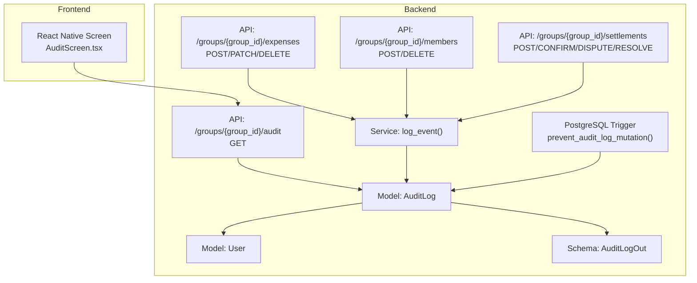
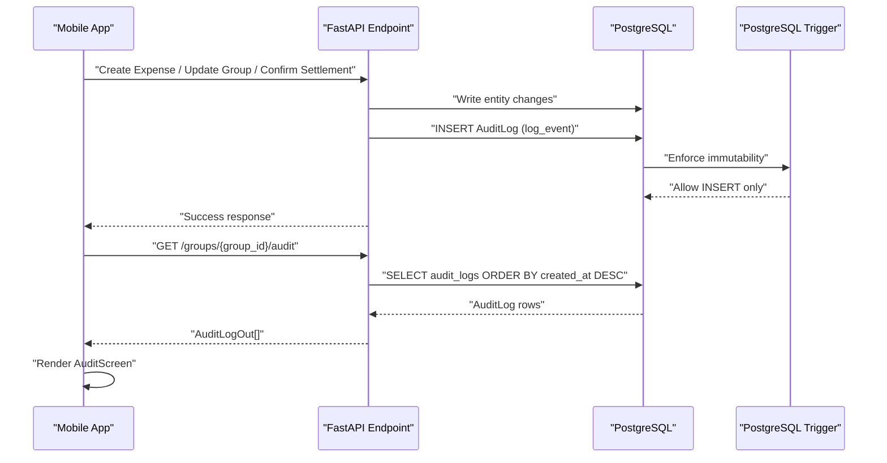
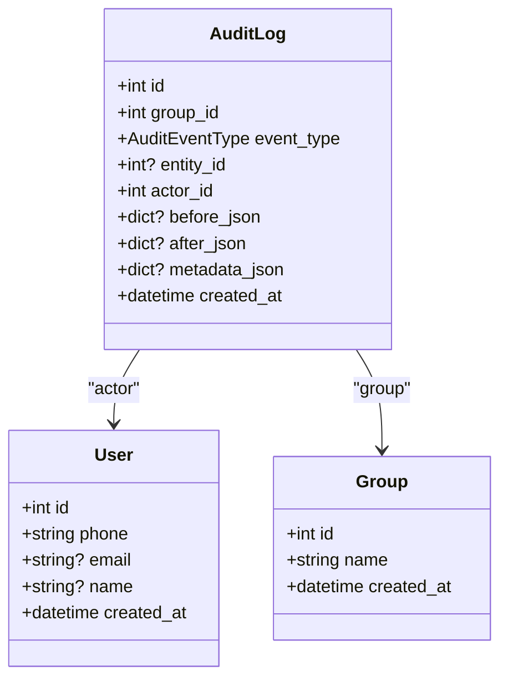
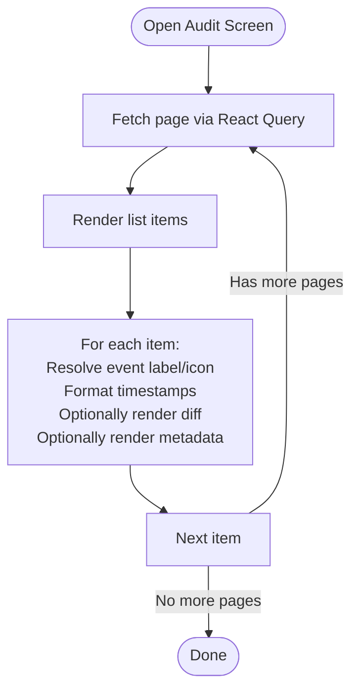
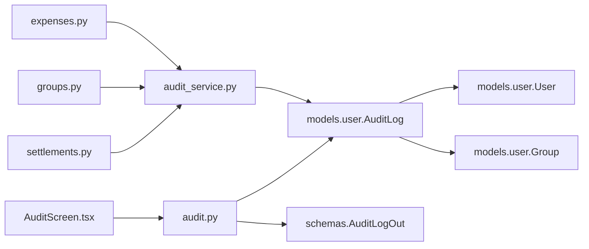

# Audit and Compliance

<cite>
**Referenced Files in This Document**
- [audit.py](file://backend/app/api/v1/endpoints/audit.py)
- [audit_service.py](file://backend/app/services/audit_service.py)
- [user.py](file://backend/app/models/user.py)
- [schemas.py](file://backend/app/schemas/schemas.py)
- [001_initial.py](file://backend/alembic/versions/001_initial.py)
- [expenses.py](file://backend/app/api/v1/endpoints/expenses.py)
- [groups.py](file://backend/app/api/v1/endpoints/groups.py)
- [settlements.py](file://backend/app/api/v1/endpoints/settlements.py)
- [AuditScreen.tsx](file://frontend/src/screens/AuditScreen.tsx)
- [audit.tsx](file://frontend/app/audit.tsx)
- [security.py](file://backend/app/core/security.py)
</cite>

## Table of Contents
1. [Introduction](#introduction)
2. [Project Structure](#project-structure)
3. [Core Components](#core-components)
4. [Architecture Overview](#architecture-overview)
5. [Detailed Component Analysis](#detailed-component-analysis)
6. [Dependency Analysis](#dependency-analysis)
7. [Performance Considerations](#performance-considerations)
8. [Troubleshooting Guide](#troubleshooting-guide)
9. [Conclusion](#conclusion)
10. [Appendices](#appendices)

## Introduction
This document describes the SplitSure audit and compliance system designed to maintain immutable records of application activities. It covers the event logging mechanism that captures user actions, system events, and administrative changes with timestamped, tamper-evident records. The audit trail structure includes event types, metadata, user context, and data modifications. It also documents compliance reporting capabilities, immutability guarantees, data retention considerations, integration points, and privacy/access control measures.

## Project Structure
The audit and compliance system spans backend API endpoints, ORM models, Alembic migrations, and a frontend screen for viewing audit trails.

**Diagram sources**
- [audit.py:13-39](file://backend/app/api/v1/endpoints/audit.py#L13-L39)
- [audit_service.py:6-31](file://backend/app/services/audit_service.py#L6-L31)
- [user.py:184-200](file://backend/app/models/user.py#L184-L200)
- [schemas.py:421-431](file://backend/app/schemas/schemas.py#L421-L431)
- [001_initial.py:157-169](file://backend/alembic/versions/001_initial.py#L157-L169)
- [expenses.py:172-176](file://backend/app/api/v1/endpoints/expenses.py#L172-L176)
- [groups.py:77-81](file://backend/app/api/v1/endpoints/groups.py#L77-L81)
- [settlements.py:280-284](file://backend/app/api/v1/endpoints/settlements.py#L280-L284)
- [AuditScreen.tsx:101-115](file://frontend/src/screens/AuditScreen.tsx#L101-L115)

**Section sources**
- [audit.py:10-39](file://backend/app/api/v1/endpoints/audit.py#L10-L39)
- [audit_service.py:6-31](file://backend/app/services/audit_service.py#L6-L31)
- [user.py:184-200](file://backend/app/models/user.py#L184-L200)
- [schemas.py:421-431](file://backend/app/schemas/schemas.py#L421-L431)
- [001_initial.py:114-169](file://backend/alembic/versions/001_initial.py#L114-L169)
- [expenses.py:144-179](file://backend/app/api/v1/endpoints/expenses.py#L144-L179)
- [groups.py:59-84](file://backend/app/api/v1/endpoints/groups.py#L59-L84)
- [settlements.py:238-308](file://backend/app/api/v1/endpoints/settlements.py#L238-L308)
- [AuditScreen.tsx:91-152](file://frontend/src/screens/AuditScreen.tsx#L91-L152)

## Core Components
- AuditLog model defines the immutable audit trail with fields for group context, actor, event type, optional entity reference, and JSON blobs for pre/post state and metadata.
- AuditEventType enumerates supported event categories covering expenses, settlements, disputes, and group membership.
- Audit service provides a single log_event function that creates immutable entries.
- Alembic migration enforces immutability via a PostgreSQL trigger.
- API endpoints for expenses, groups, and settlements call log_event around mutating operations.
- Frontend AuditScreen displays the audit trail with human-friendly event labels, diffs, and metadata.

**Section sources**
- [user.py:37-49](file://backend/app/models/user.py#L37-L49)
- [user.py:184-200](file://backend/app/models/user.py#L184-L200)
- [audit_service.py:6-31](file://backend/app/services/audit_service.py#L6-L31)
- [001_initial.py:157-169](file://backend/alembic/versions/001_initial.py#L157-L169)
- [expenses.py:172-176](file://backend/app/api/v1/endpoints/expenses.py#L172-L176)
- [groups.py:77-81](file://backend/app/api/v1/endpoints/groups.py#L77-L81)
- [settlements.py:280-284](file://backend/app/api/v1/endpoints/settlements.py#L280-L284)
- [AuditScreen.tsx:15-27](file://frontend/src/screens/AuditScreen.tsx#L15-L27)

## Architecture Overview
The audit system is integrated into core business flows. Each write operation triggers an audit log entry. The frontend retrieves and renders the immutable audit trail.

**Diagram sources**
- [audit.py:13-39](file://backend/app/api/v1/endpoints/audit.py#L13-L39)
- [audit_service.py:6-31](file://backend/app/services/audit_service.py#L6-L31)
- [001_initial.py:157-169](file://backend/alembic/versions/001_initial.py#L157-L169)
- [expenses.py:172-176](file://backend/app/api/v1/endpoints/expenses.py#L172-L176)
- [groups.py:77-81](file://backend/app/api/v1/endpoints/groups.py#L77-L81)
- [settlements.py:280-284](file://backend/app/api/v1/endpoints/settlements.py#L280-L284)
- [AuditScreen.tsx:101-115](file://frontend/src/screens/AuditScreen.tsx#L101-L115)

## Detailed Component Analysis

### AuditLog Model and Immutability
- Fields:
  - group_id: links the event to a group.
  - event_type: typed event discriminator.
  - entity_id: optional reference to the affected entity (e.g., expense or settlement id).
  - actor_id: who performed the action.
  - before_json/after_json/metadata_json: JSON blobs capturing state diffs and extra context.
  - created_at: indexed timestamp.
- Relationships:
  - Back-populates to Group and resolves actor to User.
- Immutability:
  - PostgreSQL trigger prevents UPDATE/DELETE on audit_logs.
  - Index on (group_id, entity_id, created_at) supports efficient queries.

**Diagram sources**
- [user.py:184-200](file://backend/app/models/user.py#L184-L200)
- [user.py:51-68](file://backend/app/models/user.py#L51-L68)
- [user.py:90-107](file://backend/app/models/user.py#L90-L107)

**Section sources**
- [user.py:184-200](file://backend/app/models/user.py#L184-L200)
- [001_initial.py:114-126](file://backend/alembic/versions/001_initial.py#L114-L126)
- [001_initial.py:157-169](file://backend/alembic/versions/001_initial.py#L157-L169)

### Audit Event Types and Payloads
Supported event types include:
- Expense lifecycle: created, edited, deleted.
- Settlement lifecycle: initiated, confirmed, disputed, dispute resolved.
- Group lifecycle: created, updated.
- Membership: added, removed.

Payloads:
- Entity reference: entity_id set to the affected resource id.
- State diffs: before_json and after_json for edits.
- Metadata: free-form JSON for contextual notes and auxiliary info.

Examples of logged events:
- Expense created: entity_id = expense.id; after_json = serialized expense.
- Expense edited: entity_id = expense.id; before_json/after_json = serialized expense pre/post.
- Settlement initiated: entity_id = settlement.id; after_json = payer/receiver/amount.
- Settlement confirmed: entity_id = settlement.id; metadata_json = settled_expense_ids.
- Group created/updated: entity_id = group.id; after_json/before_json = serialized attributes.
- Member added/removed: entity_id = user.id or joiner id; metadata_json for phone/name/invite context.

**Section sources**
- [user.py:37-49](file://backend/app/models/user.py#L37-L49)
- [expenses.py:172-176](file://backend/app/api/v1/endpoints/expenses.py#L172-L176)
- [expenses.py:256-260](file://backend/app/api/v1/endpoints/expenses.py#L256-L260)
- [expenses.py:284-288](file://backend/app/api/v1/endpoints/expenses.py#L284-L288)
- [groups.py:77-81](file://backend/app/api/v1/endpoints/groups.py#L77-L81)
- [groups.py:131-135](file://backend/app/api/v1/endpoints/groups.py#L131-L135)
- [groups.py:182-186](file://backend/app/api/v1/endpoints/groups.py#L182-L186)
- [groups.py:227-230](file://backend/app/api/v1/endpoints/groups.py#L227-L230)
- [settlements.py:280-284](file://backend/app/api/v1/endpoints/settlements.py#L280-L284)
- [settlements.py:350-354](file://backend/app/api/v1/endpoints/settlements.py#L350-L354)
- [settlements.py:407-411](file://backend/app/api/v1/endpoints/settlements.py#L407-L411)
- [settlements.py:475-479](file://backend/app/api/v1/endpoints/settlements.py#L475-L479)

### Audit Retrieval API
- Endpoint: GET /groups/{group_id}/audit
- Access control: Requires membership in the group.
- Pagination: limit (default 20, min 1, max 100), offset.
- Relationship loading: Eager loads actor user for display.
- Sorting: Descending by created_at.

**Section sources**
- [audit.py:13-39](file://backend/app/api/v1/endpoints/audit.py#L13-L39)

### Frontend Audit Display
- Infinite scrolling with page size 20.
- Event categorization with icons/colors and friendly labels.
- Diff rendering for edits (before/after JSON keys).
- Metadata rendering for notes and context.
- Relative and exact timestamps.

**Section sources**
- [AuditScreen.tsx:15-27](file://frontend/src/screens/AuditScreen.tsx#L15-L27)
- [AuditScreen.tsx:29-89](file://frontend/src/screens/AuditScreen.tsx#L29-L89)
- [AuditScreen.tsx:101-115](file://frontend/src/screens/AuditScreen.tsx#L101-L115)
- [AuditScreen.tsx:126-151](file://frontend/src/screens/AuditScreen.tsx#L126-L151)

### Audit Service Implementation
- Function signature accepts group_id, event_type, actor_id, optional entity_id, plus three JSON payloads.
- Adds AuditLog to session and flushes to obtain persisted id.
- No UPDATE/DELETE path is exposed; immutability enforced at DB level.

**Section sources**
- [audit_service.py:6-31](file://backend/app/services/audit_service.py#L6-L31)

### Audit Trail Rendering Flow

**Diagram sources**
- [AuditScreen.tsx:101-115](file://frontend/src/screens/AuditScreen.tsx#L101-L115)
- [AuditScreen.tsx:126-151](file://frontend/src/screens/AuditScreen.tsx#L126-L151)

## Dependency Analysis
- API endpoints depend on the audit service to log events.
- AuditLog depends on User and Group for relationships.
- Audit retrieval endpoint depends on Group membership checks.
- Frontend depends on API for paginated audit logs.

**Diagram sources**
- [expenses.py:16-16](file://backend/app/api/v1/endpoints/expenses.py#L16-L16)
- [groups.py:15-15](file://backend/app/api/v1/endpoints/groups.py#L15-L15)
- [settlements.py:25-25](file://backend/app/api/v1/endpoints/settlements.py#L25-L25)
- [audit_service.py:1-3](file://backend/app/services/audit_service.py#L1-L3)
- [user.py:184-200](file://backend/app/models/user.py#L184-L200)
- [schemas.py:421-431](file://backend/app/schemas/schemas.py#L421-L431)
- [audit.py:13-39](file://backend/app/api/v1/endpoints/audit.py#L13-L39)
- [AuditScreen.tsx:101-115](file://frontend/src/screens/AuditScreen.tsx#L101-L115)

**Section sources**
- [expenses.py:16-16](file://backend/app/api/v1/endpoints/expenses.py#L16-L16)
- [groups.py:15-15](file://backend/app/api/v1/endpoints/groups.py#L15-L15)
- [settlements.py:25-25](file://backend/app/api/v1/endpoints/settlements.py#L25-L25)
- [audit_service.py:1-3](file://backend/app/services/audit_service.py#L1-L3)
- [user.py:184-200](file://backend/app/models/user.py#L184-L200)
- [schemas.py:421-431](file://backend/app/schemas/schemas.py#L421-L431)
- [audit.py:13-39](file://backend/app/api/v1/endpoints/audit.py#L13-L39)
- [AuditScreen.tsx:101-115](file://frontend/src/screens/AuditScreen.tsx#L101-L115)

## Performance Considerations
- Indexing: The audit_logs table includes an index on (group_id, entity_id, created_at) to optimize queries by group and entity with time ordering.
- Pagination: The API enforces strict limits (min 1, max 100) to prevent heavy scans.
- JSON storage: before_json/after_json/metadata_json enable flexible auditing without schema churn but should be kept concise to reduce storage and IO overhead.
- Immutability trigger: Prevents accidental writes and maintains append-only semantics, simplifying long-term retention and integrity.

**Section sources**
- [001_initial.py:126-126](file://backend/alembic/versions/001_initial.py#L126-L126)
- [audit.py:16-17](file://backend/app/api/v1/endpoints/audit.py#L16-L17)

## Troubleshooting Guide
- Cannot modify or delete audit logs:
  - Symptom: UPDATE/DELETE attempts raise an exception.
  - Cause: PostgreSQL trigger enforce immutability.
  - Resolution: Only append new audit entries; do not mutate existing ones.
- Unauthorized access to audit trail:
  - Symptom: 403 when accessing audit logs.
  - Cause: Caller is not a member of the target group.
  - Resolution: Ensure membership before retrieving audit logs.
- Missing diffs in edits:
  - Symptom: No before/after differences shown.
  - Cause: before_json or after_json not provided during log_event.
  - Resolution: Ensure both pre/post states are captured for edits.
- Metadata not visible:
  - Symptom: Extra context missing in UI.
  - Cause: metadata_json empty or not populated.
  - Resolution: Populate metadata_json for relevant events (e.g., dispute notes).

**Section sources**
- [001_initial.py:157-169](file://backend/alembic/versions/001_initial.py#L157-L169)
- [audit.py:21-29](file://backend/app/api/v1/endpoints/audit.py#L21-L29)
- [expenses.py:256-260](file://backend/app/api/v1/endpoints/expenses.py#L256-L260)
- [settlements.py:407-411](file://backend/app/api/v1/endpoints/settlements.py#L407-L411)

## Conclusion
SplitSure’s audit and compliance system provides a robust, immutable record of user actions across expenses, settlements, and group operations. The combination of typed event logging, JSON state diffs, and a PostgreSQL-level immutability guarantee ensures tamper-evident traces suitable for compliance and auditing. The frontend offers a user-friendly interface to review activity timelines and understand changes over time.

## Appendices

### Audit Trail Structure Reference
- Event identity: group_id, event_type, entity_id, created_at.
- Actor: actor_id → User.
- Data changes: before_json, after_json.
- Context: metadata_json.
- Relationships: AuditLog → Group, AuditLog → User.

**Section sources**
- [user.py:184-200](file://backend/app/models/user.py#L184-L200)
- [schemas.py:421-431](file://backend/app/schemas/schemas.py#L421-L431)

### Practical Workflows

- Generate an audit event for an expense edit:
  - Capture pre-edit state in before_json.
  - Apply changes to the expense entity.
  - Call log_event with event_type EXPENSE_EDITED, entity_id expense.id, and provide before_json/after_json.
  - Commit transaction.

- Create a compliance report (conceptual):
  - Use the audit retrieval API to fetch entries for a given period and group.
  - Aggregate by event_type and actor to produce activity timelines and summaries.
  - Export filtered results for external systems.

- Monitor activity in real time:
  - Subscribe to audit logs via the frontend AuditScreen.
  - Use infinite scroll to browse recent activity.

- Enforce access control:
  - All audit retrieval endpoints require membership verification.
  - Token-based authentication ensures actor identity.

**Section sources**
- [audit.py:13-39](file://backend/app/api/v1/endpoints/audit.py#L13-L39)
- [AuditScreen.tsx:101-115](file://frontend/src/screens/AuditScreen.tsx#L101-L115)
- [security.py:72-95](file://backend/app/core/security.py#L72-L95)