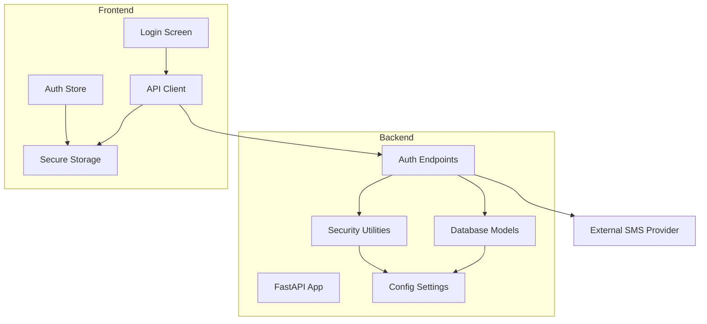
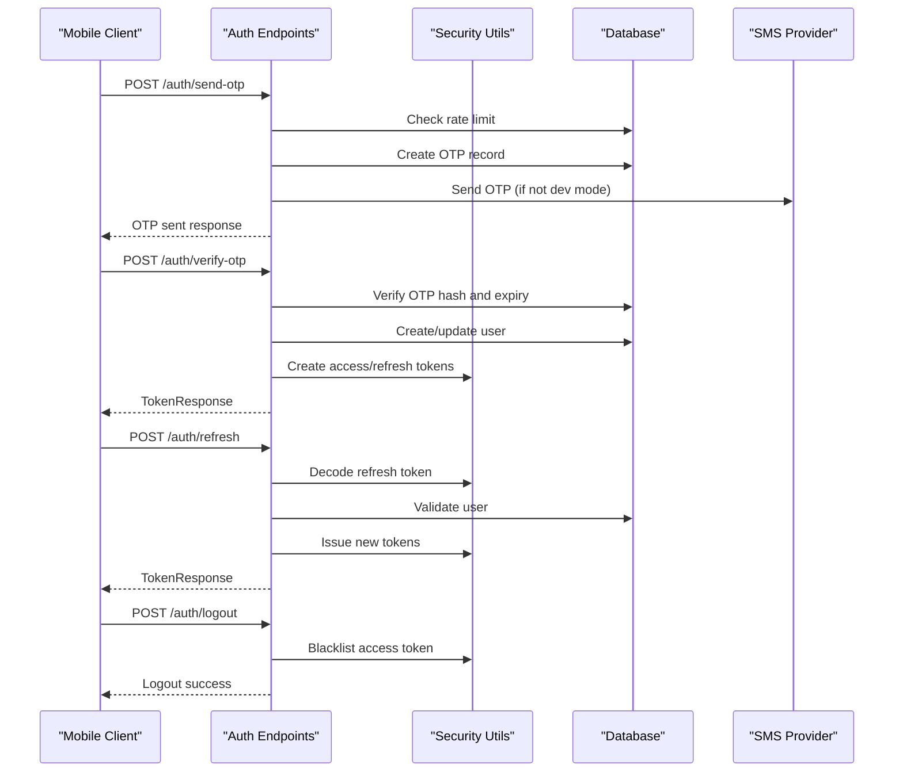
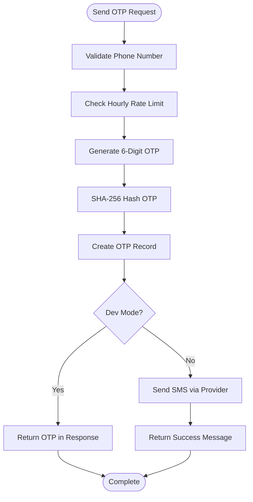
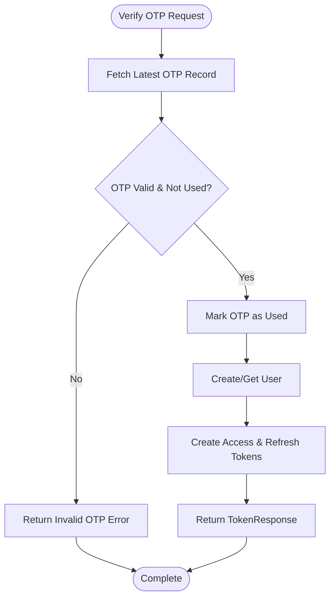
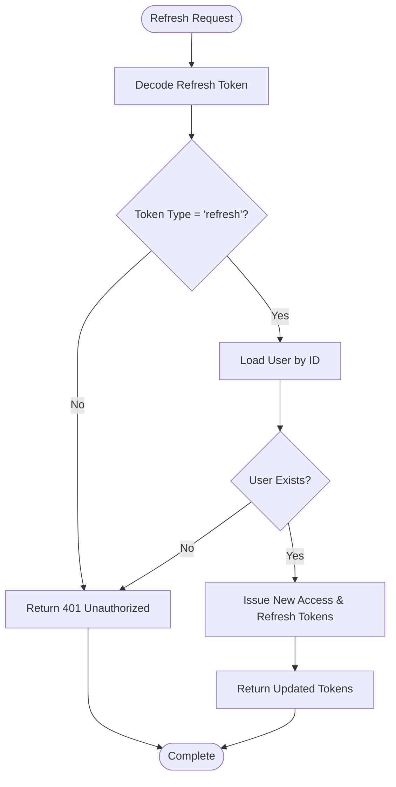
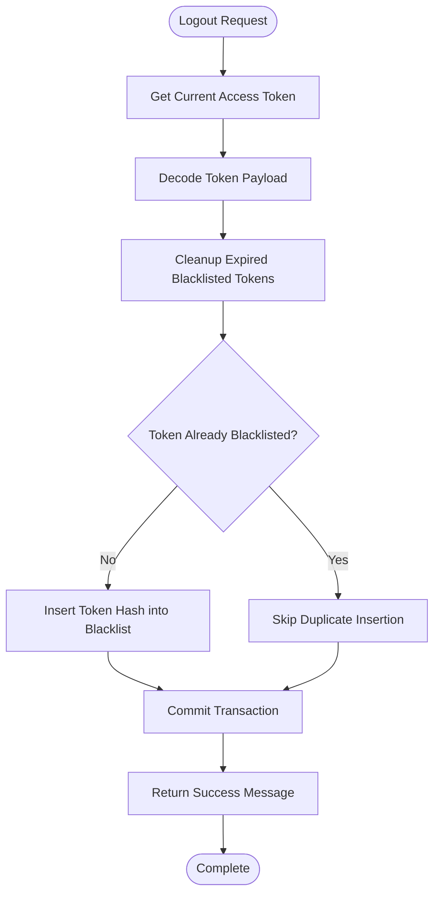
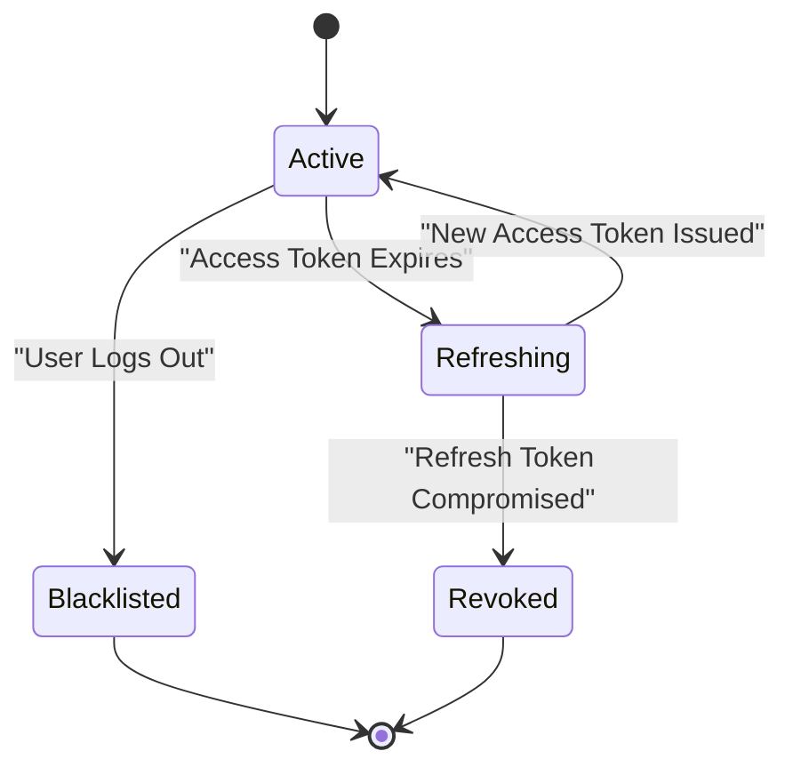
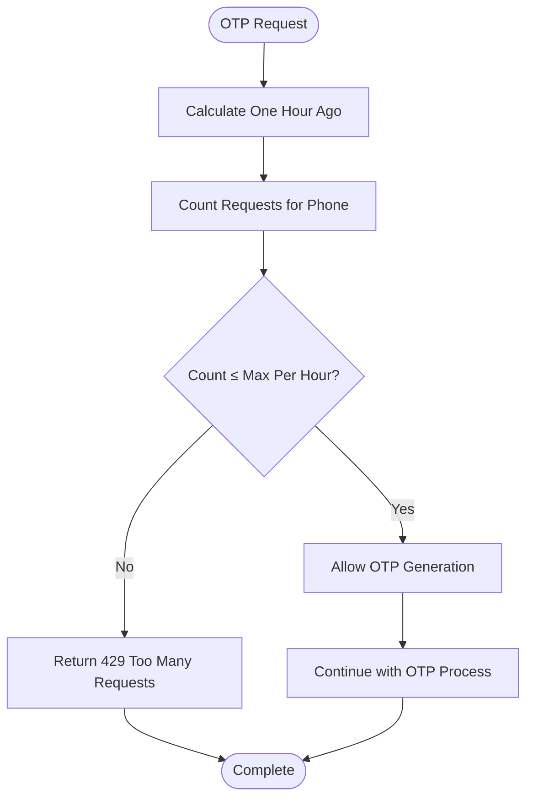
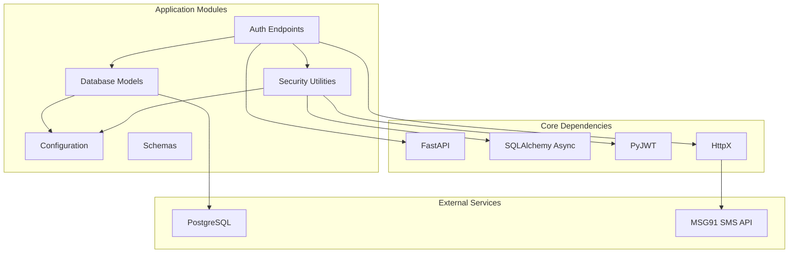

# Authentication System

<cite>
**Referenced Files in This Document**
- [auth.py](file://backend/app/api/v1/endpoints/auth.py)
- [security.py](file://backend/app/core/security.py)
- [user.py](file://backend/app/models/user.py)
- [schemas.py](file://backend/app/schemas/schemas.py)
- [config.py](file://backend/app/core/config.py)
- [database.py](file://backend/app/core/database.py)
- [main.py](file://backend/app/main.py)
- [001_initial.py](file://backend/alembic/versions/001_initial.py)
- [002_add_push_token.py](file://backend/alembic/versions/002_add_push_token.py)
- [api.ts](file://frontend/src/services/api.ts)
- [authStore.ts](file://frontend/src/store/authStore.ts)
- [LoginScreen.tsx](file://frontend/src/screens/LoginScreen.tsx)
- [index.ts](file://frontend/src/types/index.ts)
</cite>

## Table of Contents
1. [Introduction](#introduction)
2. [Project Structure](#project-structure)
3. [Core Components](#core-components)
4. [Architecture Overview](#architecture-overview)
5. [Detailed Component Analysis](#detailed-component-analysis)
6. [Dependency Analysis](#dependency-analysis)
7. [Performance Considerations](#performance-considerations)
8. [Troubleshooting Guide](#troubleshooting-guide)
9. [Conclusion](#conclusion)
10. [Appendices](#appendices)

## Introduction
This document provides comprehensive documentation for the SplitSure authentication system with a focus on OTP-based login and JWT token management. It covers the complete authentication flow from phone number registration through OTP verification to JWT token issuance, rate limiting mechanisms to prevent abuse, token lifecycle management including refresh token rotation and automatic expiration handling, security measures such as token blacklisting and secure storage recommendations, and practical examples for both backend and frontend implementations.

## Project Structure
The authentication system spans both backend and frontend components:
- Backend: FastAPI application with asynchronous PostgreSQL database, JWT token management, OTP generation and verification, and rate limiting.
- Frontend: React Native application with secure token storage, automatic token refresh, and user-friendly OTP input.

**Diagram sources**
- [auth.py:1-147](file://backend/app/api/v1/endpoints/auth.py#L1-L147)
- [security.py:1-96](file://backend/app/core/security.py#L1-L96)
- [user.py:1-234](file://backend/app/models/user.py#L1-L234)
- [config.py:1-71](file://backend/app/core/config.py#L1-L71)
- [api.ts:1-271](file://frontend/src/services/api.ts#L1-L271)
- [authStore.ts:1-116](file://frontend/src/store/authStore.ts#L1-L116)

**Section sources**
- [auth.py:1-147](file://backend/app/api/v1/endpoints/auth.py#L1-L147)
- [api.ts:1-271](file://frontend/src/services/api.ts#L1-L271)

## Core Components
The authentication system consists of several core components:

### Backend Components
- **Auth Endpoints**: Handle OTP generation, verification, token refresh, and logout
- **Security Utilities**: Manage JWT creation, decoding, token blacklisting, and current user retrieval
- **Database Models**: Define User, OTPRecord, and BlacklistedToken entities
- **Configuration**: Centralized settings for security, OTP behavior, and database connections
- **Database Layer**: Asynchronous PostgreSQL connection management

### Frontend Components
- **Login Screen**: User interface for phone number input and OTP verification
- **Auth Store**: Zustand store managing authentication state and token lifecycle
- **API Client**: Axios-based service with interceptors for token management
- **Secure Storage**: Expo Secure Store for encrypted token persistence

**Section sources**
- [auth.py:1-147](file://backend/app/api/v1/endpoints/auth.py#L1-L147)
- [security.py:1-96](file://backend/app/core/security.py#L1-L96)
- [user.py:1-234](file://backend/app/models/user.py#L1-L234)
- [config.py:1-71](file://backend/app/core/config.py#L1-L71)
- [api.ts:1-271](file://frontend/src/services/api.ts#L1-L271)
- [authStore.ts:1-116](file://frontend/src/store/authStore.ts#L1-L116)

## Architecture Overview
The authentication architecture follows a layered approach with clear separation of concerns:

**Diagram sources**
- [auth.py:58-147](file://backend/app/api/v1/endpoints/auth.py#L58-L147)
- [security.py:17-96](file://backend/app/core/security.py#L17-L96)
- [user.py:51-87](file://backend/app/models/user.py#L51-L87)

## Detailed Component Analysis

### OTP-Based Login Flow
The OTP-based authentication flow consists of four main steps:

#### Step 1: OTP Generation
The `/auth/send-otp` endpoint handles phone number validation and OTP generation:

**Diagram sources**
- [auth.py:58-80](file://backend/app/api/v1/endpoints/auth.py#L58-L80)
- [schemas.py:10-22](file://backend/app/schemas/schemas.py#L10-L22)
- [config.py:30-36](file://backend/app/core/config.py#L30-L36)

#### Step 2: OTP Verification
The `/auth/verify-otp` endpoint validates the OTP and issues JWT tokens:

**Diagram sources**
- [auth.py:82-115](file://backend/app/api/v1/endpoints/auth.py#L82-L115)
- [security.py:17-30](file://backend/app/core/security.py#L17-L30)

#### Step 3: Token Refresh
The `/auth/refresh` endpoint handles refresh token rotation:

**Diagram sources**
- [auth.py:118-136](file://backend/app/api/v1/endpoints/auth.py#L118-L136)
- [security.py:33-41](file://backend/app/core/security.py#L33-L41)

#### Step 4: Logout and Token Blacklisting
The `/auth/logout` endpoint invalidates the current access token:

**Diagram sources**
- [auth.py:139-147](file://backend/app/api/v1/endpoints/auth.py#L139-L147)
- [security.py:47-69](file://backend/app/core/security.py#L47-L69)

### JWT Token Management
The system implements a dual-token strategy with separate access and refresh tokens:

#### Access Token Properties
- Algorithm: HS256
- Expiration: 24 hours (configurable)
- Type: "access"
- Payload includes user ID (sub)

#### Refresh Token Properties
- Algorithm: HS256
- Expiration: 30 days (configurable)
- Type: "refresh"
- Payload includes user ID (sub)

#### Token Lifecycle

**Diagram sources**
- [security.py:17-30](file://backend/app/core/security.py#L17-L30)
- [config.py:13-14](file://backend/app/core/config.py#L13-L14)

### Rate Limiting Mechanisms
The system implements hourly rate limiting to prevent OTP abuse:

**Diagram sources**
- [auth.py:24-34](file://backend/app/api/v1/endpoints/auth.py#L24-L34)
- [config.py:36](file://backend/app/core/config.py#L36)

### Security Measures
The authentication system implements multiple security layers:

#### Token Blacklisting
- SHA-256 hashed token storage
- Automatic cleanup of expired blacklisted entries
- Real-time blacklist validation during authentication

#### Secure Storage Recommendations
- Frontend: Expo Secure Store for encrypted token persistence
- Backend: Environment-based configuration management
- Production: HTTPS enforcement and HSTS headers

#### Protection Against Common Attack Vectors
- Brute force prevention through rate limiting
- Token expiration and rotation
- Input validation and sanitization
- SQL injection prevention through ORM usage

**Section sources**
- [security.py:47-69](file://backend/app/core/security.py#L47-L69)
- [auth.py:24-34](file://backend/app/api/v1/endpoints/auth.py#L24-L34)
- [main.py:25-34](file://backend/app/main.py#L25-L34)

## Dependency Analysis
The authentication system exhibits strong modular design with clear dependency boundaries:

**Diagram sources**
- [auth.py:1-17](file://backend/app/api/v1/endpoints/auth.py#L1-L17)
- [security.py:1-15](file://backend/app/core/security.py#L1-L15)
- [database.py:1-29](file://backend/app/core/database.py#L1-L29)

### Component Coupling Analysis
- **Auth Endpoints** depend on Security Utilities and Database Models
- **Security Utilities** depend on Configuration and Database Models
- **Frontend API Client** depends on Secure Storage and Axios
- **Frontend Auth Store** depends on API Client and Secure Storage

**Section sources**
- [auth.py:1-17](file://backend/app/api/v1/endpoints/auth.py#L1-L17)
- [security.py:1-15](file://backend/app/core/security.py#L1-L15)
- [api.ts:1-271](file://frontend/src/services/api.ts#L1-L271)

## Performance Considerations
The authentication system is designed for optimal performance through several mechanisms:

### Database Optimization
- Indexes on frequently queried fields (phone numbers, token hashes)
- Asynchronous database operations for non-blocking performance
- Efficient OTP record cleanup and garbage collection

### Network Efficiency
- Minimal API round trips for authentication flows
- Optimized token refresh strategy to reduce unnecessary requests
- Connection pooling for database operations

### Memory Management
- Proper resource cleanup in FastAPI dependency injection
- Efficient token storage using hashing instead of plaintext storage
- Automatic cleanup of expired tokens and OTP records

## Troubleshooting Guide

### Common Authentication Issues

#### OTP Delivery Failures
- **Symptom**: Users receive "OTP generated" but don't receive SMS
- **Cause**: SMS provider credentials not configured or network issues
- **Solution**: Enable development mode for testing or configure MSG91 credentials

#### Rate Limit Exceeded
- **Symptom**: "Too many OTP requests. Try again in an hour."
- **Cause**: Exceeded hourly OTP generation limit
- **Solution**: Wait for rate limit to reset or adjust configuration

#### Token Validation Errors
- **Symptom**: "Invalid token" or "Token has expired" errors
- **Cause**: Using expired or malformed tokens
- **Solution**: Implement automatic token refresh using the refresh endpoint

#### Session Management Issues
- **Symptom**: Users appear logged out unexpectedly
- **Cause**: Token blacklisting or storage corruption
- **Solution**: Clear stored tokens and re-authenticate

### Debugging Strategies
- Enable backend logging for authentication events
- Monitor database queries for performance bottlenecks
- Test token lifecycle with manual verification
- Validate frontend token storage integrity

**Section sources**
- [auth.py:39-56](file://backend/app/api/v1/endpoints/auth.py#L39-L56)
- [security.py:33-41](file://backend/app/core/security.py#L33-L41)
- [api.ts:97-140](file://frontend/src/services/api.ts#L97-L140)

## Conclusion
The SplitSure authentication system provides a robust, secure, and scalable solution for OTP-based authentication with comprehensive JWT token management. The system effectively balances security requirements with user experience through intelligent rate limiting, automatic token refresh, and secure storage practices. The modular architecture ensures maintainability and extensibility while the frontend integration provides seamless user experience across platforms.

Key strengths of the system include:
- Comprehensive rate limiting preventing abuse
- Secure token lifecycle management
- Robust error handling and recovery mechanisms
- Cross-platform frontend integration
- Production-ready security configurations

The implementation demonstrates best practices in modern authentication systems while maintaining simplicity and reliability for end users.

## Appendices

### API Endpoint Reference

#### Authentication Endpoints
- `POST /api/v1/auth/send-otp` - Generate and send OTP
- `POST /api/v1/auth/verify-otp` - Verify OTP and issue tokens
- `POST /api/v1/auth/refresh` - Refresh access token
- `POST /api/v1/auth/logout` - Invalidate current session

#### Request/Response Formats
All endpoints follow standardized response patterns with appropriate HTTP status codes for error conditions.

### Configuration Options
- **ACCESS_TOKEN_EXPIRE_MINUTES**: Default 1440 minutes (24 hours)
- **REFRESH_TOKEN_EXPIRE_DAYS**: Default 30 days
- **OTP_EXPIRE_MINUTES**: Default 10 minutes
- **OTP_MAX_REQUESTS_PER_HOUR**: Default 20 requests
- **USE_DEV_OTP**: Development mode toggle

### Security Best Practices
- Always use HTTPS in production environments
- Rotate SECRET_KEY regularly in production
- Implement proper CORS configuration
- Monitor authentication logs for suspicious activities
- Regularly review and update security configurations