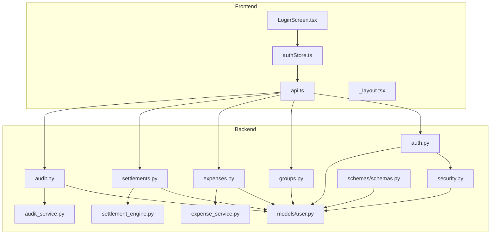
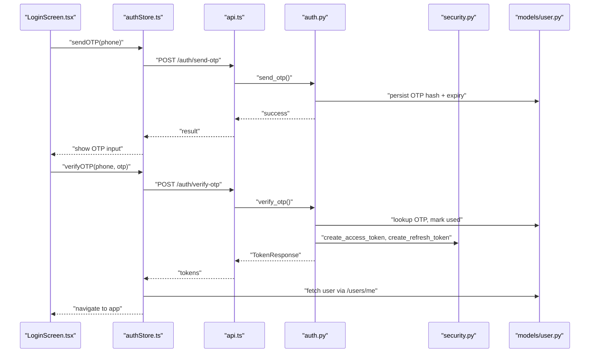
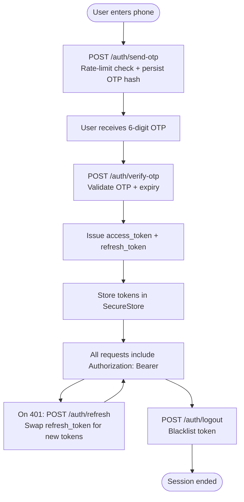
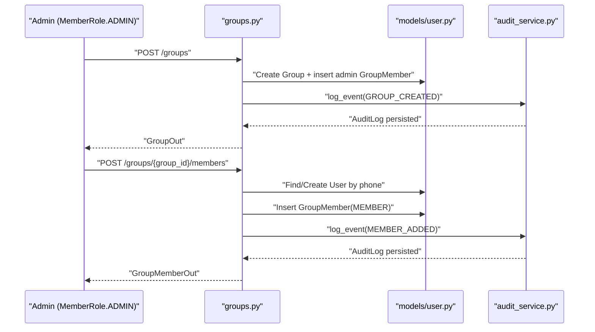
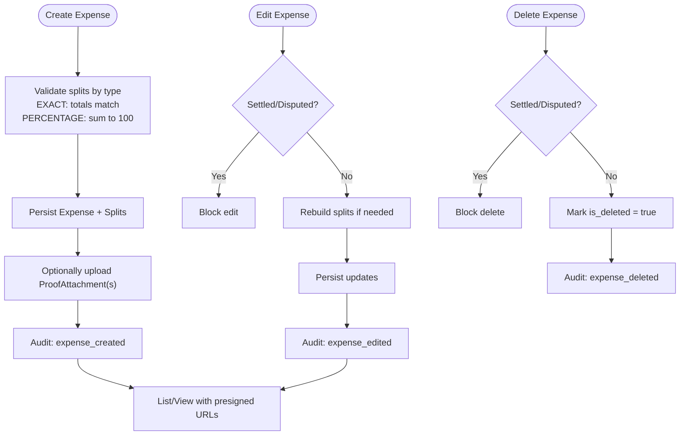
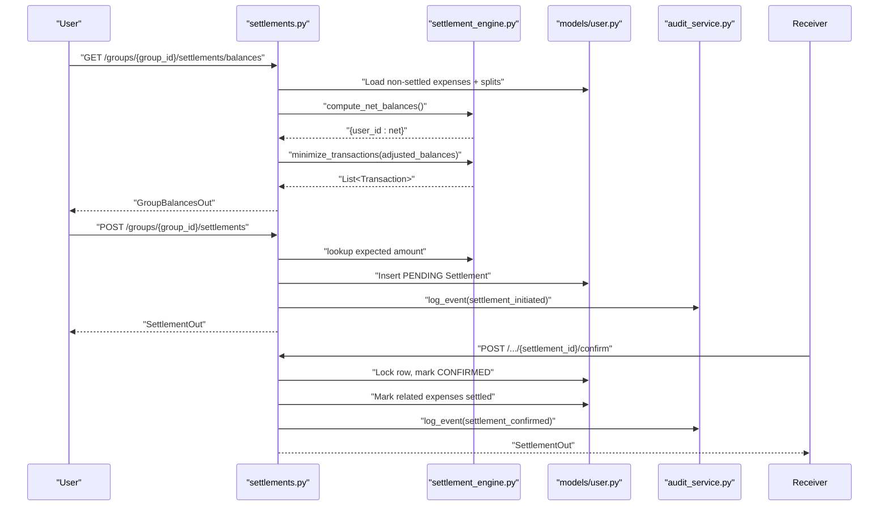
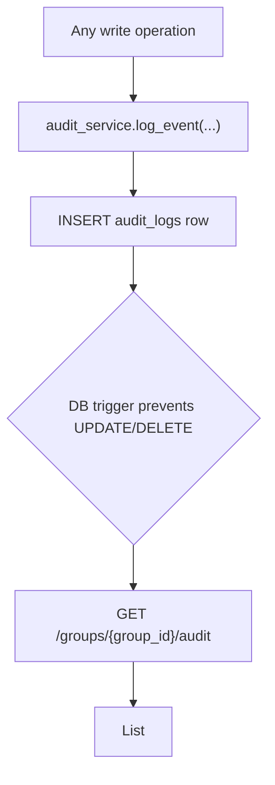
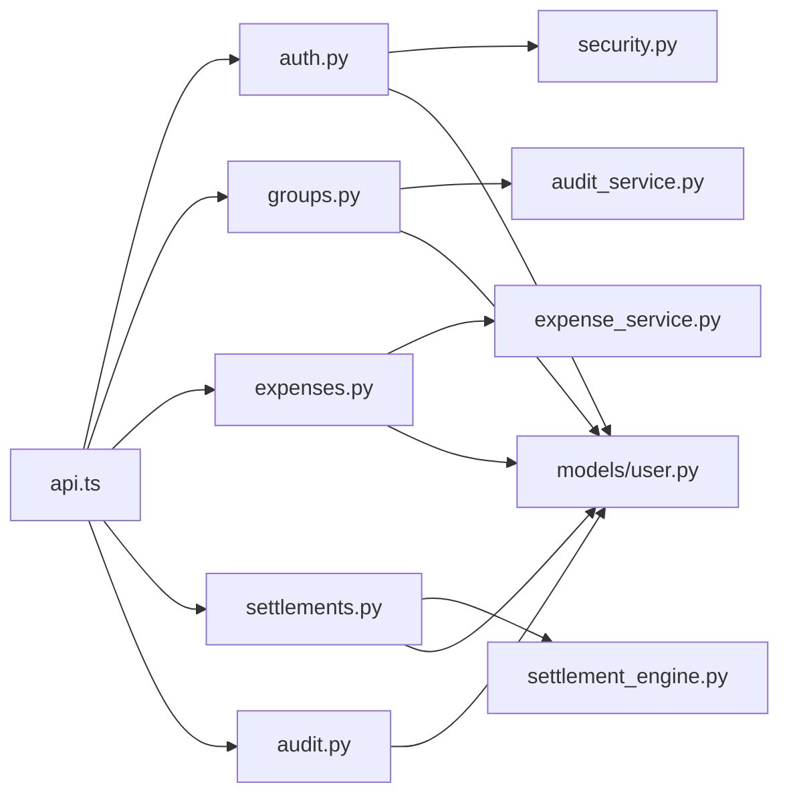

# Core Features

<cite>
**Referenced Files in This Document**
- [auth.py](file://backend/app/api/v1/endpoints/auth.py)
- [security.py](file://backend/app/core/security.py)
- [groups.py](file://backend/app/api/v1/endpoints/groups.py)
- [expenses.py](file://backend/app/api/v1/endpoints/expenses.py)
- [expense_service.py](file://backend/app/services/expense_service.py)
- [settlements.py](file://backend/app/api/v1/endpoints/settlements.py)
- [settlement_engine.py](file://backend/app/services/settlement_engine.py)
- [audit.py](file://backend/app/api/v1/endpoints/audit.py)
- [audit_service.py](file://backend/app/services/audit_service.py)
- [user.py](file://backend/app/models/user.py)
- [schemas.py](file://backend/app/schemas/schemas.py)
- [api.ts](file://frontend/src/services/api.ts)
- [authStore.ts](file://frontend/src/store/authStore.ts)
- [LoginScreen.tsx](file://frontend/src/screens/LoginScreen.tsx)
- [_layout.tsx](file://frontend/app/_layout.tsx)
- [index.ts](file://frontend/src/types/index.ts)
</cite>

## Table of Contents
1. [Introduction](#introduction)
2. [Project Structure](#project-structure)
3. [Core Components](#core-components)
4. [Architecture Overview](#architecture-overview)
5. [Detailed Component Analysis](#detailed-component-analysis)
6. [Dependency Analysis](#dependency-analysis)
7. [Performance Considerations](#performance-considerations)
8. [Troubleshooting Guide](#troubleshooting-guide)
9. [Conclusion](#conclusion)

## Introduction
This document details the core features that define SplitSure’s functionality. It covers:
- Authentication with OTP-based login and JWT token lifecycle
- Group management: creation, invitations, roles, and settings
- Expense tracking: creation, editing, deletion, split types, and proof attachments
- Settlement optimization engine: automated suggestions and confirmation workflows
- Immutable audit trail: event logging and compliance-ready records
- Practical workflows and how features integrate across the backend and frontend

## Project Structure
SplitSure is organized into:
- Backend (FastAPI): API endpoints, services, models, schemas, and security utilities
- Frontend (React Native/Expo): Screens, stores, services, and typed models
- Shared concerns: JWT, OTP, and audit logging are implemented consistently across layers

**Diagram sources**
- [auth.py:1-147](file://backend/app/api/v1/endpoints/auth.py#L1-L147)
- [security.py:1-96](file://backend/app/core/security.py#L1-L96)
- [groups.py:1-350](file://backend/app/api/v1/endpoints/groups.py#L1-L350)
- [expenses.py:1-395](file://backend/app/api/v1/endpoints/expenses.py#L1-L395)
- [expense_service.py:1-79](file://backend/app/services/expense_service.py#L1-L79)
- [settlements.py:1-501](file://backend/app/api/v1/endpoints/settlements.py#L1-L501)
- [settlement_engine.py:1-106](file://backend/app/services/settlement_engine.py#L1-L106)
- [audit.py:1-40](file://backend/app/api/v1/endpoints/audit.py#L1-L40)
- [audit_service.py:1-32](file://backend/app/services/audit_service.py#L1-L32)
- [user.py:1-234](file://backend/app/models/user.py#L1-L234)
- [schemas.py:1-432](file://backend/app/schemas/schemas.py#L1-L432)
- [api.ts:1-271](file://frontend/src/services/api.ts#L1-L271)
- [authStore.ts:1-116](file://frontend/src/store/authStore.ts#L1-L116)
- [LoginScreen.tsx:1-402](file://frontend/src/screens/LoginScreen.tsx#L1-L402)
- [_layout.tsx:1-85](file://frontend/app/_layout.tsx#L1-L85)

**Section sources**
- [auth.py:1-147](file://backend/app/api/v1/endpoints/auth.py#L1-L147)
- [groups.py:1-350](file://backend/app/api/v1/endpoints/groups.py#L1-L350)
- [expenses.py:1-395](file://backend/app/api/v1/endpoints/expenses.py#L1-L395)
- [settlements.py:1-501](file://backend/app/api/v1/endpoints/settlements.py#L1-L501)
- [audit.py:1-40](file://backend/app/api/v1/endpoints/audit.py#L1-L40)
- [user.py:1-234](file://backend/app/models/user.py#L1-L234)
- [schemas.py:1-432](file://backend/app/schemas/schemas.py#L1-L432)
- [api.ts:1-271](file://frontend/src/services/api.ts#L1-L271)
- [authStore.ts:1-116](file://frontend/src/store/authStore.ts#L1-L116)
- [LoginScreen.tsx:1-402](file://frontend/src/screens/LoginScreen.tsx#L1-L402)
- [_layout.tsx:1-85](file://frontend/app/_layout.tsx#L1-L85)

## Core Components
- Authentication system with OTP and JWT
- Group management with roles and invitations
- Expense tracking with split types and proof attachments
- Settlement optimization and confirmation workflows
- Immutable audit trail

**Section sources**
- [auth.py:1-147](file://backend/app/api/v1/endpoints/auth.py#L1-L147)
- [security.py:1-96](file://backend/app/core/security.py#L1-L96)
- [groups.py:1-350](file://backend/app/api/v1/endpoints/groups.py#L1-L350)
- [expenses.py:1-395](file://backend/app/api/v1/endpoints/expenses.py#L1-L395)
- [expense_service.py:1-79](file://backend/app/services/expense_service.py#L1-L79)
- [settlements.py:1-501](file://backend/app/api/v1/endpoints/settlements.py#L1-L501)
- [settlement_engine.py:1-106](file://backend/app/services/settlement_engine.py#L1-L106)
- [audit.py:1-40](file://backend/app/api/v1/endpoints/audit.py#L1-L40)
- [audit_service.py:1-32](file://backend/app/services/audit_service.py#L1-L32)

## Architecture Overview
The system enforces:
- JWT-based access control with refresh tokens and blacklisting
- Group-scoped authorization for all operations
- Immutable audit logs for compliance
- Optimized settlement computation with integer arithmetic

**Diagram sources**
- [LoginScreen.tsx:1-402](file://frontend/src/screens/LoginScreen.tsx#L1-L402)
- [authStore.ts:1-116](file://frontend/src/store/authStore.ts#L1-L116)
- [api.ts:142-169](file://frontend/src/services/api.ts#L142-L169)
- [auth.py:58-116](file://backend/app/api/v1/endpoints/auth.py#L58-L116)
- [security.py:17-31](file://backend/app/core/security.py#L17-L31)
- [user.py:51-68](file://backend/app/models/user.py#L51-L68)

## Detailed Component Analysis

### Authentication System (OTP + JWT)
- OTP generation and verification with rate limiting and expiry
- Access and refresh tokens with JWT claims and blacklisting
- Logout invalidates tokens immediately

**Diagram sources**
- [auth.py:58-147](file://backend/app/api/v1/endpoints/auth.py#L58-L147)
- [security.py:17-96](file://backend/app/core/security.py#L17-L96)
- [authStore.ts:34-59](file://frontend/src/store/authStore.ts#L34-L59)
- [api.ts:76-140](file://frontend/src/services/api.ts#L76-L140)

**Section sources**
- [auth.py:24-116](file://backend/app/api/v1/endpoints/auth.py#L24-L116)
- [security.py:47-96](file://backend/app/core/security.py#L47-L96)
- [authStore.ts:34-59](file://frontend/src/store/authStore.ts#L34-L59)
- [api.ts:76-140](file://frontend/src/services/api.ts#L76-L140)
- [schemas.py:47-56](file://backend/app/schemas/schemas.py#L47-L56)

### Group Management
- Creation: creator becomes admin; logged as audit event
- Membership: add by phone (auto-create non-registered users in dev), remove with admin-only policy
- Roles: admin vs member; admin-only actions enforced
- Settings: update name/description; archive/unarchive
- Invitations: generate invite links with expiry and usage limits; join via token

**Diagram sources**
- [groups.py:59-84](file://backend/app/api/v1/endpoints/groups.py#L59-L84)
- [groups.py:141-208](file://backend/app/api/v1/endpoints/groups.py#L141-L208)
- [audit_service.py:6-32](file://backend/app/services/audit_service.py#L6-L32)
- [user.py:90-122](file://backend/app/models/user.py#L90-L122)

**Section sources**
- [groups.py:59-139](file://backend/app/api/v1/endpoints/groups.py#L59-L139)
- [groups.py:141-208](file://backend/app/api/v1/endpoints/groups.py#L141-L208)
- [groups.py:235-318](file://backend/app/api/v1/endpoints/groups.py#L235-L318)
- [user.py:18-27](file://backend/app/models/user.py#L18-L27)
- [schemas.py:136-194](file://backend/app/schemas/schemas.py#L136-L194)

### Expense Tracking
- Creation: validate splits by type, persist splits, attach presigned URLs for proofs
- Editing: enforce no edits on settled/disputed expenses, rebuild splits when needed
- Deletion: soft-delete settled/disputed protected
- Disputes: raise and resolve with admin-only resolution
- Proofs: upload with size/type checks, generate presigned URLs

**Diagram sources**
- [expenses.py:143-179](file://backend/app/api/v1/endpoints/expenses.py#L143-L179)
- [expenses.py:230-264](file://backend/app/api/v1/endpoints/expenses.py#L230-L264)
- [expenses.py:266-291](file://backend/app/api/v1/endpoints/expenses.py#L266-L291)
- [expenses.py:293-319](file://backend/app/api/v1/endpoints/expenses.py#L293-L319)
- [expenses.py:321-349](file://backend/app/api/v1/endpoints/expenses.py#L321-L349)
- [expenses.py:352-395](file://backend/app/api/v1/endpoints/expenses.py#L352-L395)
- [expense_service.py:7-79](file://backend/app/services/expense_service.py#L7-L79)
- [audit_service.py:6-32](file://backend/app/services/audit_service.py#L6-L32)

**Section sources**
- [expenses.py:143-291](file://backend/app/api/v1/endpoints/expenses.py#L143-L291)
- [expenses.py:293-349](file://backend/app/api/v1/endpoints/expenses.py#L293-L349)
- [expenses.py:352-395](file://backend/app/api/v1/endpoints/expenses.py#L352-L395)
- [expense_service.py:7-79](file://backend/app/services/expense_service.py#L7-L79)
- [user.py:124-162](file://backend/app/models/user.py#L124-L162)
- [schemas.py:223-343](file://backend/app/schemas/schemas.py#L223-L343)

### Settlement Optimization Engine
- Computes net balances from non-settled, non-deleted expenses
- Minimizes transactions greedily; supports UPI deep links
- Settlement lifecycle: initiate, confirm, dispute, resolve
- Adjusts balances by excluding already confirmed settlements

**Diagram sources**
- [settlements.py:129-235](file://backend/app/api/v1/endpoints/settlements.py#L129-L235)
- [settlements.py:238-309](file://backend/app/api/v1/endpoints/settlements.py#L238-L309)
- [settlements.py:311-372](file://backend/app/api/v1/endpoints/settlements.py#L311-L372)
- [settlement_engine.py:23-106](file://backend/app/services/settlement_engine.py#L23-L106)
- [audit_service.py:6-32](file://backend/app/services/audit_service.py#L6-L32)

**Section sources**
- [settlements.py:129-372](file://backend/app/api/v1/endpoints/settlements.py#L129-L372)
- [settlement_engine.py:23-106](file://backend/app/services/settlement_engine.py#L23-L106)
- [user.py:164-182](file://backend/app/models/user.py#L164-L182)
- [schemas.py:344-418](file://backend/app/schemas/schemas.py#L344-L418)

### Audit Trail
- Immutable logs per group with actor, event type, and JSON payloads
- Enforced by backend service and database constraints
- Exposed via group-scoped endpoint with pagination

**Diagram sources**
- [audit_service.py:6-32](file://backend/app/services/audit_service.py#L6-L32)
- [audit.py:13-40](file://backend/app/api/v1/endpoints/audit.py#L13-L40)
- [user.py:184-200](file://backend/app/models/user.py#L184-L200)
- [schemas.py:421-432](file://backend/app/schemas/schemas.py#L421-L432)

**Section sources**
- [audit.py:13-40](file://backend/app/api/v1/endpoints/audit.py#L13-L40)
- [audit_service.py:6-32](file://backend/app/services/audit_service.py#L6-L32)
- [user.py:184-200](file://backend/app/models/user.py#L184-L200)
- [schemas.py:421-432](file://backend/app/schemas/schemas.py#L421-L432)

## Dependency Analysis
Key backend dependencies and integrations:
- Frontend auth depends on backend auth endpoints and token storage
- Group APIs depend on membership checks and audit logging
- Expense APIs depend on split validation and S3 presigned URLs
- Settlement APIs depend on the settlement engine and push notifications
- Audit APIs depend on group membership and immutable persistence

**Diagram sources**
- [api.ts:142-271](file://frontend/src/services/api.ts#L142-L271)
- [auth.py:1-147](file://backend/app/api/v1/endpoints/auth.py#L1-L147)
- [groups.py:1-350](file://backend/app/api/v1/endpoints/groups.py#L1-L350)
- [expenses.py:1-395](file://backend/app/api/v1/endpoints/expenses.py#L1-L395)
- [settlements.py:1-501](file://backend/app/api/v1/endpoints/settlements.py#L1-L501)
- [audit.py:1-40](file://backend/app/api/v1/endpoints/audit.py#L1-L40)
- [audit_service.py:1-32](file://backend/app/services/audit_service.py#L1-L32)
- [expense_service.py:1-79](file://backend/app/services/expense_service.py#L1-L79)
- [settlement_engine.py:1-106](file://backend/app/services/settlement_engine.py#L1-L106)
- [security.py:1-96](file://backend/app/core/security.py#L1-L96)
- [user.py:1-234](file://backend/app/models/user.py#L1-L234)

**Section sources**
- [api.ts:142-271](file://frontend/src/services/api.ts#L142-L271)
- [auth.py:1-147](file://backend/app/api/v1/endpoints/auth.py#L1-L147)
- [groups.py:1-350](file://backend/app/api/v1/endpoints/groups.py#L1-L350)
- [expenses.py:1-395](file://backend/app/api/v1/endpoints/expenses.py#L1-L395)
- [settlements.py:1-501](file://backend/app/api/v1/endpoints/settlements.py#L1-L501)
- [audit.py:1-40](file://backend/app/api/v1/endpoints/audit.py#L1-L40)
- [audit_service.py:1-32](file://backend/app/services/audit_service.py#L1-L32)
- [expense_service.py:1-79](file://backend/app/services/expense_service.py#L1-L79)
- [settlement_engine.py:1-106](file://backend/app/services/settlement_engine.py#L1-L106)
- [security.py:1-96](file://backend/app/core/security.py#L1-L96)
- [user.py:1-234](file://backend/app/models/user.py#L1-L234)

## Performance Considerations
- Integer arithmetic for monetary values avoids floating-point drift
- Greedy settlement minimization runs in O(n log n) time
- Select-in-load patterns reduce N+1 queries for related entities
- Presigned URLs enable efficient, CDN-backed proof downloads
- Rate limiting and expiry guard OTP abuse

[No sources needed since this section provides general guidance]

## Troubleshooting Guide
Common issues and remedies:
- Authentication failures: ensure tokens are present and not expired; use refresh endpoint; verify blacklisting
- Authorization errors: verify membership and roles before invoking admin endpoints
- Expense edits blocked: check settled/disputed flags; rebuild splits when changing split type
- Settlement conflicts: verify expected amount matches computed balances; ensure no pending settlement exists
- Audit visibility: confirm group membership; paginate with limit/offset

**Section sources**
- [security.py:72-96](file://backend/app/core/security.py#L72-L96)
- [groups.py:30-42](file://backend/app/api/v1/endpoints/groups.py#L30-L42)
- [expenses.py:238-245](file://backend/app/api/v1/endpoints/expenses.py#L238-L245)
- [settlements.py:253-259](file://backend/app/api/v1/endpoints/settlements.py#L253-L259)
- [audit.py:21-30](file://backend/app/api/v1/endpoints/audit.py#L21-L30)

## Conclusion
SplitSure’s core features are built around secure, auditable, and optimized financial workflows. The OTP + JWT authentication secures access, group-centric authorization governs actions, immutable audit logs provide compliance, and the settlement engine reduces friction. Together, these components deliver a cohesive, production-ready experience across mobile and web.