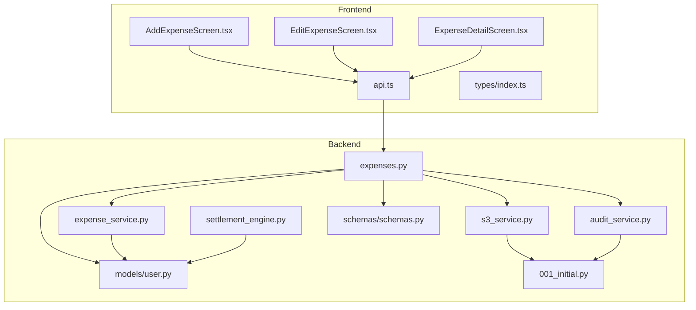
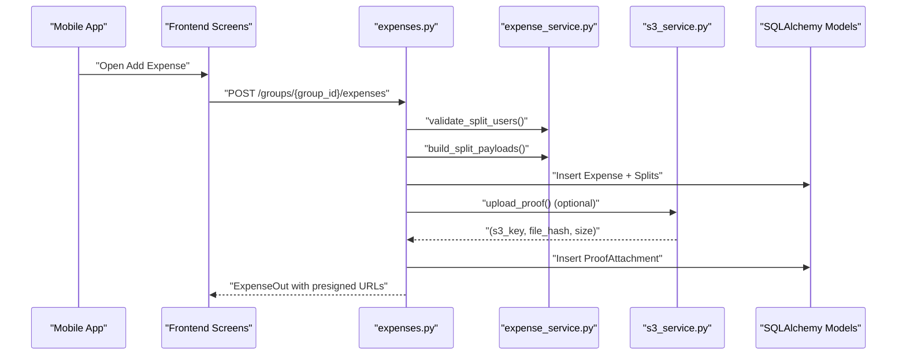
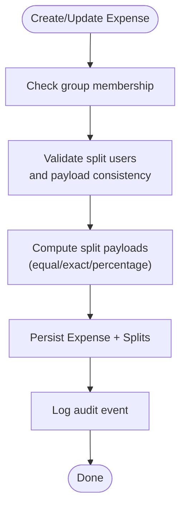
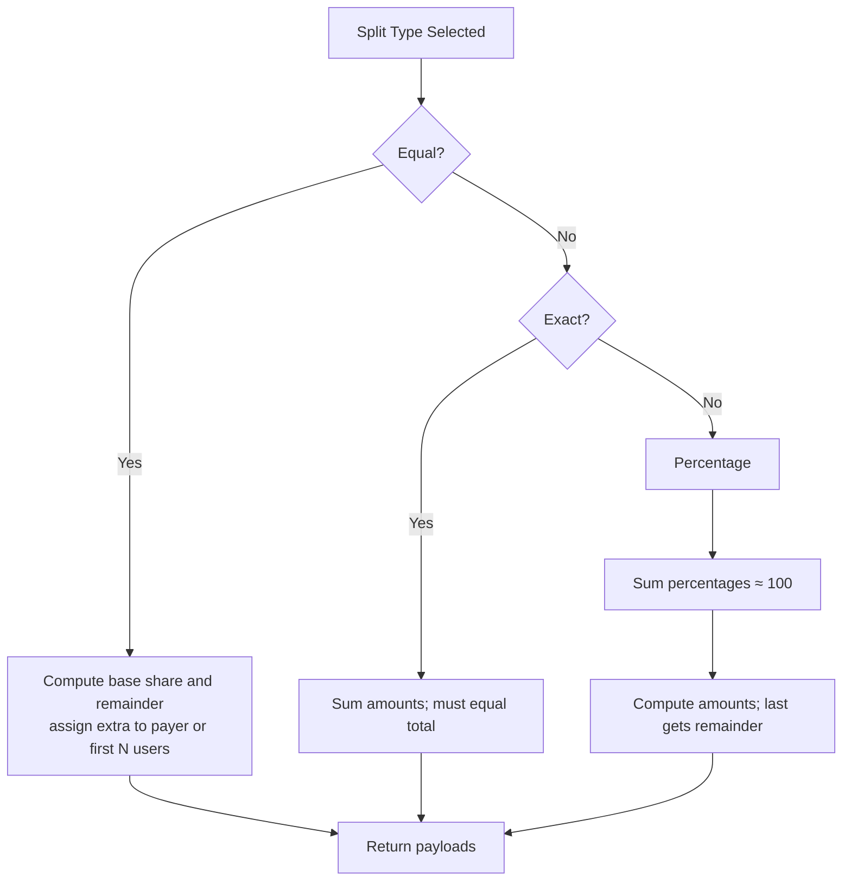
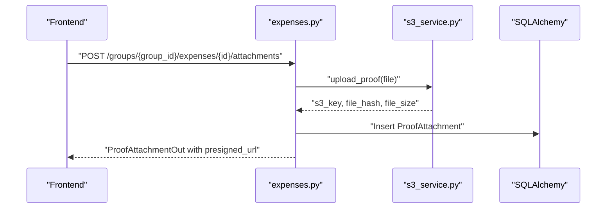
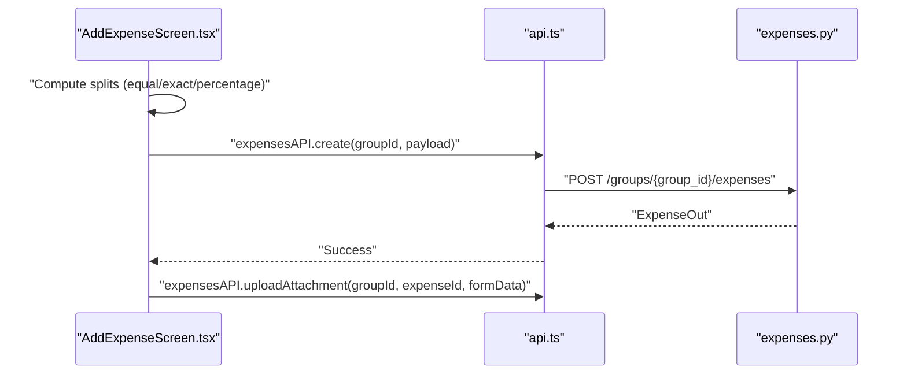
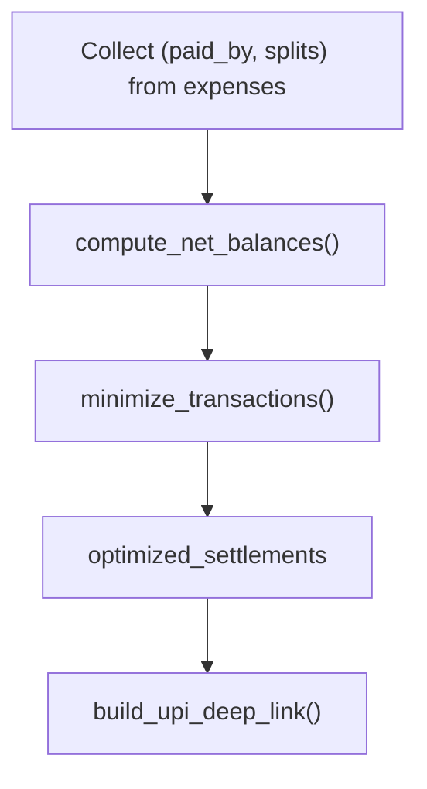
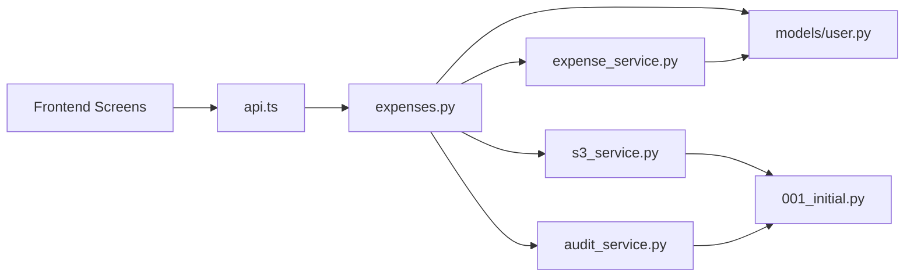
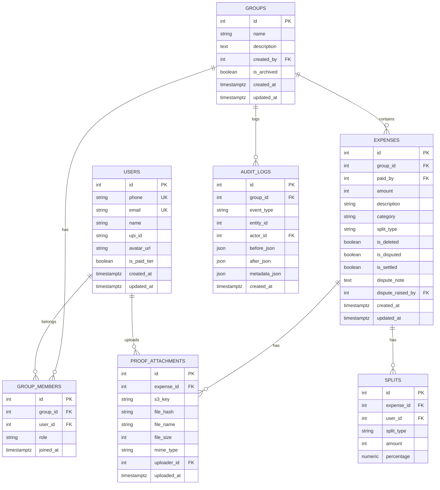

# Expense Tracking

<cite>
**Referenced Files in This Document**
- [expenses.py](file://backend/app/api/v1/endpoints/expenses.py)
- [expense_service.py](file://backend/app/services/expense_service.py)
- [schemas.py](file://backend/app/schemas/schemas.py)
- [user.py](file://backend/app/models/user.py)
- [s3_service.py](file://backend/app/services/s3_service.py)
- [audit_service.py](file://backend/app/services/audit_service.py)
- [001_initial.py](file://backend/alembic/versions/001_initial.py)
- [AddExpenseScreen.tsx](file://frontend/src/screens/AddExpenseScreen.tsx)
- [EditExpenseScreen.tsx](file://frontend/src/screens/EditExpenseScreen.tsx)
- [ExpenseDetailScreen.tsx](file://frontend/src/screens/ExpenseDetailScreen.tsx)
- [api.ts](file://frontend/src/services/api.ts)
- [index.ts](file://frontend/src/types/index.ts)
- [settlement_engine.py](file://backend/app/services/settlement_engine.py)
</cite>

## Table of Contents
1. [Introduction](#introduction)
2. [Project Structure](#project-structure)
3. [Core Components](#core-components)
4. [Architecture Overview](#architecture-overview)
5. [Detailed Component Analysis](#detailed-component-analysis)
6. [Dependency Analysis](#dependency-analysis)
7. [Performance Considerations](#performance-considerations)
8. [Troubleshooting Guide](#troubleshooting-guide)
9. [Conclusion](#conclusion)
10. [Appendices](#appendices)

## Introduction
SplitSure is an expense tracking system designed to capture, manage, and distribute shared expenses within groups. It supports three split types—equal, exact, and percentage—enabling flexible cost allocation. Users can attach proofs (receipts, invoices) that are securely stored and time-stamped. The system enforces strict validation rules, prevents edits on settled or disputed expenses, and logs all changes for auditability. The settlement optimization engine computes net balances and minimizes transactions to settle debts efficiently.

## Project Structure
The system comprises:
- Backend (FastAPI): APIs for expenses, groups, settlements, and storage; services for validation, S3/local storage, and audit logging; SQLAlchemy models and Alembic migrations.
- Frontend (React Native): Screens for adding, editing, viewing, disputing, and deleting expenses; uploading proofs; and integrating with the backend via typed APIs.

**Diagram sources**
- [expenses.py:1-395](file://backend/app/api/v1/endpoints/expenses.py#L1-L395)
- [expense_service.py:1-79](file://backend/app/services/expense_service.py#L1-L79)
- [s3_service.py:1-158](file://backend/app/services/s3_service.py#L1-L158)
- [audit_service.py:1-32](file://backend/app/services/audit_service.py#L1-L32)
- [user.py:1-234](file://backend/app/models/user.py#L1-L234)
- [schemas.py:1-432](file://backend/app/schemas/schemas.py#L1-L432)
- [001_initial.py:1-185](file://backend/alembic/versions/001_initial.py#L1-L185)
- [settlement_engine.py:1-106](file://backend/app/services/settlement_engine.py#L1-L106)
- [AddExpenseScreen.tsx:1-421](file://frontend/src/screens/AddExpenseScreen.tsx#L1-L421)
- [EditExpenseScreen.tsx:1-388](file://frontend/src/screens/EditExpenseScreen.tsx#L1-L388)
- [ExpenseDetailScreen.tsx:1-531](file://frontend/src/screens/ExpenseDetailScreen.tsx#L1-L531)
- [api.ts:1-271](file://frontend/src/services/api.ts#L1-L271)
- [index.ts:1-175](file://frontend/src/types/index.ts#L1-L175)

**Section sources**
- [expenses.py:1-395](file://backend/app/api/v1/endpoints/expenses.py#L1-L395)
- [AddExpenseScreen.tsx:1-421](file://frontend/src/screens/AddExpenseScreen.tsx#L1-L421)
- [EditExpenseScreen.tsx:1-388](file://frontend/src/screens/EditExpenseScreen.tsx#L1-L388)
- [ExpenseDetailScreen.tsx:1-531](file://frontend/src/screens/ExpenseDetailScreen.tsx#L1-L531)
- [api.ts:1-271](file://frontend/src/services/api.ts#L1-L271)
- [index.ts:1-175](file://frontend/src/types/index.ts#L1-L175)

## Core Components
- Expense lifecycle endpoints: create, list, get, update, delete, dispute, resolve dispute, and upload attachments.
- Split computation service: validates and builds split payloads for equal, exact, and percentage splits.
- Proof attachment service: secure upload, hashing, and pre-signed URL generation.
- Audit logging: immutable audit trail for all lifecycle events.
- Frontend screens: guided creation, editing, viewing, and dispute flows with photo upload handling.

**Section sources**
- [expenses.py:143-395](file://backend/app/api/v1/endpoints/expenses.py#L143-L395)
- [expense_service.py:7-79](file://backend/app/services/expense_service.py#L7-L79)
- [s3_service.py:105-158](file://backend/app/services/s3_service.py#L105-L158)
- [audit_service.py:6-32](file://backend/app/services/audit_service.py#L6-L32)
- [AddExpenseScreen.tsx:35-110](file://frontend/src/screens/AddExpenseScreen.tsx#L35-L110)
- [EditExpenseScreen.tsx:67-124](file://frontend/src/screens/EditExpenseScreen.tsx#L67-L124)
- [ExpenseDetailScreen.tsx:47-122](file://frontend/src/screens/ExpenseDetailScreen.tsx#L47-L122)

## Architecture Overview
The backend exposes REST endpoints under /groups/{group_id}/expenses. Each expense belongs to a group and references the user who paid. Splits define how the total amount is attributed to participants. Proof attachments are stored securely and accessed via pre-signed URLs. Audit logs record all mutations. The frontend integrates with typed APIs to drive user actions.

**Diagram sources**
- [expenses.py:143-179](file://backend/app/api/v1/endpoints/expenses.py#L143-L179)
- [expense_service.py:7-79](file://backend/app/services/expense_service.py#L7-L79)
- [s3_service.py:105-136](file://backend/app/services/s3_service.py#L105-L136)
- [user.py:124-217](file://backend/app/models/user.py#L124-L217)

## Detailed Component Analysis

### Expense Lifecycle Management
- Creation: Validates group membership, split users, and split payload consistency; inserts expense and splits; logs audit event.
- Listing and retrieval: Filters by category and search; eager-loads related entities; returns presigned URLs for attachments.
- Updates: Prevents edits on settled/disputed expenses; rebuilds splits when split type or amounts change; logs audit event.
- Deletion: Prevents deletion on settled/disputed; marks soft-deleted; logs audit event.
- Dispute: Freezes expense and records dispute metadata; only admins can resolve.
- Attachments: Enforces per-expense limits, verifies MIME and size, hashes content, stores securely, and returns pre-signed URLs.

**Diagram sources**
- [expenses.py:143-179](file://backend/app/api/v1/endpoints/expenses.py#L143-L179)
- [expense_service.py:19-79](file://backend/app/services/expense_service.py#L19-L79)
- [audit_service.py:6-32](file://backend/app/services/audit_service.py#L6-L32)

**Section sources**
- [expenses.py:143-395](file://backend/app/api/v1/endpoints/expenses.py#L143-L395)
- [audit_service.py:6-32](file://backend/app/services/audit_service.py#L6-L32)

### Split Types and Validation
- Equal split: Distributes amount evenly; remainder handled by the payer if present in the participant set.
- Exact split: Requires individual amounts to sum to the total; validated both server-side and client-side.
- Percentage split: Requires percentages to sum to 100; amounts computed with rounding and last participant receiving remaining.

**Diagram sources**
- [expense_service.py:19-79](file://backend/app/services/expense_service.py#L19-L79)
- [schemas.py:245-255](file://backend/app/schemas/schemas.py#L245-L255)

**Section sources**
- [expense_service.py:19-79](file://backend/app/services/expense_service.py#L19-L79)
- [schemas.py:217-288](file://backend/app/schemas/schemas.py#L217-L288)

### Proof Attachment System
- Supported types: JPEG, PNG, PDF.
- Size limit enforced.
- MIME verification via file signatures.
- Server-side SHA-256 hashing for integrity.
- Storage modes: local filesystem or AWS S3; pre-signed URLs generated for secure access.
- Frontend upload flow: camera/gallery picker, optional compression, multipart form submission, post-creation upload support.

**Diagram sources**
- [expenses.py:352-394](file://backend/app/api/v1/endpoints/expenses.py#L352-L394)
- [s3_service.py:105-147](file://backend/app/services/s3_service.py#L105-L147)
- [user.py:202-217](file://backend/app/models/user.py#L202-L217)

**Section sources**
- [s3_service.py:105-158](file://backend/app/services/s3_service.py#L105-L158)
- [expenses.py:352-394](file://backend/app/api/v1/endpoints/expenses.py#L352-L394)
- [ExpenseDetailScreen.tsx:84-122](file://frontend/src/screens/ExpenseDetailScreen.tsx#L84-L122)

### Frontend Workflows
- Add Expense: Collects amount, description, category, split mode, participant allocations; validates totals; submits to backend; optionally attaches proof.
- Edit Expense: Loads existing expense; disables editing if settled/disputed; recomputes splits; updates backend.
- Expense Detail: Shows split breakdown, proof gallery with preview/download; raises/disputes; deletes; resolves disputes (admin).

**Diagram sources**
- [AddExpenseScreen.tsx:35-110](file://frontend/src/screens/AddExpenseScreen.tsx#L35-L110)
- [api.ts:205-243](file://frontend/src/services/api.ts#L205-L243)
- [expenses.py:143-179](file://backend/app/api/v1/endpoints/expenses.py#L143-L179)

**Section sources**
- [AddExpenseScreen.tsx:35-110](file://frontend/src/screens/AddExpenseScreen.tsx#L35-L110)
- [EditExpenseScreen.tsx:67-124](file://frontend/src/screens/EditExpenseScreen.tsx#L67-L124)
- [ExpenseDetailScreen.tsx:47-122](file://frontend/src/screens/ExpenseDetailScreen.tsx#L47-L122)
- [api.ts:205-243](file://frontend/src/services/api.ts#L205-L243)

### Settlement Optimization Integration
- Net balances computed from expense splits and paid amounts.
- Greedy algorithm minimizes transaction count.
- UPI deep links built for settlement instructions.

**Diagram sources**
- [settlement_engine.py:23-106](file://backend/app/services/settlement_engine.py#L23-L106)
- [user.py:124-146](file://backend/app/models/user.py#L124-L146)

**Section sources**
- [settlement_engine.py:1-106](file://backend/app/services/settlement_engine.py#L1-L106)
- [user.py:124-146](file://backend/app/models/user.py#L124-L146)

## Dependency Analysis
- Backend endpoints depend on:
  - Validation service for split rules.
  - Storage service for proof uploads.
  - Audit service for immutable logs.
  - SQLAlchemy models for persistence.
- Frontend depends on typed enums and interfaces for consistent data contracts.

**Diagram sources**
- [expenses.py:1-395](file://backend/app/api/v1/endpoints/expenses.py#L1-L395)
- [expense_service.py:1-79](file://backend/app/services/expense_service.py#L1-L79)
- [s3_service.py:1-158](file://backend/app/services/s3_service.py#L1-L158)
- [audit_service.py:1-32](file://backend/app/services/audit_service.py#L1-L32)
- [user.py:1-234](file://backend/app/models/user.py#L1-L234)
- [001_initial.py:1-185](file://backend/alembic/versions/001_initial.py#L1-L185)
- [api.ts:1-271](file://frontend/src/services/api.ts#L1-L271)

**Section sources**
- [expenses.py:1-395](file://backend/app/api/v1/endpoints/expenses.py#L1-L395)
- [user.py:1-234](file://backend/app/models/user.py#L1-L234)
- [001_initial.py:1-185](file://backend/alembic/versions/001_initial.py#L1-L185)

## Performance Considerations
- Prefer exact splits only when necessary; percentage/equal splits reduce payload size and computation overhead.
- Limit attachment counts per expense to reduce storage and retrieval latency.
- Use pagination and filtering (category/search) for listing expenses.
- Minimize transaction count via settlement optimization to reduce network calls and reconciliation work.

## Troubleshooting Guide
Common issues and resolutions:
- Validation errors:
  - Amount must be greater than zero.
  - Description is required.
  - Exact split amounts must sum to total.
  - Percentages must sum to 100 (within tolerance).
  - Duplicate users or non-group members in splits.
- Edit/Deletion restrictions:
  - Cannot edit settled or disputed expenses.
  - Cannot delete settled or disputed expenses.
- Dispute workflow:
  - Only admins can resolve disputes.
  - Disputes freeze the expense until resolved.
- Photo upload:
  - Unsupported file type or size exceeded.
  - MIME type mismatch detected by signature verification.
  - Maximum attachments per expense reached.
- Audit trail:
  - Immutable audit logs prevent modification; use logs to diagnose state transitions.

**Section sources**
- [schemas.py:230-288](file://backend/app/schemas/schemas.py#L230-L288)
- [expenses.py:241-290](file://backend/app/api/v1/endpoints/expenses.py#L241-L290)
- [s3_service.py:114-123](file://backend/app/services/s3_service.py#L114-L123)
- [audit_service.py:6-32](file://backend/app/services/audit_service.py#L6-L32)

## Conclusion
SplitSure provides a robust, auditable framework for shared expense management. Its split computation ensures fairness across equal, exact, and percentage distributions, while the proof attachment system secures receipts with cryptographic hashing and pre-signed URLs. Frontend screens streamline creation, editing, dispute, and deletion workflows, integrating seamlessly with backend APIs. The settlement optimization engine further enhances usability by minimizing transaction complexity.

## Appendices

### Practical Examples
- Equal split example: Three participants share a ₹300 bill; each pays ₹100; remainder logic applies if payer is included.
- Exact split example: One person pays ₹150, others pay ₹100 and ₹50 respectively; total equals ₹300.
- Percentage split example: 50%, 30%, 20% of ₹1000; last participant receives remaining paise to reconcile.

**Section sources**
- [expense_service.py:62-78](file://backend/app/services/expense_service.py#L62-L78)
- [AddExpenseScreen.tsx:174-207](file://frontend/src/screens/AddExpenseScreen.tsx#L174-L207)

### Data Model Overview

**Diagram sources**
- [user.py:51-217](file://backend/app/models/user.py#L51-L217)
- [001_initial.py:68-140](file://backend/alembic/versions/001_initial.py#L68-L140)