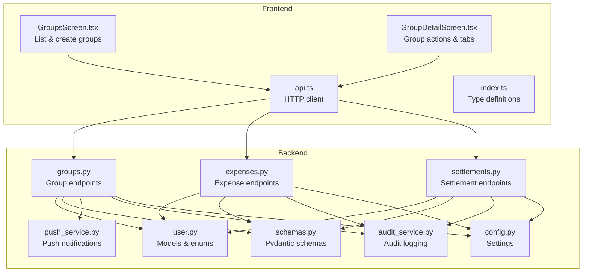
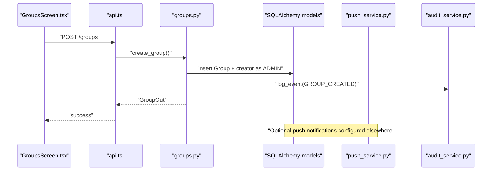
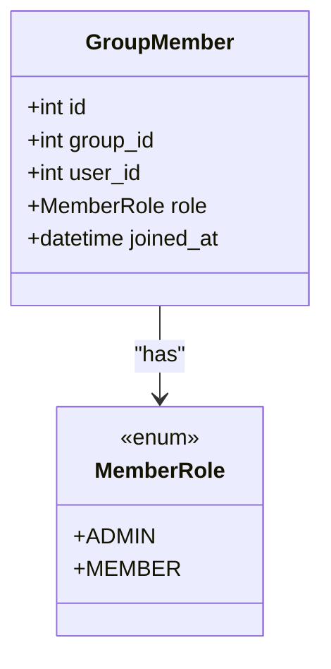
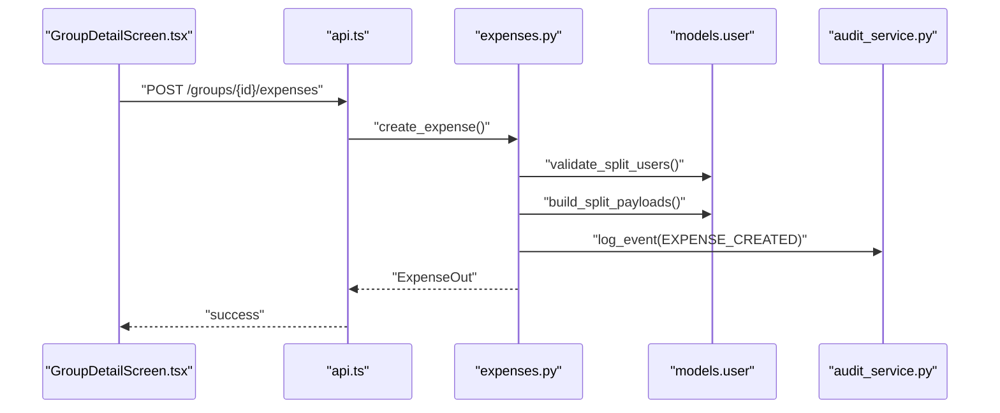
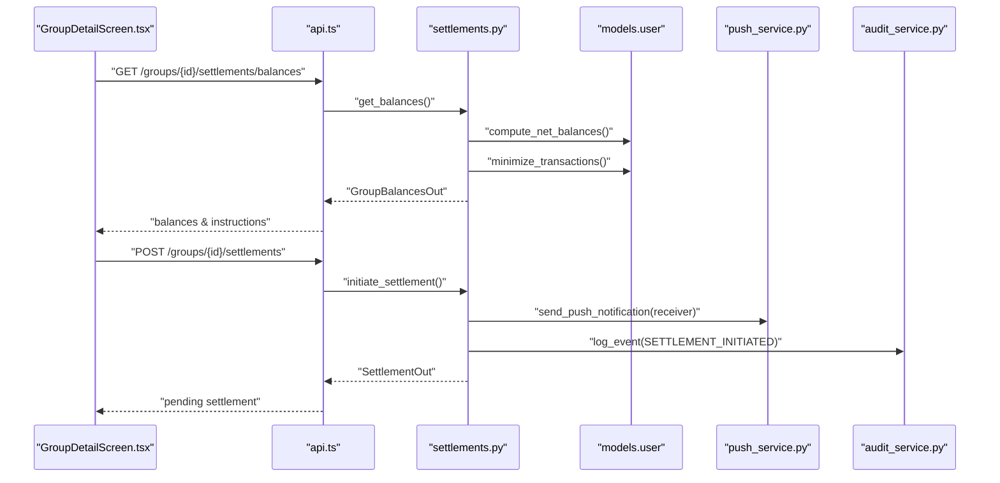
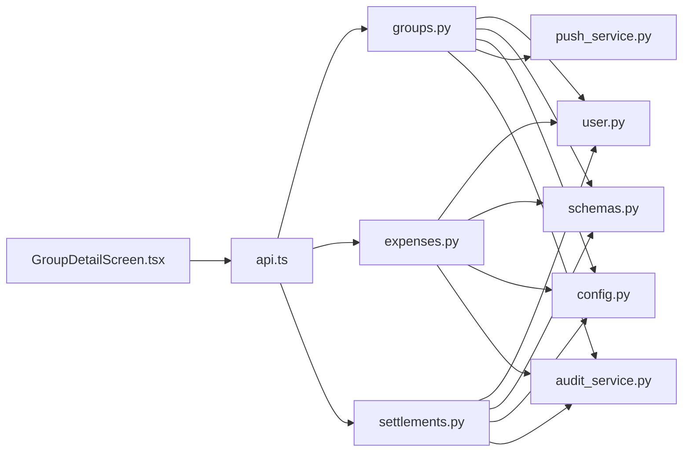

# Group Management

<cite>
**Referenced Files in This Document**
- [groups.py](file://backend/app/api/v1/endpoints/groups.py)
- [expenses.py](file://backend/app/api/v1/endpoints/expenses.py)
- [settlements.py](file://backend/app/api/v1/endpoints/settlements.py)
- [user.py](file://backend/app/models/user.py)
- [schemas.py](file://backend/app/schemas/schemas.py)
- [config.py](file://backend/app/core/config.py)
- [push_service.py](file://backend/app/services/push_service.py)
- [audit_service.py](file://backend/app/services/audit_service.py)
- [GroupsScreen.tsx](file://frontend/src/screens/GroupsScreen.tsx)
- [GroupDetailScreen.tsx](file://frontend/src/screens/GroupDetailScreen.tsx)
- [api.ts](file://frontend/src/services/api.ts)
- [index.ts](file://frontend/src/types/index.ts)
</cite>

## Table of Contents
1. [Introduction](#introduction)
2. [Project Structure](#project-structure)
3. [Core Components](#core-components)
4. [Architecture Overview](#architecture-overview)
5. [Detailed Component Analysis](#detailed-component-analysis)
6. [Dependency Analysis](#dependency-analysis)
7. [Performance Considerations](#performance-considerations)
8. [Troubleshooting Guide](#troubleshooting-guide)
9. [Conclusion](#conclusion)
10. [Appendices](#appendices)

## Introduction
This document explains the SplitSure group management feature, focusing on creating, organizing, and maintaining expense groups. It covers:
- Group creation and initial setup
- Group settings configuration
- Member invitation workflows (direct addition and invite links)
- Role-based permissions (admin vs member)
- Member management operations (invitation, acceptance, role assignments, removal)
- Group settings and configuration options
- Practical examples of group operations and administrative controls
- Integration with expense tracking and settlement features within group contexts

## Project Structure
The group management feature spans backend endpoints, models, schemas, services, and frontend screens and APIs.

**Diagram sources**
- [groups.py:18-350](file://backend/app/api/v1/endpoints/groups.py#L18-L350)
- [expenses.py:20-395](file://backend/app/api/v1/endpoints/expenses.py#L20-L395)
- [settlements.py:30-501](file://backend/app/api/v1/endpoints/settlements.py#L30-L501)
- [user.py:18-234](file://backend/app/models/user.py#L18-L234)
- [schemas.py:136-432](file://backend/app/schemas/schemas.py#L136-L432)
- [config.py:6-71](file://backend/app/core/config.py#L6-L71)
- [push_service.py:1-73](file://backend/app/services/push_service.py#L1-L73)
- [audit_service.py:6-32](file://backend/app/services/audit_service.py#L6-L32)
- [GroupsScreen.tsx:22-292](file://frontend/src/screens/GroupsScreen.tsx#L22-L292)
- [GroupDetailScreen.tsx:23-669](file://frontend/src/screens/GroupDetailScreen.tsx#L23-L669)
- [api.ts:186-202](file://frontend/src/services/api.ts#L186-L202)

**Section sources**
- [groups.py:18-350](file://backend/app/api/v1/endpoints/groups.py#L18-L350)
- [expenses.py:20-395](file://backend/app/api/v1/endpoints/expenses.py#L20-L395)
- [settlements.py:30-501](file://backend/app/api/v1/endpoints/settlements.py#L30-L501)
- [user.py:18-234](file://backend/app/models/user.py#L18-L234)
- [schemas.py:136-432](file://backend/app/schemas/schemas.py#L136-L432)
- [config.py:6-71](file://backend/app/core/config.py#L6-L71)
- [push_service.py:1-73](file://backend/app/services/push_service.py#L1-L73)
- [audit_service.py:6-32](file://backend/app/services/audit_service.py#L6-L32)
- [GroupsScreen.tsx:22-292](file://frontend/src/screens/GroupsScreen.tsx#L22-L292)
- [GroupDetailScreen.tsx:23-669](file://frontend/src/screens/GroupDetailScreen.tsx#L23-L669)
- [api.ts:186-202](file://frontend/src/services/api.ts#L186-L202)

## Core Components
- Group endpoints: create, list, get, update, archive/unarchive, add/remove members, create invite link, join via invite.
- Expense endpoints: create, list, get, update/delete, dispute/resolve, upload attachments.
- Settlement endpoints: compute balances, initiate settlement, confirm, dispute/resolve.
- Models and enums: Group, GroupMember, MemberRole, Expense, Split, Settlement, AuditLog, InviteLink.
- Schemas: Pydantic models for requests/responses and validation.
- Services: push notifications, audit logging, expense split computation, settlement engine.
- Frontend screens: group listing, detail view, and API bindings.

**Section sources**
- [groups.py:59-350](file://backend/app/api/v1/endpoints/groups.py#L59-L350)
- [expenses.py:143-395](file://backend/app/api/v1/endpoints/expenses.py#L143-L395)
- [settlements.py:129-501](file://backend/app/api/v1/endpoints/settlements.py#L129-L501)
- [user.py:90-234](file://backend/app/models/user.py#L90-L234)
- [schemas.py:136-432](file://backend/app/schemas/schemas.py#L136-L432)
- [push_service.py:47-73](file://backend/app/services/push_service.py#L47-L73)
- [audit_service.py:6-32](file://backend/app/services/audit_service.py#L6-L32)
- [GroupsScreen.tsx:22-292](file://frontend/src/screens/GroupsScreen.tsx#L22-L292)
- [GroupDetailScreen.tsx:23-669](file://frontend/src/screens/GroupDetailScreen.tsx#L23-L669)
- [api.ts:186-202](file://frontend/src/services/api.ts#L186-L202)

## Architecture Overview
The group management feature follows a layered architecture:
- Presentation layer: React Native screens and API client.
- Application layer: FastAPI endpoints for groups, expenses, settlements.
- Domain layer: SQLAlchemy models and enums.
- Services layer: Push notifications, audit logging, expense and settlement engines.
- Configuration: Environment-driven limits and behavior.

**Diagram sources**
- [GroupsScreen.tsx:42-54](file://frontend/src/screens/GroupsScreen.tsx#L42-L54)
- [api.ts:190-191](file://frontend/src/services/api.ts#L190-L191)
- [groups.py:59-84](file://backend/app/api/v1/endpoints/groups.py#L59-L84)
- [audit_service.py:6-32](file://backend/app/services/audit_service.py#L6-L32)

## Detailed Component Analysis

### Group Creation and Initial Setup
- Endpoint: POST /groups
- Behavior:
  - Creates a new Group with provided name and optional description.
  - Automatically adds the creator as ADMIN.
  - Logs an immutable audit event.
- Validation:
  - Group name length validated by schema.
  - Description optional and trimmed.
- Permissions:
  - Requires authenticated user; membership not required for creation.
- Output:
  - Returns the created Group with members loaded.

Practical example:
- A user navigates to the create group modal, enters name and optional description, submits, and receives the new group with admin role assigned.

**Section sources**
- [groups.py:59-84](file://backend/app/api/v1/endpoints/groups.py#L59-L84)
- [schemas.py:136-170](file://backend/app/schemas/schemas.py#L136-L170)
- [GroupsScreen.tsx:42-54](file://frontend/src/screens/GroupsScreen.tsx#L42-L54)
- [api.ts:190-191](file://frontend/src/services/api.ts#L190-L191)

### Group Settings and Configuration
- Endpoints:
  - GET /groups/{group_id}: returns group details and members.
  - PATCH /groups/{group_id}: updates name/description (admin-only).
  - DELETE /groups/{group_id}: archives group (admin-only).
  - POST /groups/{group_id}/unarchive: unarchives group (admin-only).
- Validation:
  - Name and description validated by schema.
- Permissions:
  - Membership required for GET; admin required for update/archive/unarchive.
- Output:
  - GroupOut includes members with roles and join timestamps.

Practical example:
- An admin opens the group settings modal, edits name/description, saves, and sees the updated group reflected across clients.

**Section sources**
- [groups.py:105-139](file://backend/app/api/v1/endpoints/groups.py#L105-L139)
- [groups.py:320-349](file://backend/app/api/v1/endpoints/groups.py#L320-L349)
- [schemas.py:182-192](file://backend/app/schemas/schemas.py#L182-L192)
- [GroupDetailScreen.tsx:99-110](file://frontend/src/screens/GroupDetailScreen.tsx#L99-L110)
- [api.ts:188-195](file://frontend/src/services/api.ts#L188-L195)

### Member Invitation Workflows
There are two ways to add members:
1) Direct addition by phone (admin-only)
2) Invite link sharing (admin-only)

#### Direct Addition by Phone
- Endpoint: POST /groups/{group_id}/members
- Behavior:
  - Admin-only.
  - Finds existing user by phone or creates a placeholder user in dev mode.
  - Enforces maximum members limit from settings.
  - Adds member as MEMBER.
  - Logs audit event and sends push notification to the invited user.
- Validation:
  - Phone number normalized and validated.
  - Member count checked against settings.MAX_GROUP_MEMBERS.
- Output:
  - GroupMemberOut with user, role, joined_at, and registration status.

Practical example:
- An admin enters a phone number, submits, and the user receives a push notification inviting them to the group.

**Section sources**
- [groups.py:141-208](file://backend/app/api/v1/endpoints/groups.py#L141-L208)
- [config.py:46-51](file://backend/app/core/config.py#L46-L51)
- [push_service.py:47-73](file://backend/app/services/push_service.py#L47-L73)
- [audit_service.py:6-32](file://backend/app/services/audit_service.py#L6-L32)
- [GroupDetailScreen.tsx:85-97](file://frontend/src/screens/GroupDetailScreen.tsx#L85-L97)
- [api.ts:196-199](file://frontend/src/services/api.ts#L196-L199)

#### Invite Link Sharing
- Endpoint: POST /groups/{group_id}/invite
- Behavior:
  - Admin-only.
  - Generates a secure token with expiration and max uses from settings.
  - Stores InviteLink record.
  - Returns token, expiry, and usage stats.
- Joining via Invite:
  - Endpoint: POST /groups/join/{token}
  - Validates token existence, expiry, and usage limits.
  - Prevents duplicates and enforces membership checks.
  - Logs audit event and notifies admins.

Practical example:
- An admin generates an invite link, shares it, and a user joins via the token. Admins receive push notifications.

**Section sources**
- [groups.py:235-317](file://backend/app/api/v1/endpoints/groups.py#L235-L317)
- [config.py:50-51](file://backend/app/core/config.py#L50-L51)
- [push_service.py:47-73](file://backend/app/services/push_service.py#L47-L73)
- [audit_service.py:6-32](file://backend/app/services/audit_service.py#L6-L32)
- [GroupDetailScreen.tsx:134-147](file://frontend/src/screens/GroupDetailScreen.tsx#L134-L147)
- [api.ts:200-201](file://frontend/src/services/api.ts#L200-L201)

### Role-Based Permission System
- Roles:
  - ADMIN: full control over group settings, member management, and invites.
  - MEMBER: can view and participate in group activities.
- Enforcement:
  - Membership required for most group operations.
  - Admin-only endpoints enforce role checks.
  - Dispute resolution and settlement confirm/dispute require admin or receiver roles respectively.

**Diagram sources**
- [user.py:18-21](file://backend/app/models/user.py#L18-L21)
- [user.py:109-121](file://backend/app/models/user.py#L109-L121)

**Section sources**
- [groups.py:30-41](file://backend/app/api/v1/endpoints/groups.py#L30-L41)
- [groups.py:141-148](file://backend/app/api/v1/endpoints/groups.py#L141-L148)
- [groups.py:210-232](file://backend/app/api/v1/endpoints/groups.py#L210-L232)
- [expenses.py:328-336](file://backend/app/api/v1/endpoints/expenses.py#L328-L336)
- [settlements.py:334-338](file://backend/app/api/v1/endpoints/settlements.py#L334-L338)
- [settlements.py:444-446](file://backend/app/api/v1/endpoints/settlements.py#L444-L446)

### Member Management Operations
- Add member: POST /groups/{group_id}/members (admin).
- Remove member: DELETE /groups/{group_id}/members/{user_id} (admin).
- Constraints:
  - Cannot remove self; must transfer admin role first.
  - Maximum members enforced by settings.
  - Logs audit events for add/remove.

Practical example:
- An admin removes a member who left the trip; the system prevents self-removal and logs the action.

**Section sources**
- [groups.py:141-208](file://backend/app/api/v1/endpoints/groups.py#L141-L208)
- [groups.py:210-232](file://backend/app/api/v1/endpoints/groups.py#L210-L232)
- [config.py](file://backend/app/core/config.py#L47)
- [audit_service.py:6-32](file://backend/app/services/audit_service.py#L6-L32)

### Group Settings and Configuration Options
- Group visibility and lifecycle:
  - Groups can be archived/unarchived by admins.
  - Archived groups excluded from default listing unless explicitly requested.
- Invite link configuration:
  - Expiration window and max uses configurable via settings.
- Attachment limits:
  - Maximum attachments per expense configurable via settings.
- Member limits:
  - Maximum members per group configurable via settings.

Practical example:
- An admin sets invite link to expire in 72 hours with 10 uses, and limits group size to 50 members.

**Section sources**
- [groups.py:320-349](file://backend/app/api/v1/endpoints/groups.py#L320-L349)
- [config.py:46-51](file://backend/app/core/config.py#L46-L51)
- [expenses.py:368-369](file://backend/app/api/v1/endpoints/expenses.py#L368-L369)

### Integration with Expense Tracking
- Expense creation requires membership and validates splits against group members.
- Split types validated and computed consistently.
- Attachments per expense limited by settings.
- Disputes and resolutions are logged and restricted to authorized roles.

**Diagram sources**
- [GroupDetailScreen.tsx:255-318](file://frontend/src/screens/GroupDetailScreen.tsx#L255-L318)
- [api.ts:210-220](file://frontend/src/services/api.ts#L210-L220)
- [expenses.py:143-179](file://backend/app/api/v1/endpoints/expenses.py#L143-L179)
- [audit_service.py:6-32](file://backend/app/services/audit_service.py#L6-L32)

**Section sources**
- [expenses.py:143-179](file://backend/app/api/v1/endpoints/expenses.py#L143-L179)
- [expenses.py:352-394](file://backend/app/api/v1/endpoints/expenses.py#L352-L394)
- [expenses.py:293-318](file://backend/app/api/v1/endpoints/expenses.py#L293-L318)
- [expenses.py:321-349](file://backend/app/api/v1/endpoints/expenses.py#L321-L349)
- [schemas.py:223-256](file://backend/app/schemas/schemas.py#L223-L256)
- [schemas.py:258-288](file://backend/app/schemas/schemas.py#L258-L288)

### Integration with Settlement Features
- Balances computation aggregates non-settled, non-deleted expenses and minimizes transactions.
- Settlement initiation requires exact outstanding balance and pending settlement uniqueness.
- Confirm/Dispute/Resolve flows enforce role-based access and update related expenses.

**Diagram sources**
- [GroupDetailScreen.tsx:67-73](file://frontend/src/screens/GroupDetailScreen.tsx#L67-L73)
- [GroupDetailScreen.tsx:322-338](file://frontend/src/screens/GroupDetailScreen.tsx#L322-L338)
- [api.ts:246-251](file://frontend/src/services/api.ts#L246-L251)
- [settlements.py:129-235](file://backend/app/api/v1/endpoints/settlements.py#L129-L235)
- [settlements.py:238-308](file://backend/app/api/v1/endpoints/settlements.py#L238-L308)
- [push_service.py:16-45](file://backend/app/services/push_service.py#L16-L45)
- [audit_service.py:6-32](file://backend/app/services/audit_service.py#L6-L32)

**Section sources**
- [settlements.py:129-235](file://backend/app/api/v1/endpoints/settlements.py#L129-L235)
- [settlements.py:238-308](file://backend/app/api/v1/endpoints/settlements.py#L238-L308)
- [settlements.py:311-371](file://backend/app/api/v1/endpoints/settlements.py#L311-L371)
- [settlements.py:374-433](file://backend/app/api/v1/endpoints/settlements.py#L374-L433)
- [settlements.py:436-483](file://backend/app/api/v1/endpoints/settlements.py#L436-L483)

### Frontend Integration and User Interactions
- Groups screen:
  - Lists groups, allows creating new groups, and joining via invite token.
- Group detail screen:
  - Tabs: Expenses, Balances, Audit.
  - Admin actions: Add member, share invite, edit group, archive.
  - Non-admins can view balances and audit trail.
- API bindings:
  - Strongly typed requests/responses via TypeScript interfaces.

Practical example:
- A user taps “Add Member” in admin mode, enters a phone number, and the app calls the add member endpoint and refreshes the group view.

**Section sources**
- [GroupsScreen.tsx:22-292](file://frontend/src/screens/GroupsScreen.tsx#L22-L292)
- [GroupDetailScreen.tsx:23-669](file://frontend/src/screens/GroupDetailScreen.tsx#L23-L669)
- [api.ts:186-202](file://frontend/src/services/api.ts#L186-L202)
- [index.ts:20-118](file://frontend/src/types/index.ts#L20-L118)

## Dependency Analysis
- Backend dependencies:
  - Endpoints depend on models/enums, schemas, services, and settings.
  - Services are loosely coupled; push and audit services are fire-and-forget helpers.
- Frontend dependencies:
  - Screens depend on API client and strongly typed models.
  - Minimal coupling to backend via HTTP contracts.

**Diagram sources**
- [GroupDetailScreen.tsx:23-669](file://frontend/src/screens/GroupDetailScreen.tsx#L23-L669)
- [api.ts:186-202](file://frontend/src/services/api.ts#L186-L202)
- [groups.py:18-350](file://backend/app/api/v1/endpoints/groups.py#L18-L350)
- [expenses.py:20-395](file://backend/app/api/v1/endpoints/expenses.py#L20-L395)
- [settlements.py:30-501](file://backend/app/api/v1/endpoints/settlements.py#L30-L501)
- [user.py:18-234](file://backend/app/models/user.py#L18-L234)
- [schemas.py:136-432](file://backend/app/schemas/schemas.py#L136-L432)
- [config.py:6-71](file://backend/app/core/config.py#L6-L71)
- [push_service.py:1-73](file://backend/app/services/push_service.py#L1-L73)
- [audit_service.py:6-32](file://backend/app/services/audit_service.py#L6-L32)

**Section sources**
- [user.py:90-234](file://backend/app/models/user.py#L90-L234)
- [schemas.py:136-432](file://backend/app/schemas/schemas.py#L136-L432)
- [config.py:6-71](file://backend/app/core/config.py#L6-L71)
- [push_service.py:1-73](file://backend/app/services/push_service.py#L1-L73)
- [audit_service.py:6-32](file://backend/app/services/audit_service.py#L6-L32)
- [api.ts:186-202](file://frontend/src/services/api.ts#L186-L202)

## Performance Considerations
- Database queries:
  - Select-in-load for group members reduces N+1 queries.
  - Membership checks use targeted queries with early exits.
- Validation:
  - Split validation short-circuits on duplicates or invalid users.
- Limits:
  - Member and attachment limits prevent resource exhaustion.
- Push notifications:
  - Fire-and-forget with timeouts to avoid blocking main flows.

[No sources needed since this section provides general guidance]

## Troubleshooting Guide
- Common errors and causes:
  - Not a member: Access denied when operating on non-member groups.
  - Admin access required: Certain endpoints enforce admin-only access.
  - Invite link invalid/expired/exhausted: Join endpoint validates token, expiry, and usage.
  - Member already exists: Adding a user who is already in the group fails.
  - Self-removal prevented: Removing yourself requires transferring admin role first.
  - Max members reached: Adding members beyond settings limit fails.
  - Expense edited/deleted while settled/disputed: Updates blocked for settled/disputed items.
- Audit trail:
  - Use audit endpoints to inspect immutable logs for events like member added/removed, group updated, and settlement actions.

**Section sources**
- [groups.py:30-41](file://backend/app/api/v1/endpoints/groups.py#L30-L41)
- [groups.py:265-278](file://backend/app/api/v1/endpoints/groups.py#L265-L278)
- [groups.py:150-155](file://backend/app/api/v1/endpoints/groups.py#L150-L155)
- [expenses.py:241-244](file://backend/app/api/v1/endpoints/expenses.py#L241-L244)
- [expenses.py:276-279](file://backend/app/api/v1/endpoints/expenses.py#L276-L279)
- [audit_service.py:6-32](file://backend/app/services/audit_service.py#L6-L32)

## Conclusion
SplitSure’s group management feature provides a robust foundation for organizing shared expenses:
- Clear role-based permissions ensure safe administration.
- Flexible invitation mechanisms support both direct and link-based onboarding.
- Tight integrations with expense tracking and settlement features enable seamless financial coordination.
- Strong validation, limits, and immutable audit logs safeguard data integrity.

[No sources needed since this section summarizes without analyzing specific files]

## Appendices

### Practical Operation Examples
- Create a group:
  - UI: Enter name/description, submit.
  - Backend: Create group, add creator as admin, log event.
- Add a member:
  - Admin: Enter phone, submit; backend validates, adds member, logs, pushes notification.
- Join via invite:
  - User: Paste token, submit; backend validates token, adds member, logs, notifies admins.
- Archive a group:
  - Admin: Open settings, archive; backend marks archived, excludes from default listing.

**Section sources**
- [GroupsScreen.tsx:42-68](file://frontend/src/screens/GroupsScreen.tsx#L42-L68)
- [GroupDetailScreen.tsx:85-132](file://frontend/src/screens/GroupDetailScreen.tsx#L85-L132)
- [groups.py:59-84](file://backend/app/api/v1/endpoints/groups.py#L59-L84)
- [groups.py:141-208](file://backend/app/api/v1/endpoints/groups.py#L141-L208)
- [groups.py:259-317](file://backend/app/api/v1/endpoints/groups.py#L259-L317)
- [groups.py:320-349](file://backend/app/api/v1/endpoints/groups.py#L320-L349)