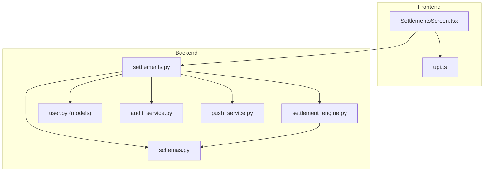
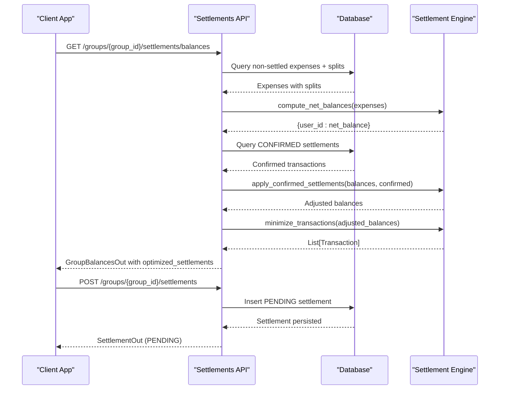
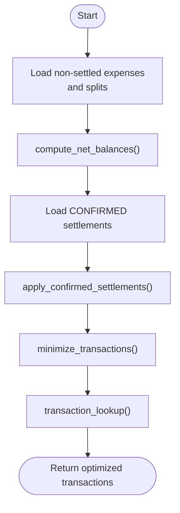
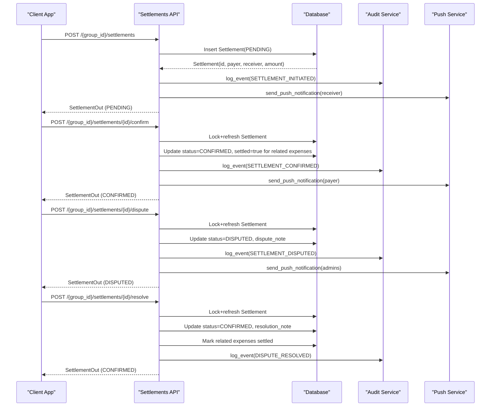
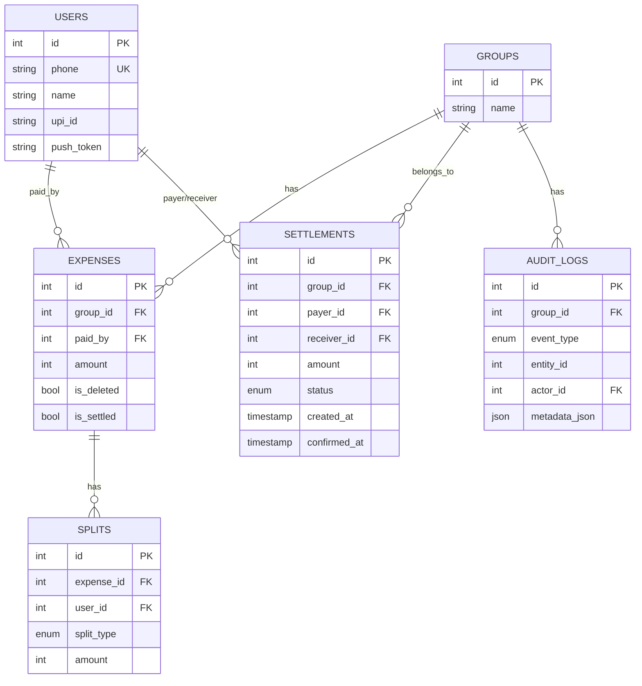
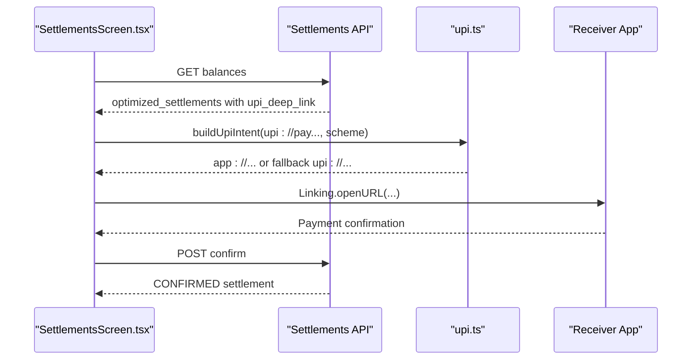
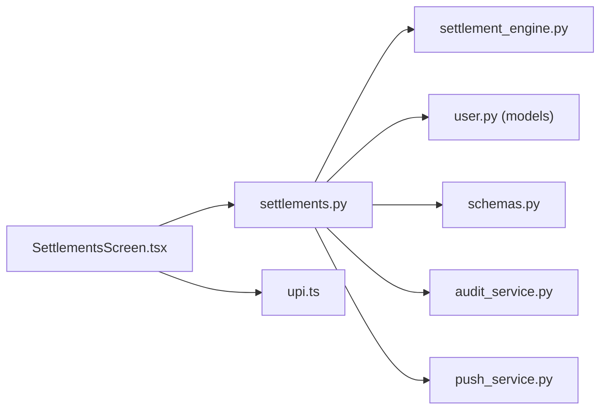

# Settlement Optimization

<cite>
**Referenced Files in This Document**
- [settlement_engine.py](file://backend/app/services/settlement_engine.py)
- [settlements.py](file://backend/app/api/v1/endpoints/settlements.py)
- [user.py](file://backend/app/models/user.py)
- [schemas.py](file://backend/app/schemas/schemas.py)
- [audit_service.py](file://backend/app/services/audit_service.py)
- [push_service.py](file://backend/app/services/push_service.py)
- [upi.ts](file://frontend/src/utils/upi.ts)
- [SettlementsScreen.tsx](file://frontend/src/screens/SettlementsScreen.tsx)
- [test_settlement_engine.py](file://backend/tests/test_settlement_engine.py)
</cite>

## Table of Contents
1. [Introduction](#introduction)
2. [Project Structure](#project-structure)
3. [Core Components](#core-components)
4. [Architecture Overview](#architecture-overview)
5. [Detailed Component Analysis](#detailed-component-analysis)
6. [Dependency Analysis](#dependency-analysis)
7. [Performance Considerations](#performance-considerations)
8. [Troubleshooting Guide](#troubleshooting-guide)
9. [Conclusion](#conclusion)
10. [Appendices](#appendices)

## Introduction
This document describes the SplitSure settlement optimization engine that minimizes the number of transactions required to settle group debts. It explains the greedy algorithm used to compute optimal settlement transactions from raw expense data, the mathematical foundations of debt aggregation and balance calculation, and the end-to-end settlement lifecycle from initiation to confirmation and dispute handling. It also covers integration with UPI deep links, settlement history tracking, partial settlement capabilities, and error recovery mechanisms.

## Project Structure
The settlement system spans backend services, API endpoints, data models, schemas, and frontend screens:
- Backend services implement the settlement engine and orchestrate settlement lifecycle events.
- API endpoints expose group-specific settlement operations and balance computation.
- Data models define persistence for expenses, splits, and settlements.
- Schemas define request/response contracts and validation.
- Frontend screens render optimized settlement instructions and enable UPI-based transfers.

**Diagram sources**
- [settlements.py:1-501](file://backend/app/api/v1/endpoints/settlements.py#L1-L501)
- [settlement_engine.py:1-106](file://backend/app/services/settlement_engine.py#L1-L106)
- [user.py:164-182](file://backend/app/models/user.py#L164-L182)
- [schemas.py:344-394](file://backend/app/schemas/schemas.py#L344-L394)
- [audit_service.py:1-32](file://backend/app/services/audit_service.py#L1-L32)
- [push_service.py:1-73](file://backend/app/services/push_service.py#L1-L73)
- [SettlementsScreen.tsx:1-589](file://frontend/src/screens/SettlementsScreen.tsx#L1-L589)
- [upi.ts:1-13](file://frontend/src/utils/upi.ts#L1-L13)

**Section sources**
- [settlements.py:1-501](file://backend/app/api/v1/endpoints/settlements.py#L1-L501)
- [settlement_engine.py:1-106](file://backend/app/services/settlement_engine.py#L1-L106)
- [user.py:164-182](file://backend/app/models/user.py#L164-L182)
- [schemas.py:344-394](file://backend/app/schemas/schemas.py#L344-L394)
- [SettlementsScreen.tsx:1-589](file://frontend/src/screens/SettlementsScreen.tsx#L1-L589)
- [upi.ts:1-13](file://frontend/src/utils/upi.ts#L1-L13)

## Core Components
- Settlement engine: Computes net balances and greedily minimizes transactions.
- API endpoints: Expose balance queries, settlement initiation, confirmation, disputes, and resolution.
- Data models: Persist expenses, splits, and settlements with statuses and audit trails.
- Schemas: Define typed requests/responses and validation for settlement operations.
- Notifications: Push notifications for settlement events.
- Frontend: Renders optimized instructions and supports UPI deep link redirection.

Key responsibilities:
- Debt aggregation: Summarize who paid and how much each person owes or is owed.
- Balance calculation: Positive balances indicate creditors; negative balances indicate debtors.
- Transaction suggestion generation: Greedy pairing of largest debtor and creditor balances.
- Settlement lifecycle: Initiation, confirmation, dispute, and resolution with audit logs.
- UPI integration: Deep link generation and app switching for payment.

**Section sources**
- [settlement_engine.py:23-97](file://backend/app/services/settlement_engine.py#L23-L97)
- [settlements.py:129-308](file://backend/app/api/v1/endpoints/settlements.py#L129-L308)
- [user.py:164-182](file://backend/app/models/user.py#L164-L182)
- [schemas.py:344-394](file://backend/app/schemas/schemas.py#L344-L394)
- [audit_service.py:6-31](file://backend/app/services/audit_service.py#L6-L31)
- [push_service.py:16-45](file://backend/app/services/push_service.py#L16-L45)

## Architecture Overview
The settlement optimization pipeline:
1. Load non-settled, non-deleted expenses for a group.
2. Compute net balances per user.
3. Apply previously confirmed settlements to adjust outstanding balances.
4. Greedily minimize transactions to zero out balances.
5. Generate settlement instructions with optional UPI deep links.
6. Store settlement requests and update statuses upon confirmation/dispute.

**Diagram sources**
- [settlements.py:129-235](file://backend/app/api/v1/endpoints/settlements.py#L129-L235)
- [settlements.py:238-308](file://backend/app/api/v1/endpoints/settlements.py#L238-L308)
- [settlement_engine.py:23-97](file://backend/app/services/settlement_engine.py#L23-L97)

## Detailed Component Analysis

### Greedy Settlement Engine
The engine computes net balances and greedily minimizes transactions:
- Net balance calculation aggregates total paid and total owed per user.
- Adjusted balances exclude amounts already settled.
- Greedy algorithm sorts creditors and debtors and matches largest obligations first.
- Transaction lookup maps payer/receiver pairs to amounts for quick verification.

**Diagram sources**
- [settlement_engine.py:23-97](file://backend/app/services/settlement_engine.py#L23-L97)

**Section sources**
- [settlement_engine.py:23-97](file://backend/app/services/settlement_engine.py#L23-L97)
- [test_settlement_engine.py:10-35](file://backend/tests/test_settlement_engine.py#L10-L35)

### Settlement Lifecycle API
Endpoints implement the full lifecycle:
- GET balances: Builds per-user balances, applies confirmed settlements, and returns optimized instructions with optional UPI deep links.
- POST initiate: Creates a PENDING settlement after validating membership, receiver, and exact expected amount.
- POST confirm: Marks a settlement as CONFIRMED, updates related expenses as settled, and notifies parties.
- POST dispute: Marks a PENDING settlement as DISPUTED with a note and notifies admins.
- POST resolve: Admin resolves a DISPUTED settlement back to CONFIRMED and marks related expenses settled.
- GET list: Lists all settlements for a group ordered by creation time.

**Diagram sources**
- [settlements.py:238-308](file://backend/app/api/v1/endpoints/settlements.py#L238-L308)
- [settlements.py:311-371](file://backend/app/api/v1/endpoints/settlements.py#L311-L371)
- [settlements.py:374-433](file://backend/app/api/v1/endpoints/settlements.py#L374-L433)
- [settlements.py:436-483](file://backend/app/api/v1/endpoints/settlements.py#L436-L483)
- [audit_service.py:6-31](file://backend/app/services/audit_service.py#L6-L31)
- [push_service.py:16-45](file://backend/app/services/push_service.py#L16-L45)

**Section sources**
- [settlements.py:129-235](file://backend/app/api/v1/endpoints/settlements.py#L129-L235)
- [settlements.py:238-308](file://backend/app/api/v1/endpoints/settlements.py#L238-L308)
- [settlements.py:311-371](file://backend/app/api/v1/endpoints/settlements.py#L311-L371)
- [settlements.py:374-433](file://backend/app/api/v1/endpoints/settlements.py#L374-L433)
- [settlements.py:436-483](file://backend/app/api/v1/endpoints/settlements.py#L436-L483)

### Data Models and Schemas
Models define persistence for expenses, splits, and settlements with statuses and audit logs. Schemas define typed requests/responses and validation for settlement operations.

**Diagram sources**
- [user.py:124-182](file://backend/app/models/user.py#L124-L182)
- [schemas.py:344-394](file://backend/app/schemas/schemas.py#L344-L394)

**Section sources**
- [user.py:124-182](file://backend/app/models/user.py#L124-L182)
- [schemas.py:344-394](file://backend/app/schemas/schemas.py#L344-L394)

### Frontend Integration and UPI Deep Links
The frontend renders optimized settlement instructions and allows initiating confirmations. It supports UPI deep links and app switching:
- Renders pending optimized transfers and net settlement summary.
- Generates UPI deep links for receivers’ UPI IDs and opens compatible apps.
- Supports dispute and resolution modals for admins.

**Diagram sources**
- [SettlementsScreen.tsx:48-264](file://frontend/src/screens/SettlementsScreen.tsx#L48-L264)
- [upi.ts:7-12](file://frontend/src/utils/upi.ts#L7-L12)
- [settlements.py:196-213](file://backend/app/api/v1/endpoints/settlements.py#L196-L213)

**Section sources**
- [SettlementsScreen.tsx:48-264](file://frontend/src/screens/SettlementsScreen.tsx#L48-L264)
- [upi.ts:1-13](file://frontend/src/utils/upi.ts#L1-L13)
- [settlements.py:196-213](file://backend/app/api/v1/endpoints/settlements.py#L196-L213)

## Dependency Analysis
- API depends on the settlement engine for balance computation and transaction suggestions.
- API persists and retrieves models for expenses, splits, and settlements.
- API integrates with audit and push services for immutable logs and notifications.
- Frontend consumes API endpoints and uses UPI utilities for app switching.

**Diagram sources**
- [settlements.py:17-24](file://backend/app/api/v1/endpoints/settlements.py#L17-L24)
- [settlement_engine.py:1-106](file://backend/app/services/settlement_engine.py#L1-L106)
- [user.py:164-182](file://backend/app/models/user.py#L164-L182)
- [schemas.py:344-394](file://backend/app/schemas/schemas.py#L344-L394)
- [audit_service.py:1-32](file://backend/app/services/audit_service.py#L1-L32)
- [push_service.py:1-73](file://backend/app/services/push_service.py#L1-L73)
- [SettlementsScreen.tsx:1-589](file://frontend/src/screens/SettlementsScreen.tsx#L1-L589)
- [upi.ts:1-13](file://frontend/src/utils/upi.ts#L1-L13)

**Section sources**
- [settlements.py:17-24](file://backend/app/api/v1/endpoints/settlements.py#L17-L24)
- [settlement_engine.py:1-106](file://backend/app/services/settlement_engine.py#L1-L106)
- [user.py:164-182](file://backend/app/models/user.py#L164-L182)
- [schemas.py:344-394](file://backend/app/schemas/schemas.py#L344-L394)
- [audit_service.py:1-32](file://backend/app/services/audit_service.py#L1-L32)
- [push_service.py:1-73](file://backend/app/services/push_service.py#L1-L73)
- [SettlementsScreen.tsx:1-589](file://frontend/src/screens/SettlementsScreen.tsx#L1-L589)
- [upi.ts:1-13](file://frontend/src/utils/upi.ts#L1-L13)

## Performance Considerations
- Time complexity: The greedy algorithm runs in O(n log n) due to sorting creditors and debtors.
- Memory: Balances and transaction lists scale linearly with the number of users and minimal suggested transactions.
- Database queries: Efficiently fetch non-settled expenses with eager-loaded splits and confirmed settlements.
- Integer arithmetic: Amounts are stored in paise to avoid floating-point precision issues.

[No sources needed since this section provides general guidance]

## Troubleshooting Guide
Common issues and resolutions:
- Settlement amount mismatch: The API validates that the requested amount equals the expected outstanding balance; otherwise, it returns an error.
- Pending settlement conflict: Only one PENDING settlement per payer-receiver pair is allowed.
- Unauthorized actions: Only group members can initiate; only receivers can confirm; only admins can resolve disputes.
- Notification failures: Push notifications are fire-and-forget and do not block the main flow.
- Expense marking: When a settlement is confirmed or resolved, related expenses are marked as settled.

**Section sources**
- [settlements.py:253-258](file://backend/app/api/v1/endpoints/settlements.py#L253-L258)
- [settlements.py:260-268](file://backend/app/api/v1/endpoints/settlements.py#L260-L268)
- [settlements.py:334-338](file://backend/app/api/v1/endpoints/settlements.py#L334-L338)
- [settlements.py:398-402](file://backend/app/api/v1/endpoints/settlements.py#L398-L402)
- [settlements.py:445-446](file://backend/app/api/v1/endpoints/settlements.py#L445-L446)
- [push_service.py:26-44](file://backend/app/services/push_service.py#L26-L44)

## Conclusion
The SplitSure settlement optimization engine provides a robust, auditable, and user-friendly mechanism to minimize transaction counts and streamline group debt settlement. By combining precise balance computation, a greedy transaction minimizer, and strong lifecycle controls with UPI deep links, it delivers a practical solution for real-world group spending scenarios.

[No sources needed since this section summarizes without analyzing specific files]

## Appendices

### Mathematical Foundations
- Debt aggregation: For each expense, increment the payer’s balance by the total paid and decrement each participant’s balance by their share.
- Balance calculation: Net balance per user is the difference between total paid and total owed; positive indicates credit, negative indicates debt.
- Transaction suggestion generation: Sort creditors and debtors by absolute amounts and iteratively transfer the minimum of each pair until all balances are cleared.

**Section sources**
- [settlement_engine.py:23-79](file://backend/app/services/settlement_engine.py#L23-L79)

### Practical Scenarios
- Scenario A: Three users with mixed payments and equal splits.
  - Use the balance endpoint to compute optimized instructions and initiate confirmations.
- Scenario B: Partial settlement capability.
  - The engine identifies minimal transactions; the API marks related expenses as settled upon confirmation.
- Scenario C: Dispute handling.
  - Receivers can dispute pending settlements; admins can resolve and confirm with audit logs.

**Section sources**
- [settlements.py:84-126](file://backend/app/api/v1/endpoints/settlements.py#L84-L126)
- [settlements.py:374-433](file://backend/app/api/v1/endpoints/settlements.py#L374-L433)
- [settlements.py:436-483](file://backend/app/api/v1/endpoints/settlements.py#L436-L483)

### Edge Cases and Error Recovery
- Self-settlement prevention: Initiating a settlement with yourself is rejected.
- Membership checks: Only group members can participate in settlements.
- Pending settlement deduplication: Prevents multiple concurrent PENDING settlements between the same parties.
- Row-level locking: Confirm/dispute/resolve operations lock rows to prevent race conditions.
- Non-existent entities: Returns appropriate HTTP errors for missing settlements or users.

**Section sources**
- [settlements.py:248-251](file://backend/app/api/v1/endpoints/settlements.py#L248-L251)
- [settlements.py:320-326](file://backend/app/api/v1/endpoints/settlements.py#L320-L326)
- [settlements.py:384-390](file://backend/app/api/v1/endpoints/settlements.py#L384-L390)
- [settlements.py:448-454](file://backend/app/api/v1/endpoints/settlements.py#L448-L454)