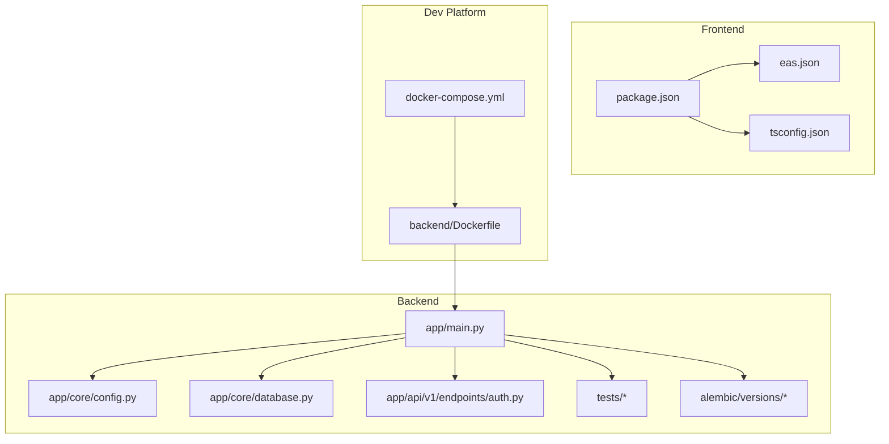
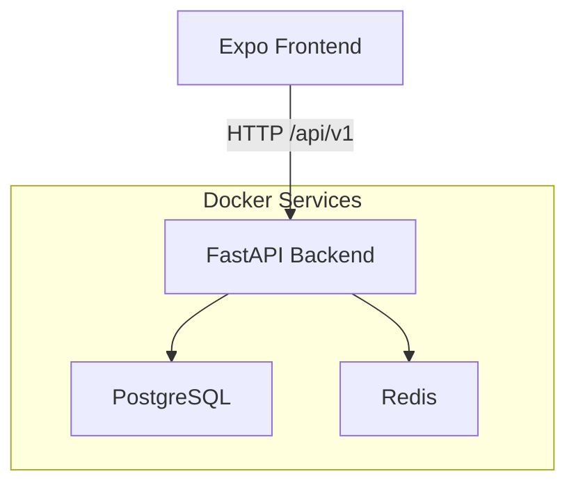
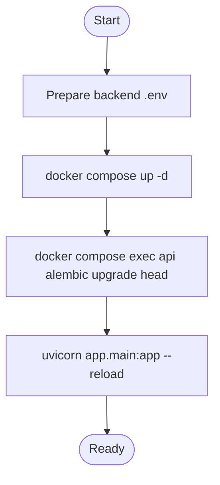
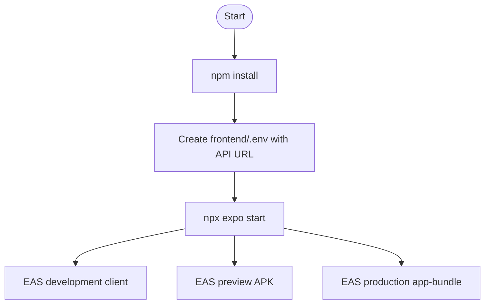
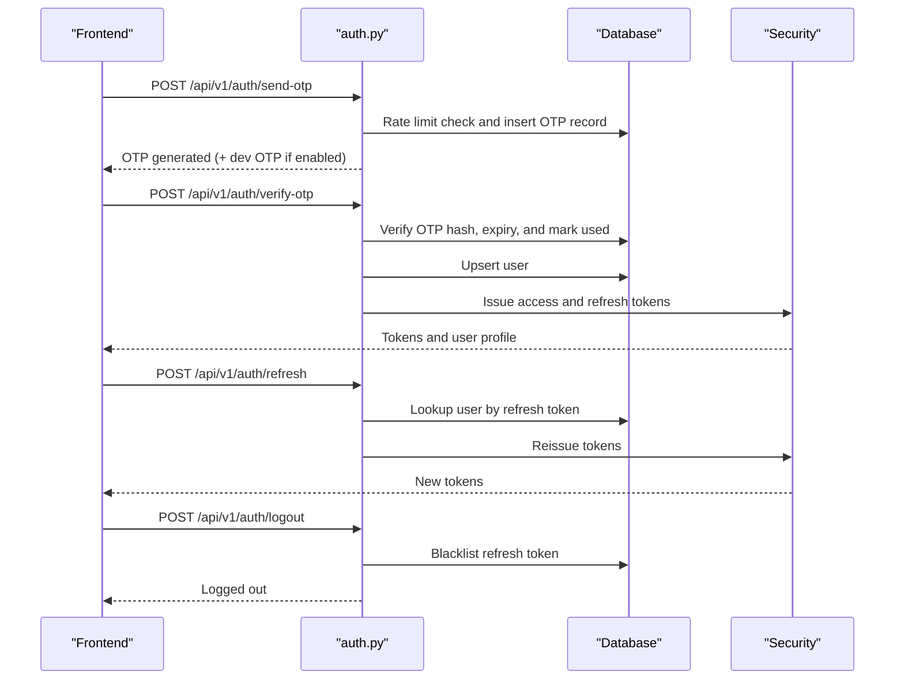
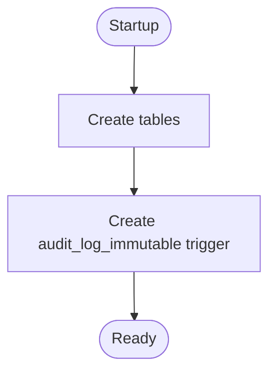
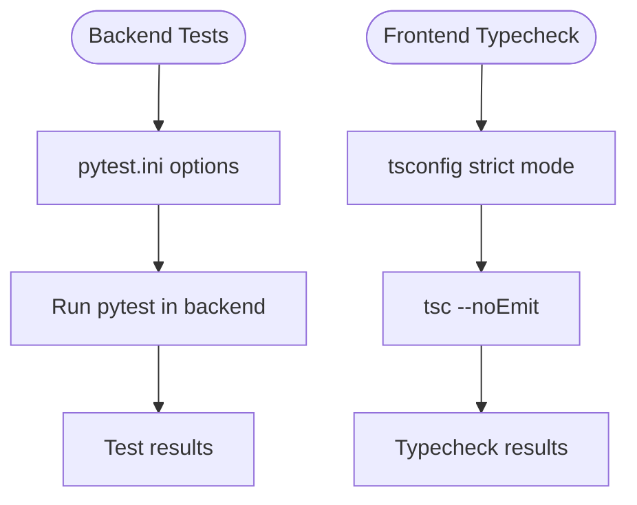
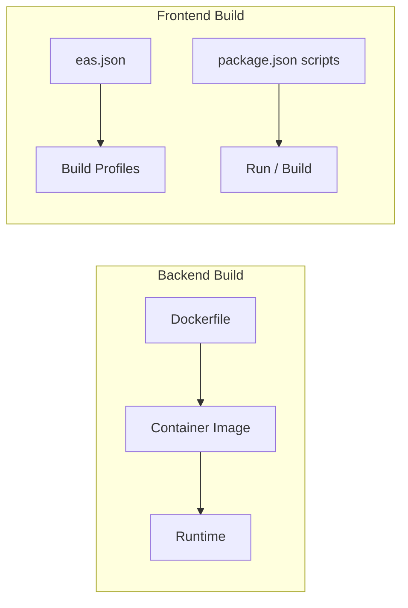
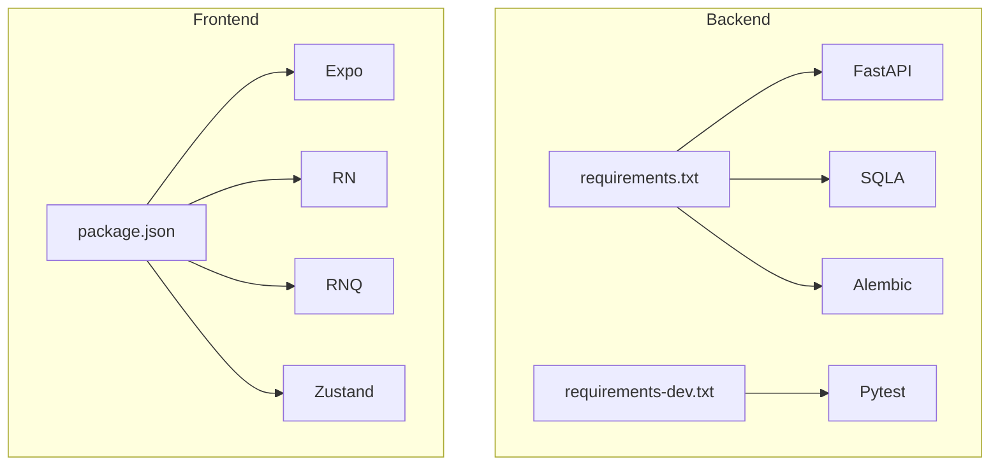

# Development Workflow

<cite>
**Referenced Files in This Document**
- [README.md](file://README.md)
- [docker-compose.yml](file://docker-compose.yml)
- [backend/Dockerfile](file://backend/Dockerfile)
- [backend/requirements.txt](file://backend/requirements.txt)
- [backend/requirements-dev.txt](file://backend/requirements-dev.txt)
- [backend/pytest.ini](file://backend/pytest.ini)
- [backend/app/main.py](file://backend/app/main.py)
- [backend/app/core/config.py](file://backend/app/core/config.py)
- [backend/app/core/database.py](file://backend/app/core/database.py)
- [backend/app/api/v1/endpoints/auth.py](file://backend/app/api/v1/endpoints/auth.py)
- [backend/tests/test_expense_service.py](file://backend/tests/test_expense_service.py)
- [backend/tests/test_settlement_engine.py](file://backend/tests/test_settlement_engine.py)
- [backend/alembic/versions/001_initial.py](file://backend/alembic/versions/001_initial.py)
- [frontend/package.json](file://frontend/package.json)
- [frontend/eas.json](file://frontend/eas.json)
- [frontend/tsconfig.json](file://frontend/tsconfig.json)
</cite>

## Table of Contents
1. [Introduction](#introduction)
2. [Project Structure](#project-structure)
3. [Core Components](#core-components)
4. [Architecture Overview](#architecture-overview)
5. [Detailed Component Analysis](#detailed-component-analysis)
6. [Dependency Analysis](#dependency-analysis)
7. [Performance Considerations](#performance-considerations)
8. [Troubleshooting Guide](#troubleshooting-guide)
9. [Conclusion](#conclusion)
10. [Appendices](#appendices)

## Introduction
This document describes the complete development workflow for SplitSure, covering local setup, environment configuration, dependency management, database initialization, code organization, testing, build and deployment, version control practices, debugging, and continuous integration. It is designed to guide contributors through building, testing, and iterating on both backend and frontend components efficiently.

## Project Structure
SplitSure is organized into two primary areas:
- Backend: FastAPI application with asynchronous SQLAlchemy ORM, Alembic migrations, and Pydantic settings.
- Frontend: Expo Router-based React Native application with TypeScript, React Query, and Zustand for state.

**Diagram sources**
- [docker-compose.yml:1-82](file://docker-compose.yml#L1-L82)
- [backend/Dockerfile:1-15](file://backend/Dockerfile#L1-L15)
- [backend/app/main.py:1-96](file://backend/app/main.py#L1-L96)
- [backend/app/core/config.py:1-71](file://backend/app/core/config.py#L1-L71)
- [backend/app/core/database.py:1-29](file://backend/app/core/database.py#L1-L29)
- [backend/app/api/v1/endpoints/auth.py:1-147](file://backend/app/api/v1/endpoints/auth.py#L1-L147)
- [backend/tests/test_expense_service.py:1-65](file://backend/tests/test_expense_service.py#L1-L65)
- [backend/tests/test_settlement_engine.py:1-35](file://backend/tests/test_settlement_engine.py#L1-L35)
- [backend/alembic/versions/001_initial.py:1-185](file://backend/alembic/versions/001_initial.py#L1-L185)
- [frontend/package.json:1-62](file://frontend/package.json#L1-L62)
- [frontend/eas.json:1-25](file://frontend/eas.json#L1-L25)
- [frontend/tsconfig.json:1-9](file://frontend/tsconfig.json#L1-L9)

**Section sources**
- [README.md:1-162](file://README.md#L1-L162)
- [docker-compose.yml:1-82](file://docker-compose.yml#L1-L82)
- [backend/Dockerfile:1-15](file://backend/Dockerfile#L1-L15)
- [frontend/package.json:1-62](file://frontend/package.json#L1-L62)

## Core Components
- Backend runtime and routing: FastAPI application with startup hooks, security headers, CORS, static file serving for uploads, and health endpoint.
- Configuration: Centralized settings via Pydantic Settings with validators for security and operational limits.
- Database: Asynchronous SQLAlchemy engine and session factory; startup creates tables and an immutable audit-log trigger.
- Authentication: OTP endpoints with rate limiting, hashing, and token issuance; supports dev-mode OTP bypass.
- Testing: Pytest-based unit tests for split logic and settlement computations; configured via pytest.ini.
- Migrations: Alembic initial migration defines users, groups, expenses, splits, settlements, audit logs, and immutable trigger.
- Frontend: Expo Router app with scripts for development and builds; TypeScript strictness enabled.

**Section sources**
- [backend/app/main.py:1-96](file://backend/app/main.py#L1-L96)
- [backend/app/core/config.py:1-71](file://backend/app/core/config.py#L1-L71)
- [backend/app/core/database.py:1-29](file://backend/app/core/database.py#L1-L29)
- [backend/app/api/v1/endpoints/auth.py:1-147](file://backend/app/api/v1/endpoints/auth.py#L1-L147)
- [backend/pytest.ini:1-4](file://backend/pytest.ini#L1-L4)
- [backend/alembic/versions/001_initial.py:1-185](file://backend/alembic/versions/001_initial.py#L1-L185)
- [frontend/package.json:1-62](file://frontend/package.json#L1-L62)
- [frontend/tsconfig.json:1-9](file://frontend/tsconfig.json#L1-L9)

## Architecture Overview
The development stack runs locally via Docker Compose, hosting PostgreSQL, Redis, and the FastAPI backend. The frontend connects to the backend using environment variables and can be built and previewed with EAS.

**Diagram sources**
- [docker-compose.yml:1-82](file://docker-compose.yml#L1-L82)
- [backend/app/main.py:1-96](file://backend/app/main.py#L1-L96)

## Detailed Component Analysis

### Backend Development Setup
- Environment configuration:
  - Copy the backend environment template to a local .env file and adjust variables as needed.
  - Key variables include database URL, secret key, local storage flags, base URL, AWS S3 credentials, dev OTP toggle, allowed origins, and OTP limits.
- Dependencies:
  - Install production dependencies from requirements.txt.
  - Install developer dependencies from requirements-dev.txt for testing.
- Database initialization:
  - Start services with Docker Compose.
  - Apply Alembic migrations to the database.
- Running the API:
  - The backend exposes port 8000 and serves static uploads when local storage is enabled.
  - Health endpoint indicates storage mode and OTP mode.

**Diagram sources**
- [README.md:24-45](file://README.md#L24-L45)
- [docker-compose.yml:1-82](file://docker-compose.yml#L1-L82)
- [backend/Dockerfile:1-15](file://backend/Dockerfile#L1-L15)

**Section sources**
- [README.md:24-45](file://README.md#L24-L45)
- [backend/requirements.txt:1-19](file://backend/requirements.txt#L1-L19)
- [backend/requirements-dev.txt:1-3](file://backend/requirements-dev.txt#L1-L3)
- [backend/Dockerfile:1-15](file://backend/Dockerfile#L1-L15)
- [docker-compose.yml:1-82](file://docker-compose.yml#L1-L82)

### Frontend Development Setup
- Install dependencies using npm.
- Create frontend/.env with EXPO_PUBLIC_API_URL pointing to the local backend.
- Start the development server with the Expo CLI.
- Build variants:
  - Development client via EAS.
  - Preview APK for Android.
  - Production app-bundle for Android.

**Diagram sources**
- [README.md:46-63](file://README.md#L46-L63)
- [frontend/package.json:1-62](file://frontend/package.json#L1-L62)
- [frontend/eas.json:1-25](file://frontend/eas.json#L1-L25)

**Section sources**
- [README.md:46-63](file://README.md#L46-L63)
- [frontend/package.json:1-62](file://frontend/package.json#L1-L62)
- [frontend/eas.json:1-25](file://frontend/eas.json#L1-L25)
- [frontend/tsconfig.json:1-9](file://frontend/tsconfig.json#L1-L9)

### Authentication Flow (OTP)
The authentication module handles OTP generation, verification, token refresh, and logout with token blacklisting.

**Diagram sources**
- [backend/app/api/v1/endpoints/auth.py:1-147](file://backend/app/api/v1/endpoints/auth.py#L1-L147)
- [backend/app/core/security.py:1-200](file://backend/app/core/security.py#L1-L200) [Note: File path shown for completeness; actual implementation referenced inline.]

**Section sources**
- [backend/app/api/v1/endpoints/auth.py:1-147](file://backend/app/api/v1/endpoints/auth.py#L1-L147)

### Database Initialization and Schema
- Startup creates tables and registers an immutable audit-log trigger.
- Alembic migration script defines the initial schema including users, groups, expenses, splits, settlements, audit logs, and invite links.

**Diagram sources**
- [backend/app/main.py:68-86](file://backend/app/main.py#L68-L86)
- [backend/alembic/versions/001_initial.py:1-185](file://backend/alembic/versions/001_initial.py#L1-L185)

**Section sources**
- [backend/app/main.py:68-86](file://backend/app/main.py#L68-L86)
- [backend/alembic/versions/001_initial.py:1-185](file://backend/alembic/versions/001_initial.py#L1-L185)

### Testing Strategy
- Backend:
  - Unit tests for split calculation logic and settlement computations.
  - Tests are executed via pytest with configured options.
- Frontend:
  - Type checking via TypeScript strict mode.

**Diagram sources**
- [backend/pytest.ini:1-4](file://backend/pytest.ini#L1-L4)
- [backend/tests/test_expense_service.py:1-65](file://backend/tests/test_expense_service.py#L1-L65)
- [backend/tests/test_settlement_engine.py:1-35](file://backend/tests/test_settlement_engine.py#L1-L35)
- [frontend/tsconfig.json:1-9](file://frontend/tsconfig.json#L1-L9)

**Section sources**
- [README.md:92-113](file://README.md#L92-L113)
- [backend/pytest.ini:1-4](file://backend/pytest.ini#L1-L4)
- [backend/tests/test_expense_service.py:1-65](file://backend/tests/test_expense_service.py#L1-L65)
- [backend/tests/test_settlement_engine.py:1-35](file://backend/tests/test_settlement_engine.py#L1-L35)
- [frontend/tsconfig.json:1-9](file://frontend/tsconfig.json#L1-L9)

### Build and Deployment
- Backend:
  - Docker image built from backend/Dockerfile.
  - Exposes port 8000 and runs uvicorn with reload during development.
- Frontend:
  - EAS configurations define development, preview, and production build profiles.
  - Scripts in package.json support running and building for Android, iOS, and web.

**Diagram sources**
- [backend/Dockerfile:1-15](file://backend/Dockerfile#L1-L15)
- [frontend/eas.json:1-25](file://frontend/eas.json#L1-L25)
- [frontend/package.json:1-62](file://frontend/package.json#L1-L62)

**Section sources**
- [backend/Dockerfile:1-15](file://backend/Dockerfile#L1-L15)
- [frontend/eas.json:1-25](file://frontend/eas.json#L1-L25)
- [frontend/package.json:1-62](file://frontend/package.json#L1-L62)

### Version Control Practices and Contribution Guidelines
- Branching and collaboration:
  - Use feature branches for new work and open pull requests for review.
  - Keep commits small and focused with clear messages.
- Linting and quality gates:
  - Run frontend typecheck and backend tests before submitting changes.
- Environment hygiene:
  - Ensure backend .env and frontend/.env are not committed.
  - Follow production hardening guidance (strong secret keys, disable dev OTP, configure S3, enforce HTTPS).

**Section sources**
- [README.md:144-153](file://README.md#L144-L153)

### Debugging Techniques and Logging
- Backend:
  - Startup warnings for dev OTP and weak secret keys.
  - Structured logging via standard library; use log level appropriate for the environment.
  - Health endpoint provides quick status of storage mode and OTP mode.
- Frontend:
  - Enable Expo DevTools and React Devtools for inspection.
  - Use network inspection to monitor API calls and responses.

**Section sources**
- [backend/app/main.py:59-95](file://backend/app/main.py#L59-L95)
- [README.md:65-70](file://README.md#L65-L70)

### Feature Development Lifecycle
- Plan: Define user stories and acceptance criteria aligned with existing API routes and schemas.
- Develop:
  - Backend: Add endpoints, services, and models; write unit tests; keep migrations minimal and reversible.
  - Frontend: Implement screens and navigation; connect to APIs; maintain type safety.
- Test:
  - Run backend pytest suite and frontend typecheck.
  - Validate integration manually using Expo and backend endpoints.
- Deploy:
  - Backend: Push image to registry; run migrations; scale services.
  - Frontend: Submit builds via EAS or platform stores; publish previews internally.

[No sources needed since this section provides general guidance]

### Continuous Integration and Automated Testing
- Recommended CI tasks:
  - Frontend: TypeScript typecheck.
  - Backend: pytest execution.
- Secrets and environment:
  - Inject environment variables securely in CI.
  - Use ephemeral databases for integration tests if needed.

**Section sources**
- [README.md:152-153](file://README.md#L152-L153)

## Dependency Analysis
- Backend dependencies include FastAPI, Uvicorn, SQLAlchemy, Alembic, Pydantic, JWT, multipart parsing, and optional S3 support.
- Frontend dependencies include Expo, React Navigation, React Query, Zod, and Zustand.

**Diagram sources**
- [backend/requirements.txt:1-19](file://backend/requirements.txt#L1-L19)
- [backend/requirements-dev.txt:1-3](file://backend/requirements-dev.txt#L1-L3)
- [frontend/package.json:1-62](file://frontend/package.json#L1-L62)

**Section sources**
- [backend/requirements.txt:1-19](file://backend/requirements.txt#L1-L19)
- [backend/requirements-dev.txt:1-3](file://backend/requirements-dev.txt#L1-L3)
- [frontend/package.json:1-62](file://frontend/package.json#L1-L62)

## Performance Considerations
- Use asynchronous database sessions and avoid blocking operations in request handlers.
- Keep migrations minimal and reversible; batch schema changes thoughtfully.
- Prefer efficient queries and limit payload sizes for uploads and reports.
- Monitor Redis memory usage for token blacklisting and caching.

[No sources needed since this section provides general guidance]

## Troubleshooting Guide
- Backend:
  - If migrations fail, ensure the database service is healthy and reachable.
  - If uploads are inaccessible, verify local storage flag and mounted volume.
  - If OTP does not arrive, confirm dev OTP mode or provider credentials.
- Frontend:
  - If API calls fail, verify EXPO_PUBLIC_API_URL and CORS settings.
  - If type errors occur, resolve strict-mode violations before committing.

**Section sources**
- [docker-compose.yml:1-82](file://docker-compose.yml#L1-L82)
- [backend/app/main.py:48-56](file://backend/app/main.py#L48-L56)
- [backend/app/api/v1/endpoints/auth.py:70-79](file://backend/app/api/v1/endpoints/auth.py#L70-L79)
- [README.md:65-70](file://README.md#L65-L70)

## Conclusion
This workflow provides a repeatable path to develop, test, and iterate on SplitSure. By following the setup steps, adhering to configuration and testing practices, and leveraging the provided scripts and Docker Compose, contributors can move quickly from idea to working feature across both backend and frontend.

## Appendices
- Quick commands:
  - Backend: copy env, start services, run migrations, start API.
  - Frontend: install deps, set API URL, start dev server, build variants.
- Environment templates:
  - Backend .env example and frontend/.env guidance are provided in the repository.

**Section sources**
- [README.md:24-63](file://README.md#L24-L63)