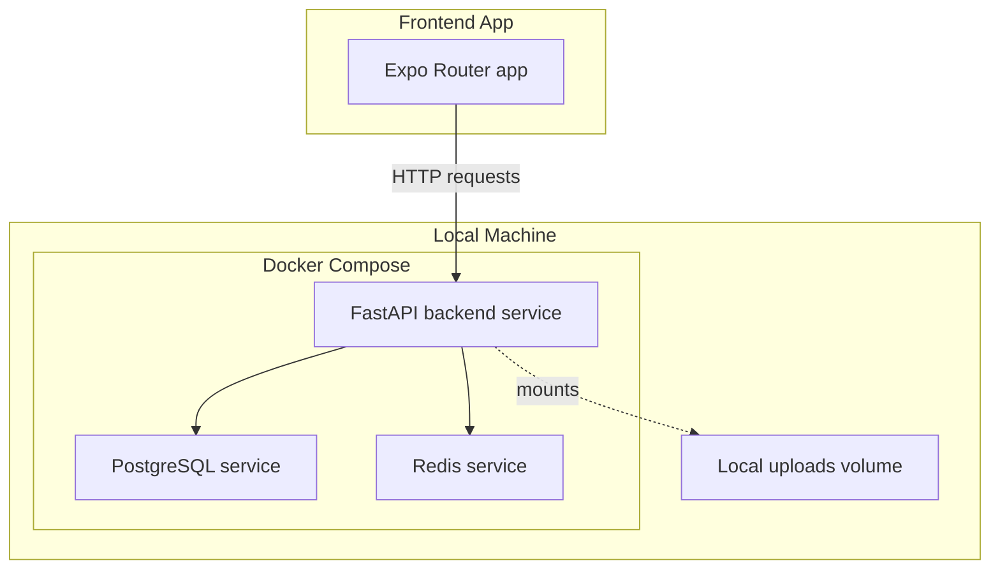
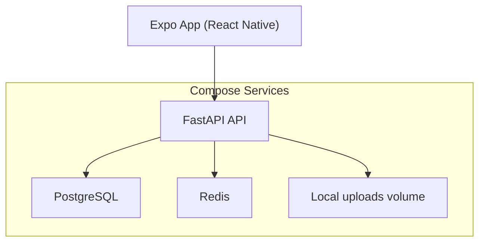
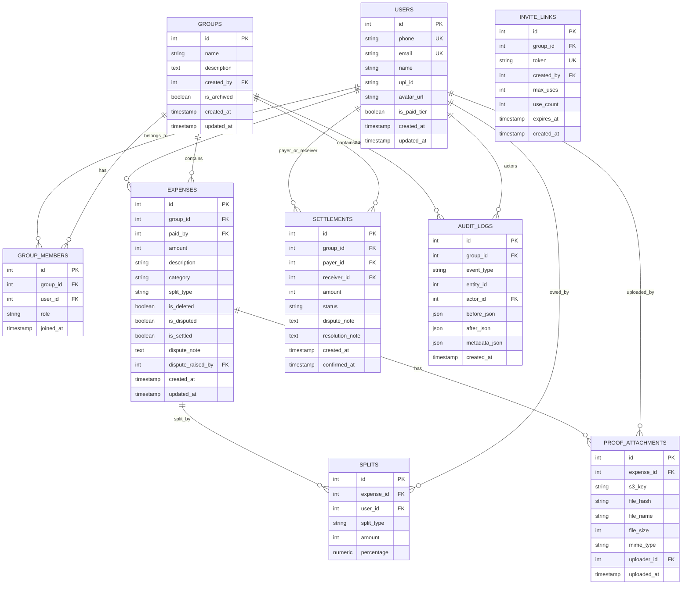
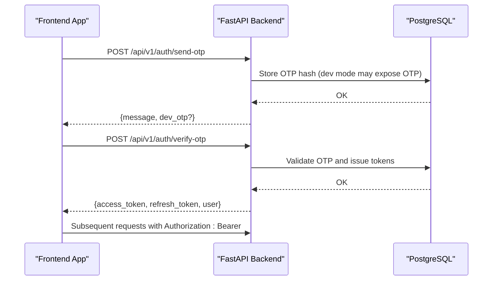
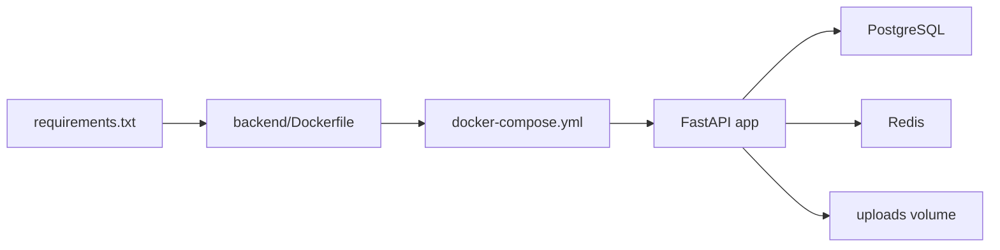

# Getting Started

<cite>
**Referenced Files in This Document**
- [README.md](file://README.md)
- [docker-compose.yml](file://docker-compose.yml)
- [backend/Dockerfile](file://backend/Dockerfile)
- [backend/requirements.txt](file://backend/requirements.txt)
- [backend/app/main.py](file://backend/app/main.py)
- [backend/app/core/config.py](file://backend/app/core/config.py)
- [backend/alembic/versions/001_initial.py](file://backend/alembic/versions/001_initial.py)
- [frontend/package.json](file://frontend/package.json)
- [frontend/src/services/api.ts](file://frontend/src/services/api.ts)
- [frontend/src/store/authStore.ts](file://frontend/src/store/authStore.ts)
- [frontend/app/_layout.tsx](file://frontend/app/_layout.tsx)
- [frontend/app.json](file://frontend/app.json)
- [frontend/tsconfig.json](file://frontend/tsconfig.json)
</cite>

## Table of Contents
1. [Introduction](#introduction)
2. [Project Structure](#project-structure)
3. [Core Components](#core-components)
4. [Architecture Overview](#architecture-overview)
5. [Detailed Component Analysis](#detailed-component-analysis)
6. [Dependency Analysis](#dependency-analysis)
7. [Performance Considerations](#performance-considerations)
8. [Troubleshooting Guide](#troubleshooting-guide)
9. [Conclusion](#conclusion)
10. [Appendices](#appendices)

## Introduction
This guide helps you set up and run the complete SplitSure application locally, covering prerequisites, backend and frontend installation, environment configuration, database initialization, and initial bootstrapping. It also includes quick start examples for creating a test user, forming a group, adding expenses, and triggering settlement suggestions, along with verification steps to ensure everything works.

## Project Structure
SplitSure consists of:
- Backend: FastAPI application with PostgreSQL and Redis, packaged with Docker Compose for local development.
- Frontend: Expo Router-based React Native app that communicates with the backend API.
- Supporting assets: Alembic migrations for database schema and Docker Compose orchestration.

**Diagram sources**
- [docker-compose.yml:1-82](file://docker-compose.yml#L1-L82)
- [backend/Dockerfile:1-15](file://backend/Dockerfile#L1-L15)
- [backend/app/main.py:1-96](file://backend/app/main.py#L1-L96)

**Section sources**
- [README.md:24-70](file://README.md#L24-L70)
- [docker-compose.yml:1-82](file://docker-compose.yml#L1-L82)

## Core Components
- Backend stack: FastAPI, SQLAlchemy, Alembic, PostgreSQL, Redis, Uvicorn.
- Frontend stack: Expo Router, React Native, React Query, Zustand, Axios.
- Development services: Docker Compose orchestrates Postgres, Redis, and the API server.

Key capabilities:
- OTP-based authentication with optional development OTP mode.
- Group management, expense recording, split logic, and settlement suggestions.
- Immutable audit logs enforced by a database trigger.
- Local file storage for proofs in development; S3-ready for production.

**Section sources**
- [README.md:1-23](file://README.md#L1-L23)
- [backend/app/main.py:1-96](file://backend/app/main.py#L1-L96)
- [backend/alembic/versions/001_initial.py:1-185](file://backend/alembic/versions/001_initial.py#L1-L185)
- [frontend/package.json:1-62](file://frontend/package.json#L1-L62)

## Architecture Overview
The local architecture uses Docker Compose to provision a database, cache, and backend API. The frontend app runs independently and connects to the backend via HTTP. The backend exposes health checks, OpenAPI docs, and the API routes under /api/v1.

**Diagram sources**
- [docker-compose.yml:1-82](file://docker-compose.yml#L1-L82)
- [backend/app/main.py:88-95](file://backend/app/main.py#L88-L95)

**Section sources**
- [README.md:40-45](file://README.md#L40-L45)
- [docker-compose.yml:28-77](file://docker-compose.yml#L28-L77)

## Detailed Component Analysis

### Backend Setup and Bootstrapping
- Prerequisites: Docker Desktop, Node.js 18+, Python 3.13+ recommended.
- Steps:
  1) Copy the backend environment template to .env and bring up services.
  2) Run database migrations to create tables and triggers.
  3) Verify health and endpoints.

Environment variables and defaults:
- DATABASE_URL, SECRET_KEY, ALLOWED_ORIGINS, USE_LOCAL_STORAGE, LOCAL_UPLOAD_DIR, LOCAL_BASE_URL, USE_DEV_OTP, AWS_* for S3, and Redis URL are configured in Docker Compose and/or .env.

Verification endpoints:
- App API base: http://localhost:8000/api/v1
- Health: http://localhost:8000/health
- Docs: http://localhost:8000/docs

**Section sources**
- [README.md:26-45](file://README.md#L26-L45)
- [docker-compose.yml:34-66](file://docker-compose.yml#L34-L66)
- [backend/app/core/config.py:6-71](file://backend/app/core/config.py#L6-L71)
- [backend/app/main.py:88-95](file://backend/app/main.py#L88-L95)

### Database Schema and Initialization
- Initial schema includes users, groups, members, expenses, splits, settlements, audit logs, proof attachments, and invite links.
- An immutable audit log trigger prevents modifications or deletions.
- Alembic migration creates tables and the trigger during bootstrap.

**Diagram sources**
- [backend/alembic/versions/001_initial.py:17-185](file://backend/alembic/versions/001_initial.py#L17-L185)

**Section sources**
- [backend/alembic/versions/001_initial.py:1-185](file://backend/alembic/versions/001_initial.py#L1-L185)

### Frontend Setup and Configuration
- Install dependencies using npm.
- Create frontend/.env with EXPO_PUBLIC_API_URL pointing to the backend.
- Start the development server with npx expo start.

Android emulator specifics:
- The frontend resolves localhost to 10.0.2.2 for network access to the host.

Type checking and testing:
- Typecheck with TypeScript compiler.
- Backend tests with pytest.

**Section sources**
- [README.md:46-70](file://README.md#L46-L70)
- [frontend/package.json:1-62](file://frontend/package.json#L1-L62)
- [frontend/src/services/api.ts:21-40](file://frontend/src/services/api.ts#L21-L40)
- [frontend/app.json:1-32](file://frontend/app.json#L1-L32)

### Authentication Flow (Development OTP)
The frontend authenticates via OTP. In development, OTPs can be returned in API responses for convenience.

**Diagram sources**
- [frontend/src/services/api.ts:143-169](file://frontend/src/services/api.ts#L143-L169)
- [frontend/src/store/authStore.ts:34-47](file://frontend/src/store/authStore.ts#L34-L47)
- [backend/app/main.py:88-95](file://backend/app/main.py#L88-L95)

**Section sources**
- [README.md:65-70](file://README.md#L65-L70)
- [frontend/src/services/api.ts:143-169](file://frontend/src/services/api.ts#L143-L169)
- [frontend/src/store/authStore.ts:29-80](file://frontend/src/store/authStore.ts#L29-L80)

### Quick Start Examples
Below are practical steps to validate your setup and perform basic tasks. Replace placeholders with your chosen phone number and group name.

- Verify backend health:
  - Endpoint: http://localhost:8000/health
  - Expected keys: status, version, storage, otp_mode

- Create a test user (OTP login):
  - Send OTP: POST /api/v1/auth/send-otp with phone
  - Verify OTP: POST /api/v1/auth/verify-otp with phone and OTP
  - On success, store tokens and fetch profile: GET /api/v1/users/me

- Form a group:
  - POST /api/v1/groups with { name, description? }
  - Retrieve group: GET /api/v1/groups/{id}

- Add members:
  - POST /api/v1/groups/{group_id}/members with { phone }

- Record an expense:
  - POST /api/v1/groups/{group_id}/expenses with amount, description, category, split_type, splits

- Trigger settlement suggestions:
  - GET /api/v1/groups/{group_id}/settlements/balances
  - POST /api/v1/groups/{group_id}/settlements with { receiver_id, amount }

- View audit logs:
  - GET /api/v1/groups/{group_id}/audit

- Access frontend:
  - Start Expo: npx expo start
  - Scan QR code in Expo Go or run on device/emulator
  - Ensure EXPO_PUBLIC_API_URL points to http://localhost:8000/api/v1

**Section sources**
- [README.md:40-63](file://README.md#L40-L63)
- [frontend/src/services/api.ts:186-271](file://frontend/src/services/api.ts#L186-L271)
- [frontend/src/store/authStore.ts:29-80](file://frontend/src/store/authStore.ts#L29-L80)

## Dependency Analysis
- Backend runtime dependencies are declared in requirements.txt.
- Dockerfile builds the backend image and exposes port 8000.
- Docker Compose defines services, environment variables, and volumes.

**Diagram sources**
- [backend/requirements.txt:1-19](file://backend/requirements.txt#L1-L19)
- [backend/Dockerfile:1-15](file://backend/Dockerfile#L1-L15)
- [docker-compose.yml:28-77](file://docker-compose.yml#L28-L77)

**Section sources**
- [backend/requirements.txt:1-19](file://backend/requirements.txt#L1-L19)
- [backend/Dockerfile:1-15](file://backend/Dockerfile#L1-L15)
- [docker-compose.yml:1-82](file://docker-compose.yml#L1-L82)

## Performance Considerations
- Use the development defaults for local iteration; adjust memory and policy for Redis in Compose as needed.
- Keep uploads volume persisted to avoid losing uploaded proofs across restarts.
- For large datasets, consider indexing and connection pooling in PostgreSQL.

[No sources needed since this section provides general guidance]

## Troubleshooting Guide
Common issues and resolutions:
- Backend not reachable on localhost:
  - Confirm port 8000 is free and Compose is running.
  - Check health endpoint: http://localhost:8000/health
- Android emulator cannot connect to backend:
  - The frontend resolves localhost to 10.0.2.2; ensure EXPO_PUBLIC_API_URL uses 10.0.2.2 or localhost depending on your setup.
- Database connection failures:
  - Verify DATABASE_URL matches Compose service name and credentials.
  - Ensure the db service is healthy before starting the API.
- Missing migrations:
  - After bringing up services, run the Alembic upgrade step to initialize schema and triggers.
- CORS errors:
  - Confirm ALLOWED_ORIGINS includes your frontend origin (e.g., http://localhost:3000).
- OTP not received:
  - In development, USE_DEV_OTP is enabled by default; check for dev_otp in the OTP response.
- Typecheck or test failures:
  - Run frontend typecheck and backend pytest as documented.

**Section sources**
- [README.md:65-112](file://README.md#L65-L112)
- [frontend/src/services/api.ts:21-40](file://frontend/src/services/api.ts#L21-L40)
- [docker-compose.yml:34-66](file://docker-compose.yml#L34-L66)

## Conclusion
You now have the prerequisites, environment configuration, and step-by-step instructions to run SplitSure locally. Use the quick start examples to validate your setup, and consult the troubleshooting guide for common issues. Once verified, explore the API endpoints and frontend screens to continue building out your shared-expense workflow.

[No sources needed since this section summarizes without analyzing specific files]

## Appendices

### Environment Variables Reference
- Backend (selected):
  - DATABASE_URL
  - SECRET_KEY
  - USE_LOCAL_STORAGE
  - LOCAL_UPLOAD_DIR
  - LOCAL_BASE_URL
  - USE_DEV_OTP
  - ALLOWED_ORIGINS
  - AWS_ACCESS_KEY_ID, AWS_SECRET_ACCESS_KEY, AWS_REGION, S3_BUCKET_NAME
- Frontend:
  - EXPO_PUBLIC_API_URL

**Section sources**
- [README.md:71-91](file://README.md#L71-L91)
- [backend/app/core/config.py:6-71](file://backend/app/core/config.py#L6-L71)
- [frontend/src/services/api.ts:21-40](file://frontend/src/services/api.ts#L21-L40)

### API Base Paths and Routes
- Base path: /api/v1
- Main route groups:
  - /auth
  - /users
  - /groups
  - /groups/{group_id}/expenses
  - /groups/{group_id}/settlements
  - /groups/{group_id}/audit
  - /groups/{group_id}/report

**Section sources**
- [README.md:114-127](file://README.md#L114-L127)