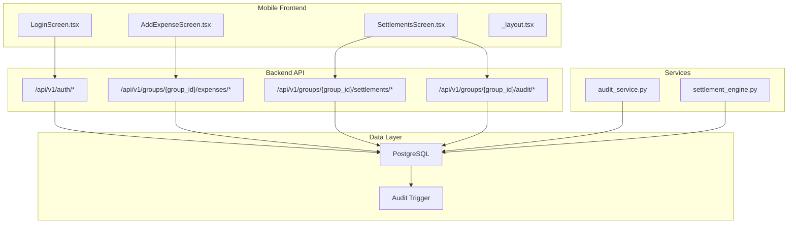
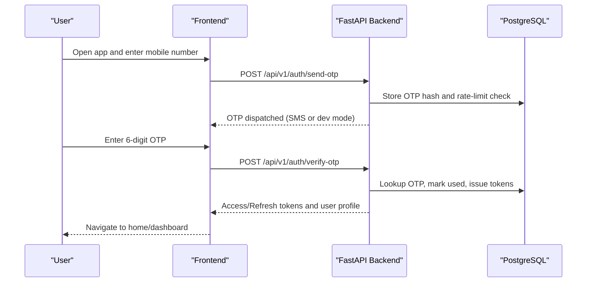
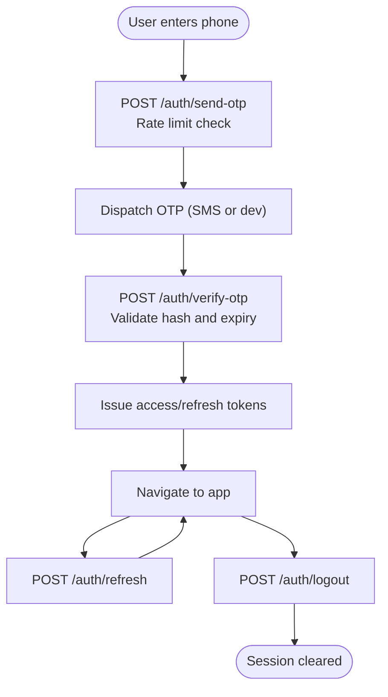
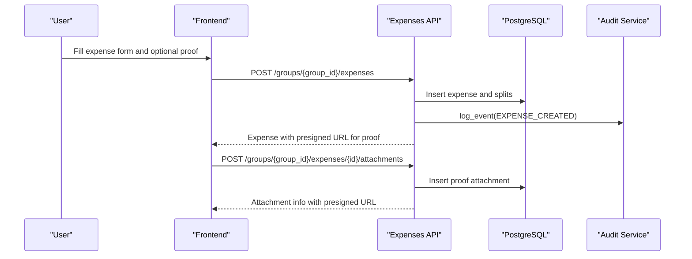
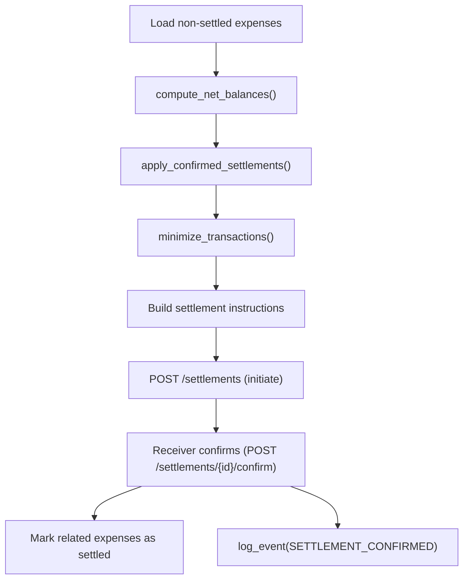
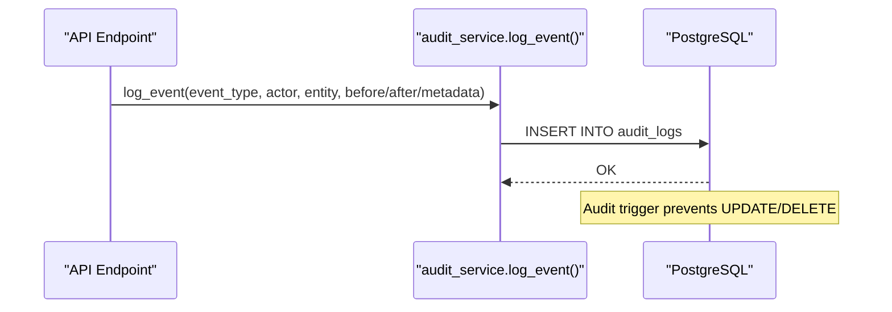
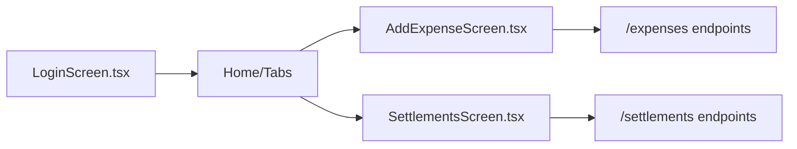
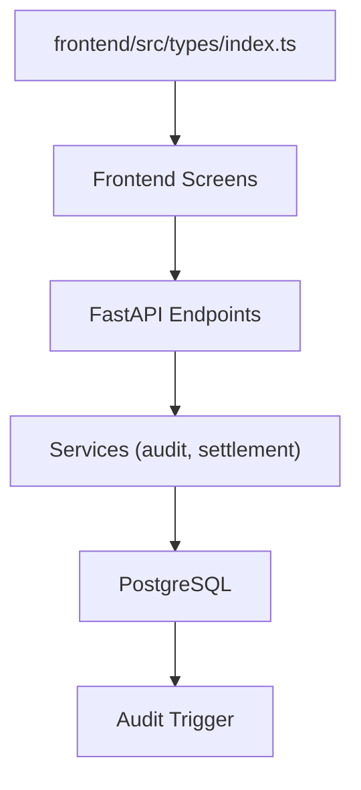

# Introduction

<cite>
**Referenced Files in This Document**
- [README.md](file://README.md)
- [backend/app/main.py](file://backend/app/main.py)
- [backend/app/api/v1/endpoints/auth.py](file://backend/app/api/v1/endpoints/auth.py)
- [backend/app/api/v1/endpoints/expenses.py](file://backend/app/api/v1/endpoints/expenses.py)
- [backend/app/api/v1/endpoints/settlements.py](file://backend/app/api/v1/endpoints/settlements.py)
- [backend/app/api/v1/endpoints/audit.py](file://backend/app/api/v1/endpoints/audit.py)
- [backend/app/services/audit_service.py](file://backend/app/services/audit_service.py)
- [backend/app/services/settlement_engine.py](file://backend/app/services/settlement_engine.py)
- [backend/app/models/user.py](file://backend/app/models/user.py)
- [frontend/app/_layout.tsx](file://frontend/app/_layout.tsx)
- [frontend/src/screens/LoginScreen.tsx](file://frontend/src/screens/LoginScreen.tsx)
- [frontend/src/screens/AddExpenseScreen.tsx](file://frontend/src/screens/AddExpenseScreen.tsx)
- [frontend/src/screens/SettlementsScreen.tsx](file://frontend/src/screens/SettlementsScreen.tsx)
- [frontend/src/types/index.ts](file://frontend/src/types/index.ts)
- [design_refs/stitch/stitch/login_onboarding_2030/code.html](file://design_refs/stitch/stitch/login_onboarding_2030/code.html)
</cite>

## Table of Contents
1. [Introduction](#introduction)
2. [Project Structure](#project-structure)
3. [Core Components](#core-components)
4. [Architecture Overview](#architecture-overview)
5. [Detailed Component Analysis](#detailed-component-analysis)
6. [Dependency Analysis](#dependency-analysis)
7. [Performance Considerations](#performance-considerations)
8. [Troubleshooting Guide](#troubleshooting-guide)
9. [Conclusion](#conclusion)
10. [Appendices](#appendices)

## Introduction
SplitSure is a mobile-first shared-expense application designed to simplify how groups split bills, verify expenses with proof-based records, and optimize settlements to reduce friction and ambiguity. It solves everyday financial coordination challenges—such as roommates splitting rent and utilities, friends splitting vacation costs, or extended families sharing events—by combining secure authentication, transparent expense tracking, tamper-proof proof attachments, intelligent settlement optimization, and immutable audit trails.

### Core Value Proposition
- Secure and frictionless onboarding with OTP authentication.
- Clear visibility into who paid, who owes, and why, powered by structured expense entries and proof attachments.
- Smarter, minimal settlements that reduce the number of transfers and streamline reconciliation.
- Immutable audit logs that protect transparency and accountability.
- Developer-friendly APIs and a modern mobile stack for rapid iteration and deployment.

### Target Audience and Use Cases
- Roommates and flatmates splitting recurring bills and groceries.
- Friends traveling together and splitting meals, transport, and stays.
- Extended families sharing birthdays, festivals, or other celebrations.
- Small teams or project groups managing shared work-related expenses.

### Key Differentiators
- OTP authentication with rate limiting and secure token lifecycle.
- Proof attachments with cryptographic hashing and server-side validation.
- Intelligent settlement optimization that minimizes transaction counts.
- Immutable audit logs enforced at the database level.
- UPI deep links for seamless peer-to-peer payments.

### Conceptual Overview for Non-Technical Stakeholders
SplitSure lets you:
- Log in securely with a one-time passcode.
- Add expenses with optional receipts or invoices.
- Automatically calculate how much each person owes based on equal, exact, or percentage splits.
- See the smallest set of payments needed to settle balances.
- Confirm or dispute payments with built-in notifications.
- Browse an immutable record of all actions taken in the group.

### Developer-Focused Capabilities
- RESTful API surface organized by domain (auth, users, groups, expenses, settlements, audit).
- Strong typing and schema validation across backend and frontend.
- Asynchronous services for settlement computation and audit logging.
- PostgreSQL triggers enforcing audit immutability.
- Mobile-first frontend with React Query for caching and optimistic updates.

**Section sources**
- [README.md:1-162](file://README.md#L1-L162)
- [backend/app/main.py:16-22](file://backend/app/main.py#L16-L22)
- [frontend/src/screens/LoginScreen.tsx:104-109](file://frontend/src/screens/LoginScreen.tsx#L104-L109)

## Project Structure
SplitSure is organized into:
- A backend service built with FastAPI, SQLAlchemy, and PostgreSQL, exposing a versioned API.
- A mobile frontend using Expo Router, React Native, and React Query for a responsive, offline-ready experience.
- Design assets and onboarding references for branding and UX consistency.

**Diagram sources**
- [frontend/src/screens/LoginScreen.tsx:1-402](file://frontend/src/screens/LoginScreen.tsx#L1-L402)
- [frontend/src/screens/AddExpenseScreen.tsx:1-421](file://frontend/src/screens/AddExpenseScreen.tsx#L1-L421)
- [frontend/src/screens/SettlementsScreen.tsx:1-589](file://frontend/src/screens/SettlementsScreen.tsx#L1-L589)
- [backend/app/api/v1/endpoints/auth.py:1-147](file://backend/app/api/v1/endpoints/auth.py#L1-L147)
- [backend/app/api/v1/endpoints/expenses.py:1-395](file://backend/app/api/v1/endpoints/expenses.py#L1-L395)
- [backend/app/api/v1/endpoints/settlements.py:1-501](file://backend/app/api/v1/endpoints/settlements.py#L1-L501)
- [backend/app/api/v1/endpoints/audit.py:1-40](file://backend/app/api/v1/endpoints/audit.py#L1-L40)
- [backend/app/services/audit_service.py:1-32](file://backend/app/services/audit_service.py#L1-L32)
- [backend/app/services/settlement_engine.py:1-106](file://backend/app/services/settlement_engine.py#L1-L106)
- [backend/app/main.py:68-96](file://backend/app/main.py#L68-L96)

**Section sources**
- [README.md:5-11](file://README.md#L5-L11)
- [backend/app/main.py:56-56](file://backend/app/main.py#L56-L56)
- [frontend/app/_layout.tsx:29-72](file://frontend/app/_layout.tsx#L29-L72)

## Core Components
- Authentication and session management with OTP, JWT tokens, and refresh flows.
- Expense lifecycle: creation, updates, disputes, and proof attachments.
- Settlement orchestration: balance computation, optimized transaction generation, initiation, confirmation, and dispute resolution.
- Immutable audit trail with database-level protection.
- Frontend screens for login, expense creation, and settlement management.

**Section sources**
- [README.md:13-22](file://README.md#L13-L22)
- [backend/app/api/v1/endpoints/auth.py:58-147](file://backend/app/api/v1/endpoints/auth.py#L58-L147)
- [backend/app/api/v1/endpoints/expenses.py:143-395](file://backend/app/api/v1/endpoints/expenses.py#L143-L395)
- [backend/app/api/v1/endpoints/settlements.py:129-501](file://backend/app/api/v1/endpoints/settlements.py#L129-L501)
- [backend/app/api/v1/endpoints/audit.py:13-40](file://backend/app/api/v1/endpoints/audit.py#L13-L40)
- [backend/app/services/audit_service.py:6-32](file://backend/app/services/audit_service.py#L6-L32)

## Architecture Overview
SplitSure follows a clean separation of concerns:
- Frontend handles user interactions, navigation, and optimistic UI updates.
- Backend enforces business rules, performs settlement computations, and writes immutable audit logs.
- Database persists all state and enforces audit immutability via triggers.

**Diagram sources**
- [frontend/src/screens/LoginScreen.tsx:43-81](file://frontend/src/screens/LoginScreen.tsx#L43-L81)
- [backend/app/api/v1/endpoints/auth.py:58-116](file://backend/app/api/v1/endpoints/auth.py#L58-L116)
- [backend/app/main.py:88-96](file://backend/app/main.py#L88-L96)

## Detailed Component Analysis

### Authentication and Session Management
- OTP generation with rate limiting and expiration.
- Secure token issuance and refresh with typed roles.
- Logout invalidates tokens and cleans sessions.

**Diagram sources**
- [backend/app/api/v1/endpoints/auth.py:24-147](file://backend/app/api/v1/endpoints/auth.py#L24-L147)
- [frontend/src/screens/LoginScreen.tsx:43-81](file://frontend/src/screens/LoginScreen.tsx#L43-L81)

**Section sources**
- [backend/app/api/v1/endpoints/auth.py:58-147](file://backend/app/api/v1/endpoints/auth.py#L58-L147)
- [frontend/src/screens/LoginScreen.tsx:13-24](file://frontend/src/screens/LoginScreen.tsx#L13-L24)

### Expense Tracking and Proof Attachments
- Create expenses with split modes (equal, exact, percentage).
- Attach proofs with server-side validation and hashing.
- Disputes and edits are logged with immutable audit trail.

**Diagram sources**
- [frontend/src/screens/AddExpenseScreen.tsx:35-110](file://frontend/src/screens/AddExpenseScreen.tsx#L35-L110)
- [backend/app/api/v1/endpoints/expenses.py:143-395](file://backend/app/api/v1/endpoints/expenses.py#L143-L395)
- [backend/app/services/audit_service.py:6-32](file://backend/app/services/audit_service.py#L6-L32)

**Section sources**
- [backend/app/api/v1/endpoints/expenses.py:143-395](file://backend/app/api/v1/endpoints/expenses.py#L143-L395)
- [frontend/src/screens/AddExpenseScreen.tsx:102-110](file://frontend/src/screens/AddExpenseScreen.tsx#L102-L110)

### Settlement Optimization and Execution
- Compute net balances across non-settled, non-deleted expenses.
- Minimize transactions using a greedy algorithm.
- Initiate, confirm, dispute, and resolve settlements with push notifications and UPI deep links.

**Diagram sources**
- [backend/app/api/v1/endpoints/settlements.py:129-309](file://backend/app/api/v1/endpoints/settlements.py#L129-L309)
- [backend/app/services/settlement_engine.py:23-106](file://backend/app/services/settlement_engine.py#L23-L106)
- [backend/app/services/audit_service.py:6-32](file://backend/app/services/audit_service.py#L6-L32)

**Section sources**
- [backend/app/api/v1/endpoints/settlements.py:129-501](file://backend/app/api/v1/endpoints/settlements.py#L129-L501)
- [backend/app/services/settlement_engine.py:23-106](file://backend/app/services/settlement_engine.py#L23-L106)

### Immutable Audit Trail
- All sensitive operations are logged with before/after snapshots and metadata.
- A PostgreSQL trigger prevents modification or deletion of audit logs.

**Diagram sources**
- [backend/app/services/audit_service.py:6-32](file://backend/app/services/audit_service.py#L6-L32)
- [backend/app/main.py:68-85](file://backend/app/main.py#L68-L85)

**Section sources**
- [backend/app/api/v1/endpoints/audit.py:13-40](file://backend/app/api/v1/endpoints/audit.py#L13-L40)
- [backend/app/main.py:68-85](file://backend/app/main.py#L68-L85)

### Frontend Screens and User Journeys
- Login screen with animated onboarding and OTP entry.
- Expense creation with split mode selection and proof attachment.
- Settlements screen with optimized transfer matrix, UPI deep links, and dispute resolution.

**Diagram sources**
- [frontend/src/screens/LoginScreen.tsx:26-185](file://frontend/src/screens/LoginScreen.tsx#L26-L185)
- [frontend/src/screens/AddExpenseScreen.tsx:14-231](file://frontend/src/screens/AddExpenseScreen.tsx#L14-L231)
- [frontend/src/screens/SettlementsScreen.tsx:38-375](file://frontend/src/screens/SettlementsScreen.tsx#L38-L375)

**Section sources**
- [frontend/src/screens/LoginScreen.tsx:104-109](file://frontend/src/screens/LoginScreen.tsx#L104-L109)
- [frontend/src/screens/AddExpenseScreen.tsx:102-110](file://frontend/src/screens/AddExpenseScreen.tsx#L102-L110)
- [frontend/src/screens/SettlementsScreen.tsx:247-264](file://frontend/src/screens/SettlementsScreen.tsx#L247-L264)

## Dependency Analysis
- Frontend depends on typed models and API clients to maintain consistency.
- Backend enforces domain invariants and delegates computation to services.
- Database integrity is reinforced by triggers and enums.

**Diagram sources**
- [frontend/src/types/index.ts:1-153](file://frontend/src/types/index.ts#L1-L153)
- [backend/app/api/v1/endpoints/auth.py:1-147](file://backend/app/api/v1/endpoints/auth.py#L1-L147)
- [backend/app/api/v1/endpoints/expenses.py:1-395](file://backend/app/api/v1/endpoints/expenses.py#L1-L395)
- [backend/app/api/v1/endpoints/settlements.py:1-501](file://backend/app/api/v1/endpoints/settlements.py#L1-L501)
- [backend/app/services/audit_service.py:1-32](file://backend/app/services/audit_service.py#L1-L32)
- [backend/app/services/settlement_engine.py:1-106](file://backend/app/services/settlement_engine.py#L1-L106)
- [backend/app/main.py:68-85](file://backend/app/main.py#L68-L85)

**Section sources**
- [frontend/src/types/index.ts:1-153](file://frontend/src/types/index.ts#L1-L153)
- [backend/app/models/user.py:12-49](file://backend/app/models/user.py#L12-L49)

## Performance Considerations
- Integer arithmetic in paise avoids floating-point drift and simplifies comparisons.
- Greedy settlement minimization reduces transaction count and improves user experience.
- Frontend caching with React Query reduces redundant network calls.
- Database triggers enforce audit immutability without application-level overhead.

[No sources needed since this section provides general guidance]

## Troubleshooting Guide
- Authentication
  - OTP not received: verify rate limits and environment configuration for OTP provider.
  - Invalid/expired OTP: ensure clock synchronization and correct input length.
- Expenses
  - Split validation errors: ensure exact totals add up or percentages sum to 100.
  - Disputes and edits: cannot modify settled or disputed expenses.
- Settlements
  - Amount mismatch: settlement must match computed outstanding balance.
  - Pending conflicts: only receivers can confirm; admins resolve disputes.
- Audit
  - Audit logs cannot be altered: this is by design; use query APIs to inspect history.

**Section sources**
- [backend/app/api/v1/endpoints/auth.py:24-96](file://backend/app/api/v1/endpoints/auth.py#L24-L96)
- [backend/app/api/v1/endpoints/expenses.py:241-245](file://backend/app/api/v1/endpoints/expenses.py#L241-L245)
- [backend/app/api/v1/endpoints/settlements.py:253-259](file://backend/app/api/v1/endpoints/settlements.py#L253-L259)
- [backend/app/main.py:68-85](file://backend/app/main.py#L68-L85)

## Conclusion
SplitSure delivers a secure, transparent, and efficient way for groups to manage shared expenses. Its combination of OTP authentication, proof attachments, settlement optimization, and immutable audit trails makes it practical for everyday scenarios while providing robust technical foundations for developers and operators.

[No sources needed since this section summarizes without analyzing specific files]

## Appendices
- Branding and onboarding references emphasize trust signals such as zero-knowledge, immutable ledger, and bank-grade security.

**Section sources**
- [design_refs/stitch/stitch/login_onboarding_2030/code.html:136-155](file://design_refs/stitch/stitch/login_onboarding_2030/code.html#L136-L155)