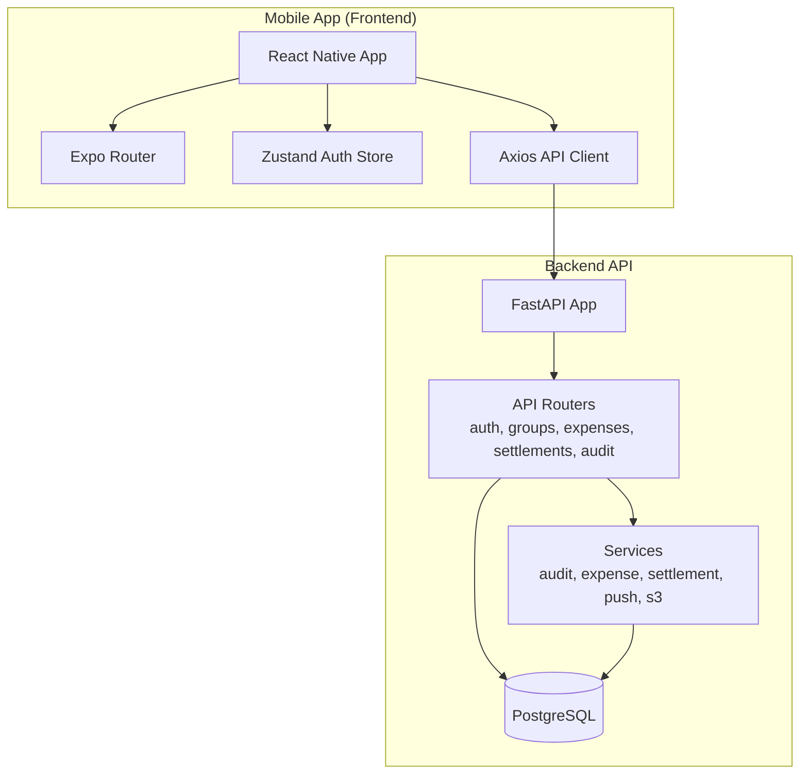
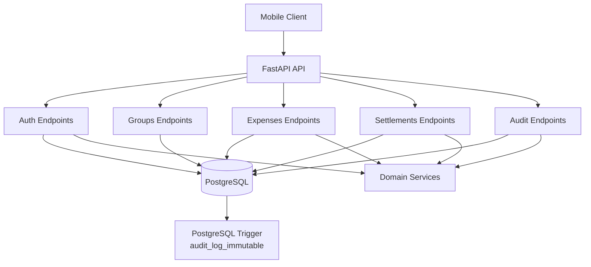
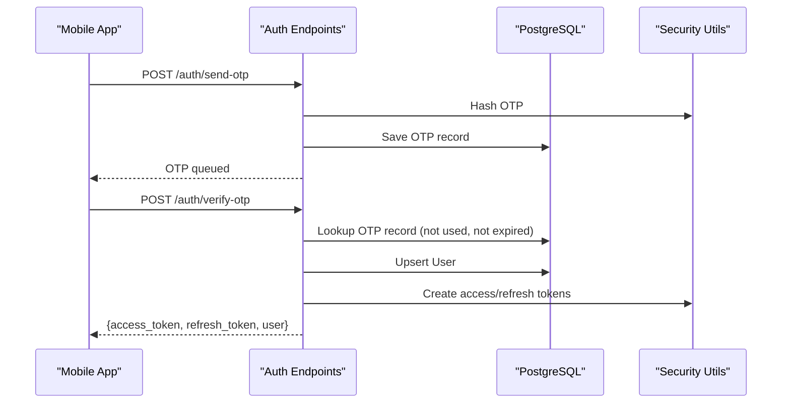
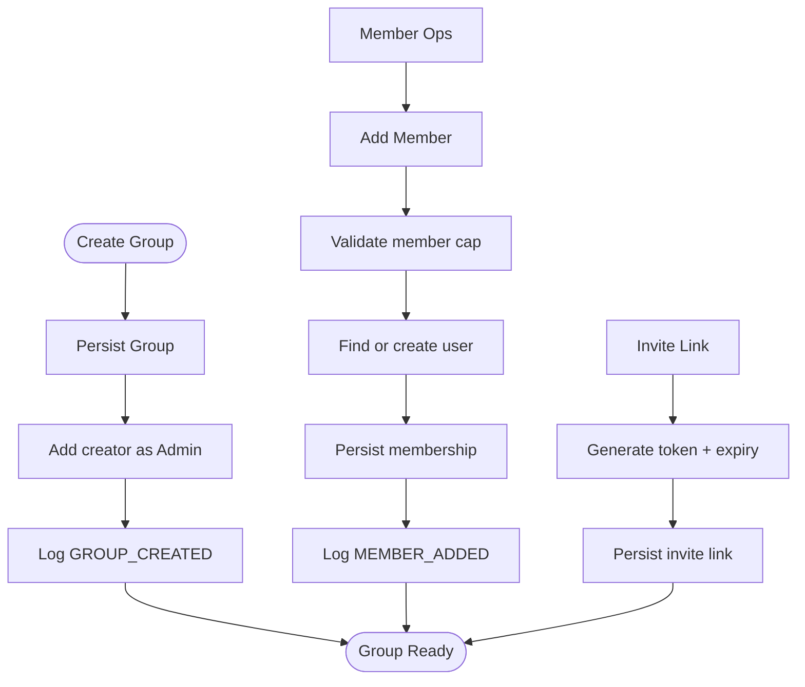
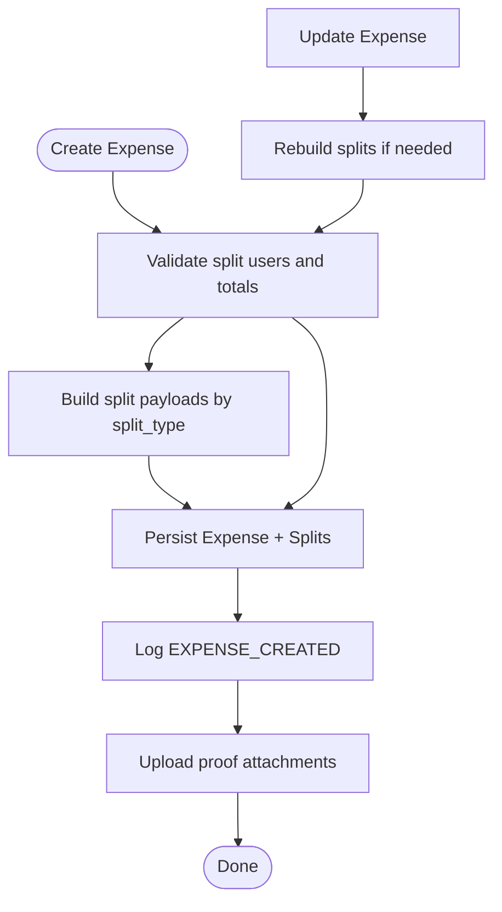
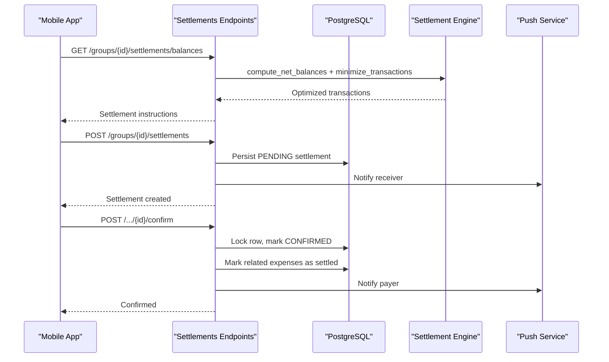
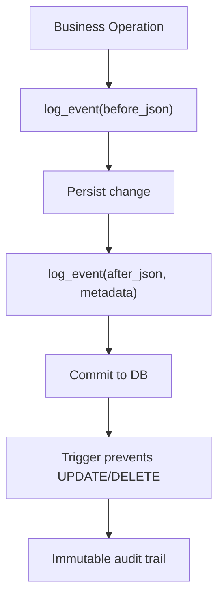
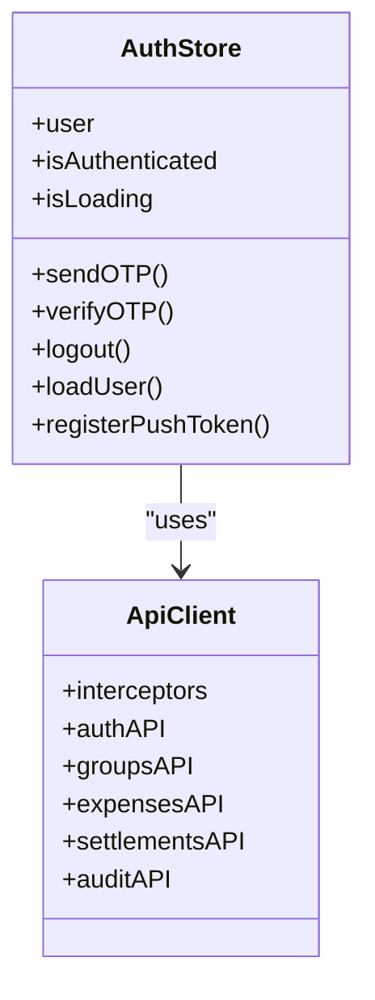
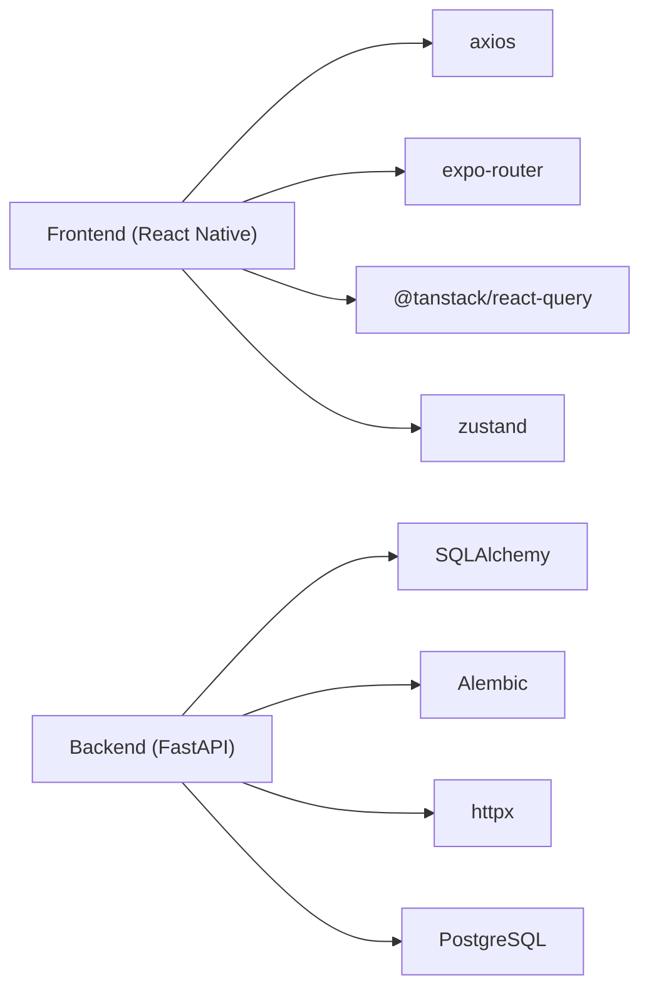

# Project Overview

<cite>
**Referenced Files in This Document**
- [README.md](file://README.md)
- [backend/app/main.py](file://backend/app/main.py)
- [backend/app/api/v1/endpoints/auth.py](file://backend/app/api/v1/endpoints/auth.py)
- [backend/app/api/v1/endpoints/expenses.py](file://backend/app/api/v1/endpoints/expenses.py)
- [backend/app/api/v1/endpoints/groups.py](file://backend/app/api/v1/endpoints/groups.py)
- [backend/app/api/v1/endpoints/settlements.py](file://backend/app/api/v1/endpoints/settlements.py)
- [backend/app/api/v1/endpoints/audit.py](file://backend/app/api/v1/endpoints/audit.py)
- [backend/app/models/user.py](file://backend/app/models/user.py)
- [backend/app/schemas/schemas.py](file://backend/app/schemas/schemas.py)
- [backend/app/services/audit_service.py](file://backend/app/services/audit_service.py)
- [backend/app/services/expense_service.py](file://backend/app/services/expense_service.py)
- [backend/app/services/settlement_engine.py](file://backend/app/services/settlement_engine.py)
- [backend/app/services/push_service.py](file://backend/app/services/push_service.py)
- [frontend/app/_layout.tsx](file://frontend/app/_layout.tsx)
- [frontend/src/services/api.ts](file://frontend/src/services/api.ts)
- [frontend/src/store/authStore.ts](file://frontend/src/store/authStore.ts)
- [frontend/src/types/index.ts](file://frontend/src/types/index.ts)
- [frontend/package.json](file://frontend/package.json)
</cite>

## Table of Contents
1. [Introduction](#introduction)
2. [Project Structure](#project-structure)
3. [Core Components](#core-components)
4. [Architecture Overview](#architecture-overview)
5. [Detailed Component Analysis](#detailed-component-analysis)
6. [Dependency Analysis](#dependency-analysis)
7. [Performance Considerations](#performance-considerations)
8. [Troubleshooting Guide](#troubleshooting-guide)
9. [Conclusion](#conclusion)

## Introduction
SplitSure is a mobile-first shared expense application designed to simplify group spending with intelligent split types, robust authentication, group-ledger accounting, proof attachments, optimized settlement suggestions, and immutable audit trails. It targets everyday users who travel, live together, or organize regular group activities and need transparent, fair, and auditable expense management.

Key value propositions:
- Smart split types: Equal, exact, and percentage splits with strict validation to ensure correctness.
- Optimized settlements: Automated computation of minimal transactions to settle balances efficiently.
- Immutable audit history: Append-only audit logs protected by database triggers for accountability.
- Mobile-first UX: A native-feeling React Native app with OTP authentication, push notifications, and offline-friendly caching.
- Practical integrations: UPI deep links for instant peer-to-peer payments and optional PDF reporting.

Primary use cases:
- Trip planning: Track shared costs (food, transport, accommodation) and settle balances after the trip.
- Flat sharing: Manage recurring bills and one-off expenses among housemates.
- Group events: Split costs for parties, outings, or co-curricular activities with transparency and fairness.

## Project Structure
SplitSure follows a clear separation of concerns:
- Backend: FastAPI application with asynchronous SQLAlchemy ORM, PostgreSQL, and modular endpoint packages.
- Frontend: React Native app using Expo Router for navigation, React Query for data fetching, and Zustand for state management.
- Services: Business logic for settlement optimization, audit logging, and push notifications.

**Diagram sources**
- [frontend/app/_layout.tsx:29-72](file://frontend/app/_layout.tsx#L29-L72)
- [frontend/src/services/api.ts:42-140](file://frontend/src/services/api.ts#L42-L140)
- [backend/app/main.py:16-56](file://backend/app/main.py#L16-L56)
- [backend/app/api/v1/endpoints/auth.py:17-147](file://backend/app/api/v1/endpoints/auth.py#L17-L147)
- [backend/app/api/v1/endpoints/groups.py:17-309](file://backend/app/api/v1/endpoints/groups.py#L17-L309)
- [backend/app/api/v1/endpoints/expenses.py:20-395](file://backend/app/api/v1/endpoints/expenses.py#L20-L395)
- [backend/app/api/v1/endpoints/settlements.py:30-501](file://backend/app/api/v1/endpoints/settlements.py#L30-L501)
- [backend/app/api/v1/endpoints/audit.py:10-40](file://backend/app/api/v1/endpoints/audit.py#L10-L40)

**Section sources**
- [README.md:1-162](file://README.md#L1-L162)
- [backend/app/main.py:16-56](file://backend/app/main.py#L16-L56)
- [frontend/app/_layout.tsx:29-72](file://frontend/app/_layout.tsx#L29-L72)

## Core Components
- Authentication and sessions: OTP-based login with rate limiting, refresh tokens, and secure token storage.
- Groups and memberships: Creation, invitations, and admin/member roles with archival.
- Expenses: Full lifecycle with split types, proof attachments, disputes, and audit logging.
- Settlements: Balance computation, settlement optimization, initiation, confirmation, and dispute resolution.
- Audit: Immutable audit trail with append-only protection and searchable events.
- Frontend services: API client with interceptors, auth store, and typed models for seamless UX.

**Section sources**
- [backend/app/api/v1/endpoints/auth.py:58-147](file://backend/app/api/v1/endpoints/auth.py#L58-L147)
- [backend/app/api/v1/endpoints/groups.py:58-309](file://backend/app/api/v1/endpoints/groups.py#L58-L309)
- [backend/app/api/v1/endpoints/expenses.py:143-395](file://backend/app/api/v1/endpoints/expenses.py#L143-L395)
- [backend/app/api/v1/endpoints/settlements.py:129-501](file://backend/app/api/v1/endpoints/settlements.py#L129-L501)
- [backend/app/api/v1/endpoints/audit.py:13-40](file://backend/app/api/v1/endpoints/audit.py#L13-L40)
- [frontend/src/services/api.ts:142-269](file://frontend/src/services/api.ts#L142-L269)
- [frontend/src/store/authStore.ts:29-116](file://frontend/src/store/authStore.ts#L29-L116)
- [frontend/src/types/index.ts:1-153](file://frontend/src/types/index.ts#L1-L153)

## Architecture Overview
SplitSure adopts a layered architecture:
- Presentation layer: React Native app with Expo Router and React Query.
- Application layer: FastAPI endpoints grouped by domain (auth, groups, expenses, settlements, audit).
- Domain services: Settlement engine, audit logging, push notifications, and S3 proof storage.
- Data layer: PostgreSQL with SQLAlchemy ORM and database triggers for audit immutability.

**Diagram sources**
- [backend/app/main.py:68-86](file://backend/app/main.py#L68-L86)
- [backend/app/api/v1/endpoints/auth.py:17-147](file://backend/app/api/v1/endpoints/auth.py#L17-L147)
- [backend/app/api/v1/endpoints/expenses.py:20-395](file://backend/app/api/v1/endpoints/expenses.py#L20-L395)
- [backend/app/api/v1/endpoints/groups.py:17-309](file://backend/app/api/v1/endpoints/groups.py#L17-L309)
- [backend/app/api/v1/endpoints/settlements.py:30-501](file://backend/app/api/v1/endpoints/settlements.py#L30-L501)
- [backend/app/api/v1/endpoints/audit.py:10-40](file://backend/app/api/v1/endpoints/audit.py#L10-L40)
- [backend/app/services/audit_service.py:6-32](file://backend/app/services/audit_service.py#L6-L32)

## Detailed Component Analysis

### Authentication and Sessions
- OTP generation and verification with hashing, expiry, and rate limiting.
- Access and refresh tokens with secure storage and automatic refresh on 401.
- Logout blacklisting and session cleanup.

**Diagram sources**
- [backend/app/api/v1/endpoints/auth.py:58-116](file://backend/app/api/v1/endpoints/auth.py#L58-L116)
- [backend/app/core/security.py:1-200](file://backend/app/core/security.py#L1-L200)
- [frontend/src/services/api.ts:142-169](file://frontend/src/services/api.ts#L142-L169)
- [frontend/src/store/authStore.ts:34-47](file://frontend/src/store/authStore.ts#L34-L47)

**Section sources**
- [backend/app/api/v1/endpoints/auth.py:58-147](file://backend/app/api/v1/endpoints/auth.py#L58-L147)
- [frontend/src/services/api.ts:76-140](file://frontend/src/services/api.ts#L76-L140)
- [frontend/src/store/authStore.ts:29-80](file://frontend/src/store/authStore.ts#L29-L80)

### Group Management and Membership
- Create, update, list, and archive groups.
- Add/remove members and manage roles.
- Invite via token with expiry and usage limits.

**Diagram sources**
- [backend/app/api/v1/endpoints/groups.py:58-309](file://backend/app/api/v1/endpoints/groups.py#L58-L309)
- [backend/app/services/audit_service.py:6-32](file://backend/app/services/audit_service.py#L6-L32)

**Section sources**
- [backend/app/api/v1/endpoints/groups.py:58-309](file://backend/app/api/v1/endpoints/groups.py#L58-L309)
- [backend/app/models/user.py:90-122](file://backend/app/models/user.py#L90-L122)

### Expense Tracking and Split Types
- Create, update, delete, and dispute expenses.
- Split types: equal, exact, percentage with strict validation.
- Attach proofs and presigned URLs for retrieval.

**Diagram sources**
- [backend/app/api/v1/endpoints/expenses.py:143-264](file://backend/app/api/v1/endpoints/expenses.py#L143-L264)
- [backend/app/services/expense_service.py:7-79](file://backend/app/services/expense_service.py#L7-L79)
- [backend/app/services/audit_service.py:6-32](file://backend/app/services/audit_service.py#L6-L32)

**Section sources**
- [backend/app/api/v1/endpoints/expenses.py:143-395](file://backend/app/api/v1/endpoints/expenses.py#L143-L395)
- [backend/app/schemas/schemas.py:197-322](file://backend/app/schemas/schemas.py#L197-L322)
- [backend/app/models/user.py:124-162](file://backend/app/models/user.py#L124-L162)

### Settlement Optimization and Lifecycle
- Compute net balances and minimize transactions.
- Initiate, confirm, dispute, and resolve settlements.
- Mark related expenses as settled upon confirmation.

**Diagram sources**
- [backend/app/api/v1/endpoints/settlements.py:129-372](file://backend/app/api/v1/endpoints/settlements.py#L129-L372)
- [backend/app/services/settlement_engine.py:23-106](file://backend/app/services/settlement_engine.py#L23-L106)
- [backend/app/services/push_service.py:14-43](file://backend/app/services/push_service.py#L14-L43)

**Section sources**
- [backend/app/api/v1/endpoints/settlements.py:129-501](file://backend/app/api/v1/endpoints/settlements.py#L129-L501)
- [backend/app/services/settlement_engine.py:1-106](file://backend/app/services/settlement_engine.py#L1-L106)

### Audit Trails and Immutable Logs
- Centralized audit logging with pre-update hooks and database-trigger immutability.
- Events include expense edits, settlements, membership changes, and group updates.

**Diagram sources**
- [backend/app/services/audit_service.py:6-32](file://backend/app/services/audit_service.py#L6-L32)
- [backend/app/main.py:68-86](file://backend/app/main.py#L68-L86)
- [backend/app/api/v1/endpoints/audit.py:13-40](file://backend/app/api/v1/endpoints/audit.py#L13-L40)

**Section sources**
- [backend/app/services/audit_service.py:6-32](file://backend/app/services/audit_service.py#L6-L32)
- [backend/app/main.py:68-86](file://backend/app/main.py#L68-L86)
- [backend/app/api/v1/endpoints/audit.py:13-40](file://backend/app/api/v1/endpoints/audit.py#L13-L40)

### Frontend Integration Highlights
- Axios-based API client with request/response interceptors for auth and retries.
- Zustand store for OTP flow, session persistence, and push token registration.
- Typed models for seamless integration with backend schemas.

**Diagram sources**
- [frontend/src/store/authStore.ts:29-116](file://frontend/src/store/authStore.ts#L29-L116)
- [frontend/src/services/api.ts:42-269](file://frontend/src/services/api.ts#L42-L269)

**Section sources**
- [frontend/src/services/api.ts:1-269](file://frontend/src/services/api.ts#L1-L269)
- [frontend/src/store/authStore.ts:1-116](file://frontend/src/store/authStore.ts#L1-L116)
- [frontend/src/types/index.ts:1-153](file://frontend/src/types/index.ts#L1-L153)

## Dependency Analysis
- Backend dependencies: FastAPI, SQLAlchemy, Alembic migrations, httpx for external APIs, PostgreSQL.
- Frontend dependencies: React Native, Expo Router, React Query, Zustand, axios, expo-notifications, expo-secure-store.

**Diagram sources**
- [frontend/package.json:13-61](file://frontend/package.json#L13-L61)
- [backend/requirements.txt:1-200](file://backend/requirements.txt#L1-L200)

**Section sources**
- [frontend/package.json:13-61](file://frontend/package.json#L13-L61)

## Performance Considerations
- Integer arithmetic for money (paise) avoids floating-point errors and ensures precise calculations.
- Greedy settlement optimization minimizes transaction count with predictable O(n log n) complexity.
- Database triggers enforce audit immutability without application-level overhead.
- Frontend caching with React Query reduces redundant network calls and improves responsiveness.

## Troubleshooting Guide
Common issues and resolutions:
- OTP rate limiting: Exceeded hourly OTP requests are rejected; wait for the hourly window to reset.
- Invalid or expired OTP: Ensure the OTP is correct and not older than configured expiry.
- Unauthorized access: Verify bearer token presence and validity; refresh tokens automatically on 401.
- Settlement mismatch: Ensure the settlement amount matches the computed outstanding balance.
- Audit immutability: Audit logs cannot be modified or deleted; verify database trigger behavior.

**Section sources**
- [backend/app/api/v1/endpoints/auth.py:24-34](file://backend/app/api/v1/endpoints/auth.py#L24-L34)
- [backend/app/api/v1/endpoints/auth.py:82-96](file://backend/app/api/v1/endpoints/auth.py#L82-L96)
- [frontend/src/services/api.ts:97-140](file://frontend/src/services/api.ts#L97-L140)
- [backend/app/api/v1/endpoints/settlements.py:253-259](file://backend/app/api/v1/endpoints/settlements.py#L253-L259)
- [backend/app/main.py:68-86](file://backend/app/main.py#L68-L86)

## Conclusion
SplitSure delivers a robust, mobile-first shared expense solution with strong financial integrity, transparent governance, and a smooth user experience. Its modular backend and native frontend enable scalable growth, while rigorous validation, immutable audit trails, and optimized settlement logic ensure fairness and trust among group members.