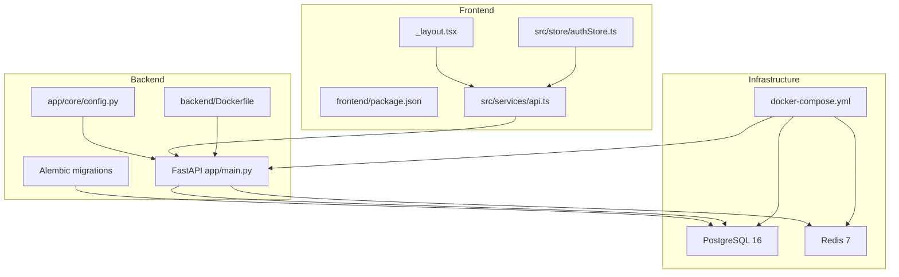
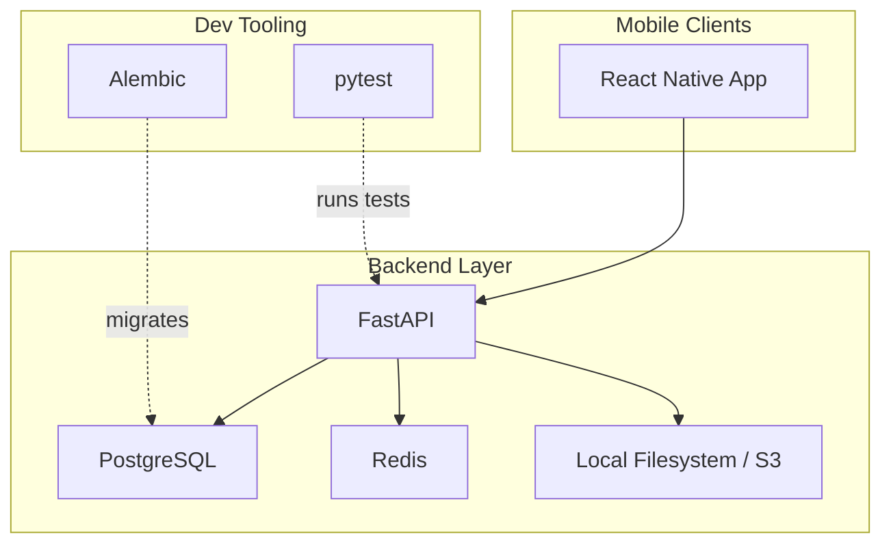
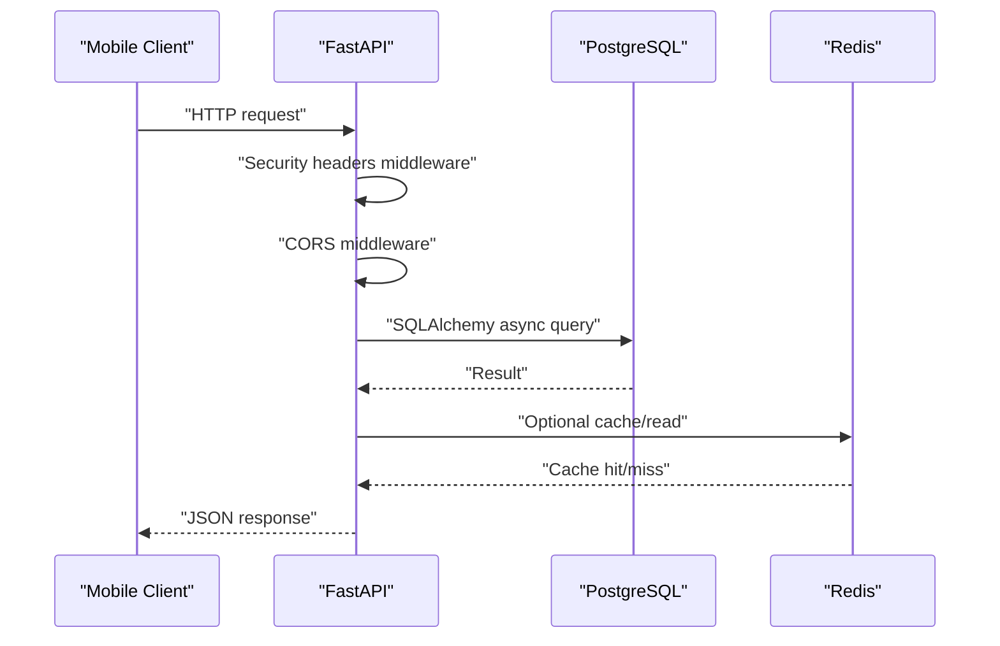
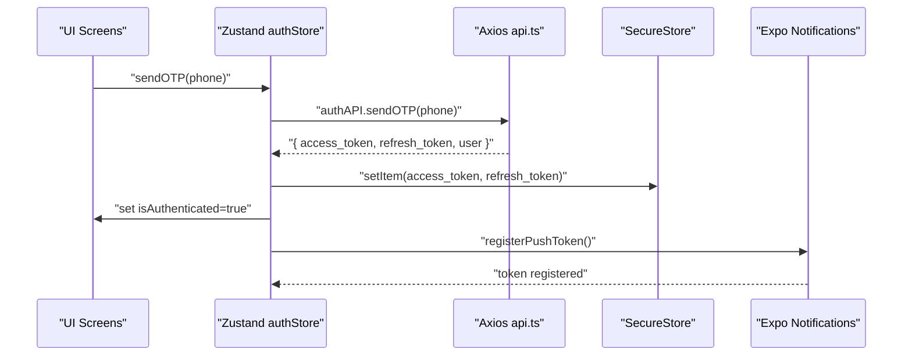
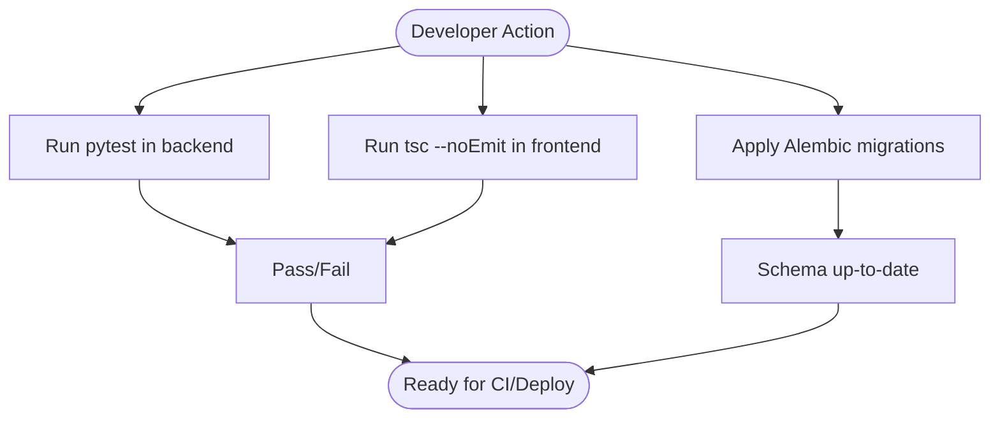
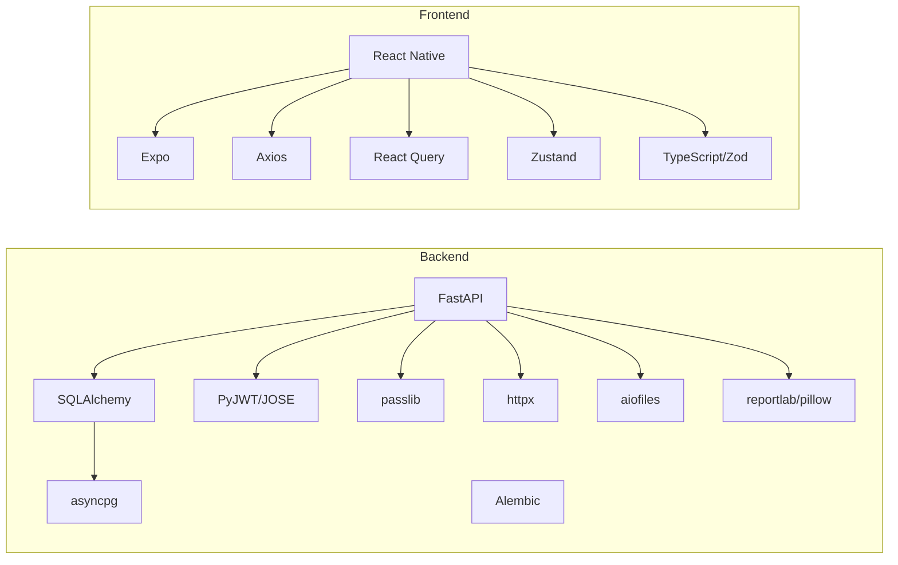

# Technology Stack

<cite>
**Referenced Files in This Document**
- [README.md](file://README.md)
- [docker-compose.yml](file://docker-compose.yml)
- [backend/Dockerfile](file://backend/Dockerfile)
- [backend/requirements.txt](file://backend/requirements.txt)
- [backend/requirements-dev.txt](file://backend/requirements-dev.txt)
- [backend/pytest.ini](file://backend/pytest.ini)
- [backend/app/main.py](file://backend/app/main.py)
- [backend/app/core/config.py](file://backend/app/core/config.py)
- [backend/alembic/versions/001_initial.py](file://backend/alembic/versions/001_initial.py)
- [backend/alembic/versions/002_add_push_token.py](file://backend/alembic/versions/002_add_push_token.py)
- [frontend/package.json](file://frontend/package.json)
- [frontend/tsconfig.json](file://frontend/tsconfig.json)
- [frontend/eas.json](file://frontend/eas.json)
- [frontend/app/_layout.tsx](file://frontend/app/_layout.tsx)
- [frontend/src/services/api.ts](file://frontend/src/services/api.ts)
- [frontend/src/store/authStore.ts](file://frontend/src/store/authStore.ts)
</cite>

## Table of Contents
1. [Introduction](#introduction)
2. [Project Structure](#project-structure)
3. [Core Components](#core-components)
4. [Architecture Overview](#architecture-overview)
5. [Detailed Component Analysis](#detailed-component-analysis)
6. [Dependency Analysis](#dependency-analysis)
7. [Performance Considerations](#performance-considerations)
8. [Troubleshooting Guide](#troubleshooting-guide)
9. [Conclusion](#conclusion)

## Introduction
This document describes the SplitSure technology stack across backend, frontend, development tools, and infrastructure. It explains the rationale for each technology choice, highlights version and compatibility considerations, and outlines upgrade paths. The focus is on enabling mobile-first shared-expense workflows: OTP authentication, group management, expense tracking with proof attachments, balance computation, settlement suggestions, and immutable audit logs.

## Project Structure
SplitSure is organized into:
- Backend: FastAPI application with SQLAlchemy ORM, PostgreSQL, Alembic migrations, and Docker packaging.
- Frontend: React Native mobile app built with Expo Router, TypeScript, React Query, and Zustand.
- Infrastructure: Docker Compose orchestrating PostgreSQL, Redis, and the FastAPI service.

**Diagram sources**
- [docker-compose.yml:1-82](file://docker-compose.yml#L1-L82)
- [backend/Dockerfile:1-15](file://backend/Dockerfile#L1-L15)
- [backend/app/main.py:1-96](file://backend/app/main.py#L1-L96)
- [backend/app/core/config.py:1-71](file://backend/app/core/config.py#L1-L71)
- [frontend/package.json:1-62](file://frontend/package.json#L1-L62)
- [frontend/app/_layout.tsx:1-85](file://frontend/app/_layout.tsx#L1-L85)
- [frontend/src/services/api.ts:1-271](file://frontend/src/services/api.ts#L1-L271)
- [frontend/src/store/authStore.ts:1-116](file://frontend/src/store/authStore.ts#L1-L116)

**Section sources**
- [README.md:1-162](file://README.md#L1-L162)
- [docker-compose.yml:1-82](file://docker-compose.yml#L1-L82)
- [backend/Dockerfile:1-15](file://backend/Dockerfile#L1-L15)
- [frontend/package.json:1-62](file://frontend/package.json#L1-L62)

## Core Components
- Backend runtime and framework
  - FastAPI: ASGI web framework for building APIs with automatic OpenAPI/Swagger docs and Pydantic validation.
  - Uvicorn: ASGI server for development and production deployments.
- Database and ORM
  - SQLAlchemy 2.x asyncio: Asynchronous ORM and dialect for PostgreSQL.
  - asyncpg: Async PostgreSQL driver.
  - Alembic: Database migration tool integrated with SQLAlchemy.
- Authentication and cryptography
  - PyJWT and python-jose for JWT handling.
  - passlib bcrypt for secure password hashing.
- Utilities and integrations
  - httpx for async HTTP client.
  - aiofiles for async file operations.
  - reportlab, pillow for PDF generation and image handling.
- Testing
  - pytest for backend unit tests.
- Frontend runtime and framework
  - React 18.2 and React Native 0.74.5.
  - Expo 51 with Expo Router for navigation and platform abstractions.
  - TypeScript ~5.3 with strict settings.
- State and networking
  - Zustand for lightweight global state.
  - React Query (@tanstack/react-query) for server state management.
  - Axios for HTTP requests with interceptors.
- Mobile-specific
  - Expo Secure Store for token persistence.
  - Expo Notifications for push token registration.
  - Expo Image Picker, Document Picker, Print, Sharing, Blur, Linear Gradient, Toast, Reanimated, Gesture Handler, Skeleton Placeholder, SVG for UX features.

**Section sources**
- [backend/requirements.txt:1-19](file://backend/requirements.txt#L1-L19)
- [backend/requirements-dev.txt:1-3](file://backend/requirements-dev.txt#L1-L3)
- [frontend/package.json:13-54](file://frontend/package.json#L13-L54)
- [frontend/tsconfig.json:1-9](file://frontend/tsconfig.json#L1-L9)
- [backend/app/main.py:1-96](file://backend/app/main.py#L1-L96)
- [backend/app/core/config.py:1-71](file://backend/app/core/config.py#L1-L71)

## Architecture Overview
The system follows a mobile-first design:
- Mobile clients communicate with the backend via REST over HTTPS.
- Backend enforces authentication and authorization, manages domain logic, and persists data to PostgreSQL.
- Redis supports caching and token blacklist functionality.
- Docker Compose orchestrates services locally; migrations are applied via Alembic.

**Diagram sources**
- [docker-compose.yml:1-82](file://docker-compose.yml#L1-L82)
- [backend/app/main.py:1-96](file://backend/app/main.py#L1-L96)
- [backend/app/core/config.py:1-71](file://backend/app/core/config.py#L1-L71)
- [backend/requirements-dev.txt:1-3](file://backend/requirements-dev.txt#L1-L3)
- [backend/alembic/versions/001_initial.py:1-185](file://backend/alembic/versions/001_initial.py#L1-L185)

## Detailed Component Analysis

### Backend Technology Stack
- FastAPI and ASGI server
  - Application entrypoint initializes middleware, routes, static file serving, and startup tasks.
  - Security headers middleware and CORS are configured centrally.
  - Health endpoint exposes environment flags for storage mode and OTP mode.
- Database and ORM
  - SQLAlchemy declarative Base and async engine connect to PostgreSQL via asyncpg.
  - Startup routine ensures tables exist and installs the audit-log immutability trigger.
- Authentication and security
  - Settings encapsulate secrets, OTP mode, storage mode, and CORS origins.
  - JWT signing and refresh flows are handled by the backend; tokens are stored securely on the client.
- Migrations
  - Initial schema defines users, OTP records, groups, members, expenses, splits, settlements, audit logs, attachments, and invite links.
  - Subsequent migration adds push_token to users.
- Containerization
  - Python slim base image, system build deps installed, pip-installs requirements, sets working directory, exposes port, and starts Uvicorn.

**Diagram sources**
- [backend/app/main.py:25-46](file://backend/app/main.py#L25-L46)
- [backend/app/core/config.py:38-44](file://backend/app/core/config.py#L38-L44)
- [docker-compose.yml:34-41](file://docker-compose.yml#L34-L41)

**Section sources**
- [backend/app/main.py:1-96](file://backend/app/main.py#L1-L96)
- [backend/app/core/config.py:1-71](file://backend/app/core/config.py#L1-L71)
- [backend/alembic/versions/001_initial.py:1-185](file://backend/alembic/versions/001_initial.py#L1-L185)
- [backend/alembic/versions/002_add_push_token.py:1-23](file://backend/alembic/versions/002_add_push_token.py#L1-L23)
- [backend/Dockerfile:1-15](file://backend/Dockerfile#L1-L15)

### Frontend Technology Stack
- Routing and navigation
  - Expo Router with Stack layout manages screens and deep linking.
- State management
  - Zustand stores user session and actions for OTP, login, logout, and push token registration.
- Networking and caching
  - Axios client with interceptors attaches tokens, handles 401 refresh, and retries transient network errors.
  - React Query provides caching, refetching, and optimistic updates.
- Mobile capabilities
  - Expo Secure Store persists tokens.
  - Expo Notifications registers push tokens when permissions allow.
- Type safety
  - Strict TypeScript configuration and Zod validators complement runtime checks.

**Diagram sources**
- [frontend/src/store/authStore.ts:29-111](file://frontend/src/store/authStore.ts#L29-L111)
- [frontend/src/services/api.ts:142-184](file://frontend/src/services/api.ts#L142-L184)
- [frontend/app/_layout.tsx:1-85](file://frontend/app/_layout.tsx#L1-L85)

**Section sources**
- [frontend/package.json:13-54](file://frontend/package.json#L13-L54)
- [frontend/tsconfig.json:1-9](file://frontend/tsconfig.json#L1-L9)
- [frontend/app/_layout.tsx:1-85](file://frontend/app/_layout.tsx#L1-L85)
- [frontend/src/services/api.ts:1-271](file://frontend/src/services/api.ts#L1-L271)
- [frontend/src/store/authStore.ts:1-116](file://frontend/src/store/authStore.ts#L1-L116)

### Development Tools and Testing
- Backend
  - pytest for unit tests; test discovery configured via pytest.ini.
  - Alembic for schema migrations.
- Frontend
  - TypeScript typecheck as a quality gate.
  - EAS build profiles for development, preview, and production.

**Diagram sources**
- [backend/pytest.ini:1-4](file://backend/pytest.ini#L1-L4)
- [backend/requirements-dev.txt:1-3](file://backend/requirements-dev.txt#L1-L3)
- [README.md:92-113](file://README.md#L92-L113)
- [frontend/eas.json:1-25](file://frontend/eas.json#L1-L25)

**Section sources**
- [backend/pytest.ini:1-4](file://backend/pytest.ini#L1-L4)
- [backend/requirements-dev.txt:1-3](file://backend/requirements-dev.txt#L1-L3)
- [README.md:92-113](file://README.md#L92-L113)
- [frontend/eas.json:1-25](file://frontend/eas.json#L1-L25)

## Dependency Analysis
- Backend dependencies
  - FastAPI and Uvicorn form the web stack.
  - SQLAlchemy 2.x asyncio with asyncpg for async DB operations.
  - Alembic for migrations; Pydantic/Settings for configuration.
  - PyJWT/python-jose and passlib for auth; httpx/aiofiles/reportlab/pillow for integrations.
- Frontend dependencies
  - React Native + Expo ecosystem for cross-platform mobile.
  - React Query for caching and background sync.
  - Axios for HTTP; Zustand for minimal global state.
  - TypeScript and Zod for type safety and validation.

**Diagram sources**
- [backend/requirements.txt:1-19](file://backend/requirements.txt#L1-L19)
- [frontend/package.json:13-54](file://frontend/package.json#L13-L54)

**Section sources**
- [backend/requirements.txt:1-19](file://backend/requirements.txt#L1-L19)
- [frontend/package.json:13-54](file://frontend/package.json#L13-L54)

## Performance Considerations
- Asynchronous IO
  - Use SQLAlchemy asyncio and asyncpg to minimize blocking during DB operations.
- Caching and retries
  - React Query default staleTime and retries reduce redundant network calls.
  - Axios interceptors handle transient network errors and 401 refresh gracefully.
- Storage and file handling
  - Local filesystem in development; switch to S3 in production for scalability and reliability.
- Containerization
  - Alpine-based images and slim Python base reduce footprint; ensure adequate memory limits for Redis and Postgres.

[No sources needed since this section provides general guidance]

## Troubleshooting Guide
- Backend
  - Health endpoint indicates storage mode and OTP mode; useful for confirming environment configuration.
  - Alembic migrations must be applied after bringing up services.
  - CORS and allowed origins must include frontend origins.
- Frontend
  - Android emulator resolves localhost to 10.0.2.2; ensure API URL substitution is applied.
  - Token refresh failure clears session; verify refresh token availability and backend auth endpoints.
  - Push notifications require permission; registration is non-fatal if denied.

**Section sources**
- [backend/app/main.py:88-96](file://backend/app/main.py#L88-L96)
- [docker-compose.yml:66-68](file://docker-compose.yml#L66-L68)
- [frontend/src/services/api.ts:25-40](file://frontend/src/services/api.ts#L25-L40)
- [frontend/src/store/authStore.ts:113-115](file://frontend/src/store/authStore.ts#L113-L115)

## Conclusion
SplitSure’s stack balances developer productivity with robustness for mobile-first shared-expense workflows. FastAPI and SQLAlchemy enable rapid API development with strong typing and async DB access. React Native with Expo delivers native-like experiences across iOS and Android. Docker and Docker Compose streamline local development and deployment. Alembic and pytest ensure schema evolution and code quality. The architecture supports incremental improvements, clear upgrade paths, and operational safeguards.